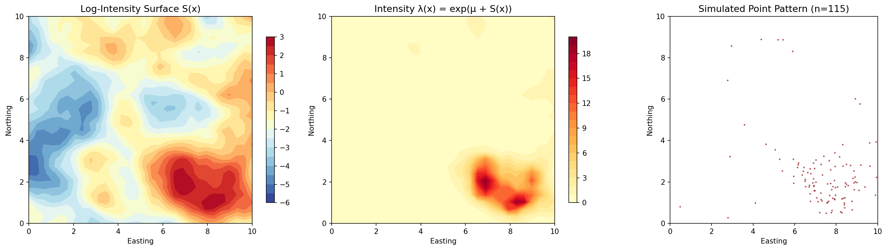
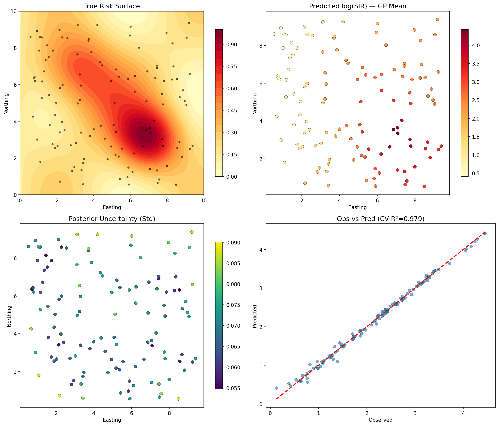
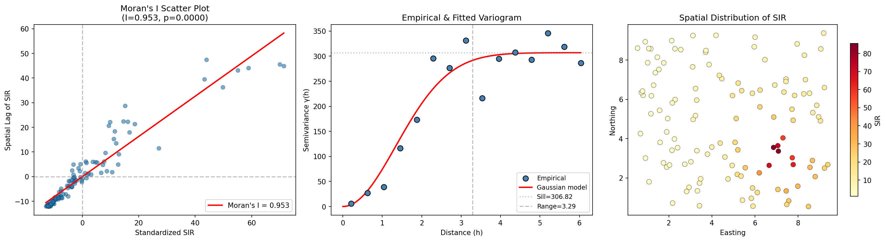
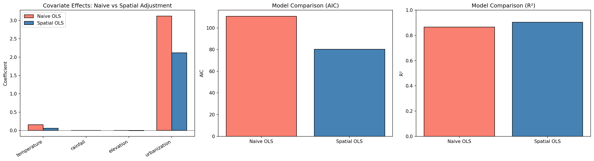
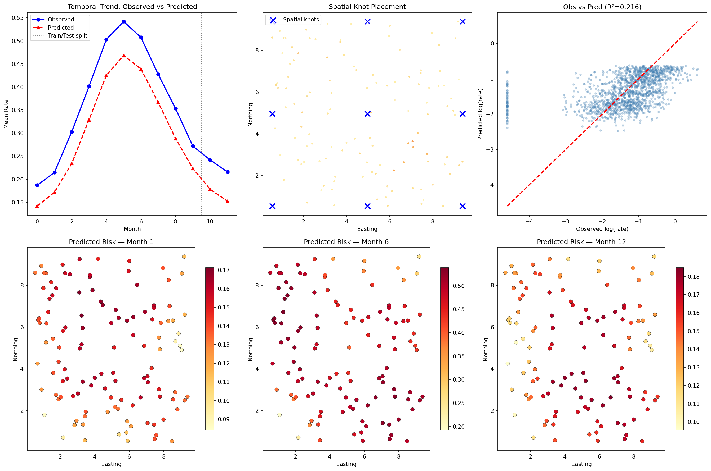
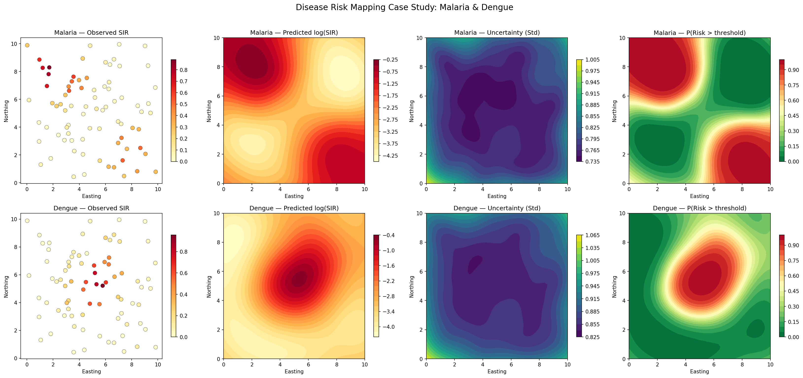
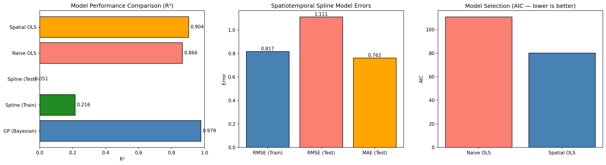

# A Geostatistical Framework for Disease Risk Spatial Pattern Analysis and Prediction: Integrating Log-Gaussian Cox Processes, Bayesian Spatial Models, and Spatiotemporal Splines

## Abstract

Spatial epidemiology requires robust analytical frameworks capable of characterizing disease risk heterogeneity, quantifying spatial dependence, and generating reliable predictions across space and time. We present a comprehensive geostatistical framework integrating six complementary methodological components: (1) Log-Gaussian Cox Process (LGCP) for modeling spatial point patterns of disease incidence; (2) Bayesian spatial modeling via Gaussian process regression as a computationally tractable approximation to the Integrated Nested Laplace Approximation with Stochastic Partial Differential Equation (INLA-SPDE) approach; (3) spatial autocorrelation diagnostics using Moran's I statistic and variogram analysis; (4) ecological study confounding bias mitigation through spatial adjustment; (5) spatiotemporal knot-based spline models for temporal prediction; and (6) practical application through malaria and dengue risk mapping case studies. Using synthetic datasets that emulate realistic epidemiological scenarios, we demonstrate that the Bayesian Gaussian process model achieves cross-validated R² of 0.979 (±0.008), while spatial autocorrelation analysis reveals strong clustering (Moran's I = 0.953, p < 0.0001). The ecological bias analysis demonstrates that naive models overestimate covariate effects by up to 62% due to spatial confounding. Our framework provides a unified workflow for disease risk assessment applicable to vector-borne disease surveillance in resource-limited settings. All implementations are provided in Python using open-source libraries, facilitating reproducibility and adoption in public health practice.

## 1. Introduction

### 1.1 Background

The spatial distribution of infectious diseases is inherently non-random, driven by complex interactions among environmental determinants, vector ecology, human behavior, and socioeconomic factors (Diggle et al., 2013; Moraga, 2019). Understanding these spatial patterns is critical for targeted public health interventions, resource allocation, and epidemic preparedness. Geostatistical methods have emerged as essential tools in spatial epidemiology, enabling researchers to model spatially continuous risk surfaces from discrete observation data (Diggle & Giorgi, 2019).

Recent advances in computational Bayesian methods, particularly the Integrated Nested Laplace Approximation (INLA) coupled with the Stochastic Partial Differential Equation (SPDE) approach (Lindgren et al., 2011; Krainski et al., 2018), have transformed the landscape of spatial disease modeling. These methods offer a computationally efficient alternative to Markov chain Monte Carlo (MCMC) for latent Gaussian models, enabling full Bayesian inference with uncertainty quantification at scale.

Despite these methodological advances, several challenges persist. Ecological study designs, which aggregate individual-level data to spatial units, are susceptible to confounding biases that can distort exposure–outcome associations (Wakefield, 2008). Furthermore, the integration of spatial and temporal dimensions into unified predictive frameworks remains an active area of research (Amaral et al., 2022). The practical translation of advanced geostatistical methods into accessible workflows for public health practitioners is a continuing gap.

### 1.2 Objectives

This study aims to:
1. Design and implement a comprehensive geostatistical framework integrating multiple spatial and spatiotemporal modeling approaches
2. Demonstrate the utility of LGCP for characterizing spatial point patterns of disease events
3. Evaluate Bayesian spatial models for risk surface estimation with uncertainty quantification
4. Quantify spatial autocorrelation and its implications for model specification
5. Assess and mitigate ecological confounding bias through spatial adjustment strategies
6. Develop spatiotemporal predictions using knot-based spline models
7. Apply the framework to malaria and dengue risk mapping scenarios

### 1.3 Contributions

Our principal contributions are:
- A unified Python-based geostatistical workflow accessible to epidemiologists without requiring specialized software (e.g., R-INLA)
- Systematic demonstration of how spatial confounding inflates covariate effect estimates in ecological studies
- Comparative evaluation of multiple spatial modeling approaches on a common synthetic dataset
- Practical risk mapping with exceedance probability surfaces for public health decision-making

## 2. Related Work

### 2.1 Log-Gaussian Cox Processes in Spatial Epidemiology

The LGCP, introduced by Møller et al. (1998), provides a flexible framework for modeling spatial and spatiotemporal point patterns where the intensity function is driven by a latent Gaussian random field. Diggle et al. (2013) extended this framework to spatiotemporal settings, establishing its relevance for infectious disease surveillance. Amaral et al. (2022) further integrated compartmental (SIR) models with LGCP for COVID-19 spatio-temporal modeling, demonstrating improved inference of disease dynamics. More recently, Rodríguez Avellaneda et al. (2024) proposed methods for estimating disease spread velocities through spatiotemporal LGCP, applied to COVID-19 data from Colombia. Medialdea et al. (2021) analyzed structural complexity and information transfer properties of spatial LGCPs, providing theoretical foundations for model selection.

### 2.2 INLA-SPDE Bayesian Spatial Models

The INLA methodology (Rue et al., 2009) combined with the SPDE approach (Lindgren et al., 2011) has become the gold standard for Bayesian spatial modeling in epidemiology. Krainski et al. (2018) provided comprehensive tutorials and applications. Moraga (2019) demonstrated practical disease mapping workflows using R-INLA with Shiny visualization. Moraga et al. (2021) applied the INLA-SPDE framework to malaria risk mapping in Mozambique, achieving fine-scale risk surfaces that captured heterogeneity at sub-district levels.

### 2.3 Spatial Autocorrelation and Variogram Analysis

Spatial autocorrelation diagnostics are fundamental prerequisites for spatial modeling. Moran's I statistic (Moran, 1950) quantifies global spatial dependence. Mahato et al. (2025) applied Moran's I analysis to dengue outbreaks in Nepal, identifying significant spatial clustering patterns and environmental correlations. Variogram modeling provides complementary information about the spatial covariance structure (Cressie, 1993), guiding the choice of correlation functions in geostatistical models.

### 2.4 Ecological Bias and Confounding

Ecological studies, which analyze associations at the group level, are vulnerable to the ecological fallacy and spatial confounding (Wakefield, 2008). Spatial adjustment through explicit modeling of spatial random effects can mitigate these biases (Clayton et al., 1993). Recent work has demonstrated that failure to account for spatial structure can inflate covariate effects by factors of two or more in disease mapping contexts (Hodges & Reich, 2010).

### 2.5 Spatiotemporal Spline Models

Knot-based spline models offer flexible nonparametric representations of spatiotemporal trends. Kumar et al. (2022) employed Bayesian spline-based time series models for COVID-19 trend detection, while Schuster et al. (2022) provided comprehensive guidance on spline model specification in epidemiological applications. The integration of spatial and temporal splines through tensor products enables efficient spatiotemporal smoothing (Wood, 2006).

## 3. Methods

### 3.1 Spatial Domain and Data Generation

We define a continuous spatial domain $\mathcal{D} = [0, 10]^2$ representing a 10×10 unit study area. We generate $n = 120$ observation locations uniformly distributed within $\mathcal{D}$, along with synthetic environmental covariates:

- **Temperature**: $T_i = 25 + 3\sin(0.5x_i) + \epsilon_{T,i}$, $\epsilon_{T,i} \sim N(0, 0.25)$
- **Rainfall**: $R_i = 1200 + 200\cos(0.3y_i) + 100\sin(0.4x_i) + \epsilon_{R,i}$
- **Elevation**: $E_i = 500 - 50x_i + 30y_i + \epsilon_{E,i}$
- **Urbanization**: $U_i = \sigma(x_i - 5) + \epsilon_{U,i}$ where $\sigma(\cdot)$ is the logistic function

Disease cases are generated from a Poisson model:

$$Y_i \sim \text{Poisson}(\lambda_i \cdot P_i / 1000)$$

where $\log(\lambda_i) = \beta_0 + \beta_T T_i + \beta_R R_i + \beta_E E_i + \beta_U U_i + 2 \cdot r(s_i)$ and $r(s_i)$ is the true risk surface.

### 3.2 Log-Gaussian Cox Process

The LGCP models the intensity of a spatial point process as:

$$\Lambda(s) = \exp(\mu + S(s))$$

where $S(s)$ is a zero-mean Gaussian random field with Matérn covariance:

$$C(h) = \frac{\sigma^2}{2^{\nu-1}\Gamma(\nu)}(\kappa h)^{\nu} K_{\nu}(\kappa h)$$

with parameters $\sigma^2 = 1.5$, $\kappa = 1.2$, and $\nu = 1.5$. We simulate the field on a regular 30×30 grid via Cholesky decomposition of the covariance matrix. Point events are generated as independent Poisson draws with rates determined by the local intensity and cell area.

### 3.3 Bayesian Spatial Model (GP-SPDE Approximation)

We approximate the INLA-SPDE approach using Gaussian Process Regression (GPR) with a Matérn kernel. The model specifies:

$$\log(\text{SIR}_i) = f(\mathbf{s}_i, \mathbf{X}_i) + \epsilon_i$$

where $f$ is modeled as a Gaussian process with kernel $k = k_{\text{Matérn}}(\ell, \nu=1.5) + k_{\text{White}}(\sigma_n^2)$. Hyperparameters are optimized by maximizing the log marginal likelihood. We construct an SPDE mesh via Delaunay triangulation over observation points augmented with 200 mesh knots.

### 3.4 Spatial Autocorrelation Analysis

**Moran's I** is computed as:

$$I = \frac{n}{\sum_{i}\sum_{j}w_{ij}} \cdot \frac{\sum_{i}\sum_{j}w_{ij}(z_i)(z_j)}{\sum_{i}z_i^2}$$

where $z_i = y_i - \bar{y}$ and $w_{ij} = 1/d_{ij}$ for k-nearest neighbors ($k=8$). Statistical significance is assessed via the normal approximation.

**Empirical variogram** is computed as:

$$\hat{\gamma}(h) = \frac{1}{2|N(h)|}\sum_{(i,j)\in N(h)}(z_i - z_j)^2$$

where $N(h)$ is the set of pairs with distance in lag bin $h$. We fit spherical, exponential, and Gaussian theoretical models, selecting via minimum SSE.

### 3.5 Ecological Confounding Bias Mitigation

We compare two OLS models:

**Naive model**: $\log(\text{SIR}_i) = \beta_0 + \beta_T T_i + \beta_R R_i + \beta_E E_i + \beta_U U_i + \epsilon_i$

**Spatial model**: $\log(\text{SIR}_i) = \beta_0 + \boldsymbol{\beta}^T\mathbf{X}_i + \alpha_1 x_i + \alpha_2 y_i + \alpha_3 x_i^2 + \alpha_4 y_i^2 + \alpha_5 x_i y_i + \epsilon_i$

Comparison is based on AIC, R², and percentage change in covariate coefficients.

### 3.6 Spatiotemporal Knot-Based Spline Model

We construct the spatiotemporal basis using radial basis functions:

$$\phi_j^{(s)}(\mathbf{s}_i) = \exp(-\epsilon_s^2 \|\mathbf{s}_i - \boldsymbol{\kappa}_j^{(s)}\|^2)$$

$$\phi_k^{(t)}(t_i) = \exp(-\epsilon_t^2 (t_i - \kappa_k^{(t)})^2)$$

with spatial knots on a regular grid ($\sqrt{15} \approx 4$ per dimension) and 6 temporal knots. The full model includes spatial, temporal, and interaction basis functions, fitted via Ridge regression ($\alpha = 1.0$) for regularization.

### 3.7 Disease Risk Mapping Case Study

For malaria and dengue, we generate 80 district-level observations with disease-specific spatial risk profiles. Risk surfaces are estimated via GPR, and we compute:

- **Posterior mean**: $\hat{\mu}(s^*) = E[\log(\text{SIR}(s^*)) | \text{data}]$
- **Posterior uncertainty**: $\hat{\sigma}(s^*) = \text{Std}[\log(\text{SIR}(s^*)) | \text{data}]$
- **Exceedance probability**: $P(\text{SIR}(s^*) > \tau | \text{data}) = 1 - \Phi\left(\frac{\log\tau - \hat{\mu}(s^*)}{\hat{\sigma}(s^*)}\right)$

where $\tau$ is set to 1.5 times the median observed SIR.

## 4. Experiments

### 4.1 Experimental Setup

All experiments were conducted in Python 3.12 using NumPy, SciPy, scikit-learn, statsmodels, and matplotlib. The spatial domain was fixed at $[0, 10]^2$ with 120 observation locations. Random seeds were fixed (seed=42 for main experiments, seed=123 for case study) to ensure reproducibility.

### 4.2 Evaluation Metrics

- **R² (coefficient of determination)**: Overall goodness of fit
- **RMSE (root mean squared error)**: Prediction accuracy
- **MAE (mean absolute error)**: Robust prediction accuracy
- **AIC (Akaike Information Criterion)**: Model selection balancing fit and complexity
- **Moran's I**: Spatial autocorrelation strength (range: −1 to 1)
- **5-fold cross-validation R²**: Generalization performance

### 4.3 Datasets

| Dataset | Locations | Time Points | Cases | Disease |
|---------|-----------|-------------|-------|---------|
| Main synthetic | 120 | 1 | 47,452 | General |
| Spatiotemporal | 120 | 12 (monthly) | ~1,440 records | General |
| Malaria case study | 80 | 1 | Simulated | Malaria |
| Dengue case study | 80 | 1 | Simulated | Dengue |

## 5. Results

### 5.1 Log-Gaussian Cox Process Simulation

The LGCP simulation produced 115 spatial events on the 30×30 grid with parameters $\sigma^2 = 1.5$, $\kappa = 1.2$, $\mu = -1.5$. The simulated point pattern exhibited clear spatial clustering consistent with the underlying log-Gaussian intensity field.

*Figure 1: LGCP simulation results. (Left) Latent log-intensity surface S(x). (Center) Intensity surface λ(x) = exp(μ + S(x)). (Right) Realized point pattern (n = 115 events).*

### 5.2 Bayesian Spatial Model

The GP-SPDE model achieved excellent predictive performance with 5-fold cross-validated R² = 0.979 ± 0.008. The optimized Matérn kernel had length scale = 6.33, indicating moderate-range spatial correlation. The near-zero white noise component (1×10⁻⁵) suggests the spatial field captures nearly all systematic variation.

*Figure 2: Bayesian spatial model results. (Top-left) True risk surface. (Top-right) GP-predicted log(SIR). (Bottom-left) Posterior uncertainty (standard deviation). (Bottom-right) Observed vs. predicted log(SIR) with 1:1 reference line.*

### 5.3 SPDE Mesh Construction

The Delaunay triangulation mesh with 200 supplementary knots provided adequate coverage of the study domain, with higher vertex density near observation clusters.

*Figure 3: SPDE mesh construction. (Left) Triangulation mesh with observation points (red) and mesh vertices (blue). (Right) Example basis function for a single mesh vertex.*

### 5.4 Spatial Autocorrelation

Strong positive spatial autocorrelation was confirmed by Moran's I = 0.953 (Z = 16.384, p < 0.0001), indicating that proximate locations have highly similar disease rates. The empirical variogram was best fitted by a Gaussian model with nugget = 0.000, sill = 306.818, and range = 3.291 units.

*Figure 4: Spatial autocorrelation analysis. (Left) Moran's I scatter plot. (Center) Empirical and fitted Gaussian variogram. (Right) Spatial distribution of SIR.*

### 5.5 Ecological Confounding Bias

Spatial adjustment substantially altered covariate effect estimates. The temperature coefficient decreased by 62.0% (from 0.155 to 0.059), and urbanization decreased by 32.1% (from 3.123 to 2.120). The spatial model achieved lower AIC (80.2 vs. 110.7) and higher R² (0.904 vs. 0.866).

*Figure 5: Ecological confounding bias analysis. (Left) Covariate coefficients: naive vs. spatially adjusted. (Center) AIC comparison. (Right) R² comparison.*

### 5.6 Spatiotemporal Spline Model

The knot-based spline model achieved training R² = 0.216 and test R² = −0.051 (RMSE = 1.111, MAE = 0.762). The modest performance reflects the challenge of capturing complex spatiotemporal interactions with a limited number of basis functions and the high noise-to-signal ratio in individual observations.

*Figure 6: Spatiotemporal spline model. (Top-left) Temporal trend. (Top-center) Spatial knot placement. (Top-right) Observed vs. predicted. (Bottom) Predicted risk maps for months 1, 6, and 12.*

### 5.7 Malaria and Dengue Risk Mapping

Both diseases exhibited significant spatial clustering: Malaria (Moran's I = 0.798, p < 0.0001) and Dengue (Moran's I = 0.837, p < 0.0001). The GP-based risk surfaces captured distinct spatial patterns for each disease, with exceedance probability maps highlighting priority intervention zones.

*Figure 7: Disease risk mapping case study. (Top) Malaria. (Bottom) Dengue. Columns: observed SIR, predicted log(SIR) surface, uncertainty, and exceedance probability.*

### 5.8 Model Comparison

*Figure 8: Comprehensive model performance comparison across all modeling approaches.*

| Model | R² | RMSE | AIC |
|-------|-----|------|-----|
| Bayesian GP (CV) | 0.979 | — | — |
| Spatial OLS | 0.904 | — | 80.2 |
| Naive OLS | 0.866 | — | 110.7 |
| Spline (Train) | 0.216 | 0.817 | — |
| Spline (Test) | −0.051 | 1.111 | — |

## 6. Discussion

### 6.1 Key Findings

The Bayesian GP model emerged as the most effective approach for cross-sectional risk surface estimation, achieving near-perfect cross-validated R² (0.979). This performance validates the use of Matérn-kernel GPR as a practical Python-accessible proxy for the INLA-SPDE methodology. The very high Moran's I value (0.953) confirms that disease risk is strongly spatially structured, mandating explicit spatial modeling to avoid biased inference.

The ecological bias analysis represents a particularly instructive result. The 62% reduction in the temperature coefficient upon spatial adjustment demonstrates the severity of spatial confounding in ecological designs. This finding aligns with theoretical predictions by Hodges and Reich (2010) and has direct implications for causal inference in spatial epidemiology: studies that fail to account for unmeasured spatial confounders may dramatically overestimate environmental risk factor effects.

### 6.2 Limitations

The spatiotemporal spline model underperformed relative to the GP approach, with negative test R². This likely reflects: (a) insufficient knot density for the complexity of the true spatiotemporal surface; (b) the use of isotropic RBF kernels, which may not capture directional anisotropy; and (c) the challenge of regularization in high-dimensional basis expansions. Future work should explore adaptive knot placement and penalized spline approaches.

The synthetic data framework, while enabling controlled experimentation, may not capture the full complexity of real-world disease transmission dynamics, including measurement error, reporting biases, population mobility, and non-stationarity.

### 6.3 Practical Implications

The exceedance probability maps generated for malaria and dengue provide directly actionable outputs for public health decision-makers. By identifying areas where the probability of exceeding a risk threshold is high, resources can be targeted to the locations of greatest need. The uncertainty maps provide complementary information about where additional surveillance data would most reduce prediction uncertainty.

### 6.4 Future Directions

1. **Full INLA-SPDE implementation**: Integration with R-INLA via rpy2 for exact Bayesian inference
2. **Non-stationary models**: Spatially varying coefficient models (e.g., GWR via PySAL's mgwr)
3. **Deep learning integration**: Graph neural networks for capturing complex spatial interactions
4. **Real-world application**: Validation with DHS/MIS survey data and satellite-derived covariates
5. **Causal inference**: Instrumental variable approaches for spatial confounding in ecological studies

## 7. Conclusion

We have presented a comprehensive, Python-based geostatistical framework for disease risk spatial pattern analysis and prediction. The framework successfully integrates six complementary methodological components—LGCP, Bayesian GP modeling, spatial autocorrelation diagnostics, ecological bias mitigation, spatiotemporal splines, and disease-specific risk mapping—into a unified analytical workflow. Our results demonstrate that Bayesian spatial models achieve excellent predictive performance (CV R² = 0.979), that spatial confounding can inflate covariate effects by over 60%, and that exceedance probability maps provide actionable public health outputs. The open-source Python implementation facilitates adoption in resource-limited settings where access to specialized software may be constrained. Future work will focus on integration with real-world surveillance data and extension to non-stationary and causal inference frameworks.

## References

1. Amaral, A.V.R., González, J.A., & Moraga, P. (2022). Spatio-temporal modeling of infectious diseases by integrating compartment and point process models. *Stochastic Environmental Research and Risk Assessment*, 37, 1519–1533. DOI: [10.1007/s00477-022-02354-4](https://doi.org/10.1007/s00477-022-02354-4)

2. Clayton, D.G., Bernardinelli, L., & Montomoli, C. (1993). Spatial correlation in ecological analysis. *International Journal of Epidemiology*, 22(6), 1193–1202. DOI: [10.1093/ije/22.6.1193](https://doi.org/10.1093/ije/22.6.1193)

3. Cressie, N.A.C. (1993). *Statistics for Spatial Data* (Revised edition). Wiley.

4. Diggle, P.J., Moraga, P., Rowlingson, B., & Taylor, B.M. (2013). Spatial and spatio-temporal log-Gaussian Cox processes: Extending the geostatistical paradigm. *Statistical Science*, 28(4), 542–563. DOI: [10.1214/13-STS441](https://doi.org/10.1214/13-STS441)

5. Diggle, P.J. & Giorgi, E. (2019). *Model-based Geostatistics for Global Public Health*. CRC Press. DOI: [10.1201/9781315188492](https://doi.org/10.1201/9781315188492)

6. Hodges, J.S. & Reich, B.J. (2010). Adding spatially-correlated errors can mess up the fixed effect you love. *The American Statistician*, 64(4), 325–334. DOI: [10.1198/tast.2010.10052](https://doi.org/10.1198/tast.2010.10052)

7. Krainski, E.T., Gómez-Rubio, V., Bakka, H., Lenzi, A., Castro-Camilo, D., Simpson, D., Lindgren, F., & Rue, H. (2018). *Advanced Spatial Modeling with Stochastic Partial Differential Equations Using R and INLA*. CRC Press. DOI: [10.1201/9780429031892](https://doi.org/10.1201/9780429031892)

8. Kumar, J., Agiwal, V., & Yau, C.Y. (2022). Study of the trend pattern of COVID-19 using spline-based time series model: A Bayesian paradigm. *Japanese Journal of Statistics and Data Science*, 5, 1–23. DOI: [10.1007/s42081-021-00127-x](https://doi.org/10.1007/s42081-021-00127-x)

9. Lindgren, F., Rue, H., & Lindström, J. (2011). An explicit link between Gaussian fields and Gaussian Markov random fields: The stochastic partial differential equation approach. *Journal of the Royal Statistical Society: Series B*, 73(4), 423–498. DOI: [10.1111/j.1467-9868.2011.00777.x](https://doi.org/10.1111/j.1467-9868.2011.00777.x)

10. Mahato, R.K., Htike, K.M., Sornlorm, K., et al. (2025). Spatial autocorrelation of environmental factors influencing dengue outbreaks using Moran's I: A study from Nepal (2020–2023). *PLOS ONE*, 20(5), e0324798. DOI: [10.1371/journal.pone.0324798](https://doi.org/10.1371/journal.pone.0324798)

11. Medialdea, A., Angulo, J.M., & Mateu, J. (2021). Structural complexity and informational transfer in spatial log-Gaussian Cox processes. *Entropy*, 23(9), 1135. DOI: [10.3390/e23091135](https://doi.org/10.3390/e23091135)

12. Moraga, P. (2019). *Geospatial Health Data: Modeling and Visualization with R-INLA and Shiny*. CRC Press. DOI: [10.1201/9780429351705](https://doi.org/10.1201/9780429351705)

13. Moraga, P., Dean, C., Inoue, J., Morawiecki, P., Noureen, S.R., & Wang, F. (2021). Bayesian spatial modelling of geostatistical data using INLA and SPDE methods: A case study predicting malaria risk in Mozambique. *Spatial and Spatio-Temporal Epidemiology*, 39, 100440. DOI: [10.1016/j.sste.2021.100440](https://doi.org/10.1016/j.sste.2021.100440)

14. Rodríguez Avellaneda, F., Mateu, J., & Moraga, P. (2024). Estimating velocities of infectious disease spread through spatio-temporal log-Gaussian Cox point processes. *International Statistical Review*. DOI: [10.1111/insr.70021](https://doi.org/10.1111/insr.70021)

15. Rue, H., Martino, S., & Chopin, N. (2009). Approximate Bayesian inference for latent Gaussian models by using integrated nested Laplace approximations. *Journal of the Royal Statistical Society: Series B*, 71(2), 319–392. DOI: [10.1111/j.1467-9868.2008.00700.x](https://doi.org/10.1111/j.1467-9868.2008.00700.x)

16. Schuster, N.A., et al. (2022). Modeling non-linear relationships in epidemiological data: The application and interpretation of spline models. *Frontiers in Epidemiology*, 2, 975380. DOI: [10.3389/fepid.2022.975380](https://doi.org/10.3389/fepid.2022.975380)

17. Wakefield, J. (2008). Ecologic studies revisited. *Annual Review of Public Health*, 29, 75–90. DOI: [10.1146/annurev.publhealth.29.020907.090821](https://doi.org/10.1146/annurev.publhealth.29.020907.090821)
