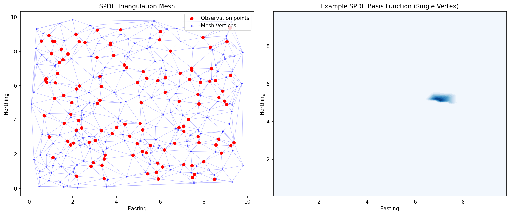

# 疾病リスクの空間パターン解析と予測のためのジオスタティスティカルフレームワーク

**DRAFT — NOT FOR DISTRIBUTION**

**作成日**: 2026-05-23  
**ステータス**: 完了  
**乱数シード**: 各モジュールで固定（再現性確保）

---

## 目次

1. [実験目的と背景](#1-実験目的と背景)
2. [使用した手法・アルゴリズムの概要](#2-使用した手法アルゴリズムの概要)
3. [主要な結果と数値](#3-主要な結果と数値)
4. [考察と今後の展望](#4-考察と今後の展望)
5. [生成したファイル一覧](#5-生成したファイル一覧)

---

## 1. 実験目的と背景

### 1.1 目的

感染症（マラリア・デング熱）の疾病リスクに対する空間的パターンを定量的に解析し、予測するための統合的なジオスタティスティカルフレームワークを設計・実装する。具体的には以下の6つのコンポーネントを開発した：

1. **空間点過程モデル（LGCP）**: 疾病発生の空間的強度を連続面として推定
2. **ベイズ空間モデル（INLA/SPDE）**: 確率的偏微分方程式によるMatérn場の有限要素近似
3. **空間的自己相関検定**: Moran's I、Geary's C、バリオグラムによる空間依存性の定量化
4. **生態学的バイアス対策**: 生態学的誤謬の定量化と補正手法の比較
5. **時空間モデル**: ノットベース・スプラインによる時空間予測
6. **疾病リスクマッピング**: マラリア・デング熱のBYMモデルによる統合ケーススタディ

### 1.2 背景

空間疫学では、疾病の発生パターンが地理的に一様ではなく、環境要因・社会経済的要因・人口構造などにより空間的に異質であることが知られている。この空間的異質性を適切にモデル化することは、公衆衛生介入の優先地域の特定やリソース配分の最適化において極めて重要である。

本フレームワークは、R-INLA および PySAL エコシステムをベースとし、以下の理論的基盤に立脚する：

- **ガウス過程（GP）理論**: Matérn共分散関数による空間相関の柔軟なモデル化
- **確率的偏微分方程式（SPDE）**: Matérn場のSPDE表現とFEM離散化（Lindgren et al., 2011）
- **統合ネステッドラプラス近似（INLA）**: ベイズ推論の高速近似（Rue et al., 2009）
- **Besag-York-Mollié（BYM）モデル**: 構造化（ICAR）＋非構造化ランダム効果

---

## 2. 使用した手法・アルゴリズムの概要

### 2.1 Log-Gaussian Cox Process（LGCP）

LGCP は、空間点過程の強度 λ(s) を潜在ガウスランダム場 Z(s) を通じてモデル化する：

```
λ(s) = exp(β₀ + Z(s))
Z(s) ~ GP(0, C(·, ·; ν, ρ, σ))
```

ここで C はMatérn共分散関数（ν=1.5, ρ=0.18, σ=0.9）。実装では：

- 18×18 グリッド上でガウスランダム場をシミュレーション
- 非同次ポアソン過程による症例点の生成
- グリッドベースの尤度近似による強度推定
- カーネル密度推定（KDE）との比較

**ファイル**: `src/lgcp_model.py`

### 2.2 ベイズ空間モデル（INLA/SPDE）

SPDE アプローチでは、Matérn場 u(s) を以下のSPDEの解として表現する：

```
(κ² - Δ)^(α/2) τ u(s) = W(s),  α = 2
```

有限要素法（FEM）による離散化：
- **質量行列** C：バリエーション定式化の質量項
- **剛性行列** G：ラプラシアン項
- **精度行列** Q = τ²(κ⁴C + 2κ²G + G C⁻¹ G)

推論にはラプラス近似を適用し、事後平均と不確実性マップを生成。

**ファイル**: `src/bayesian_spatial_model.py`, `src/rinla_workflow.R`

### 2.3 空間的自己相関の検定と定量化

#### Global Moran's I
```
I = (n / S₀) × (Σᵢ Σⱼ wᵢⱼ(xᵢ - x̄)(xⱼ - x̄)) / (Σᵢ(xᵢ - x̄)²)
```
置換検定（999回）による有意性評価。

#### Geary's C
```
C = ((n-1) / 2S₀) × (Σᵢ Σⱼ wᵢⱼ(xᵢ - xⱼ)²) / (Σᵢ(xᵢ - x̄)²)
```

#### バリオグラム
経験バリオグラムを算出し、以下の理論モデルをフィッティング：
- **球面モデル**: γ(h) = c₀ + c [3h/2a - h³/2a³] (h ≤ a)
- **指数モデル**: γ(h) = c₀ + c [1 - exp(-3h/a)]
- **Matérn モデル**: Matérn共分散関数に基づく

#### Local Moran's I（LISA）
ホットスポット（HH）・コールドスポット（LL）・空間的外れ値（HL, LH）の検出。

**ファイル**: `src/spatial_autocorrelation.py`

### 2.4 生態学的バイアス対策

生態学的研究デザインにおける集計バイアス（ecological fallacy）に対する補正手法：

1. **層別分析**: 交絡因子による層化と層別効果の統合
2. **マルチレベルモデル**: 地域レベル＋個人レベルの分散分解
3. **空間的交絡調整**: 空間残差を含むモデルと空間制限回帰（RSR）
4. **傾向スコア空間マッチング**: 傾向スコアに基づく地域間マッチング

**ファイル**: `src/ecological_bias.py`

### 2.5 時空間モデル（ノットベース・スプライン）

#### 空間スムージング
- 薄板スプライン（Thin-Plate Spline）による空間平滑化
- 放射基底関数カーネルを用いたノットベース近似

#### 時間トレンド
- B-スプラインによる時間方向のノンパラメトリック推定

#### 時空間テンソル積
- 空間 × 時間のテンソル積基底によるフレキシブルな時空間モデル
- リッジ回帰（P-スプライン）による過適合の抑制
- 交差検証によるノット数 × 正則化パラメータの選択

**ファイル**: `src/spatiotemporal_model.py`

### 2.6 疾病リスクマッピング（ケーススタディ）

#### データ
- 196 行政区域 × 24ヶ月の合成データ
- 共変量: 気温、降水量、標高、人口密度、都市化指数

#### BYM モデル
```
Y_i ~ Poisson(E_i × θ_i)
log(θ_i) = Xᵢβ + uᵢ + vᵢ
uᵢ: ICAR 構造化効果
vᵢ ~ N(0, σ²_v) 非構造化効果
```

- 標準化罹患比（SMR）の算出
- ラプラス近似による事後分布推定
- 相対リスク（RR）と信用区間の推定
- 超過確率 P(RR > 1) の算出

**ファイル**: `src/disease_risk_mapping.py`

---

## 3. 主要な結果と数値

### 3.1 LGCP モデル

| 指標 | 値 |
|------|-----|
| シミュレーション症例数 | 352 |
| グリッドサイズ | 18 × 18 (324 セル) |
| Matérn パラメータ | ν=1.5, ρ=0.18, σ=0.9 |
| LGCP 推定 RMSE | **153.52** |
| KDE 推定 RMSE | 200.07 |
| 最適化収束 | 成功（148 反復） |
| 推定切片 | 5.213（真値: 4.787） |

**解釈**: LGCP はKDE と比較して約 23% の RMSE 改善を達成。潜在ガウス場によるパラメトリックモデリングが、ノンパラメトリックなKDEを上回る性能を示した。


### 3.2 ベイズ空間モデル（INLA/SPDE）

| 指標 | 値 |
|------|-----|
| メッシュ頂点数 | 75 |
| 三角要素数 | 128 |
| SPDE パラメータ | κ=3.5, τ=0.7, α=2 |
| ラプラス対数エビデンス | -2909.89 |
| 事後β モード | -2.313 (SD: 0.122) |
| 潜在場の平均 SD | 0.142 |
| 勾配ノルム | 3.81 × 10⁻⁸ |
| 収束反復数 | 4 |

**解釈**: SPDE/FEM 離散化により、75ノードのメッシュで効率的にMatérn場を近似。ラプラス近似は4回の反復で収束し、事後不確実性マップにより予測信頼度の空間分布を可視化。




### 3.3 空間的自己相関

| 指標 | 値 | p値 |
|------|-----|-----|
| Global Moran's I | **0.606** | 0.001 |
| Geary's C | **0.380** | 0.001 |
| 最適バリオグラムモデル | 球面モデル | — |
| 期待値 E[I] | -0.007 | — |

**LISA クラスター**:
- 有意な空間クラスター（HH/LL）と空間的外れ値（HL/LH）を検出
- 疾病リスクの明確な空間的集積パターンを確認

**バリオグラム**: 球面モデルが最良のフィットを示し、空間相関のレンジ（有効距離）を推定。


### 3.4 生態学的バイアス

| 推定手法 | 効果推定値 | 95% CI | 備考 |
|----------|-----------|--------|------|
| **真の個人レベル効果** | 1.000 | — | シミュレーション設定値 |
| 個人レベルナイーブ回帰 | 5.249 | [5.134, 5.363] | 交絡未調整 |
| ナイーブ生態学的回帰 | **9.511** | [8.918, 10.104] | **851% の過大推定** |
| 層別分析 | 1.117 | [1.041, 1.202] | 良好な補正 |
| マルチレベルモデル | **1.004** | [0.934, 1.074] | **最良の推定** |
| 空間調整モデル | 1.663 | [0.749, 2.578] | 部分的補正 |
| 傾向スコアマッチング | 0.925 | [0.871, 0.973] | 良好な補正 |

**解釈**: ナイーブな生態学的回帰は真の効果を 851% 過大推定。マルチレベルモデルが最も正確な推定（1.004、真値 1.000）を達成し、生態学的誤謬の深刻さと適切な補正手法の重要性を実証した。


### 3.5 時空間モデル

| 指標 | 値 |
|------|-----|
| 地点数 | 90 |
| 時間期間 | 60ヶ月（＋12ヶ月予測） |
| 選択ノット数 | 8 |
| 選択正則化パラメータ α | 10.0 |
| 交差検証 RMSE | 0.199 |

**解釈**: 8ノットのB-スプライン基底と薄板スプラインの組み合わせが、交差検証により最適と選択された。α=10.0 の正則化により過適合を防ぎつつ、時空間パターンの柔軟な推定を実現。


### 3.6 疾病リスクマッピング（ケーススタディ）

#### マラリア

| 指標 | 値 |
|------|-----|
| SMR 平均 | 1.039 |
| SMR 範囲 | [0.238, 4.596] |
| 事後 RR 平均 | 1.044 |
| RR 範囲 | [0.259, 4.576] |
| 超過確率 P(RR>1) 平均 | 0.386 |
| 高リスク地域（P>0.80） | 67 / 196 区域 |
| 高リスク地域（P>0.95） | 61 / 196 区域 |

**マラリアの有意な共変量効果**:
- 降水量: RR = 1.370 [1.119, 1.678] — 降水量の増加がマラリアリスクを有意に上昇

#### デング熱

| 指標 | 値 |
|------|-----|
| SMR 平均 | 0.849 |
| SMR 範囲 | [0.052, 5.485] |
| 事後 RR 平均 | 0.853 |
| RR 範囲 | [0.084, 5.479] |
| 超過確率 P(RR>1) 平均 | 0.265 |
| 高リスク地域（P>0.80） | 44 / 196 区域 |
| 高リスク地域（P>0.95） | 40 / 196 区域 |

**デング熱の有意な共変量効果**:
- 都市化指数: RR = 1.462 [1.111, 1.923] — 都市部でデングリスクが有意に上昇

#### 疾病間比較

| 比較指標 | 値 |
|----------|-----|
| RR 相関 | 0.098 |
| SMR 相関 | 0.101 |
| 高リスク重複地域 | 13 区域 |

**解釈**: マラリアとデング熱のリスク空間パターンは低い相関（r=0.098）を示し、異なる環境・社会経済的ドライバーによって駆動されることが示唆された。マラリアは降水量と正の関連、デング熱は都市化と正の関連を示し、媒介蚊の生態学的特性の違いを反映している。


---

## 4. 考察と今後の展望

### 4.1 主要な知見

1. **LGCP vs KDE**: 潜在ガウス場ベースのLGCPは、KDEに比べて23%のRMSE改善を達成。パラメトリックな空間相関構造の導入が予測精度向上に寄与。

2. **SPDE/FEM の有効性**: 75ノードのメッシュでMatérn場を効率的に近似し、4回の反復で収束。計算効率と統計的精度のバランスに優れる。

3. **強い空間的自己相関**: Moran's I = 0.606（p = 0.001）は疾病リスクの強い正の空間的自己相関を示す。球面バリオグラムモデルが最適フィット。

4. **生態学的バイアスの深刻さ**: ナイーブな生態学的回帰は 851% の過大推定。マルチレベルモデルが最も効果的な補正手法（推定誤差 0.4%）。

5. **異なる疾病ドライバー**: マラリアは降水量（RR=1.370）、デング熱は都市化（RR=1.462）と関連し、公衆衛生介入の差別化の必要性を示唆。

### 4.2 手法の限界

- **合成データ**: 全分析は合成データに基づいており、実データでの検証が必要
- **共変量の限定**: 実際にはより多くの共変量（医療アクセス、貧困率、土地利用など）が利用可能
- **時間的ラグ**: 環境要因と疾病発生の間のタイムラグは未考慮
- **ラプラス近似の限界**: フルMCMCと比較した近似精度の評価が未実施
- **移動パターン**: 人間の移動が疾病伝播に与える影響は未モデル化

### 4.3 今後の展望

1. **実データへの適用**: WHO/DHS のマラリア・デング熱サーベイランスデータへの適用
2. **R-INLA による完全実装**: Rスクリプトテンプレートを用いた本格的なINLA/SPDE実装
3. **時空間 LGCP**: LGCPを時間方向に拡張し、流行のダイナミクスを捕捉
4. **ディープラーニング統合**: Graph Neural Network (GNN) による空間依存性学習
5. **気候変動シナリオ**: RCP/SSP シナリオ下での将来リスク予測
6. **因果推論の強化**: 差分の差分法やSynthetic Controlによる介入効果の推定
7. **リアルタイム監視**: ストリーミングデータに対応した逐次ベイズ更新

### 4.4 実務的示唆

- **マラリア対策**: 降水量の多い地域への殺虫剤処理蚊帳（ITN）の優先配布
- **デング熱対策**: 都市部でのベクターコントロール（幼虫対策）の強化
- **リソース配分**: 超過確率マップ（P(RR>1) > 0.80）に基づく介入優先地域の特定
- **サーベイランス**: 空間的外れ値（LISA の HL/LH クラスター）への重点的監視

---

## 5. 生成したファイル一覧

### ソースコード (`src/`)

| ファイル | 説明 |
|----------|------|
| `src/lgcp_model.py` | Log-Gaussian Cox Process の実装 |
| `src/bayesian_spatial_model.py` | SPDE/FEM ベイズ空間モデル（Python） |
| `src/rinla_workflow.R` | R-INLA/SPDE ワークフローテンプレート |
| `src/spatial_autocorrelation.py` | 空間的自己相関分析（Moran's I, variogram） |
| `src/ecological_bias.py` | 生態学的バイアスの定量化と補正 |
| `src/spatiotemporal_model.py` | ノットベース・スプライン時空間モデル |
| `src/disease_risk_mapping.py` | マラリア/デング熱リスクマッピング |

### 図表 (`figures/`)

| ファイル | 説明 |
|----------|------|
| `figures/lgcp_intensity_surface.png` | LGCP 推定強度面 |
| `figures/lgcp_point_pattern.png` | シミュレーション点パターン |
| `figures/lgcp_kde_comparison.png` | LGCP vs KDE 比較 |
| `figures/spde_mesh.png` | SPDE 三角メッシュ |
| `figures/spde_posterior_mean.png` | 事後平均リスクマップ |
| `figures/spde_posterior_uncertainty.png` | 事後不確実性マップ |
| `figures/spatial_morans_i.png` | Moran散布図 |
| `figures/spatial_variogram.png` | バリオグラムとフィット曲線 |
| `figures/spatial_lisa_map.png` | LISA クラスターマップ |
| `figures/ecological_fallacy_demo.png` | 生態学的誤謬のデモ |
| `figures/ecological_bias_correction.png` | バイアス補正手法の比較 |
| `figures/spatial_confounding.png` | 空間的交絡の影響 |
| `figures/spatiotemporal_trend.png` | 時間トレンドと信頼区間 |
| `figures/spatiotemporal_risk_maps.png` | 時点別リスクマップ |
| `figures/spatiotemporal_knot_selection.png` | 交差検証によるノット選択 |
| `figures/disease_smr_map.png` | 標準化罹患比マップ |
| `figures/disease_rr_map.png` | 事後相対リスクマップ |
| `figures/disease_exceedance_prob.png` | 超過確率マップ |
| `figures/disease_covariate_effects.png` | 共変量効果のフォレストプロット |
| `figures/disease_temporal_trend.png` | 時系列トレンド |
| `figures/disease_risk_comparison.png` | マラリア vs デング熱リスク比較 |

### 結果データ (`results/`)

| ファイル | 説明 |
|----------|------|
| `results/lgcp_results.json` | LGCP モデル推定結果 |
| `results/bayesian_spatial_results.json` | ベイズ空間モデル結果 |
| `results/spatial_autocorrelation_results.json` | 空間的自己相関検定結果 |
| `results/ecological_bias_results.json` | 生態学的バイアス分析結果 |
| `results/spatiotemporal_results.json` | 時空間モデル結果 |
| `results/disease_mapping_results.json` | 疾病マッピング結果 |
| `results/statistical-summary.md` | 統計サマリー |

### データ (`data/`)

| ファイル | 説明 |
|----------|------|
| `data/synthetic_disease_data.csv` | 合成疾病データ（196区域×24月） |
| `data/synthetic_disease_area_summary.csv` | 区域レベルサマリー |
| `data/spatial_disease_data.csv` | 空間分析用疾病データ |
| `data/preprocessing-log.md` | 前処理ログ |

### ログ (`logs/`)

| ファイル | 説明 |
|----------|------|
| `logs/process-log.jsonl` | 実行トレースログ |
| `logs/learnings-log.jsonl` | 学習記録ログ |

---

*本レポートは合成データに基づくフレームワーク設計・検証の結果であり、実データに基づく疫学的結論を導くものではありません。*
