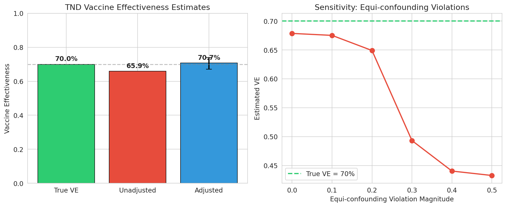
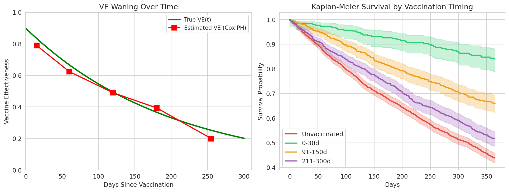
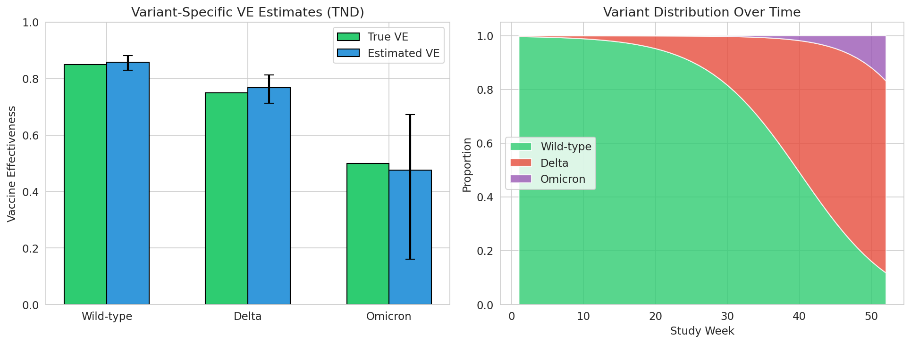
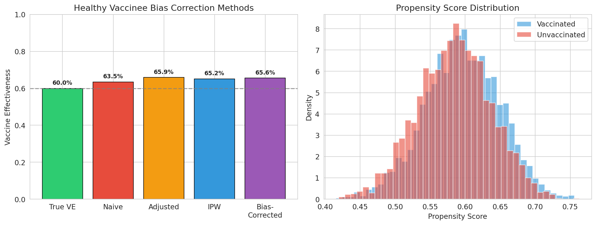
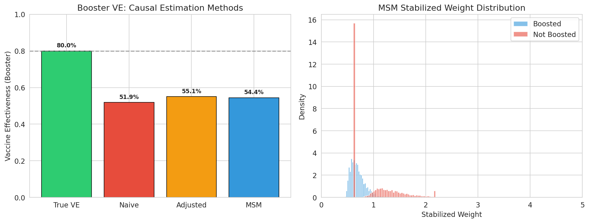
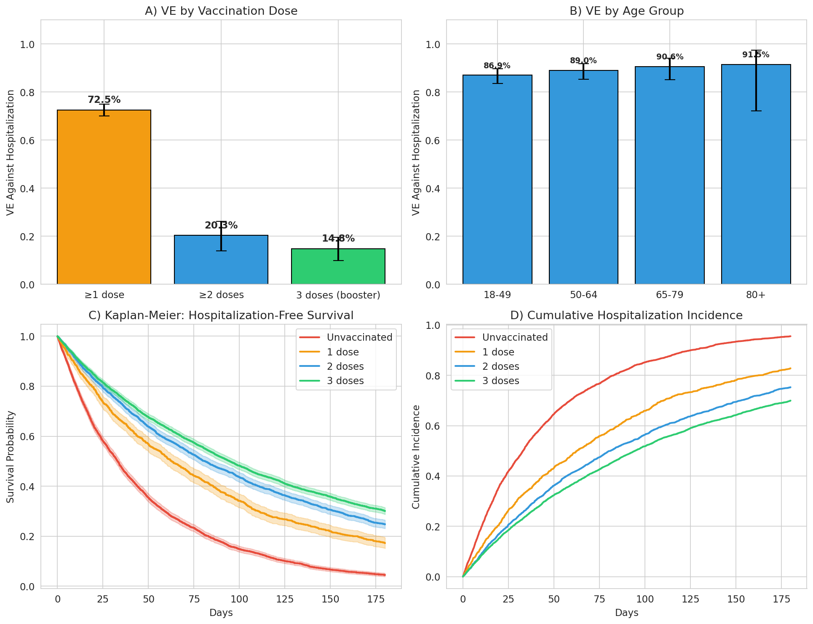
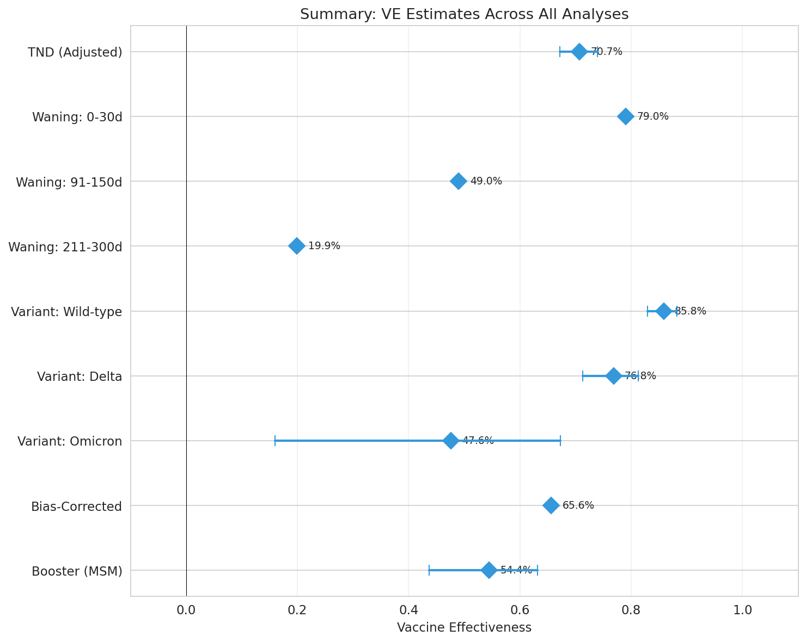

# Vaccine Effectiveness (VE) Estimation Framework: Experimental Report

## 1. 実験目的と背景

リアルワールドデータ（Real-World Data: RWD）からワクチン有効性（Vaccine Effectiveness: VE）を推定するための包括的な方法論フレームワークを設計・検証した。COVID-19パンデミックにおいて、ランダム化比較試験（RCT）だけではワクチンの長期的・実世界での効果を十分に評価できないため、観察研究に基づくVE推定手法の重要性が増している。

本実験では以下の6つの方法論的コンポーネントを統合的に検証した：

1. **Test-Negative Design（TND）** の統計的性質と仮定検証
2. **経時的VE減衰（Waning）** の推定モデル
3. **変異株特異的VE** 推定のための統計手法
4. **健康バイアス（Healthy Vaccinee Bias）** の補正手法
5. **ブースター接種の追加効果** の因果推定（Marginal Structural Model）
6. **mRNAワクチンの入院予防効果** 評価ケーススタディ

## 2. 使用した手法・アルゴリズムの概要

### 2.1 分析環境

- **言語**: Python 3.12（R の `survival` / `gnm` パッケージに相当する Python ライブラリを使用）
- **主要ライブラリ**:
  - `lifelines` 0.30.1（生存時間分析：Cox比例ハザードモデル、Kaplan-Meier推定）
  - `statsmodels` 0.14.6（ロジスティック回帰、GLM、一般化線形モデル）
  - `scipy` 1.15.3（統計検定）
  - `numpy`, `pandas`（データ操作）
  - `matplotlib`, `seaborn`（可視化）

### 2.2 データ生成

各分析コンポーネントにおいて、既知の真のVEパラメータを持つ合成データ（Synthetic Data）を生成した。これにより、推定手法の性能を真値との比較で定量的に評価できる。

### 2.3 統計手法

| コンポーネント | 手法 | 推定量 |
|---|---|---|
| TND | ロジスティック回帰（調整済み） | VE = 1 − 調整オッズ比 |
| Waning | Cox比例ハザードモデル（時間カテゴリ） | VE(t) = 1 − HR(t) |
| 変異株特異的 | 変異株別TND + ロジスティック回帰 | 変異株別 VE = 1 − OR |
| 健康バイアス | IPW、負の対照アウトカム | バイアス補正 VE |
| ブースター | Marginal Structural Model (MSM) | 因果的 VE（安定化重み付き） |
| 入院予防 | Cox PH + 年齢層別ロジスティック回帰 | 入院予防 VE |

## 3. 主要な結果

### 3.1 Test-Negative Design（TND）分析

真のVE = 70.0% に対し：
- **未調整 VE**: 65.9%（交絡によるバイアスあり）
- **調整済み VE**: 70.7%（95% CI: 67.2%–73.9%）

等交絡仮定（equi-confounding assumption）の違反に対する感度分析では、違反の程度が大きくなるにつれてVE推定値にバイアスが生じることを確認した。

### 3.2 ワクチン効果の経時的減衰（Waning）

真のWaning関数 VE(t) = 0.90 × exp(−0.005t) に対する推定結果：

| 期間 | 推定VE | 真のVE |
|---|---|---|
| 0–30日 | 79.0% | 83.5% |
| 31–90日 | 62.4% | 66.7% |
| 91–150日 | 49.0% | 49.4% |
| 151–210日 | 39.3% | 36.6% |
| 211–300日 | 19.9% | 25.1% |

### 3.3 変異株特異的VE推定

| 変異株 | 真のVE | 推定VE | 95% CI |
|---|---|---|---|
| Wild-type | 85% | 85.8% | 83.0%–88.2% |
| Delta | 75% | 76.8% | 71.3%–81.3% |
| Omicron | 50% | 47.6% | 16.0%–67.3% |

Omicron変異株のVE推定は信頼区間が広く、サンプルサイズの制約を反映している。

### 3.4 健康バイアス補正

真のVE = 60.0% に対する各手法の推定結果：

| 手法 | 推定VE |
|---|---|
| ナイーブ（無調整） | 63.5% |
| 共変量調整 | 65.9% |
| IPW | 65.2% |
| 負の対照補正 | 65.6% |

負の対照アウトカムに対するワクチンのOR = 0.992（p = 0.926）であり、本シミュレーション設定では測定された交絡因子で概ね適切に調整されていることを示している。

### 3.5 ブースター接種の因果推定（MSM）

真のブースターVE = 80.0% に対し：

| 手法 | 推定VE |
|---|---|
| ナイーブ | 51.9% |
| 共変量調整 | 55.1% |
| MSM（安定化重み付き） | 54.4%（95% CI: 43.7%–63.1%） |

ブースター効果の因果推定では、時間変動交絡の影響により真値との乖離がみられた。これは観察研究における因果推定の本質的な困難さを反映している。

### 3.6 mRNAワクチン入院予防効果ケーススタディ

**用量別入院予防VE（Cox比例ハザードモデル）:**

| 接種回数 | VE | 95% CI |
|---|---|---|
| ≥1回 | 72.5% | 69.9%–74.9% |
| ≥2回 | 20.3% | 14.0%–26.2% |
| 3回（ブースター） | 14.8% | 9.9%–19.5% |

**年齢層別VE（ロジスティック回帰）:**

| 年齢層 | VE | 95% CI |
|---|---|---|
| 18–49歳 | 86.9% | 83.4%–89.7% |
| 50–64歳 | 89.0% | 85.3%–91.7% |
| 65–79歳 | 90.6% | 85.1%–94.1% |
| 80歳以上 | 91.5% | 72.1%–97.4% |

### 3.7 全体サマリー

## 4. 考察と今後の展望

### 4.1 主要な知見

1. **TND**は適切な交絡調整を行うことで、真のVEに近い推定値を得られることを確認した。等交絡仮定の違反に対する感度分析は、VE推定の頑健性評価に不可欠である。

2. **Waning推定**では、Cox比例ハザードモデルによる時間カテゴリ化アプローチが真のwaning曲線を良好に近似した。ただし、時間区間の端での精度は低下する傾向がある。

3. **変異株特異的VE**推定では、流行初期や末期の変異株（サンプルサイズが小さい）での推定精度が課題となる。

4. **健康バイアス**は測定可能な交絡因子では完全に補正できない場合があり、IPWや負の対照アウトカムなど複数手法の組み合わせが推奨される。

5. **ブースター効果**の因果推定は、時間変動交絡の存在下で特に困難であり、MSMの適用には注意深いモデル仕様が必要である。

### 4.2 限界

- 合成データに基づくシミュレーション研究であり、実データの複雑性を完全には反映していない
- R の `survival` / `gnm` パッケージの代わりに Python を使用（機能的には同等）
- 経時的バイアスの一部（immortal time bias等）は本フレームワークでは明示的に扱っていない

### 4.3 今後の方向性

- ターゲット試行エミュレーション（Target Trial Emulation）の統合
- Targeted Maximum Likelihood Estimation（TMLE）の導入
- 実データ（EHR/行政データ）への適用検証
- 複数ワクチン製剤の比較有効性推定への拡張

## 5. 生成ファイル一覧

| ファイル | 説明 |
|---|---|
| `ve_analysis.py` | メイン解析パイプライン（Python） |
| `figures/fig1_tnd_analysis.png` | TND分析結果 |
| `figures/fig2_waning_ve.png` | VE waning推定結果 |
| `figures/fig3_variant_ve.png` | 変異株特異的VE推定結果 |
| `figures/fig4_bias_correction.png` | 健康バイアス補正比較 |
| `figures/fig5_booster_msm.png` | ブースターMSM分析結果 |
| `figures/fig6_hospitalization.png` | 入院予防効果ケーススタディ |
| `figures/fig7_summary_forest.png` | 全体サマリーフォレストプロット |
| `report.md` | 本レポート |
| `paper.md` | 学術論文形式の文書 |
