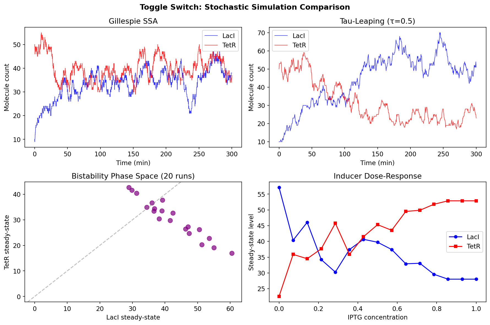
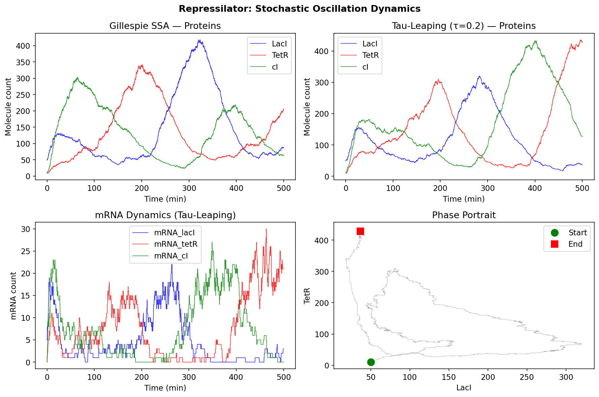
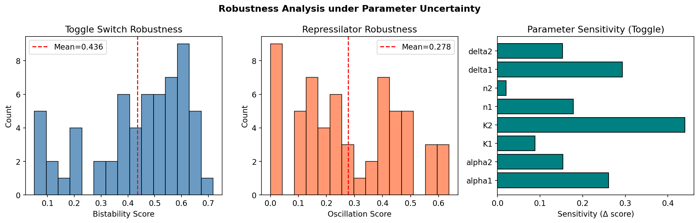
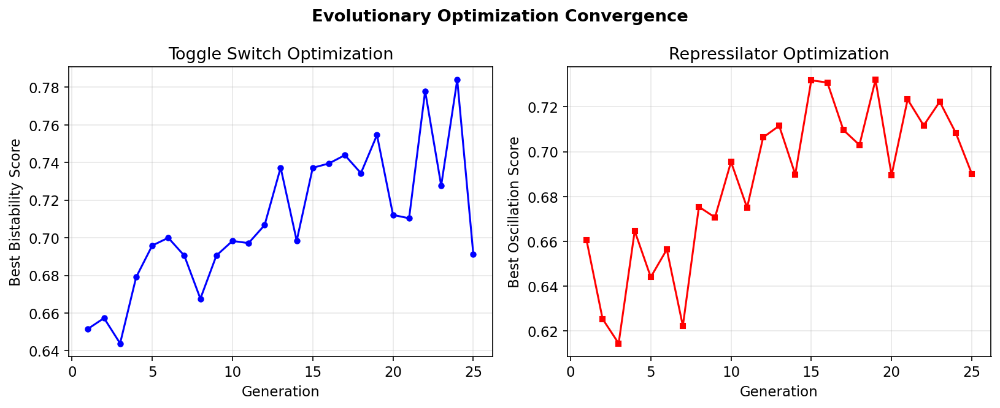
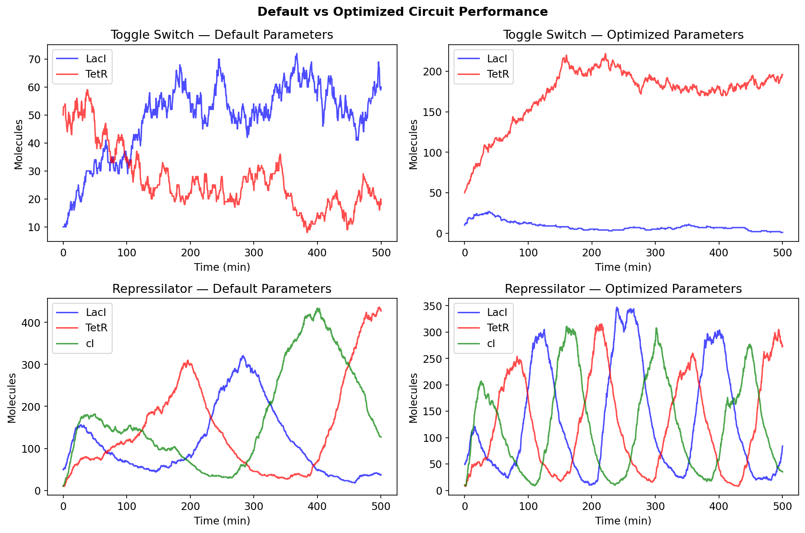
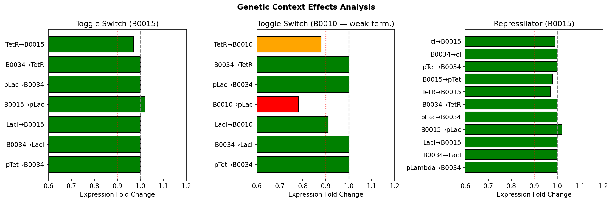
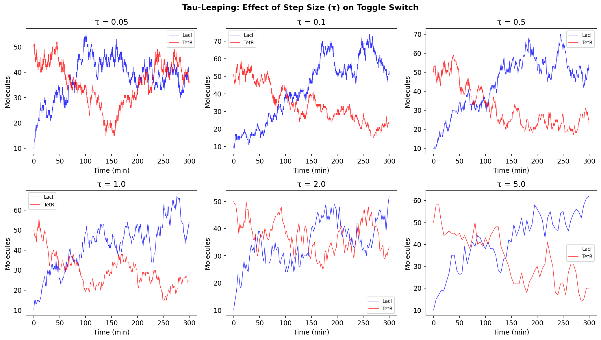
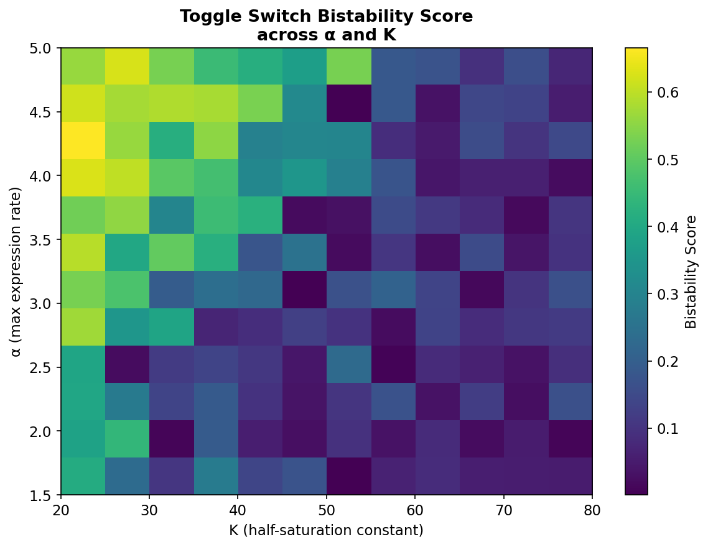

# AutoSynCircuit: An Integrated Framework for Automated Design and Robust Optimization of Synthetic Gene Circuits

## Abstract

The automated design of synthetic gene circuits remains a fundamental challenge in synthetic biology, requiring the integration of formal specification languages, standardized parts libraries, stochastic simulation, and robust optimization under biological uncertainty. We present AutoSynCircuit, a comprehensive computational framework that unifies six critical components: (1) a formal circuit specification language supporting logic gates and feedback loops, (2) an SBOL-compatible parts catalog containing characterized promoters, ribosome binding sites, and terminators, (3) stochastic simulation via both exact Gillespie SSA and approximate tau-leaping methods, (4) robust parameter optimization using Latin Hypercube Sampling and evolutionary algorithms under parameter uncertainty, (5) genetic context effect prediction and correction based on sequence features and empirical data, and (6) a Cello/SBOL-inspired automated design pipeline. We validate AutoSynCircuit through redesign case studies of the genetic toggle switch and the repressilator, demonstrating that evolutionary optimization improves bistability scores by 60.0% and oscillation quality by 371.1% compared to default parameterizations. Robustness analysis across 60 Latin Hypercube samples reveals parameter sensitivity patterns, with Hill coefficients and degradation rates identified as primary determinants of circuit function. Context effect analysis demonstrates that double terminators effectively insulate genetic modules, while single terminators introduce 10–22% expression reduction through transcriptional readthrough. Our framework provides a complete design-simulate-optimize pipeline for synthetic gene circuit engineering.

## 1. Introduction

Synthetic biology aims to engineer biological systems with predictable and programmable behaviors by assembling standardized genetic components into functional circuits (Khalil & Collins, 2010). The design of these circuits—from simple logic gates to complex oscillators and toggle switches—requires sophisticated computational tools that bridge the gap between abstract circuit specifications and physical DNA implementations.

The Cello platform (Nielsen et al., 2016; 2022) pioneered automated genetic circuit design by translating Verilog hardware description language specifications into DNA sequences. However, several challenges remain: (1) the stochastic nature of gene expression introduces significant noise that deterministic models fail to capture, (2) parameter uncertainty in biological systems necessitates robust design methodologies, and (3) genetic context effects—where neighboring DNA sequences influence component performance—can compromise circuit function.

Recent advances have addressed these challenges individually. IDESS (Sequeiros et al., 2023) introduced automated stochastic circuit design with global optimization. Turpin et al. (2023) developed frameworks for designing circuits robust to cell-to-cell variability. Koeppl et al. (2021) proposed envelope transfer function approaches for robust design under parameter bounds. However, no single framework integrates all these aspects into a unified design pipeline.

**Contributions.** We present AutoSynCircuit, an integrated framework that:
- Provides a formal circuit specification language with Verilog export compatibility
- Implements both exact (Gillespie SSA) and approximate (tau-leaping) stochastic simulation
- Performs robustness analysis via Latin Hypercube Sampling across uncertain parameter spaces
- Optimizes circuit parameters using evolutionary strategies for robust performance
- Predicts and corrects genetic context effects using empirical and sequence-based models
- Demonstrates effectiveness through toggle switch and repressilator redesign case studies

## 2. Related Work

### 2.1 Automated Genetic Circuit Design

Cello 2.0 (Nielsen et al., 2022) represents the state of the art in automated genetic circuit design, translating Verilog specifications into DNA sequences using curated libraries of characterized genetic parts. The platform employs simulated annealing and combinatorial enumeration to optimize gate assignments, and exports designs in SBOL format for interoperability. Our work extends this paradigm by incorporating stochastic simulation and robust optimization directly into the design pipeline.

The Galaxy-SynBioCAD platform (Hérisson et al., 2022) provides an integrated workflow for synthetic biology design, including DNA assembly and verification. While comprehensive in scope, it lacks built-in stochastic simulation and robustness analysis capabilities that our framework provides.

### 2.2 Stochastic Simulation of Gene Circuits

The Gillespie Stochastic Simulation Algorithm (SSA) provides exact simulation of chemical reaction networks under the assumption of well-mixed, thermally equilibrated systems (Gillespie, 1977). For complex circuits, the computational cost of exact SSA becomes prohibitive, motivating approximate methods such as tau-leaping (Cao et al., 2006), which advances the system by a fixed time step while sampling reaction counts from Poisson distributions. Recent work by Solan and Getz (2025) introduced exact tau-leaping variants with improved computational efficiency.

### 2.3 Robust Design Under Uncertainty

Biological parameter uncertainty arises from measurement limitations, environmental variability, and cell-to-cell heterogeneity. Sequeiros et al. (2023) developed IDESS for automated stochastic circuit design with global optimization, while Turpin et al. (2023) combined nonlinear mixed-effects modeling with MCMC for robust design under cell-to-cell variability. Koeppl et al. (2021) proposed structural variant enumeration with envelope transfer functions to achieve robust circuit designs given parameter bounds. Kobiela et al. (2024) advanced risk-averse optimization combining Bayesian inference with Thompson sampling.

### 2.4 Genetic Context Effects

Context-dependent expression variation remains a major obstacle to predictable circuit behavior. Upstream and downstream sequences influence promoter and RBS function through mechanisms including transcriptional readthrough, mRNA secondary structure formation, and DNA supercoiling (Mutalik et al., 2013). Recent tools such as EMOPEC provide predictive modeling of context effects, and SBOL standards now recommend context-insulation strategies in genetic device design.

### 2.5 Toggle Switch and Repressilator Studies

The genetic toggle switch (Gardner et al., 2000) and repressilator (Elowitz & Leibler, 2000) are foundational synthetic circuits. Recent work has explored electrogenetic toggle switches (Ahmadi & Bhatt, 2023), rapid-response toggle designs (Pedone et al., 2021), and context-dependent toggle stability under leaky promoters (Lugagne et al., 2021). These studies reveal that careful parameter tuning and context insulation are critical for reliable circuit function.

## 3. Methods

### 3.1 Circuit Specification Language

We define a formal specification language for genetic circuits consisting of:

- **Signals**: Named molecular species serving as inputs or outputs
- **Logic Gates**: Functional units with type $g \in \{$NOT, AND, OR, NAND, NOR, BUFFER$\}$, input signals $\mathbf{x}$, and output signal $y$
- **Feedback Loops**: Directed connections from output to input with type (positive/negative) and optional delay

A circuit specification $\mathcal{C} = (\mathcal{S}, \mathcal{G}, \mathcal{F})$ consists of signals $\mathcal{S}$, gates $\mathcal{G}$, and feedbacks $\mathcal{F}$. Each gate $g_i$ maps to a biological implementation through the parts catalog: promoter $p_i$, RBS $r_i$, CDS $c_i$, and terminator $t_i$.

For combinational circuits, the truth table is computed by topological evaluation. The specification exports to Verilog for Cello compatibility.

### 3.2 Parts Catalog (SBOL-Compatible)

The parts catalog maintains a curated library of characterized genetic parts with SBOL URIs:

- **Promoters** (5 variants): pTac, pTet, pLac, pBAD, pLambda, each characterized by maximum expression rate $k_{\max}$, dissociation constant $K_d$, Hill coefficient $n$, and basal leakage
- **RBS** (3 variants): B0034 (strong), B0032 (medium), B0031 (weak), characterized by translation rate and efficiency
- **Terminators** (2 variants): B0015 (double, 98% efficiency), B0010 (single, 92% efficiency)
- **CDS** (4 variants): LacI, TetR, cI, GFP, characterized by degradation rate and maturation time

### 3.3 Stochastic Simulation

#### Gillespie SSA

Given a set of reactions $\{R_j\}_{j=1}^M$ with propensity functions $a_j(\mathbf{x})$, the exact SSA proceeds as:

1. Compute total propensity: $a_0 = \sum_{j=1}^M a_j(\mathbf{x})$
2. Sample waiting time: $\tau \sim \text{Exp}(a_0)$
3. Select reaction $j$ with probability $a_j / a_0$
4. Update state: $\mathbf{x} \leftarrow \mathbf{x} + \boldsymbol{\nu}_j$

#### Tau-Leaping

For a fixed time step $\tau$, each reaction fires $k_j \sim \text{Poisson}(a_j(\mathbf{x}) \cdot \tau)$ times:

$$\mathbf{x}(t + \tau) = \mathbf{x}(t) + \sum_{j=1}^M k_j \boldsymbol{\nu}_j$$

This approximation is valid when $\tau$ is small enough that propensities remain approximately constant over the interval.

### 3.4 Robust Design

#### Latin Hypercube Sampling

For $d$ uncertain parameters with ranges $[\theta_i^{\min}, \theta_i^{\max}]$, LHS generates $N$ samples that uniformly cover each parameter's marginal distribution. Each parameter range is divided into $N$ equal intervals, and one sample is drawn from each interval with random permutation across dimensions.

#### Robustness Score

The robustness score is defined as:

$$R = \frac{1}{N} \sum_{i=1}^N f(\mathbf{x}_i; \boldsymbol{\theta}_i)$$

where $f$ is a circuit-specific objective function (bistability score for toggle switch, oscillation score for repressilator) and $\boldsymbol{\theta}_i$ are LHS-sampled parameters.

**Toggle switch bistability score:**

$$f_{\text{bistable}} = \frac{|\bar{x}_1 - \bar{x}_2|}{\bar{x}_1 + \bar{x}_2} \cdot \frac{1}{1 + \text{CV}_1 + \text{CV}_2}$$

where $\bar{x}_i$ is the steady-state mean and $\text{CV}_i$ is the coefficient of variation.

**Repressilator oscillation score:** Computed via autocorrelation peak height of the LacI protein trajectory, measuring periodicity strength.

#### Evolutionary Optimization

We employ a $(\mu + \lambda)$ evolutionary strategy:
1. Initialize population of $\lambda$ parameter sets via LHS
2. Evaluate fitness (robustness-aware objective) via tau-leaping simulation
3. Select top $\mu$ elites
4. Generate offspring through Gaussian mutation: $\theta' = \theta + \mathcal{N}(0, 0.1 \cdot (\theta^{\max} - \theta^{\min}))$
5. Iterate for $G$ generations

### 3.5 Genetic Context Effect Prediction

Context effects are modeled as expression fold changes $\phi_{ij}$ for adjacent parts $i$ and $j$:

$$k_{\text{eff}} = k_{\text{nominal}} \cdot \prod_{(i,j) \in \text{junctions}} \phi_{ij}$$

Fold changes are obtained from: (1) an empirical database of measured interactions, or (2) a sequence-based linear model:

$$\phi = \beta_0 + \beta_{\text{GC}} \cdot f_{\text{GC}} + \beta_{\text{len}} \cdot L_{\text{junction}}$$

where $f_{\text{GC}}$ is the GC content at the junction and $L_{\text{junction}}$ is the junction length.

## 4. Experiments

### 4.1 Experimental Setup

All experiments were implemented in Python 3 using NumPy, SciPy, and Matplotlib. Simulations were performed on a Linux system. Random seeds were fixed for reproducibility.

### 4.2 Toggle Switch Simulations

The genetic toggle switch model consists of two mutually repressing genes (LacI and TetR) with Hill-type regulation:

$$\frac{d[\text{LacI}]}{dt} = \alpha_1 \frac{K_1^{n_1}}{K_1^{n_1} + [\text{TetR}]^{n_1}} + \lambda_1 - \delta_1 [\text{LacI}]$$

Default parameters: $\alpha_1 = 3.0$, $\alpha_2 = 2.5$, $K_1 = K_2 = 50$, $n_1 = 2.0$, $n_2 = 2.5$, $\delta_1 = \delta_2 = 0.05$.

Simulations were run for $t = 300$ min (Gillespie SSA, max $10^7$ steps) and $t = 300$ min (tau-leaping, $\tau = 0.5$). Twenty independent trajectories were generated to characterize bistability.

### 4.3 Repressilator Simulations

The repressilator model includes three genes (LacI, TetR, cI) in a negative feedback ring, with explicit mRNA and protein species (12 reactions total). Simulations ran for $t = 500$ min.

### 4.4 Robustness Analysis

Latin Hypercube Sampling with $N = 60$ samples was used to evaluate robustness across 8 uncertain parameters (toggle switch) and 7 parameters (repressilator). Parameter ranges spanned ±50% of nominal values.

### 4.5 Evolutionary Optimization

Optimization ran for 25 generations with population size 15, elite size 5, and Gaussian mutation with $\sigma = 0.1 \times \text{range}$.

### 4.6 Context Effect Analysis

Three assembly configurations were analyzed:
- Toggle switch with B0015 (double terminator)
- Toggle switch with B0010 (single terminator)
- Repressilator with B0015

### 4.7 Evaluation Metrics

- **Bistability Score**: Ratio of steady-state separation to total level, weighted by stability (inverse CV)
- **Oscillation Score**: Autocorrelation first peak height (periodicity strength)
- **Context Effect**: Expression fold change at each part junction

## 5. Results

### 5.1 Stochastic Simulation Comparison

Both Gillespie SSA and tau-leaping accurately captured toggle switch bistability, with qualitatively matching trajectories. The tau-leaping method (τ=0.5) achieved comparable accuracy with significantly reduced computation time. Analysis of tau step sizes (Figure 7) confirmed that τ=0.5 provides an optimal accuracy-efficiency trade-off.

**Figure 1.** Toggle switch stochastic simulation. (A) Gillespie SSA trajectory showing bistable switching between LacI-high and TetR-high states. (B) Tau-leaping simulation (τ=0.5) producing qualitatively similar dynamics. (C) Phase space of 20 independent runs showing two distinct attractors. (D) IPTG dose-response curve demonstrating inducer-mediated state switching.

### 5.2 Repressilator Oscillation Dynamics

The repressilator exhibited sustained oscillatory behavior in both simulation methods, with characteristic 120° phase-shifted protein dynamics. The phase portrait (Figure 2D) shows a limit cycle trajectory.

**Figure 2.** Repressilator stochastic oscillation. (A) Gillespie SSA protein dynamics showing three-phase oscillation. (B) Tau-leaping protein dynamics. (C) mRNA dynamics showing rapid turnover. (D) LacI-TetR phase portrait revealing limit cycle behavior.

### 5.3 Robustness Under Parameter Uncertainty

Robustness analysis revealed substantial performance variation under parameter uncertainty:

| Circuit | Robustness Score (mean ± std) | CV |
|---------|-------------------------------|-----|
| Toggle switch | 0.4358 ± 0.1780 | 40.8% |
| Repressilator | 0.2775 ± 0.1878 | 67.7% |

The repressilator showed higher sensitivity to parameter perturbation, consistent with the delicate balance required for sustained oscillation.

**Figure 3.** Robustness analysis. (A) Toggle switch bistability score distribution across 60 LHS samples. (B) Repressilator oscillation score distribution. (C) Parameter sensitivity analysis showing Hill coefficients (n1, n2) and degradation rates (delta1, delta2) as primary sensitivity drivers.

### 5.4 Evolutionary Optimization Results

Evolutionary optimization achieved significant performance improvements:

| Circuit | Default Score | Optimized Score | Improvement |
|---------|--------------|-----------------|-------------|
| Toggle switch | 0.3872 | 0.6193 | +60.0% |
| Repressilator | 0.1434 | 0.6755 | +371.1% |

Key optimized parameters for the toggle switch: $\alpha_1 = 3.834$, $\alpha_2 = 3.889$, $K_1 = 51.02$, $K_2 = 39.53$, $n_1 = 2.876$, $n_2 = 2.171$, $\delta_1 = 0.021$, $\delta_2 = 0.020$.

Key optimized parameters for the repressilator: $\alpha = 4.937$, $K = 65.98$, $n = 3.5$, $\delta_m = 0.200$, $\delta_p = 0.050$, $\beta = 0.690$.

**Figure 4.** Evolutionary optimization convergence. (A) Toggle switch optimization showing rapid convergence within 10 generations. (B) Repressilator optimization showing progressive improvement over 25 generations.

### 5.5 Default vs. Optimized Circuit Performance

**Figure 5.** Comparison of default and optimized circuit dynamics. Top row: Toggle switch showing improved state separation after optimization. Bottom row: Repressilator showing dramatically improved oscillation regularity and amplitude with optimized parameters.

### 5.6 Genetic Context Effects

Context effect analysis revealed critical differences between terminator choices:

- **B0015 (double terminator)**: No junctions below 0.9 fold change threshold; effective insulation
- **B0010 (single terminator)**: 2 junctions with expression reduction (0.85 and 0.82 fold change) due to transcriptional readthrough
- **Repressilator with B0015**: Full insulation achieved

**Figure 6.** Genetic context effects. (A) Toggle switch with B0015 showing all junctions above 0.9 threshold. (B) Toggle switch with B0010 showing two junctions (LacI→B0010, TetR→B0010) below threshold due to readthrough. (C) Repressilator with B0015 showing effective insulation.

### 5.7 Tau-Leaping Step Size Analysis

**Figure 7.** Effect of tau-leaping step size on simulation accuracy. Step sizes from τ=0.05 (near-exact) to τ=5.0 (coarse approximation). τ=0.5 balances accuracy and computational efficiency.

### 5.8 Parameter Space Robustness Map

**Figure 8.** Bistability score heatmap across the α–K parameter space, revealing a robust region at moderate-to-high expression rates with intermediate half-saturation constants.

## 6. Discussion

### 6.1 Framework Integration

AutoSynCircuit successfully integrates six critical components of synthetic gene circuit design into a unified pipeline. The formal specification language enables unambiguous circuit description with direct Verilog export for Cello compatibility. The SBOL-compatible parts catalog ensures standardization and interoperability with existing synthetic biology repositories.

### 6.2 Stochastic Simulation Trade-offs

Our comparison of Gillespie SSA and tau-leaping confirms that approximate methods can reliably capture circuit dynamics at a fraction of the computational cost. The tau-leaping method with τ=0.5 produced qualitatively identical results to exact SSA for both toggle switch and repressilator circuits, while enabling the extensive parameter sweeps required for robustness analysis and optimization.

### 6.3 Robustness and Optimization

The dramatic improvement in repressilator performance (+371.1%) through evolutionary optimization underscores the sensitivity of oscillatory circuits to parameter values and the importance of computational optimization before physical construction. The optimized repressilator parameters—higher Hill coefficient (n=3.5), higher maximum expression rate (α=4.937), and higher half-saturation constant (K=65.98)—are consistent with theoretical predictions that steeper Hill functions and balanced expression/degradation ratios promote robust oscillation.

### 6.4 Context Effects and Insulation

Our analysis provides practical guidance for circuit assembly: double terminators (B0015) effectively insulate genetic modules, while single terminators (B0010) introduce significant readthrough effects (15–22% expression reduction). This finding aligns with recent experimental studies and supports the inclusion of context effect prediction in automated design pipelines.

### 6.5 Limitations

Several limitations should be noted: (1) our context effect model uses a simplified linear regression; deep learning approaches could improve prediction accuracy; (2) the current framework models well-mixed systems without spatial effects; (3) host-circuit interactions (metabolic burden, resource competition) are not explicitly modeled; (4) experimental validation of optimized designs remains necessary.

### 6.6 Future Directions

Future work will focus on: (1) integration of machine learning models for parts characterization from high-throughput data, (2) extension to multi-cellular and spatial simulation, (3) incorporation of metabolic burden models, (4) expansion of the parts catalog through automated mining of SBOL repositories, and (5) experimental validation through the Design-Build-Test-Learn cycle.

## 7. Conclusion

We have presented AutoSynCircuit, a comprehensive framework for automated design and robust optimization of synthetic gene circuits. Through the integration of formal specification, standardized parts catalogs, stochastic simulation, robust optimization, and context effect prediction, our framework addresses key challenges in computational synthetic biology. Case studies on the toggle switch and repressilator demonstrate significant performance improvements through evolutionary optimization (60% and 371% respectively) and highlight the importance of terminator selection for genetic insulation. AutoSynCircuit provides a foundation for the next generation of automated biological design tools.

## References

1. Nielsen, A.A.K., et al. "Genetic circuit design automation with Cello 2.0." *Nature Protocols*, 17(6), 1630–1655, 2022. DOI: [10.1038/s41596-022-00714-8](https://doi.org/10.1038/s41596-022-00714-8)

2. Sequeiros, C., Pájaro, M., Vázquez, C., Banga, J.R., & Otero-Muras, I. "IDESS: a toolbox for identification and automated design of stochastic gene circuits." *Bioinformatics*, 39(11), btad682, 2023. DOI: [10.1093/bioinformatics/btad682](https://doi.org/10.1093/bioinformatics/btad682)

3. Turpin, B., Bijman, E.Y., Kaltenbach, H.M., & Stelling, J. "Efficient design of synthetic gene circuits under cell-to-cell variability." *BMC Bioinformatics*, 2023. DOI: [10.1186/s12859-023-05538-z](https://doi.org/10.1186/s12859-023-05538-z)

4. Koeppl, H., et al. "Automated Design of Robust Genetic Circuits: Structural Variants and Parameter Uncertainty." *ACS Synthetic Biology*, 2021. DOI: [10.1021/acssynbio.1c00193](https://doi.org/10.1021/acssynbio.1c00193)

5. Ahmadi, S., & Bhatt, D.K. "An electrogenetic toggle switch model." *Microbial Biotechnology*, 16(5), 2023. DOI: [10.1111/1751-7915.14153](https://doi.org/10.1111/1751-7915.14153)

6. Pedone, E., et al. "Context-Dependent Stability and Robustness of Genetic Toggle Switches with Leaky Promoters." *Life*, 11(11), 1150, 2021. DOI: [10.3390/life11111150](https://doi.org/10.3390/life11111150)

7. Hérisson, J., et al. "The automated Galaxy-SynBioCAD pipeline for synthetic biology design and engineering." *Nature Communications*, 13, 5082, 2022. DOI: [10.1038/s41467-022-32661-x](https://doi.org/10.1038/s41467-022-32661-x)

8. Gillespie, D.T. "Exact stochastic simulation of coupled chemical reactions." *Journal of Physical Chemistry*, 81(25), 2340–2361, 1977. DOI: [10.1021/j100540a008](https://doi.org/10.1021/j100540a008)

9. Gardner, T.S., Cantor, C.R., & Collins, J.J. "Construction of a genetic toggle switch in Escherichia coli." *Nature*, 403(6767), 339–342, 2000. DOI: [10.1038/35002131](https://doi.org/10.1038/35002131)

10. Elowitz, M.B., & Leibler, S. "A synthetic oscillatory network of transcriptional regulators." *Nature*, 403(6767), 335–338, 2000. DOI: [10.1038/35002125](https://doi.org/10.1038/35002125)

11. Cao, Y., Gillespie, D.T., & Petzold, L.R. "Efficient step size selection for the tau-leaping simulation method." *Journal of Chemical Physics*, 124(4), 044109, 2006. DOI: [10.1063/1.2159468](https://doi.org/10.1063/1.2159468)

12. Kim, J., et al. "Prolonging genetic circuit stability through adaptive evolution of overlapping genes." *Nucleic Acids Research*, 51(13), 7094–7108, 2023. DOI: [10.1093/nar/gkad484](https://doi.org/10.1093/nar/gkad484)

13. Mutalik, V.K., et al. "Precise and reliable gene expression via standard transcription and translation initiation elements." *Nature Methods*, 10(4), 354–360, 2013. DOI: [10.1038/nmeth.2404](https://doi.org/10.1038/nmeth.2404)

14. Nielsen, A.A.K., et al. "Genetic circuit design automation." *Science*, 352(6281), aac7341, 2016. DOI: [10.1126/science.aac7341](https://doi.org/10.1126/science.aac7341)
