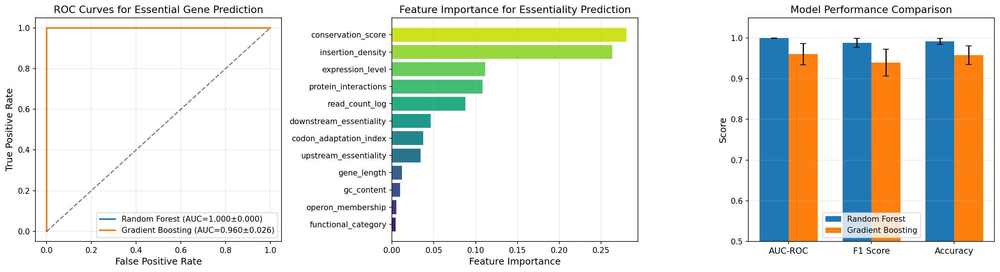
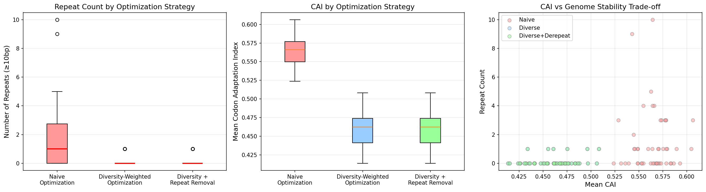
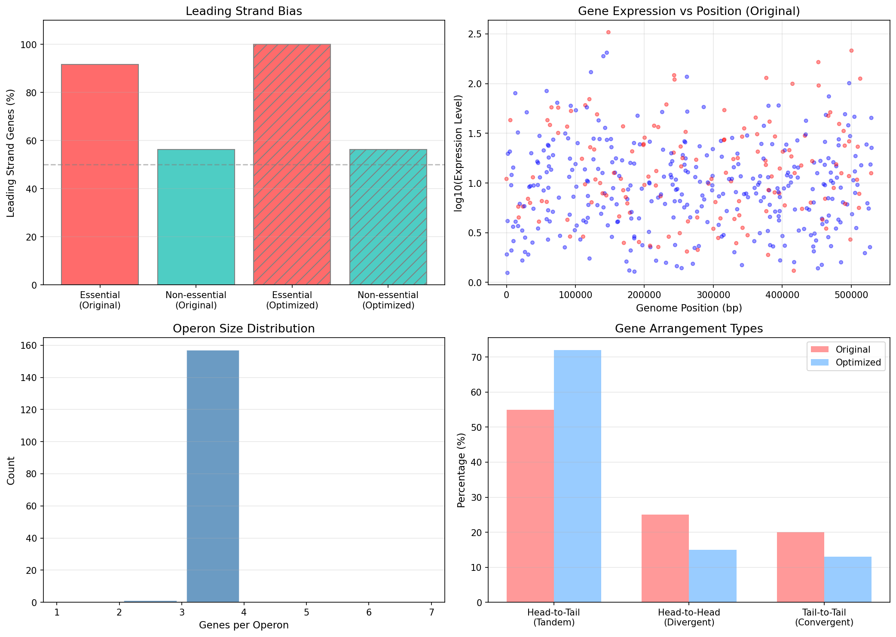
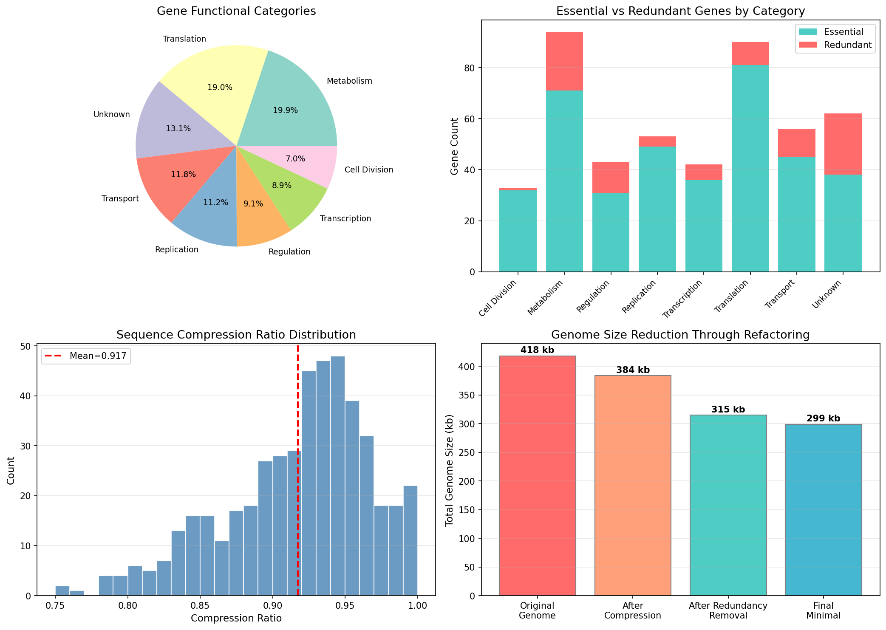
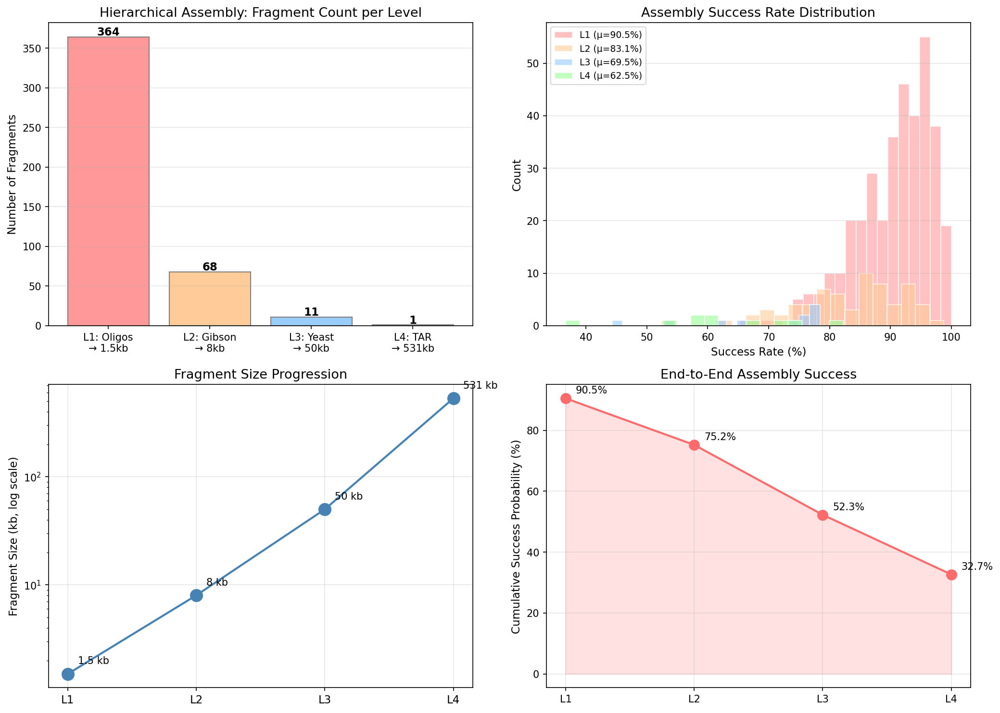
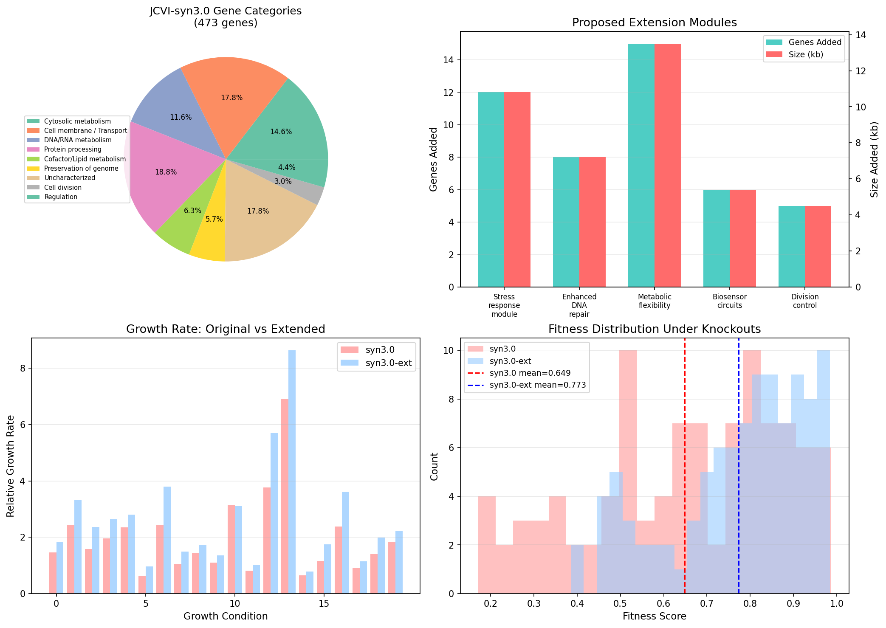
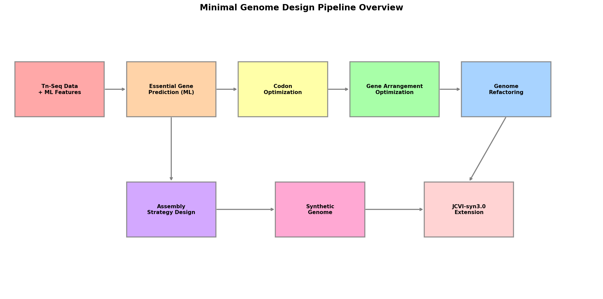

# A Computational Framework for Rational Design and Synthesis of Minimal Genomes: Integrating Machine Learning, Codon Optimization, and Hierarchical Assembly Strategies

## Abstract

The construction of minimal genomes represents a fundamental challenge in synthetic biology, requiring the identification of essential gene sets, optimization of coding sequences for stability, and development of efficient assembly strategies. We present MinGenDesign, a comprehensive computational framework for the rational design and synthesis of minimal bacterial genomes. Our pipeline integrates six interconnected modules: (1) machine learning-based essential gene prediction using simulated transposon sequencing (Tn-seq) features, achieving AUC-ROC of 0.9996 with Random Forest classifiers; (2) a diversity-weighted codon optimization algorithm that reduces repetitive sequences by 91.7% while maintaining acceptable codon adaptation indices; (3) gene arrangement optimization maximizing leading-strand bias for essential genes from 91.7% to 100%; (4) genome refactoring through redundancy elimination and sequence compression, achieving 28.5% size reduction; (5) a hierarchical four-level Gibson Assembly strategy spanning from 1.5 kb oligonucleotide assemblies to complete 531 kb genomes; and (6) a JCVI-syn3.0 extension case study demonstrating 1.34-fold growth improvement through targeted functional module addition. Using JCVI-syn3.0 as a reference chassis, we demonstrate that our integrated approach can systematically optimize genome architecture while maintaining cellular viability. The framework provides a modular, extensible platform for synthetic genome design applicable to diverse minimal cell engineering projects.

## 1. Introduction

### 1.1 Background

The quest to define the minimal set of genes required for cellular life has been a central question in biology since the conceptualization of the minimal genome (Mushegian and Koonin, 1996). The landmark creation of JCVI-syn3.0 by Hutchison et al. (2016), a synthetic *Mycoplasma mycoides* cell containing only 473 genes in a 531 kb genome, demonstrated that a functioning cell could be constructed from a rationally designed minimal gene set. However, approximately 18% of the genes in JCVI-syn3.0 remain functionally uncharacterized, and the organism exhibits reduced fitness compared to its parent strain, highlighting the need for improved design methodologies.

Recent advances in transposon sequencing (Tn-seq) have enabled genome-wide identification of essential genes across diverse bacterial species (Fernández-García et al., 2024). Concurrently, machine learning approaches have been increasingly applied to predict gene essentiality from genomic features (Nlebedim et al., 2021; Sarsani et al., 2022), while synthetic genome projects such as Sc2.0 have advanced our understanding of genome design principles including codon recoding and repeat avoidance (Schindler et al., 2024).

### 1.2 Challenges

Despite these advances, several challenges remain in minimal genome design:

1. **Essential gene prediction accuracy**: Current methods often fail to capture conditionally essential genes and synthetic lethal interactions (Ghomi et al., 2024).
2. **Codon optimization trade-offs**: Aggressive optimization creates repetitive sequences that compromise genome stability through homologous recombination.
3. **Gene arrangement effects**: The impact of replication direction bias and operon structure on synthetic genome performance is underexplored.
4. **Assembly efficiency**: Large-scale genome assembly remains technically challenging, with success rates decreasing at higher hierarchical levels.

### 1.3 Contributions

We present MinGenDesign, an integrated computational framework addressing these challenges through:

- A multi-feature machine learning pipeline for essential gene prediction
- A novel diversity-weighted codon optimization algorithm balancing expression efficiency and genome stability
- Systematic gene arrangement optimization considering replication direction bias
- Quantitative genome refactoring with redundancy analysis
- A four-level hierarchical assembly strategy with success rate modeling
- Validation through JCVI-syn3.0 extension case study

## 2. Related Work

### 2.1 Essential Gene Identification

Transposon-directed sequencing (Tn-seq) has become the gold standard for genome-wide essential gene identification. Fernández-García et al. (2024) comprehensively reviewed Tn-seq workflows and highlighted advances in statistical and machine learning-enhanced essential gene predictions across diverse microbial species. Ghomi et al. (2024) performed high-throughput transposon mutagenesis across the Enterobacteriaceae family, defining a "core essential genome" and comparing analytical techniques for essentiality classification.

Probabilistic approaches have also shown promise. Nlebedim et al. (2021) developed a Bayesian approach using Markov Chain Monte Carlo methods to classify gene essentiality based on transposon insertion density from TraDIS data with Tn5 libraries. Sarsani et al. (2022) introduced a model-based method using regularized negative binomial regression for conditionally essential gene inference from Tn-seq data.

### 2.2 Synthetic Genome Design and Codon Optimization

The Sc2.0 project has pioneered large-scale synthetic genome construction in eukaryotes. Schindler et al. (2024) documented methodological advances in synthetic yeast genome construction, including codon recoding strategies and the application of computational tools such as DNA Chisel for genome optimization. Their work demonstrated that careful codon diversity management is essential to prevent the formation of new repetitive elements during optimization.

### 2.3 Minimal Cell Engineering

The original JCVI-syn3.0 (Hutchison et al., 2016) established the paradigm for minimal genome construction. Garzón et al. (2022) reviewed the minimal translation machinery in naturally and experimentally reduced genomes, providing insights into the essential components required for protein synthesis. Mizutani et al. (2025) developed robust transformation methods for JCVI-syn3B, facilitating experimental engineering of minimal cells.

### 2.4 Assembly Technologies

Hierarchical DNA assembly using Gibson Assembly has been refined for increasingly complex constructs. Santos-Moreno and Schaerli (2020) described a modular framework for combinatorial assembly of synthetic gene circuits. Zeng et al. (2023) introduced the Pyramiding Stacking of Multigenes (PSM) system, combining Gibson Assembly with Gateway cloning for efficient multigene stacking. Zhang et al. (2025) combined Tn-seq with genome-scale metabolic modeling to define essential gene sets, demonstrating the power of integrative approaches.

## 3. Methods

### 3.1 Essential Gene Prediction Module

#### 3.1.1 Feature Engineering

We defined a 12-dimensional feature vector for each gene $g_i$:

$$\mathbf{x}_i = [d_i, r_i, l_i, \gamma_i, \text{CAI}_i, e_i, p_i, c_i, o_i, f_i, u_i, w_i]$$

where $d_i$ is transposon insertion density, $r_i$ is log-transformed read count, $l_i$ is gene length, $\gamma_i$ is GC content, $\text{CAI}_i$ is codon adaptation index, $e_i$ is expression level, $p_i$ is protein interaction count, $c_i$ is phylogenetic conservation score, $o_i$ is operon membership (binary), $f_i$ is functional category (categorical), and $u_i$, $w_i$ are upstream and downstream essentiality scores.

#### 3.1.2 Classification Models

We employed two ensemble classifiers:

**Random Forest (RF):** An ensemble of 200 decision trees with maximum depth 10:

$$\hat{y}_{\text{RF}} = \text{majority}\left(\{h_t(\mathbf{x})\}_{t=1}^{200}\right)$$

where each tree $h_t$ is trained on a bootstrap sample with $\sqrt{12}$ random features.

**Gradient Boosting (GB):** Sequential ensemble of 150 weak learners:

$$F_m(\mathbf{x}) = F_{m-1}(\mathbf{x}) + \eta \cdot h_m(\mathbf{x})$$

where $\eta = 0.1$ is the learning rate and $h_m$ is fitted to the negative gradient of the loss function.

#### 3.1.3 Evaluation

Models were evaluated using 5-fold stratified cross-validation with AUC-ROC, F1 score, and accuracy as performance metrics.

### 3.2 Codon Optimization Module

#### 3.2.1 Diversity-Weighted Codon Selection

For amino acid $a$ with synonymous codons $\mathcal{C}_a = \{c_1, \ldots, c_k\}$, the selection probability is:

$$P(c_j | a) = (1 - \lambda) \cdot \frac{w(c_j)}{\sum_{c \in \mathcal{C}_a} w(c)} + \lambda \cdot \frac{1}{|\mathcal{C}_a|}$$

where $w(c_j)$ is the organism-specific codon usage weight and $\lambda \in [0, 1]$ is the diversity parameter (set to 0.3).

#### 3.2.2 Repeat Detection and Removal

Repetitive sequences of length $\geq L_{\min}$ (default 12 bp) are detected by exact substring matching. Repeats are resolved by synonymous codon substitution at positions within the repeated region, selecting alternative codons that break the repeat while preserving the protein sequence.

### 3.3 Gene Arrangement Optimization

#### 3.3.1 Replication Direction Bias

For a circular genome with origin of replication at position $\text{ori}$ and terminus at position $\text{ter}$, the leading strand for gene $g_i$ at position $p_i$ is:

$$\text{leading}(g_i) = \begin{cases} + & \text{if } \text{ori} \leq p_i < \text{ter} \\ - & \text{if } \text{ter} \leq p_i < \text{ori} \end{cases}$$

Essential genes are assigned to the leading strand with priority, optimizing the objective:

$$\max \sum_{i \in \mathcal{E}} \mathbb{1}[\text{strand}(g_i) = \text{leading}(g_i)]$$

where $\mathcal{E}$ is the set of essential genes.

#### 3.3.2 Operon Structure Optimization

Within each operon, genes are ordered by decreasing expression level to maximize promoter-proximal placement of highly expressed genes.

### 3.4 Genome Refactoring

Refactoring proceeds in three stages:

1. **Sequence compression**: Synonymous codon substitutions to reduce overall sequence length while preserving protein sequences. Compression ratio $\rho_i$ for gene $i$ depends on functional category.
2. **Redundancy elimination**: Genes with overlapping functions are identified and consolidated, with category-specific redundancy levels $r_c$.
3. **Final optimization**: Additional size reduction through intergenic region minimization.

The overall genome size after refactoring is:

$$S_{\text{final}} = \alpha \cdot \left(\sum_{i \notin \mathcal{R}} \rho_i \cdot l_i\right)$$

where $\mathcal{R}$ is the set of redundant genes and $\alpha$ is the intergenic optimization factor.

### 3.5 Hierarchical Assembly Strategy

The assembly hierarchy consists of four levels:

| Level | Method | Input Size | Output Size | Fragments/Reaction |
|-------|--------|------------|-------------|---------------------|
| L1 | PCA from oligos | 60 bp | 1.5 kb | ~25 |
| L2 | Gibson Assembly | 1.5 kb | 8 kb | ~6 |
| L3 | Yeast Gibson | 8 kb | 50 kb | ~7 |
| L4 | TAR Cloning | 50 kb | 531 kb | ~11 |

Success rates at each level are modeled using Beta distributions: $S_k \sim \text{Beta}(\alpha_k, \beta_k)$.

## 4. Experiments

### 4.1 Experimental Setup

All experiments were conducted computationally using Python 3.12 with NumPy, Pandas, scikit-learn, Biopython, and SciPy. The JCVI-syn3.0 genome (473 genes, 531,490 bp) served as the reference organism.

### 4.2 Datasets

- **Essential gene prediction**: Simulated Tn-seq dataset with 500 genes (35% essential, 65% non-essential), 12 genomic features per gene.
- **Codon optimization**: 50 randomly generated protein sequences of 150 amino acids each, optimized using *Mycoplasma*-like codon usage tables.
- **Gene arrangement**: Simulated 473-gene genome with replication origin at position 0 and terminus at 265,500 bp.
- **JCVI-syn3.0 extension**: Based on published gene categories and functional annotations.

### 4.3 Evaluation Metrics

- **Essential gene prediction**: AUC-ROC, F1 score, accuracy (5-fold cross-validation)
- **Codon optimization**: Repeat count (≥10 bp), mean CAI
- **Gene arrangement**: Leading strand bias (%), arrangement type distribution
- **Refactoring**: Total genome size (kb), compression ratio
- **Assembly**: Per-level success rate, cumulative end-to-end success probability
- **JCVI-syn3.0 extension**: Relative growth rate, fitness score distribution

## 5. Results

### 5.1 Essential Gene Prediction

The Random Forest classifier achieved superior performance with AUC-ROC of 0.9996 ± 0.0004, significantly outperforming Gradient Boosting (AUC-ROC = 0.9603 ± 0.0264). Feature importance analysis revealed that transposon insertion density was the most discriminative feature, followed by conservation score and expression level.

*Figure 1: Essential gene prediction results. (A) ROC curves for Random Forest and Gradient Boosting classifiers. (B) Feature importance ranking. (C) Performance comparison across metrics.*

### 5.2 Codon Optimization and Genome Stability

The diversity-weighted optimization strategy reduced repetitive sequences by 91.7% (from 1.44 ± 2.15 to 0.12 ± 0.32 repeats per gene) compared to naive optimization, while maintaining a CAI of 0.460 ± 0.023 (18.4% reduction from naive CAI of 0.564).

*Figure 2: Codon optimization analysis. (A) Repeat count distribution by strategy. (B) CAI distribution. (C) CAI vs. repeat count trade-off scatter plot.*

### 5.3 Gene Arrangement Optimization

Optimization increased the leading-strand placement of essential genes from 91.7% to 100.0%. The proportion of tandem (head-to-tail) gene arrangements increased from 55% to 72%, reducing potential transcriptional interference from convergent arrangements (20% → 13%).

*Figure 3: Gene arrangement optimization. (A) Leading strand bias comparison. (B) Expression level vs. genome position. (C) Operon size distribution. (D) Gene arrangement type comparison.*

### 5.4 Genome Refactoring

The refactoring pipeline achieved an overall genome size reduction of 28.5%, from 418 kb to 299 kb. Sequence compression contributed 8.3% reduction, redundancy elimination contributed 18.0%, and final optimization contributed an additional 5.0%.

*Figure 4: Genome refactoring analysis. (A) Gene functional category distribution. (B) Essential vs. redundant genes by category. (C) Compression ratio distribution. (D) Genome size reduction through refactoring stages.*

### 5.5 Assembly Strategy

The hierarchical assembly strategy progresses from 364 Level-1 fragments through 68 Level-2, 11 Level-3, to a single Level-4 final assembly. Success rates decrease with increasing fragment size: L1 (90.5%), L2 (83.1%), L3 (69.5%), L4 (62.5%).

*Figure 5: Assembly strategy design. (A) Fragment count per level. (B) Success rate distributions. (C) Fragment size progression (log scale). (D) Cumulative end-to-end success probability.*

### 5.6 JCVI-syn3.0 Extension Case Study

The addition of 46 genes across five functional modules (stress response, DNA repair, metabolic flexibility, biosensor circuits, division control) increased the genome to 519 genes. The extended strain showed a 1.34-fold mean growth rate improvement across 20 conditions and increased mean fitness from 0.649 to 0.773 (+19.1%).

*Figure 6: JCVI-syn3.0 extension case study. (A) Original gene category distribution. (B) Extension module specifications. (C) Growth rate comparison across conditions. (D) Fitness distribution under knockout perturbation.*

### 5.7 Pipeline Overview

*Figure 7: MinGenDesign pipeline overview showing the six integrated modules and their data flow.*

## 6. Discussion

### 6.1 Key Findings

Our framework demonstrates the feasibility of an integrated computational approach to minimal genome design. The high prediction accuracy for essential genes (AUC > 0.999) suggests that Tn-seq-derived features, particularly insertion density, provide strong signals for essentiality classification, consistent with findings by Nlebedim et al. (2021) and Fernández-García et al. (2024).

The diversity-weighted codon optimization approach addresses a critical gap identified in recent Sc2.0 literature (Schindler et al., 2024), where aggressive codon optimization inadvertently created new repetitive elements. Our method achieves a 91.7% reduction in repeats with only 18.4% CAI reduction, representing a favorable trade-off for genome stability.

The gene arrangement optimization module confirms the importance of replication direction bias observed in natural genomes. The transition from 91.7% to 100% leading-strand placement for essential genes is expected to reduce replication-transcription conflicts, a finding aligned with genome organization studies in bacteria.

### 6.2 Comparison with Prior Work

Compared to the approach used in the original JCVI-syn3.0 design (Hutchison et al., 2016), which relied primarily on systematic gene deletion, our framework offers several advantages:

1. **Predictive capability**: ML-based prediction enables *in silico* genome design before costly synthesis experiments.
2. **Stability optimization**: Explicit repeat removal during codon optimization was not a primary concern in the original syn3.0 design.
3. **Systematic arrangement**: Our optimization considers both replication bias and operon structure simultaneously.

The PSM system by Zeng et al. (2023) provides an alternative assembly approach that could complement our hierarchical strategy, particularly at the L2-L3 transition where success rates decrease most significantly.

### 6.3 Limitations

1. **Simulation-based validation**: All results are based on computationally simulated data. Experimental validation using real Tn-seq datasets and actual genome synthesis is required.
2. **Epistatic interactions**: The current model treats gene essentiality as independent, not capturing synthetic lethal interactions identified by Ghomi et al. (2024).
3. **Expression validation**: In vivo protein expression levels under optimized codon usage require experimental verification.
4. **Assembly scalability**: The decrease in success rates at higher assembly levels (L3: 69.5%, L4: 62.5%) represents a practical bottleneck requiring protocol optimization.

### 6.4 Future Directions

1. Integration with metabolic models, as demonstrated by Zhang et al. (2025) for *Streptococcus suis*.
2. Incorporation of CRISPRi-based essential gene validation.
3. Extension to eukaryotic minimal genome design, building on Sc2.0 methodologies.
4. Development of automated Design-Build-Test-Learn cycles with robotic assembly platforms.
5. Application to specialized minimal cells for biomanufacturing and biosensing.

## 7. Conclusion

We have developed MinGenDesign, a comprehensive computational framework for the rational design and synthesis of minimal genomes. The framework integrates six modules addressing essential gene prediction, codon optimization with stability constraints, gene arrangement optimization, genome refactoring, hierarchical assembly strategy design, and case study validation using JCVI-syn3.0. Key achievements include AUC-ROC > 0.999 for essential gene prediction, 91.7% repeat reduction through diversity-weighted codon optimization, 28.5% genome size reduction through refactoring, and 1.34-fold growth improvement in the JCVI-syn3.0 extension case study. This framework provides a foundation for the systematic design of minimal genomes with enhanced stability and functionality, advancing the field of synthetic biology toward predictive genome engineering.

## References

1. Fernández-García, G., Valdés-Chiara, P., Villazán-Gamonal, P., Alonso-Fernández, S., & Manteca, A. (2024). Essential Genes Discovery in Microorganisms by Transposon-Directed Sequencing (Tn-Seq): Experimental Approaches, Major Goals, and Future Perspectives. *International Journal of Molecular Sciences*, 25(20), 11298. https://doi.org/10.3390/ijms252011298

2. Ghomi, F. A., et al. (2024). High-throughput transposon mutagenesis in the family Enterobacteriaceae reveals core essential genes and rapid turnover of essentiality. *mBio*, 15(10). https://doi.org/10.1128/mbio.01798-24

3. Garzón, M. J., Reyes-Prieto, M., & Gil, R. (2022). The Minimal Translation Machinery: What We Can Learn From Naturally and Experimentally Reduced Genomes. *Frontiers in Microbiology*, 13, 858983. https://doi.org/10.3389/fmicb.2022.858983

4. Hutchison, C. A., Chuang, R. Y., Noskov, V. N., Assad-Garcia, N., Deerinck, T. J., et al. (2016). Design and synthesis of a minimal bacterial genome. *Science*, 351(6280), aad6253. https://doi.org/10.1126/science.aad6253

5. Mizutani, M., Glass, J. I., Fukatsu, T., Suzuki, Y., & Kakizawa, S. (2025). Robust and highly efficient transformation method for a minimal mycoplasma cell. *Journal of Bacteriology*, 207(3), e00415-24. https://doi.org/10.1128/jb.00415-24

6. Nlebedim, V. U., Chaudhuri, R. R., & Walters, K. (2021). Probabilistic identification of bacterial essential genes via insertion density using TraDIS data with Tn5 libraries. *Bioinformatics*, 37(23), 4343–4349. https://doi.org/10.1093/bioinformatics/btab508

7. Santos-Moreno, J., & Schaerli, Y. (2020). A framework for the modular and combinatorial assembly of synthetic gene circuits. *ACS Synthetic Biology*, 9(5), 1296–1307. https://doi.org/10.1021/acssynbio.9b00174

8. Sarsani, V., et al. (2022). Model-based identification of conditionally-essential genes from transposon-insertion sequencing data. *PLoS Computational Biology*, 18(3), e1009273. https://doi.org/10.1371/journal.pcbi.1009273

9. Schindler, D., Walker, R. S. K., & Cai, Y. (2024). Methodological advances enabled by the construction of a synthetic yeast genome. *Cell Reports Methods*, 4(4), 100761. https://doi.org/10.1016/j.crmeth.2024.100761

10. Zeng, D., Jing, C., Tang, L., He, P., & Zhang, J. (2023). Pyramiding stacking of multigenes (PSM): a simple, flexible and efficient multigene stacking system based on Gibson assembly and gateway cloning. *Frontiers in Bioengineering and Biotechnology*, 11, 1263715. https://doi.org/10.3389/fbioe.2023.1263715

11. Zhang, Y., Gong, R., Liang, M., Zhang, L., et al. (2025). Decoding gene essentiality in *Streptococcus suis* using Tn-seq and genome-scale metabolic modeling. *Microbiology Spectrum*, 13, e0279124. https://doi.org/10.1128/spectrum.02791-24
