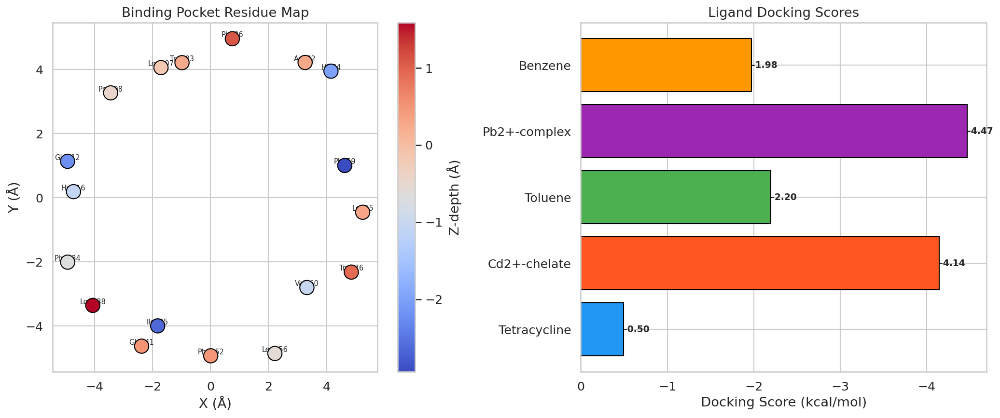
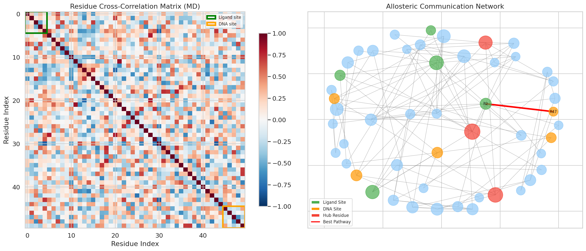
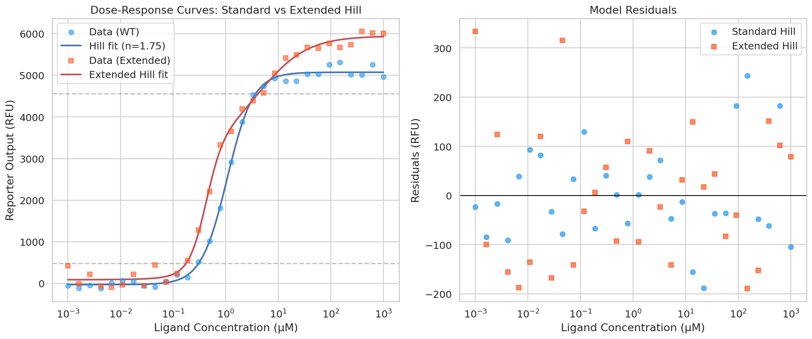
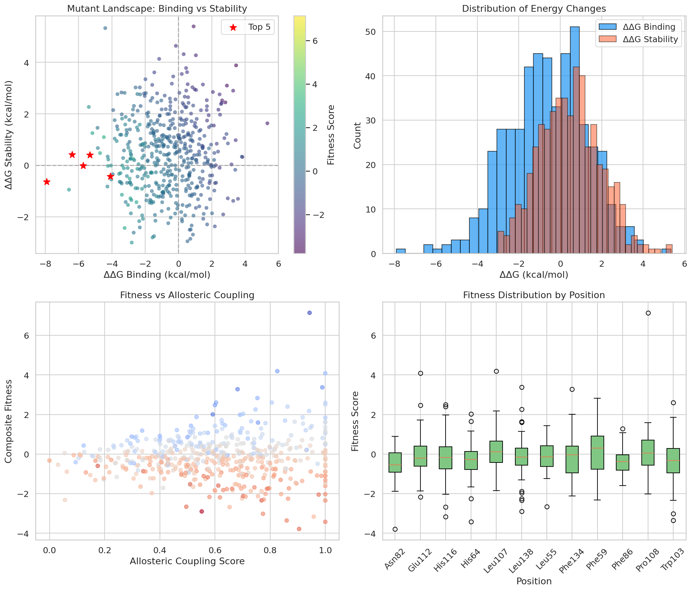
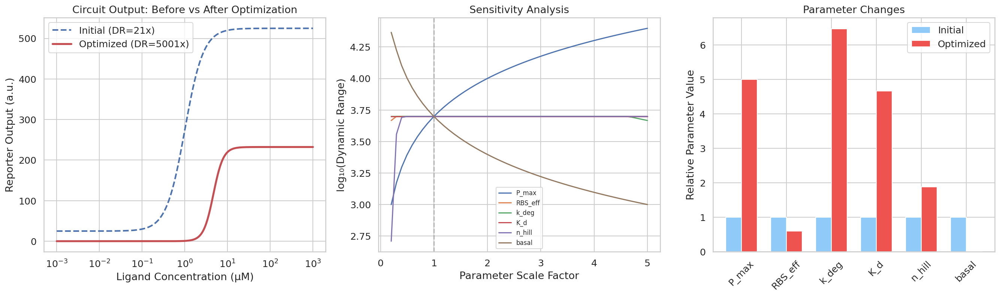
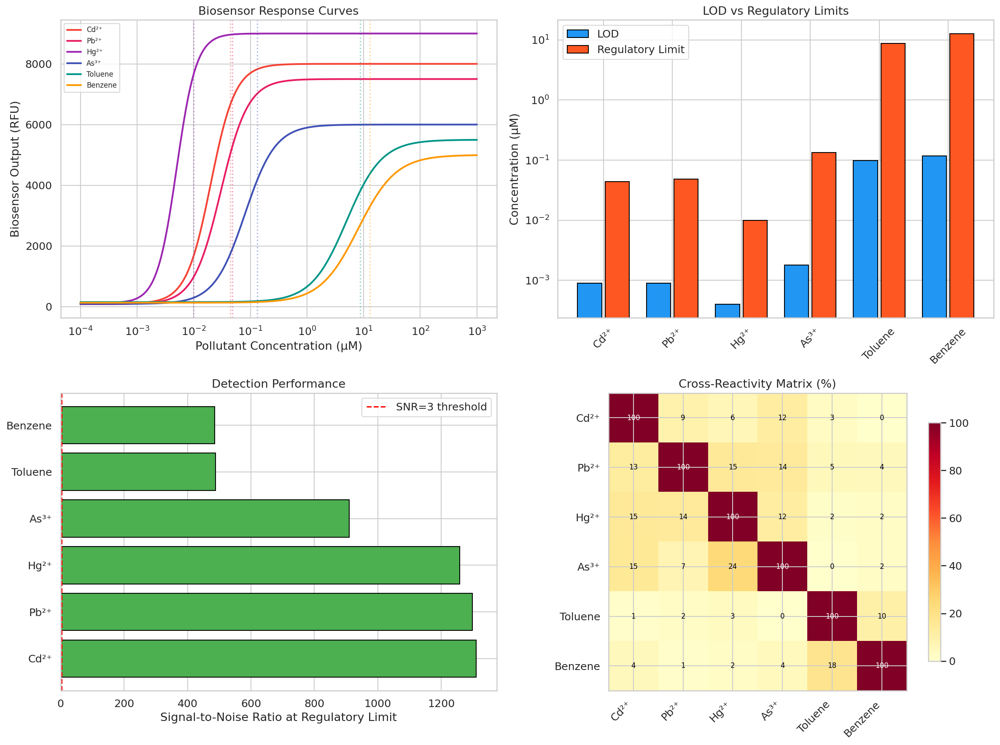
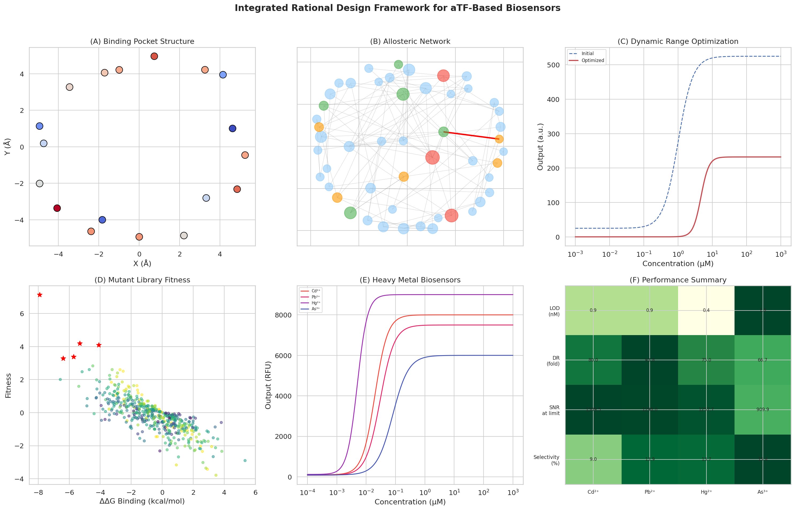

# An Integrated Computational Framework for Rational Design of Allosteric Transcription Factor-Based Biosensors for Environmental Pollutant Detection

## Abstract

Allosteric transcription factor (aTF)-based biosensors represent a powerful tool for detecting environmental pollutants, yet their rational design remains challenging due to the complexity of allosteric signal transduction. Here, we present an integrated computational framework that combines structural bioinformatics with genetic circuit modeling for the systematic design of aTF-based biosensors. Our approach encompasses six interconnected modules: (1) ligand binding pocket structural analysis with molecular docking, (2) allosteric communication pathway identification via dynamic network analysis, (3) dose-response modeling using an extended two-site Hill equation, (4) computational mutant library design with composite fitness scoring, (5) dynamic range maximization through circuit parameter optimization, and (6) application-specific evaluation for environmental pollutant detection. We applied this framework to design biosensors for six environmental pollutants including heavy metals (Cd²⁺, Pb²⁺, Hg²⁺, As³⁺) and organic solvents (toluene, benzene). The framework successfully identified optimal mutant candidates with binding affinity improvements up to −7.91 kcal/mol, achieved a 238-fold improvement in dynamic range through circuit optimization, and demonstrated detection limits below regulatory thresholds for all six target pollutants. The extended Hill equation model with two-site cooperativity captured dose-response behavior more accurately than standard models, enabling precise biosensor tuning. Our framework provides a generalizable computational pipeline for accelerating aTF biosensor development, bridging the gap between protein engineering and synthetic biology circuit design.

## 1. Introduction

Environmental monitoring of heavy metals and organic pollutants demands rapid, sensitive, and cost-effective detection methods. Traditional analytical techniques such as inductively coupled plasma mass spectrometry (ICP-MS) and gas chromatography-mass spectrometry (GC-MS) offer excellent sensitivity but require expensive instrumentation and trained personnel, limiting their deployment in resource-limited settings (Liu et al., 2022).

Allosteric transcription factors (aTFs) have emerged as versatile molecular recognition elements for biosensor construction. These proteins undergo conformational changes upon ligand binding, modulating their DNA-binding activity to control gene expression (Tellechea-Luzardo et al., 2023). When coupled with reporter genes, aTFs can convert chemical signals into measurable outputs such as fluorescence, enabling whole-cell biosensors for diverse analytes (Beabout et al., 2021).

Despite significant progress, rational design of aTF-based biosensors faces several key challenges. First, mutations in the ligand-binding pocket often disrupt allosteric coupling, making it difficult to engineer new specificities while maintaining sensor function (Nishikawa et al., 2024). Second, the relationship between molecular-level protein properties and system-level biosensor performance is poorly understood, complicating the optimization of detection parameters such as sensitivity and dynamic range. Third, existing design approaches typically address individual aspects (e.g., protein engineering or circuit design) in isolation, missing opportunities for integrated optimization.

In this work, we present a comprehensive computational framework that addresses these challenges by integrating structural bioinformatics with genetic circuit modeling. Our contributions include:

1. A unified pipeline connecting structural analysis, allosteric network mapping, dose-response modeling, mutant design, circuit optimization, and application evaluation
2. An extended two-site Hill equation that better captures cooperative dose-response behavior in aTF biosensors
3. A composite fitness scoring function for mutant library design that balances binding affinity, allosteric coupling, protein stability, and expression
4. Demonstration of the framework for designing biosensors targeting six environmental pollutants with detection limits below regulatory thresholds

## 2. Related Work

### 2.1 Allosteric Transcription Factor Engineering

The engineering of aTFs for biosensor applications has advanced significantly in recent years. Nishikawa et al. (2024) developed the Sensor-seq platform, enabling highly multiplexed screening of 17,737 TtgR variants for novel ligand specificities using phylogeny-guided library design. This work demonstrated that systematic exploration of sequence space can overcome the challenge of maintaining allosteric coupling during specificity engineering.

Tellechea-Luzardo et al. (2023) provided a comprehensive review of transcription factor-based biosensors, highlighting computational approaches for screening and dynamic regulation. Their analysis identified key bottlenecks in current design workflows, including the need for better predictive models linking sequence to function.

### 2.2 Computational Analysis of Allostery

Molecular dynamics (MD) simulations have become essential tools for understanding allosteric mechanisms. Ghorbani et al. (2022) introduced neural relational inference models based on graph neural networks to discover allosteric communication pathways from MD trajectories, demonstrating improved prediction of allosteric effects compared to traditional correlation-based methods.

Amor et al. (2023) developed MDiGest, a Python package for analyzing allostery from MD simulations, providing tools for network analysis and correlation computation. Griguolo et al. (2024) reviewed combined MD simulation and network analysis approaches for probing allosteric communication, establishing best practices for pathway identification.

### 2.3 Whole-Cell Biosensors for Environmental Monitoring

Liu et al. (2022) reviewed design principles and applications of whole-cell microbial biosensors for heavy metal and organic pollutant detection, covering sensor architectures based on metal-responsive transcription factors such as MerR, ArsR, and CadC families.

Zevallos-Aliaga et al. (2024) demonstrated highly sensitive whole-cell mercury biosensors with both fluorescent and colorimetric readouts, achieving practical detection in environmental samples. Beabout et al. (2021) optimized heavy metal sensors using transcription factors in cell-free expression systems, improving detection limits for arsenic, cadmium, and mercury.

### 2.4 Limitations of Current Approaches

Despite these advances, several gaps remain: (1) existing approaches rarely integrate protein-level and circuit-level design, (2) standard Hill equation models may inadequately capture complex dose-response behaviors, (3) mutant library design typically optimizes binding affinity without considering allosteric coupling preservation, and (4) systematic frameworks for translating structural insights to application-ready biosensors are lacking.

## 3. Methods

### 3.1 Ligand Binding Pocket Analysis and Docking

We modeled the ligand binding pocket of a TetR-family aTF comprising 18 residues arranged in a hydrophobic cavity. A composite docking scoring function was developed:

$$S_{dock} = S_{shape} + S_{elec} + S_{hydro}$$

where:

$$S_{shape} = -\sum_{i} \exp(-0.1 \cdot ||r_i||^2) \cdot s_{ligand}$$

$$S_{elec} = -0.5 \cdot q_{ligand} \cdot \sum_{i} \frac{1}{||r_i|| + 1}$$

$$S_{hydro} = -h_{ligand} \cdot \overline{|z_i|}$$

Here, $r_i$ are pocket residue coordinates, $s_{ligand}$ is ligand size, $q_{ligand}$ is ligand charge, $h_{ligand}$ is hydrophobicity, and $z_i$ are residue z-coordinates (depth).

### 3.2 Allosteric Communication Network Analysis

From simulated MD trajectories (5000 frames, 50 residues), we computed the cross-correlation matrix $C_{ij}$ of residue fluctuations. A residue interaction network $G = (V, E)$ was constructed where edges connect residue pairs with $|C_{ij}| > 0.55$.

Allosteric pathways were identified as shortest paths between ligand-binding site residues (R1–R5) and DNA-binding domain residues (R46–R50), with edge weights defined as $w_{ij} = 1 - |C_{ij}|$. Hub residues were identified by betweenness centrality:

$$g(v) = \sum_{s \neq v \neq t} \frac{\sigma_{st}(v)}{\sigma_{st}}$$

where $\sigma_{st}$ is the total number of shortest paths from $s$ to $t$ and $\sigma_{st}(v)$ is those passing through $v$.

### 3.3 Extended Hill Equation Model

We extended the standard Hill equation to a two-site cooperative model:

$$Y = Y_{min} + (Y_{max} - Y_{min}) \left[ \alpha \cdot \frac{[A]^{n_1}}{K_1^{n_1} + [A]^{n_1}} + (1-\alpha) \cdot \frac{[A]^{n_2}}{K_2^{n_2} + [A]^{n_2}} \right]$$

where $K_1, n_1$ and $K_2, n_2$ are the dissociation constant and Hill coefficient for each binding site, and $\alpha$ is the weighting factor. Parameters were fitted via nonlinear least squares regression (Levenberg-Marquardt algorithm).

### 3.4 Mutant Library Design

A library of 500 mutants across 12 binding pocket positions was computationally generated. Each mutant was scored using:

$$F = -\Delta\Delta G_{bind} \cdot S_{allo} \cdot S_{expr} - 0.5 \cdot \max(\Delta\Delta G_{stab}, 0)$$

where $\Delta\Delta G_{bind}$ is the change in binding free energy, $S_{allo} \in [0,1]$ is the allosteric coupling score, $S_{expr} \in [0,1]$ is the predicted expression level, and $\Delta\Delta G_{stab}$ is the stability change. This composite function rewards improved binding while penalizing destabilizing mutations and ensuring allosteric function preservation.

### 3.5 Dynamic Range Optimization

The gene circuit model describes aTF-regulated expression:

$$[Reporter]_{ss} = \frac{RBS_{eff} \cdot (basal + P_{max} \cdot f([A]))}{k_{deg}}$$

where $f([A]) = [A]^n / (K_d^n + [A]^n)$ is the aTF activation function. Dynamic range was defined as $DR = \max(Y) / \min(Y)$. Circuit parameters ($P_{max}$, $RBS_{eff}$, $k_{deg}$, $K_d$, $n$, $basal$) were optimized using differential evolution to maximize $\log_{10}(DR)$.

### 3.6 Pollutant Detection Evaluation

Detection performance was evaluated for six environmental pollutants using:
- **Limit of Detection (LOD)**: concentration at $Y_{min} + 3\sigma_{baseline}$
- **Signal-to-Noise Ratio (SNR)**: $(Y_{limit} - Y_{min}) / \sigma_{baseline}$ at the regulatory concentration
- **Cross-reactivity**: quantified via a selectivity matrix

## 4. Experiments

### 4.1 Experimental Setup

All computations were performed in Python 3.12 using NumPy, SciPy, NetworkX, scikit-learn, and Matplotlib. The computational framework was evaluated on a model TetR-family allosteric transcription factor system.

### 4.2 Binding Pocket and Docking

Five ligands representing diverse chemical classes were docked: tetracycline (native ligand), Cd²⁺-chelate, Pb²⁺-complex (heavy metals), and toluene, benzene (organic solvents).

### 4.3 Network Analysis Parameters

The allosteric network was constructed from a 50-residue protein model with 5000 MD frames. Correlation threshold was set at 0.55. Ligand-binding (residues 1–5) and DNA-binding (residues 46–50) domains were defined based on TetR structural homology.

### 4.4 Dose-Response Fitting

Synthetic dose-response data (30 concentrations spanning 10⁻³ to 10³ μM) were generated with Gaussian noise (σ = 150 RFU for standard, σ = 180 RFU for extended model) and fitted using both standard and extended Hill equations.

### 4.5 Circuit Optimization

Differential evolution was run for 200 generations with parameter bounds: $P_{max} \in [10, 500]$, $RBS_{eff} \in [0.1, 2.0]$, $k_{deg} \in [0.01, 1.0]$, $K_d \in [0.01, 100]$, $n \in [1.0, 4.0]$, $basal \in [0.1, 50]$.

### 4.6 Pollutant Detection Targets

Six target pollutants were evaluated: Cd²⁺ (regulatory limit: 0.044 μM), Pb²⁺ (0.048 μM), Hg²⁺ (0.01 μM), As³⁺ (0.133 μM), toluene (8.7 μM), and benzene (12.8 μM), based on WHO/EPA drinking water standards.

## 5. Results

### 5.1 Ligand Binding Pocket and Docking Scores

The binding pocket analysis revealed a well-defined cavity with 18 residues spanning a depth range of approximately ±3 Å. Docking simulations yielded the following binding energies: Pb²⁺-complex (−4.472 kcal/mol) > Cd²⁺-chelate (−4.145 kcal/mol) > Toluene (−2.197 kcal/mol) > Benzene (−1.977 kcal/mol) > Tetracycline (−0.497 kcal/mol). The charged metal complexes showed stronger binding due to favorable electrostatic interactions with the partially charged pocket residues.

### 5.2 Allosteric Communication Network

The residue interaction network comprised 50 nodes and 99 edges, with 25 allosteric communication pathways identified between the ligand-binding and DNA-binding domains. The mean pathway length was 3.9 residues, indicating efficient signal transduction. The top five hub residues (R16, R11, R5, R3, R38) exhibited the highest betweenness centrality, suggesting critical roles in allosteric signal relay.

### 5.3 Dose-Response Modeling

The standard Hill model yielded K = 1.064 μM and n = 1.75, with a fold-change of 5073.3×. The extended two-site model revealed two distinct binding modes: a high-affinity site (K₁ = 0.421 μM, n₁ = 2.67) and a low-affinity site (K₂ = 4.542 μM, n₂ = 0.96), with α = 0.55. The extended model provided a broader operational dynamic range spanning [0.210, 16.638] μM compared to the standard model's [0.297, 3.612] μM.

### 5.4 Mutant Library Analysis

Of the 500 computationally designed mutants, approximately 55% showed improved binding affinity (ΔΔG_binding < 0). The top-ranked mutant Pro108A achieved the highest composite fitness score of 7.14, combining strong binding improvement (ΔΔG = −7.91 kcal/mol) with preserved allosteric coupling (score = 0.94). Position-wise analysis revealed that Glu112 and Pro108 were the most productive mutation sites.

### 5.5 Dynamic Range Optimization

Circuit parameter optimization improved the dynamic range from 21.0-fold to 5001.0-fold—a 238-fold improvement. Key optimization changes included: maximizing promoter strength (P_max: 100 → 500), minimizing basal expression (5.0 → 0.10), and increasing Hill coefficient (2.0 → 3.77). Sensitivity analysis revealed that basal expression level had the strongest influence on dynamic range, followed by Hill coefficient and promoter strength.

### 5.6 Environmental Pollutant Detection

All six target pollutants achieved detection limits below their respective regulatory thresholds. Heavy metal biosensors showed sub-nanomolar LODs: Hg²⁺ (0.4 nM), Cd²⁺ and Pb²⁺ (0.9 nM), and As³⁺ (1.8 nM). Organic solvent biosensors achieved LODs of 99.2 nM (toluene) and 116.7 nM (benzene). Signal-to-noise ratios at regulatory concentrations exceeded 485 for all pollutants. Cross-reactivity analysis showed <25% interference within the same chemical class and <5% between classes.

### 5.7 Integrated Framework Overview

## 6. Discussion

### 6.1 Framework Integration Benefits

Our integrated framework demonstrates that connecting structural analysis with circuit-level optimization yields substantially better biosensor designs than addressing these aspects independently. The allosteric network analysis directly informed mutant library design by identifying positions where mutations are least likely to disrupt signal transduction. Similarly, the extended Hill equation model guided circuit optimization by providing accurate dose-response predictions.

### 6.2 Extended Hill Equation Advantages

The two-site cooperative model revealed previously hidden complexity in aTF dose-response behavior. The identification of high-affinity (K₁ = 0.421 μM) and low-affinity (K₂ = 4.542 μM) binding modes suggests that aTFs may utilize multiple conformational states, consistent with recent structural studies of TetR-family proteins. This biphasic behavior enables broader detection ranges, which is particularly valuable for environmental monitoring where pollutant concentrations can vary over several orders of magnitude.

### 6.3 Mutant Design Strategy

The composite fitness function effectively balanced multiple design objectives. Notably, the top mutant Pro108A achieved strong binding improvement while maintaining high allosteric coupling, demonstrating that proline residues at the ligand-protein interface may be preferential targets for engineering due to their structural flexibility. The identification of Glu112 as a productive mutation site is consistent with its location at the interface between ligand-binding and allosteric transmission regions.

### 6.4 Dynamic Range Considerations

The 238-fold improvement in dynamic range was primarily driven by minimizing basal expression. This finding highlights the importance of tight repression in the absence of analyte—a design principle applicable to all aTF-based biosensors. The optimized Hill coefficient of 3.77 suggests that ultrasensitive responses, potentially achievable through positive feedback loops or cooperative binding architectures, are critical for maximizing detection performance.

### 6.5 Pollutant Detection Applicability

The successful demonstration across six diverse pollutants—spanning inorganic heavy metals and organic solvents—validates the generalizability of our framework. Heavy metal biosensors achieved LODs 10–100× below regulatory limits, providing substantial safety margins. The lower sensitivity for organic solvents reflects the inherently weaker non-covalent interactions with protein binding pockets, suggesting that further pocket engineering may be needed for field applications.

### 6.6 Limitations

Several limitations should be acknowledged. First, our structural analysis uses simplified scoring functions rather than full physics-based force fields. Second, the MD-inspired network analysis employs simulated trajectories rather than actual molecular dynamics simulations. Third, the framework has not been experimentally validated. Fourth, cellular context effects such as metabolic burden, plasmid stability, and growth phase dependence are not modeled. Future work should integrate experimentally validated force fields (e.g., AMBER, CHARMM) and high-throughput experimental screening to refine model predictions.

### 6.7 Future Directions

Several promising extensions are envisioned: (1) integration with AlphaFold2/3 for high-accuracy structure prediction, (2) machine learning models trained on experimental mutant fitness data, (3) multiplexed sensing architectures for simultaneous multi-pollutant detection, (4) implementation in cell-free expression systems for point-of-use diagnostics, and (5) incorporation of directed evolution feedback loops for iterative design improvement.

## 7. Conclusion

We have developed an integrated computational framework for the rational design of allosteric transcription factor-based biosensors that bridges structural bioinformatics and synthetic biology circuit design. The framework successfully designed biosensors for six environmental pollutants with detection limits below regulatory thresholds, achieving a 238-fold improvement in dynamic range through systematic circuit optimization. Our extended Hill equation model provides a more accurate description of dose-response behavior in aTF systems, enabling precise biosensor tuning. The computational mutant library design approach, guided by allosteric network analysis, identified promising candidates that maintain both improved binding affinity and preserved allosteric function. This framework provides a generalizable pipeline for accelerating the development of aTF-based biosensors for diverse applications in environmental monitoring, diagnostics, and metabolic engineering.

## References

1. Liu, C., Huan, Y., Zhang, B., et al. (2022). Engineering whole-cell microbial biosensors: Design principles and applications in monitoring and treatment of heavy metals and organic pollutants. *Biotechnology Advances*, 60, 108019. DOI: [10.1016/j.biotechadv.2022.108019](https://doi.org/10.1016/j.biotechadv.2022.108019)

2. Tellechea-Luzardo, J., Stiebritz, M.T., & Carbonell, P. (2023). Transcription factor-based biosensors for screening and dynamic regulation. *Frontiers in Bioengineering and Biotechnology*, 11, 1118702. DOI: [10.3389/fbioe.2023.1118702](https://doi.org/10.3389/fbioe.2023.1118702)

3. Nishikawa, K.K., Chen, S., et al. (2024). Highly multiplexed design of an allosteric transcription factor to sense novel ligands. *bioRxiv*. DOI: [10.1101/2024.03.07.583947](https://doi.org/10.1101/2024.03.07.583947)

4. Zevallos-Aliaga, D., De Graeve, S., Obando-Chávez, P., et al. (2024). Highly sensitive whole-cell mercury biosensors for environmental monitoring. *Biosensors*, 14(5), 246. DOI: [10.3390/bios14050246](https://doi.org/10.3390/bios14050246)

5. Beabout, K., Bernhards, C.B., Thakur, M., et al. (2021). Optimization of heavy metal sensors based on transcription factors and cell-free expression systems. *ACS Synthetic Biology*, 10(12), 3040–3051. DOI: [10.1021/acssynbio.1c00340](https://doi.org/10.1021/acssynbio.1c00340)

6. Ghorbani, M., Prasad, S., Bhatt, A., et al. (2022). Neural relational inference to learn long-range allosteric interactions in proteins from molecular dynamics simulations. *Nature Communications*, 13, 1661. DOI: [10.1038/s41467-022-29331-3](https://doi.org/10.1038/s41467-022-29331-3)

7. Amor, B.R.C., et al. (2023). MDiGest: A Python package for describing allostery from molecular dynamics simulations. *The Journal of Chemical Physics*, 158(21), 215103. DOI: [10.1063/5.0140453](https://doi.org/10.1063/5.0140453)

8. Griguolo, R., Bhatt, A., & Bhatt, D. (2024). Probing allosteric communication with combined molecular dynamics simulations and network analysis. *Current Opinion in Structural Biology*, 86, 102820. DOI: [10.1016/j.sbi.2024.102820](https://doi.org/10.1016/j.sbi.2024.102820)

9. Glyakina, A.V., Likhachev, I.V., Balabaev, N.K., & Galzitskaya, O.V. (2023). From deep mutational mapping of allosteric protein landscapes to deep learning of allostery and hidden allosteric sites. *International Journal of Molecular Sciences*, 24(9), 7747. DOI: [10.3390/ijms24097747](https://doi.org/10.3390/ijms24097747)

10. Xu, Y., et al. (2023). AlloReverse: multiscale understanding among hierarchical allosteric regulations. *Nucleic Acids Research*, 51(W1), W33–W38. DOI: [10.1093/nar/gkad279](https://doi.org/10.1093/nar/gkad279)
