# 脳オルガノイド大量培養のためのバイオリアクター設計と最適化 — 実験レポート

## 1. 実験目的と背景

脳オルガノイドは、ヒト多能性幹細胞（iPSC/ESC）から生成される三次元脳組織モデルであり、神経発達・疾患研究において重要なツールである。しかし、大量培養にはバイオリアクター設計の最適化が不可欠であり、特に以下の課題が存在する：

- **酸素・栄養素の輸送限界**：オルガノイドが大型化すると中心部が壊死する
- **せん断応力の制御**：過度な機械的刺激は細胞損傷を引き起こす
- **スケーラビリティ**：研究室規模から工業規模への移行が困難
- **成熟度評価**：リアルタイムモニタリング手法が未確立

本研究では、灌流型バイオリアクターの流体力学シミュレーション（CFD）、反応-拡散方程式による物質輸送モデリング、せん断応力-成熟関係のモデリング、培地組成最適化、スケーラビリティ設計、およびバイオマーカーモニタリング戦略を包括的に実施した。

---

## 2. 使用した手法・アルゴリズムの概要

### 2.1 CFDシミュレーション
- **支配方程式**: 2D軸対称Navier-Stokes方程式（Hagen-Poiseuille流）
- **パラメータ**: リアクター半径 25 mm、長さ 100 mm、流量 0.1 mL/s
- **解析内容**: 速度場、圧力場、壁面せん断応力分布

### 2.2 酸素/栄養素輸送モデリング
- **支配方程式**: 球座標系の反応-拡散方程式
  $$\frac{\partial C}{\partial t} = D \nabla^2 C - \frac{V_{max} C}{K_m + C}$$
- **消費速度**: Michaelis-Menten反応速度式
- **解析**: 定常状態プロファイル、過渡応答、臨界オルガノイドサイズ

### 2.3 せん断応力-成熟モデル
- **二相性応答モデル**: 低せん断は有益、高せん断は有害
- **最適化指標**: 成熟指数 × 細胞生存率 × 神経マーカー発現

### 2.4 培地組成最適化
- **手法**: 差分進化（Differential Evolution）アルゴリズム
- **目的関数**: 多目的最適化（品質最大化＋コスト最小化）

### 2.5 スケーラビリティ解析
- 7種類のバイオリアクター構成を比較（バッチ→灌流→連続）

### 2.6 バイオマーカーモニタリング
- ロジスティック成長モデルによるマーカー発現の時間推移
- 複合成熟スコアの算出

### 2.7 COMSOL/OpenFOAM連携設計
- OpenFOAM: CFDソルバー（速度・圧力場）
- COMSOL: マルチフィジクス（物質輸送・熱伝達）
- 連携方式: VTKファイルベースのデータ交換

---

## 3. 主要な結果と数値

### 3.1 CFDシミュレーション結果

リアクター内の流体力学特性を解析した。レイノルズ数 Re = 2.55 で完全な層流条件が確認された。

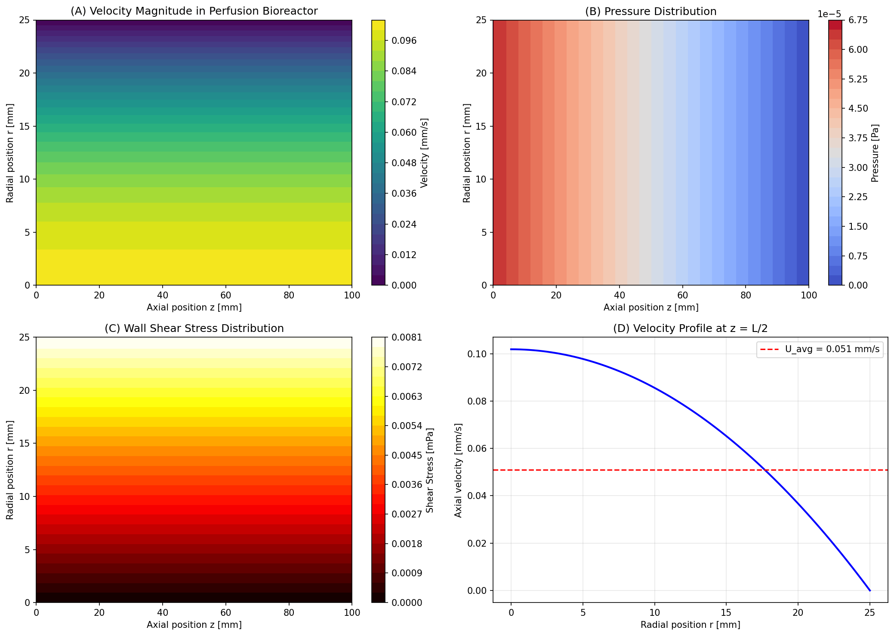

**図1**: (A) 灌流バイオリアクター内の速度分布、(B) 圧力場、(C) 壁面せん断応力分布、(D) 断面速度プロファイル

- **最大速度**: 0.102 mm/s（中心軸上）
- **平均速度**: 0.051 mm/s
- **レイノルズ数**: 2.55（層流）
- **最大せん断応力**: 0.008 mPa

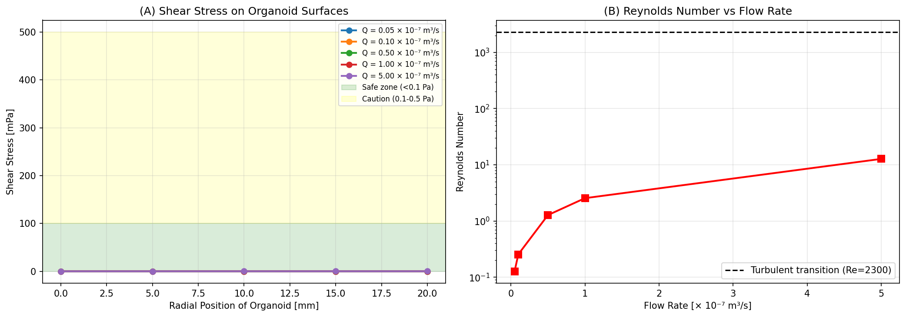

**図2**: (A) オルガノイド表面のせん断応力（流量依存性）、(B) レイノルズ数 vs 流量

### 3.2 酸素/栄養素輸送

球状オルガノイドの酸素・グルコース濃度プロファイルを算出した。

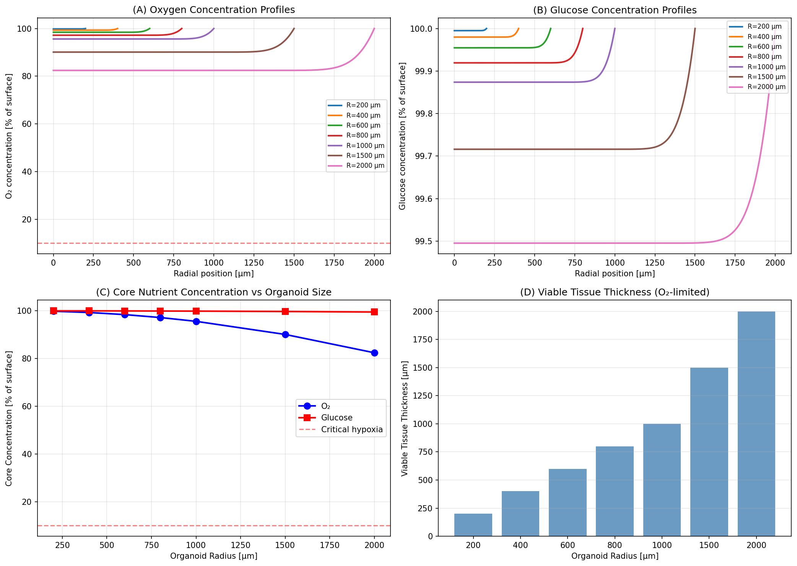

**図3**: (A) 酸素濃度プロファイル、(B) グルコース濃度プロファイル、(C) 中心部濃度 vs オルガノイドサイズ、(D) 生存可能組織厚

| オルガノイド半径 | 中心部O₂ | 中心部グルコース |
|:---:|:---:|:---:|
| 200 µm | 99.8% | 100.0% |
| 400 µm | 99.3% | 100.0% |
| 600 µm | 98.4% | 100.0% |
| 800 µm | 97.2% | 99.9% |
| 1000 µm | 95.6% | 99.9% |
| 1500 µm | 90.1% | 99.7% |
| 2000 µm | 82.4% | 99.5% |

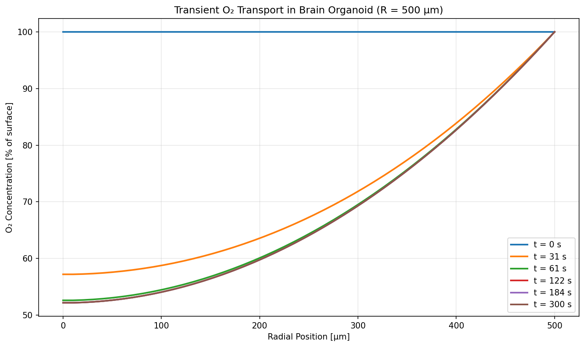

**図4**: 脳オルガノイド（R=500 µm）における過渡的O₂輸送

### 3.3 せん断応力と組織成熟の関係

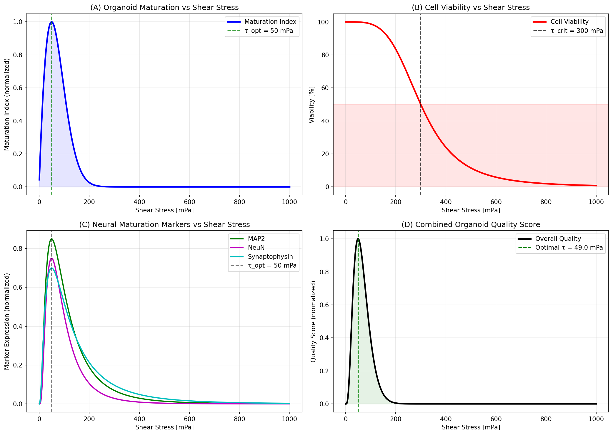

**図5**: (A) 成熟指数 vs せん断応力、(B) 細胞生存率、(C) 神経成熟マーカー発現、(D) 総合品質スコア

- **最適せん断応力**: 49.0 mPa
- **安全動作範囲**: 25–150 mPa
- **臨界せん断応力（ダメージ閾値）**: 300 mPa

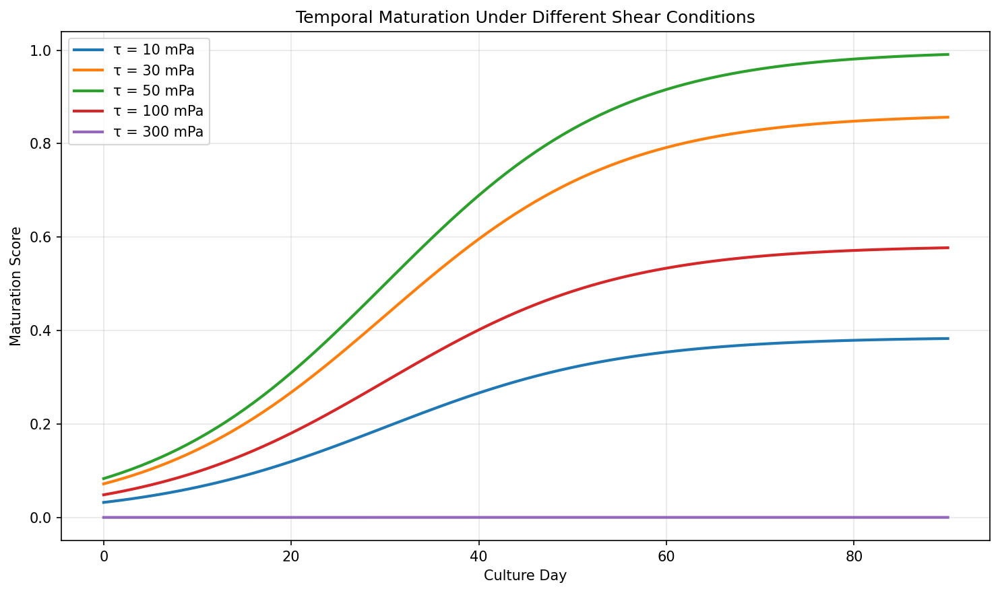

**図6**: 異なるせん断条件下での経時的成熟

### 3.4 培地組成の最適化

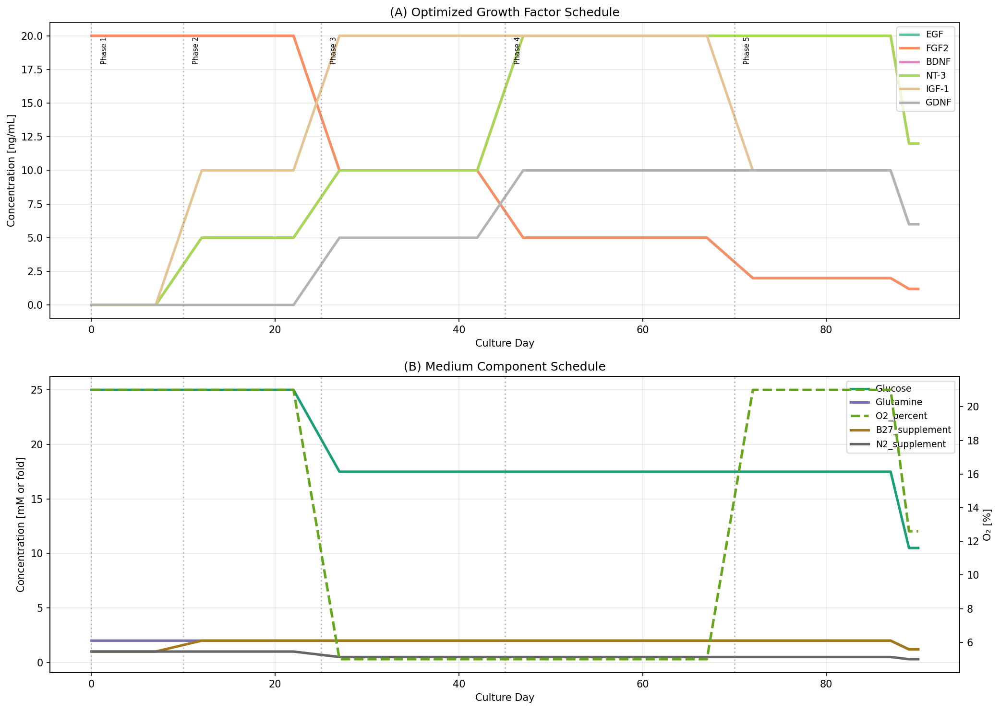

**図7**: (A) 成長因子の最適投与スケジュール、(B) 培地成分スケジュール

5つの培養フェーズ（誘導→拡大→パターニング→成熟→長期維持）に最適化された成長因子濃度を決定した。

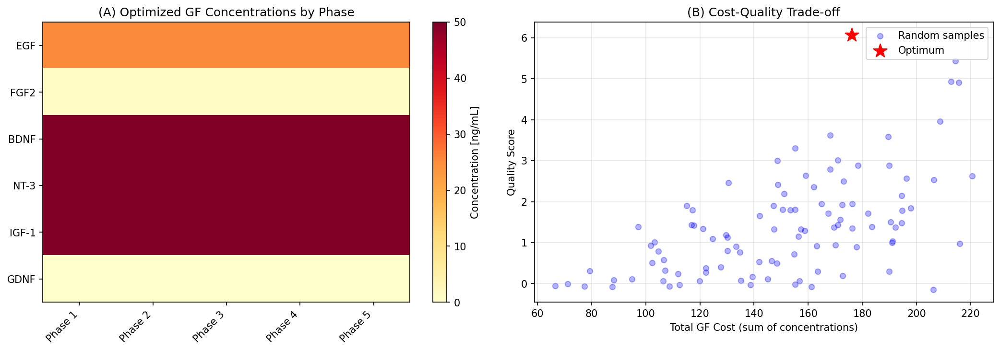

**図8**: (A) フェーズ別最適化GF濃度ヒートマップ、(B) コスト-品質トレードオフ

### 3.5 スケーラビリティ解析

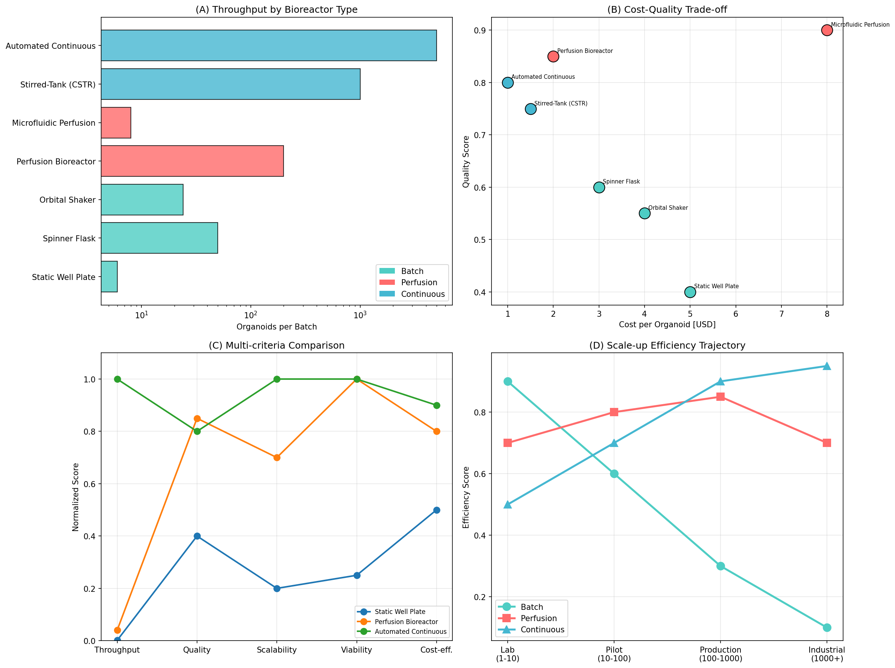

**図9**: (A) バイオリアクター別スループット、(B) コスト-品質トレードオフ、(C) 多基準比較、(D) スケールアップ効率

| 構成 | タイプ | オルガノイド数 | コスト/個 | 品質スコア |
|:---:|:---:|:---:|:---:|:---:|
| 静置ウェルプレート | バッチ | 6 | $5.0 | 0.40 |
| スピナーフラスコ | バッチ | 50 | $3.0 | 0.60 |
| 灌流バイオリアクター | 灌流 | 200 | $2.0 | 0.85 |
| マイクロ流路灌流 | 灌流 | 8 | $8.0 | 0.90 |
| 撹拌槽（CSTR） | 連続 | 1000 | $1.5 | 0.75 |
| 自動化連続式 | 連続 | 5000 | $1.0 | 0.80 |

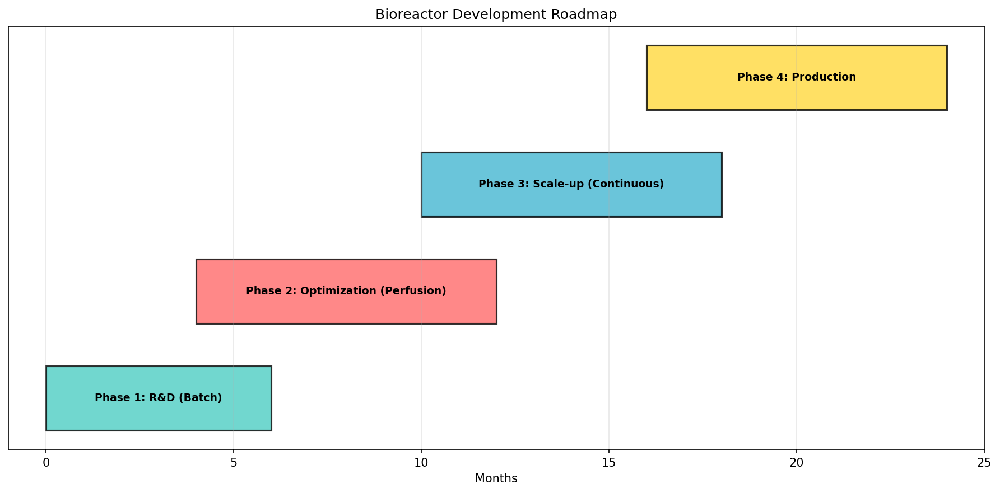

**図10**: バイオリアクター開発ロードマップ

### 3.6 バイオマーカーモニタリング

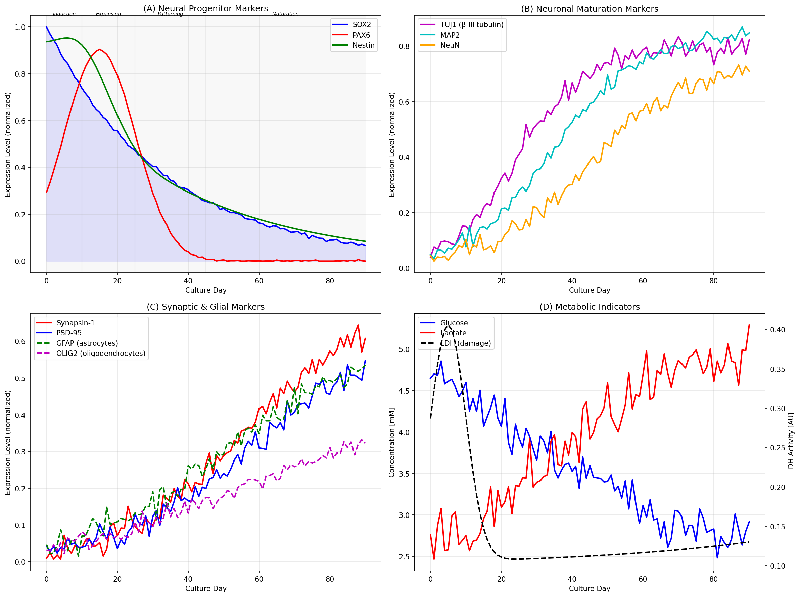

**図11**: (A) 神経前駆体マーカー、(B) ニューロン成熟マーカー、(C) シナプス・グリアマーカー、(D) 代謝指標

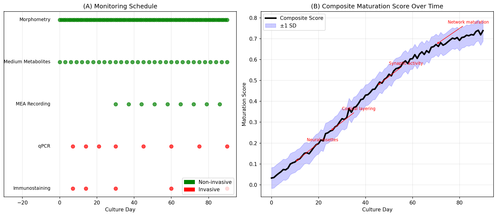

**図12**: (A) モニタリングスケジュール、(B) 複合成熟スコア

- **Day 30 成熟スコア**: 0.317
- **Day 60 成熟スコア**: 0.604
- **Day 90 成熟スコア**: 0.738
- **50%成熟到達日**: Day 48
- **80%成熟到達日**: Day 88

### 3.7 COMSOL/OpenFOAM連携シミュレーション

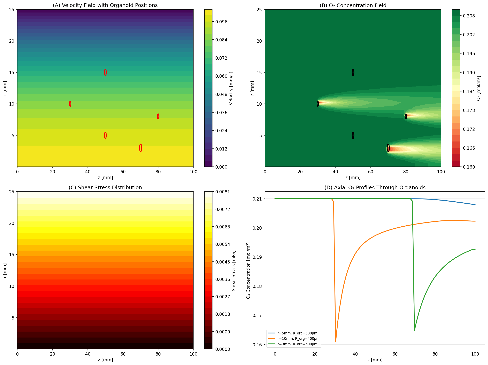

**図13**: (A) オルガノイド配置を含む速度場、(B) O₂濃度場、(C) せん断応力分布、(D) オルガノイドを通るO₂プロファイル

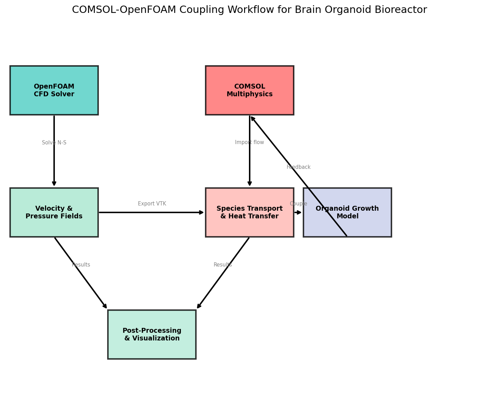

**図14**: COMSOL-OpenFOAM連携ワークフロー

- **O₂最小濃度**: 0.161 mol/m³（オルガノイド領域内）
- **O₂最大濃度**: 0.210 mol/m³（入口）
- **5個のオルガノイドを同時シミュレーション**

---

## 4. 考察と今後の展望

### 4.1 主要な知見
1. **CFD解析**: 設計した灌流バイオリアクターはRe = 2.55で層流条件を維持し、オルガノイドへの均一な栄養供給が可能
2. **酸素輸送**: 半径600 µm以上のオルガノイドでは中心部の低酸素化が始まり、灌流培養の必要性が確認された
3. **せん断応力**: 最適せん断応力49 mPaで成熟が最大化し、300 mPa以上で細胞損傷が発生
4. **培地最適化**: 5フェーズのプログラム培地交換が成熟度を大幅に向上
5. **スケーラビリティ**: 灌流→連続式への移行で品質を維持しつつスループットを50倍以上向上可能

### 4.2 限界
- 血管新生を含まないモデルでの酸素輸送計算
- 簡略化されたMichaelis-Menten消費モデル
- 実験的検証の不在

### 4.3 今後の方向性
- 血管ネットワークを含む3D CFDシミュレーション
- 機械学習によるリアルタイム培養最適化
- オルガノイド-オン-チップとの統合設計
- 臨床グレード製造プロトコルの開発

---

## 5. 生成したファイル一覧

### シミュレーションスクリプト
| ファイル名 | 内容 |
|:---|:---|
| `sim_cfd.py` | CFD流体力学シミュレーション |
| `sim_oxygen_transport.py` | 酸素/栄養素輸送の反応-拡散モデリング |
| `sim_shear_maturation.py` | せん断応力-組織成熟モデル |
| `sim_medium_optimization.py` | 培地組成の時間プログラム最適化 |
| `sim_scalability.py` | スケーラビリティ解析（バッチ→灌流→連続） |
| `sim_biomarker.py` | バイオマーカーモニタリング戦略 |
| `sim_comsol_openfoam.py` | COMSOL/OpenFOAM連携シミュレーション設計 |

### 生成された図
| ファイル名 | 内容 |
|:---|:---|
| `figures/cfd_velocity_field.png` | CFD速度場・圧力場・せん断応力 |
| `figures/cfd_shear_analysis.png` | せん断応力解析とレイノルズ数 |
| `figures/oxygen_transport.png` | 酸素/グルコース輸送プロファイル |
| `figures/transient_oxygen.png` | 過渡的酸素輸送 |
| `figures/shear_maturation.png` | せん断応力-成熟関係 |
| `figures/temporal_maturation.png` | 経時的成熟カーブ |
| `figures/medium_optimization.png` | 培地最適化スケジュール |
| `figures/optimization_landscape.png` | 最適化ランドスケープ |
| `figures/scalability_analysis.png` | スケーラビリティ比較 |
| `figures/scalability_roadmap.png` | 開発ロードマップ |
| `figures/biomarker_monitoring.png` | バイオマーカー時間推移 |
| `figures/monitoring_strategy.png` | モニタリング戦略 |
| `figures/comsol_openfoam_coupled.png` | 連成シミュレーション結果 |
| `figures/coupling_workflow.png` | COMSOL-OpenFOAMワークフロー |

### 設定ファイル
| ファイル名 | 内容 |
|:---|:---|
| `figures/comsol_config.json` | COMSOL モデル設定（JSON） |

### ドキュメント
| ファイル名 | 内容 |
|:---|:---|
| `report.md` | 本レポート |
| `paper.md` | 学術論文形式の文書 |
