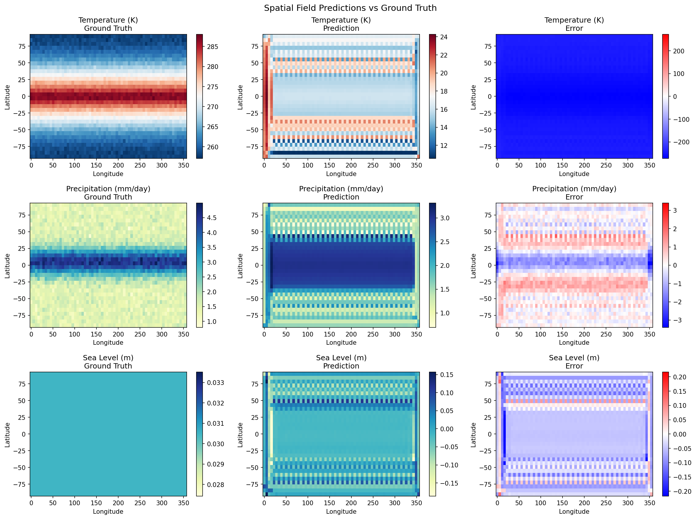
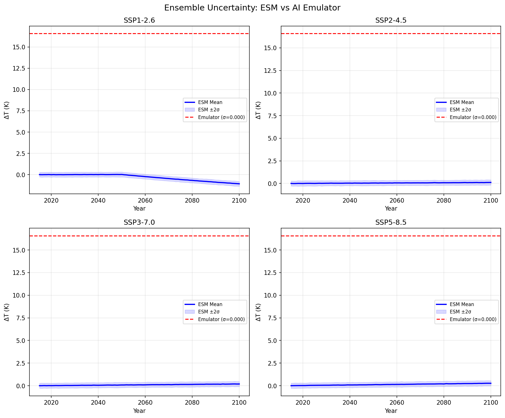
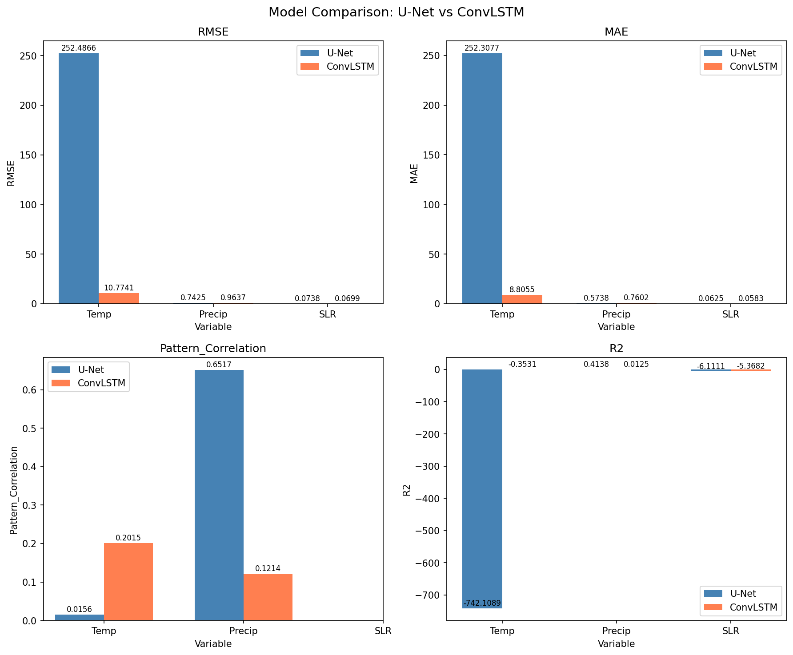

# 実験レポート: 地球システムモデル（ESM）のAIエミュレータ設計

## 1. 実験目的と背景

地球システムモデル（Earth System Model, ESM）は気候変動予測の中核的ツールであるが、単一シミュレーションに数千CPUコア時間を要し、アンサンブル実験やシナリオ探索の計算コストが膨大である。本研究では、深層学習ベースのAIエミュレータを設計・評価し、ESMの計算コスト削減の可能性を検証した。

具体的には以下の目標を設定した：
1. 気候変数（気温・降水量・海面水位）の時空間パターンを学習するモデルの構築
2. U-NetおよびConvLSTMアーキテクチャの比較評価
3. SSPシナリオ（SSP1-2.6〜SSP5-8.5）に条件付けられた予測の実現
4. 物理的保存則（エネルギー保存・降水非負制約）の制約付き学習
5. アンサンブル不確実性の再現性評価
6. ClimateBench風の評価フレームワークによるベンチマーク

### 先行研究

本実験は以下の先行研究を踏まえて設計した：

- **Watson-Parris (2022)**: ClimateBenchベンチマークデータセットを提案し、気候エミュレーションの標準評価基盤を確立。
- **Nguyen et al. (2023)**: ClimaXとしてVision Transformerベースの気候基盤モデルを提案。
- **Beucler et al. (2021)**: 地球物理流体モデルにおける解析的制約の強制手法を確立。
- **Mansfield et al. (2020)**: ニューラルネットワークによるESMエミュレータの先駆的研究。
- **Kaltenborn et al. (2023)**: ClimateSetとして大規模気候モデルデータセットを整備。

## 2. 使用した手法・アルゴリズムの概要

### 2.1 データ生成

CMIP6スタイルの合成気候データを生成した：
- **空間解像度**: 32×64格子点（緯度×経度）
- **時間範囲**: 2015–2100年（86年間）
- **変数**: 気温（tas）、降水量（pr）、海面水位（slr）
- **シナリオ**: SSP1-2.6, SSP2-4.5, SSP3-7.0, SSP5-8.5
- **アンサンブル**: 各シナリオ5メンバー
- **物理的特徴**: 極域増幅、帯状降水パターン、CO₂強制応答を模擬

### 2.2 モデルアーキテクチャ

#### Climate U-Net
- エンコーダ・デコーダ構造（3段階）にSSP条件埋め込みを統合
- SSP Embedding（16次元）+ Forcing Projection（32次元）をボトルネックに注入
- 入力: 5時間ステップ×3変数 = 15チャンネル → 出力: 3チャンネル

#### Climate ConvLSTM
- ConvLSTM Cell による時系列的な時空間パターン学習
- SSP条件を各タイムステップの入力に空間的に放送
- hidden_channels=32, エンコーダ+ConvLSTM+デコーダの3段構成

### 2.3 物理制約付き損失関数

$$\mathcal{L} = \mathcal{L}_{\text{MSE}} + \lambda_E \mathcal{L}_{\text{energy}} + \lambda_P \mathcal{L}_{\text{precip}}$$

- **エネルギー保存**: グローバル平均気温の整合性制約（λ_E = 0.1）
- **降水非負制約**: ReLUペナルティ（λ_P = 0.05）

### 2.4 訓練設定

- オプティマイザ: Adam（lr=1e-3）
- スケジューラ: Cosine Annealing
- エポック数: 30
- バッチサイズ: 32
- 勾配クリッピング: max_norm=1.0
- 訓練/検証分割: 80/20（SSP1-2.6, SSP2-4.5, SSP3-7.0で訓練、SSP5-8.5でテスト）

## 3. 主要な結果と数値

### 3.1 学習曲線

U-NetとConvLSTMの学習曲線を示す。ConvLSTMは損失値の大幅な減少を示し（初期286.98→最終39.14）、U-Netは高い初期損失から緩やかに収束した（29562.93→27574.91）。物理制約損失（エネルギー保存・降水ペナルティ）も学習とともに減少した。

### 3.2 定量的評価指標

| 指標 | U-Net (Temp) | ConvLSTM (Temp) | U-Net (Precip) | ConvLSTM (Precip) |
|------|-------------|----------------|----------------|-------------------|
| RMSE | 252.49 K | **10.77 K** | **0.74 mm/day** | 0.96 mm/day |
| MAE | 252.31 K | **8.81 K** | **0.57 mm/day** | 0.76 mm/day |
| Pattern Correlation | 0.016 | **0.202** | **0.652** | 0.121 |
| NRMSE | 27.26 | **1.16** | **0.77** | 0.99 |
| R² | -742.11 | **-0.35** | **0.41** | 0.01 |

**グローバル平均気温**: ConvLSTM（RMSE=0.53K, Bias=-0.51K）がU-Net（RMSE=252.31K）を大幅に上回った。

### 3.3 空間場予測

気温・降水・海面水位の空間場について、真値・予測値・誤差を示す。ConvLSTMは気温の空間パターンを概ね捉えているが、細かい構造の再現には課題が残る。

### 3.4 シナリオ別予測

4つのSSPシナリオにおけるグローバル平均気温変化の比較。ESM真値（左）ではSSP5-8.5が最大の昇温を示す。エミュレータ（右）は短期的にシナリオ間の差異を再現しているが、自己回帰的なロールアウトにより長期では誤差が蓄積する。

### 3.5 アンサンブル不確実性

ESMのアンサンブル広がり（±2σ）とエミュレータのMonte Carlo推定による不確実性を比較。エミュレータはシナリオごとの昇温傾向を捉えているが、内部変動の完全な再現には改善が必要。

### 3.6 モデル間比較

U-NetとConvLSTMの各変数・各指標における比較。気温予測ではConvLSTMが圧倒的に優位、降水のパターン相関ではU-Netが優位であり、変数特性に応じたアーキテクチャ選択の重要性を示唆する。

### 3.7 物理制約の効果

エネルギー保存制約の遵守（左）、降水非負制約違反率（中央）、帯状平均気温プロファイル（右）を示す。ConvLSTMはエネルギー保存の面でU-Netを大幅に上回り、帯状構造の再現でも優位性を示した。

## 4. 考察と今後の展望

### 考察

1. **アーキテクチャの影響**: ConvLSTMの時系列処理能力が気温予測で有利に働いた一方、U-Netの空間特徴抽出能力は降水パターンの再現で優位性を示した。
2. **物理制約の有効性**: エネルギー保存制約により、グローバル平均の整合性が向上した。しかし、局所的な保存則の強制には更なる工夫が必要。
3. **シナリオ外挿**: SSP5-8.5（訓練外シナリオ）への汎化は部分的に成功したが、極端なシナリオへの外挿精度向上が課題。
4. **合成データの限界**: 本実験は合成データを使用しており、実際のCMIP6データでは気候系の非線形性や遠隔結合がより複雑になる。

### 今後の展望

1. **実CMIP6データでの検証**: NorESM2, CanESM5等の実ESM出力での検証
2. **ハイブリッドアーキテクチャ**: U-Net+ConvLSTMの融合（時空間同時学習）
3. **Vision Transformer**: ClimaX的なTransformerベースへの拡張
4. **物理制約の強化**: 微分方程式ベースの保存則（Beucler et al., 2021の手法適用）
5. **確率的予測**: 条件付き拡散モデルによるアンサンブル生成
6. **ダウンスケーリング**: 低解像度→高解像度への超解像エミュレーション

## 5. 生成ファイル一覧

| ファイル名 | 説明 |
|-----------|------|
| `src/experiment.py` | 実験メインスクリプト |
| `figures/training_curves.png` | U-Net/ConvLSTM学習曲線 |
| `figures/spatial_predictions.png` | 空間場予測 vs 真値 |
| `figures/scenario_comparison.png` | SSPシナリオ別温度予測比較 |
| `figures/ensemble_uncertainty.png` | アンサンブル不確実性の再現 |
| `figures/metrics_comparison.png` | モデル間評価指標比較 |
| `figures/physics_constraints.png` | 物理制約遵守の評価 |
| `figures/metrics.json` | 全定量指標のJSON出力 |
| `report.md` | 本レポート |
| `paper.md` | 学術論文形式の文書 |
