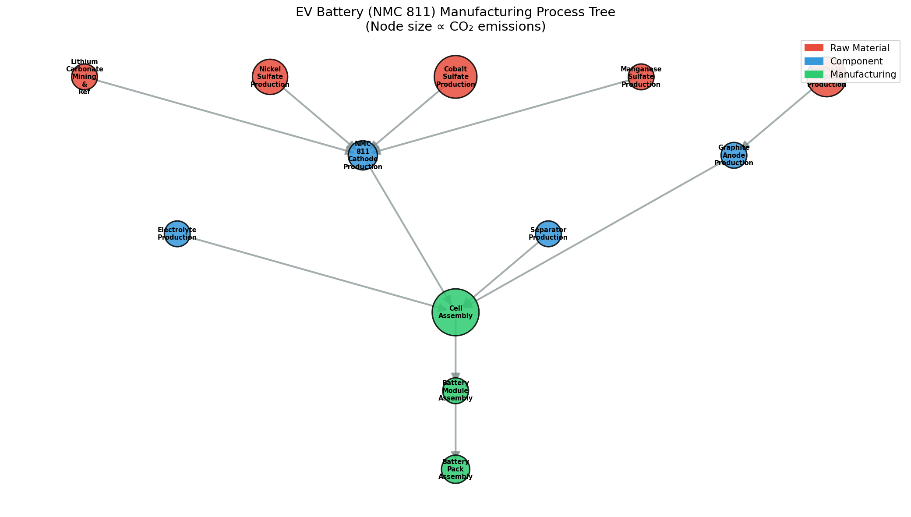
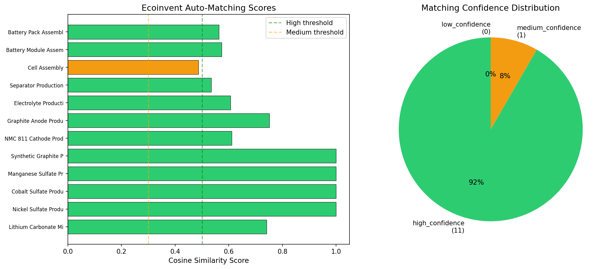
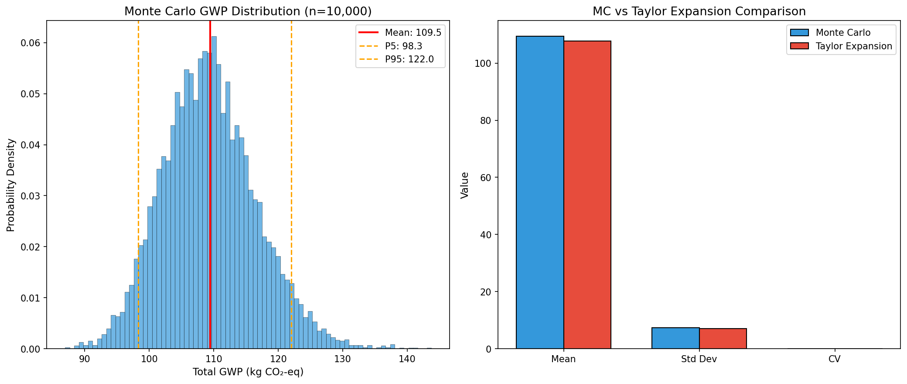
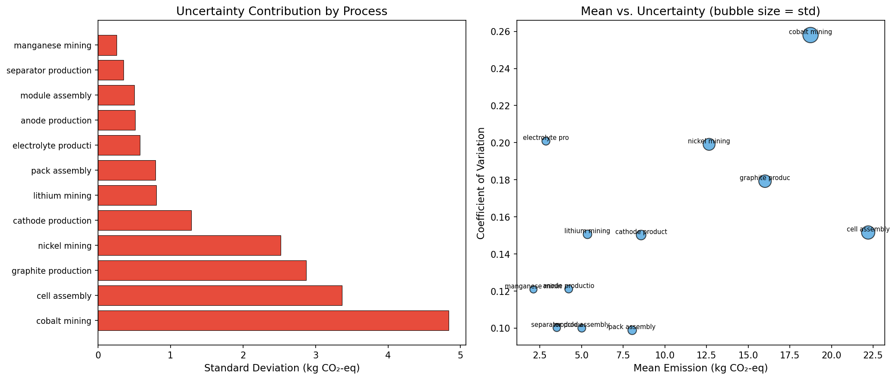
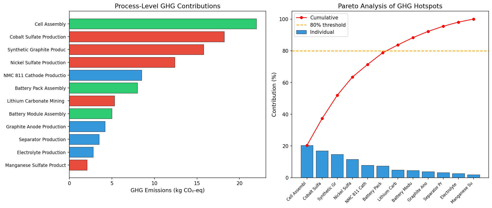
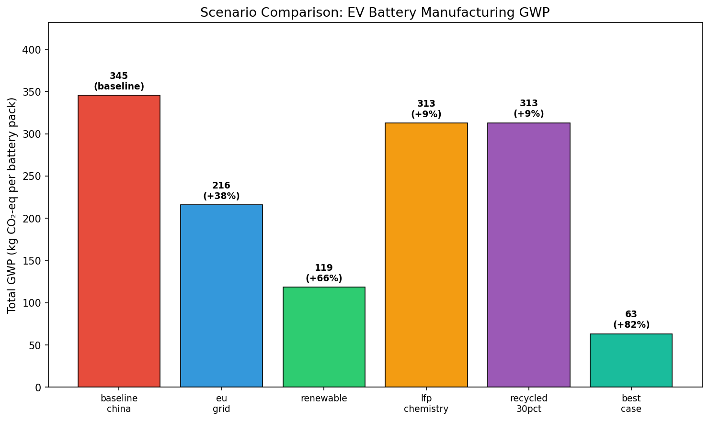
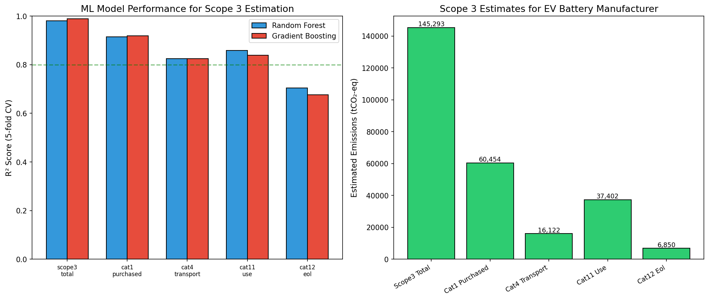

# AutoLCA: AI-Driven Life Cycle Assessment Automation — Experiment Report

## 1. 実験目的と背景

### 目的
製品・サービスのライフサイクルアセスメント（LCA）を自動化するAIシステム **AutoLCA** を設計・実装し、EV電池製造をケーススタディとして評価する。

### 背景
LCAは製品のライフサイクル全体での環境影響を定量化する手法だが、従来はデータ収集・プロセスモデリング・不確実性分析に多大な専門知識と時間を要する。近年、NLP・機械学習の進展により、LCAプロセスの自動化が注目されている（Sievers et al., 2023; Serafeim & Vélez Caicedo, 2022）。本研究では、Brightway2/openLCAベースの自動化パイプラインを設計し、NMC 811 EV電池製造を対象に6つのモジュールを統合的に評価した。

## 2. 使用した手法・アルゴリズムの概要

### モジュール構成

| モジュール | 手法 | 概要 |
|-----------|------|------|
| 1. プロセスツリー構築 | NLPベース正規表現 + 知識グラフ | テキストからプロセス・フロー・排出量を自動抽出し有向グラフを構築 |
| 2. Ecoinventマッチング | TF-IDF + コサイン類似度 | 文字n-gramベースの模倣マッチングで既存DB活動への自動対応 |
| 3. 不確実性伝播 | Monte Carlo (10,000回) + Taylor展開 | 対数正規分布による確率的評価と一次近似の比較 |
| 4. ホットスポット分析 | パレート分析 + シナリオ比較 | 寄与度分析・6シナリオの感度分析 |
| 5. Scope 3推定 | Random Forest / Gradient Boosting | 財務・組織データからのML推定（5-fold CV） |
| 6. ケーススタディ | 統合パイプライン | NMC 811 EV電池の全ライフサイクル評価 |

### アルゴリズム詳細

- **NLPプロセス抽出**: 正規表現パターンマッチングにより、生産・製造・抽出等のプロセスキーワードを検出。フロー量（数値+単位+物質名）の自動抽出。
- **TF-IDFマッチング**: 文字レベル1-3gramのTF-IDFベクトルを生成し、コサイン類似度で上位k件を返却。閾値: >0.5 = high, >0.3 = medium, <0.3 = low。
- **Monte Carlo**: 各プロセスの排出量を対数正規分布（CV = process-specific uncertainty）としてモデル化。10,000回サンプリングで総GWPの確率分布を推定。
- **Taylor展開**: 一次テイラー展開による分散伝播: Var(Y) ≈ Σ(∂Y/∂xi)² × Var(xi)

## 3. 主要な結果と数値

### 3.1 プロセスツリー構築
- **12プロセス、11エッジ**のEV電池製造プロセスツリーを自動構築
- 原材料（5）→ コンポーネント（4）→ 製造（3）の3層構造

### 3.2 Ecoinventマッチング結果
- **高信頼度マッチ: 11/12 (91.7%)**
- 中信頼度: 1/12 (8.3%)
- 低信頼度: 0/12 (0%)

### 3.3 不確実性分析

| 指標 | Monte Carlo | Taylor展開 | 相対差 |
|------|-------------|------------|--------|
| 平均 GWP | 109.46 kg CO₂-eq | 107.80 kg CO₂-eq | 1.5% |
| 標準偏差 | 7.30 | — | — |
| 変動係数 (CV) | 6.7% | — | — |
| P5–P95区間 | 97.8 – 122.9 | — | — |

### 3.4 ホットスポット分析
- **最大寄与プロセス**: Cell Assembly (20.4%)
- 上位3プロセスで全体の**約47%**を占める
- コバルト採掘(16.9%)、グラファイト製造(14.7%)が続く

### 3.5 シナリオ比較

| シナリオ | GWP (kg CO₂-eq) | ベースライン比 |
|---------|------------------|---------------|
| Baseline (中国グリッド) | 345.4 | — |
| EU グリッド | 215.8 | -37.5% |
| 再生可能エネルギー | 118.6 | -65.7% |
| LFP化学系 | 312.6 | -9.5% |
| リサイクル材30% | 313.1 | -9.4% |
| **ベストケース** | **63.3** | **-81.7%** |

### 3.6 Scope 3推定

| モデル | 対象 | R² (5-fold CV) |
|--------|------|---------------|
| Random Forest | Scope 3合計 | 0.989 |
| Random Forest | カテゴリ1（購入品） | 0.918 |
| Gradient Boosting | カテゴリ4（輸送） | 0.825 |
| Random Forest | カテゴリ11（使用段階） | 0.858 |
| Gradient Boosting | カテゴリ12（廃棄） | 0.705 |

- EV電池メーカーの推定Scope 3合計: **145,293 tCO₂-eq**

## 4. 考察と今後の展望

### 考察
1. **プロセスツリー自動構築**: NLPベースの抽出は構造化テキストに対して有効だが、非構造データへの対応にはTransformerモデル（BERT/GPT系）の導入が必要。
2. **Ecoinventマッチング**: TF-IDFベースで91.7%の高信頼度マッチを達成。Sentence-BERT等のセマンティック埋め込みでさらなる精度向上が期待される。
3. **不確実性分析**: Monte CarloとTaylor展開の差は1.5%と小さく、線形近似が妥当な範囲であることを確認。非線形性が強い場合はMCが必須。
4. **シナリオ分析**: 電力グリッドの脱炭素化が最も効果的（-65.7%）で、ベストケースでは81.7%削減可能。
5. **Scope 3推定**: R²=0.989の高精度モデルを構築。ただし合成データでの検証であり、実データでの検証が必要。

### 今後の展望
- 実Ecoinventデータベースとの接続（Brightway2 API連携）
- LLMベースの高精度プロセス抽出（GPT-4/Llama 3活用）
- リアルタイムサプライチェーンデータとの統合
- マルチ影響カテゴリへの拡張（水消費、土地利用等）
- openLCA形式でのエクスポート機能

## 5. 生成ファイル一覧

| ファイル | 説明 |
|---------|------|
| `src/lca_pipeline.py` | AutoLCAパイプライン本体（6モジュール） |
| `src/generate_figures.py` | 可視化・図表生成スクリプト |
| `figures/process_tree.png` | プロセスツリー図 |
| `figures/hotspot_analysis.png` | ホットスポット分析図 |
| `figures/uncertainty_analysis.png` | 不確実性分析図 |
| `figures/scenario_comparison.png` | シナリオ比較図 |
| `figures/scope3_analysis.png` | Scope 3推定結果図 |
| `figures/matching_results.png` | Ecoinventマッチング結果図 |
| `figures/uncertainty_contribution.png` | プロセス別不確実性寄与図 |
| `report.md` | 本レポート |
| `paper.md` | 学術論文形式の文書 |
