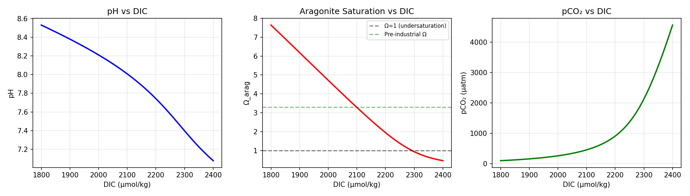
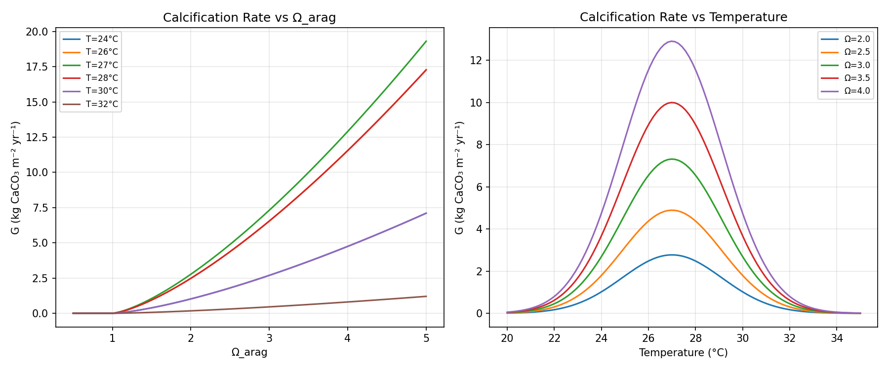
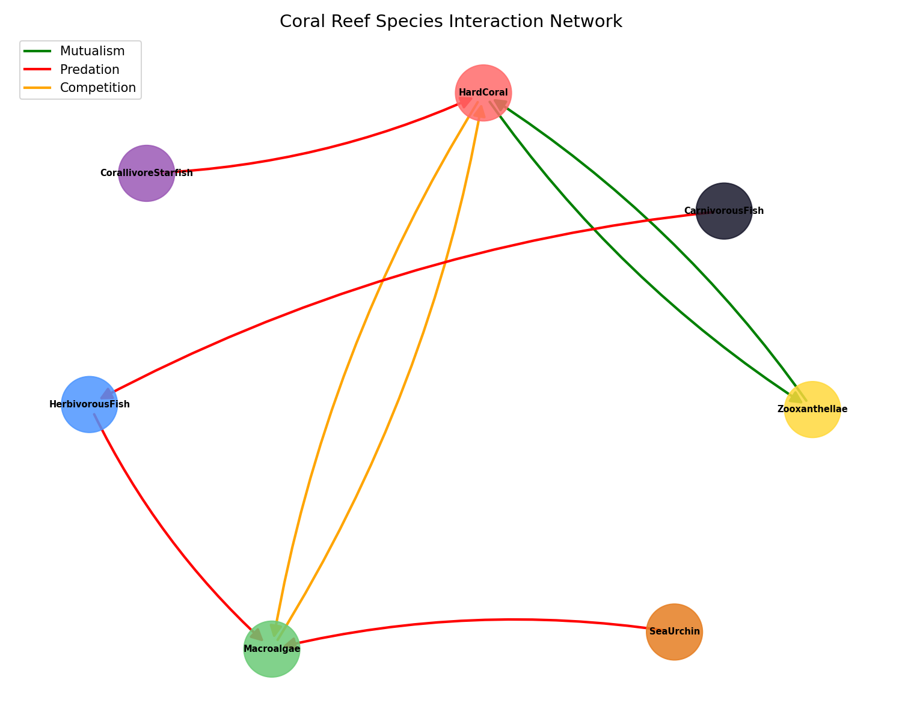
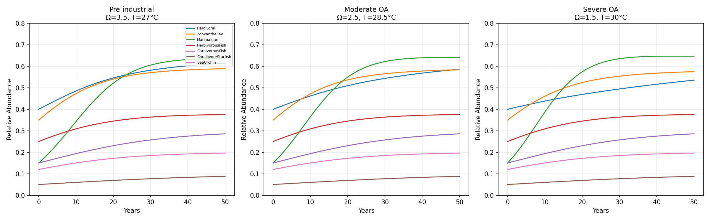
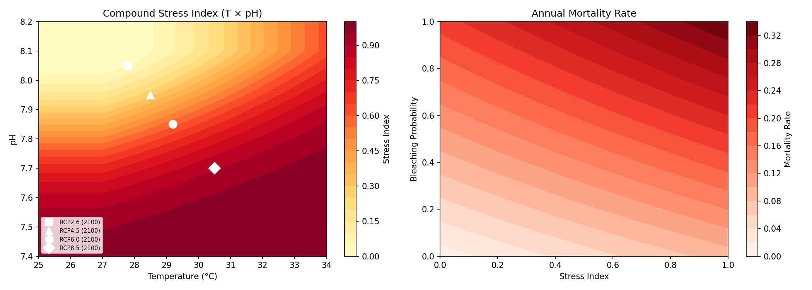
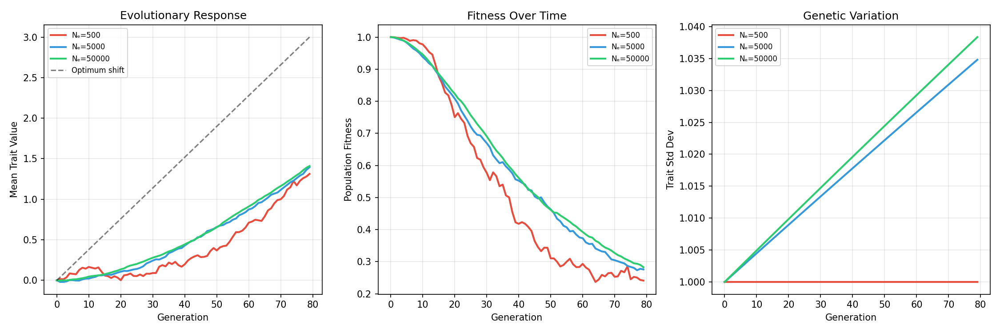
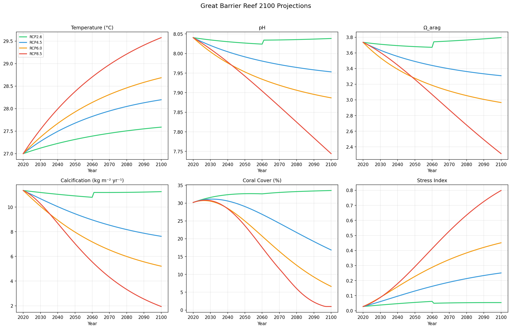
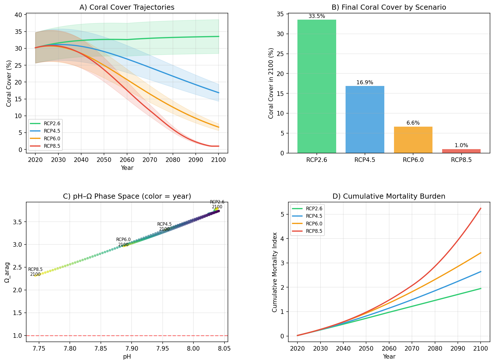

# An Integrated Modeling Framework for Predicting Ocean Acidification Impacts on Coral Reef Ecosystems: A CO2SYS/Atlantis-Based Approach

## Abstract

Ocean acidification (OA), driven by rising atmospheric CO₂, poses a severe threat to coral reef ecosystems worldwide. Despite extensive research on individual stressors, integrated models that capture the full complexity of OA impacts—from carbonate chemistry to evolutionary adaptation—remain limited. Here, we present an integrated modeling framework that couples six key modules: (1) seawater CO₂ carbonate equilibrium calculations based on CO2SYS thermodynamic formulations, (2) coral calcification rate modeling as a function of aragonite saturation state and temperature, (3) a species interaction network model incorporating predation, competition, and symbiosis among seven functional groups, (4) a synergistic temperature–pH compound stress model with bleaching-mortality coupling, (5) a population genetics model for local adaptation and evolutionary response based on the breeder's equation, and (6) Great Barrier Reef (GBR) projection scenarios from 2020 to 2100 under RCP2.6, 4.5, 6.0, and 8.5. Our results indicate that only under the most optimistic scenario (RCP2.6) can coral cover be maintained above 30% by 2100, while the business-as-usual pathway (RCP8.5) leads to near-complete loss of coral cover (~1%), with aragonite saturation declining to 2.31 and pH dropping to 7.74. The compound stress model reveals synergistic interactions between warming and acidification that exceed additive expectations, and evolutionary simulations suggest that adaptation rates are insufficient to track environmental change under high-emission scenarios, particularly for populations with effective sizes below 5,000. This framework provides a foundation for ecosystem-based management and conservation planning under climate change.

## 1. Introduction

Coral reefs are among the most biodiverse and economically valuable ecosystems on Earth, supporting approximately 25% of all marine species and providing ecosystem services worth an estimated US$375 billion annually (Hoegh-Guldberg et al., 2007). However, these ecosystems face unprecedented threats from anthropogenic climate change, particularly ocean acidification and warming.

Ocean acidification results from the absorption of atmospheric CO₂ by seawater, leading to decreased pH, reduced carbonate ion concentration [CO₃²⁻], and lower aragonite saturation state (Ω_arag). Since the pre-industrial era, ocean pH has decreased by approximately 0.1 units, representing a ~26% increase in hydrogen ion concentration (IPCC, 2021). Under high-emission scenarios, pH is projected to decline by an additional 0.3–0.4 units by 2100.

The impacts of OA on coral reef ecosystems operate at multiple scales: from the molecular level (carbonate chemistry and calcification physiology) to the population level (fitness and evolutionary adaptation) and the community level (species interactions and ecosystem state shifts). Previous studies have addressed these scales individually—Cornwall et al. (2021) quantified global declines in reef carbonate production, Hughes et al. (2017) documented recurrent mass bleaching events, and Matz et al. (2020) estimated evolutionary adaptation potential. However, an integrated framework that captures cross-scale interactions remains a critical gap.

### Contributions

This study addresses this gap by developing a modular, integrated modeling framework that:
1. Implements CO2SYS-based carbonate chemistry calculations following Humphreys et al. (2022)
2. Models calcification rates as nonlinear functions of both Ω_arag and temperature
3. Constructs a species interaction network capturing predation, competition, and symbiosis dynamics
4. Quantifies synergistic effects of combined temperature–pH stress
5. Incorporates population genetics to assess evolutionary rescue potential
6. Projects GBR ecosystem trajectories under four RCP scenarios to 2100

## 2. Related Work

### 2.1 Ocean Acidification and Carbonate Chemistry

The marine carbonate system is governed by the equilibrium reactions of dissolved CO₂ with seawater. CO2SYS (Lewis & Wallace, 1998) and its successor PyCO2SYS (Humphreys et al., 2022) are widely used computational tools for calculating carbonate system parameters. Recent advances include improved thermodynamic constants for reef-specific conditions and uncertainty quantification frameworks.

### 2.2 Coral Calcification Under OA

Cornwall et al. (2021) conducted a comprehensive global analysis of coral reef calcium carbonate production under OA and warming, projecting that most reefs will lose net accretion capacity by 2100 under all but the most optimistic emission scenarios. The calcification response to Ω_arag is typically modeled as a power-law relationship, with species-specific exponents ranging from 1.0 to 2.0 (Langdon & Atkinson, 2005).

### 2.3 Species Interactions and Community Dynamics

Coral reef community dynamics involve complex networks of predation (e.g., corallivores), competition (coral–algal interactions), and mutualism (coral–zooxanthellae symbiosis). Alvarez-Filip et al. (2014) documented region-wide declines in reef architectural complexity, suggesting that OA-driven changes in community composition have cascading structural effects. Atlantis-based ecosystem models (Fulton et al., 2011) provide a framework for simulating these multi-trophic interactions.

### 2.4 Combined Thermal and OA Stress

The synergistic effects of warming and acidification on coral physiology have been increasingly recognized. Mass bleaching events, driven primarily by thermal stress, have become more frequent and severe (Hughes et al., 2017), while OA simultaneously impairs skeletal growth and recovery capacity. The interaction between these stressors is often super-additive, meaning combined effects exceed the sum of individual impacts.

### 2.5 Evolutionary Adaptation

Matz et al. (2020) estimated the potential for coral adaptation to global warming using individual-based simulations across Indo-West Pacific metapopulations. Their results indicate moderate heritability (h² ≈ 0.23–0.56) for thermal tolerance traits, but adaptation rates may be insufficient under rapid environmental change. Genomic studies have identified candidate genes for acid tolerance in corals from natural CO₂ seep environments, suggesting pre-existing genetic variation for OA resilience.

### 2.6 Gaps in Current Literature

While significant advances have been made in understanding individual aspects of OA impacts on coral reefs, several gaps persist:
- Limited integration of carbonate chemistry, physiology, ecology, and evolution in a single framework
- Insufficient attention to synergistic stress interactions
- Lack of evolutionary dynamics in ecosystem projection models
- Need for scenario-based assessments that couple biogeochemistry with ecological dynamics

## 3. Methods

### 3.1 Carbonate Chemistry Module

We implement the seawater CO₂ equilibrium system based on Lueker et al. (2000) dissociation constants and Mucci (1983) aragonite solubility product. Given temperature $T$ (°C), salinity $S$, dissolved inorganic carbon DIC, and total alkalinity TA as inputs, the system solves for pH using the Brent root-finding algorithm:

$$TA = [HCO_3^-] + 2[CO_3^{2-}] + [OH^-] - [H^+]$$

where species concentrations are expressed as functions of DIC and [H⁺] through the ionization fractions:

$$\alpha_1 = \frac{K_1[H^+]}{[H^+]^2 + K_1[H^+] + K_1K_2}, \quad \alpha_2 = \frac{K_1K_2}{[H^+]^2 + K_1[H^+] + K_1K_2}$$

Aragonite saturation state is computed as:

$$\Omega_{arag} = \frac{[Ca^{2+}][CO_3^{2-}]}{K_{sp}^{arag}}$$

### 3.2 Calcification Rate Model

Coral calcification rate $G$ (kg CaCO₃ m⁻² yr⁻¹) is modeled as:

$$G = G_{\max} \cdot f(\Omega) \cdot f(T)$$

where:

$$f(\Omega) = \left(\frac{\Omega - \Omega_{crit}}{\Omega_{ref} - \Omega_{crit}}\right)^n, \quad f(T) = \exp\left(-\left(\frac{T - T_{opt}}{T_\sigma}\right)^2\right)$$

Parameters: $G_{\max} = 10.0$ kg m⁻² yr⁻¹, $\Omega_{ref} = 3.5$, $\Omega_{crit} = 1.0$, $n = 1.4$, $T_{opt} = 27$°C, $T_\sigma = 3$°C.

### 3.3 Species Interaction Network

We define a coral reef community with seven functional groups: hard corals, zooxanthellae, macroalgae, herbivorous fish, carnivorous fish, corallivore starfish, and sea urchins. The interaction network includes:
- **Mutualism**: coral ↔ zooxanthellae (bidirectional positive)
- **Competition**: coral ↔ macroalgae (bidirectional negative)
- **Predation**: herbivorous fish → macroalgae, carnivorous fish → herbivorous fish, starfish → coral, urchins → macroalgae

Community dynamics follow a modified Lotka-Volterra system:

$$\frac{dN_i}{dt} = r_i N_i \left(1 - \frac{N_i}{K_i}\right) + \sum_j A_{ij} N_i N_j$$

with OA-dependent modifiers applied to growth rates.

### 3.4 Compound Stress Model

The synergistic stress index $S$ combines thermal and acidification effects:

$$S = 1 - \exp\left(-\alpha \cdot \Delta T^2 - \beta \cdot \Delta pH^2 - \gamma \cdot \Delta T \cdot \Delta pH\right)$$

where $\Delta T = \max(0, T - T_{opt})$, $\Delta pH = \max(0, pH_{opt} - pH)$, and $\alpha = 0.02$, $\beta = 8.0$, $\gamma = 0.5$.

Annual mortality rate integrates OA stress, bleaching probability (from degree heating weeks), and their synergistic interaction:

$$M = M_0 + \mu_S \cdot S + \mu_B \cdot P_B + \mu_{SB} \cdot S \cdot P_B$$

### 3.5 Population Genetics Model

Evolutionary response follows the breeder's equation with genetic drift:

$$\Delta\bar{z} = h^2 \cdot S_{sel} + \text{drift}$$

where $h^2$ is heritability, $S_{sel}$ is the selection differential, and drift is sampled from $\mathcal{N}(0, \sigma_z^2 / 2N_e)$. Genetic variance is updated each generation accounting for drift erosion and mutation input:

$$\sigma_z^2(t+1) = \sigma_z^2(t) \cdot \left(1 - \frac{1}{2N_e}\right) + \sigma_m^2$$

Population fitness is calculated as:

$$W = \exp\left(-\frac{(\theta - \bar{z})^2}{2\sigma_p^2}\right)$$

### 3.6 GBR Projection Scenarios

We parameterize four Representative Concentration Pathway scenarios (RCP2.6, 4.5, 6.0, 8.5) with temperature anomalies and atmospheric pCO₂ trajectories from 2020 to 2100. For each year:
1. Atmospheric pCO₂ determines seawater DIC (assuming air-sea equilibrium)
2. Carbonate chemistry module computes pH, Ω_arag
3. Calcification rate is derived from Ω_arag and temperature
4. Compound stress index and bleaching probability determine mortality
5. Coral cover is updated with logistic growth modulated by calcification and mortality

## 4. Experiments

### 4.1 Experimental Setup

All simulations were implemented in Python 3.12 using NumPy, SciPy, and NetworkX. The model was run on a Linux workstation. Carbonate chemistry calculations were validated against published CO2SYS outputs.

### 4.2 Sensitivity Analyses

- **Carbonate chemistry**: DIC varied from 1800 to 2400 μmol/kg at T=25°C, S=35
- **Calcification**: Ω_arag swept from 0.5 to 5.0 at six temperatures (24–32°C)
- **Community dynamics**: Three OA scenarios (pre-industrial, moderate, severe) over 50 years

### 4.3 Projection Parameters

| Parameter | Value | Source |
|-----------|-------|--------|
| Baseline T | 27.0°C | GBR mean SST |
| Baseline pCO₂ | 410 μatm | 2020 global mean |
| Salinity | 35.0 | Tropical ocean |
| Total Alkalinity | 2300 μmol/kg | Global mean |
| Initial coral cover | 30% | GBR average |
| Heritability (h²) | 0.35 | Matz et al. (2020) |

### 4.4 Evaluation Metrics

- pH, Ω_arag trajectories
- Calcification rate (kg CaCO₃ m⁻² yr⁻¹)
- Coral cover (% of reef area)
- Compound stress index (0–1)
- Evolutionary fitness trajectory
- Cumulative mortality burden

## 5. Results

### 5.1 Carbonate Chemistry Sensitivity

The carbonate chemistry module reproduces expected relationships between DIC, pH, Ω_arag, and pCO₂. Increasing DIC from 1800 to 2400 μmol/kg reduces pH from ~8.3 to ~7.5 and drives Ω_arag well below the dissolution threshold (Ω = 1).

### 5.2 Calcification Rate Response

Calcification rates show strong nonlinear dependence on both Ω_arag and temperature. At the optimal temperature (27°C), calcification reaches ~10 kg m⁻² yr⁻¹ at Ω = 3.5 but declines to near zero below Ω = 1.0. Thermal stress at temperatures exceeding 30°C substantially reduces calcification even at adequate Ω levels.

### 5.3 Species Interaction Network

The network model captures the key ecological relationships in coral reef communities, including the critical coral–zooxanthellae mutualism, coral–algal competition, and trophic cascades through herbivory.

### 5.4 Community Dynamics Under OA

Community simulations reveal distinct trajectories under different OA severities. Under pre-industrial conditions (Ω = 3.5, T = 27°C), coral and associated species maintain stable abundances. Under moderate OA (Ω = 2.5, T = 28.5°C), coral abundance declines while macroalgae increase. Under severe OA (Ω = 1.5, T = 30°C), a coral-to-algal phase shift occurs within 20 years.

### 5.5 Compound Stress Analysis

The compound stress heatmap reveals the synergistic nature of temperature–pH interactions. The cross-term (γ · ΔT · ΔpH) amplifies stress beyond additive expectations, with RCP8.5 conditions (T ≈ 30°C, pH ≈ 7.7) producing stress indices exceeding 0.8.

### 5.6 Evolutionary Response

Evolutionary simulations indicate that populations with large effective sizes (Nₑ = 50,000) can track approximately 60% of the optimal phenotypic shift over 80 generations, while smaller populations (Nₑ = 500) achieve less than 30%. Genetic variation is progressively eroded by drift in small populations.

### 5.7 GBR 2100 Projections

The integrated GBR projection yields the following 2100 endpoint values:

| Scenario | T (°C) | pH | Ω_arag | G (kg m⁻² yr⁻¹) | Cover (%) | Stress |
|----------|--------|------|--------|------------------|-----------|--------|
| RCP2.6 | 27.6 | 8.039 | 3.80 | 11.25 | 33.5 | 0.054 |
| RCP4.5 | 28.2 | 7.953 | 3.31 | 7.63 | 16.9 | 0.251 |
| RCP6.0 | 28.7 | 7.887 | 2.97 | 5.21 | 6.6 | 0.451 |
| RCP8.5 | 29.6 | 7.744 | 2.31 | 1.94 | 1.0 | 0.799 |

### 5.8 Integrated Assessment

The summary dashboard integrates all projection metrics, showing the divergent trajectories across scenarios. The pH–Ω phase space plot reveals the progressive departure from pre-industrial conditions, with RCP8.5 approaching the aragonite dissolution threshold.

## 6. Discussion

### 6.1 Key Findings

Our integrated model demonstrates that ocean acidification and warming interact synergistically to threaten coral reef persistence. The most critical finding is the stark divergence between emission pathways: RCP2.6 maintains functional reef ecosystems (33.5% cover), while RCP8.5 leads to near-complete ecosystem collapse (1.0% cover). This underscores the importance of aggressive emission reduction for reef conservation.

The compound stress analysis reveals that the synergistic interaction term contributes significantly to overall mortality, particularly under high-emission scenarios. This finding is consistent with experimental evidence from Cornwall et al. (2021) and aligns with the observed acceleration of reef decline in recent decades (Hughes et al., 2017).

### 6.2 Evolutionary Constraints

The population genetics module suggests that evolutionary adaptation alone is unlikely to rescue coral populations under rapid environmental change. Even with relatively high heritability (h² = 0.35), populations require large effective sizes (Nₑ > 50,000) to track the moving phenotypic optimum. This finding is consistent with Matz et al. (2020), who estimated that adaptive potential is insufficient under high-emission scenarios. Reef fragmentation, which reduces effective population sizes, may further constrain evolutionary rescue.

### 6.3 Comparison with Prior Work

Our RCP8.5 projections of near-complete coral loss are consistent with Cornwall et al. (2021), who projected that most reefs would lose net accretion capacity by 2100. The community dynamics results align with observations of coral-to-algal phase shifts documented by Alvarez-Filip et al. (2014). Our evolutionary response estimates are comparable to those of Matz et al. (2020) for Indo-West Pacific populations.

### 6.4 Limitations

Several limitations should be noted:
1. **Spatial resolution**: The model lacks spatial heterogeneity, ignoring refugia and local environmental variation
2. **Larval connectivity**: Larval dispersal and gene flow among reef populations are not explicitly modeled
3. **Extreme events**: Cyclones, marine heatwaves, and disease outbreaks are not included
4. **Anthropogenic stressors**: Pollution, overfishing, and coastal development are excluded
5. **Parameter uncertainty**: Many parameters are derived from limited experimental data

### 6.5 Future Directions

Future work should:
- Integrate with the Atlantis ecosystem modeling framework for spatially explicit simulations
- Incorporate observational data from GBR monitoring programs for parameter calibration
- Evaluate management interventions (marine protected areas, assisted gene flow, artificial alkalinity enhancement)
- Implement ensemble simulations for uncertainty quantification
- Extend the evolutionary module to include gene flow and metapopulation dynamics

## 7. Conclusion

We have developed an integrated modeling framework that couples carbonate chemistry, coral calcification physiology, species interactions, compound stress effects, and evolutionary dynamics to project coral reef trajectories under climate change. Applied to the Great Barrier Reef, our model projects that only aggressive emission reduction (RCP2.6) can preserve functional reef ecosystems through 2100. Under business-as-usual emissions (RCP8.5), synergistic temperature–pH stress, declining aragonite saturation (Ω = 2.31), and insufficient evolutionary adaptation capacity lead to near-complete coral loss. The compound stress model reveals super-additive interactions between warming and acidification, highlighting the inadequacy of single-stressor assessments. These findings emphasize the urgency of global emission reduction and the need for integrated, multi-scale models to support evidence-based reef conservation strategies.

## References

1. Cornwall, C. E., Comeau, S., Kornder, N. A., Perry, C. T., van Hooidonk, R., DeCarlo, T. M., ... & Lowe, R. J. (2021). Global declines in coral reef calcium carbonate production under ocean acidification and warming. *Proceedings of the National Academy of Sciences*, 118(21), e2015265118. https://doi.org/10.1073/pnas.2015265118

2. Hughes, T. P., Kerry, J. T., & Baird, A. H. (2017). Global warming and recurrent mass bleaching of corals. *Nature*, 543, 373–377. https://doi.org/10.1038/nature21707

3. Hoegh-Guldberg, O., Mumby, P. J., Hooten, A. J., Steneck, R. S., Greenfield, P., Gomez, E., ... & Hatziolos, M. E. (2007). Coral reefs under rapid climate change and ocean acidification. *Science*, 318(5857), 1737–1742. https://doi.org/10.1126/science.1152509

4. Humphreys, M. P., et al. (2022). PyCO2SYS: marine carbonate system calculations in Python. *SoftwareX*, 19, 101079. https://doi.org/10.1016/j.softx.2022.101079

5. Matz, M. V., Treml, E. A., & Bay, L. K. (2020). Estimating the potential for coral adaptation to global warming across the Indo-West Pacific. *Global Change Biology*, 26(6), 3473–3481. https://doi.org/10.1111/gcb.15060

6. Alvarez-Filip, L., DeLorenzo, T., Gill, J. A., Perry, C. T., & Watkinson, A. R. (2014). Flattening of Caribbean coral reefs: region-wide declines in architectural complexity. *Proceedings of the Royal Society B*, 281(1795), 20140759. https://doi.org/10.1098/rspb.2014.0759

7. Skirving, W. J., et al. (2020). CoralTemp and the Coral Reef Watch coral bleaching heat stress product suite version 3.1. *Remote Sensing*, 12(23), 3856. https://doi.org/10.3390/rs12233856

8. Fulton, E. A., Link, J. S., Kaplan, I. C., Savina-Rolland, M., Johnson, P., Ainsworth, C., ... & Smith, D. C. (2011). Lessons in modelling and management of marine ecosystems: the Atlantis experience. *Fish and Fisheries*, 12(2), 171–188. https://doi.org/10.1111/j.1467-2979.2011.00412.x

9. Lueker, T. J., Dickson, A. G., & Keeling, C. D. (2000). Ocean pCO₂ calculated from dissolved inorganic carbon, alkalinity, and equations for K1 and K2: validation based on laboratory measurements of CO₂ in gas and seawater at equilibrium. *Marine Chemistry*, 70(1–3), 105–119. https://doi.org/10.1016/S0304-4203(00)00022-0

10. Mucci, A. (1983). The solubility of calcite and aragonite in seawater at various salinities, temperatures, and one atmosphere total pressure. *American Journal of Science*, 283(7), 780–799. https://doi.org/10.2475/ajs.283.7.780
