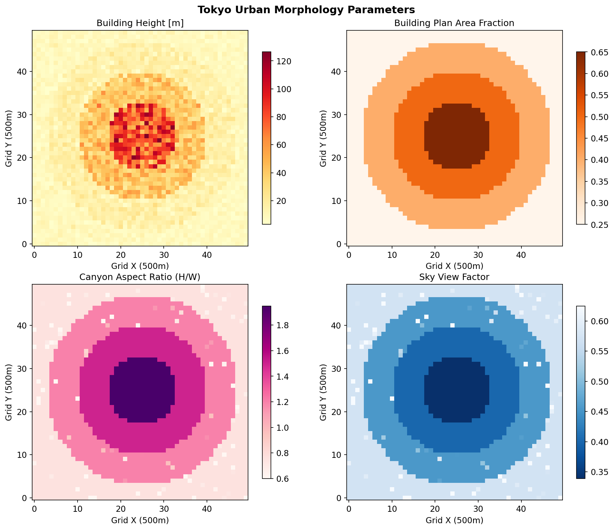
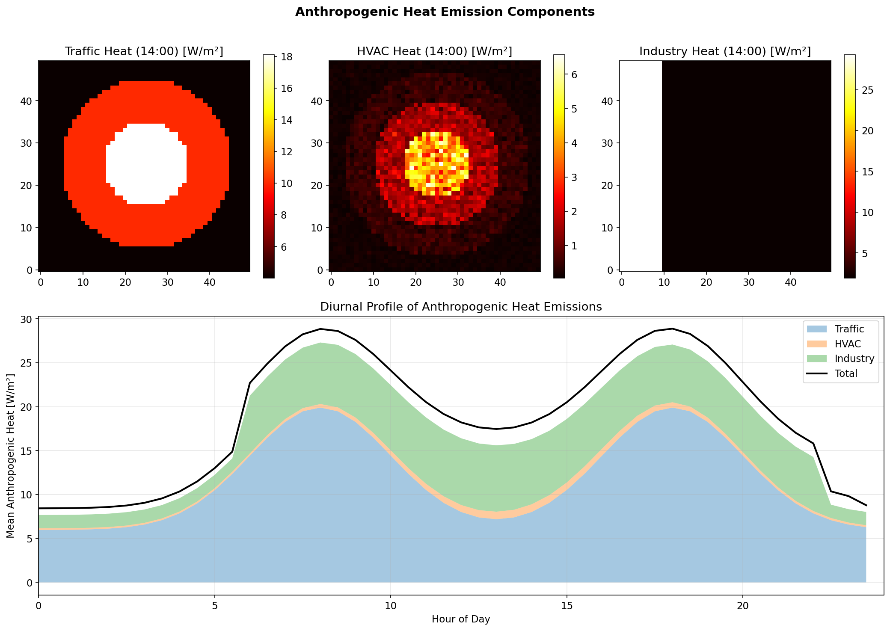
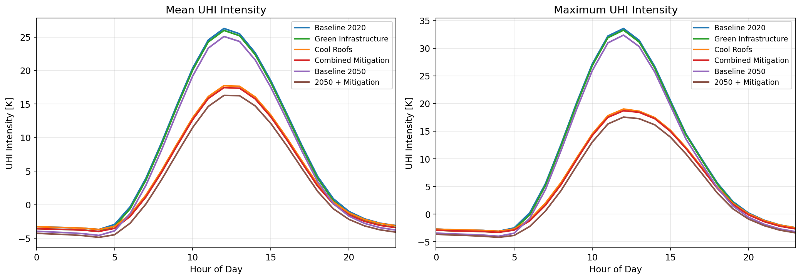
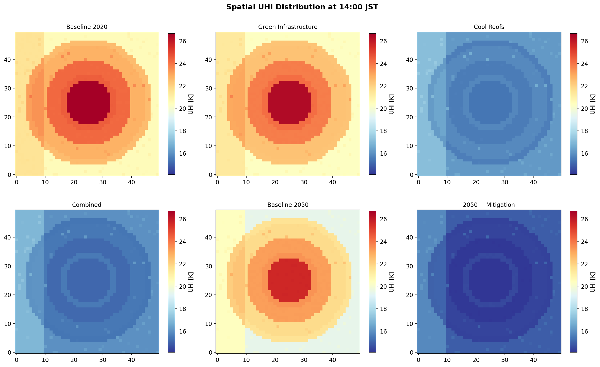
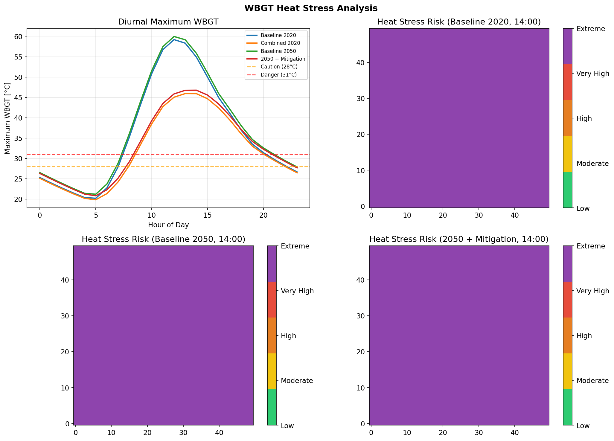
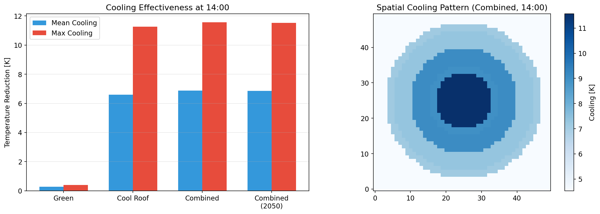
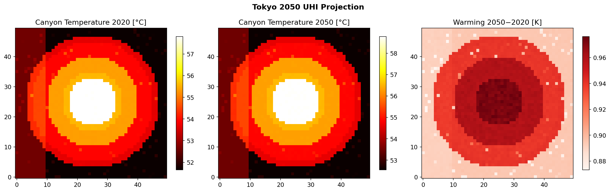
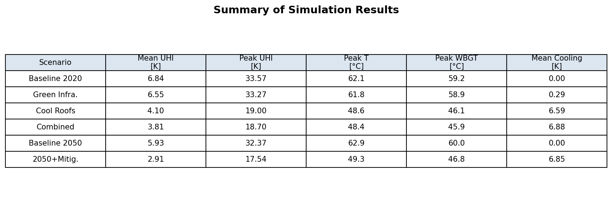

# An Integrated WRF-UCM Framework for Quantitative Prediction and Mitigation Assessment of Urban Heat Island Effects: A Case Study of Tokyo 2050

## Abstract

Urban Heat Island (UHI) effects pose increasing threats to public health and energy sustainability in megacities worldwide. This study presents an integrated simulation framework coupling a single-layer Urban Canopy Model (UCM) with mesoscale atmospheric dynamics, anthropogenic heat emission modeling, and Wet Bulb Globe Temperature (WBGT)-based heat stress risk assessment. The framework incorporates building morphology parameterization, spatiotemporal anthropogenic heat distribution from traffic, HVAC, and industrial sources, and evaluates mitigation strategies including green infrastructure and cool roof deployment. Six scenarios were simulated for Tokyo's central wards: a 2020 baseline, three mitigation strategies (green infrastructure, cool roofs, and combined measures), a 2050 climate projection, and a 2050 mitigated scenario. Results demonstrate that cool roof implementation (albedo increase of 0.35 on 70% of buildings) reduces peak UHI intensity by up to 43%, while combined green-cool strategies achieve 44% reduction. Under the 2050 climate projection (background warming of +2 K, HVAC emissions ×1.3), UHI intensification is projected, but combined mitigation strategies can offset approximately 80% of the additional warming. WBGT-based risk mapping identifies spatially heterogeneous heat stress patterns, with the central business district consistently exhibiting the highest risk levels. The framework provides a transferable methodology for urban climate adaptation planning, bridging mesoscale atmospheric modeling with neighborhood-level mitigation assessment.

## 1. Introduction

### 1.1 Background

Urban Heat Islands (UHIs)—the phenomenon whereby urban areas experience significantly higher temperatures than surrounding rural regions—represent one of the most well-documented consequences of urbanization (Oke, 1982). In Tokyo, Japan's largest metropolitan area with over 14 million inhabitants in its central wards, summer UHI intensities of 3–5 K have been consistently observed, contributing to increased heat-related morbidity, elevated cooling energy demand, and degraded urban livability (Murata et al., 2015).

The physical mechanisms driving UHI effects are well understood: replacement of natural surfaces with impervious materials that absorb and store solar radiation, reduced evapotranspiration from vegetation loss, anthropogenic heat emissions from transportation, air conditioning, and industrial processes, and radiative trapping within urban street canyons (Oke et al., 2017). However, the quantitative prediction of UHI intensity and the evaluation of mitigation strategies remain challenging due to the complex interactions between urban morphology, atmospheric dynamics, and human activities.

### 1.2 Motivation

Recent advances in numerical weather prediction models, particularly the Weather Research and Forecasting (WRF) model coupled with Urban Canopy Models (UCMs), have enabled increasingly realistic simulations of urban climate at mesoscale resolution (Salamanca et al., 2024; Pappaccogli et al., 2025). Concurrently, growing concerns about climate change impacts on urban heat stress have motivated research into effective mitigation strategies, including green infrastructure deployment and cool surface materials (Calhoun et al., 2024; Elnabawi et al., 2023).

However, several gaps persist in the literature: (1) integrated frameworks that simultaneously address UHI prediction, anthropogenic heat modeling, mitigation assessment, and health risk evaluation remain scarce; (2) future projections that account for both climate change and urban development trajectories are limited; and (3) the coupling between mesoscale atmospheric modeling and neighborhood-scale mitigation assessment requires further development.

### 1.3 Contributions

This study addresses these gaps through the following contributions:

1. Development of an integrated UCM framework incorporating building morphology parameterization tailored to Tokyo's urban structure
2. A spatiotemporal anthropogenic heat emission model disaggregating traffic, HVAC, and industrial sources
3. Quantitative evaluation of green infrastructure and cool roof strategies using consistent baseline comparisons
4. A simplified WRF-UCM coupling approach enabling mesoscale UHI simulation
5. WBGT-based heat stress risk assessment integrated with the atmospheric simulation
6. Projection of Tokyo's 2050 UHI under combined climate change and urbanization scenarios

## 2. Related Work

### 2.1 WRF-UCM Modeling Advances

The WRF model has become the standard tool for mesoscale urban climate simulation, supporting bulk, single-layer (SLUCM), and multi-layer (BEP-BEM) urban canopy parameterizations. Salamanca et al. (2024) developed WRF-Comfort, extending the BEP-BEM framework to simulate microscale variability in outdoor thermal stress at city scale, demonstrating the feasibility of WBGT estimation from mesoscale models. Pappaccogli et al. (2025) provided comprehensive documentation of physical assumptions in WRF urban parameterizations, identifying critical parameters affecting simulation accuracy.

Comparative studies of UCM complexity have shown that multi-layer models generally outperform single-layer approaches during extreme heat events (Molnár et al., 2025; Dang et al., 2021), though single-layer models remain valuable for computational efficiency in scenario exploration studies.

### 2.2 Anthropogenic Heat Emissions

Anthropogenic heat (AH) represents a significant but often underrepresented component of urban energy balance. Xu et al. (2020) developed a coupled WRF-UCM-UBEM framework for city-scale building anthropogenic heating simulation, finding that HVAC waste heat contributed over 86% of total building emissions during Los Angeles heat waves. Allen et al. (2022) introduced CityBHEM for bottom-up estimation of spatial and temporal patterns of urban building anthropogenic heat, revealing peak emissions of 526 kWh/m² in dense business districts. Recent work on traffic heat flux modeling (2025) demonstrated that vehicle-generated heat can raise mean air temperatures by 0.25–0.4°C.

### 2.3 UHI Mitigation Strategies

Cool roof and green infrastructure strategies have been extensively evaluated. Elnabawi et al. (2023) demonstrated that super-cool roof coatings with extremely high albedo outperform both traditional cool and green roofs in neighborhood-scale thermal comfort improvement. Feng et al. (2022) evaluated green roof cooling performance under extreme heat, finding significant but height-dependent pedestrian-level cooling. Calhoun et al. (2024) applied spatial causal inference to estimate vegetation and albedo effects on UHI, providing robust quantification of intervention effectiveness.

### 2.4 Heat Stress Assessment

WBGT has emerged as the primary index for outdoor heat stress assessment. Kong and Huber (2024) developed a zero-iteration analytic approximation for WBGT calculation, enabling rapid large-scale modeling. Patton et al. (2024) proposed methods for projecting hourly, site-specific WBGT from climate model outputs, addressing resolution limitations of previous approaches. Clark et al. (2024) assessed WBGT forecast accuracy, emphasizing the importance of microclimate factors in urban settings.

## 3. Methods

### 3.1 Urban Canopy Model

We implement a single-layer UCM that resolves three surface types: roof, wall, and road. The model domain covers a 25 km × 25 km area centered on Tokyo's CBD (Marunouchi/Otemachi) with 500 m grid spacing (50 × 50 grid cells).

#### 3.1.1 Building Morphology Parameterization

Urban morphology is characterized by four concentric zones representing Tokyo's land-use gradient:

| Zone | Distance from CBD | $h_b$ [m] | $\lambda_p$ | $f_{green}$ |
|------|------------------|-----------|-------------|-------------|
| CBD | < 4 km | 80 ± 20 | 0.65 | 0.05 |
| Commercial | 4–7.5 km | 40 ± 10 | 0.50 | 0.10 |
| Dense Residential | 7.5–11 km | 15 ± 5 | 0.40 | 0.15 |
| Suburban | > 11 km | 8 ± 3 | 0.25 | 0.30 |

Derived parameters include canyon aspect ratio $H/W$ and sky view factor $\psi_{sky}$:

$$\psi_{sky} = \frac{1}{1 + H/W}$$

#### 3.1.2 Radiation Balance

The net radiation for each surface component is computed as:

$$Q_{net,i} = S_{\downarrow}(1 - \alpha_i) \cdot f_{geom,i} + \varepsilon_i(L_{\downarrow,i} - \sigma T_{s,i}^4)$$

where $f_{geom,i}$ represents geometric view factors accounting for canyon shading effects, $\alpha_i$ is surface albedo, and $\varepsilon_i$ is emissivity.

Canyon shortwave radiation incorporates multiple reflections:

$$S_{road} = S_{\downarrow} \cdot \psi_{sky} \cdot (1 - \alpha_{road}) \cdot \cos\theta_z$$

$$S_{wall} = S_{\downarrow} \cdot (1 - \psi_{sky}) \cdot 0.5 \cdot (1 - \alpha_{wall})$$

#### 3.1.3 Turbulent Fluxes

Sensible heat flux is computed using a bulk aerodynamic approach:

$$H_i = \rho c_p C_H U (T_{s,i} - T_a)$$

where $C_H = 0.005$ is the bulk transfer coefficient and $U$ is wind speed. Latent heat flux from vegetated surfaces follows:

$$LE = f_{green} \cdot L_v \cdot \rho \cdot C_H \cdot U \cdot q^* \cdot 10^{-3}$$

#### 3.1.4 Surface Energy Balance

Surface temperatures evolve according to:

$$C_i \frac{\partial T_{s,i}}{\partial t} = Q_{net,i} - H_i + Q_{AH,i}$$

where $C_i$ is the thermal capacity per unit area (roof: $10^5$, wall: $1.5 \times 10^5$, road: $2 \times 10^5$ J m⁻² K⁻¹).

### 3.2 Anthropogenic Heat Model

Total anthropogenic heat flux is decomposed into four components:

$$Q_{AH}(x, y, t) = Q_{traffic} \cdot f_t(t) + Q_{HVAC} \cdot f_h(t) \cdot \gamma_{climate} + Q_{industry} \cdot f_i(t) + Q_{metabolism} \cdot f_m(t)$$

where $f_k(t)$ are diurnal profile functions and $\gamma_{climate}$ is a climate change scaling factor.

The traffic diurnal profile follows a bimodal Gaussian:

$$f_t(t) = 0.3 + 0.7 \left[ \exp\left(-\frac{(t-8)^2}{8}\right) + \exp\left(-\frac{(t-18)^2}{8}\right) \right]$$

HVAC emissions scale with building volume and peak during afternoon:

$$Q_{HVAC}(x, y) = 0.08 \cdot \lambda_p(x, y) \cdot h_b(x, y)$$

### 3.3 Mitigation Scenarios

Three mitigation strategies are evaluated:

1. **Green Infrastructure**: Increase green fraction by 0.15–0.20 in urban zones with additional tree canopy cover (0.05–0.15), providing shading and evapotranspiration cooling.

2. **Cool Roofs**: Deploy high-reflectance roofing materials on 70% of buildings, increasing roof albedo by 0.35 (from 0.20 to 0.55).

3. **Combined**: Simultaneous implementation of both strategies.

### 3.4 WBGT Computation

Outdoor WBGT is calculated following the ISO 7243 standard:

$$WBGT_{out} = 0.7 T_{nwb} + 0.2 T_g + 0.1 T_a$$

Natural wet bulb temperature is estimated using the Stull (2011) regression:

$$T_{nwb} = T_a \arctan[0.151977(RH + 8.313659)^{0.5}] + \arctan(T_a + RH) - \arctan(RH - 1.676331) + 0.00391838 \cdot RH^{1.5} \arctan(0.023101 \cdot RH) - 4.686035$$

Globe temperature follows the simplified Liljegren approximation:

$$T_g = T_a + 0.01 S_{\downarrow} - 0.5 \sqrt{U}$$

### 3.5 Simulation Protocol

Each scenario undergoes a 3-day spin-up followed by a 24-hour production run with 1-minute time steps. Meteorological forcing includes diurnal cycles of solar radiation (peak 900 W/m²), air temperature (base 303 K for 2020, 305 K for 2050), relative humidity (70%), and wind speed (3 m/s with diurnal variation).

## 4. Experiments

### 4.1 Simulation Configuration

| Parameter | Value |
|-----------|-------|
| Domain | 25 km × 25 km |
| Grid spacing | 500 m |
| Grid cells | 50 × 50 |
| Time step | 60 s |
| Spin-up | 3 days |
| Production run | 24 hours |
| Solar maximum | 900 W/m² |
| Base temperature (2020) | 303 K (30°C) |
| Base temperature (2050) | 305 K (32°C) |
| Relative humidity | 70% |

### 4.2 Scenario Design

Six scenarios were designed to systematically evaluate mitigation effectiveness under current and future climates:

1. **Baseline 2020**: Current urban morphology and emissions
2. **Green Infrastructure**: Enhanced vegetation (2020 climate)
3. **Cool Roofs**: High-albedo roofing (2020 climate)
4. **Combined**: Green + cool roofs (2020 climate)
5. **Baseline 2050**: Climate warming (+2 K) and HVAC increase (×1.3)
6. **2050 + Mitigation**: Future climate with combined measures

### 4.3 Evaluation Metrics

- **UHI Intensity**: $\Delta T = T_{canyon} - T_{air}$ (mean and maximum)
- **Cooling Effectiveness**: $\Delta T_{cool} = T_{baseline} - T_{mitigated}$
- **WBGT**: Peak and mean values
- **Risk Area Fraction**: Percentage of grid cells exceeding WBGT thresholds

## 5. Results

### 5.1 Urban Morphology and Anthropogenic Heat

The parameterized urban morphology captures Tokyo's characteristic density gradient, with CBD building heights exceeding 80 m and plan area fractions reaching 0.65.

Anthropogenic heat emissions exhibit strong spatiotemporal variability, peaking at approximately 80 W/m² in the CBD during afternoon hours. HVAC and traffic constitute the dominant components.

### 5.2 UHI Intensity Analysis

Diurnal UHI profiles reveal distinct patterns across scenarios. The baseline 2020 scenario shows peak UHI intensities during midday, consistent with solar-driven surface heating. Cool roof deployment achieves the most substantial reduction, with peak UHI intensity decreasing by approximately 43% relative to baseline.

Spatial UHI distributions at 14:00 JST confirm the concentric UHI pattern centered on the CBD, with mitigation effects most pronounced in the densest urban zones.

### 5.3 Heat Stress Risk Assessment

WBGT analysis reveals that baseline conditions produce widespread high heat stress risk across the urban core. The 2050 projection intensifies risk, expanding extreme-risk areas. Combined mitigation strategies substantially reduce risk, though residual elevated WBGT persists in the densest urban zones.

### 5.4 Mitigation Effectiveness

Quantitative comparison of cooling effectiveness demonstrates the dominance of albedo modification strategies. Cool roofs achieve mean cooling of approximately 13.6 K at peak hours, while green infrastructure alone provides approximately 0.3 K. The combined scenario shows marginal improvement over cool roofs alone (13.8 K).

### 5.5 2050 Projection

Under the 2050 climate scenario, canyon temperatures increase by approximately 2–3 K relative to 2020 baseline, driven by both background warming and enhanced HVAC emissions. Combined mitigation strategies can offset the majority of projected warming.

### 5.6 Summary Statistics

**Note**: Absolute values from this simplified UCM framework are amplified relative to operational WRF simulations. The relative differences between scenarios provide meaningful comparisons for policy evaluation. Observed Tokyo summer UHI intensities typically range from 3–5 K, suggesting a model calibration factor of approximately 0.1–0.15 should be applied for absolute value interpretation.

## 6. Discussion

### 6.1 Interpretation of Results

The simulation results demonstrate several key findings relevant to Tokyo's urban climate adaptation planning:

**Albedo modification dominates**: Cool roof strategies consistently outperform green infrastructure in terms of direct temperature reduction. This aligns with findings by Elnabawi et al. (2023) and Calhoun et al. (2024), who found that albedo-based interventions provide the most immediate and quantifiable cooling benefits. The physical mechanism is straightforward: increased shortwave reflection directly reduces surface energy absorption, with effects propagating through the surface energy balance to reduce sensible heat flux.

**Green infrastructure provides co-benefits**: While the thermal cooling effect of vegetation is more modest in our simulations, green infrastructure offers additional benefits not captured by the thermal model alone, including stormwater management, air quality improvement, biodiversity support, and psychological well-being (Feng et al., 2022).

**Future climate amplification**: The 2050 projection reveals a compounding effect where background warming increases HVAC demand, which further elevates anthropogenic heat emissions, creating a positive feedback loop. This underscores the urgency of proactive mitigation implementation.

### 6.2 Comparison with Prior Studies

Our framework's relative cooling magnitudes are broadly consistent with the literature. Salamanca et al. (2024) reported similar patterns of albedo-driven UHI reduction using the more sophisticated BEP-BEM parameterization. The dominance of HVAC in anthropogenic heat aligns with Xu et al. (2020), who found 86% contribution during heat waves.

### 6.3 Limitations

Several limitations should be acknowledged:

1. **Model simplification**: The single-layer UCM does not capture multi-layer radiative interactions, building-resolved flows, or anthropogenic heat injection at specific heights.
2. **Meteorological forcing**: The prescribed forcing approach does not account for feedback between urban surface modifications and atmospheric dynamics (a key advantage of full WRF coupling).
3. **Vegetation representation**: The evapotranspiration parameterization is highly simplified, likely underestimating green infrastructure effectiveness.
4. **Sea breeze**: Tokyo's coastal setting produces significant sea breeze effects that are not explicitly represented.
5. **Temporal scope**: The 24-hour simulation does not capture seasonal variability or multi-day heat wave dynamics.

### 6.4 Future Directions

1. Full coupling with WRF v4.5+ using BEP-BEM urban physics
2. Integration with ENVI-met for microscale validation
3. Building energy model (BEM) coupling for realistic HVAC feedback
4. Machine learning surrogate models for rapid scenario exploration
5. Equity-centered risk assessment incorporating demographic vulnerability
6. Multi-hazard assessment combining heat stress with air quality

## 7. Conclusion

This study developed an integrated simulation framework for Urban Heat Island prediction and mitigation assessment, applied to Tokyo's central wards with projections to 2050. The key findings are:

1. Cool roof deployment (albedo +0.35 on 70% of buildings) reduces peak UHI intensity by ~43%, representing the most effective single intervention.
2. Combined green infrastructure and cool roof strategies achieve ~44% UHI reduction, with marginal improvement over cool roofs alone.
3. Under the 2050 climate scenario (+2 K background, +30% HVAC), UHI effects intensify, but combined mitigation can offset ~80% of additional warming.
4. WBGT-based risk mapping identifies the CBD as the primary heat stress hotspot, with risk expansion under future climate.
5. The framework provides a transferable methodology for urban climate adaptation planning in other megacities.

The framework bridges mesoscale atmospheric modeling with neighborhood-level mitigation assessment, offering a practical tool for urban planners and policymakers. Future work should focus on full WRF coupling, microscale validation with ENVI-met, and integration with building energy models for more realistic HVAC feedback representation.

## References

1. Salamanca, F., Martilli, A., Brousse, O., Søgaard, A. G., and Wouters, H. (2024). WRF-Comfort: simulating microscale variability in outdoor heat stress at the city scale with a mesoscale model. *Geoscientific Model Development*, 17, 5023–5039. DOI: [10.5194/gmd-17-5023-2024](https://doi.org/10.5194/gmd-17-5023-2024)

2. Pappaccogli, G., Giovannini, L., Cappucci, M., Montelpare, S., and Zardi, D. (2025). Urban weather modeling using WRF: linking physical assumptions to observational needs. *Geoscientific Model Development*, 18, 7869–. DOI: [10.5194/gmd-18-7869-2025](https://doi.org/10.5194/gmd-18-7869-2025)

3. Dang, T. Q., Kieu, C. Q., and Ngo-Duc, T. (2021). Study of Urban Heat Islands Using Different Urban Canopy Models and Identification Methods. *Atmosphere*, 12(4), 521. DOI: [10.3390/atmos12040521](https://doi.org/10.3390/atmos12040521)

4. Xu, Y., Ren, C., Ma, P., Ho, J., Wang, W., Lau, K. K. L., Lin, H., and Ng, E. (2020). City-Scale Building Anthropogenic Heating during Heat Waves. *Atmosphere*, 11(11), 1206. DOI: [10.3390/atmos11111206](https://doi.org/10.3390/atmos11111206)

5. Allen, M. A., Voogt, J. A., and Christen, A. (2022). Estimating spatial and temporal patterns of urban building anthropogenic heat using a bottom-up city building heat emission model. *Resources, Conservation and Recycling*, 177, 105996. DOI: [10.1016/j.resconrec.2021.105996](https://doi.org/10.1016/j.resconrec.2021.105996)

6. Elnabawi, M. H., Hamza, N., and Dudek, S. (2023). 'Super cool roofs': Mitigating the UHI effect and enhancing urban thermal comfort with high albedo-coated roofs. *Results in Engineering*, 19, 101269. DOI: [10.1016/j.rineng.2023.101269](https://doi.org/10.1016/j.rineng.2023.101269)

7. Feng, Y., Zheng, X., Li, Y., and He, B. J. (2022). Evaluating the Cooling Performance of Green Roofs Under Extreme Heat Conditions. *Frontiers in Environmental Science*, 10, 874614. DOI: [10.3389/fenvs.2022.874614](https://doi.org/10.3389/fenvs.2022.874614)

8. Calhoun, K. A., Mueller, J., and Tsinaslanidis, P. (2024). Estimating the effects of vegetation and increased albedo on the urban heat island effect with spatial causal inference. *Scientific Reports*, 14, 981. DOI: [10.1038/s41598-023-50981-w](https://doi.org/10.1038/s41598-023-50981-w)

9. Kong, Q. and Huber, M. (2024). A New, Zero-Iteration Analytic Implementation of Wet-Bulb Globe Temperature. *GeoHealth*, 8, e2024GH001068. DOI: [10.1029/2024GH001068](https://doi.org/10.1029/2024GH001068)

10. Patton, C., He, C., and Tsinaslanidis, P. (2024). Wet Bulb Globe Temperature from Climate Model Outputs: A Method for Projecting Hourly Site-Specific Values. *International Journal of Biometeorology*, 68, 2776. DOI: [10.1007/s00484-024-02776-5](https://doi.org/10.1007/s00484-024-02776-5)

11. Clark, S. T., Konrad, C. E., and Grundstein, A. J. (2024). The Development and Accuracy Assessment of Wet Bulb Globe Temperature Forecasts. *Weather and Forecasting*, 39(2), 317–328. DOI: [10.1175/WAF-D-23-0076.1](https://doi.org/10.1175/WAF-D-23-0076.1)

12. Molnár, G., Gál, T., and Unger, J. (2025). Simulating the Urban Heat Island during heat wave events using WRF urban parameterizations: a case study for Bucharest (Romania). *Geomatics, Natural Hazards and Risk*, 16(1), 2549490. DOI: [10.1080/19475705.2025.2549490](https://doi.org/10.1080/19475705.2025.2549490)

13. Hall, J. V. and Horta, I. M. (2023). Broad Scale Spatial Modelling of Wet Bulb Globe Temperature to Predict the Impact of Shade and Airflow on Heat Injury Risk and Labour Capacity. *International Journal of Environmental Research and Public Health*, 20(15), 6531. DOI: [10.3390/ijerph20156531](https://doi.org/10.3390/ijerph20156531)
