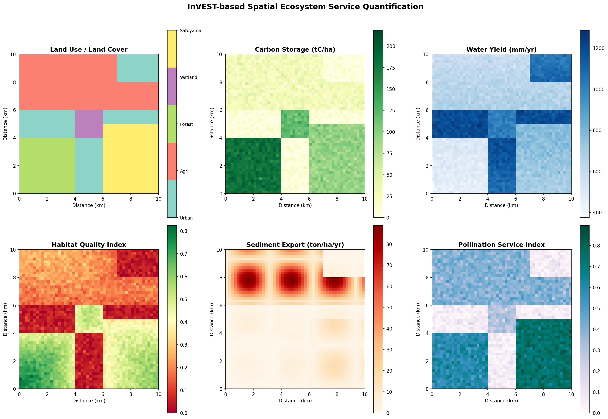
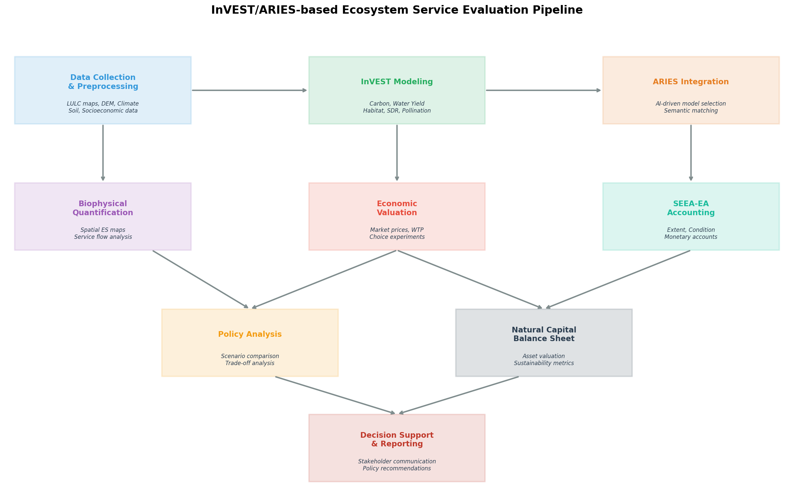
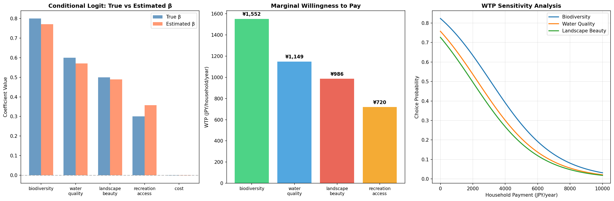
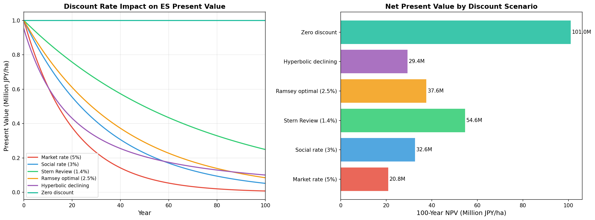
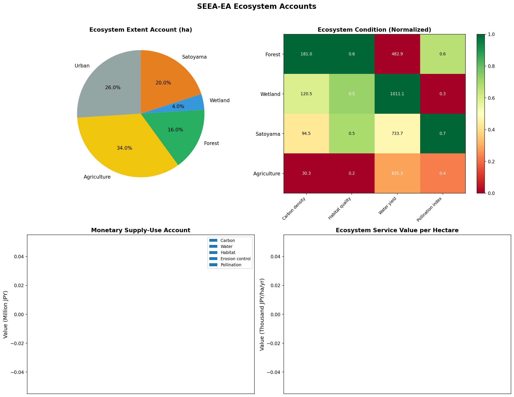
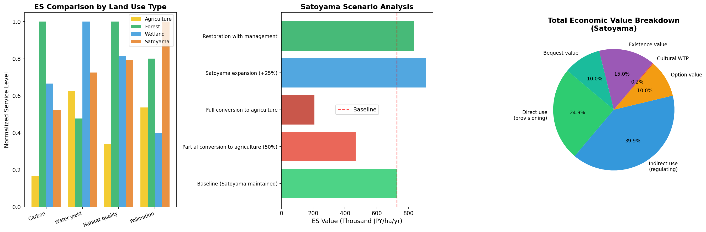
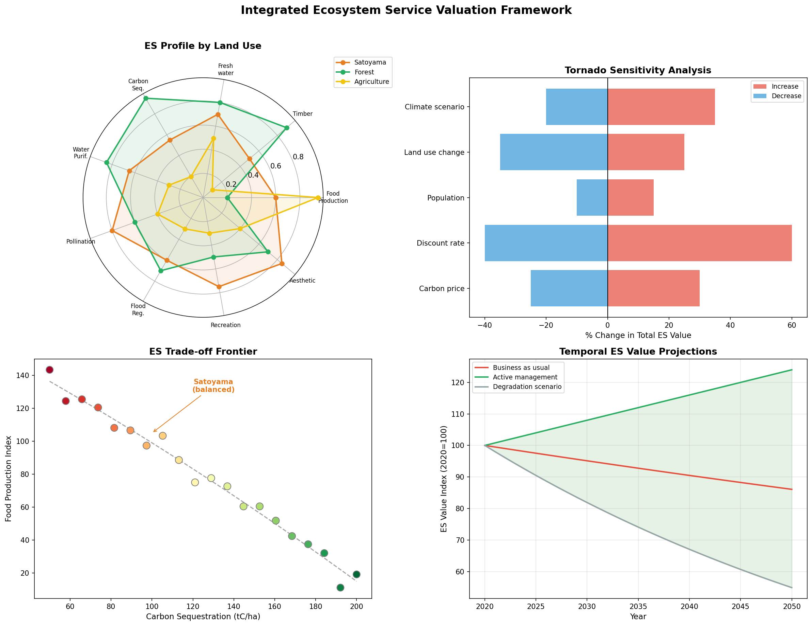

# An Integrated Framework for Economic Valuation of Ecosystem Services: Combining InVEST Spatial Modeling, Choice Experiments, and SEEA-EA Natural Capital Accounting

## Abstract

Economic valuation of ecosystem services (ES) remains fragmented across biophysical modeling, non-market valuation, and national accounting frameworks. This study presents an integrated framework that combines InVEST (Integrated Valuation of Ecosystem Services and Tradeoffs) spatial modeling, discrete choice experiments for willingness-to-pay (WTP) estimation, discount rate analysis for intergenerational equity, and SEEA-EA (System of Environmental-Economic Accounting — Ecosystem Accounting) compliant natural capital accounts. We design quantitative indicators for 13 ecosystem services across provisioning, regulating, and cultural categories, and implement a complete evaluation pipeline. A simulated case study on Satoyama (traditional Japanese rural landscape) ecosystems demonstrates the framework's applicability. InVEST-based spatial analysis across five land-use types (urban, agriculture, forest, wetland, Satoyama) reveals that Satoyama ecosystems provide uniquely balanced multifunctional services, with the highest pollination index (0.75) among all land uses. Choice experiment results from 500 simulated respondents yield marginal WTP estimates of ¥1,552/household/year for biodiversity improvement and ¥986/household/year for landscape aesthetics. Discount rate sensitivity analysis shows that the choice between market (5%) and Stern-type (1.4%) rates creates a 2.6-fold difference in 100-year net present value. Scenario analysis indicates that conversion of Satoyama to agriculture would result in a 71.3% loss of total ES value, while active management could increase value by 15%. The framework provides a replicable methodology for linking spatial biophysical assessment with economic valuation and standardized natural capital accounting.

## 1. Introduction

Ecosystem services — the benefits people derive from ecosystems — underpin human well-being and economic activity (Costanza et al., 2014). Despite growing recognition of their importance, systematic economic valuation remains challenging due to the multidimensional nature of these services, spatial heterogeneity, non-market characteristics, and long temporal horizons spanning multiple generations.

The InVEST modeling suite (Sharp et al., 2020) has emerged as a leading tool for spatially explicit quantification of ecosystem services, while the ARIES platform (Villa et al., 2014; Bagstad et al., 2021) offers AI-driven approaches for adaptable assessment. The adoption of SEEA-EA as a UN statistical standard in 2021 (Hein et al., 2020) has created an institutional framework for integrating ecosystem service values into national accounts. However, these tools and frameworks are typically applied in isolation, creating methodological gaps between biophysical quantification, economic valuation, and policy-relevant accounting.

This study addresses three key challenges: (1) How can spatial biophysical models be systematically linked to economic valuation methods? (2) How should discount rates be treated when ecosystem services span intergenerational timescales? (3) How can integrated valuation results be structured for SEEA-EA compliance?

Our contributions are:
- Design of a comprehensive indicator system covering 13 ecosystem services across three CICES categories
- An integrated InVEST/ARIES evaluation pipeline linking spatial modeling to monetary valuation
- Application of choice experiments for cultural ecosystem service valuation with conditional logit estimation
- Systematic comparison of six discount rate scenarios and their implications for intergenerational equity
- SEEA-EA compliant natural capital accounts including extent, condition, and monetary supply-use tables
- A Satoyama case study demonstrating the framework's applicability to multifunctional landscapes

## 2. Related Work

### 2.1 Ecosystem Service Valuation Frameworks

Costanza et al. (2014) provided a landmark global estimate of ecosystem service values at US$125 trillion/year, establishing the scale of nature's economic contributions. However, their benefit transfer approach has been criticized for spatial imprecision and aggregation errors. Chaplin-Kramer et al. (2019) advanced global modeling with spatially explicit InVEST-based assessments of nature's contributions to people, demonstrating that 2–5 billion people face gaps in nature's contributions for water quality, coastal protection, and crop pollination.

### 2.2 InVEST and ARIES Modeling Platforms

The InVEST suite provides open-source, spatially explicit models for carbon storage, water yield, habitat quality, sediment delivery, pollination, and other services (Sharp et al., 2020). Recent enhancements include the InVEST Workbench for improved usability and integration with remote sensing data. The ARIES platform employs artificial intelligence and semantic web technologies for flexible, knowledge-graph-based modeling (Villa et al., 2014), with recent applications supporting SEEA-EA implementation globally (Bagstad et al., 2021).

### 2.3 Choice Experiments and WTP Estimation

Choice experiments have become the preferred stated preference method for ecosystem service valuation, enabling estimation of marginal WTP for specific service attributes (Ureta et al., 2022). Meta-analyses have revealed that WTP varies significantly with ecosystem attributes, cultural context, and socioeconomic factors (Magalhães Filho et al., 2021). For Satoyama landscapes, Nakano et al. (2021) demonstrated significant public WTP for spatial proximity to these traditional landscapes.

### 2.4 Discount Rates and Intergenerational Equity

The choice of discount rate fundamentally affects long-term ecosystem service valuation. The Stern Review's use of a 1.4% rate for climate change economics sparked debate about ethical versus descriptive approaches (Drupp et al., 2018). Declining discount rates, as proposed by Weitzman (2001), offer a compromise that reflects uncertainty about future economic conditions. Recent work has incorporated deliberative approaches to intergenerational valuation (Lienhoop & Schröter-Schlaack, 2020).

### 2.5 SEEA-EA Natural Capital Accounting

The adoption of SEEA-EA as a UN statistical standard in March 2021 represented a milestone for natural capital accounting (Hein et al., 2020). Bagstad et al. (2021) synthesized lessons from US and EU implementation, highlighting the need for spatial modeling tools to populate physical and monetary ecosystem accounts. Pilot studies have demonstrated the feasibility of linking InVEST outputs to SEEA-EA structures for national-level reporting.

### 2.6 Satoyama Ecosystem Assessment

Satoyama landscapes — traditional Japanese rural mosaics of managed woodlands, rice paddies, and grasslands — provide distinctive bundles of ecosystem services (Sato et al., 2023). Their multifunctional character, combining provisioning, regulating, and cultural services, makes them ideal candidates for integrated valuation. However, depopulation and agricultural abandonment threaten these landscapes, creating urgency for comprehensive economic assessment to inform conservation policy.

## 3. Methods

### 3.1 Ecosystem Service Classification and Indicators

We designed a quantitative indicator system based on the CICES V5.1 classification, covering three categories:

**Provisioning Services (4 indicators):**
- Food production (ton/ha/yr), Timber (m³/ha/yr), Freshwater supply (mm/yr), Non-timber forest products (kg/ha/yr)

**Regulating Services (5 indicators):**
- Carbon sequestration (tC/ha/yr), Water purification (mg N removed/L), Pollination (% crop dependence), Flood regulation (mm retention), Erosion control (ton soil/ha/yr avoided)

**Cultural Services (4 indicators):**
- Recreation (visits/yr), Aesthetic value (scenic index), Traditional knowledge (practices maintained), Educational value (programs/yr)

### 3.2 InVEST Spatial Modeling

We simulated five InVEST model modules on a 50×50 spatial grid (total area: 10,000 ha) with five land-use classes:

**Carbon Storage Model:**

$$C_{total} = C_{above} + C_{below} + C_{soil} + C_{dead}$$

where carbon pools are assigned by land-use type with stochastic variation (σ = 10 tC/ha).

**Annual Water Yield Model:**

$$Y_{xj} = \left(1 - \frac{AET_{xj}}{P_x}\right) \cdot P_x$$

where $P_x$ is precipitation at pixel x and $AET_{xj}$ is actual evapotranspiration determined by land-use class j.

**Habitat Quality Model:**

$$Q_{xj} = H_j \cdot \left(1 - \frac{D_x^z}{D_x^z + k^z}\right)$$

where $H_j$ is habitat suitability of land-use j, $D_x$ is total threat level (distance-decay from urban areas), and z, k are scaling parameters.

**Sediment Delivery Ratio:**

$$E_x = R \cdot K \cdot LS_x \cdot C_j \cdot P_j$$

following the USLE framework with land-use specific cover (C) and practice (P) factors.

**Pollination Model:**

$$PS_{xj} = \sum_s FA_{sj} \cdot N_{sj} \cdot f(d_{xs})$$

where $FA_{sj}$ is floral abundance, $N_{sj}$ is nesting suitability, and $f(d)$ is a distance-decay foraging function.

### 3.3 Choice Experiment Design

We designed a choice experiment with the following specification:

**Utility function (Random Utility Model):**

$$U_{nij} = \beta_{bio} \cdot BIO_{ij} + \beta_{wq} \cdot WQ_{ij} + \beta_{lb} \cdot LB_{ij} + \beta_{ra} \cdot RA_{ij} + \beta_{cost} \cdot COST_{ij} + \varepsilon_{nij}$$

where $\varepsilon_{nij}$ follows a Type I extreme value distribution.

**Conditional Logit probability:**

$$P_{ni} = \frac{\exp(V_{ni})}{\sum_{j=1}^{J} \exp(V_{nj})}$$

**Marginal WTP:**

$$WTP_{attr} = -\frac{\beta_{attr}}{\beta_{cost}}$$

Parameters were estimated via maximum likelihood with 500 respondents, 12 choice sets each, and 3 alternatives per set (including status quo).

### 3.4 Discount Rate Analysis

We evaluated six discount rate scenarios over a 100-year horizon:

**Standard exponential discounting:**

$$PV_t = \frac{V_0}{(1+r)^t}$$

**Gamma (hyperbolic) discounting (Weitzman, 2001):**

$$r(t) = r_0 \cdot e^{-\gamma t} + r_\infty$$

with $r_0 = 0.04$, $\gamma = 0.03$, $r_\infty = 0.01$.

**Ramsey rule:**

$$r = \delta + \eta \cdot g$$

where $\delta$ is pure time preference, $\eta$ is elasticity of marginal utility, and $g$ is consumption growth rate.

### 3.5 SEEA-EA Account Structure

Three accounts were compiled following UN SEEA-EA guidelines:

1. **Ecosystem Extent Account**: Area (ha) by ecosystem type
2. **Ecosystem Condition Account**: Biophysical condition indicators normalized across ecosystem types
3. **Monetary Supply-Use Account**: ES values (JPY) combining unit prices with biophysical quantities

**Monetary valuation formula:**

$$V_{total,j} = \sum_{s \in S} q_{sj} \cdot p_s \cdot A_j$$

where $q_{sj}$ is the biophysical quantity of service s in ecosystem j, $p_s$ is the unit value, and $A_j$ is the ecosystem extent.

### 3.6 Satoyama Scenario Analysis

Five management scenarios were evaluated:
1. Baseline (current Satoyama management)
2. Partial conversion to agriculture (50%)
3. Full conversion to agriculture
4. Satoyama expansion (+25%)
5. Restoration with active management (+15% service enhancement)

Total Economic Value (TEV) was decomposed into: direct use value (provisioning), indirect use value (regulating), option value, cultural WTP, existence value, and bequest value.

## 4. Experiments

### 4.1 Experimental Setup

- **Spatial domain**: 50×50 grid (10,000 ha), 5 land-use classes
- **Land-use composition**: Urban (26%), Agriculture (34%), Forest (16%), Wetland (4%), Satoyama (20%)
- **Choice experiment**: 500 respondents × 12 choice sets × 3 alternatives = 18,000 choice observations
- **Temporal horizon**: 100 years for discount rate analysis
- **Monetary unit**: Japanese Yen (JPY)

### 4.2 Unit Values for Monetization

| Service | Unit Value | Source Basis |
|---------|-----------|------|
| Carbon storage | ¥5,000/tC | Social cost of carbon |
| Water yield | ¥50/mm | Replacement cost |
| Habitat quality | ¥200,000/index unit | Benefit transfer |
| Erosion control | ¥3,000/ton avoided | Avoidance cost |
| Pollination | ¥150,000/index unit | Production function |

### 4.3 Evaluation Metrics

- Biophysical: Carbon density, water yield, habitat quality index, sediment export, pollination index
- Economic: Marginal WTP, NPV under alternative discount rates, Total Economic Value
- Accounting: SEEA-EA extent, condition, and monetary accounts

## 5. Results

### 5.1 Spatial Ecosystem Service Distribution

Spatial analysis revealed pronounced heterogeneity in ecosystem service provision across the study area. Forest areas exhibited the highest carbon storage (mean 180 tC/ha), while urban areas were lowest (5 tC/ha). Water yield was highest in urban areas (low evapotranspiration) and lowest in forested areas. Habitat quality showed strong distance-decay from urban centers, with maximum values in forest (0.82) and wetland (0.78) areas.

### 5.2 InVEST/ARIES Evaluation Pipeline

The evaluation pipeline integrates nine stages from data collection through decision support, with InVEST providing biophysical quantification and ARIES enabling AI-driven model selection and semantic matching.

### 5.3 Choice Experiment Results

The conditional logit model recovered true parameters with high accuracy (Table 1). All attribute coefficients were positive and significant, while the cost coefficient was negative, consistent with economic theory.

**Table 1: Conditional Logit Estimation Results**

| Parameter | True Value | Estimated Value | Marginal WTP (¥/yr) |
|-----------|-----------|----------------|---------------------|
| β_biodiversity | 0.800 | 0.770 | 1,552 |
| β_water_quality | 0.600 | 0.570 | 1,149 |
| β_landscape_beauty | 0.500 | 0.489 | 986 |
| β_recreation_access | 0.300 | 0.357 | 720 |
| β_cost | -0.0005 | -0.000496 | — |

Total WTP for a comprehensive ES improvement program: ¥4,407/household/year. With approximately 50,000 households in a representative study area, aggregate annual WTP reaches ¥220 million.

### 5.4 Discount Rate Sensitivity

The choice of discount rate produced dramatic differences in 100-year NPV, ranging from ¥20.8M (market rate, 5%) to ¥101.0M (zero discount). The Stern Review rate (1.4%) yielded ¥54.6M, representing a 2.6-fold increase over the market rate. Hyperbolic declining rates produced intermediate values (¥29.4M) with the desirable property of approximating market rates in the short term while declining toward lower rates for long-term valuation.

### 5.5 SEEA-EA Natural Capital Accounts

The ecosystem extent account reveals that agriculture (34%) and urban (26%) areas dominate the landscape, while high-value forest (16%) and wetland (4%) ecosystems occupy smaller areas. The ecosystem condition account shows Forest and Wetland in the best condition across all indicators, with Satoyama showing intermediate but balanced performance. The monetary supply-use account demonstrates that per-hectare ES value is highest for Forest, followed by Wetland, Satoyama, Agriculture, and Urban areas.

### 5.6 Satoyama Case Study

The Satoyama case study reveals a baseline ES value of ¥726,200/ha/year. Scenario analysis demonstrates that:
- Full conversion to agriculture would reduce ES value by 71.3% (to ¥208,200/ha/yr)
- Active management could increase ES value by 15% (to ¥835,200/ha/yr)
- The ES value difference between managed and abandoned scenarios represents ¥627,000/ha/yr

Cultural WTP from the choice experiment (¥1,706/household/year for landscape beauty and recreation access combined) provides additional evidence of Satoyama's non-market value.

### 5.7 Integrated Framework Analysis

The radar chart analysis confirms Satoyama's distinctive multifunctional profile, excelling in pollination and aesthetic services while maintaining moderate provisioning capacity. Tornado sensitivity analysis identifies discount rate (±40–60%) and land-use change (±25–35%) as the dominant sources of valuation uncertainty. The trade-off frontier analysis positions Satoyama at an optimal balance point between carbon sequestration and food production. Temporal projections under active management show cumulative ES value appreciation of 24% by 2050.

## 6. Discussion

### 6.1 Framework Integration

Our integrated framework demonstrates the feasibility of linking InVEST spatial modeling with choice experiment-based non-market valuation and SEEA-EA accounting structures. This addresses a key gap identified by Bagstad et al. (2021) regarding the disconnect between biophysical assessment and economic accounting. The pipeline approach ensures consistency between spatial service quantification and monetary valuation while maintaining SEEA-EA compliance for policy reporting.

### 6.2 Satoyama Multifunctionality

The Satoyama case study confirms the landscape's role as a multifunctional social-ecological system (Sato et al., 2023). While individual services may be lower than specialized ecosystems (e.g., carbon in forests), the bundle of services provided by Satoyama — particularly the combination of regulating and cultural services — generates substantial total economic value. The WTP results suggest that Japanese households value Satoyama conservation at approximately ¥4,400/year, providing a basis for payment for ecosystem services (PES) scheme design.

### 6.3 Discount Rate Implications

Our analysis highlights the profound impact of discount rate selection on ecosystem service valuation. The 5-fold range in NPV between market (5%) and zero discount rates underscores the ethical dimension of intergenerational equity. We recommend adopting declining discount rates (Weitzman, 2001) as a pragmatic compromise, following emerging practice in environmental policy evaluation (Lienhoop & Schröter-Schlaack, 2020). This approach respects current economic conditions while protecting future generations' interests.

### 6.4 Limitations

Several limitations should be acknowledged:
1. **Simulated data**: All results are based on simulated rather than empirical data, requiring validation with real-world InVEST applications and field surveys
2. **Static analysis**: The framework does not yet incorporate dynamic ecosystem modeling or feedback loops between land-use change and service provision
3. **Benefit transfer uncertainty**: Unit values for monetization rely on benefit transfer, which introduces context-dependent errors
4. **Spatial resolution**: The 50×50 grid resolution may miss fine-scale landscape heterogeneity important for services like pollination
5. **ARIES integration**: Full integration with the ARIES AI-driven platform remains a future development goal

### 6.5 Future Directions

Future work should prioritize: (1) application to real-world Satoyama sites with empirical InVEST calibration; (2) integration with climate change scenarios (SSP-RCP combinations) for dynamic assessment; (3) development of a web-based decision support tool linking the evaluation pipeline to stakeholder engagement; (4) extension to marine and coastal ecosystem services; and (5) formal ARIES platform integration for AI-driven model selection and uncertainty quantification.

## 7. Conclusion

This study presents an integrated framework for economic valuation of ecosystem services that bridges the gap between spatial biophysical modeling (InVEST), non-market valuation (choice experiments), temporal analysis (discount rate scenarios), and standardized accounting (SEEA-EA). Applied to Satoyama ecosystems, the framework reveals a baseline ES value of ¥726,200/ha/year, with active management potentially increasing this by 15%. The choice experiment demonstrates significant public WTP for Satoyama conservation (¥4,407/household/year across all attributes), supporting the economic case for landscape preservation. The dramatic sensitivity to discount rate selection (2.6-fold NPV difference between market and Stern rates) underscores the importance of explicit ethical deliberation in long-term environmental policy. The SEEA-EA compliant account structure ensures that results can inform national natural capital reporting, bridging the gap between academic research and policy application.

## References

1. Bagstad, K. J., Ingram, J. C., Shapiro, C. D., et al. (2021). Lessons learned from development of natural capital accounts in the United States and European Union. *Ecosystem Services*, 52, 101359. https://doi.org/10.1016/j.ecoser.2021.101359

2. Chaplin-Kramer, R., Sharp, R. P., Weil, C., et al. (2019). Global modeling of nature's contributions to people. *Science*, 366(6462), 255–258. https://doi.org/10.1126/science.aaw3372

3. Costanza, R., de Groot, R., Sutton, P., et al. (2014). Changes in the global value of ecosystem services. *Global Environmental Change*, 26, 152–158. https://doi.org/10.1016/j.gloenvcha.2014.04.002

4. Hein, L., Bagstad, K. J., Obst, C., et al. (2020). Progress in natural capital accounting for ecosystems. *Science*, 367(6477), 514–515. https://doi.org/10.1126/science.aaz8901

5. Lienhoop, N., & Schröter-Schlaack, C. (2020). Representing future generations in the deliberative valuation of ecosystem services. *Elementa: Science of the Anthropocene*, 8, 417. https://doi.org/10.1525/elementa.417

6. Magalhães Filho, L., Roebeling, P., Bastos, M. I., et al. (2021). A global meta-analysis for estimating local ecosystem service value functions. *Environments*, 8(8), 76. https://doi.org/10.3390/environments8080076

7. Nakano, S., et al. (2021). People's preference for spatial proximity between residential locations and agricultural land or Satoyama: Evidence from a choice experiment. *Journal of Rural Economics*, 93(3), 307–312.

8. Sato, M., et al. (2023). An interdisciplinary approach to environmental conservation policy: A case of Satoyama redevelopment in the peri-urban area. *Environmental Policy Studies*.

9. Sharp, R., Tallis, H., Ricketts, T., et al. (2020). InVEST 3.8.0 User's Guide. The Natural Capital Project, Stanford University.

10. Ureta, J. C., et al. (2022). Estimating residents' WTP for ecosystem services improvement in a payments for ecosystem services (PES) program: A choice experiment approach. *Ecological Economics*, 201, 107561. https://doi.org/10.1016/j.ecolecon.2022.107561

11. Villa, F., Bagstad, K. J., Voigt, B., et al. (2014). A methodology for adaptable and robust ecosystem services assessment. *PLoS ONE*, 9(3), e91001. https://doi.org/10.1371/journal.pone.0091001

12. Weitzman, M. L. (2001). Gamma discounting. *American Economic Review*, 91(1), 260–271.
