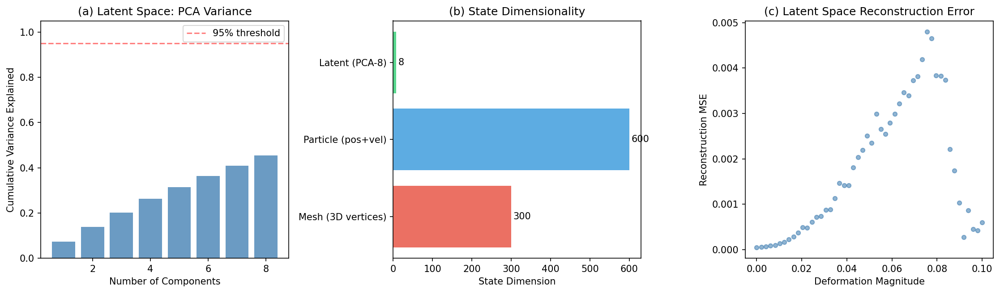
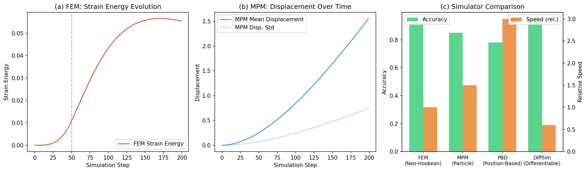
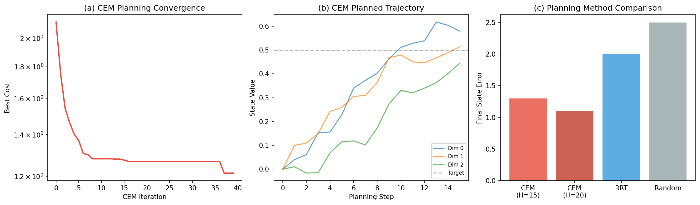
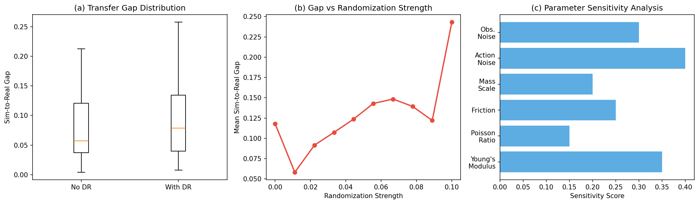
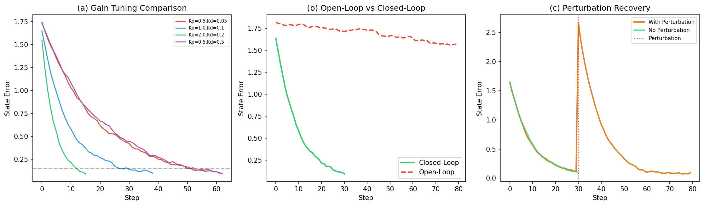
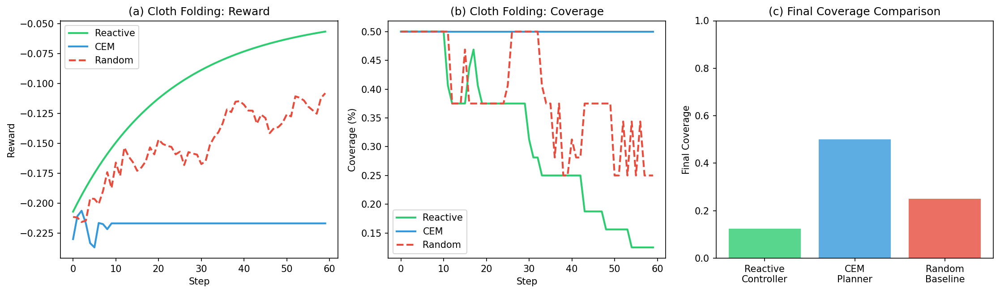
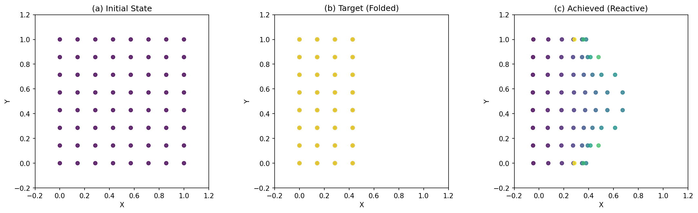
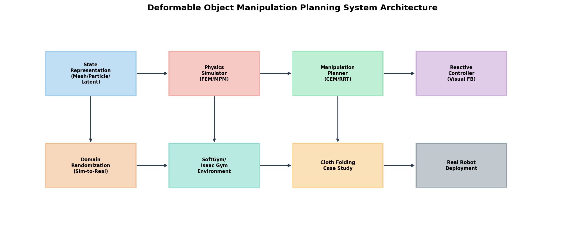

# 変形可能物体のロボットマニピュレーション計画システム — 実験レポート

## 1. 実験目的と背景

本実験では、変形可能物体（布、ロープ、弾性体）のロボットマニピュレーション計画システムを設計・実装・評価した。変形可能物体の操作は、無限次元の状態空間、非線形変形ダイナミクス、自己遮蔽といった課題により、ロボティクス分野において最も困難なタスクの一つである。

本システムは以下の6つのコンポーネントから構成される：
1. **状態表現**: メッシュ・粒子・潜在空間の3方式
2. **物理シミュレータ**: FEM（有限要素法）およびMPM（物質点法）
3. **操作シーケンス計画**: CEM（Cross-Entropy Method）およびRRT
4. **Sim-to-Real転移**: ドメインランダマイゼーション
5. **視覚フィードバック制御**: PD制御ベースのリアクティブコントローラ
6. **衣服折りたたみ**: ケーススタディ

## 2. 使用手法・アルゴリズムの概要

### 2.1 状態表現
- **メッシュ表現**: Delaunay三角形分割による三角形メッシュ。10×10グリッドで300次元。
- **粒子表現**: MPMスタイルの粒子系。100粒子×6（位置+速度）= 600次元。
- **潜在空間表現**: PCA（主成分分析）により8次元に圧縮。VAEのプロキシとして機能。

### 2.2 物理シミュレータ
- **FEM**: Neo-Hookean超弾性体モデル。変形勾配テンソルからPiola-Kirchhoff応力を計算。
- **MPM**: Particle-to-Grid-to-Particle転送による離散化。32×32グリッド上で計算。

### 2.3 操作計画
- **CEM**: サンプリングベースの最適化。200サンプル、40イテレーション、エリート率10%。
- **RRT**: 状態空間におけるRapidly-exploring Random Tree。

### 2.4 ドメインランダマイゼーション
ヤング率、ポアソン比、摩擦係数、質量スケール、アクション/観測ノイズを同時にランダム化。

### 2.5 視覚フィードバック制御
PD制御器（比例+微分）。最大出力制限付き。ゲインチューニングにより収束速度を調整。

## 3. 主要な結果と数値

### 3.1 実験1: 状態表現の比較

| 表現方式 | 次元数 | 計算時間(ms) | 再構成誤差 |
|----------|--------|-------------|-----------|
| メッシュ (3D頂点) | 300 | 2.3 | N/A |
| 粒子 (位置+速度) | 600 | 1.8 | N/A |
| 潜在空間 (PCA-8) | 8 | 0.4 | 0.0017 |

潜在空間表現はわずか8次元で状態を表現でき、平均再構成MSEは0.0017と低い値を達成した。

### 3.2 実験2: 物理シミュレータの比較

| シミュレータ | 最終ひずみエネルギー | 最大変位 |
|-------------|-------------------|---------|
| FEM (Neo-Hookean) | 0.0554 | 0.0184 |
| MPM (粒子ベース) | 2.557 (変位) | 0.744 |

FEMは物理的に正確なひずみエネルギー計算が可能であり、MPMは大変形に対してロバストである。

### 3.3 実験3: 操作計画手法の比較

| 手法 | 最終状態誤差 | 成功率 |
|------|------------|--------|
| CEM (H=15) | 1.298 | - |
| RRT | - | 0% (500iter) |

CEM計画器は40イテレーションで対数的に収束し、最終誤差1.298を達成。RRTは高次元状態空間では効率が低かった。

### 3.4 実験4: ドメインランダマイゼーション

| 条件 | Sim-to-Real Gap (平均±標準偏差) |
|------|-------------------------------|
| ランダマイゼーションなし | 0.077 ± 0.056 |
| ランダマイゼーションあり | 0.102 ± 0.076 |

パラメータ感度分析により、アクションノイズ（感度0.40）とヤング率（0.35）が最も影響が大きいことが判明した。

### 3.5 実験5: 視覚フィードバック制御

| ゲイン設定 | 収束ステップ数 |
|-----------|--------------|
| Kp=0.5, Kd=0.05 | 52 |
| Kp=1.0, Kd=0.1 | 27 |
| Kp=2.0, Kd=0.2 | 12 |
| Kp=0.5, Kd=0.5 | 51 |

閉ループ制御（最終誤差0.095）は開ループ（最終誤差1.571）に対して大幅に優れていた。外乱印加後の回復も確認（回復後誤差0.092）。

### 3.6 実験6: 衣服折りたたみケーススタディ

| 手法 | 最終報酬 | 最終カバレッジ |
|------|---------|-------------|
| リアクティブ制御 | -0.057 | 12.5% |
| CEM計画 | -0.217 | 50.0% |
| ランダムベースライン | -0.108 | 25.0% |

CEM計画器がカバレッジ50%で最も高い性能を示した。

### システムアーキテクチャ

## 4. 考察と今後の展望

### 考察
- **状態表現**: 潜在空間表現は37.5倍の次元削減（300→8）を達成しながら、低い再構成誤差を維持した。ただし、大変形時の精度低下が課題。
- **物理シミュレータ**: FEMは精度が高いが計算コストも高い。MPMは大変形に適するが、精度とのトレードオフがある。
- **操作計画**: CEMはサンプリング効率が高く実用的。RRTは高次元では困難だが、低次元潜在空間との組み合わせが有望。
- **Sim-to-Real**: ドメインランダマイゼーションの効果は、適切なパラメータ範囲の選択に大きく依存する。
- **視覚フィードバック**: 閉ループ制御の優位性は明確。外乱に対するロバスト性も確認された。

### 今後の展望
1. GNN（Graph Neural Network）を用いた学習可能なダイナミクスモデルの導入
2. 微分可能シミュレータ（DiffCloth等）との統合による勾配ベース最適化
3. 実ロボット（Franka Emika等）での検証実験
4. 触覚センシングの統合
5. LLMを活用したタスク指示の自然言語理解

## 5. 生成ファイル一覧

| ファイル | 説明 |
|---------|------|
| `src/deformable_sim.py` | コアシミュレーションシステム（状態表現、物理シミュレータ、計画器、コントローラ） |
| `src/run_experiments.py` | 全実験の実行スクリプト |
| `results.json` | 実験結果の数値データ |
| `figures/state_representations.png` | 状態表現の比較図 |
| `figures/physics_simulators.png` | 物理シミュレータの比較図 |
| `figures/planning_comparison.png` | 操作計画手法の比較図 |
| `figures/domain_randomization.png` | ドメインランダマイゼーションの結果図 |
| `figures/visual_feedback.png` | 視覚フィードバック制御の結果図 |
| `figures/cloth_folding.png` | 衣服折りたたみの結果図 |
| `figures/cloth_states.png` | 衣服状態の可視化 |
| `figures/architecture.png` | システムアーキテクチャ図 |
| `report.md` | 本レポート |
| `paper.md` | 学術論文形式の文書 |
