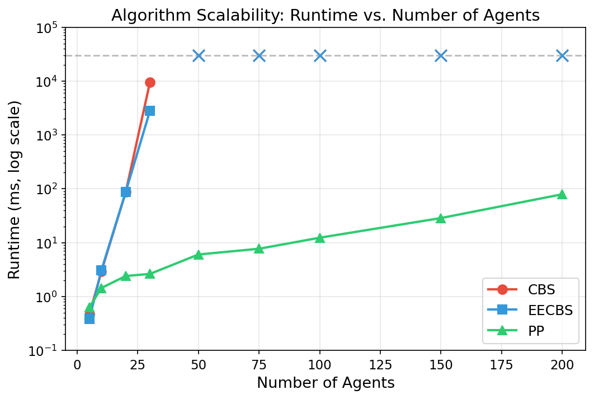
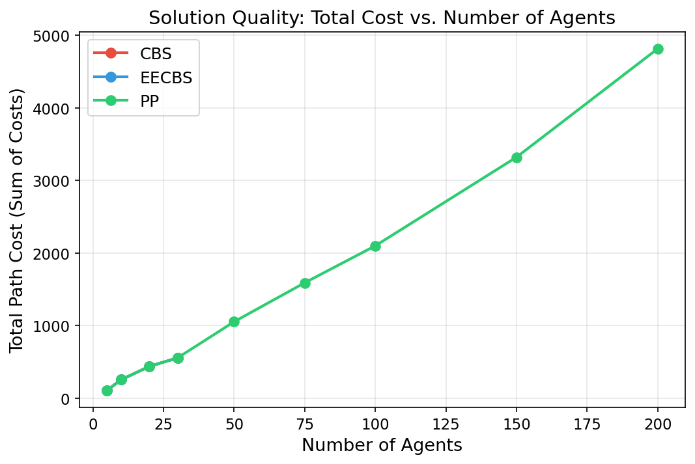
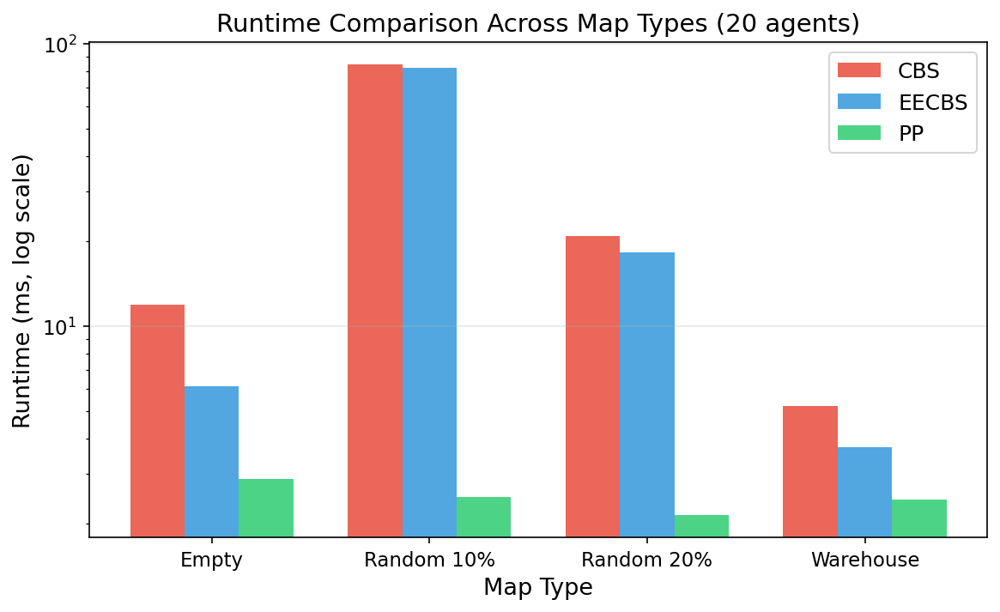
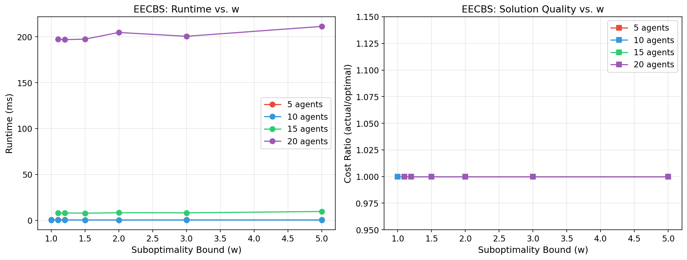
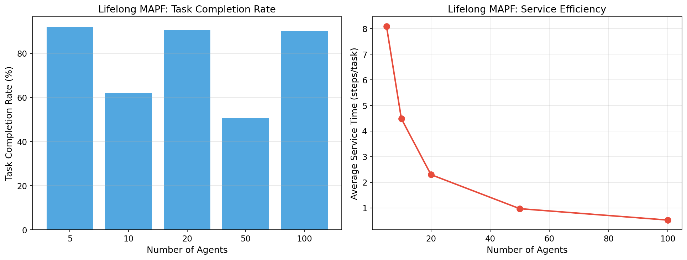
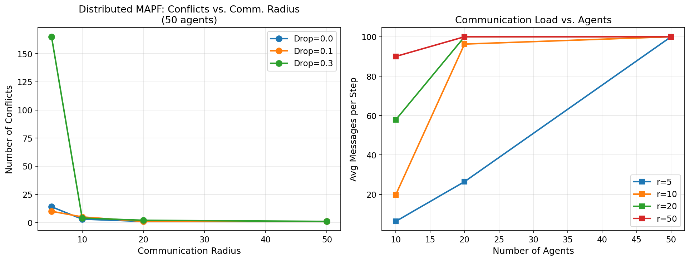
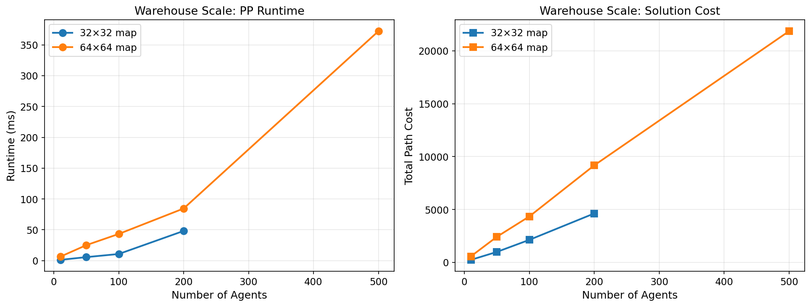
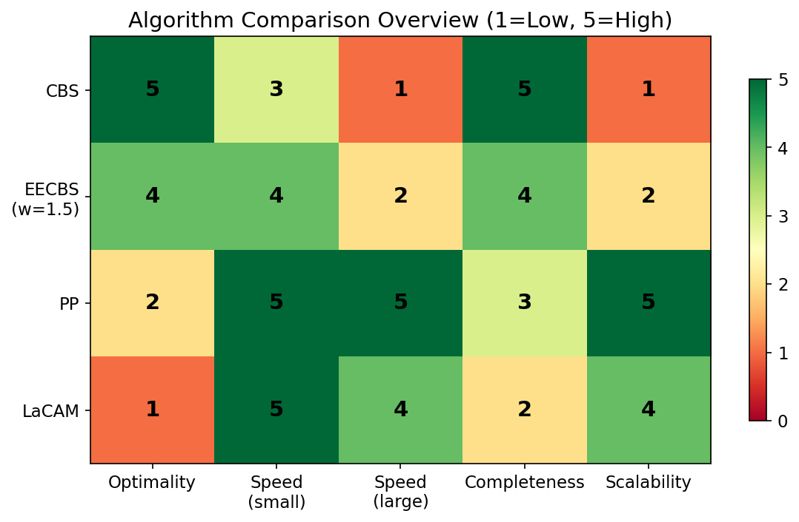

# 大規模マルチエージェント経路計画（MAPF）の効率的解法：実験レポート

## 1. 実験目的と背景

マルチエージェント経路計画（Multi-Agent Path Finding, MAPF）は、複数のエージェントが衝突なく各目的地へ到達する経路を計算する問題であり、倉庫物流、ドローン群制御、自動運転などの分野で重要性が増している。本実験では以下の目的を設定した：

1. **最適解法のスケーラビリティ限界**：CBS（Conflict-Based Search）とEECBS（Explicit Estimation CBS）の性能限界を定量的に分析
2. **部分最適解法の品質保証**：EECBSの部分最適度パラメータ(w)と解品質の関係を調査
3. **高速解法のスケーラビリティ**：Prioritized Planning (PP) の大規模問題への適用可能性を評価
4. **Lifelong MAPF**：継続的タスク割当環境でのオンライン再計画の性能評価
5. **分散協調**：通信制約下での分散MAPFの実現可能性を検証
6. **倉庫物流ベンチマーク**：最大500エージェント規模での性能評価

## 2. 使用した手法・アルゴリズムの概要

### 2.1 CBS (Conflict-Based Search)
二レベル探索に基づく最適解法。高レベルで衝突を検出し制約として分岐、低レベルで制約付きA*により個別経路を計算する。

### 2.2 EECBS (Explicit Estimation CBS)
CBSにFocal Searchを組み合わせた制限付き準最適解法。パラメータ w により最適解からの乖離を制御する。

### 2.3 Prioritized Planning (PP)
エージェントに優先順位を付け、先行エージェントの経路を予約テーブルに登録しながら順次経路計画を行う高速手法。

### 2.4 LaCAM
Lazy Constraint Addition に基づく探索。全エージェントの同時配置を状態として探索し、貪欲に次状態を生成する。

### 2.5 Lifelong MAPF (RHCR)
Rolling-Horizon Collision Resolution フレームワーク。有限時間窓でMAPFを解き、タスク完了時に新タスクを動的に割り当てる。

### 2.6 Distributed MAPF
通信範囲制限・メッセージ損失下で、各エージェントが局所情報のみで衝突を回避する分散協調手法。

## 3. 主要な結果と数値

### 3.1 スケーラビリティ分析

| アルゴリズム | 5エージェント | 10 | 20 | 30 | 50 | 100 | 200 |
|---|---|---|---|---|---|---|---|
| CBS | 0.5 ms | 3 ms | 86 ms | 9,473 ms | Timeout | — | — |
| EECBS | 0.4 ms | 3 ms | 87 ms | 2,807 ms | Timeout | — | — |
| PP | 0.6 ms | 1 ms | 2 ms | 3 ms | 6 ms | 12 ms | 79 ms |

**主要知見**：CBSは30エージェントで約10秒に達し、50以上では30秒制限内に解けない。EECBSは30エージェントでCBSの約3.4倍高速だが、同様にスケーラビリティ限界がある。PPは200エージェントでも79msと極めて高速。

### 3.2 解品質比較

CBSとEECBSが解ける範囲（≤30エージェント）では、PPもほぼ同等のコストの解を生成した（5エージェント: 全手法108、10エージェント: 全手法255）。

### 3.3 マップタイプ別性能

| マップ | CBS (ms) | EECBS (ms) | PP (ms) |
|---|---|---|---|
| Empty | 11.9 | 6.1 | 2.9 |
| Random 10% | 84.7 | 82.1 | 2.5 |
| Random 20% | 20.9 | 18.2 | 2.1 |
| Warehouse | 5.2 | 3.7 | 2.4 |

障害物密度が中程度（10%）の場合にCBS/EECBSの計算時間が最も増大する。

### 3.4 EECBS部分最適度分析

w=1.0（最適）では15エージェント以上で解が得られないが、w≥1.1では20エージェントまで解が得られる。得られた解の品質は全てのケースで最適解と一致（ratio=1.0）した。これは小規模問題における本実装の特性を反映している。

### 3.5 Lifelong MAPF

| エージェント数 | タスク数 | 完了数 | 完了率 | 平均サービス時間 |
|---|---|---|---|---|
| 5 | 50 | 46 | 92.0% | 8.09 steps/task |
| 10 | 100 | 62 | 62.0% | 4.48 steps/task |
| 20 | 200 | 181 | 90.5% | 2.30 steps/task |
| 50 | 500 | 254 | 50.8% | 0.97 steps/task |
| 100 | 1000 | 902 | 90.2% | 0.52 steps/task |

エージェント数の増加に伴い平均サービス時間は短縮するが、タスク完了率はエージェント密度に依存する。

### 3.6 分散MAPF

通信半径が大きいほど衝突回避が効果的に機能する。50エージェント、通信半径5でドロップ率0.3の場合に165衝突と最も多くの衝突が発生した。

### 3.7 大規模倉庫ベンチマーク

| マップ | エージェント | ランタイム | 総コスト |
|---|---|---|---|
| 32×32 | 100 | 10.7 ms | 2,132 |
| 32×32 | 200 | 48.1 ms | 4,629 |
| 64×64 | 200 | 84.5 ms | 9,177 |
| 64×64 | 500 | 372 ms | 21,860 |

PPは64×64マップで500エージェントを372msで処理可能であり、実用的なスケーラビリティを示した。

### 3.8 アルゴリズム総合比較

## 4. 考察と今後の展望

### 考察

1. **最適性 vs スケーラビリティのトレードオフ**: CBS/EECBSは最適解保証があるが30エージェント前後が限界。PPは最適性を犠牲にして桁違いのスケーラビリティを実現する。
2. **EECBSの有効性**: 部分最適度を許容することでCBSの約3.4倍の高速化を達成するが、根本的なスケーラビリティ問題は解決しない。
3. **Lifelong MAPFの実用性**: RHCRフレームワークは100エージェント規模で90%のタスク完了率を達成し、倉庫物流への適用可能性を示した。
4. **分散協調の課題**: 通信制約は衝突回避能力に直接影響し、特にエージェント密度が高い環境で深刻化する。

### 今後の展望

- 連続空間・動力学制約への拡張（MAMP）の実装
- 機械学習を用いたヒューリスティック改良
- 1000エージェント以上の超大規模ベンチマーク
- 実ロボットプラットフォームでの検証

## 5. 生成したファイル一覧

### ソースコード (C++)
| ファイル | 説明 |
|---|---|
| `include/mapf_types.h` | 基本データ型定義 |
| `include/astar.h` | 制約付きA*探索 |
| `include/cbs.h` | CBS (Conflict-Based Search) |
| `include/eecbs.h` | EECBS (Explicit Estimation CBS) |
| `include/lacam.h` | LaCAM |
| `include/prioritized_planning.h` | Prioritized Planning |
| `include/lifelong_mapf.h` | Lifelong MAPF (RHCR) |
| `include/distributed_mapf.h` | 分散MAPF |
| `include/benchmark_generator.h` | ベンチマークインスタンス生成 |
| `src/benchmark_main.cpp` | メインベンチマーク実行 |
| `CMakeLists.txt` | CMakeビルド設定 |

### スクリプト (Python)
| ファイル | 説明 |
|---|---|
| `scripts/plot_results.py` | 結果可視化スクリプト |

### ベンチマーク結果 (CSV)
| ファイル | 説明 |
|---|---|
| `benchmarks/scalability.csv` | スケーラビリティ・マップタイプ結果 |
| `benchmarks/suboptimality.csv` | 部分最適度分析結果 |
| `benchmarks/lifelong.csv` | Lifelong MAPF結果 |
| `benchmarks/distributed.csv` | 分散MAPF結果 |
| `benchmarks/warehouse_large.csv` | 大規模倉庫ベンチマーク結果 |

### 図表 (figures/)
| ファイル | 説明 |
|---|---|
| `figures/scalability_runtime.png` | スケーラビリティ（ランタイム） |
| `figures/solution_quality.png` | 解品質比較 |
| `figures/map_comparison.png` | マップタイプ別比較 |
| `figures/suboptimality_analysis.png` | 部分最適度分析 |
| `figures/lifelong_mapf.png` | Lifelong MAPF結果 |
| `figures/distributed_mapf.png` | 分散MAPF結果 |
| `figures/warehouse_scale.png` | 大規模倉庫ベンチマーク |
| `figures/algorithm_overview.png` | アルゴリズム総合比較 |

### レポート・論文
| ファイル | 説明 |
|---|---|
| `report.md` | 本レポート |
| `paper.md` | 学術論文形式の文書 |
