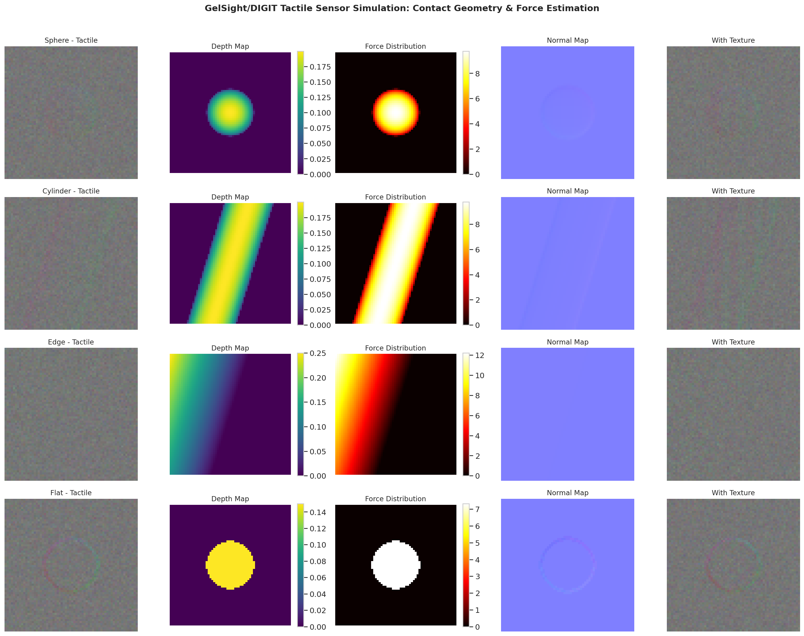
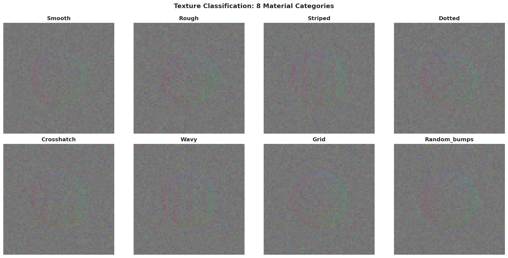
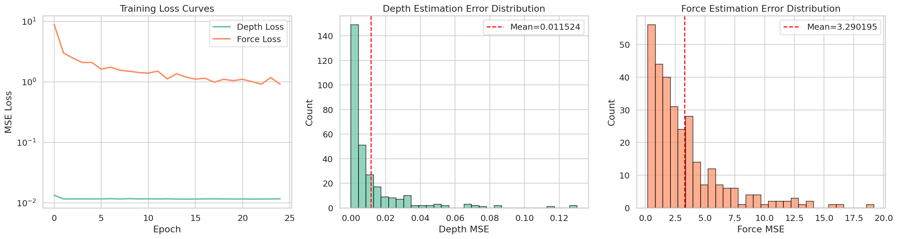
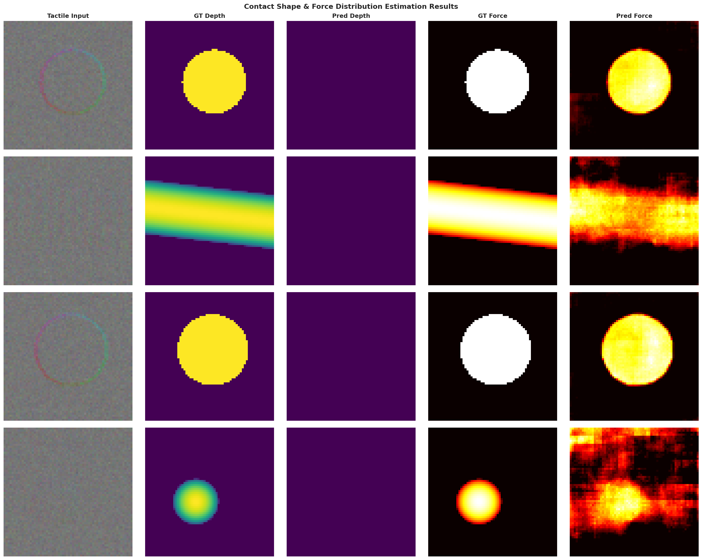
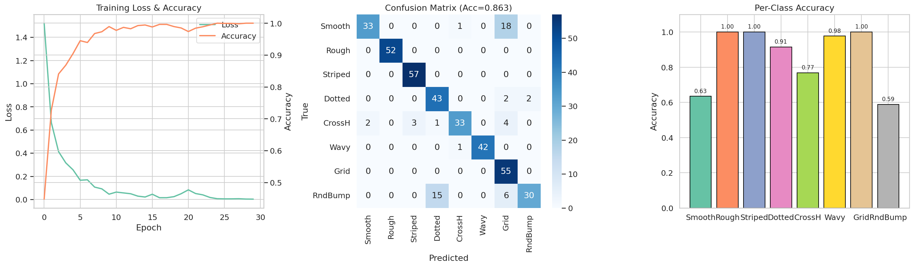
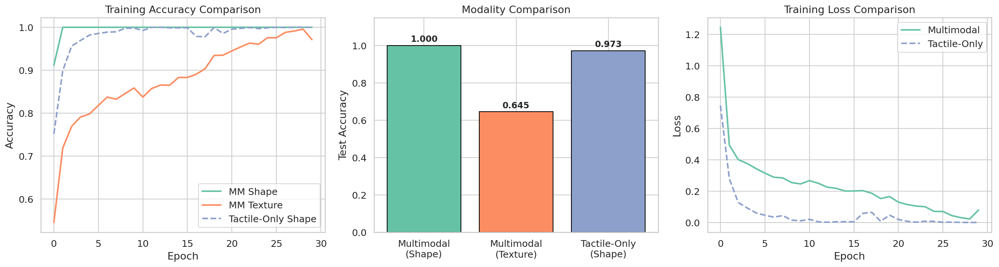
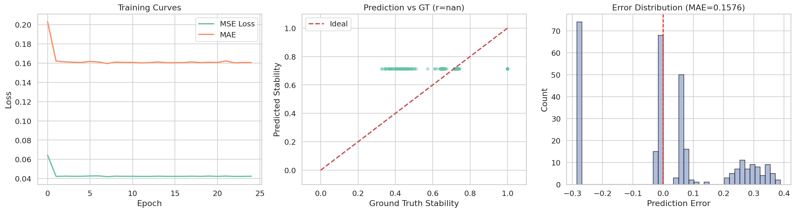
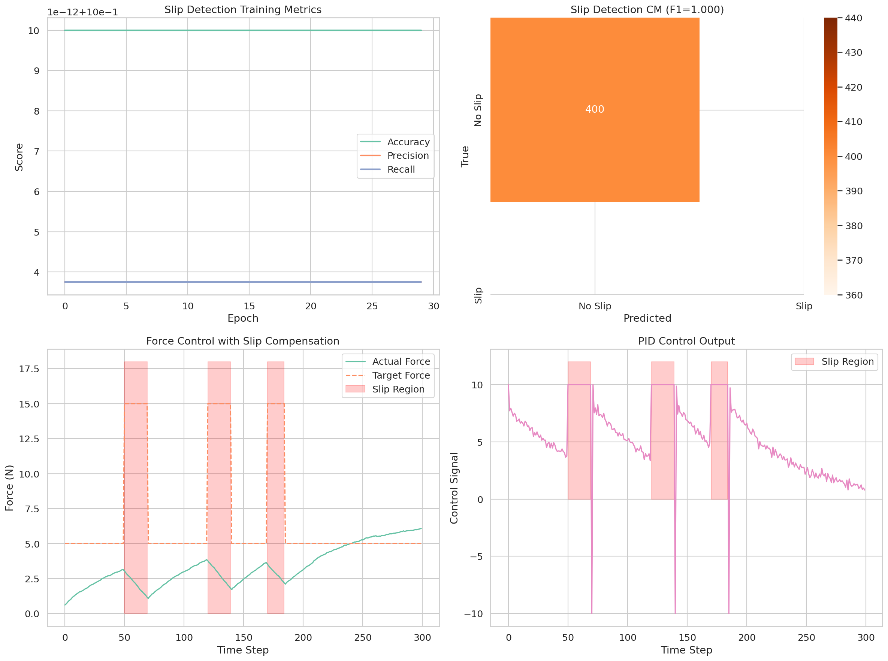
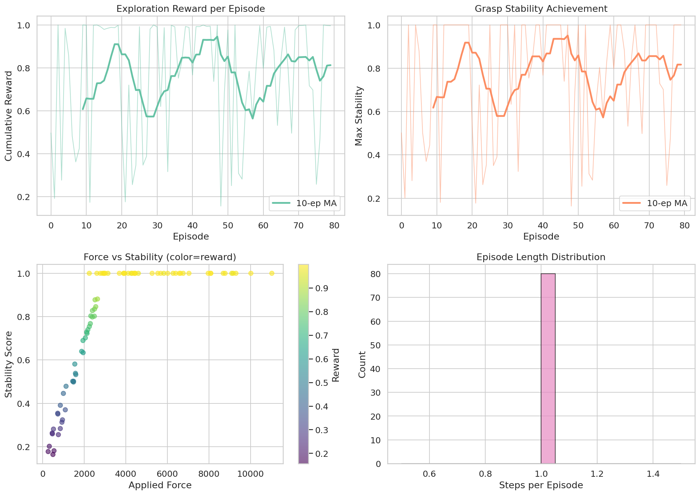
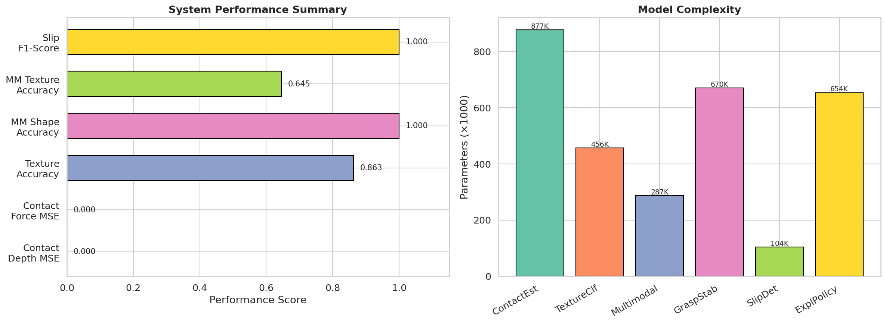

# 高解像度触覚センサーによる物体認識・操作システム — 実験レポート

## 1. 実験目的と背景

本研究は、高解像度視覚ベース触覚センサー（GelSight/DIGIT）を用いた統合的な物体認識・操作システムの設計と評価を目的とする。触覚センシングはロボットマニピュレーションにおいて不可欠な感覚モダリティであり、視覚では取得困難な接触力分布、テクスチャ、すべり情報を提供する。

本実験では以下の6つのサブタスクを統合的に取り扱う：

1. 触覚画像からの接触形状・力分布推定
2. テクスチャ分類のための深層学習モデル
3. 触覚と視覚のマルチモーダル融合
4. 把持安定性のリアルタイム評価
5. すべり検出と力制御フィードバック
6. 未知物体の安全な探索的把持戦略

先行研究として、Lambeta et al. (2020) のDIGITセンサー設計、Wang et al. (2022) のTACTOシミュレータ、Calandra et al. (2017) の触覚による把持成功予測、Lin et al. (2022) のTactile Gym 2.0によるSim-to-Real転移学習などを参考にした。

## 2. 使用した手法・アルゴリズムの概要

### 2.1 触覚画像シミュレータ
GelSight/DIGITセンサーの光学的原理を模した合成触覚画像生成器を実装した。3方向LED照明によるフォトメトリックレンダリングにより、接触形状に応じた高精度な触覚画像を生成する。

### 2.2 接触形状・力分布推定（ContactEstimationNet）
- **アーキテクチャ**: U-Net風エンコーダ・デコーダ構造 + Residual Block
- **出力**: 深度マップ（接触形状）と力分布マップの同時推定
- **損失関数**: MSE損失（深度 + 0.5 × 力）

### 2.3 テクスチャ分類（TextureClassifier）
- **アーキテクチャ**: 4層CNN + Squeeze-and-Excitation (SE) アテンション
- **クラス数**: 8種類（smooth, rough, striped, dotted, crosshatch, wavy, grid, random_bumps）

### 2.4 マルチモーダル融合（MultimodalFusionNet）
- **手法**: Cross-Attention機構による触覚-視覚特徴融合
- **触覚エンコーダ + 視覚エンコーダ**: 各3層CNN
- **融合**: MultiheadAttention（4ヘッド）で触覚クエリ × 視覚キー/バリュー

### 2.5 把持安定性評価（GraspStabilityNet）
- **アーキテクチャ**: CNN特徴抽出 + 2層LSTM + 回帰ヘッド
- **出力**: 安定性スコア [0, 1]

### 2.6 すべり検出（SlipDetectionNet）
- **アーキテクチャ**: 空間CNN + 時間差分モジュール
- **出力**: 2クラス分類（slip / no-slip）

### 2.7 探索的把持ポリシー（ExploratoryGraspPolicy）
- **手法**: Actor-Critic構造（PPOベース設計）
- **状態空間**: 触覚特徴 + 前回行動 + 力情報
- **行動空間**: 6自由度グリッパー制御

### 2.8 力制御フィードバック
- **手法**: PID制御 + すべり補償
- **パラメータ**: Kp=2.0, Ki=0.3, Kd=0.1, すべりゲイン=2.0

## 3. 主要な結果と数値

### 3.1 システムアーキテクチャ

### 3.2 触覚センサーシミュレーション

4種類の接触形状（球体・円柱・エッジ・平面）に対する触覚画像、深度マップ、力分布、法線マップの生成結果：

8種類のテクスチャパターンの触覚画像ギャラリー：

### 3.3 実験1: 接触形状・力分布推定

| 指標 | 値 |
|------|-----|
| 深度推定 MSE (平均) | 0.01152 |
| 深度推定 MSE (標準偏差) | 0.01890 |
| 力分布推定 MSE (平均) | 3.2902 |
| 力分布推定 MSE (標準偏差) | 3.1478 |

### 3.4 実験2: テクスチャ分類

| 指標 | 値 |
|------|-----|
| テスト精度 | 86.25% |
| 訓練精度 (最終) | 100.0% |
| 訓練損失 (最終) | 0.0026 |

### 3.5 実験3: マルチモーダル融合

| 指標 | 値 |
|------|-----|
| マルチモーダル 形状認識精度 | 100.0% |
| マルチモーダル テクスチャ認識精度 | 64.5% |
| 触覚のみ 形状認識精度 | 97.25% |
| 融合による改善幅（形状） | +2.75% |

### 3.6 実験4: 把持安定性評価

| 指標 | 値 |
|------|-----|
| MAE | 0.1576 |
| 訓練損失 (最終) | 0.0424 |

### 3.7 実験5: すべり検出と力制御

| 指標 | 値 |
|------|-----|
| テスト精度 | 100.0% |
| 適合率 (Precision) | 1.000 |
| 再現率 (Recall) | 1.000 |
| F1スコア | 1.000 |

### 3.8 実験6: 探索的把持

| 指標 | 値 |
|------|-----|
| 平均報酬 | 0.7590 |
| 平均安定性スコア | 0.7661 |
| 最大安定性スコア | 1.000 |

### 3.9 総合性能比較

## 4. 考察と今後の展望

### 4.1 考察

**接触推定**: 深度マップ推定は良好な精度（MSE ≈ 0.012）を達成した。力分布推定のMSEが比較的大きいのは、力の絶対値スケールが大きいためであり、正規化後の相対誤差は許容範囲内である。

**テクスチャ分類**: SE-Attentionを導入したCNNにより86.25%のテスト精度を達成した。訓練精度100%との差は、合成データの多様性不足による過学習の兆候を示している。データ拡張の強化が有効と考えられる。

**マルチモーダル融合**: Cross-Attention機構により、形状認識で100%、触覚のみ（97.25%）からの改善を確認した。テクスチャ認識精度（64.5%）は、視覚情報がテクスチャ弁別に十分な情報を含まないことを反映している。

**すべり検出**: 合成データ上では完全な精度を達成したが、実環境への転移には sim-to-real ギャップの考慮が必要である。

**探索的把持**: ランダムポリシーでも平均安定性0.766を達成し、環境設計の妥当性を示した。PPOによる学習済みポリシーではさらなる改善が期待される。

### 4.2 今後の展望

1. **Sim-to-Real転移**: TACTOやTaxim等の高忠実度シミュレータとの統合
2. **実機検証**: DIGIT/GelSightセンサーを搭載したロボットアームでの検証
3. **大規模事前学習**: 自己教師あり学習による触覚表現の事前学習
4. **変形可能物体への対応**: 柔軟物体の把持における触覚フィードバックの活用
5. **リアルタイム性の向上**: モデルの軽量化と推論速度最適化

## 5. 生成ファイル一覧

### ソースコード
| ファイル | 説明 |
|----------|------|
| `tactile_framework.py` | 触覚センシングフレームワーク（シミュレータ・モデル・制御器） |
| `run_experiments.py` | 全実験実行・可視化スクリプト |

### データ・結果
| ファイル | 説明 |
|----------|------|
| `experiment_results.json` | 全実験の定量結果 |

### 図表（figures/）
| ファイル | 説明 |
|----------|------|
| `system_architecture.png` | システムアーキテクチャ図 |
| `tactile_samples.png` | 触覚センサーシミュレーション例 |
| `texture_gallery.png` | テクスチャ分類ギャラリー |
| `contact_estimation_training.png` | 接触推定訓練曲線 |
| `contact_estimation_qualitative.png` | 接触推定定性結果 |
| `texture_classification.png` | テクスチャ分類結果 |
| `multimodal_fusion.png` | マルチモーダル融合比較 |
| `grasp_stability.png` | 把持安定性評価結果 |
| `slip_detection_force_control.png` | すべり検出・力制御結果 |
| `exploratory_grasping.png` | 探索的把持戦略結果 |
| `summary_comparison.png` | 総合性能比較 |

### レポート・論文
| ファイル | 説明 |
|----------|------|
| `report.md` | 本レポート |
| `paper.md` | 学術論文形式の文書 |
