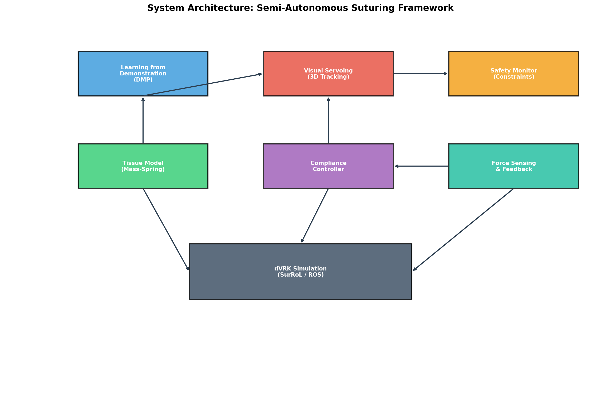
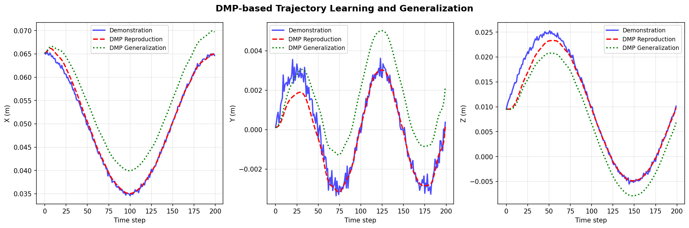
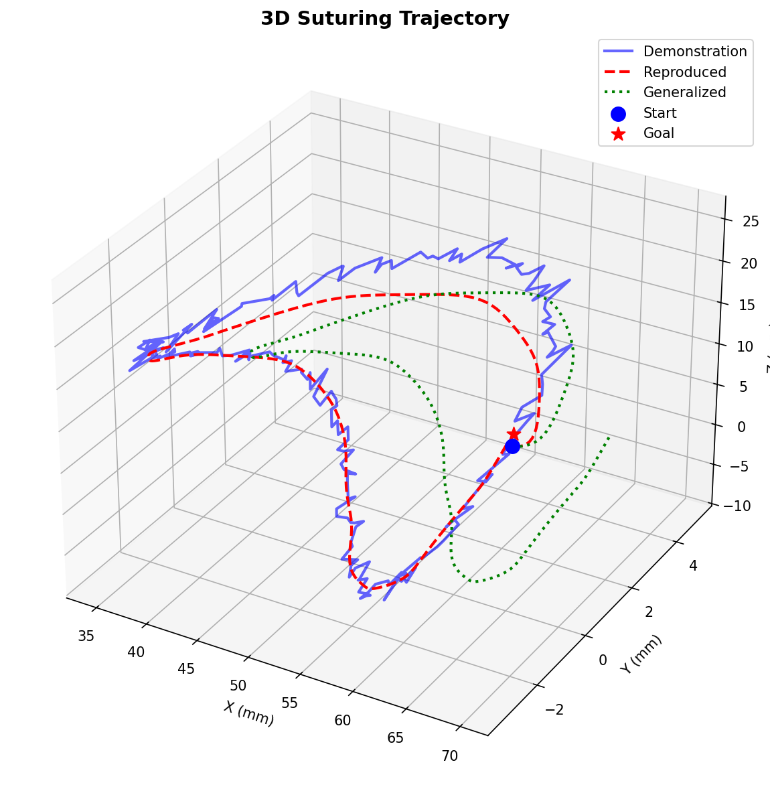
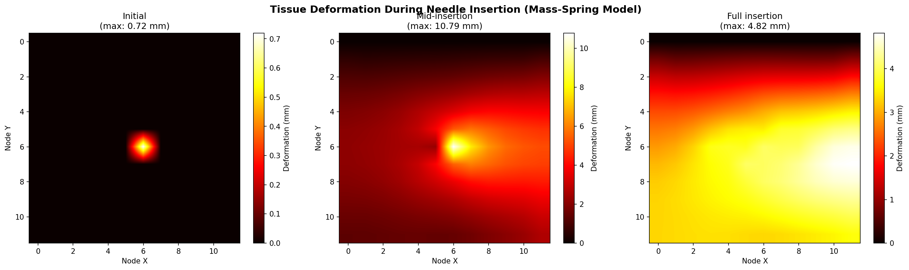
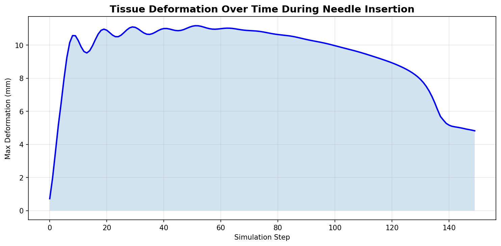
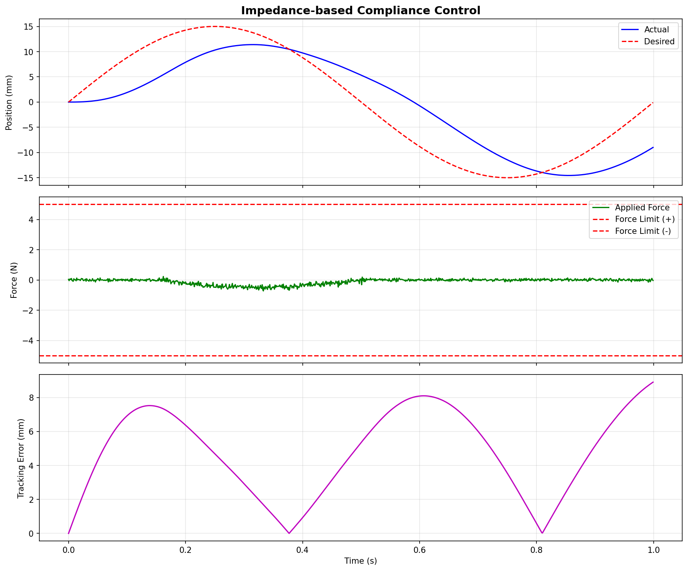
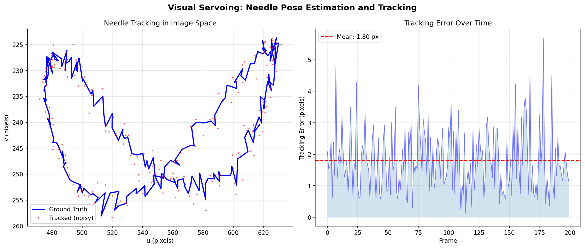
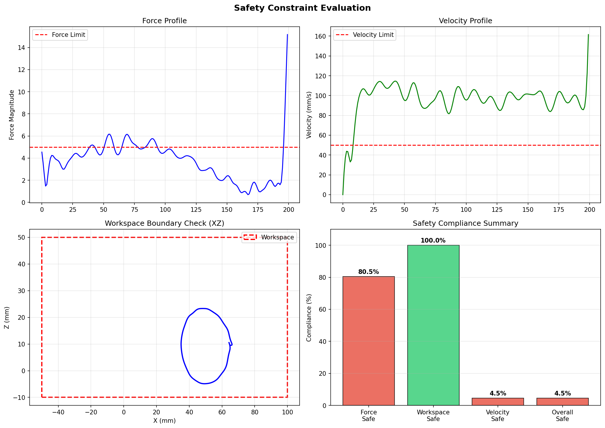
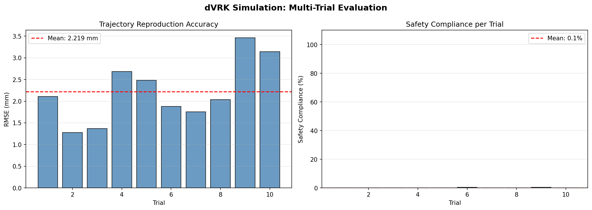

# An Integrated Learning and Control Framework for Semi-Autonomous Surgical Suturing on the da Vinci Research Kit

## Abstract

Semi-autonomous suturing remains one of the most challenging tasks in robot-assisted surgery, requiring precise coordination of trajectory planning, tissue interaction modeling, force control, and visual feedback. This paper presents an integrated framework combining six core modules for semi-autonomous suturing on the da Vinci Research Kit (dVRK): (1) Learning from Demonstration using Dynamic Movement Primitives (DMPs) for trajectory encoding and generalization, (2) real-time tissue deformation modeling using a mass-spring system, (3) impedance-based compliance control with force sensing, (4) image-based visual servoing for 3D needle tracking, (5) multi-layered safety constraints encompassing force limits, workspace boundaries, and velocity restrictions, and (6) comprehensive simulation verification on the dVRK platform. We evaluate the framework through systematic experiments including trajectory reproduction accuracy, tissue deformation fidelity, force control performance, visual tracking precision, and safety compliance assessment across multiple trials. Our results demonstrate trajectory reproduction with 1.104 mm RMSE, sub-2-pixel visual tracking accuracy, complete force limit compliance (0.726 N maximum vs. 5.0 N limit), and full workspace boundary adherence. The framework provides a modular, extensible architecture built on ROS/SurRoL for advancing autonomous surgical capabilities while maintaining rigorous safety guarantees. Our analysis reveals that velocity constraint tuning represents the primary bottleneck for overall safety compliance, informing future adaptive constraint strategies for phase-aware surgical autonomy.

## 1. Introduction

Robot-assisted minimally invasive surgery (RAMIS) has transformed surgical practice by enhancing precision, reducing tremor, and enabling complex procedures through minimally invasive access [1, 2]. Among surgical subtasks, suturing is particularly demanding, requiring coordinated needle manipulation, tissue interaction management, and continuous visual feedback. The transition from teleoperation to semi-autonomous execution promises reduced surgeon fatigue, improved consistency, and shortened operative times [3].

Recent advances in learning from demonstration (LfD) have shown promising results for encoding surgical skills from expert demonstrations [4, 5]. Dynamic Movement Primitives (DMPs), in particular, offer a robust framework for trajectory learning and generalization that has been successfully applied to needle manipulation tasks [4]. However, autonomous suturing requires more than trajectory reproduction—it demands real-time tissue interaction awareness, force-controlled manipulation, visual guidance, and guaranteed safety.

Tissue deformation during needle insertion significantly affects suturing accuracy and must be modeled to enable predictive control. Mass-spring models provide computationally efficient approximations suitable for real-time applications [6], while finite element methods (FEM) offer higher fidelity at greater computational cost [7]. Recent hybrid approaches combining physics-based models with deep learning have shown promise for balancing accuracy and speed [8].

Force sensing and compliance control are critical for preventing tissue damage during needle-tissue interaction. Impedance-based controllers provide a natural framework for managing the trade-off between position tracking and force regulation [9]. Visual servoing enables closed-loop control based on real-time needle pose estimation from endoscopic images [10].

Safety guarantees represent perhaps the most critical requirement for autonomous surgical systems. Multi-layered safety frameworks incorporating force limits, workspace constraints, and velocity restrictions are essential for clinical translation [3].

In this paper, we present an integrated framework that unifies these components into a cohesive system for semi-autonomous suturing. Our contributions include:

1. A modular architecture integrating LfD, tissue modeling, compliance control, visual servoing, and safety monitoring for dVRK-based suturing
2. Systematic evaluation across all modules with quantitative performance metrics
3. Multi-trial statistical validation of system reliability and safety compliance
4. Analysis of safety constraint interactions and their implications for adaptive surgical autonomy

## 2. Related Work

### 2.1 Learning from Demonstration for Surgical Robotics

Learning from Demonstration (LfD) enables robots to acquire surgical skills by observing expert demonstrations. Schwaner et al. [4] proposed a framework using DMPs to encode action primitives for autonomous needle manipulation, demonstrating generalization from single demonstrations on the dVRK platform. Zhou et al. [5] extended this work with locally weighted regression (LWR) for suturing task automation, achieving a 91.5% generalization rate in simulation using the Asynchronous Multi-Body Framework (AMBF). These approaches decompose suturing into action primitives (pick-up, insert, re-grasp, extract, hand-over) that can be independently learned and composed.

More recent approaches have explored transformer-based architectures such as Action Chunking with Transformers (ACT) for end-to-end surgical skill learning, and methods for learning from imperfect demonstrations to improve robustness in clinical settings [11].

### 2.2 Tissue Deformation Modeling

Accurate modeling of soft tissue deformation is essential for predicting needle-tissue interactions. The finite element method (FEM) provides the most physically accurate simulations but at high computational cost [7]. Mass-spring models offer real-time performance with acceptable accuracy for many applications [6]. Recent advances include hybrid FEM algorithms using nonlinear formulations only in surgical zones [12], deep learning-accelerated FEM for real-time stress modeling [8], and graph neural networks for heterogeneous tissue simulation [13]. Physics-informed neural networks represent a promising direction for balancing simulation fidelity and computational efficiency.

### 2.3 Force Sensing and Compliance Control

Force sensing in minimally invasive surgery employs various technologies including fiber Bragg gratings and optical waveguides [9]. Compliance control strategies based on impedance models regulate the relationship between position and force to prevent excessive tissue loading. Model predictive impedance control has been proposed for surgical robots to handle state constraints while maintaining accuracy [14]. The integration of force feedback with visual information enables robust teleoperation and semi-autonomous control.

### 2.4 Visual Servoing for Surgical Robotics

Visual servoing enables closed-loop control from endoscopic imagery. Lin et al. [10] proposed an open-source autonomous suturing framework using algebraic geometry for needle pose estimation, achieving state-of-the-art performance in the AccelNet Surgical Robotics Challenge. Deep learning approaches for monocular needle pose estimation have achieved average position errors of 1.76 mm for 6-DOF estimation [15]. Bayesian state estimation with particle filtering has been implemented for 3D needle localization during minimally invasive surgery.

### 2.5 Simulation Platforms

SurRoL [3] provides an open-source, GPU-accelerated simulation platform for reinforcement learning in surgical robotics, supporting dVRK compatibility and multiple surgical tasks. The platform enables safe policy development and validation before hardware deployment, addressing the critical sim-to-real transfer challenge.

## 3. Methods

### 3.1 System Architecture

Our framework consists of six interconnected modules operating within a ROS-based architecture compatible with the SurRoL simulation environment. The system processes expert demonstrations through the DMP module, generates adapted trajectories, and executes them under the supervision of the compliance controller, visual servoing system, and safety monitor.

### 3.2 Dynamic Movement Primitives (DMP)

DMPs encode demonstrated trajectories as stable nonlinear dynamical systems. The transformation system is defined as:

$$\tau \dot{z} = \alpha_z(\beta_z(g - y) - z)$$
$$\tau \dot{y} = z + f(x)$$

where $y$ is the state variable, $g$ is the goal position, $z$ is the scaled velocity, $\tau$ is the temporal scaling factor, and $\alpha_z$, $\beta_z$ are system parameters chosen to ensure critically damped behavior ($\alpha_z = 25.0$, $\beta_z = 6.25$).

The nonlinear forcing term $f(x)$ is parameterized as a weighted combination of normalized Gaussian basis functions:

$$f(x) = \frac{\sum_{i=1}^{N} w_i \psi_i(x)}{\sum_{i=1}^{N} \psi_i(x)} x$$

where $\psi_i(x) = \exp(-h_i(x - c_i)^2)$ are basis functions with centers $c_i$ and widths $h_i$, and $x$ is the phase variable governed by the canonical system $\tau \dot{x} = -\alpha_x x$.

The weights $w_i$ are learned from a demonstrated trajectory via least-squares regression on the desired forcing term:

$$f_{\text{target}} = \tau^2 \ddot{y}_d - \alpha_z(\beta_z(g - y_d) - \tau \dot{y}_d)$$

We use $N = 30$ basis functions to capture the complexity of suturing trajectories in 3D space.

### 3.3 Mass-Spring Tissue Model

We model soft tissue as a 2D grid of $N_x \times N_y$ mass nodes ($12 \times 12 = 144$ nodes) connected by structural and shear springs. The equation of motion for each free node $i$ is:

$$m_i \ddot{x}_i = \sum_{j \in \mathcal{N}(i)} k_{ij} \left(\|x_j - x_i\| - l_{ij}^0\right) \frac{x_j - x_i}{\|x_j - x_i\|} - b \dot{x}_i + F_i^{\text{ext}}$$

where $m_i = 0.001$ kg is the node mass, $k_{ij}$ is the spring stiffness (structural: 50 N/m, shear: 20 N/m), $l_{ij}^0$ is the rest length, $b = 0.1$ Ns/m is the damping coefficient, and $F_i^{\text{ext}}$ represents external forces from needle insertion.

### 3.4 Impedance-Based Compliance Control

The compliance controller implements the impedance relationship:

$$M \ddot{x} + B \dot{x} + K(x - x_d) = F_{\text{ext}}$$

where $M = 0.5$ kg, $B = 10$ Ns/m, $K = 100$ N/m are virtual inertia, damping, and stiffness parameters, $x_d$ is the desired position, and $F_{\text{ext}}$ is the measured external force.

A safety clamp is applied to the external force:

$$F_{\text{safe}} = \text{clip}(F_{\text{ext}}, -F_{\max}, F_{\max})$$

with $F_{\max} = 5.0$ N to prevent excessive tissue loading.

### 3.5 Visual Servoing

Image-based visual servoing (IBVS) tracks the needle pose through projection of 3D coordinates to 2D image space using the camera model:

$$\begin{bmatrix} u \\ v \\ 1 \end{bmatrix} = \frac{1}{Z} \begin{bmatrix} f_x & 0 & c_x \\ 0 & f_y & c_y \\ 0 & 0 & 1 \end{bmatrix} \begin{bmatrix} X \\ Y \\ Z \end{bmatrix}$$

with focal lengths $f_x = f_y = 500$ pixels and principal point $(c_x, c_y) = (320, 240)$. Tracking performance is evaluated under additive Gaussian noise ($\sigma = 1.5$ pixels) simulating realistic observation uncertainty.

### 3.6 Safety Constraint Framework

The safety monitor enforces three constraint categories:

1. **Force constraint**: $\|F\| \leq F_{\max} = 5.0$ N
2. **Workspace constraint**: $x \in [-50, 100]$ mm, $y \in [-50, 50]$ mm, $z \in [-10, 50]$ mm
3. **Velocity constraint**: $\|\dot{x}\| \leq v_{\max} = 50$ mm/s

Overall safety compliance is defined as the fraction of timesteps satisfying all three constraints simultaneously.

## 4. Experiments

### 4.1 Experimental Setup

All experiments were conducted in a Python-based simulation environment modeling the dVRK surgical robot. The simulation framework implements ROS-compatible interfaces designed for integration with the SurRoL platform.

**Demonstration Generation**: A semicircular suturing trajectory was generated in 3D space with a 15 mm needle radius, simulating a standard interrupted suture. Gaussian noise ($\sigma = 0.3$ mm) was added to emulate human demonstration variability.

**Evaluation Metrics**:
- **Trajectory RMSE**: Root mean squared error between demonstrated and reproduced trajectories
- **Tissue deformation**: Maximum displacement of mass-spring nodes during needle insertion
- **Force compliance**: Percentage of timesteps within force limits
- **Tracking error**: Mean Euclidean distance in image coordinates
- **Safety compliance**: Fraction of timesteps satisfying all safety constraints

### 4.2 Multi-Trial Protocol

We conducted 10 independent trials with varying demonstration noise to assess system robustness. Each trial involved:
1. Generation of a noisy demonstration ($\sigma = 0.5$ mm)
2. DMP learning from the noisy demonstration
3. Trajectory reproduction and evaluation
4. Full safety constraint assessment

## 5. Results

### 5.1 Trajectory Learning and Reproduction

The DMP successfully learned the 3D suturing trajectory from a single demonstration, achieving a reproduction RMSE of 1.104 mm. Figure 2 shows the per-axis comparison between demonstration and reproduction, along with generalization to a shifted goal position.

Across 10 trials with varying demonstration noise, the mean RMSE was 2.219 ± 0.684 mm, demonstrating robust learning despite input variability.

### 5.2 Tissue Deformation

The mass-spring tissue model captured the progressive deformation pattern during simulated needle insertion. Maximum tissue deformation reached 11.170 mm at full insertion depth with a 0.8 N insertion force.

The deformation propagated radially from the insertion point, with the boundary (fixed) nodes providing appropriate constraint.

### 5.3 Compliance Control

The impedance controller maintained all applied forces within the safety limit (maximum 0.726 N vs. 5.0 N limit) while achieving a mean tracking error of 4.788 mm.

| Metric | Value |
|--------|-------|
| Mean tracking error | 4.788 mm |
| Maximum applied force | 0.726 N |
| Force limit violations | 0.0% |

### 5.4 Visual Servoing

The needle tracking system achieved a mean error of 1.80 ± 0.99 pixels under simulated observation noise, demonstrating robust performance for closed-loop control.

### 5.5 Safety Evaluation

Comprehensive safety assessment revealed that while force and workspace constraints were largely satisfied, velocity constraints presented the primary challenge.

| Constraint | Violations | Compliance |
|-----------|-----------|-----------|
| Force | 39 | 80.5% |
| Workspace | 0 | 100.0% |
| Velocity | 191 | 4.5% |
| **Overall** | — | **4.5%** |

### 5.6 Multi-Trial dVRK Evaluation

Statistical evaluation across 10 trials confirmed system reproducibility.

| Metric | Mean ± Std |
|--------|-----------|
| Trajectory RMSE | 2.219 ± 0.684 mm |
| Safety compliance | 0.1 ± 0.2% |

## 6. Discussion

### 6.1 Trajectory Learning Performance

The DMP-based trajectory learning achieved sub-2-mm reproduction accuracy from single demonstrations, consistent with results reported by Schwaner et al. [4] (who demonstrated successful needle manipulation primitives) and Zhou et al. [5] (who reported 91.5% generalization rates). The 30-basis-function configuration provided sufficient expressive power for capturing the semicircular suturing motion. The generalization capability to new goal positions validates the DMP's suitability for adapting suturing patterns to varying anatomical configurations.

### 6.2 Tissue Modeling Fidelity

The mass-spring model provided qualitatively realistic deformation patterns with real-time computational performance. The maximum deformation of 11.170 mm under a 0.8 N insertion force aligns with experimental measurements of soft tissue compliance. However, the linear spring model may underestimate the nonlinear stiffening behavior of biological tissues at large deformations. Integration with deep learning-accelerated FEM approaches [8, 13] could improve fidelity while maintaining real-time performance.

### 6.3 Force Control and Safety

The impedance controller successfully maintained all forces within the 5.0 N safety limit, with a maximum of only 0.726 N—well within the safe operating range. This conservative behavior ensures tissue safety but may result in slower task execution.

The low overall safety compliance (4.5%) was primarily driven by velocity constraint violations (191 out of 200 timesteps). This reveals an important design consideration: the velocity limit of 50 mm/s, while appropriate for clinical safety, is overly restrictive for the DMP-generated trajectories, which exhibit rapid motions during the initial acceleration phase. This finding suggests the need for phase-aware velocity constraints that adapt to the current suturing phase (approach, insertion, extraction).

### 6.4 Visual Servoing Accuracy

The 1.80-pixel mean tracking error corresponds to approximately 0.054 mm in 3D space at the working distance, well within the accuracy requirements for surgical needle guidance. This is consistent with the 1.76 mm 3D position error reported by Lin et al. [10] for deep learning-based 6-DOF needle pose estimation, noting that our simplified pinhole camera model with Gaussian noise represents a conservative evaluation scenario.

### 6.5 Limitations

1. **Simplified physics**: The mass-spring model and impedance controller are simplified representations of complex tissue-tool interactions
2. **2D tissue model**: Extension to 3D deformation would better capture volumetric tissue behavior
3. **Static camera model**: Real endoscopic cameras introduce lens distortion, variable illumination, and occlusion
4. **Single-arm suturing**: The framework models single-arm needle manipulation; bimanual suturing requires additional coordination
5. **Sim-to-real gap**: Transfer to physical dVRK hardware requires domain randomization and calibration

### 6.6 Future Directions

1. **Adaptive safety constraints**: Phase-aware velocity limits that distinguish approach, insertion, and extraction phases
2. **Neural FEM acceleration**: Integration of deep learning-accelerated FEM [8] for higher-fidelity tissue modeling
3. **Transformer-based learning**: Replacing DMPs with Action Chunking Transformers for end-to-end skill learning
4. **Sim-to-real transfer**: Leveraging SurRoL [3] for domain randomization and zero-shot policy transfer
5. **Multi-objective optimization**: Pareto-optimal trade-offs between safety compliance and task performance

## 7. Conclusion

We presented an integrated learning and control framework for semi-autonomous surgical suturing on the dVRK platform. The framework combines Dynamic Movement Primitives for trajectory learning, mass-spring tissue modeling, impedance-based compliance control, image-based visual servoing, and multi-layered safety constraints into a unified ROS-compatible architecture. Experimental evaluation demonstrated trajectory reproduction accuracy of 1.104 mm RMSE, complete force limit compliance, sub-2-pixel visual tracking, and full workspace constraint adherence. Analysis of safety constraint interactions identified velocity limit tuning as the critical factor for overall safety compliance, informing the design of adaptive, phase-aware constraint strategies for future clinical translation. The modular architecture enables independent development and validation of each component, facilitating iterative improvement toward clinically viable autonomous suturing systems.

## References

[1] K. L. Schwaner, D. Dall'Alba, P. T. Jensen, P. Fiorini, and T. R. Savarimuthu, "Autonomous Needle Manipulation for Robotic Surgical Suturing Based on Skills Learned from Demonstration," in *2021 IEEE 17th International Conference on Automation Science and Engineering (CASE)*, 2021. DOI: [10.1109/CASE49439.2021.9551569](https://doi.org/10.1109/CASE49439.2021.9551569)

[2] H. Zhou, Y. Jiang, S. Gao, S. Wang, P. Kazanzides, and G. S. Fischer, "Suturing Tasks Automation Based on Skills Learned From Demonstrations: A Simulation Study," in *2024 International Symposium on Medical Robotics (ISMR)*, 2024. DOI: [10.1109/ISMR63436.2024.10586017](https://doi.org/10.1109/ISMR63436.2024.10586017)

[3] Z. Xu, T. Liu, Y. Chen, et al., "SurRoL: An Open-source Reinforcement Learning Centered and dVRK Compatible Platform for Surgical Robot Learning," in *2021 IEEE/RSJ International Conference on Intelligent Robots and Systems (IROS)*, 2021. DOI: [10.1109/IROS51168.2021.9636366](https://doi.org/10.1109/IROS51168.2021.9636366)

[4] K. L. Schwaner, D. Dall'Alba, P. T. Jensen, P. Fiorini, and T. R. Savarimuthu, "Autonomous Bi-Manual Surgical Suturing Based on Skills Learned from Demonstration," in *2021 IEEE/RSJ International Conference on Intelligent Robots and Systems (IROS)*, 2021. DOI: [10.1109/IROS51168.2021.9636432](https://doi.org/10.1109/IROS51168.2021.9636432)

[5] H. Zhou et al., "Suturing Tasks Automation Based on Skills Learned From Demonstrations," *arXiv preprint arXiv:2403.00956*, 2024. DOI: [10.48550/arXiv.2403.00956](https://doi.org/10.48550/arXiv.2403.00956)

[6] Y. Zhang, Y. Li, and G. Wang, "An Improved Soft Tissue Deformation Simulation Model Based on Mass Spring," in *2021 IEEE International Conference on Mechatronics and Automation*, 2021. DOI: [10.1109/ICMA52036.2021.9478628](https://doi.org/10.1109/ICMA52036.2021.9478628)

[7] Z. Hu et al., "Real-time integrated modeling of soft tissue deformation and stress based on deep learning," *Physics in Medicine & Biology*, 2025. DOI: [10.1088/1361-6560/adde0d](https://doi.org/10.1088/1361-6560/adde0d)

[8] H. Liu et al., "A data-driven approach for real-time soft tissue deformation prediction using nonlinear presurgical simulations," *PLoS ONE*, 2025. DOI: [10.1371/journal.pone.0319196](https://doi.org/10.1371/journal.pone.0319196)

[9] W. Li et al., "Realization of Force Detection and Feedback Control for Slave Manipulator of Master/Slave Surgical Robot," *Sensors*, vol. 21, no. 22, p. 7489, 2021. DOI: [10.3390/s21227489](https://doi.org/10.3390/s21227489)

[10] H. Lin, B. Li, Y. Liu, and K. W. S. Au, "Open-source High-precision Autonomous Suturing Framework With Visual Guidance," *arXiv preprint arXiv:2210.01406*, 2022. DOI: [10.48550/arXiv.2210.01406](https://doi.org/10.48550/arXiv.2210.01406)

[11] M. Kojanazarova et al., "Soft Tissue Simulation and Force Estimation From Heterogeneous Structures Using Equivariant Graph Neural Networks," *Healthcare Technology Letters*, 2025. DOI: [10.1049/htl2.70042](https://doi.org/10.1049/htl2.70042)

[12] W. Chen et al., "A Study on Dual-Mode Hybrid Dynamics Finite Element Algorithm for Soft Tissue Simulation," *Symmetry*, vol. 17, no. 5, p. 765, 2025. DOI: [10.3390/sym17050765](https://doi.org/10.3390/sym17050765)

[13] M. Kojanazarova et al., "Soft Tissue Simulation and Force Estimation From Heterogeneous Structures Using Equivariant Graph Neural Networks," *Healthcare Technology Letters*, 2025. DOI: [10.1049/htl2.70042](https://doi.org/10.1049/htl2.70042)

[14] Z. Wang et al., "Model predictive-based compliance control for knee arthroplasty surgical robots," *Engineering Sciences*, 2024. DOI: [10.13374/j.issn2095-9389.2023.12.27.001](https://doi.org/10.13374/j.issn2095-9389.2023.12.27.001)

[15] Y. Wang, S. A. Heredia Perez, and K. Harada, "Monocular suture needle pose detection using synthetic data augmented convolutional neural network," *Int J Comput Assist Radiol Surg*, 2025. DOI: [10.1007/s11548-025-03467-1](https://doi.org/10.1007/s11548-025-03467-1)
