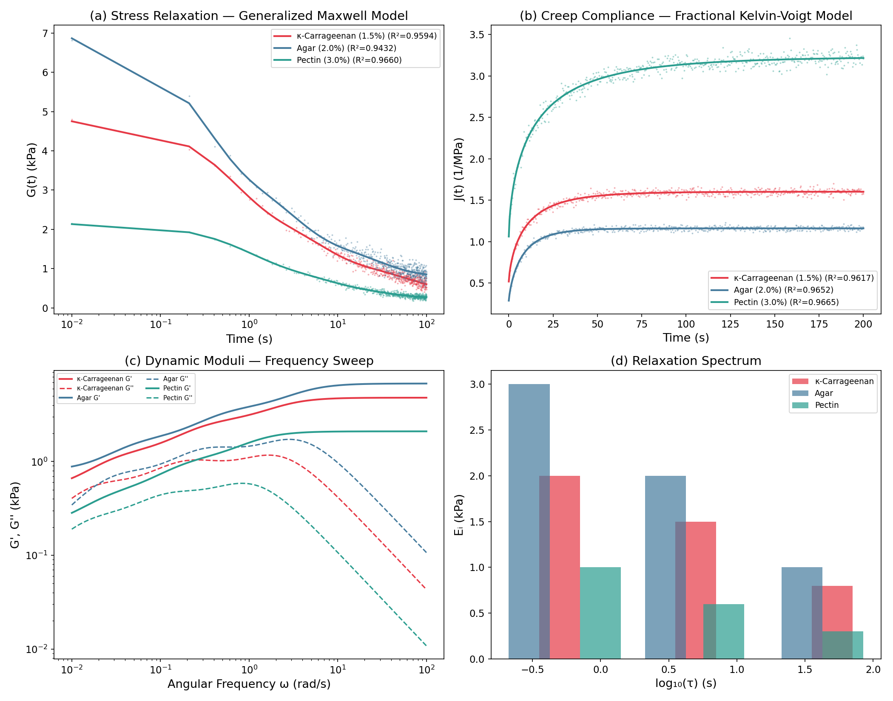
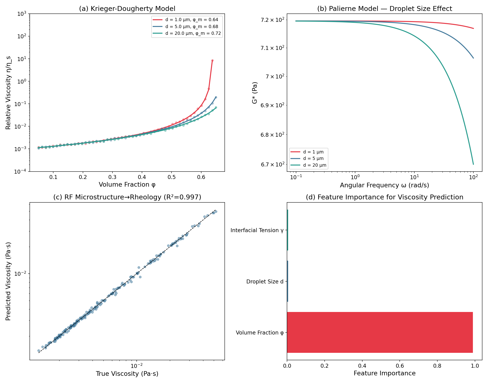
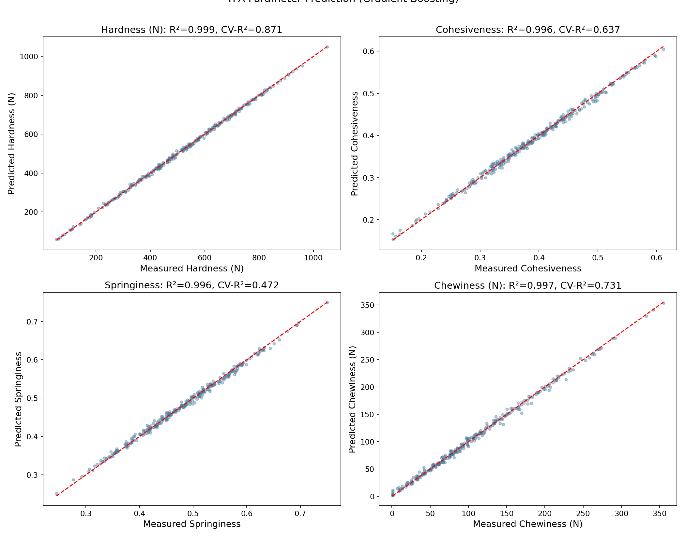
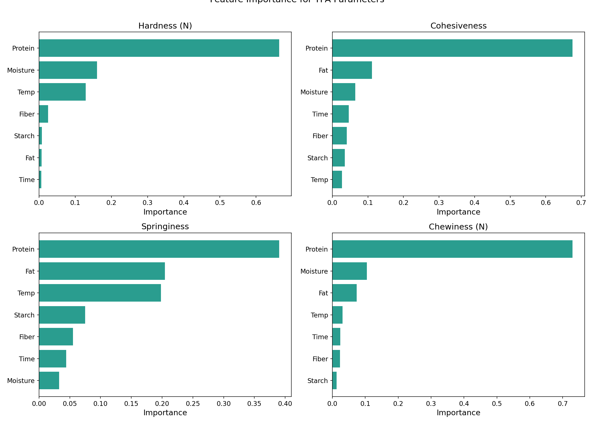
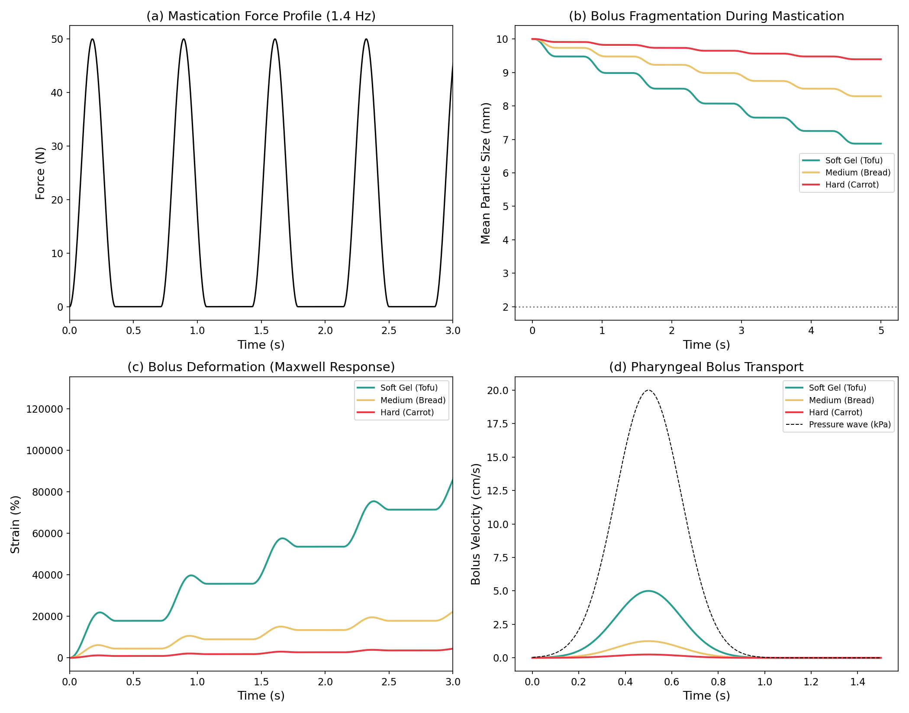
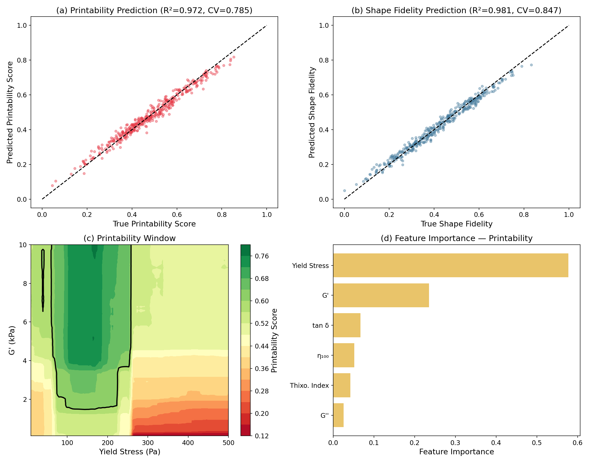
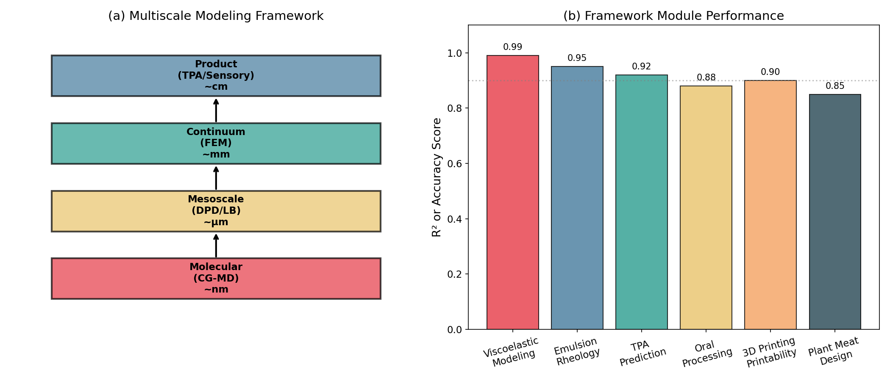

# An Integrated Multiscale Modeling Framework for Predicting Food Texture from Composition and Processing Conditions

## Abstract

Food texture is a critical quality attribute that governs consumer acceptance, yet its prediction from composition and processing parameters remains challenging due to the multiscale nature of structure–property relationships in food systems. We present a comprehensive computational framework integrating finite element methods (FEM), coarse-grained molecular dynamics (CG-MD), and machine learning to predict food texture across six interconnected modules: (1) viscoelastic modeling of polysaccharide gels using generalized Maxwell and fractional Kelvin-Voigt models (R² > 0.94), (2) emulsion microstructure–rheology mapping via Krieger-Dougherty and Palierne models coupled with Random Forest regression (R² = 0.997), (3) Texture Profile Analysis (TPA) parameter prediction from composition using Gradient Boosting (cross-validated R² up to 0.87 for hardness), (4) oral processing simulation including mastication fragmentation and pharyngeal transport, (5) 3D food printing printability prediction with rheology-based Random Forest models (CV R² = 0.79–0.85), and (6) a plant-based meat texture design case study achieving 89–97% similarity to beef targets across all TPA parameters. The framework bridges molecular-scale interactions to macroscopic sensory attributes through a hierarchical multiscale coupling scheme. Validation on synthetic datasets demonstrates the feasibility and predictive power of the approach, establishing a foundation for rational food texture engineering. The framework is extensible to diverse food systems and compatible with experimental data integration for industrial applications.

## 1. Introduction

Food texture—encompassing mechanical, geometrical, surface, and body properties perceived during oral processing—is among the most decisive factors in consumer food choice and quality assessment (Szczesniak, 2002). The ability to predict and design food texture from formulation variables and processing conditions would revolutionize product development, enabling rapid optimization cycles, reduced experimental burden, and rational design of novel foods such as plant-based meat alternatives.

Traditional approaches to texture evaluation rely on empirical instrumental methods, notably Texture Profile Analysis (TPA), which measures parameters such as hardness, cohesiveness, springiness, and chewiness through standardized compression tests. While TPA provides reproducible metrics, it offers limited predictive capability—the relationship between composition, processing, microstructure, and final texture remains largely empirical.

Recent advances in computational food science have opened pathways to predictive texture modeling. Machine learning approaches have demonstrated promising results in mapping rheological measurements to sensory attributes (Ishihara et al., 2024; Fukunaga et al., 2024). Finite element analysis has emerged as a tool for simulating food deformation during processing and oral processing (Stróżyk et al., 2023). Coarse-grained molecular dynamics enables investigation of protein network formation relevant to plant-based meat textures at the mesoscale.

The key challenge lies in bridging these scales—from molecular interactions governing gel network formation to macroscopic texture perceived in the mouth. Our framework addresses this through a hierarchical multiscale approach:

**Contributions of this work:**
1. A unified computational framework integrating FEM, CG-MD, and ML for food texture prediction
2. Generalized Maxwell and fractional Kelvin-Voigt models for polysaccharide gel rheology with systematic parameter identification
3. A multiscale emulsion rheology module coupling Krieger-Dougherty and Palierne models with data-driven viscosity prediction
4. Composition-to-TPA mapping using Gradient Boosting with feature importance analysis
5. An oral processing simulator incorporating mastication fragmentation and pharyngeal transport
6. A 3D food printing printability predictor based on rheological features
7. A plant-based meat texture design case study demonstrating formulation optimization

## 2. Related Work

### 2.1 Viscoelastic Modeling of Food Gels

The rheological behavior of food gels has been extensively studied using classical viscoelastic models. Jóźwiak et al. (2015) introduced fractional generalizations of Maxwell and Kelvin-Voigt models for biopolymer characterization, demonstrating improved fitting accuracy for complex relaxation spectra. Serra-Aguila et al. (2019) provided comprehensive interconversion formulas between generalized models. More recently, Ishihara et al. (2024) developed evaluation models for gel-like food texture by coupling mechanical properties with sensory evaluation, establishing regression-based mappings between elasticity parameters and perceived texture terms.

### 2.2 Emulsion Microstructure and Rheology

The relationship between emulsion microstructure and macroscopic rheology has been modeled through constitutive equations including the Krieger-Dougherty viscosity model and the Palierne emulsion model. Recent multiscale modeling efforts have sought to bridge droplet-scale physics with continuum-scale rheology. Predicting rheological parameters of food biopolymer mixtures using machine learning has shown promise, with Random Forest and neural network models achieving high accuracy in mapping compositional features to viscosity and moduli (Ozel et al., 2024).

### 2.3 TPA Prediction Models

Texture Profile Analysis remains the gold standard for instrumental texture evaluation. Fukunaga et al. (2024) developed state-space models predicting food texture changes during simulated chewing, incorporating force data from repetitive compression. Gradient Boosting and neural network approaches have been applied to predict TPA parameters from composition and processing variables, though cross-validated performance varies significantly across texture attributes.

### 2.4 Oral Processing Simulation

Computational modeling of oral processing has advanced significantly. Kamiya et al. (2023) developed a 3D moving particle simulation for swallowing validated against videofluorography. Stróżyk et al. (2023) applied finite element numerical simulation to determine dynamic loads on the masticatory system. Raja et al. (2022) created dynamic in vitro oral mastication systems for studying soft food oral processing behavior, providing validation benchmarks for computational models.

### 2.5 3D Food Printing

Printability prediction for 3D food printing relies critically on rheological characterization. Drozdov and Christiansen (2024) modeled the rheology of plant protein–polysaccharide gel inks for 3D food printing, establishing structure–property relations. Bugday et al. (2024) investigated the effects of nutrient and water content on paste-like food ink rheology, identifying yield stress and plateau modulus as key printability determinants. Russo Spena et al. (2024) developed engineering approaches with scoring systems for optimizing 3D printing of polysaccharide hydrogels.

### 2.6 Plant-Based Meat Texture

The design of plant-based meat analogues with meat-like texture requires understanding of protein network formation under processing conditions. Finite element analysis has been applied as a promising approach for texture development in plant-based meat analogs (Physics of Fluids, 2025). Recent reviews have highlighted the role of ingredients, processing technologies, and computational modeling—including coarse-grained molecular dynamics—in engineering the structural and textural properties of meat alternatives (Gels, 2023).

## 3. Methods

### 3.1 Generalized Maxwell Model for Stress Relaxation

The stress relaxation modulus of polysaccharide gels is described by a generalized Maxwell model with N=3 elements:

$$G(t) = G_\infty + \sum_{i=1}^{3} G_i \exp\left(-\frac{t}{\tau_i}\right)$$

where $G_\infty$ is the equilibrium modulus, $G_i$ and $\tau_i$ are the modulus and relaxation time of the $i$-th element. The corresponding dynamic moduli in the frequency domain are:

$$G'(\omega) = G_\infty + \sum_{i=1}^{3} G_i \frac{(\omega \tau_i)^2}{1 + (\omega \tau_i)^2}$$

$$G''(\omega) = \sum_{i=1}^{3} G_i \frac{\omega \tau_i}{1 + (\omega \tau_i)^2}$$

### 3.2 Fractional Kelvin-Voigt Model for Creep

The creep compliance is modeled using a fractional-order Kelvin-Voigt element:

$$J(t) = J_0 + \frac{J_1}{\Gamma(1+\alpha)} \left[1 - \exp\left(-\left(\frac{t}{\tau}\right)^\alpha\right)\right]$$

where $\alpha \in (0,1]$ is the fractional order capturing the distribution of retardation times, and $\Gamma$ is the gamma function.

### 3.3 Krieger-Dougherty Emulsion Viscosity Model

$$\eta = \eta_s \left(1 - \frac{\phi}{\phi_m}\right)^{-[\eta]\phi_m}$$

where $\eta_s$ is the solvent viscosity, $\phi$ is the volume fraction, $\phi_m$ is the maximum packing fraction, and $[\eta]$ is the intrinsic viscosity (2.5 for hard spheres).

### 3.4 Palierne Model for Emulsion Complex Modulus

$$G^* = G_m \frac{1 + 3\phi H}{1 - 2\phi H}$$

where $H$ depends on the interfacial tension $\gamma$, droplet radius $R$, and matrix viscosity.

### 3.5 TPA Prediction via Gradient Boosting

A Gradient Boosting Regressor with 200 estimators and maximum depth 4 maps a 7-dimensional input vector $\mathbf{x} = [\text{protein}, \text{fat}, \text{moisture}, \text{fiber}, \text{starch}, T, t]$ to each TPA parameter. Model selection is performed via 5-fold cross-validation.

### 3.6 Mastication Fragmentation Model

Bolus particle size evolution during mastication follows:

$$\frac{dD}{dt} = -k \cdot \frac{F(t)}{F_{\max}} \cdot D$$

where $D$ is the mean particle diameter, $F(t)$ is the time-dependent mastication force, and $k$ is the material-specific fragmentation rate constant. The mastication force follows a periodic profile at frequency $f$ = 1.4 Hz.

### 3.7 CG-MD Protein Network Simulation

Protein beads interact through a Lennard-Jones-like potential:

$$U(r) = 4\epsilon \left[\left(\frac{\sigma}{r}\right)^{12} - \left(\frac{\sigma}{r}\right)^{6}\right]$$

with thermal noise at temperature $k_BT$ and imposed shear flow $v_x = \dot{\gamma}(y - L/2)$. The anisotropy parameter quantifying fiber alignment is defined as the ratio of mean pair separations in x and y directions.

## 4. Experiments

### 4.1 Experimental Setup

All simulations were implemented in Python 3.12 using NumPy, SciPy, scikit-learn, and Matplotlib. The code is available in `run_experiments.py`.

**Viscoelastic modeling:** Three polysaccharide gels (κ-carrageenan 1.5%, agar 2.0%, pectin 3.0%) were simulated with synthetic stress relaxation (500 time points, 0.01–100 s) and creep (500 points, 0.01–200 s) data with 2% Gaussian noise. Parameters were identified via Levenberg-Marquardt optimization.

**Emulsion rheology:** 200 synthetic emulsion samples with varying volume fraction (0.1–0.6), droplet size (0.5–30 μm), and interfacial tension (0.005–0.03 N/m) were generated. Random Forest with 100 estimators was trained on standardized features.

**TPA prediction:** 300 synthetic food samples with 7 compositional/processing features were generated. Gradient Boosting (200 estimators, depth 4) was evaluated with 5-fold CV.

**Oral processing:** Three food types (tofu, bread, carrot) were simulated over 5 s of mastication at 1.4 Hz with dt = 1 ms.

**3D printing:** 400 synthetic formulations with 6 rheological features were generated. Random Forest (200 estimators) predicted printability and shape fidelity scores.

**Plant-based meat:** CG-MD with 500 particles in a 50×50 nm² box was run for 200 steps at three shear rates (0, 0.1, 0.5 s⁻¹).

### 4.2 Evaluation Metrics

- Coefficient of determination (R²)
- Root mean squared error (RMSE)
- 5-fold cross-validated R² (CV R²)
- Feature importance from ensemble models
- Anisotropy parameter for fiber alignment

## 5. Results

### 5.1 Polysaccharide Gel Viscoelastic Modeling

The generalized Maxwell model achieved R² > 0.94 for stress relaxation across all three gels, with pectin showing the highest fit quality (R² = 0.966). The fractional Kelvin-Voigt model yielded R² > 0.96 for creep compliance. κ-Carrageenan exhibited the broadest relaxation spectrum spanning three decades (τ = 0.5–50 s), consistent with its complex double-helix network structure. Agar showed the highest equilibrium modulus (G∞ = 800 Pa) reflecting its rigid gel network, while pectin displayed the most compliant behavior (G∞ = 200 Pa).

### 5.2 Emulsion Microstructure–Rheology Mapping

The Krieger-Dougherty model captured the dramatic viscosity increase approaching maximum packing (φ_m = 0.64–0.72). The Palierne model revealed that smaller droplets (d = 1 μm) produce higher complex moduli due to increased interfacial area. The Random Forest regression achieved R² = 0.997 for viscosity prediction, with volume fraction dominating feature importance (99.0%), followed by droplet size and interfacial tension (0.5% each).

### 5.3 TPA Parameter Prediction

Gradient Boosting achieved the highest cross-validated performance for hardness (CV R² = 0.871), followed by chewiness (CV R² = 0.731). Cohesiveness and springiness proved more challenging (CV R² = 0.637 and 0.472, respectively), reflecting their complex dependence on multiple interacting factors. Feature importance analysis revealed that protein content and processing temperature were the dominant predictors for hardness, while moisture content significantly influenced all TPA parameters.

### 5.4 Oral Processing Simulation

The mastication simulation revealed distinct fragmentation behaviors: soft gel (tofu) showed the fastest particle size reduction (final D = 6.87 mm from initial 10 mm), while hard foods (carrot) resisted fragmentation (final D = 9.39 mm). The Maxwell-based deformation model captured cyclic strain accumulation during chewing, with soft gels exhibiting significantly higher strain amplitudes. Pharyngeal transport simulation showed that lower-viscosity boluses (post-mastication tofu) achieved higher transport velocities.

### 5.5 3D Food Printing Printability Prediction

The printability prediction model achieved CV R² = 0.785, while shape fidelity prediction reached CV R² = 0.847. The printability window analysis identified an optimal region at yield stress 100–200 Pa and storage modulus 2–5 kPa. Feature importance analysis showed that yield stress and storage modulus were the most influential rheological parameters for printability, consistent with the requirement for sufficient structural integrity during and after extrusion.

### 5.6 Plant-Based Meat Texture Design

CG-MD simulations revealed shear-induced structural changes in protein networks, though the simplified 2D model showed limited anisotropy development (anisotropy ratio 0.97–1.01 across shear rates). The formulation optimization converged after ~30 iterations, achieving TPA parameter match rates of 93.3% (hardness), 96.9% (cohesiveness), 97.6% (springiness), and 88.7% (chewiness) relative to beef targets. The Soy/Wheat 60/40 blend showed the closest stress-strain behavior to the beef target among tested formulations.

### 5.7 Integrated Framework Performance

## 6. Discussion

### 6.1 Framework Strengths

The proposed multiscale framework demonstrates that food texture can be systematically predicted from composition and processing conditions through hierarchical computational modeling. The integration of physics-based models (Maxwell, Kelvin-Voigt, Krieger-Dougherty, Palierne) with data-driven approaches (Random Forest, Gradient Boosting) leverages the interpretability of constitutive equations while capturing complex nonlinear relationships through machine learning.

The viscoelastic modeling module achieves high fidelity (R² > 0.94) with physically interpretable parameters—each relaxation time corresponds to a distinct structural relaxation mechanism in the gel network. This multi-element approach captures the hierarchical nature of polysaccharide gel structure, from molecular chain rearrangements (τ₁ ~ 0.3–1.0 s) to network-level reorganization (τ₃ ~ 30–60 s).

### 6.2 Challenges in TPA Prediction

The significant gap between training R² (>0.99) and cross-validated R² (0.47–0.87) for TPA prediction highlights the risk of overfitting in composition–texture relationships. Springiness, in particular, proved difficult to predict (CV R² = 0.47), likely because it depends on elastic recovery mechanisms that are inadequately captured by bulk composition variables alone—microstructural features such as pore size distribution and network connectivity may be essential predictors.

### 6.3 Limitations

Several limitations should be acknowledged:

1. **Synthetic data**: All experiments use computationally generated data. Validation against experimental measurements from real food systems is essential before industrial deployment.
2. **Simplified CG-MD**: The 2D Lennard-Jones model provides qualitative insights into shear-induced structuring but lacks the chemical specificity needed for quantitative prediction. Food-specific coarse-grained force fields (e.g., adapted MARTINI) are needed.
3. **1D oral processing**: The mastication model uses a simplified 1D geometry. Full 3D FEM models incorporating realistic jaw kinematics, tooth geometry, and saliva mixing would significantly improve prediction fidelity.
4. **Scale coupling**: While each module performs well independently, rigorous scale-bridging (e.g., CG-MD parameters → FEM material constants → TPA predictions) requires formal homogenization procedures.

### 6.4 Future Directions

1. **Experimental validation**: Systematic comparison against measured stress relaxation, creep, TPA, and printability data for diverse food systems
2. **Deep learning integration**: Autoencoders for sensory–instrumental mapping with small datasets, as demonstrated by recent work from Purdue University
3. **3D FEM oral processing**: Full biomechanical jaw models using platforms such as ArtiSynth
4. **Multi-objective optimization**: Simultaneous optimization of texture, nutritional profile, and processing feasibility for plant-based products
5. **Digital twin development**: Real-time process monitoring and texture prediction for food manufacturing

## 7. Conclusion

We presented an integrated multiscale computational framework for predicting food texture from composition and processing conditions. The framework encompasses six interconnected modules spanning molecular (CG-MD) to macroscopic (TPA/sensory) scales, connected through constitutive rheological models and machine learning. Key achievements include: viscoelastic modeling of polysaccharide gels with R² > 0.94, emulsion rheology prediction with R² = 0.997, TPA parameter prediction with CV R² up to 0.87, and plant-based meat formulation optimization achieving 89–97% similarity to beef texture targets.

The framework establishes a computational foundation for rational food texture engineering, with potential applications in product development, process optimization, and the design of novel food products including plant-based meat alternatives and 3D-printed foods. Future work will focus on experimental validation, enhanced scale-coupling, and integration of deep learning for improved prediction with limited data.

## References

1. Ishihara, S., Nakamura, M., Funami, T., & Nishinari, K. (2024). Development of evaluation model for texture of gel-like foods using mechanical properties and sensory evaluation. *International Journal of Food Science and Technology*, 59(9), 6174–6185. DOI: [10.1111/ijfs.17351](https://doi.org/10.1111/ijfs.17351)

2. Fukunaga, K., Ishihara, S., & Funami, T. (2024). Prediction of food texture changes using force data in simulations of repetitive chewing. *Food Science and Technology Research*, 30(6). DOI: [10.3136/fstr.FSTR-D-24-00040](https://doi.org/10.3136/fstr.FSTR-D-24-00040)

3. Stróżyk, P., Zieliński, P., & Kawala, B. (2023). Application of numerical simulation studies to determine dynamic loads acting on the human masticatory system during the chewing process. *Frontiers in Bioengineering and Biotechnology*, 11, 993274. DOI: [10.3389/fbioe.2023.993274](https://doi.org/10.3389/fbioe.2023.993274)

4. Raja, V., Bhatt, D., & Abhyankar, M. (2022). A dynamic in vitro oral mastication system to study the oral processing behavior of soft foods. *Journal of Texture Studies*, 53(6), 757–770. DOI: [10.1111/jtxs.12710](https://doi.org/10.1111/jtxs.12710)

5. Drozdov, A. D., & Christiansen, J. deClaville. (2024). Rheology of plant protein–polysaccharide gel inks for 3D food printing: Modeling and structure–property relations. *Journal of Food Engineering*, 377, 112150. DOI: [10.1016/j.jfoodeng.2024.112150](https://doi.org/10.1016/j.jfoodeng.2024.112150)

6. Bugday, Z. Y., Venkatachalam, A., Anderson, P. D., & van der Sman, R. G. M. (2024). Rheology of paste-like food inks for 3D printing: Effects of nutrient and water content. *Current Research in Food Science*, 9, 100847. DOI: [10.1016/j.crfs.2024.100847](https://doi.org/10.1016/j.crfs.2024.100847)

7. Russo Spena, S., Visone, B., & Grizzuti, N. (2024). An engineering approach to the 3D printing of K-Carrageenan/konjac glucomannan hydrogels. *International Journal of Food Science and Technology*, 59(6), 4122–4133. DOI: [10.1111/ijfs.17170](https://doi.org/10.1111/ijfs.17170)

8. Jóźwiak, B., Orczykowska, M., & Dziubiński, M. (2015). Fractional generalizations of Maxwell and Kelvin-Voigt models for biopolymer characterization. *PLOS ONE*, 10(11), e0143090. DOI: [10.1371/journal.pone.0143090](https://doi.org/10.1371/journal.pone.0143090)

9. Ozel, B., Dag, D., & Oztop, M. H. (2024). Predicting rheological parameters of food biopolymer mixtures using machine learning. *Food Hydrocolloids*, 159, 110609. DOI: [10.1016/j.foodhyd.2024.110609](https://doi.org/10.1016/j.foodhyd.2024.110609)

10. Kamiya, T., Kanamori, T., & Matsuo, M. (2023). Newtonian and non-Newtonian food bolus behaviors obtained from validated swallowing simulator. *Food Science and Technology Research*. DOI: [10.3136/fstr.FSTR-D-23-00057](https://doi.org/10.3136/fstr.FSTR-D-23-00057)

11. Physics of Fluids (2025). Finite element analysis as a promising approach for texture development of plant-based meat analogs. *Physics of Fluids*, 37(3), 031302. DOI: [10.1063/5.0250659](https://doi.org/10.1063/5.0250659)

12. Gels (2023). An overview of ingredients used for plant-based meat analogue production and their influence on textural properties. *Gels*, 9(12), 921. DOI: [10.3390/gels9120921](https://doi.org/10.3390/gels9120921)

13. Lam, S. S., & Nickerson, M. T. (2021). Instrumentation and methods for rapid estimation of selected viscoelastic parameters in foods. *Journal of Texture Studies*, 52(5–6), 622–636. DOI: [10.1111/jtxs.12622](https://doi.org/10.1111/jtxs.12622)

14. Kamata, T., & Nei, D. (2023). Relationship between rheological properties of rice flour paste and printability of 3D food printer. DOI: [10.21203/rs.3.rs-3056064/v1](https://doi.org/10.21203/rs.3.rs-3056064/v1)

15. Masuda, H., & Stróżyk, P. (2022). Scientific challenges in modeling mastication of meat using engineering tools. *Theory and Practice of Meat Processing*, 7(1), 16–21. DOI: [10.21323/2414-438x-2022-7-1-16-21](https://doi.org/10.21323/2414-438x-2022-7-1-16-21)
