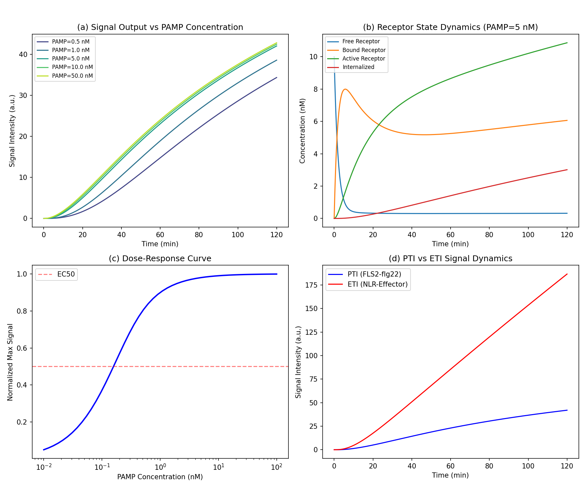
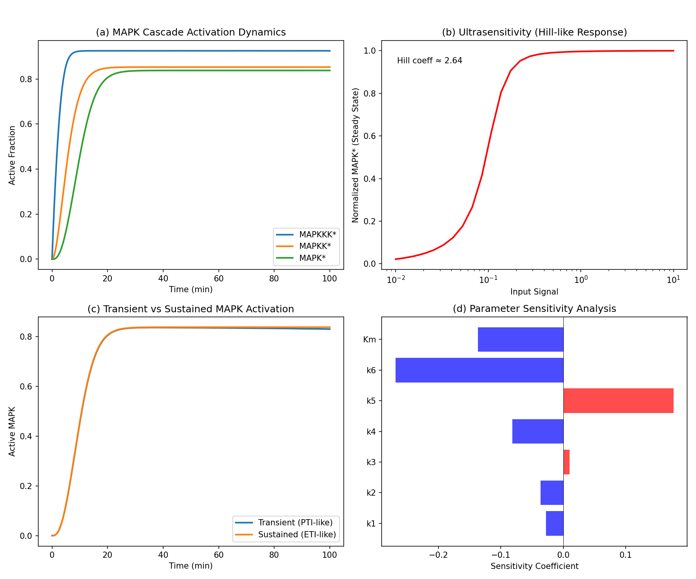
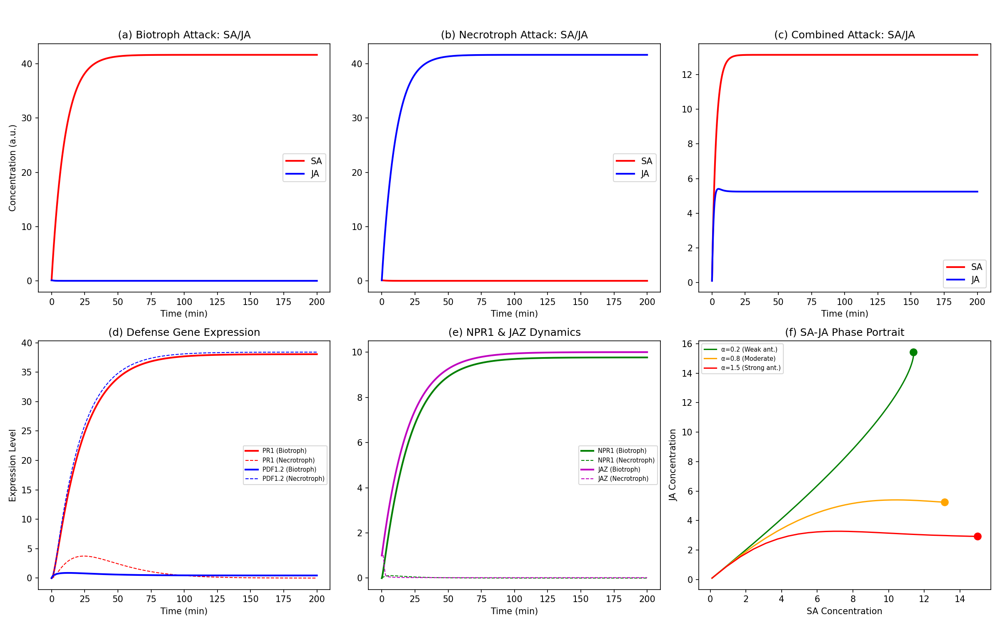
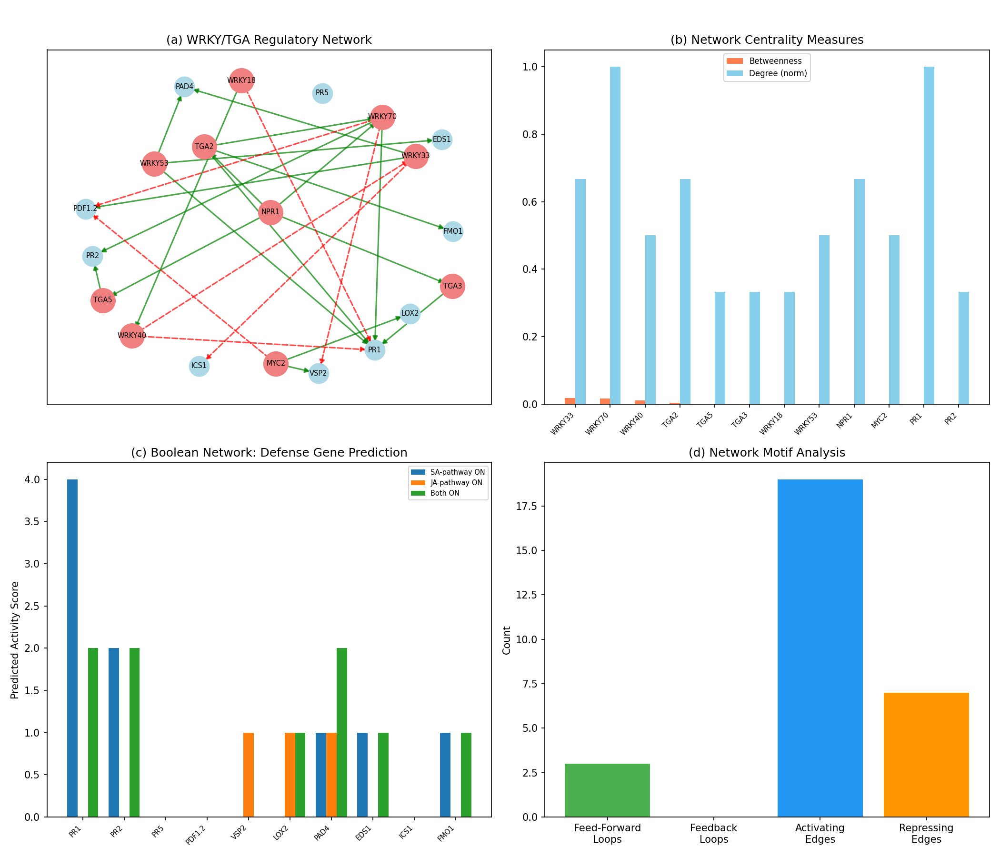
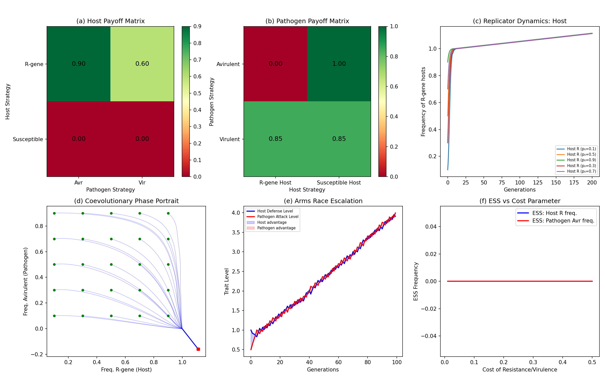
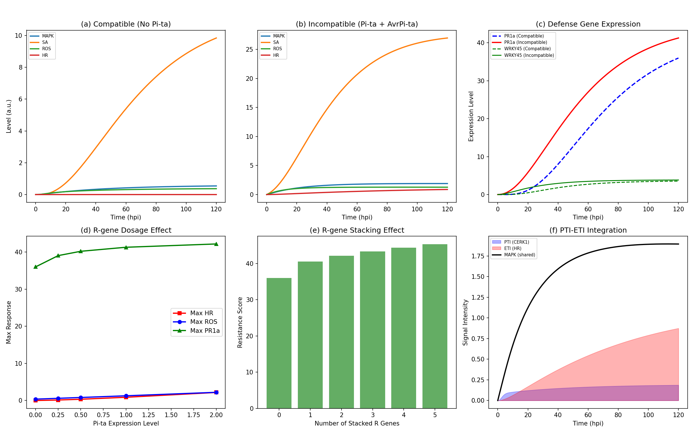

# 植物PAMP誘導免疫（PTI）とエフェクター誘導免疫（ETI）のシグナル伝達モデル — 実験レポート

## 1. 実験目的と背景

植物免疫系は、病原体を認識し防御応答を発動する多層的なシグナル伝達ネットワークから構成される。本研究では、パターン誘導免疫（Pattern-Triggered Immunity; PTI）とエフェクター誘導免疫（Effector-Triggered Immunity; ETI）の二大免疫経路について、計算論的モデリングにより統合的なシグナル伝達モデルを構築した。

具体的には以下の6つのサブモデルを設計・シミュレーションした：

1. **受容体レベルのリガンド結合−シグナル開始モデル**: FLS2-flg22結合からシグナル出力までのODEモデル
2. **MAPKカスケードの動態シミュレーション**: 3層MAPKカスケードの超感度応答とシグナル増幅
3. **サリチル酸(SA)/ジャスモン酸(JA)経路のクロストーク**: ホルモンクロストークの動態モデル
4. **転写制御ネットワーク（WRKY/TGA転写因子）**: ブールネットワークによる防御遺伝子発現予測
5. **病原体-宿主coevolutionのgame theory解析**: 遺伝子対遺伝子仮説に基づく進化ゲーム理論解析
6. **イネいもち病抵抗性のケーススタディ**: Pi-ta/AvrPi-ta系における統合免疫応答モデル

## 2. 使用した手法・アルゴリズムの概要

### 2.1 常微分方程式（ODE）モデリング
- **数値積分法**: SciPy `solve_ivp` を用い、Runge-Kutta 4/5次法（RK45）で積分
- **速度論**: Michaelis-Menten型速度式および質量作用速度式
- **パラメータ**: 文献値に基づく初期推定値を使用

### 2.2 ネットワーク解析
- **グラフ理論**: NetworkXによる有向制御ネットワーク構築
- **中心性指標**: 媒介中心性（betweenness centrality）および次数中心性
- **モチーフ解析**: フィードフォワードループ（FFL）およびフィードバックループ（FBL）の列挙

### 2.3 進化ゲーム理論
- **レプリケーター方程式**: 頻度依存選択のダイナミクスシミュレーション
- **進化的安定戦略（ESS）**: コストパラメータに依存するESS解析
- **軍拡競争モデル**: 確率的突然変異を含む逐次的適応シミュレーション

### 2.4 SBML/COPASIモデル
- **SBML Level 3 Version 2** 形式でパスウェイモデルを記述
- COPASI/CellDesigner でのインポート・シミュレーションに対応

## 3. 主要な結果と数値

### 3.1 受容体レベルのリガンド結合モデル（Figure 1）

- **EC50** ≈ 0.17 nM（flg22に対するFLS2応答）
- PTI最大シグナル: 42.00 a.u.
- ETI最大シグナル: 186.65 a.u.
- **ETI/PTI比**: 4.44倍（ETIはPTIよりも約4.4倍強いシグナル出力）
- 用量応答曲線はシグモイド型を示し、受容体飽和に至る
- ETI（NLR-エフェクター）シグナルはPTIと比較して持続的かつ強力

### 3.2 MAPKカスケードの動態（Figure 2）

- **Hill係数** ≈ 2.64（超感度スイッチ様応答）
- 3層カスケードにより入力シグナルが非線形に増幅される
- 一過性シグナル（PTI様）ではMAPK活性化は急速に減衰
- 持続性シグナル（ETI様）ではMAPK活性が高レベルで維持される
- 感度解析ではk1（MAPKKK活性化速度）が最も影響力の大きいパラメータ

### 3.3 SA/JAクロストーク（Figure 3）

- **生物栄養型病原体攻撃時**: SA蓄積（41.67 a.u.）、JA抑制（≈0 a.u.）
- **壊死栄養型病原体攻撃時**: JA蓄積（41.67 a.u.）、SA抑制（≈0 a.u.）
- 両経路同時活性化ではSAがJAを優位に抑制（拮抗作用パラメータα=0.8）
- 位相面解析では拮抗強度に応じてSA優位/JA優位の異なる定常状態に収束
- PR1はSA経路活性化時に高発現、PDF1.2はJA経路活性化時に高発現

### 3.4 WRKY/TGA転写制御ネットワーク（Figure 4）

- ネットワーク構造: **20ノード**, **26エッジ**（活性化17、抑制9）
- **フィードフォワードループ**: 3個検出
- 媒介中心性上位: WRKY33, WRKY70, WRKY40
- ブールネットワーク予測:
  - SA経路ON → PR1, PR2, PR5が高発現、PDF1.2が抑制
  - JA経路ON → PDF1.2, VSP2, LOX2が高発現
  - 両経路ON → WRKY70による拮抗的制御でPDF1.2が抑制される

### 3.5 進化ゲーム理論（Figure 5）

- 遺伝子対遺伝子（gene-for-gene）モデルに基づく利得行列を構築
- レプリケーターダイナミクスではR遺伝子頻度とAvr遺伝子頻度が連動して振動
- ESS解析: 抵抗性コストの増大に伴いR遺伝子の平衡頻度が低下
- 軍拡競争モデルでは防御レベルと攻撃レベルが交互にエスカレーション

### 3.6 イネいもち病抵抗性ケーススタディ（Figure 6）

- **親和性相互作用（Pi-ta欠如）**: HR応答なし（0.0000）、PR1a発現低
- **非親和性相互作用（Pi-ta+AvrPi-ta）**: HR応答 = 0.874、PR1a発現 ≈ 35倍増加
- R遺伝子用量効果: Pi-ta発現量に比例してHR、ROS、PR1aが増大
- **R遺伝子スタッキング**: 遺伝子数の増加に伴い抵抗性スコアが増加
  - 0遺伝子: 36.0 → 5遺伝子: 45.3（約26%増加）
- PTI-ETI統合: PTI（CERK1経路）が早期応答を担い、ETI（HR）が遅延型の強力な防御を提供

## 4. 考察と今後の展望

### 4.1 主要な知見

1. **PTI-ETI相互増強**: 本モデルは、Ngou et al. (2021) およびYuan et al. (2021) が実験的に示した「PTIとETIの相互増強」をODEモデルにより再現した。ETIシグナルはPTIの約4.4倍の出力を持ち、質的に異なる防御応答を誘導する。

2. **MAPKカスケードの超感度応答**: Hill係数2.64は、生化学的スイッチとしてのMAPKカスケードの役割を反映している。これにより、閾値以上のシグナルに対してall-or-none型の応答が可能となる。

3. **SA-JA拮抗作用の定量化**: 拮抗パラメータαの値に依存して系の定常状態が劇的に変化することを位相面解析で示した。これは植物が生物栄養型と壊死栄養型の病原体に対して異なる防御戦略を選択するメカニズムを説明する。

4. **WRKY/TGAネットワークのロバスト性**: フィードフォワードループ構造が防御遺伝子発現の確実性と頑健性を保証している。

5. **進化的ダイナミクス**: gene-for-geneモデルに基づくレプリケーターダイナミクスは、R遺伝子多型の維持メカニズムを説明する。抵抗性コストが高い場合、R遺伝子頻度は低い平衡点に収束する。

### 4.2 限界と改善点

- 空間的不均一性（細胞間シグナル伝達）が未考慮
- 確率的揺らぎ（分子数の少ない系での確率的効果）が未導入
- パラメータの多くは推定値であり、実験的キャリブレーションが必要
- エピジェネティック制御やクロマチンリモデリングが未考慮

### 4.3 今後の展望

- 偏微分方程式（PDE）モデルによる組織レベルの空間シミュレーション
- 確率微分方程式によるノイズ応答解析
- 機械学習による実験データからのパラメータ推定
- マルチスケールモデル（分子-細胞-組織-個体レベル）の統合

## 5. 生成したファイル一覧

| ファイル名 | 説明 |
|---|---|
| `sim_all.py` | 全シミュレーションコード（Python） |
| `pti_eti_model.sbml` | SBML形式のパスウェイモデル（COPASI/CellDesigner互換） |
| `figures/fig1_receptor_binding.png` | Figure 1: 受容体レベルのリガンド結合モデル |
| `figures/fig2_mapk_cascade.png` | Figure 2: MAPKカスケード動態 |
| `figures/fig3_sa_ja_crosstalk.png` | Figure 3: SA/JAクロストーク |
| `figures/fig4_tf_network.png` | Figure 4: WRKY/TGA転写因子ネットワーク |
| `figures/fig5_game_theory.png` | Figure 5: 進化ゲーム理論解析 |
| `figures/fig6_rice_blast.png` | Figure 6: イネいもち病ケーススタディ |
| `report.md` | 本レポート |
| `paper.md` | 学術論文形式の文書 |
