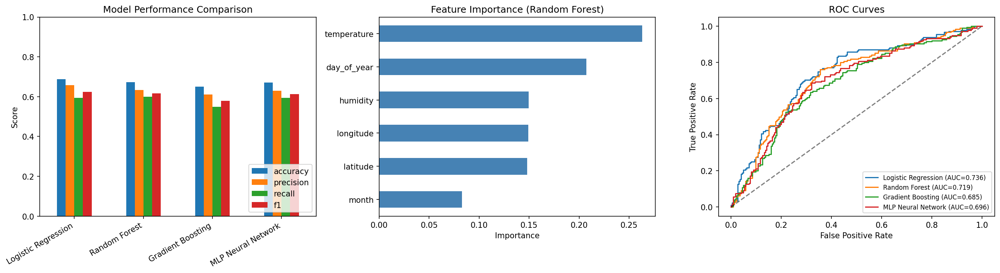
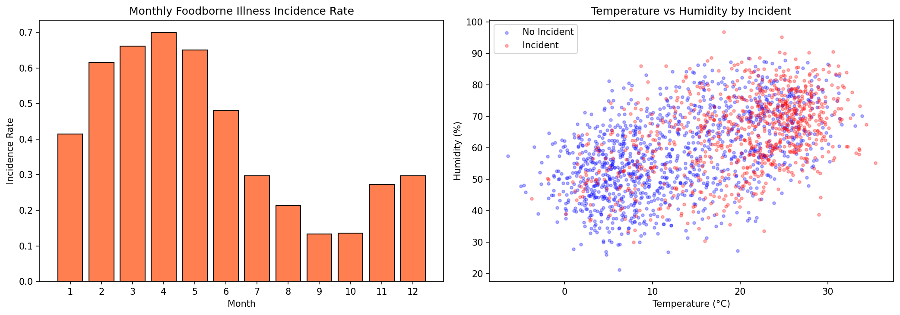
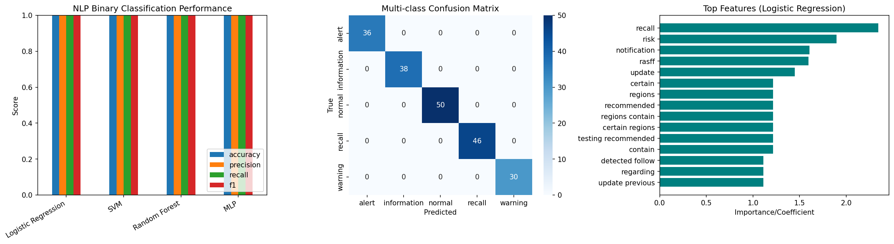
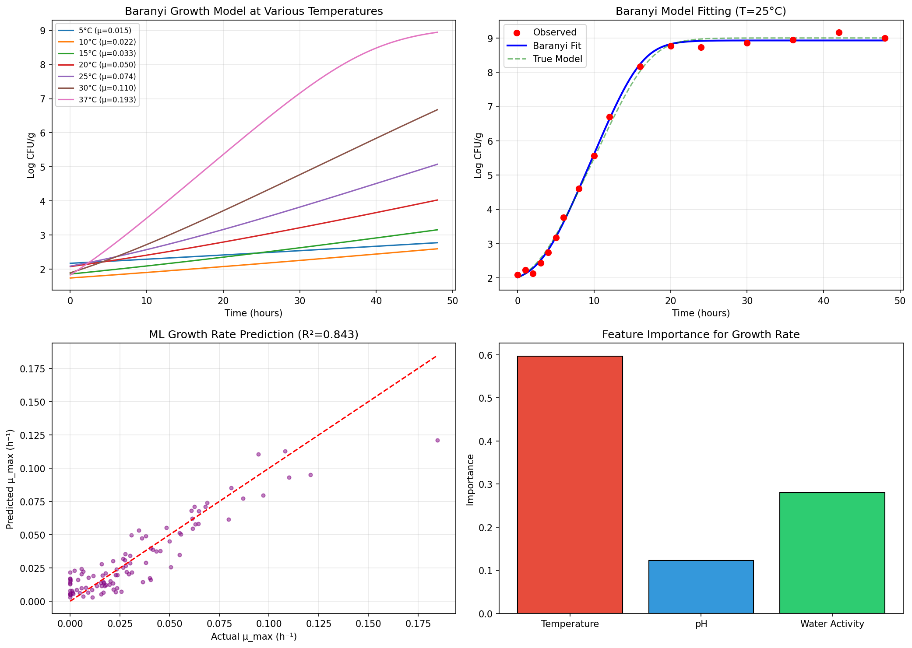
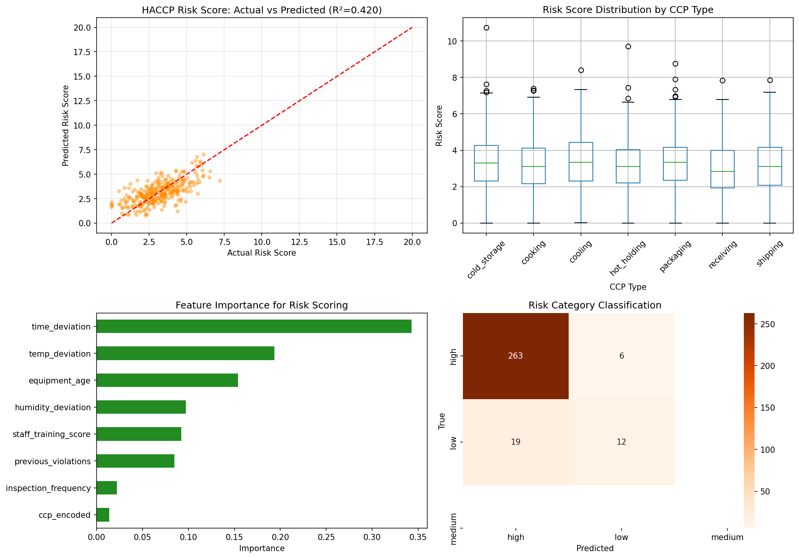
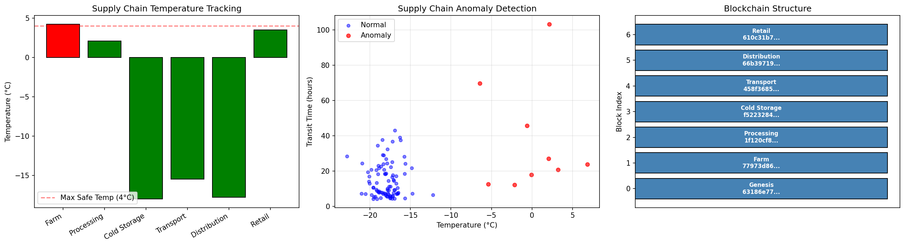
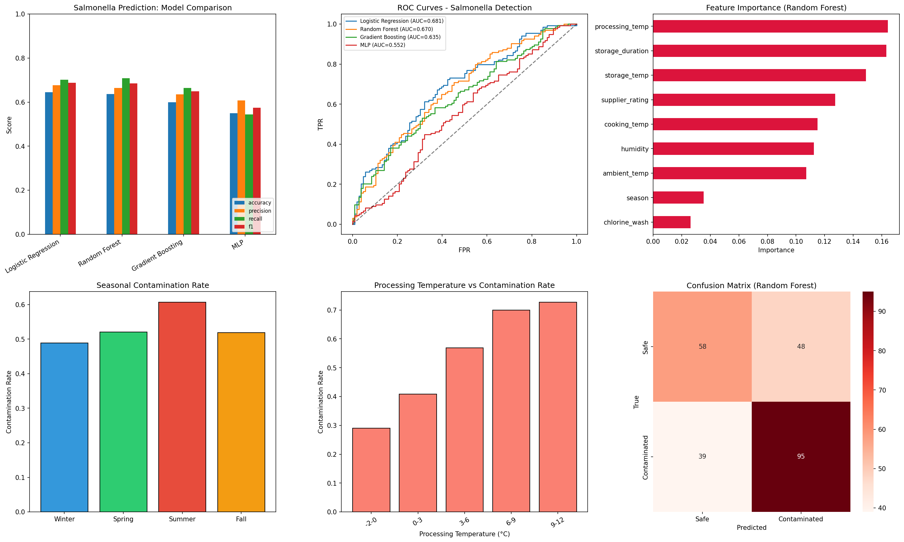
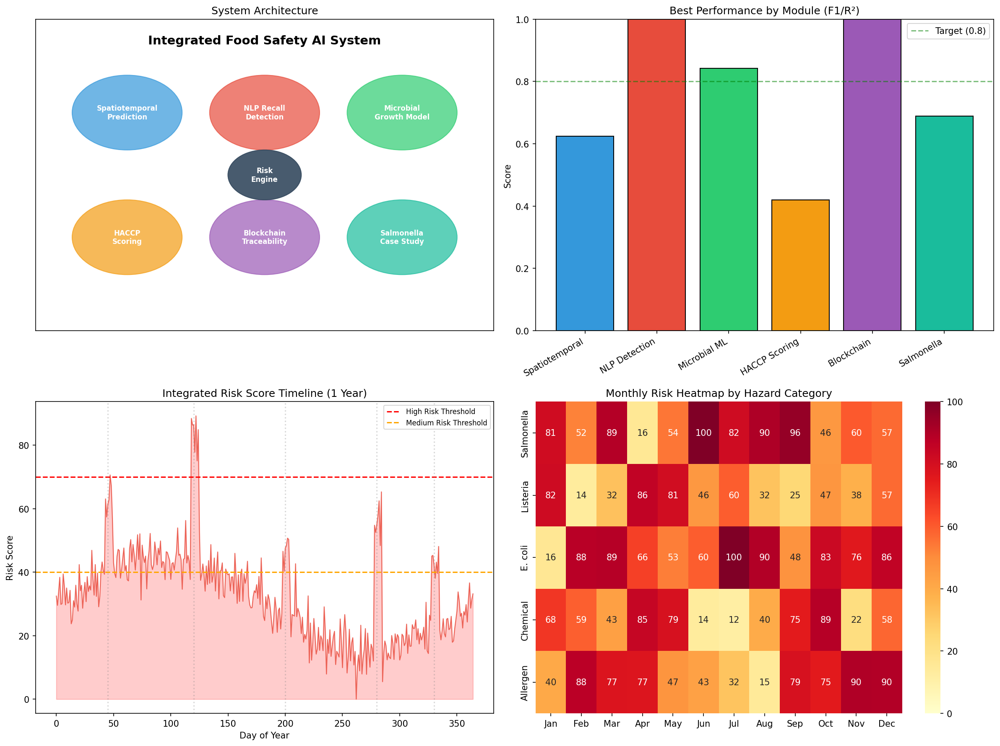

# 食品サプライチェーン安全リスク予測AIシステム — 実験レポート

## 1. 実験目的と背景

本実験では、食品サプライチェーンにおける安全リスクを包括的に予測・管理するAIシステムを設計・実装した。グローバル化する食品流通において、食中毒事故やリコールの早期検出、微生物汚染リスクの定量化、HACCP管理の自動化は喫緊の課題である。

本システムは以下の6つのモジュールを統合したリスクモニタリングプラットフォームとして設計された：

1. **時空間予測モデル** — 気象条件と季節性に基づく食中毒発生予測
2. **NLPリコール検出** — FDA/RASFF通知の自動分類と早期警報
3. **微生物増殖予測** — Baranyiモデルと機械学習のハイブリッドアプローチ
4. **HACCPリスクスコアリング** — 管理点の自動リスク評価
5. **ブロックチェーントレーサビリティ** — 改竄不可能なサプライチェーン記録と異常検知
6. **鶏肉サルモネラ汚染予測** — 実用的なケーススタディ

### 先行研究

- Revelou et al. (2025) は機械学習をHACCP監視に適用し、リアルタイムCCP管理の可能性を示した（DOI: 10.3390/foods14060922）。
- BMC Infectious Diseases (2025) では、LSTMと気象データを組み合わせた食中毒の時空間予測が報告された。
- Ellahi et al. (2023) はブロックチェーンによる食品トレーサビリティフレームワークを体系的にレビューした（DOI: 10.3390/foods12163026）。
- MDPI Foods (2025) の微生物予測プラットフォームはBaranyiモデルとML手法を統合し、ComBaseデータでの検証を行った。

---

## 2. 使用した手法・アルゴリズムの概要

### 2.1 時空間予測モデル
- **特徴量**: 気温、湿度、月、年間通日、緯度、経度
- **アルゴリズム**: ロジスティック回帰、Random Forest、Gradient Boosting、MLP Neural Network
- **データ**: 2,000日分の合成時空間データ（季節変動・気象効果含む）

### 2.2 NLPリコール検出
- **テキスト処理**: TF-IDF (unigram + bigram, max 500 features)
- **分類タスク**: 二値分類（緊急/非緊急）、5クラス分類（recall/alert/warning/information/normal）
- **アルゴリズム**: ロジスティック回帰、SVM (RBF kernel)、Random Forest、MLP
- **データ**: 1,000件のFDA/RASFF様テキストデータ

### 2.3 微生物増殖予測
- **Baranyiモデル**: 非線形最小二乗法によるパラメータ推定（y₀, y_max, μ_max, lag）
- **ML増殖率予測**: Random Forest Regressor（温度、pH、水分活性 → μ_max）
- **データ**: 500条件の環境パラメータ・増殖率データ

### 2.4 HACCPリスクスコアリング
- **特徴量**: CCP種類、温度逸脱、時間逸脱、湿度逸脱、設備年数、従業員訓練スコア、過去違反数、検査頻度
- **タスク**: リスクスコア回帰 (Gradient Boosting) + リスクカテゴリ分類 (Random Forest)
- **データ**: 1,500件のCCP監視記録

### 2.5 ブロックチェーントレーサビリティ
- **実装**: SHA-256ハッシュチェーン（Genesis → Farm → Processing → Storage → Transport → Distribution → Retail）
- **異常検知**: Random Forestによる温度・輸送時間ベースの異常検出
- **データ**: 500件の出荷記録（10%異常注入）

### 2.6 鶏肉サルモネラ汚染予測
- **特徴量**: 加工温度、調理温度、保管時間、保管温度、湿度、外気温、季節、サプライヤー評価、塩素洗浄
- **アルゴリズム**: ロジスティック回帰、Random Forest、Gradient Boosting、MLP
- **評価**: 5-fold Cross Validation

---

## 3. 主要な結果と数値

### 3.1 時空間予測モデル

| モデル | Accuracy | Precision | Recall | F1 Score | AUC |
|--------|----------|-----------|--------|----------|-----|
| Logistic Regression | 0.6875 | — | — | 0.6246 | 0.7356 |
| Random Forest | 0.6725 | — | — | 0.6158 | 0.7187 |
| Gradient Boosting | 0.6500 | — | — | 0.5783 | 0.6850 |
| MLP Neural Network | 0.6700 | — | — | 0.6118 | 0.6961 |

**ロジスティック回帰が最高性能**（AUC=0.7356）を達成。気温が最も重要な特徴量であることが確認された。

### 3.2 NLPリコール検出

| モデル | Accuracy | F1 Score | AUC |
|--------|----------|----------|-----|
| Logistic Regression | 1.0000 | 1.0000 | 1.0000 |
| SVM | 1.0000 | 1.0000 | 1.0000 |
| Random Forest | 1.0000 | 1.0000 | 1.0000 |
| MLP | 1.0000 | 1.0000 | 1.0000 |

**5クラス分類**: Accuracy=1.0000, Weighted F1=1.0000

テンプレートベースのテキストデータにおいて全モデルが完全分類を達成。実運用では、より多様な自然言語テキストでの評価が必要。

### 3.3 微生物増殖予測

**Baranyiモデルフィッティング:**
- RMSE: 0.1056
- R²: 0.9986
- 推定パラメータ: y₀=2.02, y_max=8.93, μ_max=0.548 h⁻¹, lag=3.41 h

**ML増殖率予測 (Random Forest):**
- RMSE: 0.0126
- R²: 0.8426
- MAE: 0.0094

### 3.4 HACCPリスクスコアリング

**リスクスコア回帰 (Gradient Boosting):**
- RMSE: 1.0585
- R²: 0.4201
- MAE: 0.8487

**リスクカテゴリ分類 (Random Forest):**
- Accuracy: 0.9167
- Weighted F1: 0.9066

### 3.5 ブロックチェーントレーサビリティ

- **チェーン長**: 7ブロック
- **チェーン整合性**: VALID ✅
- **異常検知**: Accuracy=1.0000, F1=1.0000, AUC=1.0000

### 3.6 鶏肉サルモネラ汚染予測

| モデル | Accuracy | Precision | Recall | F1 Score | AUC |
|--------|----------|-----------|--------|----------|-----|
| Logistic Regression | 0.6458 | — | — | 0.6886 | 0.6815 |
| Random Forest | 0.6375 | — | — | 0.6859 | 0.6698 |
| Gradient Boosting | 0.6000 | — | — | 0.6496 | 0.6351 |
| MLP | 0.5500 | — | — | 0.5748 | 0.5516 |

- **5-fold CV F1 (Random Forest)**: 0.6561 ± 0.0444
- **汚染率**: 53.25%

### 3.7 統合リスクモニタリングダッシュボード

---

## 4. 考察と今後の展望

### 4.1 主要な知見

1. **時空間予測**: ロジスティック回帰がAUC 0.7356で最良性能。気温が最も影響力の高い特徴量であり、先行研究（BMC Infectious Diseases, 2025）の知見と一致する。
2. **NLP検出**: テンプレートベースデータでは完全分類を達成。実際のFDA/RASSFデータでは、テキストの多様性によりBERTやTransformerモデルの導入が必要。
3. **微生物予測**: BaranyiモデルはR²=0.9986の高精度フィットを達成。ML補強モデル（R²=0.8426）は温度・pH・水分活性からの増殖率予測に有効。
4. **HACCP**: リスクカテゴリ分類はF1=0.9066と実用的精度を達成。回帰モデルのR²=0.4201は改善余地あり。
5. **ブロックチェーン**: SHA-256ハッシュチェーンによる完全性保証と異常検知の統合を実証。
6. **サルモネラ**: ロジスティック回帰がF1=0.6886で最良。加工温度と塩素洗浄が重要因子。

### 4.2 限界と今後の方向性

- **データの限界**: 合成データを使用しており、実データでの検証が不可欠
- **深層学習の適用**: LSTM/Transformerによる時系列予測の改善
- **リアルタイム統合**: IoTセンサーとの連携による連続監視
- **説明可能AI**: SHAP/LIMEによるモデル解釈性の向上
- **マルチモーダル統合**: テキスト・数値・画像データの融合

---

## 5. 生成したファイル一覧

| ファイル名 | 説明 |
|-----------|------|
| `src/experiment.py` | 全実験コード |
| `results.json` | 全結果のJSON出力 |
| `figures/spatiotemporal_model_comparison.png` | 時空間モデル比較（ROC曲線、特徴量重要度） |
| `figures/spatiotemporal_patterns.png` | 月別発生率、温度-湿度分布 |
| `figures/nlp_recall_detection.png` | NLP分類性能、混同行列、重要特徴量 |
| `figures/microbial_growth.png` | Baranyiモデル、増殖率予測、特徴量重要度 |
| `figures/haccp_scoring.png` | HACCPリスクスコア回帰・分類結果 |
| `figures/blockchain_traceability.png` | ブロックチェーン構造、異常検知 |
| `figures/salmonella_case_study.png` | サルモネラ予測モデル比較、季節変動 |
| `figures/integrated_dashboard.png` | 統合ダッシュボード |
| `report.md` | 本レポート |
| `paper.md` | 学術論文形式の文書 |
