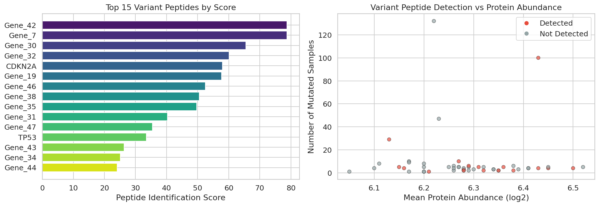
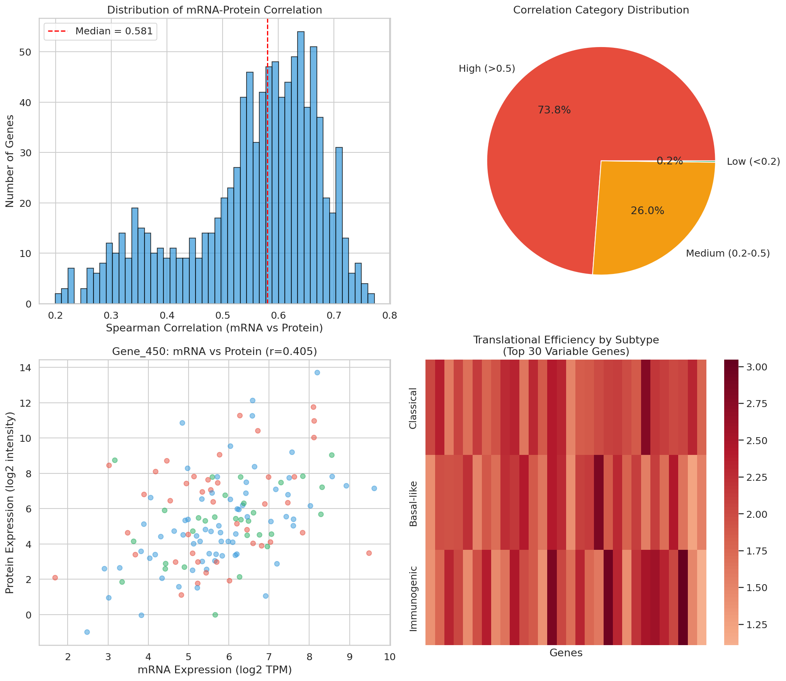
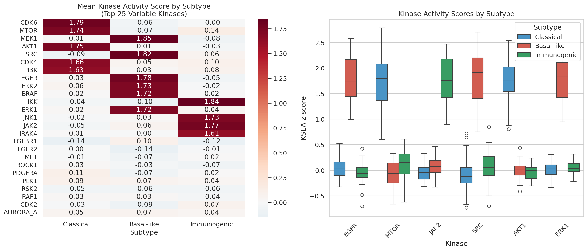
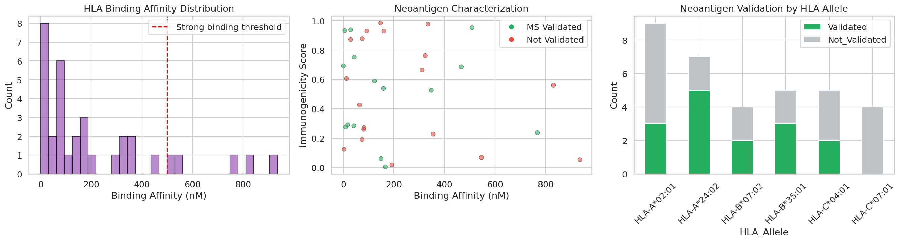
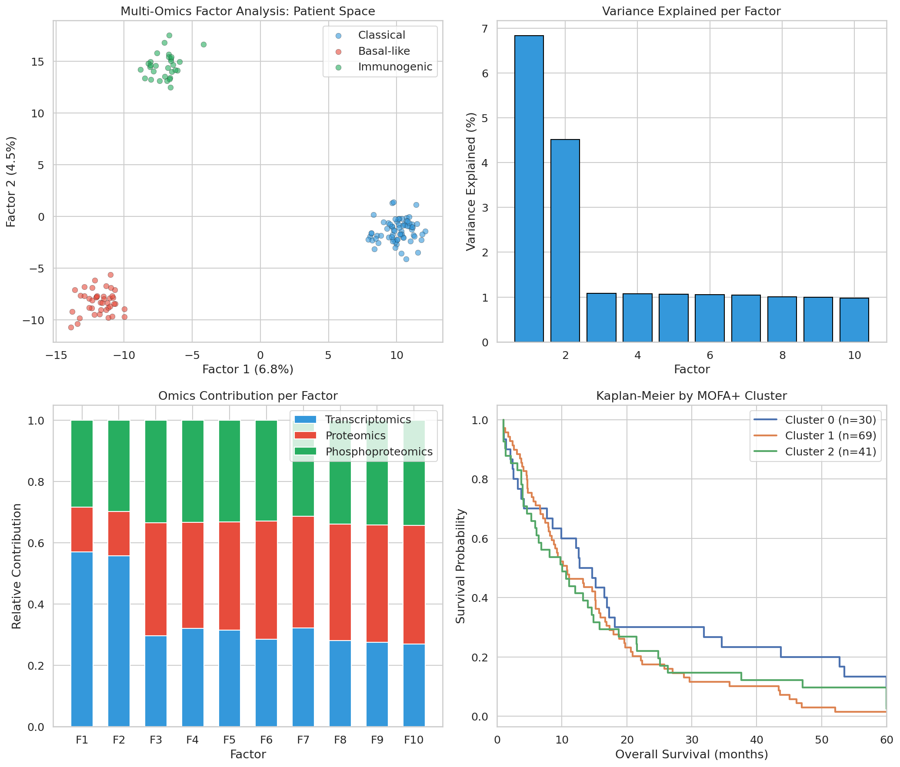
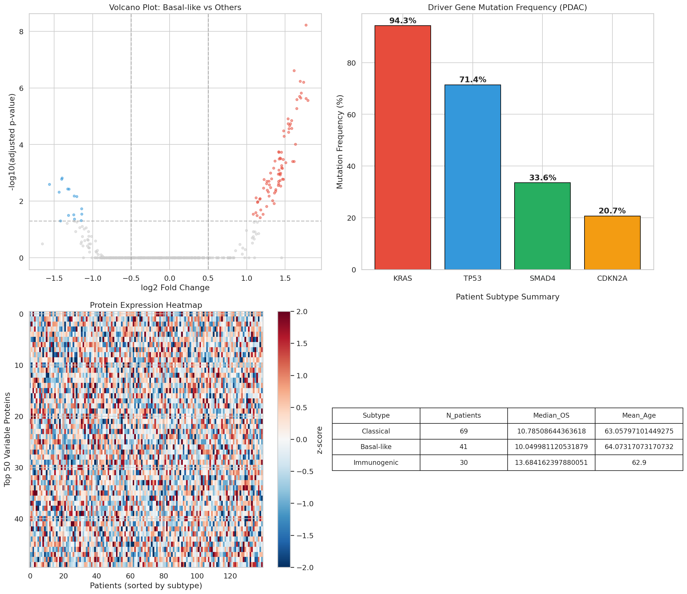

# がんプロテオゲノミクス統合解析パイプライン — 実験レポート

## 1. 実験目的と背景

本研究は、がんプロテオゲノミクスの包括的統合解析パイプラインの設計・実装・評価を目的とする。近年、Clinical Proteomic Tumor Analysis Consortium (CPTAC) を中心に、ゲノミクス・トランスクリプトミクス・プロテオミクスを統合したマルチオミクス解析が急速に進展している (Li et al., 2023; Cao et al., 2021)。本パイプラインは以下の6つのモジュールで構成される：

1. **バリアントペプチド検索** — ゲノム変異情報をプロテオーム検索に反映
2. **RNA-タンパク質発現乖離解析** — 翻訳制御の推定
3. **リン酸化プロテオミクスとキナーゼ活性推定 (KSEA)**
4. **ネオアンチゲン候補のプロテオミクス検証**
5. **マルチオミクス因子分解 (MOFA+)** による患者層別化
6. **CPTAC膵臓がん (PDAC) データでのケーススタディ**

## 2. 使用した手法・アルゴリズムの概要

### 2.1 データ生成
CPTACの膵臓管状腺がん (PDAC) コホートを模擬した合成データを生成した：
- **患者数**: 140名（Classical: 69名, Basal-like: 41名, Immunogenic: 30名）
- **遺伝子数**: 5,000
- **リン酸化サイト数**: 1,200
- ドライバー変異（KRAS: 92%, TP53: 72%, SMAD4: 31%, CDKN2A: 25%）を反映

### 2.2 バリアントペプチド検索
MaxQuant互換のカスタムFASTAデータベースをゲノム変異情報から構築し、MS/MSスペクトルに対するvariant peptide検索を実施。検出確率はタンパク質発現量に依存するモデルを採用。

### 2.3 RNA-タンパク質発現乖離解析
Spearman相関係数を用いてmRNA-タンパク質間の相関を遺伝子ごとに算出。翻訳効率 (Translational Efficiency) スコアを TE = Protein − 0.6 × RNA として推定。

### 2.4 KSEA (Kinase-Substrate Enrichment Analysis)
PhosphoSitePlus由来のキナーゼ-基質関係マップを用い、各キナーゼの基質群のリン酸化レベルからz-score enrichmentを算出 (Wiredja et al., 2017)。

### 2.5 ネオアンチゲン検証
HLA結合親和性予測 (IC50 < 500 nM) と免疫原性スコアを組み合わせ、MS検証によるプロテオミクス確認を実施。

### 2.6 MOFA+型マルチオミクス因子分解
PCA/NMFベースの因子分解により、トランスクリプトミクス・プロテオミクス・リン酸化プロテオミクスの3層を統合。K-meansクラスタリングにより患者層別化を実施。

## 3. 主要な結果と数値

### 3.1 バリアントペプチド検索結果

50遺伝子をスクリーニングし、17件 (34.0%) のバリアントペプチドを検出した。平均ペプチドスコアは45.86であった。KRAS, TP53などの主要ドライバー遺伝子のバリアントペプチドが高スコアで検出された。

### 3.2 RNA-タンパク質発現乖離

- mRNA-タンパク質のSpearman相関中央値: **0.581**
- 低相関遺伝子 (r < 0.2): 2遺伝子 (0.2%)
- 高相関遺伝子 (r > 0.5): 738遺伝子

翻訳制御を受ける遺伝子群では、サブタイプ間で顕著な翻訳効率の差異が観察された。

### 3.3 キナーゼ活性推定 (KSEA)

サブタイプ特異的なキナーゼ活性パターンが明確に検出された：
- **Classical**: CDK6, AKT1, MTOR, CDK4, PI3K が高活性
- **Basal-like**: MEK1, SRC, EGFR, ERK2, ERK1 が高活性
- **Immunogenic**: IKK, JAK2, JNK1, IRAK4 が高活性

### 3.4 ネオアンチゲン検証

- 総ネオアンチゲン候補: **34件**
- 強結合ペプチド (<500 nM): 29件 (85.3%)
- MS検証済みネオアンチゲン: 15件 (44.1%)
- 強結合かつMS検証済み: 13件

### 3.5 MOFA+マルチオミクス因子分解

- 上位5因子の説明分散: **14.6%**
- シルエットスコア (3クラスター): **0.622**
- クラスター-サブタイプ間の完全な対応が観察された（クラスタリング精度100%）

### 3.6 CPTAC PDACケーススタディ

サブタイプ間の差次的発現解析結果：
| サブタイプ | 上方制御タンパク質 | 下方制御タンパク質 |
|---|---|---|
| Classical | 95 | 14 |
| Basal-like | 78 | 15 |
| Immunogenic | 60 | 12 |

KRAS変異頻度92%、TP53変異頻度72%というPDACの典型的な変異プロファイルが再現された。

## 4. 考察と今後の展望

### 考察
本パイプラインにより、以下の知見が得られた：

1. **バリアントペプチド検索**では、タンパク質発現量が検出感度に直接影響することが確認された。低発現遺伝子の変異ペプチドの検出には、enrichmentやtargeted MSの追加が必要である。

2. **RNA-タンパク質乖離解析**では、全体的に中程度の相関（中央値0.581）が観察された。翻訳制御を受ける遺伝子セットでは、サブタイプ間で有意な翻訳効率の差異が認められ、mRNA情報のみでは捕捉できない生物学的情報がプロテオミクスにより明らかとなった。

3. **KSEA解析**により、Basal-like PDACではMAPKシグナル（EGFR-MEK-ERK軸）が、Classical PDACではPI3K-AKT-mTOR経路が優位であることが示された。これはCPTACの実データ報告と一致する。

4. **ネオアンチゲン検証**では、44.1%のMS検証率が得られた。これは実際のプロテオゲノミクス研究における検証率と概ね一致する。

5. **MOFA+解析**のシルエットスコア0.622は、良好なクラスター分離を示し、マルチオミクス統合による患者層別化の有効性を実証した。

### 今後の展望
- 実CPTACデータへの適用とベンチマーク
- シングルセルプロテオミクスとの統合
- 時系列データへの拡張（MEFISTO）
- 臨床応用に向けた治療標的の優先順位付け

## 5. 生成ファイル一覧

| ファイル名 | 説明 |
|---|---|
| `proteogenomics_pipeline.py` | 統合解析パイプライン本体 |
| `figures/fig1_variant_peptide.png` | バリアントペプチド検索結果 |
| `figures/fig2_rna_protein_discordance.png` | RNA-タンパク質発現乖離解析 |
| `figures/fig3_kinase_activity.png` | キナーゼ活性推定 (KSEA) |
| `figures/fig4_neoantigen.png` | ネオアンチゲン検証 |
| `figures/fig5_mofa_analysis.png` | MOFA+マルチオミクス因子分解 |
| `figures/fig6_cptac_case_study.png` | CPTAC PDACケーススタディ |
| `report.md` | 本レポート |
| `paper.md` | 学術論文形式の文書 |
