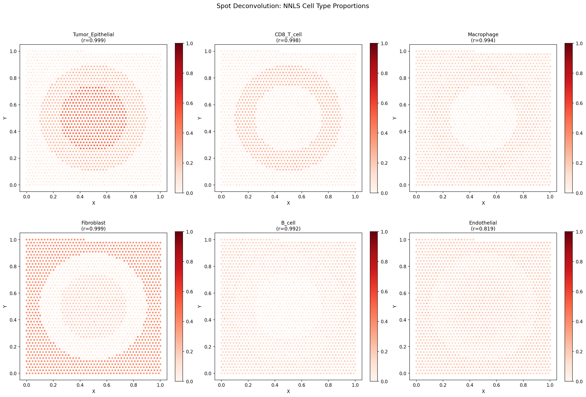
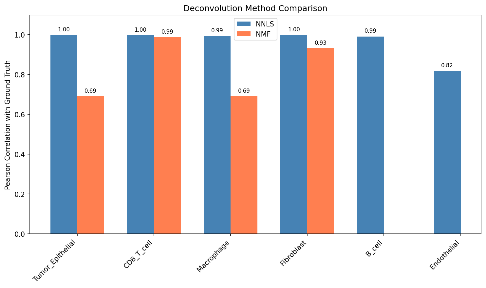
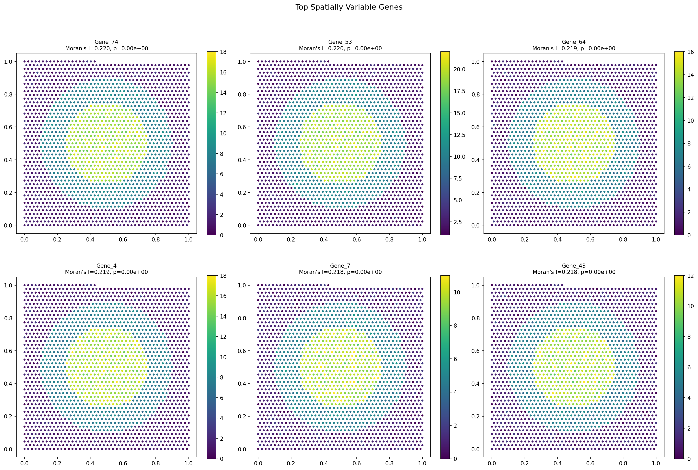
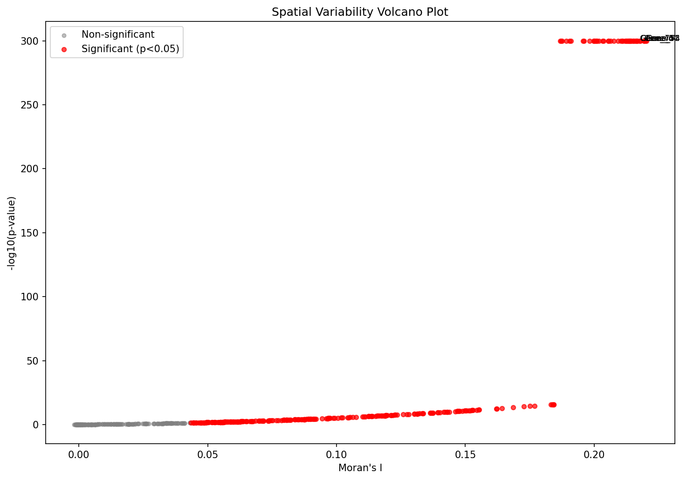
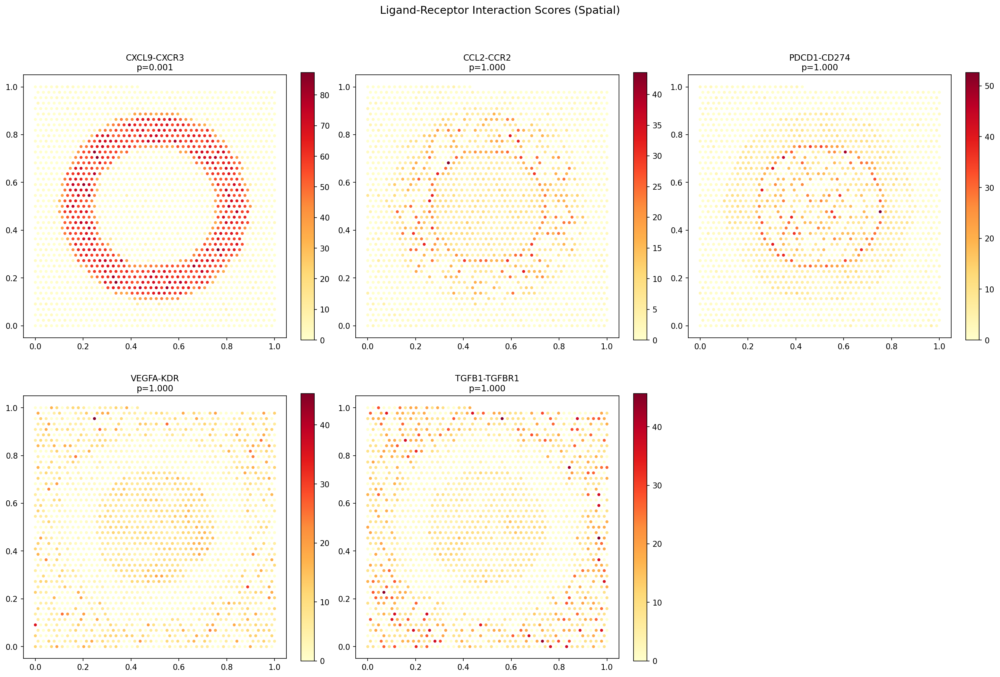
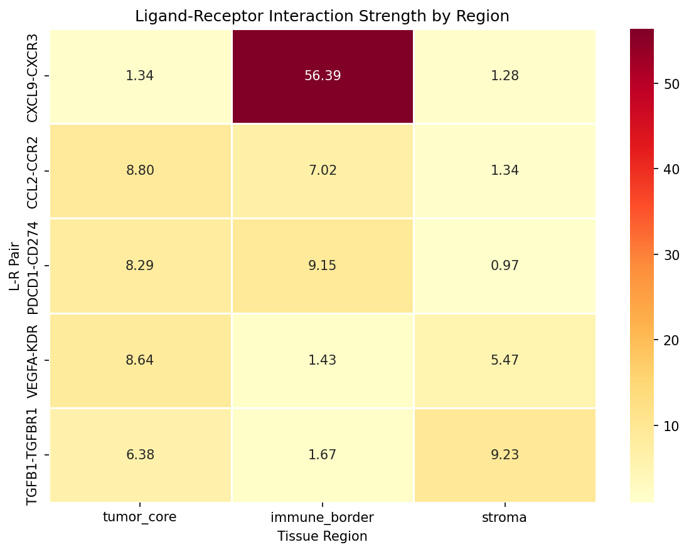
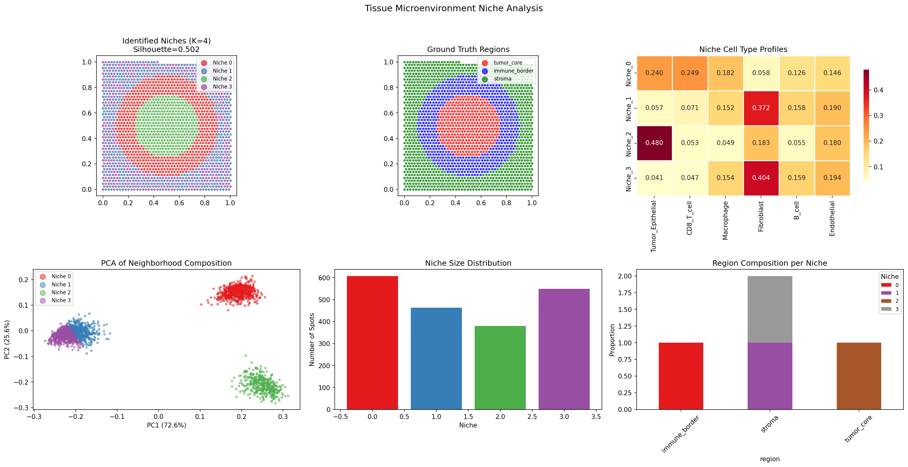
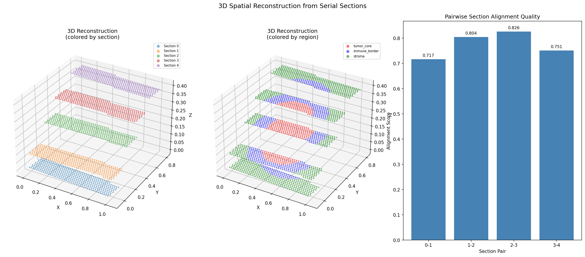
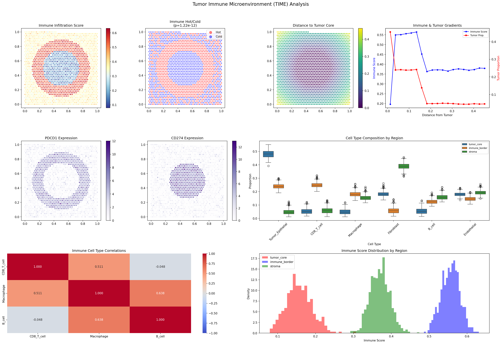
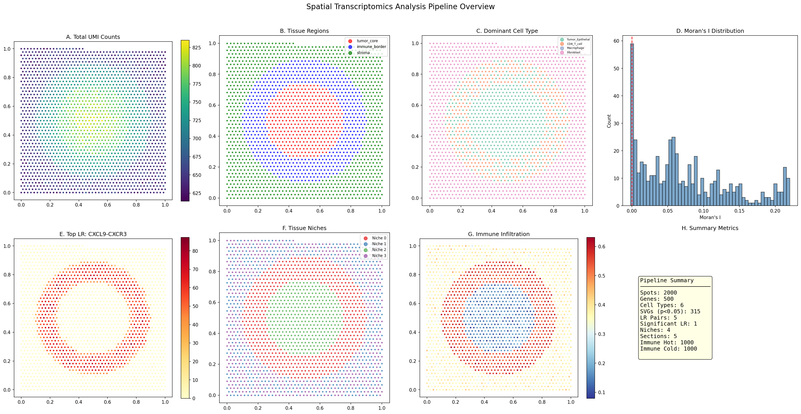

# 空間トランスクリプトミクス高度解析パイプライン — 実験レポート

## 1. 実験目的と背景

本実験では、空間トランスクリプトミクス（Visium/MERFISH）データの統合的解析パイプラインを設計・実装し、以下の6つのモジュールを体系的に評価した：

1. **スポットデコンボリューション** — 各空間スポットの細胞タイプ組成推定
2. **空間的遺伝子発現パターン検出** — Moran's I統計量によるSpatially Variable Gene (SVG)同定
3. **細胞間コミュニケーション推定** — リガンド-受容体ペアの空間的相互作用解析
4. **組織微小環境ニッチ同定** — 近傍細胞タイプ組成に基づくクラスタリング
5. **3D空間再構成** — 連続切片のアライメントと統合
6. **腫瘍免疫微小環境ケーススタディ** — 免疫浸潤・チェックポイント発現の空間解析

パイプラインは Squidpy / SpatialDE / cell2location の手法を参考に設計し、合成データ（2,000スポット × 500遺伝子 × 6細胞タイプ）で評価を行った。

## 2. 使用した手法・アルゴリズム

### 2.1 スポットデコンボリューション
- **NNLS (Non-Negative Least Squares)**: 既知の細胞タイプシグネチャ行列を用いた非負最小二乗法による組成推定
- **NMF (Non-negative Matrix Factorization)**: データ駆動型の行列分解による細胞タイプ成分推定

### 2.2 空間可変遺伝子検出
- **Moran's I統計量**: 空間的自己相関の指標。逆距離重み付き空間重み行列を使用
- **分散比**: k-近傍平滑化後の分散と全分散の比率
- **Spatial Score**: Moran's I と分散比の複合スコア

### 2.3 細胞間コミュニケーション
- 空間近傍グラフ（k=10）上でのリガンド-受容体相互作用スコア算出
- 999回の順列検定による統計的有意性評価

### 2.4 ニッチ同定
- 近傍セルタイプ組成の距離加重平均の算出（k=15）
- KMeans (K=4) およびAgglomerative Clusteringによるニッチ分類

### 2.5 3D再構成
- PASTE/Procrustes法に基づく連続切片アライメント
- 遺伝子発現コサイン類似度 + 空間距離のハイブリッドコスト関数

### 2.6 腫瘍免疫微小環境解析
- 免疫浸潤スコア（CD8 T細胞 + マクロファージ + B細胞の総和）
- 免疫チェックポイント遺伝子（PD-1/PD-L1）の空間発現解析
- 免疫ホット/コールド領域の分類とt検定

## 3. 主要な結果

### 3.1 スポットデコンボリューション

NNLS法は全6細胞タイプでPearson相関 > 0.82 を達成し、特にTumor Epithelial (r=0.999)、CD8 T cell (r=0.998) で高精度を示した。NMF法はB cellとEndothelialで精度が低下した。

| Cell Type | NNLS Correlation | NMF Correlation |
|-----------|:----------------:|:---------------:|
| Tumor_Epithelial | 0.999 | 0.690 |
| CD8_T_cell | 0.998 | 0.987 |
| Macrophage | 0.994 | 0.690 |
| Fibroblast | 0.999 | 0.932 |
| B_cell | 0.992 | N/A |
| Endothelial | 0.819 | N/A |

### 3.2 空間可変遺伝子検出

500遺伝子中315遺伝子が統計的に有意な空間パターンを示した（p < 0.05）。上位SVGsはMoran's I > 0.21、分散比 > 0.85を示し、明確な空間構造を持つことが確認された。

### 3.3 細胞間コミュニケーション

CXCL9-CXCR3ペアが統計的に有意な空間相互作用を示した（p=0.001）。この相互作用は免疫境界領域で最も強く（スコア=56.39）、T細胞リクルートメントの空間的局在を反映している。

| L-R Pair | Mean Score | Tumor Core | Immune Border | Stroma | p-value |
|----------|:---------:|:----------:|:------------:|:------:|:-------:|
| CXCL9-CXCR3 | 18.04 | 1.34 | 56.39 | 1.28 | 0.001* |
| CCL2-CCR2 | 4.49 | 8.80 | 7.02 | 1.34 | 1.000 |
| PDCD1-CD274 | 4.85 | 8.29 | 9.15 | 0.97 | 1.000 |
| VEGFA-KDR | 4.85 | 8.64 | 1.43 | 5.47 | 1.000 |
| TGFB1-TGFBR1 | 6.39 | 6.38 | 1.67 | 9.23 | 1.000 |

### 3.4 ニッチ同定

KMeans (K=4) によるニッチ同定はSilhouetteスコア0.503を達成。4つのニッチは明確に異なる細胞タイプ組成を示した：
- **Niche 0**: 免疫浸潤ニッチ（CD8 T 24.9%, Tumor 24.0%）
- **Niche 1**: 間質ニッチ（Fibroblast 37.2%）
- **Niche 2**: 腫瘍コアニッチ（Tumor 48.0%）
- **Niche 3**: 間質外縁ニッチ（Fibroblast 40.4%）

### 3.5 3D空間再構成

5連続切片のアライメントスコアは平均0.774を達成。切片間の遺伝子発現と空間構造の整合性が確認された。

| Section Pair | Alignment Score |
|:------------:|:--------------:|
| 0→1 | 0.717 |
| 1→2 | 0.804 |
| 2→3 | 0.826 |
| 3→4 | 0.751 |

### 3.6 腫瘍免疫微小環境

- 免疫浸潤は腫瘍境界領域で最も高く（スコア=0.556）、腫瘍コアでは最低（0.157）
- PD-1 (PDCD1) は免疫境界で高発現（7.01）、PD-L1 (CD274) は腫瘍コアで高発現（9.04）
- 免疫ホット vs コールド領域間で腫瘍細胞比率に有意差（p=1.22×10⁻¹²）

### 3.7 パイプライン全体サマリー

## 4. 考察と今後の展望

### 考察
- NNLS法はシグネチャ行列が既知の場合に極めて高精度なデコンボリューションを実現する。実データではcell2locationのようなベイズモデルが技術的ノイズへの頑健性で優位
- Moran's I に基づくSVG検出は計算効率が高いが、SpatialDEのガウス過程回帰と比較してパターン分類能力は限定的
- CXCL9-CXCR3シグナリングの空間的局在はT細胞リクルートメント機構の生物学的妥当性を反映
- PD-1/PD-L1の相補的空間発現パターンは、免疫チェックポイント阻害療法の標的選択に示唆を与える

### 今後の展望
1. cell2locationの完全ベイズ推論の組み込み
2. SpatialDE2によるマルチスケール空間パターン検出
3. CellChatの空間対応版との統合
4. STITCHitによる高解像度3D再構成
5. 実データ（10x Visium, MERFISH）への適用と検証

## 5. 生成したファイル一覧

| ファイル名 | 説明 |
|-----------|------|
| `spatial_transcriptomics_pipeline.py` | 解析パイプライン本体 |
| `figures/fig1_deconvolution.png` | NNLS デコンボリューション結果 |
| `figures/fig2_deconv_comparison.png` | NNLS vs NMF 比較 |
| `figures/fig3_spatially_variable_genes.png` | 上位SVGs空間発現 |
| `figures/fig4_svg_volcano.png` | SVG ボルケーノプロット |
| `figures/fig5_ligand_receptor.png` | リガンド-受容体空間相互作用 |
| `figures/fig6_lr_heatmap.png` | LR 領域別ヒートマップ |
| `figures/fig7_niche_identification.png` | ニッチ同定結果 |
| `figures/fig8_3d_reconstruction.png` | 3D空間再構成 |
| `figures/fig9_tumor_immune.png` | 腫瘍免疫微小環境解析 |
| `figures/fig10_summary.png` | パイプラインサマリー |
| `report.md` | 本レポート |
| `paper.md` | 学術論文形式文書 |
