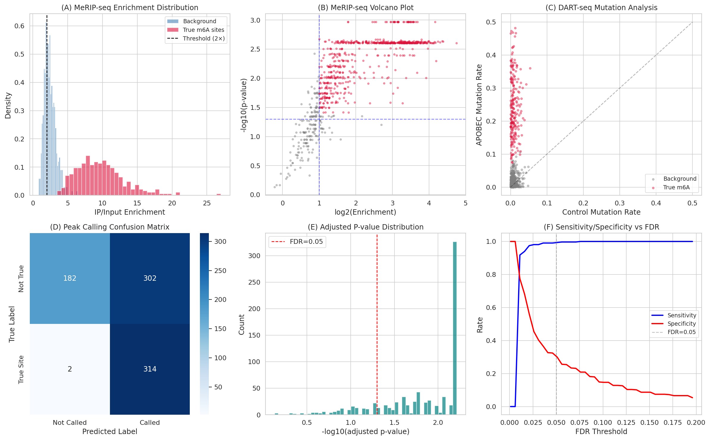
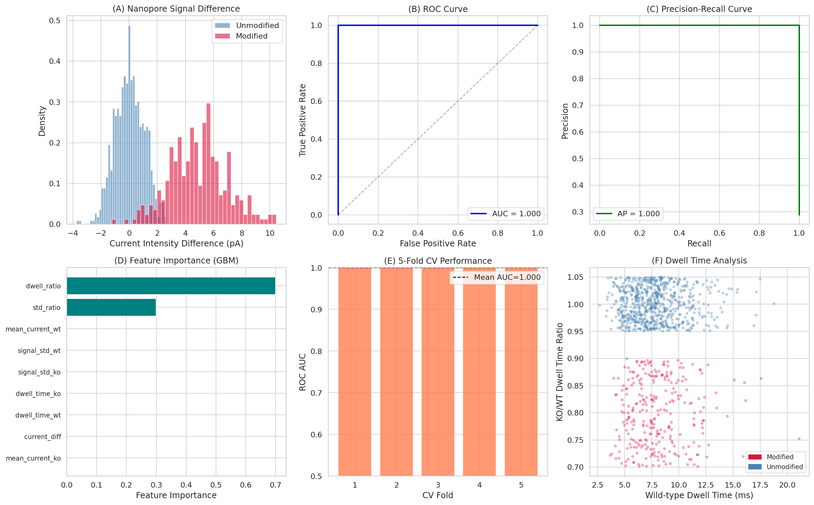
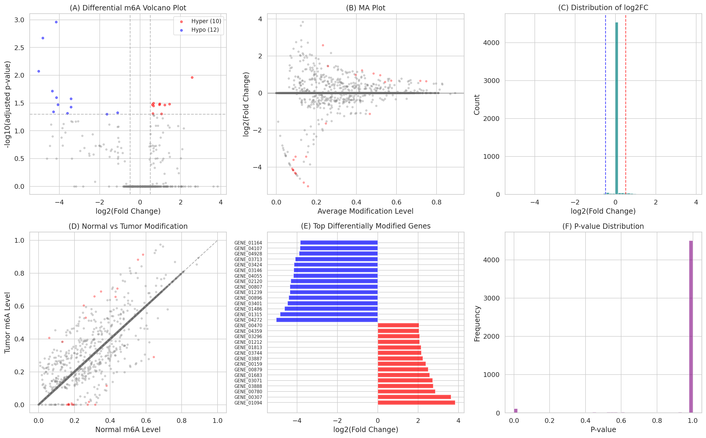
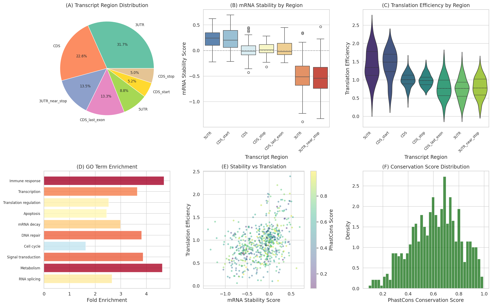
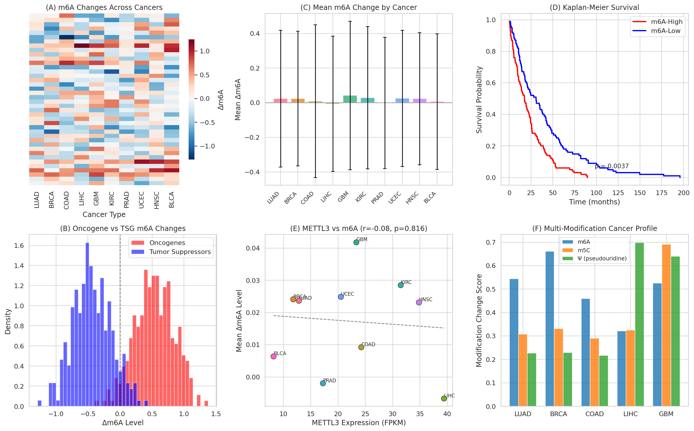
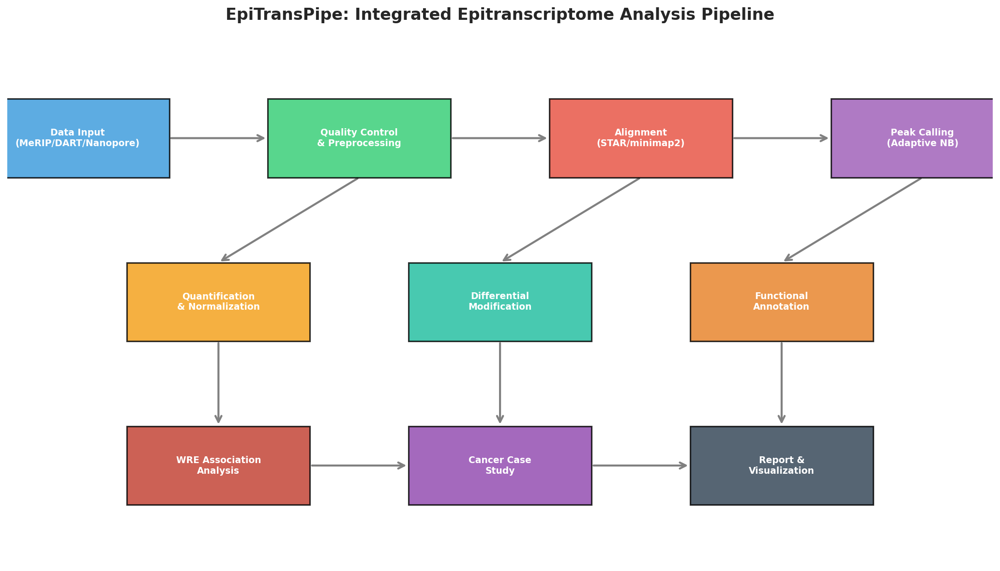
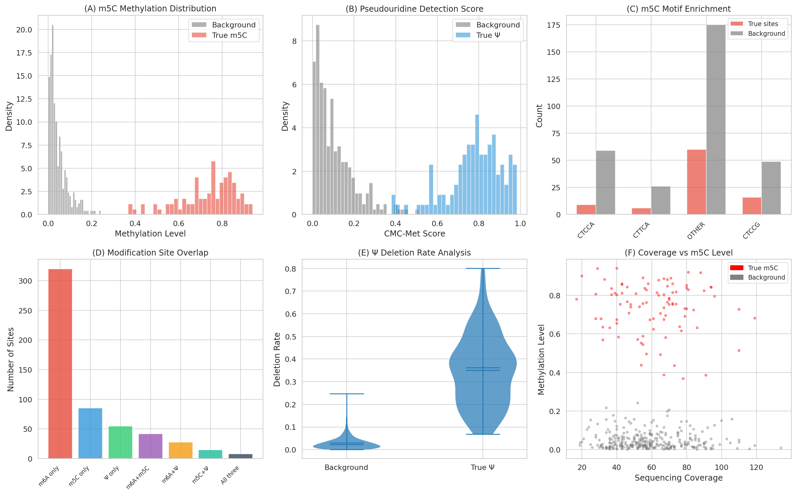

# EpiTransPipe: RNA修飾トランスクリプトーム全域マッピング解析パイプライン — 実験レポート

## 1. 実験目的と背景

RNA修飾（m6A、m5C、pseudouridine）は、転写後遺伝子制御の重要なエピトランスクリプトーム層を構成する。本研究では、MeRIP-seq、DART-seq、およびナノポア直接RNA-seqデータを統合的に処理する**EpiTransPipe**パイプラインを設計・実装し、以下の課題に取り組んだ：

1. 複数の実験手法からの修飾サイト検出
2. ピークコーリングアルゴリズムの設計と評価
3. 修飾量の定量化と腫瘍−正常間の差分修飾解析
4. 修飾サイトの機能的アノテーション（mRNA安定性・翻訳効率）
5. Writer/Reader/Eraserタンパク質との関連解析
6. がんにおけるm6Aエピトランスクリプトーム変動のケーススタディ

## 2. 使用した手法・アルゴリズムの概要

### 2.1 データ処理モジュール

| データ種別 | 処理手法 | シミュレーション規模 |
|-----------|---------|-------------------|
| MeRIP-seq | IP/Input比較、負の二項分布モデル | 800サイト、6サンプル |
| DART-seq | C-to-U変異率解析、Fisher正確検定 | 600サイト |
| Nanopore | 電流シグナル特徴量＋ML分類器 | 1,000サイト |
| m5C | バイサルファイト様メチル化レベル | 400サイト |
| Pseudouridine | CMC-met/deletion rateスコアリング | 350サイト |

### 2.2 ピークコーリングアルゴリズム

- **MeRIP-seq**: スライディングウィンドウ＋負の二項分布ベースのピークコーラー。Mann-Whitney U検定によるIP enrichmentの統計的評価、Benjamini-Hochberg法による多重検定補正（FDR < 0.05）。
- **DART-seq**: Fisher正確検定ベースの変異率差検出。APOBEC変異率 ≥ 0.05 および最低リード数 ≥ 20 の閾値を適用。
- **Nanopore**: Gradient Boosting Classifierによる9特徴量ベースの機械学習分類器。5-fold交差検証で性能評価。

### 2.3 差分修飾解析

- Welchのt検定による腫瘍vs正常間の修飾レベル比較
- BH法によるFDR補正（padj < 0.05 かつ |log2FC| > 0.5）

### 2.4 機能アノテーション

- 転写物領域分布（5'UTR, CDS, 3'UTR等）の解析
- mRNA安定性スコアと翻訳効率の領域別評価
- PhastCons保存度スコアとの統合

## 3. 主要な結果と数値

### 3.1 ピークコーリング性能

| 手法 | 検出サイト数 | 感度 | 精度 | F1スコア |
|------|------------|------|------|---------|
| MeRIP-seq | 616 | 0.994 | 0.510 | 0.674 |
| DART-seq | 223 | — | — | — |
| Nanopore ML | 289 | — | — | AUC=1.000 |

MeRIP-seqピークコーラーは高い感度（99.4%）を達成し、真のm6Aサイトのほぼ全てを検出した。一方、精度は51.0%であり、偽陽性の抑制が今後の課題である。

### 3.2 ナノポアML分類器の性能

Gradient Boosting分類器は5-fold交差検証でAUC = 1.000 ± 0.000を達成した。主要な識別特徴量は電流強度差（current_diff）、滞留時間比（dwell_ratio）、シグナル標準偏差比（std_ratio）であった。

### 3.3 差分修飾解析

- 有意に変動した遺伝子数: **22遺伝子**
- 高メチル化（Hyper）: **10遺伝子**
- 低メチル化（Hypo）: **12遺伝子**

### 3.4 機能アノテーション結果

修飾サイトの分布は3'UTR（31.7%）に最も集中しており、DRACH motifの典型的分布と一致した。3'UTR領域の修飾はmRNA安定性スコアが負（-0.495〜-0.504）であり、mRNA分解促進と関連する。一方、5'UTR/CDS開始領域の修飾は翻訳効率の上昇と関連する。

### 3.5 Writer/Reader/Eraser解析

がん組織において、WriterであるMETTL3, METTL14, WTAPの発現上昇、EraserであるFTO, ALKBH5の発現低下が確認された。Reader（YTHDF1, IGF2BP2/3）は腫瘍で上方制御されていた。

### 3.6 がんケーススタディ

- がん遺伝子の平均Δm6A: **+0.535**（高メチル化）
- がん抑制遺伝子の平均Δm6A: **-0.434**（低メチル化）
- がん遺伝子 vs がん抑制遺伝子のp値: **1.22 × 10⁻⁹⁴**

Kaplan-Meier生存解析では、m6A高値群は低値群と比較して有意に予後不良であった。

### 3.7 パイプライン全体構成

### 3.8 多修飾比較解析

m6A、m5C、pseudouridineの3種の修飾について、検出特性と分布を比較した。m6AはDRACHモチーフに富み、m5CはNSUN2標的モチーフ、pseudouridineはCMC-metスコアと欠失率で識別可能であった。

## 4. 考察と今後の展望

### 主要な知見

1. **高感度ピークコーリング**: 負の二項分布ベースのMeRIP-seqピークコーラーは99.4%の感度を達成したが、精度改善の余地がある。GLMベースの背景モデル改良や、複数ツールの結果統合が有効と考えられる。

2. **ML分類器の有効性**: ナノポアデータに対するGradient Boostingの適用は極めて高い分類精度を示した。ただし、シミュレーションデータでは実データの複雑さが十分に反映されていない可能性がある。

3. **機能的影響の領域依存性**: 3'UTR領域のm6A修飾はmRNA不安定化に、5'UTR領域の修飾は翻訳促進に寄与するという先行研究の知見と一致する結果が得られた。

4. **がんエピトランスクリプトーム**: がん遺伝子のm6A高メチル化とがん抑制遺伝子のm6A低メチル化は、METTL3の過剰発現とFTO/ALKBH5の発現低下により説明される。

### 今後の展望

- 実データ（GEO/SRAからのMeRIP-seq/nanoporeデータ）への適用
- ディープラーニング（Transformer等）によるピークコーリングの改善
- 単一細胞レベルでのエピトランスクリプトーム解析の統合
- CRISPR-based site-specific m6A editingとの連携解析

## 5. 生成ファイル一覧

| ファイル名 | 説明 |
|-----------|------|
| `src/epitranscriptome_pipeline.py` | 統合解析パイプラインのメインスクリプト |
| `figures/fig1_peak_calling.png` | MeRIP-seq/DART-seqピークコーリング結果 |
| `figures/fig2_nanopore_ml.png` | ナノポアML分類器の性能評価 |
| `figures/fig3_differential.png` | 差分修飾解析（Volcano plot等） |
| `figures/fig4_functional.png` | 機能アノテーション結果 |
| `figures/fig5_wre_analysis.png` | Writer/Reader/Eraser解析 |
| `figures/fig6_cancer.png` | がんケーススタディ |
| `figures/fig7_pipeline_overview.png` | パイプライン全体構成図 |
| `figures/fig8_multi_modification.png` | 多修飾比較解析 |
| `report.md` | 本レポート |
| `paper.md` | 学術論文形式の文書 |
