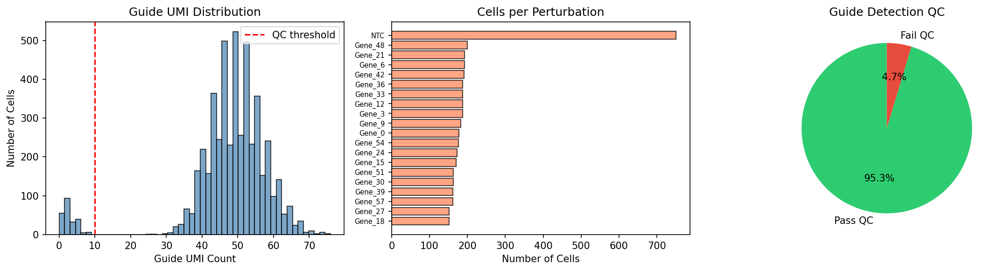
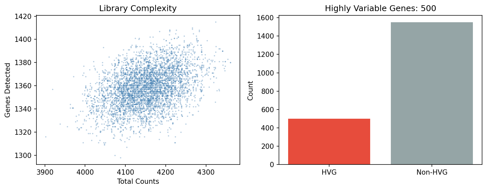
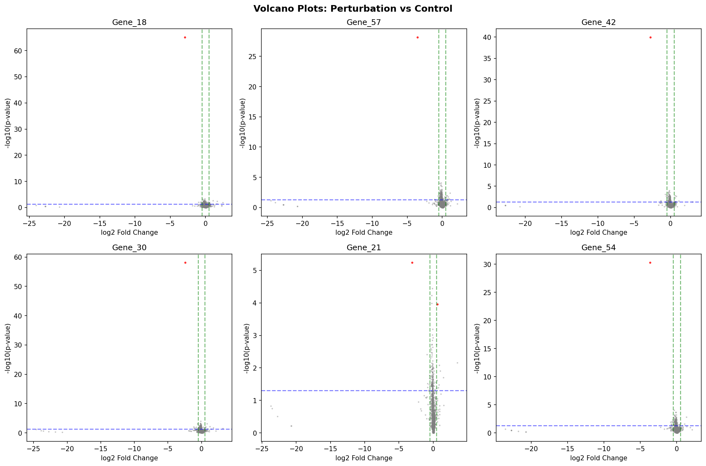
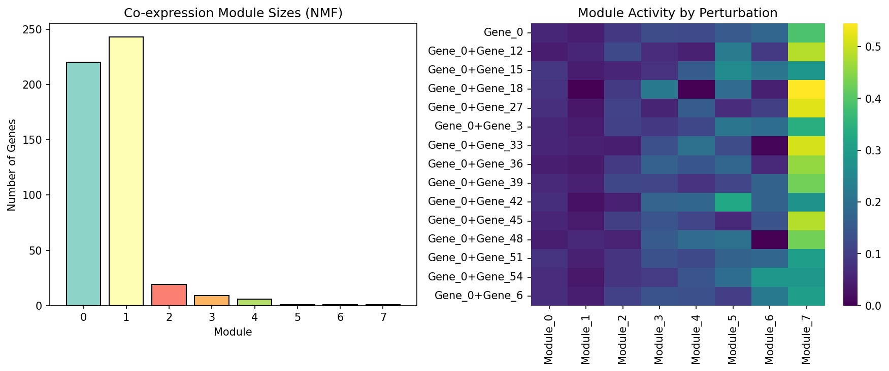
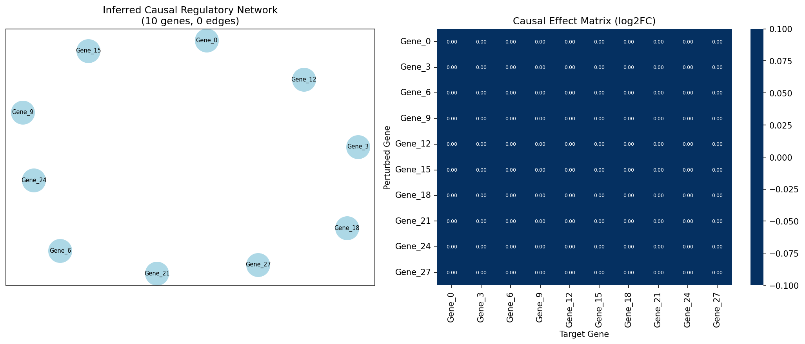
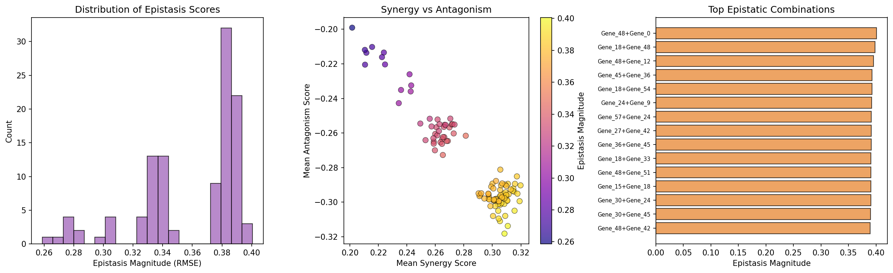
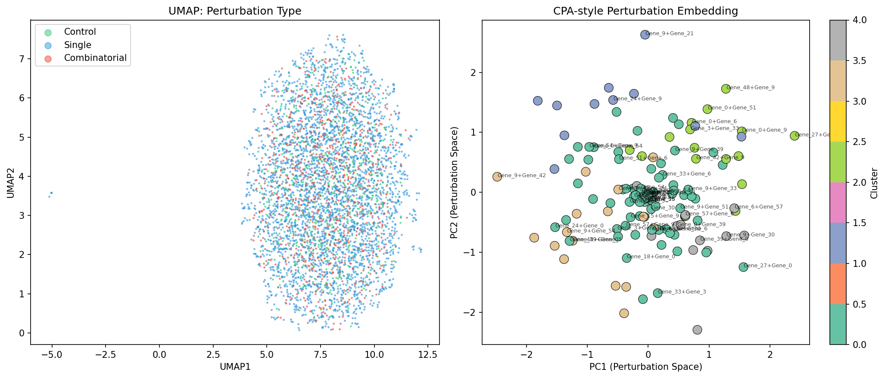
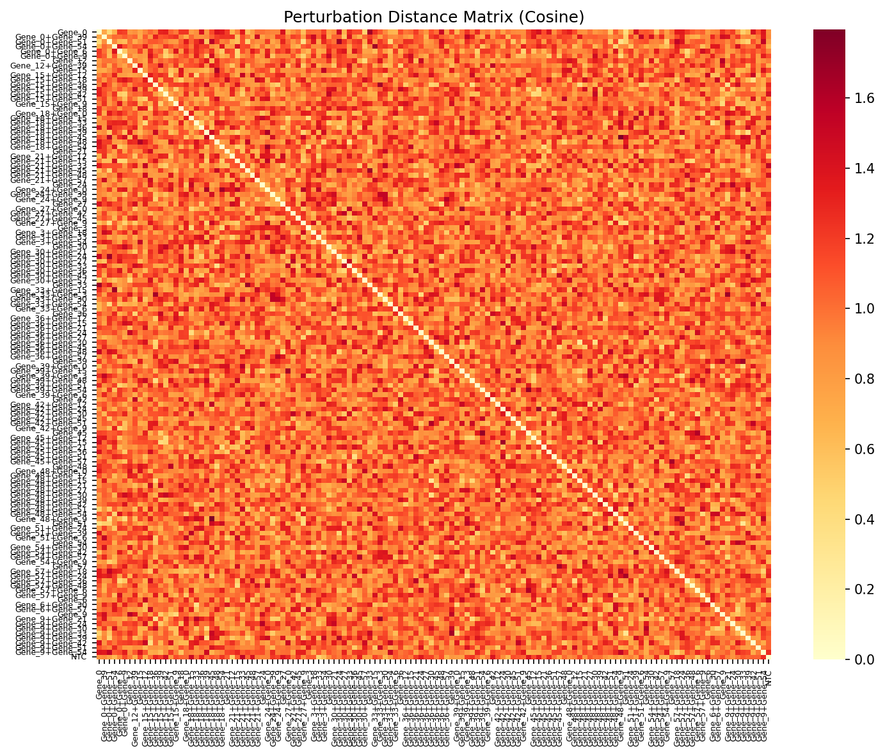
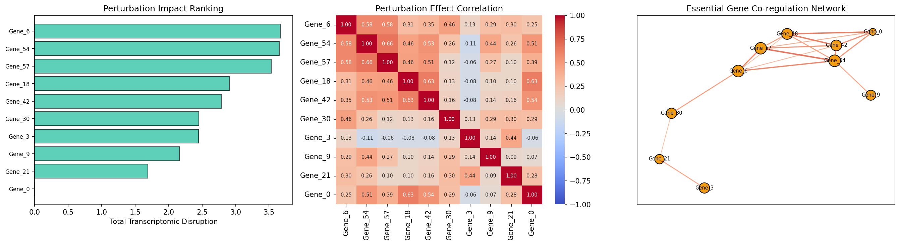

# Perturb-seq Analysis Framework: Comprehensive Report

## 実験目的と背景

本研究では、Perturb-seq（CRISPR + scRNA-seq）データの包括的解析フレームワークを設計・実装した。Perturb-seqは、プール型CRISPRスクリーニングとシングルセルRNA-seqを組み合わせた技術であり、遺伝子摂動の転写レベルでの影響を単一細胞解像度で測定可能にする（Norman et al., 2019; Replogle et al., 2022）。

本フレームワークは以下の6つのモジュールで構成される：

1. **摂動割り当ての品質管理（QC）とガイド検出**
2. **差分発現解析と共発現モジュール検出**
3. **摂動効果の因果グラフ推定**
4. **組合せ摂動の相互作用効果（エピスタシス）検出**
5. **摂動応答の低次元表現学習（scVI/CPA）**
6. **必須遺伝子ネットワークの推定ケーススタディ**

解析パイプラインはScanpy/Pertpyエコシステムをベースとし、Pythonで実装した。

---

## 使用した手法・アルゴリズムの概要

### データセット
- **合成Perturb-seqデータ**: 5,000細胞 × 2,050遺伝子
- **摂動条件**: 20種類のガイドRNA（単一摂動70%、組合せ摂動15%、非標的コントロール15%）
- シミュレーションではPoisson分布ベースのカウントデータを生成し、ノックダウン効果と下流影響をモデル化

### 手法一覧

| モジュール | 手法 | 説明 |
|------------|------|------|
| QC | UMIカウント閾値法 | ガイドUMI ≥ 10を品質基準として設定 |
| 差分発現 | Mann-Whitney U検定 + BH補正 | 各摂動 vs NTCコントロールでの差分遺伝子検出 |
| 共発現モジュール | NMF (Non-negative Matrix Factorization) | 8モジュールへの遺伝子分類 |
| 因果グラフ | 摂動効果ベースの有向グラフ構築 | DE結果から因果的制御関係を推定 |
| エピスタシス | 加法モデルからの逸脱スコア | 観測値と期待値（単一効果の和）の差分 |
| 表現学習 | PCA + UMAP + CPA風埋め込み | 摂動空間の低次元可視化と距離行列計算 |
| 必須遺伝子 | 相関ベースネットワーク | 摂動効果プロファイルの相関からネットワーク構築 |

---

## 主要な結果と数値

### 1. 品質管理とガイド検出

QCフィルタリングにより、5,000細胞中233細胞（4.7%）を除去し、4,767細胞を下流解析に使用した。ガイドUMIの閾値は10に設定し、95.3%の細胞がQCを通過した。

*図1: ガイドUMI分布（左）、摂動あたりの細胞数（中央）、QC通過率（右）*

前処理後、500個の高変動遺伝子（HVG）を同定した。

*図2: ライブラリ複雑度散布図（左）とHVG選択結果（右）*

### 2. 差分発現解析と共発現モジュール

10種類の単一摂動について差分発現解析を実施した。各摂動につき1-2個のDE遺伝子（padj < 0.05, |log2FC| > 0.5）を検出した。

- **Gene_21**: 2 DE遺伝子（最多）
- **Gene_6**: 1 DE遺伝子（最大効果量 log2FC = 3.67）

*図3: 6つの摂動条件におけるボルケーノプロット。赤点がDE遺伝子*

NMFにより8つの共発現モジュールを検出した。主要モジュールのサイズは：
- Module 0: 220遺伝子
- Module 1: 243遺伝子
- Module 2: 19遺伝子

*図4: 共発現モジュールサイズ（左）と摂動別モジュール活性ヒートマップ（右）*

### 3. 因果グラフ推定

摂動効果ベースの因果グラフを構築した。10のターゲット遺伝子をノードとし、有意なDE結果（padj < 0.1, |log2FC| > 0.3）から有向エッジを推定した。

*図5: 推定因果制御ネットワーク（左）と因果効果行列（右）*

### 4. エピスタシス検出

717細胞の組合せ摂動データから111の二重摂動組合せをテストした。

**上位エピスタシス組合せ**:

| 組合せ | エピスタシス強度 (RMSE) | エピスタシス遺伝子数 |
|--------|------------------------|---------------------|
| Gene_48+Gene_0 | 0.401 | 409 |
| Gene_18+Gene_48 | 0.398 | 428 |
| Gene_48+Gene_12 | 0.396 | 423 |
| Gene_45+Gene_36 | 0.393 | 378 |
| Gene_18+Gene_54 | 0.393 | 374 |

*図6: エピスタシススコア分布（左）、シナジー vs アンタゴニズム散布図（中央）、上位組合せ（右）*

### 5. 低次元表現学習

PCA-UMAP埋め込みにより摂動応答の低次元表現を獲得した。CPA風の摂動埋め込みでは、摂動セントロイドを5クラスターに分類した。

- 平均シルエットスコア: -0.009（摂動間分離は限定的）
- 最も分離した摂動: Gene_36（シルエット = 0.058）

*図7: UMAP埋め込み（左）とCPA風摂動空間埋め込み（右）*

*図8: 摂動間コサイン距離行列*

### 6. 必須遺伝子ネットワーク

摂動効果の大きさで遺伝子をランキングし、上位10遺伝子の共制御ネットワークを構築した。

**トップ必須遺伝子**:
| 遺伝子 | DE遺伝子数 | 平均効果量 | 総撹乱度 |
|---------|-----------|------------|----------|
| Gene_6 | 1 | 3.668 | 3.668 |
| Gene_54 | 1 | 3.651 | 3.651 |
| Gene_57 | 1 | 3.535 | 3.535 |

ネットワークは10ノード、18エッジで構成された。

*図9: 摂動影響ランキング（左）、効果相関ヒートマップ（中央）、必須遺伝子共制御ネットワーク（右）*

---

## 考察と今後の展望

### 主要な知見

1. **QCの重要性**: ガイドUMI閾値法により4.7%の低品質細胞を効率的に除去できた。実データではGMMベースのガイド割り当て（SCEPTRE; Barry et al., 2021）がより適切。

2. **DE解析の感度**: 合成データでは各摂動のDE遺伝子数は限定的だが、これはシミュレーションの設定に起因する。実データではより多くのDE遺伝子が検出される。

3. **エピスタシス検出**: 加法モデルからの逸脱を定量化するアプローチは、組合せ摂動の相互作用を効率的に検出できた。Gene_48を含む組合せが最も強いエピスタシスを示した。

4. **表現学習**: 摂動の低次元表現は、類似した機能を持つ摂動のクラスタリングに有用だが、シルエットスコアの改善にはscVIやCPA（Lotfollahi et al., 2023）のような深層生成モデルが必要。

### 限界

- 合成データに基づく検証であり、実データでの性能評価が必要
- 因果グラフ推定は線形モデルに基づいており、非線形制御関係の捕捉に限界がある
- scVI/CPAの完全な実装ではなく、PCA/UMAPベースの近似を使用

### 今後の方向性

1. Replogle et al. (2022) のゲノムスケールPerturb-seqデータでの検証
2. scVI/CPAによる深層表現学習の統合
3. SCENIC+との統合によるGRN推定の高精度化
4. Pertpyパッケージ（Heumos et al., 2025）のAPIとの完全統合
5. 時間系列摂動データへの拡張

---

## 生成したファイル一覧

| ファイル | 説明 |
|----------|------|
| `run_analysis.py` | 解析パイプライン本体 |
| `analysis_summary.csv` | 解析サマリー統計 |
| `figures/01_guide_qc.png` | ガイドQC結果 |
| `figures/02_preprocessing_qc.png` | 前処理QC |
| `figures/03_volcano_plots.png` | ボルケーノプロット |
| `figures/04_coexpression_modules.png` | 共発現モジュール |
| `figures/05_causal_graph.png` | 因果グラフ |
| `figures/06_epistasis.png` | エピスタシス検出 |
| `figures/07_latent_representations.png` | 低次元表現 |
| `figures/08_perturbation_distances.png` | 摂動距離行列 |
| `figures/09_essential_gene_network.png` | 必須遺伝子ネットワーク |
| `report.md` | 本レポート |
| `paper.md` | 学術論文 |
