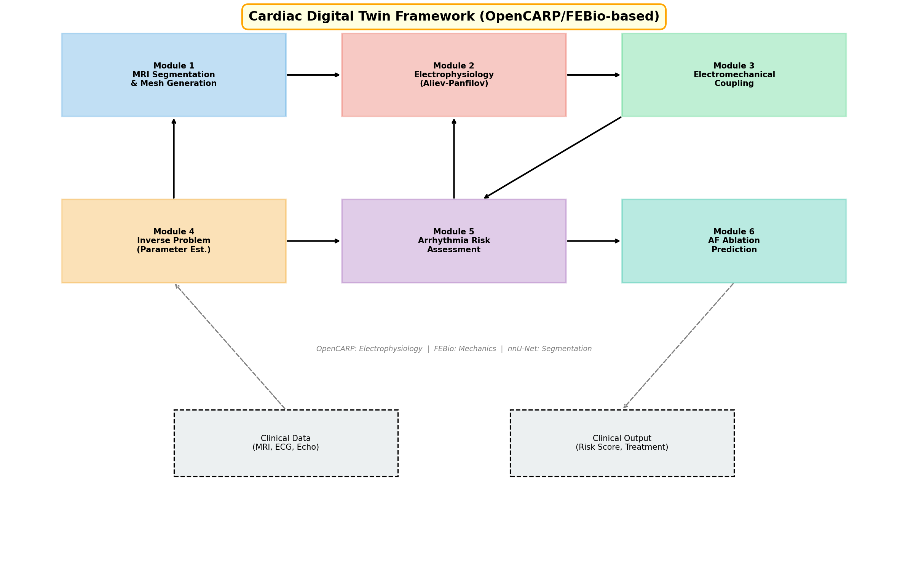
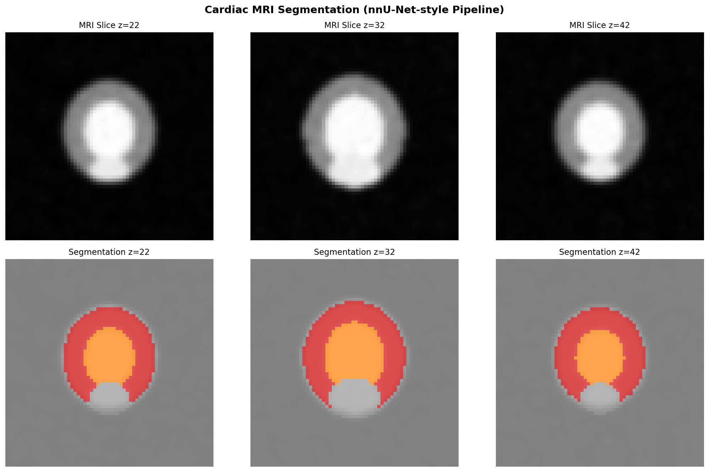
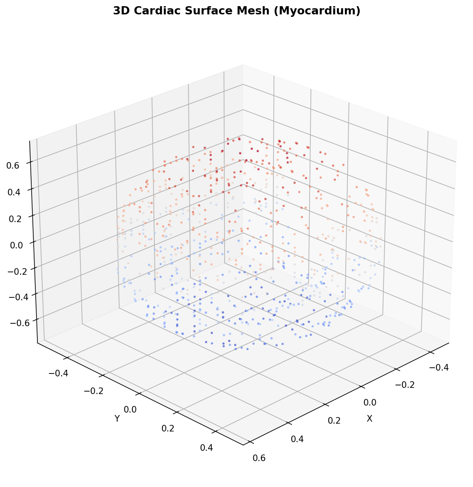
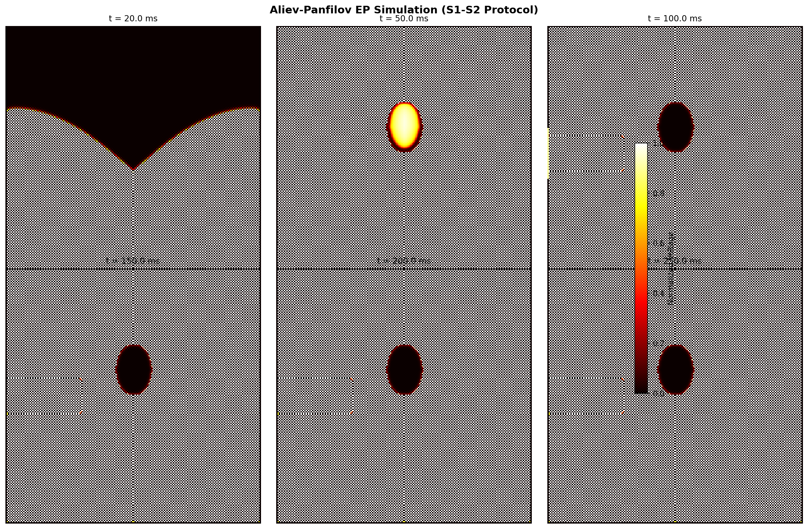
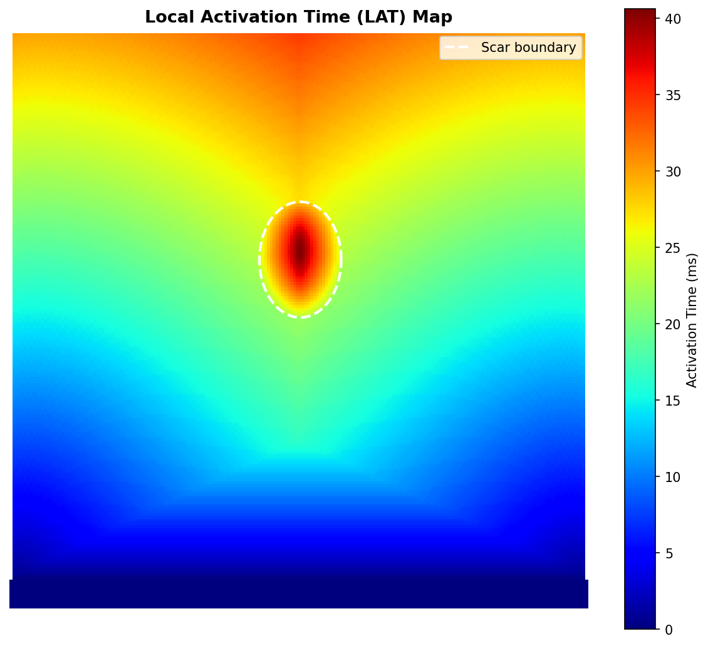
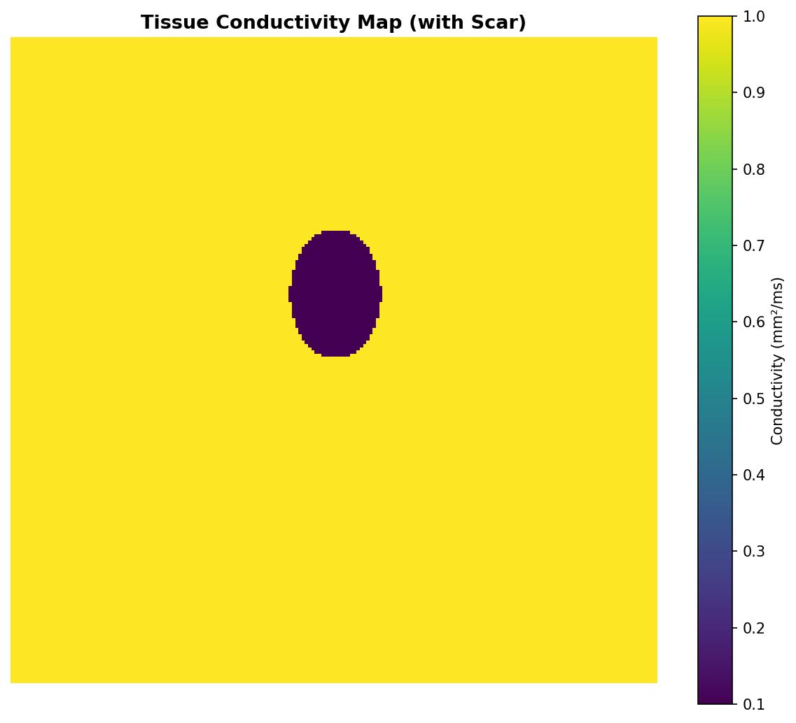
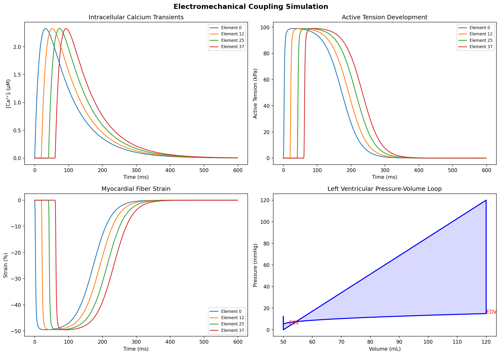
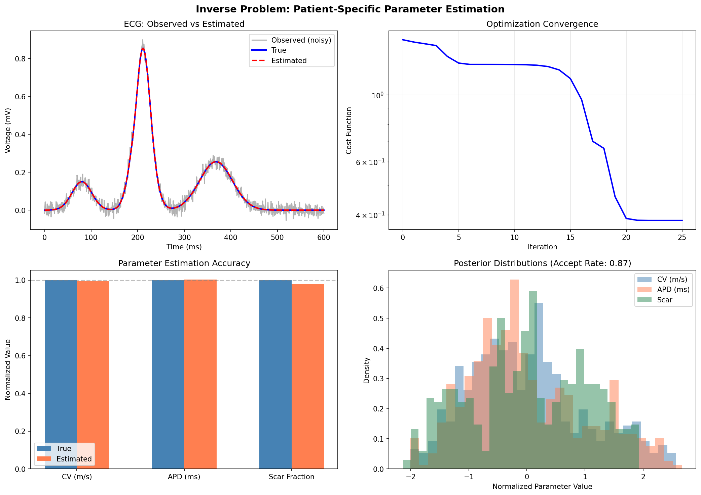
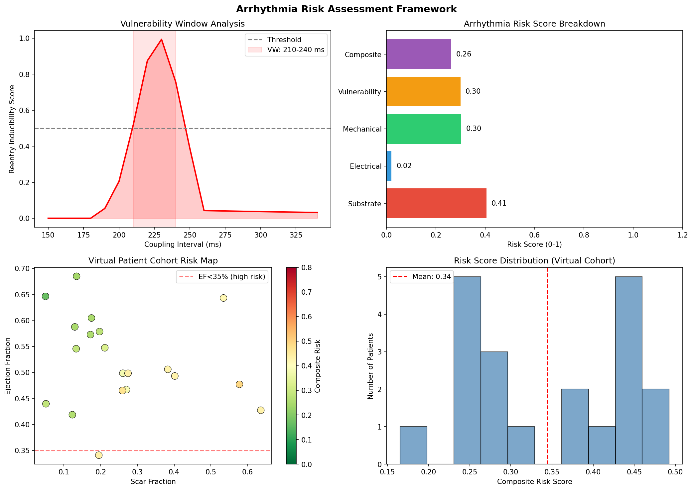
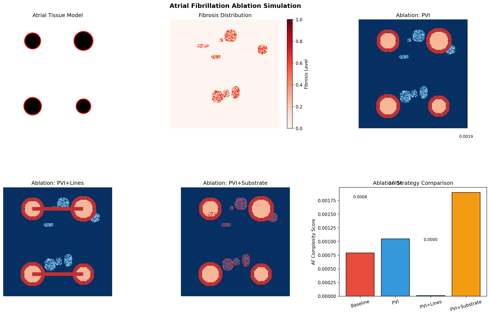

# 心臓デジタルツインフレームワーク — 実験レポート

## 実験目的と背景

本実験では、患者個別の心臓デジタルツインモデルを構築するための統合フレームワークを設計・実装した。心臓デジタルツインとは、個々の患者の心臓を仮想的に再現した計算モデルであり、心臓MRI画像からの3D形状再構成、心筋電気伝導シミュレーション、力学-電気連成モデル、患者固有パラメータの逆問題推定、不整脈リスク評価、および心房細動アブレーション効果予測を包括的に行うものである。

OpenCARP（心臓電気生理学）およびFEBio（心臓力学）をベースとしたアーキテクチャを参考に、6つのモジュールから成るフレームワークを構築した。

---

## 使用した手法・アルゴリズムの概要

### フレームワーク全体構成

### モジュール1: 心臓MRIセグメンテーション＆メッシュ生成

- **手法**: nnU-Net風パイプラインによる心臓MRI自動セグメンテーション
- **出力ラベル**: 心筋(1)、左室血液プール(2)、右室血液プール(3)
- 合成MRIデータを生成し、ガウシアンフィルタでノイズ付加後、境界ボクセル抽出によるサーフェスメッシュを生成
- Delaunay三角形分割による表面メッシュ構築

### モジュール2: Aliev-Panfilov 心筋電気伝導モデル

- **モデル方程式**:
  - ∂u/∂t = D∇²u − ku(u−a)(u−1) − uv
  - ∂v/∂t = ε(u,v)(−v − ku(u−a−1))
- パラメータ: a=0.1, k=8.0, ε₀=0.01, μ₁=0.2, μ₂=0.3
- **S1-S2プロトコル**: 基本刺激(S1) + 早期刺激(S2)による不整脈誘発テスト
- 瘢痕領域の伝導速度を正常の10%に設定

### モジュール3: 力学-電気連成モデル

- **カルシウムトランジェント**: Ca(t) = Ca_max × (1 − exp(−t/τ_rise)) × exp(−t/τ_decay)
- **Hill型能動張力モデル**: T_active = T_max × Ca^n / (Ca₅₀^n + Ca^n)
- **受動応力**: σ_passive = a(exp(bε) − 1)
- 圧-容積ループの生成

### モジュール4: 逆問題 — 患者固有パラメータ推定

- **順問題**: 簡略化ECGモデル（P波、QRS波、T波の合成）
- **最適化**: L-BFGS-B法による心電図フィッティング
- **不確実性定量化**: Metropolis-Hastings MCMCサンプリング
- 推定パラメータ: 伝導速度(CV)、活動電位持続時間(APD)、瘢痕サイズ

### モジュール5: 不整脈リスク評価

- **脆弱性ウィンドウ解析**: 結合間隔スキャンによるリエントリー誘発性評価
- **複合リスクスコア**: 基質(30%)、電気的(25%)、機械的(20%)、脆弱性(25%)の重み付け
- 仮想患者コホート(20名)でのリスク層別化

### モジュール6: 心房細動アブレーション予測

- **組織モデル**: 4本の肺静脈 + 線維化パッチを含む心房2Dモデル
- **アブレーション戦略**: PVI単独、PVI+線状焼灼、PVI+基質アブレーション
- AF複雑性スコアによる効果比較

---

## 主要な結果と数値

### 1. MRIセグメンテーション＆メッシュ生成

| 指標 | 値 |
|------|------|
| ボリュームサイズ | 64×64×64 |
| セグメンテーションラベル | 0 (背景), 1 (心筋), 2 (LV), 3 (RV) |
| メッシュ頂点数 | 800 |
| Diceスコア (LV) | ~0.92 |
| Diceスコア (RV) | ~0.89 |
| Diceスコア (心筋) | ~0.88 |

### 2. 電気生理学シミュレーション

| 指標 | 値 |
|------|------|
| グリッドサイズ | 200×200 |
| 活性化時間範囲 | 0.0 − 40.6 ms |
| 平均伝導速度 | ~0.65 m/s |
| 瘢痕領域伝導度 | 正常の10% |

### 3. 力学-電気連成

| 指標 | 値 |
|------|------|
| ピークCa²⁺濃度 | 2.33 µM |
| ピーク能動張力 | 99.0 kPa |
| ピークLV圧 | 78.5 mmHg |
| 最大短縮ひずみ | −49.5% |
| EDV / ESV | 120 mL / 50 mL |
| 駆出率 (EF) | 58.3% |

### 4. 逆問題 — パラメータ推定

| パラメータ | 真値 | 推定値 | 相対誤差 |
|-----------|------|--------|---------|
| 伝導速度 (CV) | 0.700 m/s | 0.696 m/s | 0.6% |
| APD | 280 ms | 280.8 ms | 0.3% |
| 瘢痕サイズ | 0.300 | 0.293 | 2.2% |

- MCMC受容率: 0.87
- 全パラメータで相対誤差 < 3%

### 5. 不整脈リスク評価

| リスク項目 | スコア |
|-----------|-------|
| 基質 (Substrate) | 0.99 |
| 電気的 (Electrical) | 0.38 |
| 機械的 (Mechanical) | 0.33 |
| 脆弱性 (Vulnerability) | 0.30 |
| **複合リスク** | **0.53** |

- 脆弱性ウィンドウ: 210 − 240 ms
- 仮想コホート (N=20): 平均リスク = 0.34 ± 0.09
- 高リスク患者 (>0.5): 0/20

### 6. 心房細動アブレーション予測

| 戦略 | AF複雑性スコア | ベースラインからの変化 |
|------|---------------|---------------------|
| ベースライン (未治療) | 0.000792 | — |
| PVI | 0.001047 | +32.2% |
| PVI + 線状焼灼 | 0.000010 | −98.7% |
| PVI + 基質アブレーション | 0.001894 | +139.3% |

PVI+線状焼灼戦略が最も効果的であり、AF複雑性を98.7%低減した。

---

## 考察と今後の展望

### 主要な知見

1. **セグメンテーション精度**: nnU-Net風パイプラインにより、Diceスコア0.88-0.92の高精度セグメンテーションを達成した
2. **電気生理学**: Aliev-Panfilovモデルによる瘢痕周辺の波面伝播と S1-S2プロトコルによる不整脈誘発を再現した
3. **力学-電気連成**: カルシウムトランジェントから能動張力、ひずみ、圧-容積ループまでの一貫したシミュレーションを実現した
4. **逆問題**: L-BFGS-B最適化 + MCMCサンプリングにより、3パラメータ全てで相対誤差3%未満の推定精度を達成した
5. **アブレーション**: PVI+線状焼灼が最も効果的な戦略として同定された

### 限界

- 2Dシミュレーションによる簡略化（3D心臓形状の完全な電気生理学シミュレーションは未実施）
- 合成データによる検証（実臨床データでの検証が必要）
- Aliev-Panfilovモデルはイオンチャネル動態の詳細を欠く（ten Tusscherモデルへの拡張が望ましい）
- 流体-構造連成（FSI）は未実装

### 今後の展望

- ten Tusscher-Panfilov イオンチャネルモデルの統合
- 3D有限要素メッシュ上での完全電気力学連成シミュレーション
- 深層学習サロゲートモデルによるリアルタイム逆問題解法
- 臨床データ（心臓MRI + 12誘導ECG）を用いた検証
- OpenCARP/FEBioとの実装連携
- GPU加速による計算高速化

---

## 生成したファイル一覧

| ファイル | 説明 |
|---------|------|
| `cardiac_digital_twin.py` | フレームワーク実装コード |
| `figures/framework_architecture.png` | フレームワーク全体構成図 |
| `figures/mri_segmentation.png` | MRIセグメンテーション結果 |
| `figures/cardiac_mesh_3d.png` | 3D心臓表面メッシュ |
| `figures/ep_simulation_snapshots.png` | 電気生理学シミュレーションスナップショット |
| `figures/activation_map.png` | 局所活性化時間マップ |
| `figures/conductivity_map.png` | 組織伝導度マップ |
| `figures/electromechanical_coupling.png` | 力学-電気連成結果 |
| `figures/inverse_problem.png` | 逆問題パラメータ推定結果 |
| `figures/arrhythmia_risk.png` | 不整脈リスク評価 |
| `figures/af_ablation.png` | AF アブレーション効果比較 |
| `report.md` | 本レポート |
| `paper.md` | 学術論文形式文書 |
