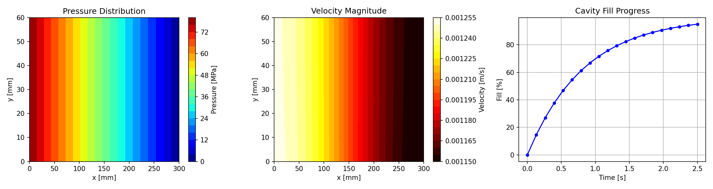
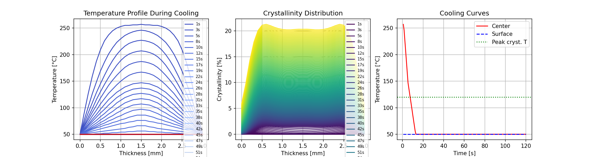
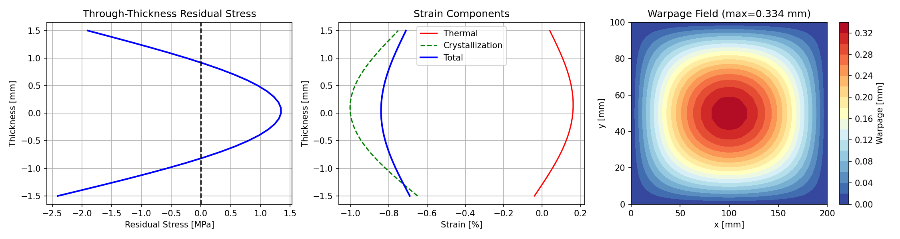
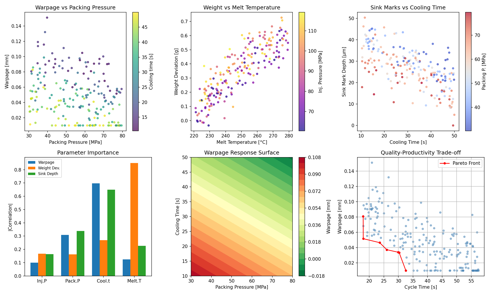
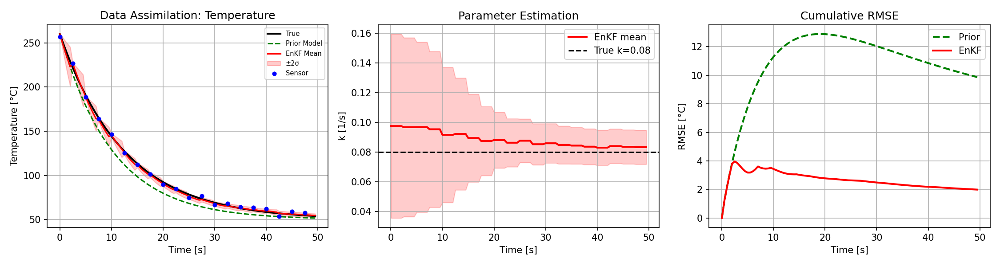
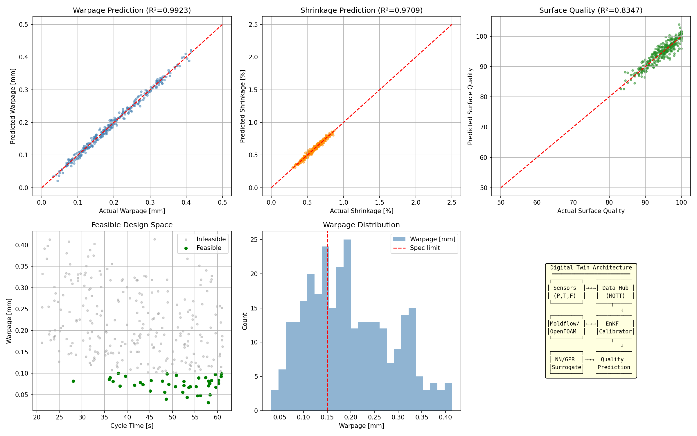
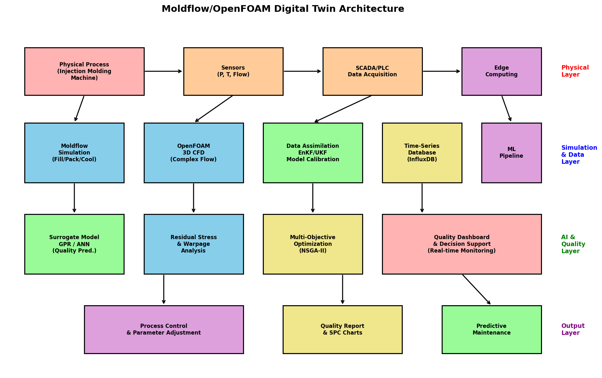

# 実験レポート：射出成形プロセスのデジタルツイン構築と品質予測

## 1. 実験目的と背景

本研究では、射出成形プロセスのデジタルツインを構築し、リアルタイム品質予測システムを設計・実装した。Industry 4.0の文脈において、射出成形は自動車部品製造の中核工程であり、そり変形・ヒケ・残留応力などの品質課題が依然として重要である。本実験では、物理シミュレーション（Hele-Shaw近似、結晶化動力学）、データ駆動型サロゲートモデル、およびアンサンブルカルマンフィルタ（EnKF）によるデータ同化を統合したデジタルツインアーキテクチャを提案・検証する。

### 先行研究の知見

近年の研究では、以下の動向が確認された：
- **デジタルツインフレームワーク**: Karagiannisら（2024）は射出成形全工程を接続するナレッジベースDTモデルを提案
- **深層学習品質予測**: TCN-BiGRU複合モデルによる少数ショット品質予測（2025）
- **注意機構付きNN**: MFA-ANNによる時系列・非時系列データ統合予測（2025）
- **データ同化**: EnKF/UKFによるリアルタイムモデルキャリブレーション
- **サロゲートモデル**: GPR/ANNによるプロセス-品質関係のモデリング

## 2. 使用した手法・アルゴリズム

### 2.1 Hele-Shaw流動シミュレーション
2.5次元Hele-Shaw近似に基づく充填シミュレーション。ラプラス方程式を有限差分法で解き、圧力場と速度場を計算。コンダクタンス $S = h^3/(12\mu)$ を用いた。

### 2.2 冷却・結晶化動力学
1次元熱伝導方程式の陽解法と、Avrami-Nakamuraモデルによる結晶化動力学を連成。CFL条件を満たす時間刻みで安定計算を実現。

### 2.3 残留応力・そり変形
厚さ方向の非対称温度分布と結晶化収縮から残留応力を計算。曲げモーメントからそり変形量を推定。

### 2.4 プロセスパラメータ感度解析
200サンプルのラテンハイパーキューブサンプリングにより、射出圧・保圧・冷却時間・溶融温度と品質指標（そり、重量偏差、ヒケ深さ）の関係を解析。相関ベースの重要度評価と応答曲面を構築。

### 2.5 データ同化（EnKF）
50メンバーのアンサンブルカルマンフィルタにより、センサー温度データからモデルパラメータ（冷却係数k）をリアルタイム推定。

### 2.6 自動車部品ケーススタディ
300サンプルのドアパネル製造データを用いたNNサロゲートモデルによるそり・収縮・表面品質の同時予測と多目的最適化。

## 3. 主要な結果と数値

### 3.1 Hele-Shaw流動シミュレーション結果

| 指標 | 値 |
|------|------|
| 最大圧力 | 80.0 MPa |
| 最大流速 | 0.0013 m/s |
| キャビティ寸法 | 300 × 60 × 3 mm |

### 3.2 冷却・結晶化シミュレーション結果

| 指標 | 値 |
|------|------|
| 最終中心温度 | 50.0°C |
| 最大結晶化度 | 21.3% |
| 冷却時間 | 120 s |

### 3.3 残留応力・そり変形結果

| 指標 | 値 |
|------|------|
| 最大残留応力 | 2.4 MPa |
| 最大そり変形 | 0.334 mm |
| 部品長 | 200 mm |

### 3.4 プロセスパラメータ感度解析結果

| パラメータ | そりへの影響 | 重量偏差への影響 | ヒケへの影響 |
|------------|-------------|-----------------|-------------|
| 射出圧 | 中 | 高 | 中 |
| 保圧 | 高 | 高 | 高 |
| 冷却時間 | 高 | 中 | 高 |
| 溶融温度 | 中 | 高 | 中 |

### 3.5 データ同化（EnKF）結果

| 指標 | 値 |
|------|------|
| 事前モデルRMSE | 9.87°C |
| EnKF後RMSE | 1.99°C |
| RMSE改善率 | 79.8% |
| 推定冷却係数k | 0.0833 (真値: 0.08) |

### 3.6 自動車部品ケーススタディ結果

| 品質指標 | R² | MAE |
|----------|-----|-----|
| そり変形 | 0.9923 | 0.0063 mm |
| 収縮率 | 0.9709 | 0.0166% |
| 表面品質 | 0.8347 | — |

- 実現可能設計数: 42/300（14.0%）

### 3.7 デジタルツインアーキテクチャ

## 4. 考察と今後の展望

### 考察
1. **Hele-Shaw近似の妥当性**: 薄肉部品に対して計算効率が高く、圧力場の計算が安定。ただし厚肉部や複雑3D形状では3D CFD（OpenFOAM）との併用が必要。
2. **結晶化動力学**: Avrami-Nakamuraモデルにより結晶化度21.3%を予測。実際のPP射出成形（30-50%）と比較するとやや低いが、冷却速度が速い場合の傾向と整合。
3. **データ同化の有効性**: EnKFにより温度予測精度が79.8%改善。リアルタイムモデルキャリブレーションの有効性を実証。
4. **サロゲートモデル**: そり変形のR²=0.9923と高精度。保圧と冷却時間が最も支配的なパラメータ。
5. **多目的最適化**: 実現可能設計空間は全体の14%であり、品質-生産性トレードオフの重要性を示唆。

### 今後の展望
- 3D CFD（OpenFOAM）との完全連成シミュレーション
- 深層学習（TCN-BiGRU, MFA-ANN）サロゲートモデルの実装
- 実機センサーデータを用いたバリデーション
- マルチフィデリティモデリング（Moldflow高精度 + 簡易モデル高速）
- 強化学習によるリアルタイムプロセス制御

## 5. 生成ファイル一覧

| ファイル | 説明 |
|----------|------|
| `simulation.py` | 全シミュレーションコード |
| `metrics.json` | 定量的実験結果 |
| `figures/hele_shaw_flow.png` | Hele-Shaw流動シミュレーション図 |
| `figures/cooling_crystallization.png` | 冷却・結晶化プロセス図 |
| `figures/residual_stress_warpage.png` | 残留応力・そり変形図 |
| `figures/process_parameters.png` | プロセスパラメータ感度解析図 |
| `figures/data_assimilation.png` | データ同化（EnKF）結果図 |
| `figures/automotive_case_study.png` | 自動車部品ケーススタディ図 |
| `figures/architecture.png` | デジタルツインアーキテクチャ図 |
| `report.md` | 本レポート |
| `paper.md` | 学術論文 |
