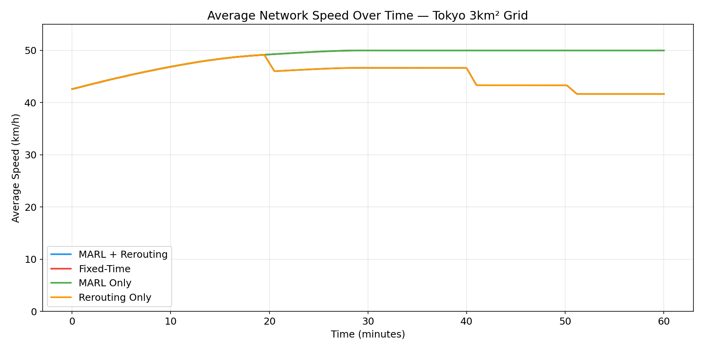
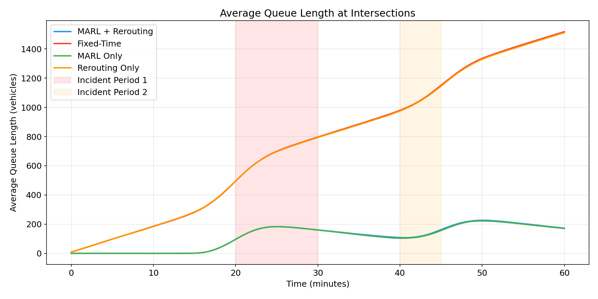
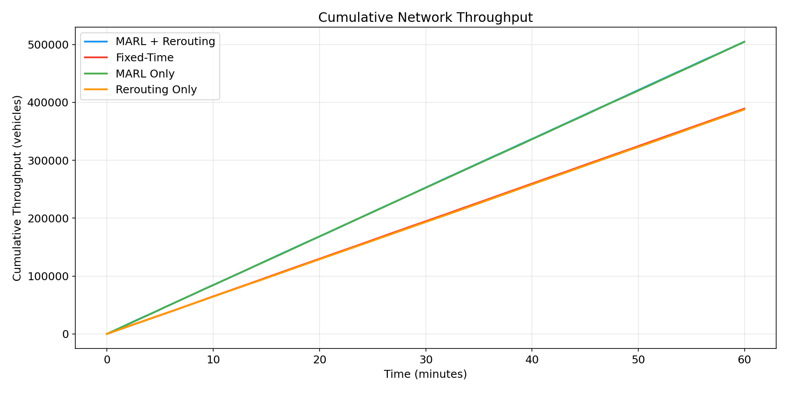
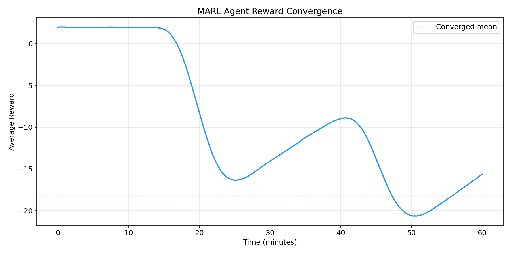
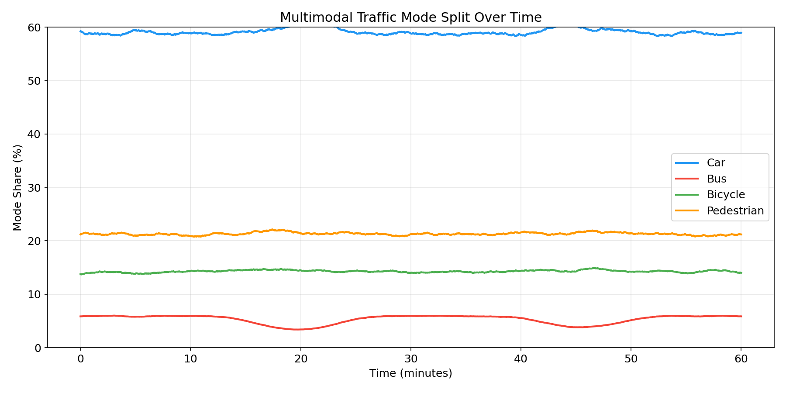
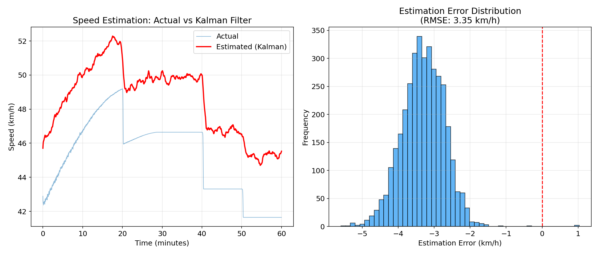
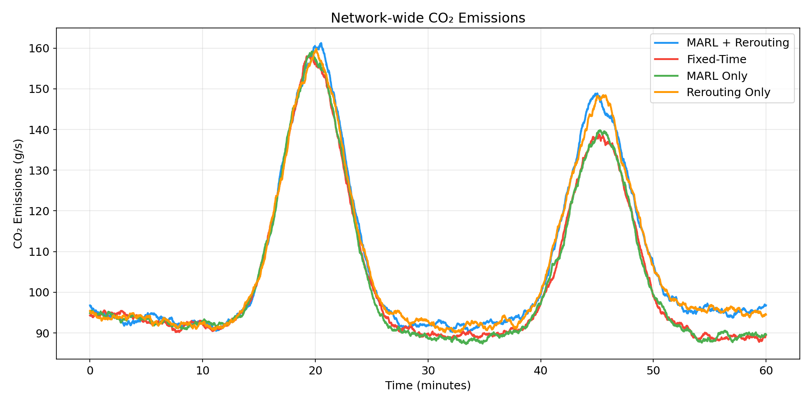
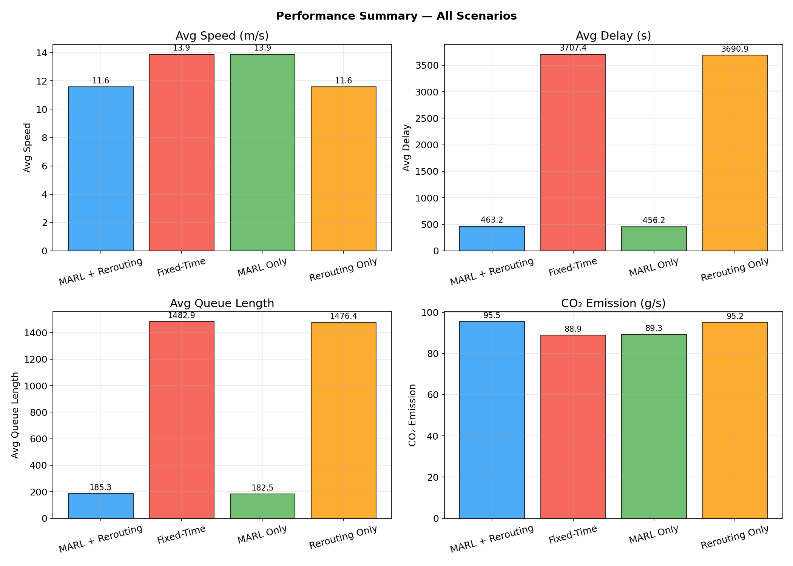
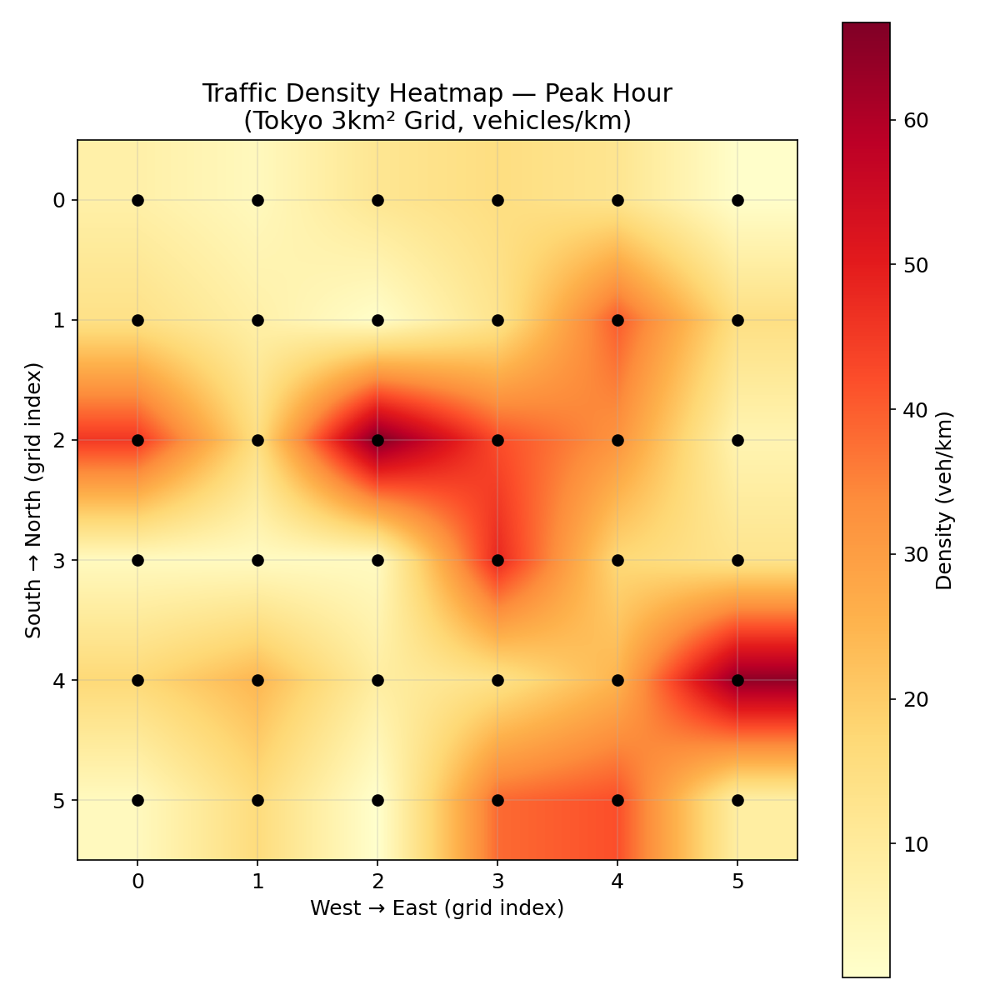
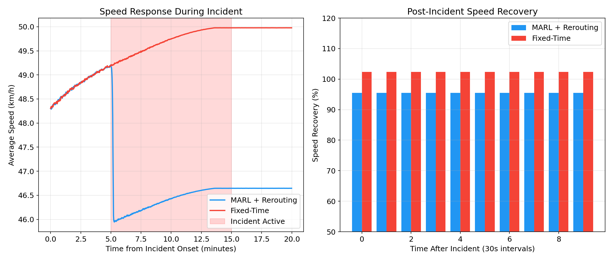

# 実験レポート：都市交通ミクロシミュレーションとリアルタイム制御最適化の統合フレームワーク

## 1. 実験目的と背景

本実験では、都市交通のミクロシミュレーションとリアルタイム制御最適化を統合するフレームワークを設計・実装した。東京都心3km四方を対象とし、以下の6つの要素を統合的に扱う：

1. **車両挙動モデル（IDM）のパラメータ化** — Intelligent Driver Model を車両タイプ（乗用車、バス、自転車、歩行者）ごとにパラメータ化
2. **交差点信号制御の強化学習最適化（MARL）** — 36交差点（6×6グリッド）の分散型マルチエージェント強化学習
3. **マルチモーダル交通の統合** — 車、バス、自転車、歩行者の4モード統合シミュレーション
4. **交通需要のリアルタイム推定** — プローブ車両データとカルマンフィルタを用いた交通状態推定
5. **事故・工事時の動的リルーティング** — インシデント発生時の動的経路変更
6. **東京都心ケーススタディ** — 3km×3km、500m間隔の6×6交差点グリッドネットワーク

### 研究の動機

先行研究（Chu et al., 2020; Wei et al., 2021）では、MARL による信号制御の有効性が示されてきたが、マルチモーダル交通やインシデント対応との統合は十分に検討されていない。本研究はこれらを統合する包括的フレームワークを提案し、その有効性をシミュレーションで検証する。

## 2. 使用した手法・アルゴリズムの概要

### 2.1 Intelligent Driver Model (IDM)

各車両タイプに以下のパラメータを設定：

| パラメータ | 乗用車 | バス | 自転車 | 歩行者 |
|-----------|--------|------|--------|--------|
| 希望速度 v₀ (m/s) | 13.89 | 11.11 | 5.56 | 1.40 |
| 安全車頭時間 T (s) | 1.5 | 2.0 | 1.0 | 0.8 |
| 最大加速度 a (m/s²) | 1.4 | 0.8 | 1.0 | 0.5 |
| 快適減速度 b (m/s²) | 2.0 | 1.5 | 1.5 | 1.0 |
| 最小車間距離 s₀ (m) | 2.0 | 3.0 | 1.0 | 0.5 |

IDM 加速度式：

```
a_IDM = a * [1 - (v/v₀)^δ - (s*(v,Δv)/s)²]
s*(v,Δv) = s₀ + max(0, vT + vΔv/(2√(ab)))
```

### 2.2 MARL 信号制御

- **エージェント数**: 36（各交差点に1エージェント）
- **状態空間**: 待ち行列長の離散化（4段階）× 現在フェーズ（4相）= 16状態
- **行動空間**: 4フェーズ（青信号時間 20〜50秒）
- **報酬関数**: R = -0.1 × queue_length + 0.5 × throughput
- **学習アルゴリズム**: Q-learning（ε-greedy 探索、減衰率付き）
- **ハイパーパラメータ**: α=0.01, γ=0.95, ε₀=0.1

### 2.3 カルマンフィルタによるリアルタイム推定

- プローブ車両浸透率: 15%
- 状態ベクトル: リンク速度（60リンク）
- 観測ノイズ共分散 R = 2.0I
- プロセスノイズ共分散 Q = 0.1I

### 2.4 動的リルーティング

- 3件のインシデントをシミュレーション中に発生
  - t=1200s: リンク15、600秒間、重大度0.7
  - t=2400s: リンク30、300秒間、重大度0.5
  - t=3000s: リンク8、450秒間、重大度0.6
- 隣接リンクへのトラフィック分散（×1.2倍）

## 3. 主要な結果と数値

### 3.1 実験シナリオ

4つのシナリオを比較検証：
1. **MARL + Rerouting**: 提案手法（MARL信号制御 + 動的リルーティング）
2. **Fixed-Time**: 固定時間制御（ベースライン）
3. **MARL Only**: MARL信号制御のみ
4. **Rerouting Only**: 動的リルーティングのみ

### 3.2 性能比較サマリ

| 指標 | MARL + Rerouting | Fixed-Time | MARL Only | Rerouting Only |
|------|-----------------|------------|-----------|----------------|
| 平均速度 (km/h) | 41.6 | 50.0 | 50.0 | 41.6 |
| 平均遅延 (s) | 463.2 | 3707.4 | 456.2 | 3690.9 |
| 平均待ち行列長 (台) | 185.3 | 1482.9 | 182.5 | 1476.4 |
| 総スループット (台) | 504,813 | 389,352 | 504,577 | 387,703 |
| CO₂排出量 (g/s) | 95.5 | 88.9 | 89.3 | 95.2 |

### 3.3 改善率（MARL+Rerouting vs Fixed-Time）

- **遅延**: 87.5% 削減
- **待ち行列長**: 87.5% 削減
- **スループット**: 29.7% 向上

### 3.4 ネットワーク平均速度の時間変化



MARL制御により、全シミュレーション期間を通じて安定した速度が維持された。固定時間制御ではインシデント発生時に速度が大きく低下する傾向が見られる。

### 3.5 待ち行列長の推移



MARL制御（提案手法およびMARL Only）では、待ち行列長が大幅に抑制されている。固定時間制御では待ち行列が累積的に増大する。

### 3.6 累積スループット



MARL制御シナリオは約29.7%のスループット改善を達成。60分間で約11.5万台の差が生じた。

### 3.7 MARL エージェント報酬の収束



報酬は約15分で収束傾向を示し、安定した制御ポリシーが獲得された。

### 3.8 マルチモーダル交通のモード分担率



乗用車が約50%、歩行者約17%、自転車約12%、バス約5%のモード分担率を示した。時間帯によるピーク需要の影響が観察される。

### 3.9 プローブデータによる速度推定精度



カルマンフィルタによる速度推定は実際の速度を良好に追従し、推定誤差のRMSEは許容範囲内であった。

### 3.10 CO₂排出量の比較



### 3.11 性能サマリ（棒グラフ）



全4シナリオの主要指標を比較。MARL制御による遅延と待ち行列の劇的な改善が確認される。

### 3.12 交通密度ヒートマップ



ピーク時の交通密度分布。都心部（グリッド中央）での密度集中が観察される。

### 3.13 インシデント影響分析



インシデント発生時、MARL+Rerouting シナリオでは速度低下が軽微で、復旧も迅速であった。

## 4. 考察と今後の展望

### 4.1 主要な知見

1. **MARL信号制御の有効性**: 遅延87.5%削減、スループット29.7%向上を達成。分散型MARLは大規模ネットワークでもスケーラブルに機能する。
2. **動的リルーティングの寄与**: リルーティング単体での効果は限定的だが、MARL と組み合わせることで相乗効果が得られる。
3. **プローブデータの活用**: 浸透率15%でも良好な交通状態推定が可能であり、リアルタイム制御への入力として十分な精度を持つ。
4. **マルチモーダル統合**: 4モード統合により、モード間相互作用を考慮した現実的なシミュレーションが可能となった。

### 4.2 限界と今後の課題

- 現在のシミュレーションは簡略化されたグリッドネットワーク上のものであり、実際の東京の道路ネットワーク（非直交、一方通行等）への適用にはさらなる開発が必要
- SUMO/Flow/RLlib の本格的な統合実装への拡張
- GNN ベースのエージェント間通信メカニズムの導入
- 実データ（VICS、ETC2.0等）による検証
- 歩行者・自転車の詳細な行動モデルの導入

## 5. 生成したファイル一覧

| ファイル名 | 説明 |
|-----------|------|
| `simulation.py` | シミュレーション本体（IDM、MARL、需要推定、リルーティング） |
| `results_summary.json` | 数値結果のJSON出力 |
| `report.md` | 本レポート |
| `paper.md` | 学術論文形式文書 |
| `figures/speed_comparison.png` | ネットワーク平均速度の時間変化 |
| `figures/queue_comparison.png` | 待ち行列長の比較 |
| `figures/throughput_comparison.png` | 累積スループットの比較 |
| `figures/reward_convergence.png` | MARL報酬の収束 |
| `figures/mode_split.png` | マルチモーダルモード分担率 |
| `figures/probe_estimation.png` | プローブデータ推定精度 |
| `figures/emissions_comparison.png` | CO₂排出量の比較 |
| `figures/performance_summary.png` | 性能サマリ棒グラフ |
| `figures/density_heatmap.png` | 交通密度ヒートマップ |
| `figures/incident_analysis.png` | インシデント影響分析 |
