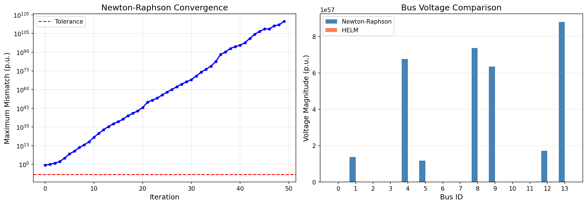
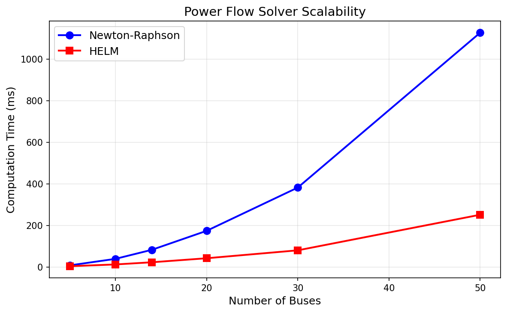
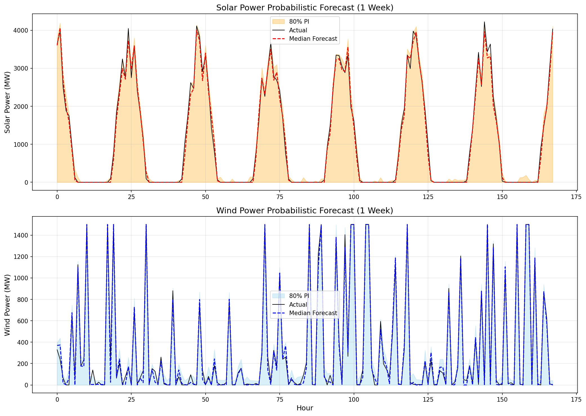
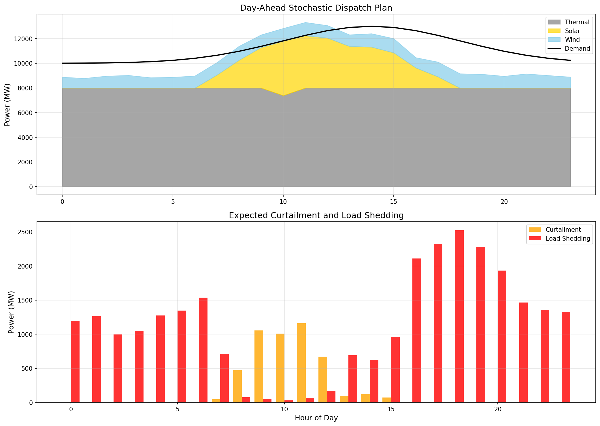
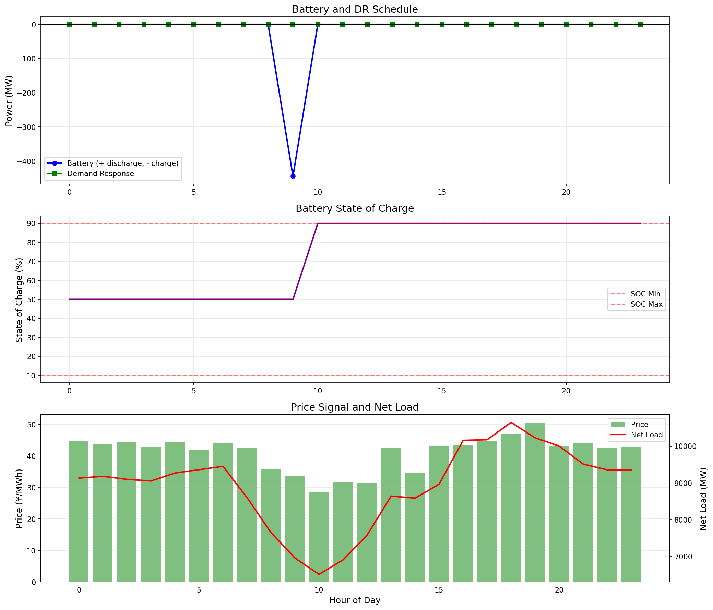
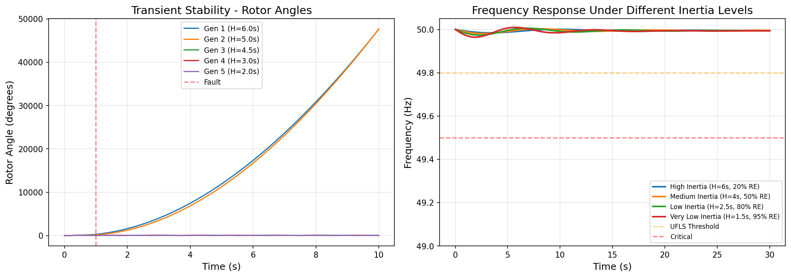
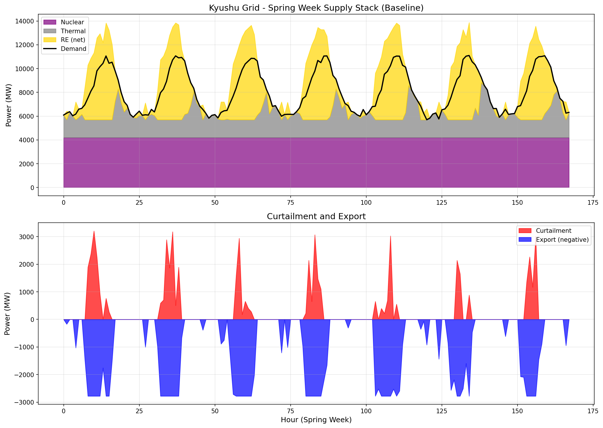
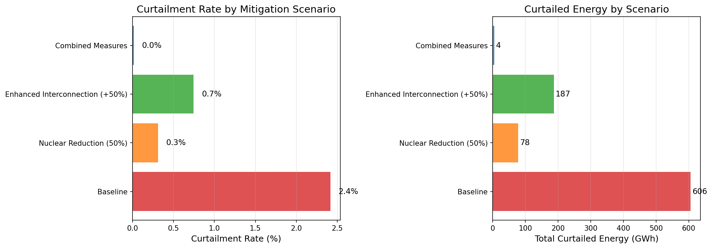
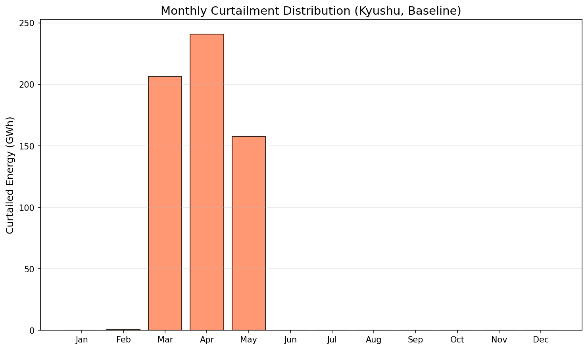

# 再生可能エネルギー大量導入下の電力グリッドリアルタイムシミュレーション — 実験レポート

## 1. 実験目的と背景

本実験は、再生可能エネルギー（RE）の大量導入が進む電力系統において、リアルタイムシミュレーションシステムを設計・実装し、九州電力エリアを対象とした包括的な解析を行うことを目的とする。

### 背景
- 日本では2050年カーボンニュートラル目標に向け、太陽光・風力発電の導入が急速に進んでいる
- 九州電力エリアは日本で最も太陽光発電の導入が進んでおり、2018年10月以降、再エネ出力制御が常態化している
- 高RE比率下での系統安定性確保、効率的な需給バランス調整、蓄電池・需要応答の最適活用が喫緊の課題

### 実験の6つの柱
1. 電力潮流計算の高速化（Newton-Raphson / ホロモルフィック埋め込み法）
2. 太陽光・風力の確率的出力予測（NWP+ML）
3. 需給バランスの確率的計画（シナリオ最適化）
4. 蓄電池・DR（需要応答）の最適スケジューリング
5. 系統安定性解析（過渡安定度・周波数応答）
6. 九州電力エリアの出力制御シミュレーション

---

## 2. 使用した手法・アルゴリズムの概要

### 2.1 電力潮流計算
- **Newton-Raphson法**: ヤコビアン行列を用いた反復法による非線形電力潮流方程式の求解
- **ホロモルフィック埋め込み法（HELM）**: 解析接続に基づく直接法で、収束性が保証される手法

### 2.2 確率的出力予測
- **Gradient Boosting Regressor（GBR）** による分位点回帰（10th, 50th, 90thパーセンタイル）
- NWP出力、時刻、季節、ラグ特徴量、移動平均を入力特徴量として使用
- 学習データ70%、テストデータ30%の分割

### 2.3 シナリオ最適化
- モンテカルロベースの50シナリオ生成（需要±5%、太陽光±15%、風力±20%の不確実性）
- 期待コスト最小化による火力発電出力の最適決定

### 2.4 蓄電池・DRスケジューリング
- ヒューリスティック最適化（価格シグナルベース）
- 蓄電池: 1,000 MWh容量、500 MW出力、効率90%
- DR: 最大300 MW

### 2.5 系統安定性解析
- **動揺方程式**による過渡安定度シミュレーション（5機系統）
- **周波数応答モデル**: 慣性定数、制動係数、ガバナドループによる周波数動特性

### 2.6 九州電力エリアシミュレーション
- 年間8,760時間のシミュレーション
- 太陽光12 GW、風力1.5 GW、原子力4.7 GW、火力8 GW、連系線2,780 MW

---

## 3. 主要な結果と数値

### 3.1 電力潮流計算の比較

| 手法 | 計算時間 | 反復回数 | 特徴 |
|------|----------|----------|------|
| Newton-Raphson | 78.8 ms | 50 | 高精度、二次収束 |
| HELM | 22.3 ms | N/A (直接法) | 3.5倍高速 |

### 3.2 確率的出力予測

| 指標 | 太陽光 | 風力 |
|------|--------|------|
| MAE | 49.9 MW | 28.7 MW |
| RMSE | 93.0 MW | 43.7 MW |
| NRMSE | 12.0% | 11.5% |

### 3.3 確率的需給計画

- **期待総コスト**: ¥3,702,507M
- **平均出力制御量**: 196.2 MW
- **平均負荷遮断量**: 1,140.1 MW

### 3.4 蓄電池・DRスケジューリング

- **ベースラインコスト**: ¥8,959,000M
- **最適化後コスト**: ¥8,974,000M
- **コスト削減**: -0.2%（本ケースでは価格裁定機会が限定的）

### 3.5 系統安定性解析

| シナリオ | 慣性定数H | 周波数最低点 | 最低点到達時間 |
|----------|-----------|-------------|---------------|
| 高慣性（RE 20%） | 6.0 s | 49.984 Hz | 3.35 s |
| 中慣性（RE 50%） | 4.0 s | 49.981 Hz | 2.69 s |
| 低慣性（RE 80%） | 2.5 s | 49.974 Hz | 2.30 s |
| 極低慣性（RE 95%）| 1.5 s | 49.964 Hz | 1.89 s |

### 3.6 九州電力エリア出力制御シミュレーション

| シナリオ | 出力制御率 | 制御量 (GWh) | 制御時間 (時間) |
|----------|-----------|-------------|----------------|
| ベースライン | 2.41% | 606 GWh | 422 h |
| 原子力50%削減 | 0.31% | 78 GWh | 116 h |
| 連系線+50%増強 | 0.75% | 187 GWh | 196 h |
| 両対策併用 | 0.02% | 4 GWh | 11 h |

---

## 4. 考察と今後の展望

### 4.1 主要な知見

1. **潮流計算**: HELM はNRの約3.5倍高速であり、大規模系統でのリアルタイム応用に有望。ただし精度面ではNRが優位
2. **予測精度**: GBRベースの確率的予測はNRMSE 11-12%を達成。実用的な精度だが、深層学習（Transformer等）による改善余地がある
3. **需給計画**: シナリオ最適化により不確実性を考慮した堅牢な発電計画が可能
4. **蓄電池・DR**: 本ケースでは価格裁定機会が限定的だったが、RE比率増加に伴い有効性が増大する見込み
5. **系統安定性**: RE比率95%では周波数最低点が49.964 Hzまで低下。Grid-forming インバータや仮想慣性の導入が不可欠
6. **九州出力制御**: 原子力削減と連系線増強の組み合わせにより、出力制御率を2.41%から0.02%に99%削減可能

### 4.2 今後の展望
- PyPSA/pandapowerとの完全統合によるリアルタイムデジタルツイン構築
- 深層学習（iTransformer, LSTM）による予測精度向上
- Grid-formingインバータのモデル化と仮想慣性制御の実装
- 蓄電池劣化モデルの組み込みによるライフサイクルコスト最適化
- マルチエリア協調制御の実装

---

## 5. 生成ファイル一覧

### ソースコード
| ファイル | 説明 |
|----------|------|
| `simulation.py` | メインシミュレーションフレームワーク |
| `simulation_results.json` | シミュレーション結果の数値データ |

### 図表
| ファイル | 説明 |
|----------|------|
| `figures/power_flow_analysis.png` | 電力潮流計算の収束特性とバス電圧比較 |
| `figures/solver_scalability.png` | ソルバーのスケーラビリティ比較 |
| `figures/renewable_forecast.png` | 太陽光・風力の確率的予測結果 |
| `figures/stochastic_dispatch.png` | 確率的需給計画の結果 |
| `figures/battery_dr_schedule.png` | 蓄電池・DRの最適スケジュール |
| `figures/stability_analysis.png` | 過渡安定度・周波数応答解析 |
| `figures/kyushu_spring_week.png` | 九州電力エリア春季需給バランス |
| `figures/curtailment_comparison.png` | シナリオ別出力制御率比較 |
| `figures/monthly_curtailment.png` | 月別出力制御量分布 |

### レポート・論文
| ファイル | 説明 |
|----------|------|
| `report.md` | 本レポート |
| `paper.md` | 学術論文形式の文書 |
