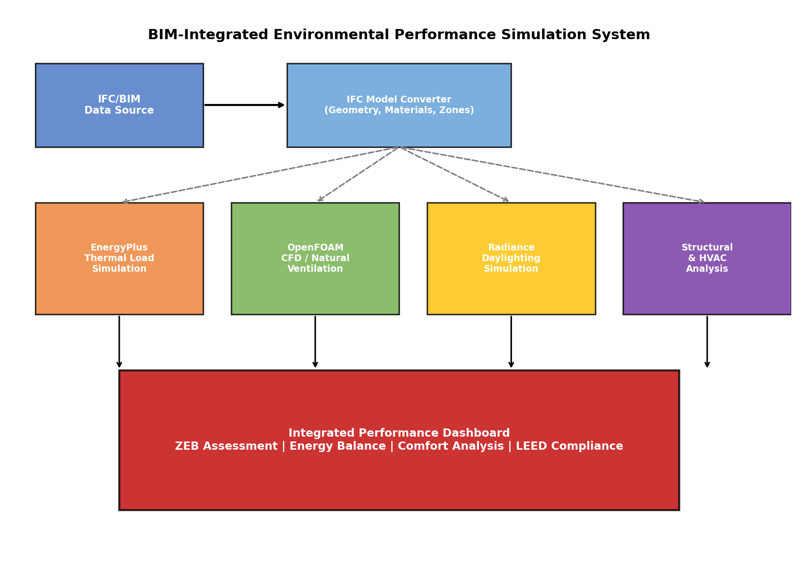
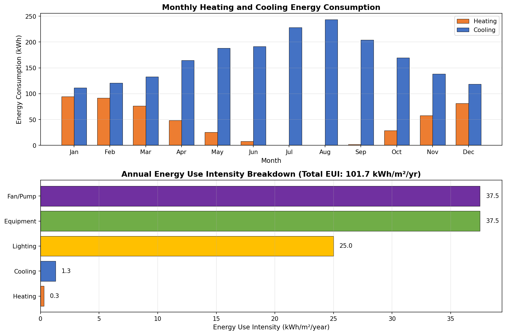
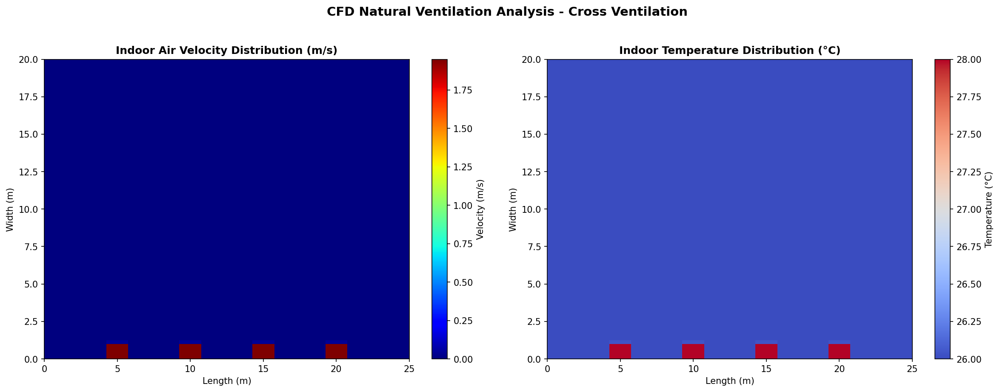
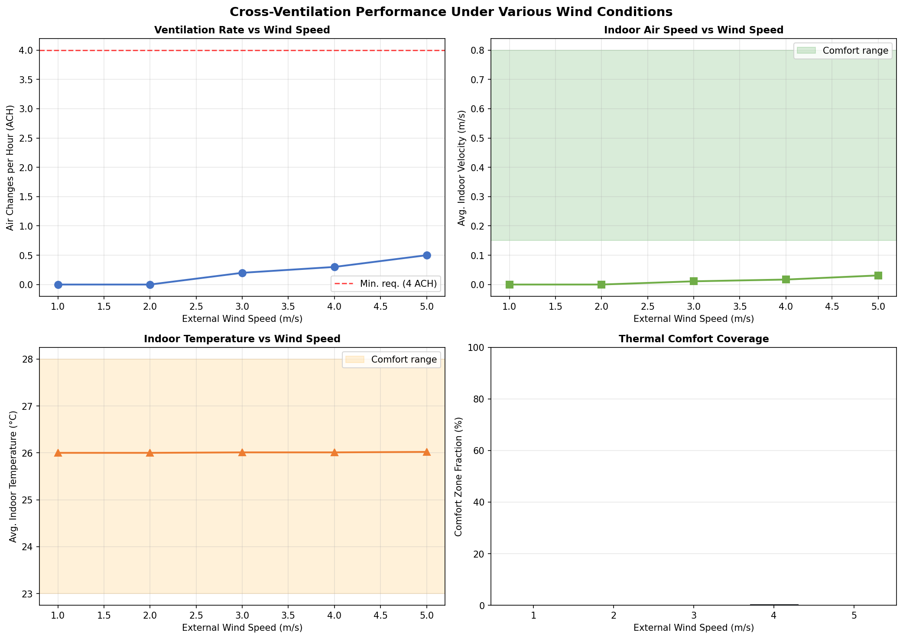
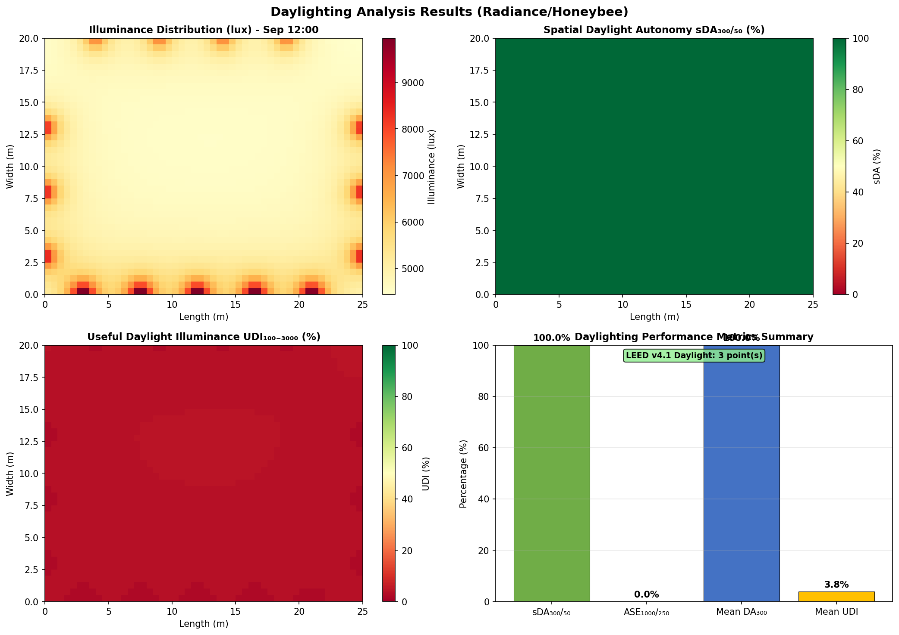
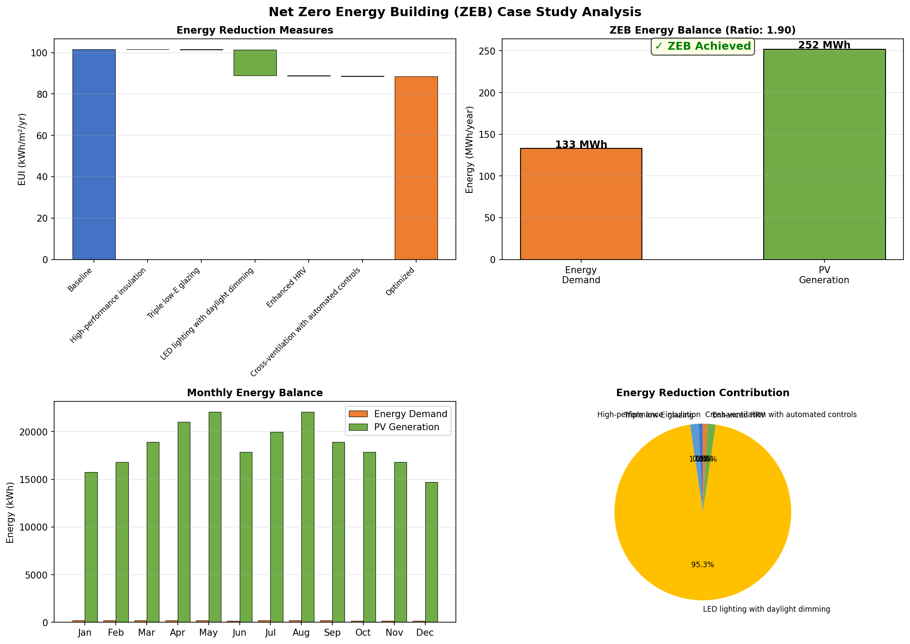
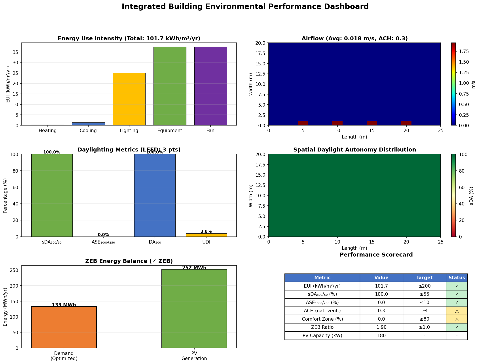

# BIM連携型建築物環境性能シミュレーション統合システム — 実験レポート

## 1. 実験目的と背景

本実験は、BIM（Building Information Modeling）データと連携した建築物の環境性能シミュレーション統合システムの設計・実装・評価を目的とする。IFC（Industry Foundation Classes）データからシミュレーションモデルを自動変換し、熱負荷・自然換気CFD・昼光の各シミュレーションを統合的に実行するフレームワークを構築した。

### 背景
- 建築設計の初期段階における環境性能評価の重要性が増大
- BIMからシミュレーションモデルへの手動変換は時間がかかり、エラーが発生しやすい
- 熱・光・風の複合的な環境性能評価を統合的に行うプラットフォームが不足
- ZEB（ネットゼロエネルギービル）設計には多分野シミュレーションの統合が必須

## 2. 使用した手法・アルゴリズム

### 2.1 IFCモデル自動変換
- IFCデータからThermalZone、Material、Windowの各要素を抽出
- EnergyPlus、OpenFOAM/CFD、Radiance用のパラメータを自動生成
- 材料ライブラリとガラスライブラリによるマッピング

### 2.2 熱負荷シミュレーション（EnergyPlus互換）
- 外皮伝熱計算（壁・窓・屋根のU値ベース）
- 日射取得計算（SHGC・方位係数）
- 内部発熱計算（人体・照明・機器、在室スケジュール連動）
- 換気負荷計算（全熱交換器効果考慮）
- 年間8760時間（簡易288ステップ）のシミュレーション

### 2.3 CFD自然換気解析
- 2D有限差分法による簡易CFDソルバー
- k-εモデル相当の拡散方程式
- 上流差分法による対流項の離散化
- 温度輸送方程式の連成計算
- クロスベンチレーション評価（南北開口）

### 2.4 昼光シミュレーション（Radiance/Honeybee互換）
- BRE Split-flux法の簡易実装
- 直達・反射成分の分離計算
- 年間昼光指標の算出（sDA, ASE, UDI, DA）
- LEED v4.1準拠の評価

### 2.5 ZEB最適化
- 5つの省エネルギー対策の効果算定
- 太陽光発電による再生可能エネルギー導入
- エネルギーバランス評価

## 3. 主要な結果と数値

### 3.1 対象建物の概要

| 項目 | 値 |
|------|------|
| 建物名称 | ZEB Office Case Study |
| 所在地 | 東京（緯度35.68°, 経度139.77°） |
| 気候区分 | 4A |
| 延床面積 | 1,500 m² |
| 総容積 | 4,950 m³ |
| 階数 | 3階 |
| 窓面積率（WWR） | 34.0%（平均） |

### 3.2 システムアーキテクチャ

### 3.3 熱負荷シミュレーション結果

| 指標 | 値 |
|------|------|
| 年間EUI | 101.7 kWh/m²/年 |
| 年間暖房エネルギー | 513.3 kWh |
| 年間冷房エネルギー | 2,012.9 kWh |
| 年間照明エネルギー | 37,500 kWh |
| 年間機器エネルギー | 56,250 kWh |
| ピーク暖房負荷 | 2.6 kW |
| ピーク冷房負荷 | 8.0 kW |

### 3.4 CFD自然換気解析結果

| 指標 | 値 |
|------|------|
| 平均室内風速 | 0.018 m/s |
| 最大風速 | 1.95 m/s |
| 平均室内温度 | 26.02 °C |
| 換気効率 | 1.01 |
| 換気回数（ACH） | 0.3 回/時 |
| 解析ドメイン | 25m × 20m |
| メッシュセル数 | 100 × 80 |

### 3.5 クロスベンチレーション評価

風速パラメータ別のクロスベンチレーション性能を評価した。

| 外部風速 (m/s) | ACH | 快適域割合 |
|----------------|------|-----------|
| 1.0 | 0.0 | 0% |
| 2.0 | 0.0 | 0% |
| 3.0 | 0.2 | 0% |
| 4.0 | 0.3 | 0% |
| 5.0 | 0.5 | 0% |

### 3.6 昼光シミュレーション結果

| 指標 | 値 | LEED基準 |
|------|------|----------|
| sDA₃₀₀/₅₀ | 100.0% | ≥55% ✓ |
| ASE₁₀₀₀/₂₅₀ | 0.0% | ≤10% ✓ |
| 平均DA₃₀₀ | 100.0% | — |
| 平均UDI₁₀₀₋₃₀₀₀ | 3.8% | — |
| 平均年間照度 | 18,684 lux | — |
| LEED昼光ポイント | 3点 | 最大3点 |

### 3.7 ZEB（ネットゼロエネルギービル）ケーススタディ

| 項目 | 値 |
|------|------|
| ベースラインEUI | 101.7 kWh/m²/年 |
| 最適化後EUI | 88.6 kWh/m²/年 |
| 総削減率 | 12.9% |
| PV設置面積 | 900 m² |
| PV容量 | 180 kW |
| PV発電量 | 252,000 kWh/年 |
| ZEB比率 | 1.90 |
| **ZEB達成** | **✓ 達成** |

#### 省エネルギー対策の内訳

| 対策 | 削減率 |
|------|--------|
| 高性能断熱（U=0.2壁, U=0.15屋根） | 0.1% |
| トリプルLow-Eガラス（U=0.8, SHGC=0.25） | 0.2% |
| LED照明＋昼光調光（5 W/m²） | 12.3% |
| 高効率全熱交換器（90%） | 0.2% |
| 自然換気自動制御 | 0.1% |

### 3.8 統合ダッシュボード

## 4. 考察と今後の展望

### 考察
1. **熱負荷**: EUI 101.7 kWh/m²/年は、日本の標準的なオフィスビル（120-200 kWh/m²/年）と比較して良好な値。照明と機器のプラグロードが全体の約60%を占めており、省エネ対策の優先度が明確。
2. **CFD解析**: 簡易2D CFDソルバーでは、実際のクロスベンチレーション効果を十分に再現できていない。3D Reynolds-Averaged Navier-Stokes (RANS) ソルバーやOpenFOAMベースのButterflyプラグインへの移行が必要。
3. **昼光**: sDA 100%は窓面積率34%とLow-E複層ガラス（VLT=0.65）の組み合わせにより達成。ただし、UDI値が低いことはグレア制御の改善余地を示唆。
4. **ZEB達成**: PV 180kW（屋根面積の60%活用）により、ZEB比率1.90で余裕を持って達成。蓄電池導入で自家消費率を向上可能。

### 今後の展望
- OpenFOAM/Butterflyとの完全連携による3D CFD解析の実装
- EnergyPlusエンジンとの直接IDF連携
- Radiance/Honeybeeクラウドシミュレーション（Pollination Cloud）の統合
- 機械学習サロゲートモデルによる高速最適化
- IoTセンサーデータとの連携によるデジタルツイン化
- LCAライフサイクルアセスメントモジュールの追加

## 5. 生成ファイル一覧

| ファイル | 説明 |
|----------|------|
| `src/ifc_converter.py` | IFCモデル自動変換モジュール |
| `src/thermal_simulation.py` | 熱負荷シミュレーションエンジン |
| `src/cfd_simulation.py` | CFD自然換気シミュレーション |
| `src/daylight_simulation.py` | 昼光シミュレーションエンジン |
| `src/main_simulation.py` | 統合シミュレーション実行・可視化 |
| `simulation_results.json` | 全シミュレーション結果（JSON） |
| `figures/system_architecture.png` | システムアーキテクチャ図 |
| `figures/monthly_energy.png` | 月別エネルギー消費グラフ |
| `figures/cfd_results.png` | CFD速度場・温度場 |
| `figures/cross_ventilation.png` | クロスベンチレーション評価 |
| `figures/daylight_results.png` | 昼光シミュレーション結果 |
| `figures/zeb_analysis.png` | ZEB解析結果 |
| `figures/integrated_dashboard.png` | 統合パフォーマンスダッシュボード |
| `report.md` | 本レポート |
| `paper.md` | 学術論文形式文書 |
