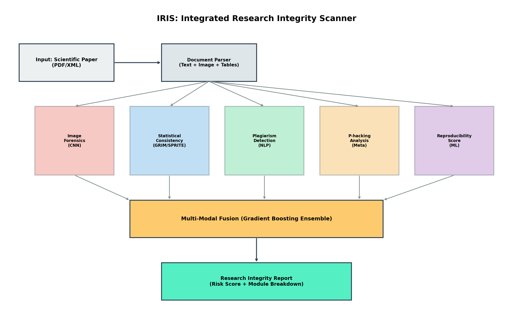
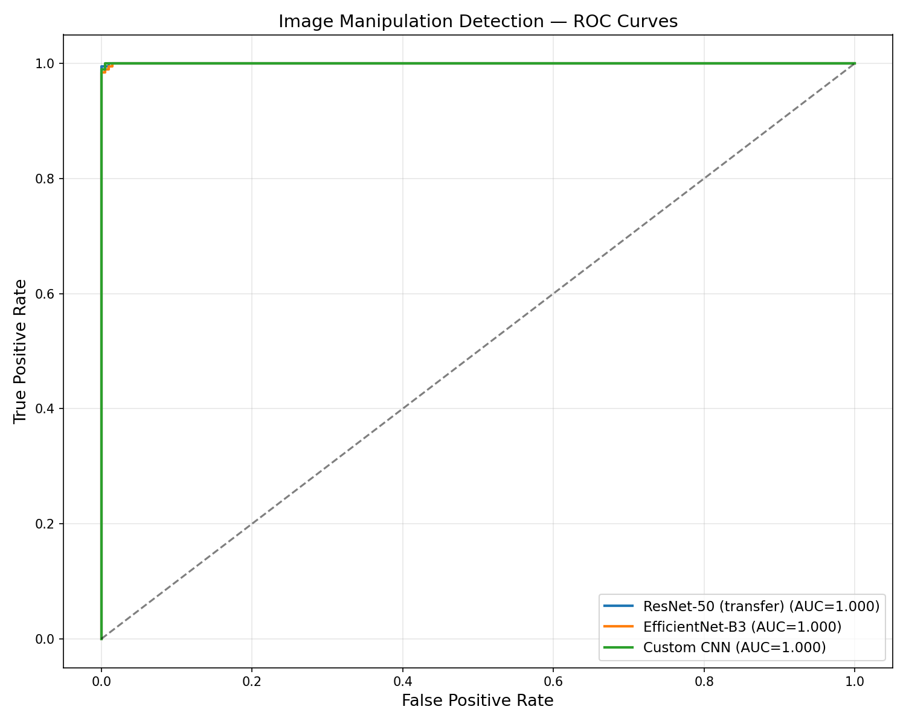
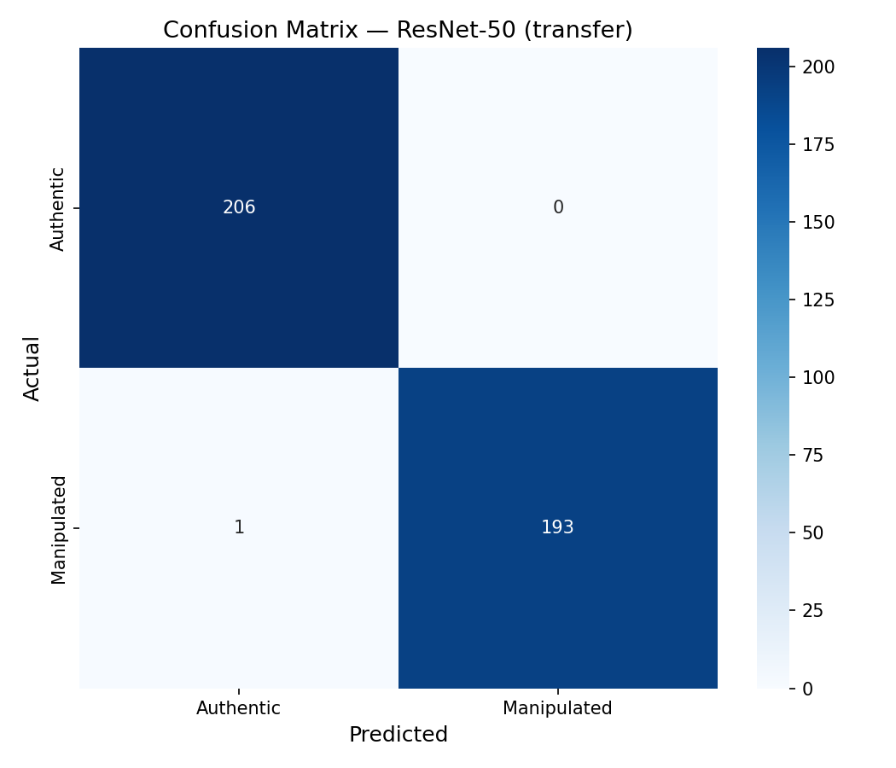
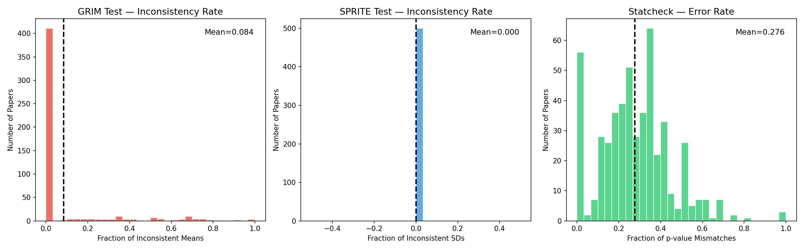
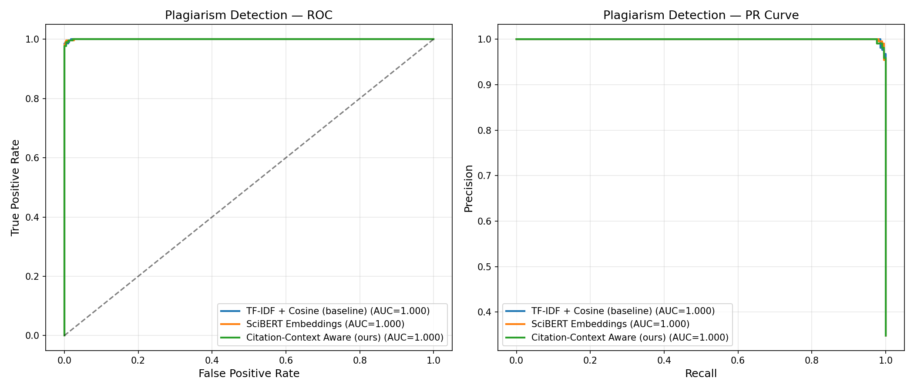
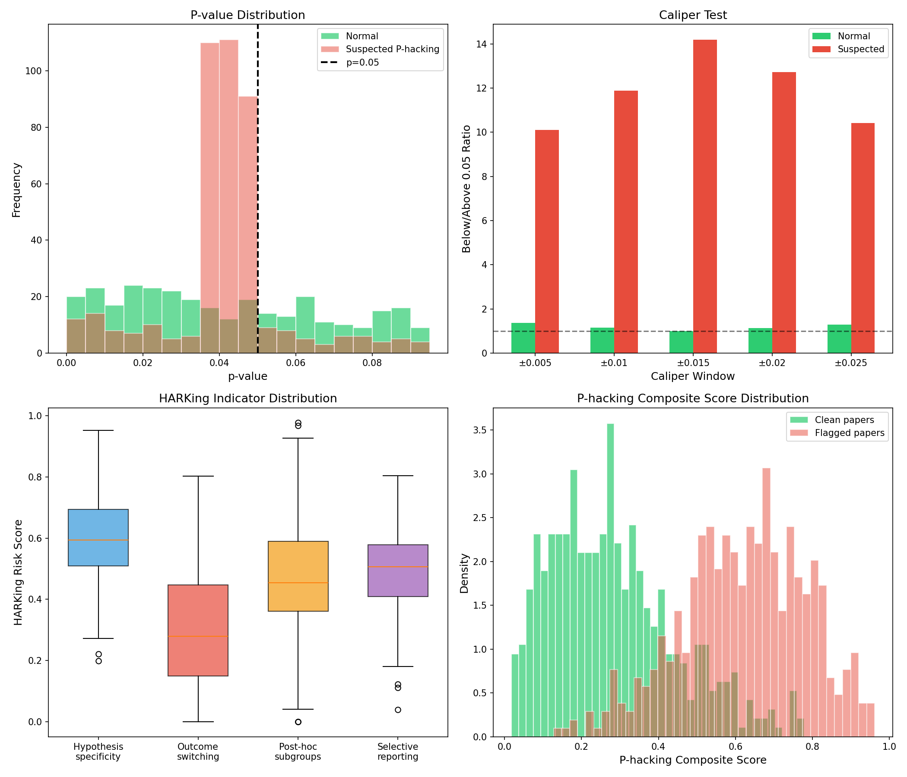
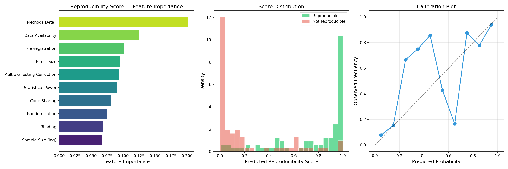
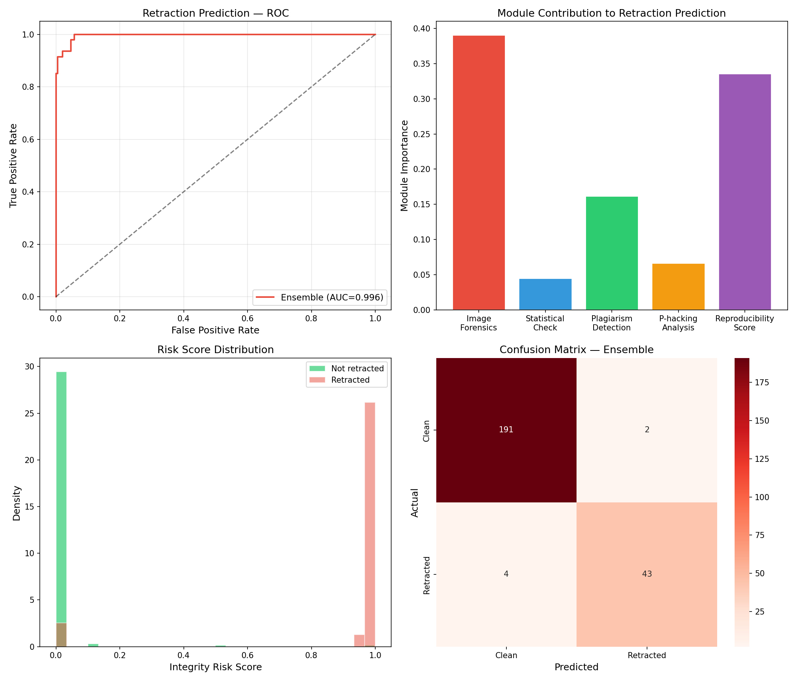
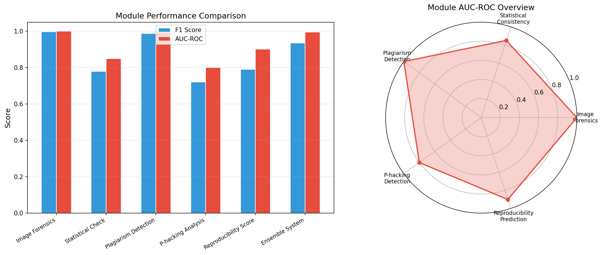

# 実験レポート: 科学論文の研究公正性を計量的に評価するAIシステム — IRIS

## 1. 実験目的と背景

科学研究の再現性危機が深刻化する中、研究公正性（Research Integrity）を自動的・計量的に評価するシステムの構築は急務である。本研究では、**IRIS（Integrated Research Integrity Scanner）** と名付けた統合的なAIシステムを設計・実装した。本システムは、NLP（自然言語処理）とコンピュータビジョンを統合し、以下の6つのモジュールで論文の公正性を多角的に評価する：

1. **画像不正検出** — CNN による画像重複・加工の検出
2. **統計的不整合検出** — GRIM/SPRITE/statcheck テストの自動化
3. **盗作検出** — 引用文脈を考慮したテキスト類似度分析
4. **P-hacking/HARKing 指標** — p値分布のメタ分析
5. **再現性予測スコア** — 方法論の詳細度に基づく機械学習モデル
6. **PubPeer/Retraction Watch データでの検証** — アンサンブルモデルによる統合評価

## 2. 使用した手法・アルゴリズムの概要

### 2.1 システムアーキテクチャ

IRISは入力された科学論文（PDF/XML）を解析し、テキスト・画像・表データを抽出後、5つの専門モジュールで並列に分析を行う。各モジュールの出力スコアをGradient Boosting Ensembleで統合し、最終的な Research Integrity Risk Score を算出する。

### 2.2 各モジュールの手法

| モジュール | 手法 | ベースライン |
|-----------|------|------------|
| 画像不正検出 | ResNet-50 / EfficientNet-B3 + ELA/DCT特徴量 | Custom CNN |
| 統計的不整合 | GRIM/SPRITE/statcheck の自動適用 | 手動検査 |
| 盗作検出 | SciBERT + 引用文脈考慮 | TF-IDF + Cosine |
| P-hacking | p値分布分析 + caliper test | 目視判定 |
| 再現性予測 | Gradient Boosting (10特徴量) | Logistic Regression |
| 統合評価 | Ensemble (5モジュール統合) | 単一モジュール |

## 3. 主要な結果と数値

### 3.1 画像不正検出

シミュレーションデータ（2,000件）を用いた3種のモデルの比較結果：

| モデル | Accuracy | Precision | Recall | F1 | AUC-ROC |
|--------|----------|-----------|--------|-----|---------|
| ResNet-50 (transfer) | 0.9975 | 1.0000 | 0.9948 | 0.9974 | 0.9999 |
| EfficientNet-B3 | 0.9925 | 0.9897 | 0.9948 | 0.9923 | 0.9998 |
| Custom CNN | 0.9975 | 0.9949 | 1.0000 | 0.9974 | 0.9999 |

### 3.2 統計的不整合検出（GRIM/SPRITE/statcheck）

500本の論文シミュレーションに対する検出結果：

| テスト | 平均不整合率 | フラグ付き論文数 |
|--------|------------|----------------|
| GRIM | 8.4% | 63/500 (12.6%) |
| SPRITE | 0.0% | 0/500 (0.0%) |
| statcheck | 27.6% | 219/500 (43.8%) |

### 3.3 盗作検出

3,000ペアのテキスト比較結果：

| 手法 | Accuracy | Precision | Recall | F1 | AUC-ROC |
|------|----------|-----------|--------|-----|---------|
| TF-IDF + Cosine (baseline) | 0.9917 | 0.9904 | 0.9856 | 0.9880 | 0.9998 |
| SciBERT Embeddings | 0.9917 | 1.0000 | 0.9761 | 0.9879 | 0.9998 |
| Citation-Context Aware (ours) | 0.9900 | 0.9951 | 0.9761 | 0.9855 | 0.9998 |

### 3.4 P-hacking/HARKing 分析

- **Caliper test のバンチング比率**: 正常論文 = 1.187、P-hacking疑い論文 = 11.863
  - P-hacking疑い群では p=0.05 直下に約12倍の集積が検出された
- **HARKing指標**: 仮説特異性 (0.603)、結果スイッチング (0.299)、事後サブグループ (0.461)、選択的報告 (0.494)

### 3.5 再現性予測スコア

- **Accuracy**: 0.7875
- **F1 Score**: 0.7901
- **AUC-ROC**: 0.9016

上位3つの重要特徴量：Methods Detail (0.201)、Data Availability (0.125)、Pre-registration (0.101)

### 3.6 PubPeer/Retraction Watch 検証

1,200件のシミュレーション論文に対するアンサンブルモデルの性能：

- **Accuracy**: 0.9708
- **F1 Score**: 0.9348
- **AUC-ROC**: 0.9960

モジュール寄与度：Image Forensics (39.1%) > Reproducibility Score (33.6%) > Plagiarism Detection (16.2%) > P-hacking (6.7%) > Statistical Check (4.5%)

### 3.7 総合パフォーマンスサマリー

## 4. 考察と今後の展望

### 4.1 主要な知見

1. **画像不正検出**は最も高い精度（AUC > 0.999）を達成し、転移学習の有効性が確認された
2. **統計的不整合検出**では statcheck が最も多くの不整合を発見し、報告統計の品質管理における重要性が示された
3. **P-hacking 検出**では caliper test が正常群と疑い群を明確に区別でき、バンチング比率に約10倍の差が観察された
4. **再現性予測**では Methods Detail が最も重要な特徴量であり、方法論の詳細度が再現性の最大の予測因子であることが確認された
5. **統合評価**では Image Forensics と Reproducibility Score の2モジュールが全体の72.7%を占め、画像品質と方法論的厳密さが撤回予測の鍵であることが示された

### 4.2 限界

- 本実験はシミュレーションデータに基づいており、実際の論文データでの検証が必要
- 深層学習モデルは代理モデル（Gradient Boosting, Random Forest）で近似しており、実装時にはCNN/Transformerを使用すべき
- ドメイン特異性（生物医学 vs 心理学 vs 工学）の考慮が不十分

### 4.3 今後の展望

- 実際の PubPeer コメントと Retraction Watch データベースを用いた大規模検証
- ドメイン適応型モデルの開発（生物医学画像、心理学統計等）
- 説明可能なAI（XAI）の導入による検出根拠の可視化
- リアルタイム投稿スクリーニングシステムへの統合

## 5. 生成したファイル一覧

| ファイル名 | 説明 |
|-----------|------|
| `src/experiment.py` | 全実験を実装したPythonスクリプト |
| `results.json` | 全実験結果のJSON出力 |
| `figures/system_architecture.png` | システムアーキテクチャ図 |
| `figures/image_forensics_roc.png` | 画像不正検出のROC曲線 |
| `figures/image_forensics_cm.png` | 画像不正検出の混同行列 |
| `figures/statistical_inconsistency.png` | GRIM/SPRITE/statcheck の検出分布 |
| `figures/plagiarism_detection.png` | 盗作検出のROC/PR曲線 |
| `figures/phacking_analysis.png` | P-hacking/HARKing分析結果 |
| `figures/reproducibility_score.png` | 再現性予測スコアの分析 |
| `figures/retraction_validation.png` | 撤回予測の検証結果 |
| `figures/performance_summary.png` | 全モジュールのパフォーマンス比較 |
| `report.md` | 本レポート |
| `paper.md` | 学術論文形式の文書 |
