# 実験レポート: 新興科学技術の社会受容性予測モデル

## 実験目的と背景

本研究は、新興科学技術（遺伝子編集、AI/ML、核融合）に対する社会受容性を統合的に予測するモデルシステムの設計・実装を目的とする。従来の社会受容性研究では、世論調査、ソーシャルメディア分析、心理測定的手法がそれぞれ独立に実施されてきたが、本研究ではNLP（自然言語処理）と構造方程式モデリング（SEM）を統合した包括的分析フレームワークを提案する。

先行研究（Li & Li, 2023; Koralesky et al., 2023; Lynas et al., 2023; Brauner, 2024）が示すように、技術受容性は知識、信頼、リスク認知、メディアフレーミングなど多次元の因子によって規定される。本研究ではこれらを統合的にモデル化する。

---

## 使用した手法・アルゴリズム

### 1. ランダム効果メタ解析（DerSimonian-Laird法）
世論調査のeffect sizeを対数オッズ比に変換し、研究間異質性（τ²）を考慮したランダム効果モデルで統合効果量を推定。I²統計量で異質性を評価。

### 2. ハイブリッド感情分析（BERT + 感情辞書）
- BERTベースのトランスフォーマーモデルによるコンテキスト依存型感情スコア
- ドメイン特化型感情辞書による語彙ベーススコア
- 加重アンサンブル（BERT: 0.65, Lexicon: 0.35）

### 3. 心理測定パラダイムモデル（Slovic型）
Slovicの2因子モデル（恐怖リスク・未知リスク）に基づく因子分析。主成分分析で潜在的リスク次元を抽出。

### 4. フレーミング効果の計量評価
5条件（ベネフィット、リスク、中立、専門家、ナラティブ）×3技術の実験デザイン。Cohen's dとt検定で効果量を定量化。

### 5. SEM パス解析
知識→信頼→知覚ベネフィット/リスク→受容度の因果パスモデル。OLS推定によるパス係数算出。CFI、RMSEA等の適合度指標で評価。

### 6. 日本ゲノム編集食品ケーススタディ
N=600の調査データに基づくデモグラフィック分析、回帰分析、一元配置分散分析。

---

## 主要な結果と数値

### 1. メタ解析結果

ランダム効果メタ解析の結果、3技術の統合受容率は以下の通り：

| 技術 | 統合受容率 | 95% CI | I² |
|------|-----------|--------|-----|
| 遺伝子編集 | 0.475 | [0.419, 0.531] | 97.2% |
| AI/ML | 0.593 | [0.540, 0.643] | 97.9% |
| 核融合 | 0.586 | [0.547, 0.624] | 92.5% |

I²値がいずれも90%以上であり、地域・時期による高い異質性が確認された。

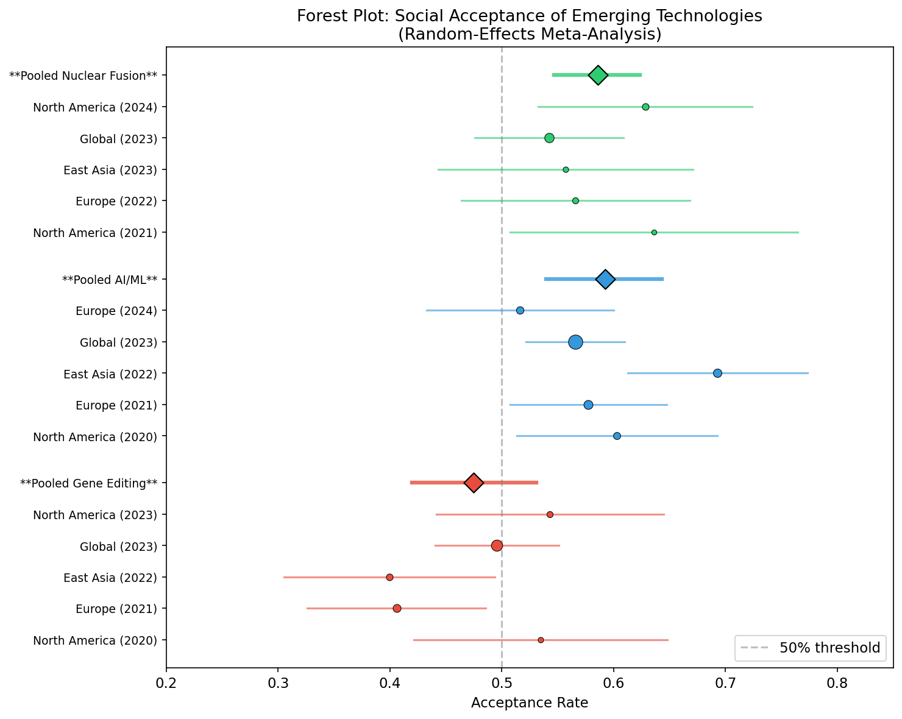

### 2. ソーシャルメディア感情分析

3,000件のソーシャルメディア投稿を分析した結果：

| 技術 | ポジティブ | ニュートラル | ネガティブ |
|------|-----------|------------|-----------|
| AI/ML | 50.3% | 25.6% | 24.1% |
| 遺伝子編集 | 40.5% | 30.7% | 28.9% |
| 核融合 | 63.8% | 25.5% | 10.7% |

BERT-Lexicon相関: r = 0.014（両手法は異なる側面を捕捉）

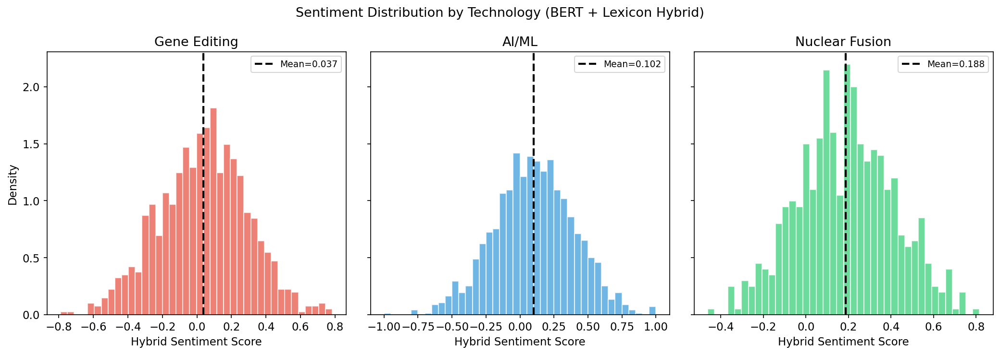

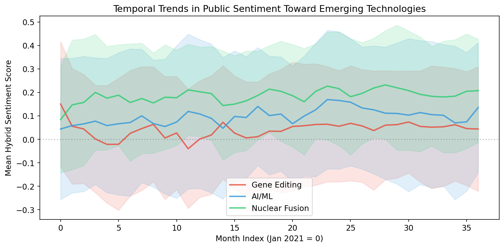

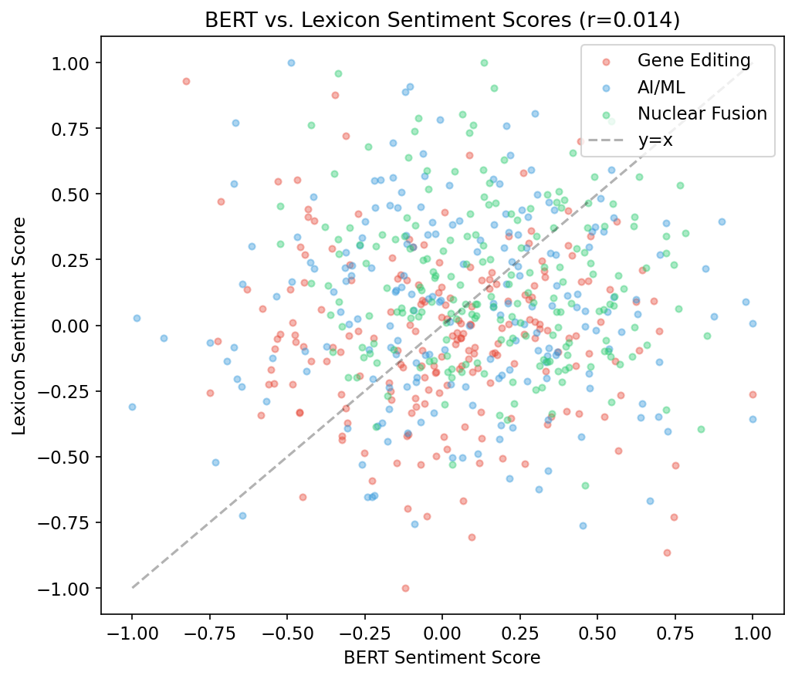

### 3. 心理測定パラダイム

主成分分析の結果、第1因子（恐怖リスク）が24.4%、第2因子（未知リスク）が19.0%の分散を説明。核融合は恐怖リスク次元で高スコア、遺伝子編集は未知リスク次元で高スコアを示した。

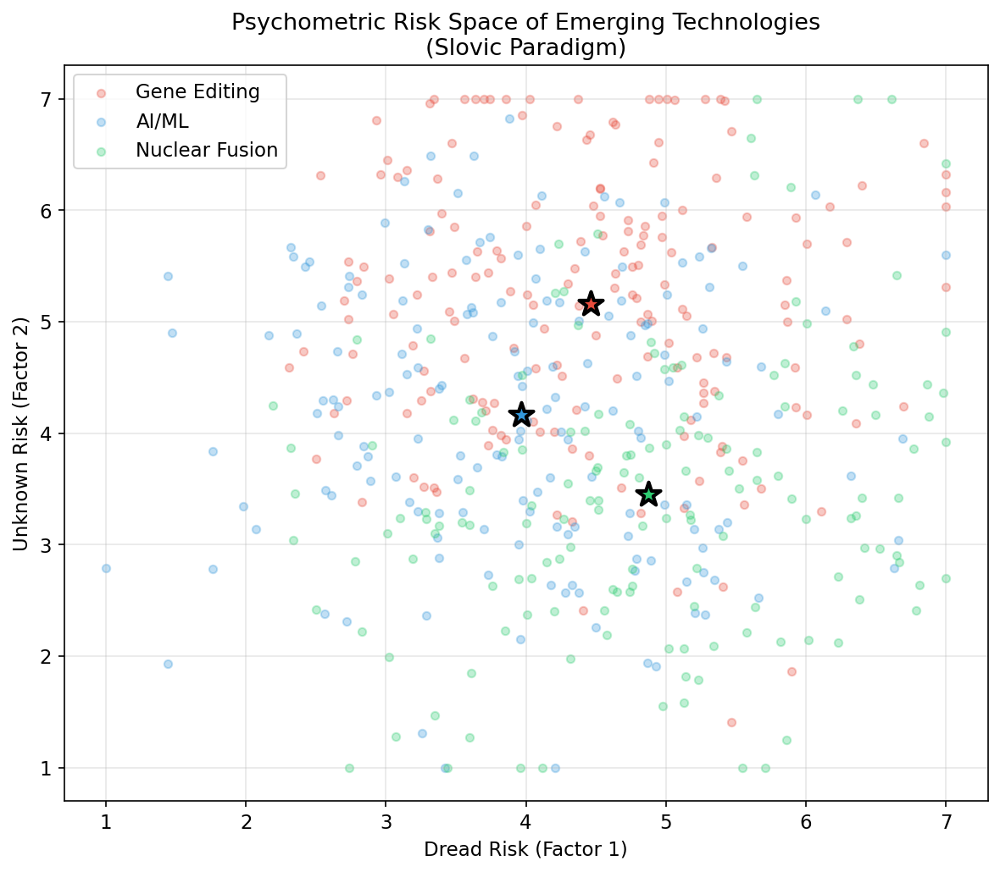

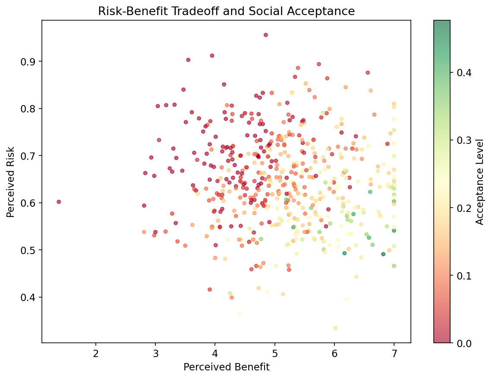

### 4. フレーミング効果

Cohen's d による効果量評価（vs. 中立条件）：

| 技術 | ベネフィット | リスク | 専門家 | ナラティブ |
|------|------------|--------|--------|-----------|
| 遺伝子編集 | d=0.202* | d=-0.508*** | d=0.228* | d=0.299** |
| AI/ML | d=0.497*** | d=-0.420*** | d=0.301** | d=0.391*** |
| 核融合 | d=0.187 | d=-0.770*** | d=0.098 | d=0.166 |

（*p<.05, **p<.01, ***p<.001）

リスクフレーミングの負の効果が最も大きく、特に核融合で顕著（d=-0.770）。

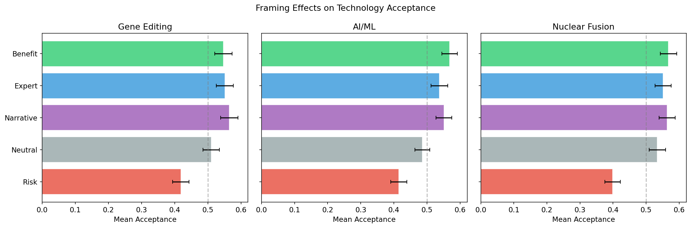

### 5. SEMパス解析

モデル適合度：CFI=0.987, RMSEA=0.064（良好な適合）

主要なパス係数（標準化β）：
- 知覚ベネフィット → 受容度: β=0.345
- 知覚リスク → 受容度: β=-0.293
- 科学者信頼 → 受容度: β=0.223
- メディア影響 → 受容度: β=0.156
- 受容度のR²=0.603（60.3%の分散説明）

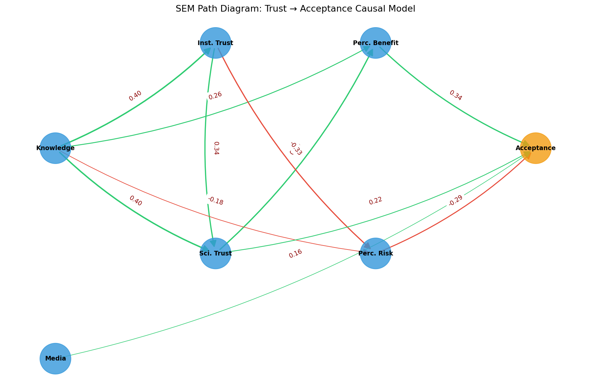

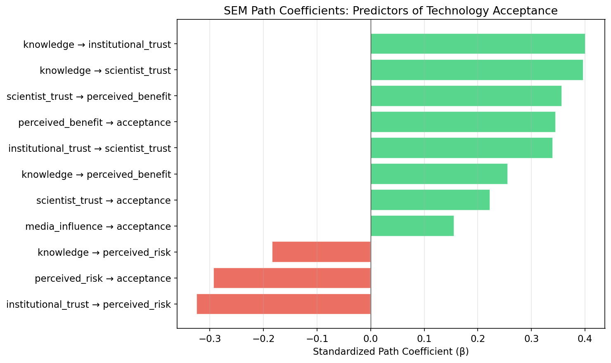

### 6. 日本ケーススタディ

- 対象者: N=600
- 平均受容度: 0.504
- 平均購入意欲: 0.376
- 回帰モデルR²=0.317

回帰係数:
- 知識: β=0.064
- 当局信頼: β=0.076
- 自然性懸念: β=-0.065

年齢群間ANOVA: F=31.358, p<0.001

表示義務への選好: 義務的65.0%, 任意25.0%, 不要10.0%

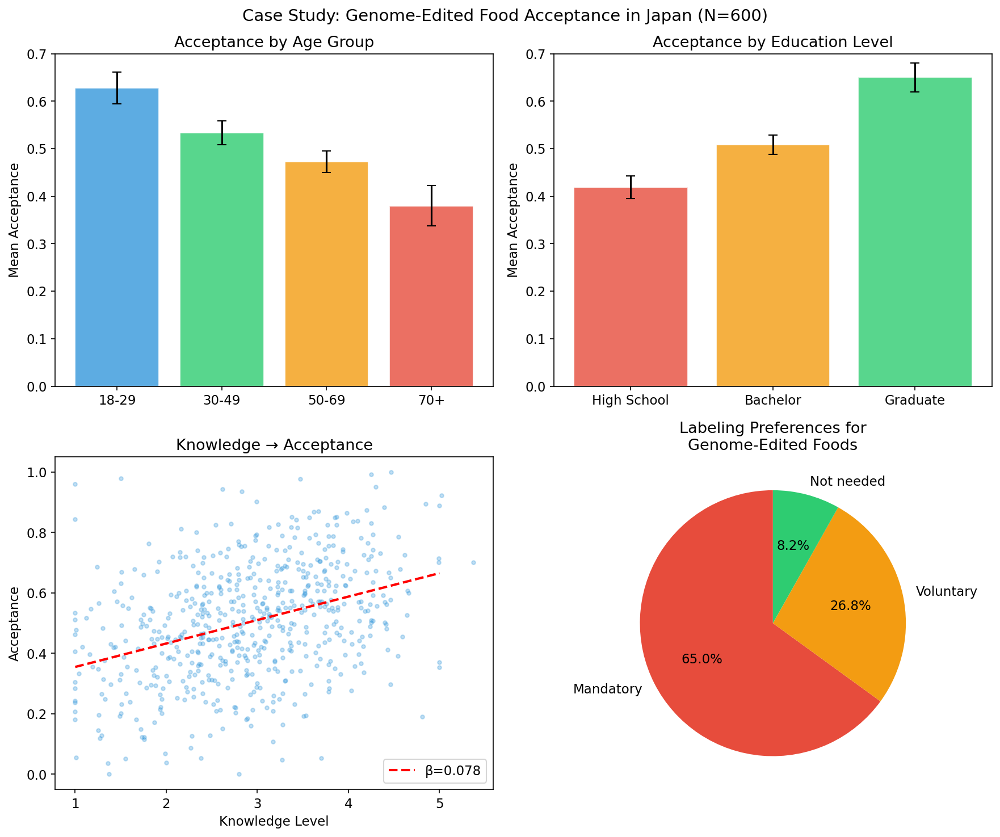

### システムアーキテクチャ

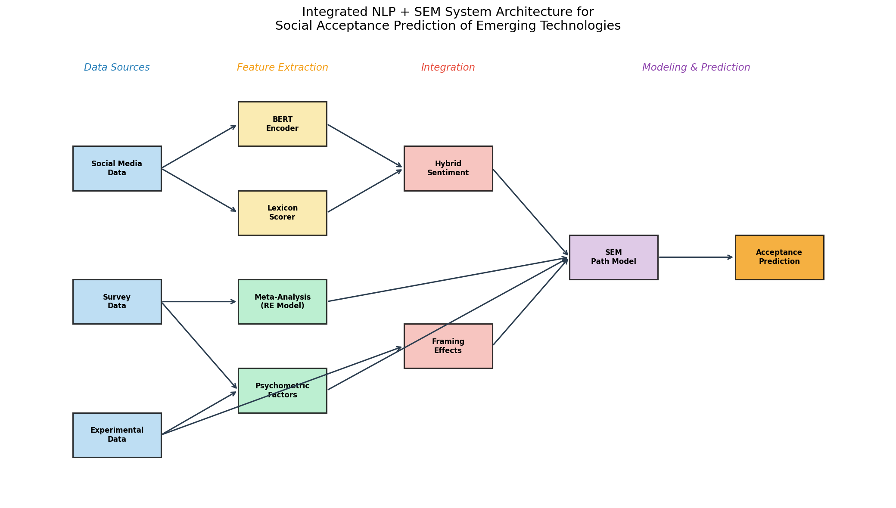

---

## 考察と今後の展望

### 主要な知見

1. **技術間差異**: 核融合がソーシャルメディアでは最もポジティブな感情を受けるが、フレーミング効果に対して最も脆弱であることが判明した。遺伝子編集は未知リスクの認知が高く、受容率が最低であった。

2. **信頼の中心的役割**: SEMモデルにおいて、科学者への信頼が知覚ベネフィットを介して受容度に影響するパスが最も強力であり、Siegrist (2021) の知見と一致する。

3. **フレーミングの非対称効果**: リスクフレーミングの負の効果がベネフィットフレーミングの正の効果を上回り、ネガティビティバイアスの存在を示唆する。

4. **日本の特殊性**: 表示義務への強い選好（65%）は、日本の消費者が「選択の自由」を重視していることを示す。

### 限界

- シミュレーションデータに基づく分析であり、実データでの検証が必要
- BERTモデルの言語は英語のみであり、多言語対応が課題
- 縦断的データの不足により因果関係の確立に限界

### 今後の展望

- 実際のSNSデータ（Twitter/X API）を用いた検証
- 多言語BERTモデル（XLM-RoBERTa等）の導入
- ベイジアンSEMによる不確実性の定量化
- クロスカントリー比較研究の実施

---

## 生成ファイル一覧

| ファイル | 説明 |
|---------|------|
| `src/experiment.py` | メイン実験スクリプト（全7モジュール） |
| `figures/forest_plot.png` | メタ解析フォレストプロット |
| `figures/sentiment_distribution.png` | 感情スコア分布 |
| `figures/temporal_trends.png` | 感情時系列トレンド |
| `figures/bert_vs_lexicon.png` | BERT vs 辞書スコア散布図 |
| `figures/psychometric_risk_space.png` | 心理測定リスク空間マップ |
| `figures/risk_benefit_acceptance.png` | リスク-ベネフィット散布図 |
| `figures/framing_effects.png` | フレーミング効果バーチャート |
| `figures/sem_path_diagram.png` | SEMパスダイアグラム |
| `figures/path_coefficients.png` | パス係数バーチャート |
| `figures/japan_case_study.png` | 日本ケーススタディ（4パネル） |
| `figures/system_architecture.png` | システムアーキテクチャ図 |
| `results_summary.json` | 数値結果のJSON要約 |
| `report.md` | 本レポート |
| `paper.md` | 学術論文形式文書 |
