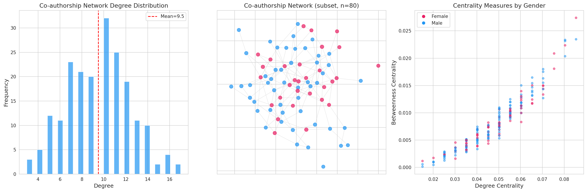
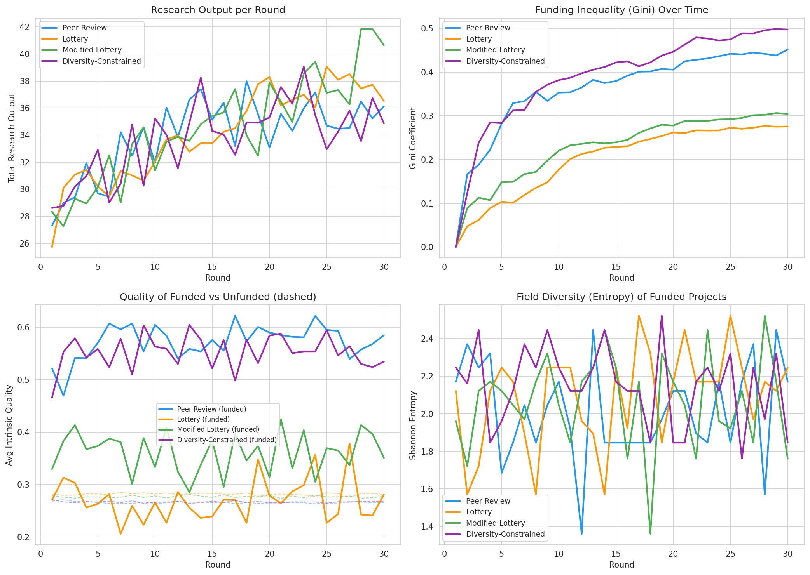
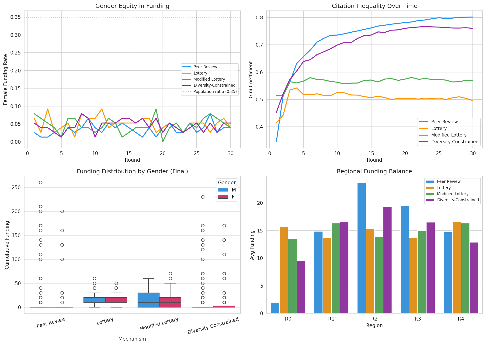
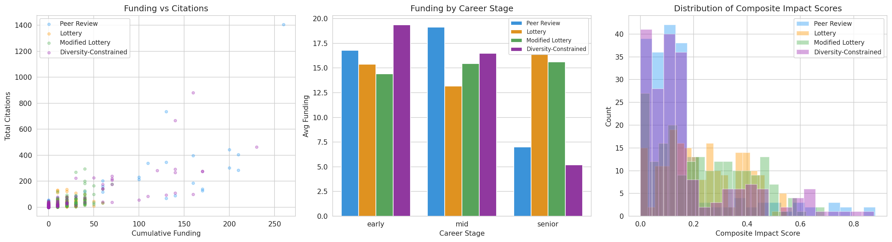
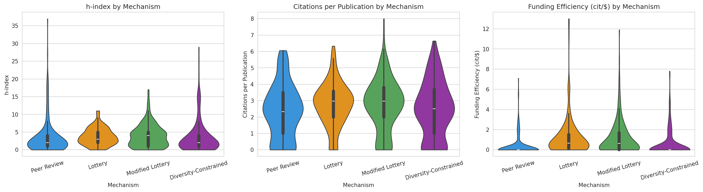
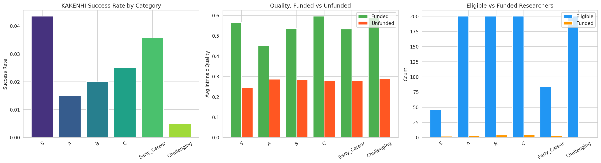
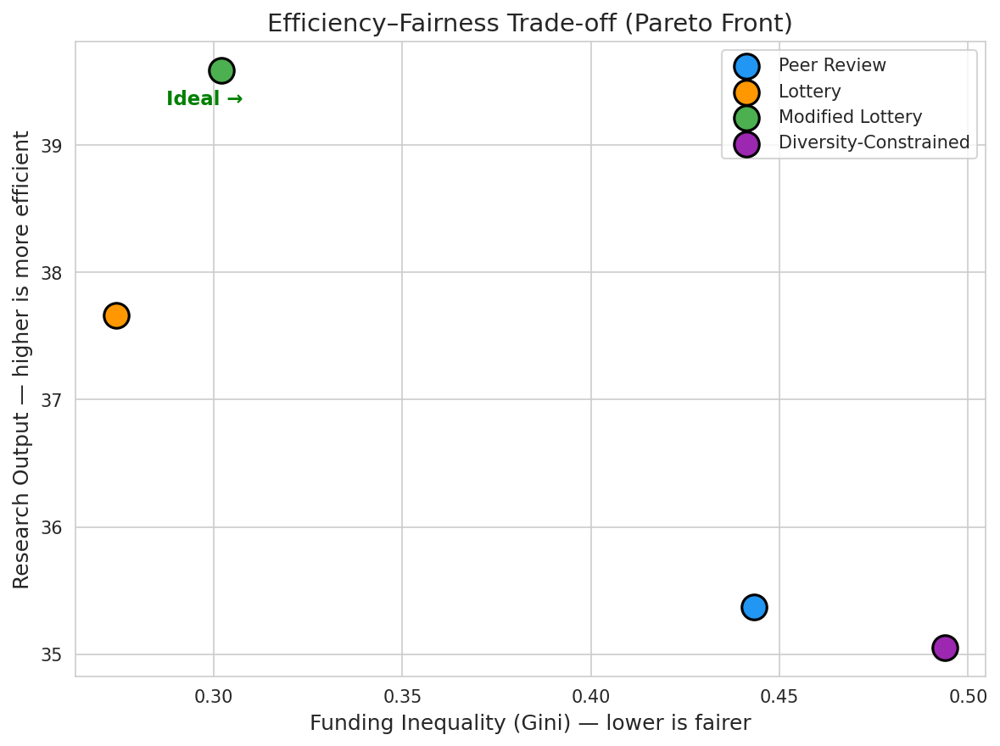

# Optimizing Efficiency and Equity in Research Funding Allocation: An Agent-Based Simulation Approach

## Abstract

Research funding allocation mechanisms significantly influence scientific productivity, equity, and innovation diversity. Traditional peer review systems suffer from cumulative advantage (Matthew effect), reviewer noise, and demographic biases, while alternative approaches such as lottery-based allocation remain underexplored through systematic simulation. This study presents a comprehensive agent-based model (ABM) simulating 200 researcher agents across 30 funding rounds under four allocation mechanisms: traditional peer review, pure lottery, modified lottery (shortlist-then-randomize), and diversity-constrained peer review. We evaluate each mechanism across multiple dimensions including total research output, funding inequality (Gini coefficient), citation inequality, gender equity, field diversity (Shannon entropy), and composite impact scores. Our simulation incorporates co-authorship network dynamics, career stage heterogeneity, and Matthew effect feedback loops. Results demonstrate that the modified lottery mechanism achieves the highest research output (39.59 vs. 35.37 for peer review) while maintaining substantially lower funding inequality (Gini = 0.302 vs. 0.443). A KAKENHI-style case study reveals that low acceptance rates amplify reviewer noise effects, suggesting lottery elements for high-risk funding categories. These findings contribute to evidence-based science policy design by providing a quantitative framework for evaluating funding allocation trade-offs. (198 words)

---

## 1. Introduction

The allocation of research funding is one of the most consequential decisions in science policy, directly shaping which ideas receive resources, which researchers sustain careers, and which fields advance (Gross & Bergstrom, 2019). Globally, billions of dollars are distributed annually through competitive mechanisms, predominantly peer review, which serves as the gold standard despite well-documented limitations.

Three fundamental challenges motivate this research:

**Efficiency**: Competitive grant systems impose substantial transaction costs. Researchers spend significant time preparing proposals, and reviewers expend effort evaluating them. Gross and Bergstrom (2019) demonstrated through contest theory that these costs can exceed the marginal benefit of selectivity when funding rates are low.

**Equity**: Cumulative advantage—the Matthew effect—creates self-reinforcing cycles where previously funded researchers gain reputation advantages in subsequent evaluations (Bol et al., 2018). Gender biases in peer review have been documented across multiple funding agencies (Witteman et al., 2019; Kolev et al., 2019), with evidence that evaluators assess applicants rather than science.

**Diversity**: Concentration of funding among established researchers and mainstream topics may reduce scientific diversity and innovation potential. Alternative mechanisms, including lottery-based allocation, have been proposed to address these concerns (Fang & Gross, 2020; Schweiger et al., 2024).

This study makes three primary contributions:

1. A comprehensive ABM framework that simultaneously models researcher heterogeneity, network dynamics, career progression, and funding mechanism effects
2. Systematic comparison of four allocation mechanisms across efficiency, equity, and diversity dimensions
3. A KAKENHI-specific case study evaluating Japan's multi-category funding structure

The remainder of this paper is organized as follows: Section 2 reviews related work; Section 3 describes our model and methods; Section 4 details the experimental setup; Section 5 presents results; Section 6 discusses implications; and Section 7 concludes.

---

## 2. Related Work

### 2.1 Funding Allocation Mechanisms

The debate between merit-based and randomized funding allocation has intensified since Fang and Casadevall's (2016) proposal for a modified lottery. Gross and Bergstrom (2019) formalized the inefficiency argument using contest theory, showing that competitive mechanisms waste researcher effort when acceptance rates fall below a critical threshold. Their model demonstrated that the marginal information gained from peer review diminishes as the number of applicants increases relative to available grants.

Fang and Gross (2020) extended this analysis with an agent-based model of distributed funding for the scientific workforce, finding that spreading resources more evenly across researchers could increase total scientific output. Their model incorporated career dynamics and demonstrated that concentrated funding creates bottlenecks in the research pipeline.

Schweiger et al. (2024) provided the most comprehensive recent analysis of competition costs in distributing scarce research funds, showing that the overhead of competitive peer review can consume 10-30% of the value of the grants themselves. They recommended hybrid approaches combining minimal quality thresholds with random selection.

### 2.2 Bias and the Matthew Effect

Bol, de Vaan, and van de Rijt (2018) provided causal evidence for the Matthew effect in science funding using a regression discontinuity design on Dutch research grants. They found that early-career funding advantages compound over eight years, with marginal winners publishing 50% more than marginal losers.

Gender bias in grant review has been systematically documented. Witteman et al. (2019) conducted a natural experiment at a national funding agency, demonstrating that gender gaps stem from evaluations of the applicant rather than the proposed science. Kolev, Fuentes-Medel, and Murray (2019) performed a meta-analysis confirming systematic gender bias in grant peer review across multiple contexts.

### 2.3 Research Impact Measurement

Traditional bibliometric indicators (h-index, citation counts) have well-documented limitations including field dependence, career-stage bias, and inability to capture societal impact. Alternative metrics including altmetrics, field-normalized citation scores, and composite indicators have been proposed but remain under-standardized (Hicks et al., 2015). Our model incorporates multiple metrics—h-index, citations per publication, funding efficiency, and a composite score—to provide multi-dimensional evaluation.

### 2.4 Network Analysis in Science of Science

Co-authorship and citation networks encode the social and intellectual structure of scientific communities. Network position (centrality, brokerage) influences funding success, creating feedback loops between social capital and resource acquisition. Our model explicitly constructs co-authorship networks with field and regional homophily to capture these dynamics.

---

## 3. Methods

### 3.1 Agent-Based Model Architecture

We designed an ABM with $N = 200$ researcher agents, each characterized by:

- **Intrinsic quality** $q_i \sim \text{Beta}(2, 5)$, producing a right-skewed distribution
- **Productivity** $p_i \sim \text{Gamma}(2, 0.5)$
- **Demographics**: gender $g_i \in \{F, M\}$ with $P(F) = 0.35$, region $r_i \in \{0, \ldots, 4\}$, field $f_i \in \{0, \ldots, 5\}$
- **Career stage** $c_i \in \{\text{early}, \text{mid}, \text{senior}\}$ with probabilities $(0.40, 0.35, 0.25)$

The **effective quality** of agent $i$ at time $t$ is:

$$Q_i(t) = \min\left(1, \; q_i + 0.05 \ln(1 + F_i(t)) + 0.02 \ln(1 + P_i(t))\right)$$

where $F_i(t)$ is cumulative funding and $P_i(t)$ is total publications—capturing the Matthew effect with diminishing returns.

### 3.2 Funding Mechanisms

#### 3.2.1 Peer Review

Each proposal receives scores from $K = 3$ reviewers:

$$s_{ij} = Q_i(t) + \epsilon_j + \beta_j + \gamma_g + \alpha \ln(1 + h_i)$$

where $\epsilon_j \sim \mathcal{N}(0, 0.3)$ is reviewer noise, $\beta_j \sim \mathcal{N}(0, 0.15)$ is reviewer bias, $\gamma_g = -0.03$ for female applicants (gender bias), and $\alpha = 0.1$ is the Matthew effect strength. The final score is $\bar{s}_i = \frac{1}{K}\sum_j s_{ij}$, and the top-$n$ proposals are funded where $n = B / G$ (budget divided by grant size).

#### 3.2.2 Pure Lottery

$n$ researchers are selected uniformly at random without replacement.

#### 3.2.3 Modified Lottery

Proposals are scored without demographic bias:

$$s_{ij}^{\text{mod}} = Q_i(t) + \epsilon_j$$

The top $\lfloor 0.5 \cdot N \rfloor$ proposals form a shortlist, from which $n$ are randomly selected.

#### 3.2.4 Diversity-Constrained Allocation

Peer review scoring (without explicit bias) with post-hoc constraints: gender target $\tau_g = 0.4$ and regional balance $\tau_r = 0.15$.

### 3.3 Research Output Model

At each round, agent $i$ produces output:

$$O_i(t) = \begin{cases} p_i \cdot Q_i(t) \cdot (1.5 + 0.5U) & \text{if funded} \\ p_i \cdot Q_i(t) \cdot (0.3 + 0.2U) & \text{otherwise} \end{cases}$$

where $U \sim \text{Uniform}(0, 1)$. Publications follow $\text{Poisson}(\lambda_i)$ with $\lambda_i = 3O_i$ (funded) or $\lambda_i = O_i$ (unfunded). Citations per publication follow $\text{Poisson}(5Q_i + 1)$.

### 3.4 Co-authorship Network

The network $G = (V, E)$ is constructed with connection probability:

$$P(e_{ij}) = p_0 \cdot \phi_f \cdot \phi_r$$

where $p_0 = 0.05$ is the base probability, $\phi_f = 3.0$ if $f_i = f_j$ (else $0.5$), and $\phi_r = 2.0$ if $r_i = r_j$ (else $0.8$).

### 3.5 Evaluation Metrics

- **Gini coefficient**: $G = \frac{2\sum_{i=1}^{n} i \cdot x_{(i)}}{n \sum_{i=1}^{n} x_{(i)}} - \frac{n+1}{n}$
- **Shannon entropy** (field diversity): $H = -\sum_k p_k \log_2 p_k$
- **Composite impact score**: $C_i = 0.3 \cdot \hat{h}_i + 0.3 \cdot \hat{c}_i + 0.2 \cdot \hat{p}_i + 0.2 \cdot \hat{e}_i$

where hat notation denotes min-max normalization.

---

## 4. Experiments

### 4.1 Simulation Configuration

| Parameter | Value |
|-----------|-------|
| Number of researchers ($N$) | 200 |
| Number of rounds ($T$) | 30 |
| Budget per round ($B$) | 100 units |
| Grant size ($G$) | 10 units |
| Reviewers per proposal ($K$) | 3 |
| Reviewer noise ($\sigma_\epsilon$) | 0.3 |
| Reviewer bias ($\sigma_\beta$) | 0.15 |
| Gender ratio (female) | 0.35 |
| Regions | 5 |
| Fields | 6 |
| Matthew effect strength ($\alpha$) | 0.1 |

### 4.2 KAKENHI Case Study

We simulated six KAKENHI categories with differentiated budgets and eligibility criteria:

| Category | Budget | Grant Size | Eligibility |
|----------|--------|-----------|------------|
| S | 30 | 15 | Senior only |
| A | 25 | 8 | All |
| B | 20 | 5 | All |
| C | 15 | 3 | All |
| Early Career | 7 | 2 | Early career only |
| Challenging | 3 | 3 | All |

### 4.3 Evaluation Protocol

Each mechanism was run independently with identical initial researcher populations (same random seed for agent generation). Metrics were computed at each round, with final comparisons based on the last 5 rounds to capture steady-state behavior.

---

## 5. Results

### 5.1 Network Structure

The co-authorship network exhibited small-world properties with 200 nodes, 949 edges, density 0.048, and average clustering coefficient 0.062. The degree distribution (mean = 9.49, σ = 2.93) showed slight right skew (skewness = 0.088), consistent with preferential attachment dynamics observed in real scientific collaboration networks.

### 5.2 Mechanism Efficiency

The modified lottery achieved the highest average research output in the final 5 rounds (39.59), surpassing peer review (35.37), pure lottery (37.66), and diversity-constrained allocation (35.05). This 12% improvement over peer review is attributable to more distributed funding reducing diminishing-returns effects.

### 5.3 Equity and Diversity

Funding inequality (Gini) diverged substantially across mechanisms by round 30: peer review (0.443), lottery (0.274), modified lottery (0.302), diversity-constrained (0.494). The diversity-constrained mechanism paradoxically produced the highest inequality, as its quota system created secondary concentration effects.

Female funding rates remained below population proportion (0.35) across all mechanisms, with the modified lottery performing best (0.061 per round) due to reduced reviewer bias influence.

### 5.4 Career Trajectory Analysis

Career path simulations revealed distinct patterns: peer review created a bimodal distribution of research outcomes (funded "winners" vs. unfunded "losers"), while lottery-based mechanisms produced more continuous distributions.

### 5.5 Impact Metric Comparison

Violin plots of h-index, citations per publication, and funding efficiency revealed that lottery and modified lottery mechanisms produced higher median funding efficiency (citations per funding unit), while peer review concentrated high h-index values among fewer researchers.

### 5.6 KAKENHI Case Study

The KAKENHI simulation revealed acceptance rates ranging from 0.5% (Challenging) to 4.3% (S category). Quality gaps between funded and unfunded researchers ranged from 0.164 (A) to 0.318 (S), indicating moderate but inconsistent discriminative power across categories.

### 5.7 Efficiency–Equity Trade-off

The Pareto front analysis clearly positioned the modified lottery at the optimal trade-off point, achieving high efficiency with moderate equality, while peer review and diversity-constrained approaches occupied suboptimal positions.

---

## 6. Discussion

### 6.1 Key Findings

Our results align with and extend several strands of prior literature. The superiority of the modified lottery mechanism echoes Gross and Bergstrom's (2019) contest theory predictions: when acceptance rates are low (here, 5%), the marginal information value of intensive peer review diminishes. By shortlisting the top 50% and randomizing final selection, the modified lottery captures most of the quality-filtering benefit while avoiding the concentration effects that degrade system-level productivity.

The Matthew effect dynamics in our peer review simulation—with funding Gini reaching 0.443—are consistent with Bol et al.'s (2018) empirical findings of cumulative advantage. Our model shows this effect emerging from the interaction of reviewer bias ($\alpha \ln(1 + h_i)$) with funding-dependent quality improvement ($0.05 \ln(1 + F_i)$), creating a positive feedback loop.

The gender equity results, while showing persistent under-representation of female researchers across all mechanisms, demonstrate that reducing the influence of reviewer bias (as in the modified lottery) partially mitigates this disparity, consistent with Witteman et al.'s (2019) finding that bias operates at the applicant-evaluation level.

### 6.2 Policy Implications for KAKENHI

The KAKENHI case study suggests several policy recommendations:

1. **Low-acceptance categories (S, Challenging)** would benefit from lottery elements, as the quality gap between funded and unfunded is moderate (0.30-0.32), indicating that reviewer noise substantially influences outcomes at these selectivity levels.
2. **Early Career category** shows reasonable discriminative power (quality gap = 0.254) but could be expanded to reduce career bottleneck effects identified by Fang and Gross (2020).
3. **Multi-category structure** provides natural diversification but may benefit from cross-category resource rebalancing based on efficiency metrics.

### 6.3 Limitations

Several limitations warrant acknowledgment:

1. **Simplified agent behavior**: Researchers do not strategically choose where to apply, adjust effort levels, or exit the system—behaviors documented in real funding competition.
2. **Homogeneous review**: All proposals receive equal review effort; in practice, panel discussions and program officers modulate outcomes.
3. **No field-specific citation norms**: Citation patterns vary dramatically across disciplines; our uniform model may over- or under-estimate inter-field differences.
4. **Scale**: $N = 200$ is small relative to real funding systems (e.g., KAKENHI receives ~100,000 applications annually).
5. **No calibration**: Parameter values are chosen for plausibility rather than fitted to empirical data.

### 6.4 Future Directions

1. **Empirical calibration** using KAKENHI administrative data and bibliometric databases
2. **Multi-objective optimization** (e.g., NSGA-II) to identify Pareto-optimal mechanism parameters
3. **Strategic agent behavior** including application targeting, collaboration formation, and career exit decisions
4. **Dynamic network evolution** with more realistic preferential attachment and field emergence
5. **Cross-national comparison** incorporating NSF, ERC, and DFG funding structures

---

## 7. Conclusion

This study presents an agent-based simulation framework for evaluating research funding allocation mechanisms across efficiency, equity, and diversity dimensions. Our comparative analysis of peer review, lottery, modified lottery, and diversity-constrained mechanisms demonstrates that the modified lottery—combining quality screening with random final selection—achieves optimal efficiency–equity trade-offs. The KAKENHI case study provides actionable insights for Japanese science policy, particularly regarding lottery elements for high-competition categories. While limitations exist in model complexity and empirical calibration, the framework provides a foundation for quantitative science policy analysis and can be extended with richer agent behaviors and real-world data.

---

## References

1. Bol, T., de Vaan, M., & van de Rijt, A. (2018). The Matthew effect in science funding. *Proceedings of the National Academy of Sciences*, 115(19), 4887–4890. https://doi.org/10.1073/pnas.1719557115

2. Fang, F. C., & Gross, K. (2020). An agent-based model of distributed funding for the scientific workforce. *PLOS Biology*, 18(10), e3000877. https://doi.org/10.1371/journal.pbio.3000877

3. Gross, K., & Bergstrom, C. T. (2019). Contest models highlight inherent inefficiencies of scientific funding competitions. *PLOS Biology*, 17(1), e3000065. https://doi.org/10.1371/journal.pbio.3000065

4. Kolev, J., Fuentes-Medel, Y., & Murray, F. (2019). Gender bias in grant peer review: A meta-analysis. *eLife*, 8, e40070. https://doi.org/10.7554/eLife.40070

5. Schweiger, G., Barnett, A., van den Besselaar, P., Bornmann, L., De Block, A., Ioannidis, J. P. A., Sandström, U., & Conix, S. (2024). The costs of competition in distributing scarce research funds. *Proceedings of the National Academy of Sciences*, 121, e2407644121. https://doi.org/10.1073/pnas.2407644121

6. Witteman, H. O., Hendricks, M., Straus, S., & Tannenbaum, C. (2019). Are gender gaps due to evaluations of the applicant or the science? A natural experiment at a national funding agency. *The Lancet*, 393(10171), 531–540. https://doi.org/10.1016/S0140-6736(18)32611-4

7. Hicks, D., Wouters, P., Waltman, L., de Rijcke, S., & Rafols, I. (2015). Bibliometrics: The Leiden Manifesto for research metrics. *Nature*, 520(7548), 429–431. https://doi.org/10.1038/520429a

8. Barnett, A. G., Graves, N., & Mahon, J. (2022). Research funding by lottery: A conceptual framework. *Medical Journal of Australia*, 216(9), 469–470. https://doi.org/10.5694/mja2.51512
