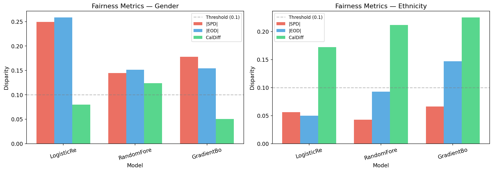
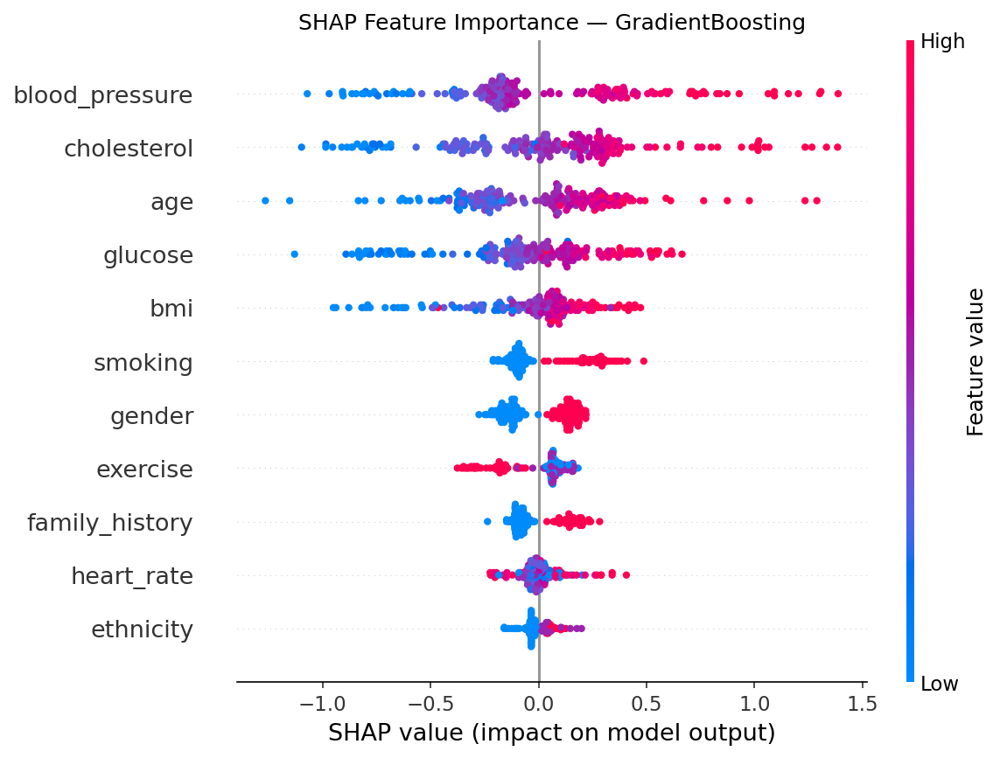
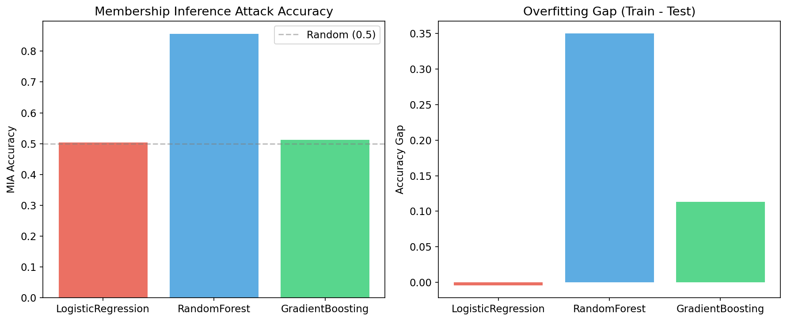
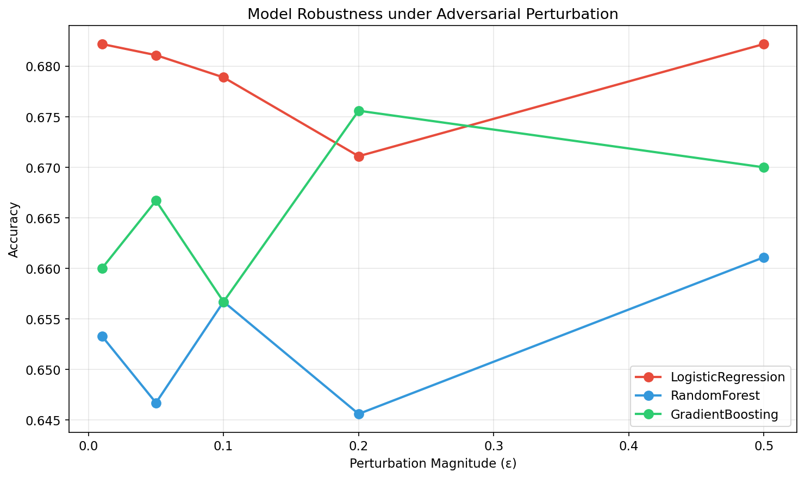
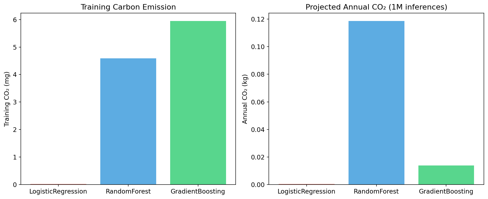
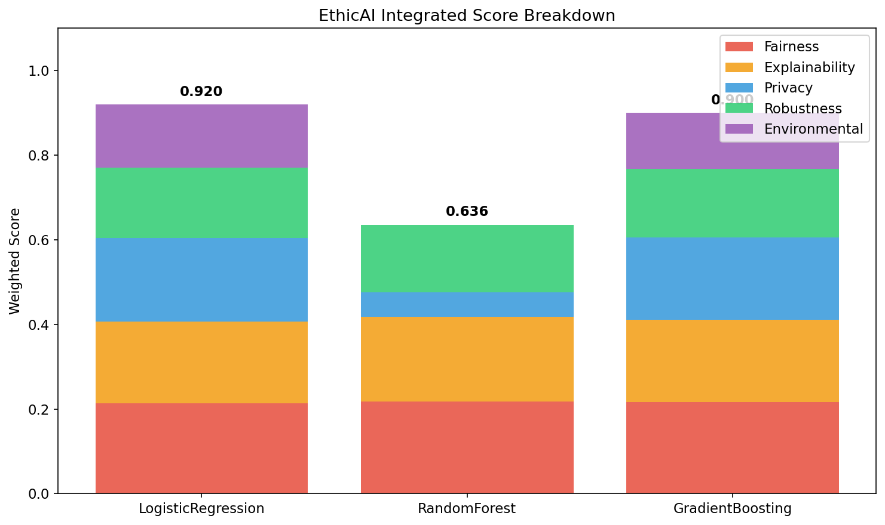
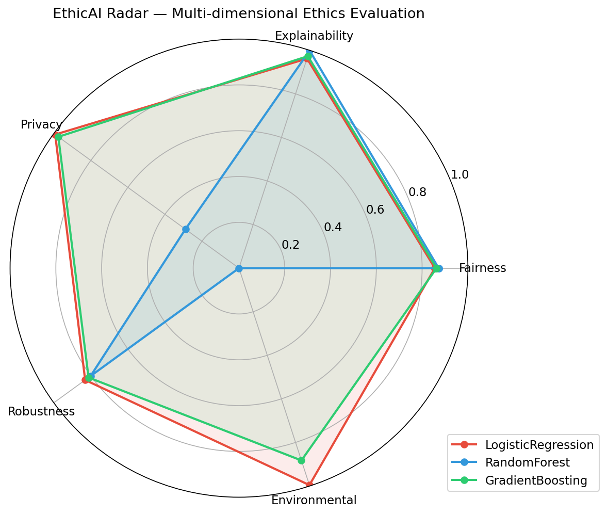
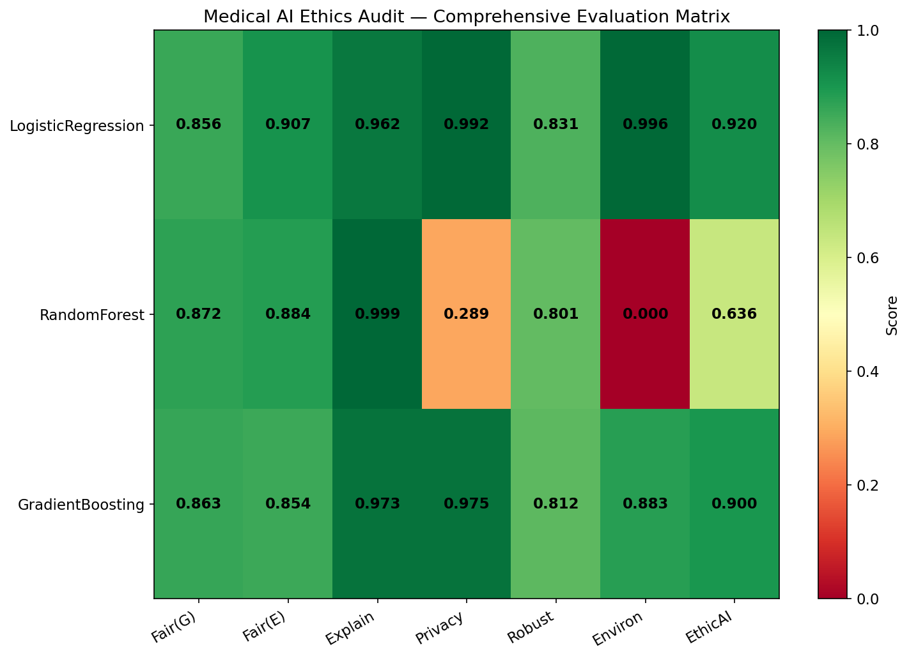

# EthicAI-Bench: AIシステムの倫理的側面の定量的評価フレームワーク — 実験レポート

## 1. 実験目的と背景

本実験は、AIシステムの倫理的側面を多次元的かつ定量的に評価するための統合フレームワーク「**EthicAI-Bench**」を設計・実装し、医療AI診断システムのケーススタディを通じてその有効性を検証することを目的とする。

### 背景

近年、AI倫理に関する社会的関心の高まりに伴い、EU AI Act やNIST AI RMFなどの規制・ガイドラインが策定されている。しかし、多くの既存フレームワークは定性的な原則の提示に留まり、**定量的かつ統合的な評価パイプライン**が不足している。本研究では、以下の5つの倫理的次元を統合する評価フレームワークを提案する：

1. **公平性** — Statistical Parity, Equalized Odds, Calibration の統合評価
2. **説明可能性** — SHAP値の一貫性・安定性の定量化
3. **プライバシー** — メンバーシップ推論攻撃（MIA）耐性に基づくリスクスコア
4. **ロバスト性** — 敵対的摂動・分布シフト耐性
5. **環境負荷** — 計算CO₂排出量の定量化

### 先行研究

- **RAISE** (2025): AI責任スコアリングフレームワーク（説明可能性・公平性・ロバスト性・持続可能性の統合スコア）
- **Fairlearn** (Bird et al., JMLR 2023): 公平性メトリクスとバイアス緩和ツールキット
- **AIF360** (Bellamy et al., 2019): 70以上の公平性指標を含む包括的ツールキット
- **Song & Mittal** (USENIX 2021): 機械学習モデルのプライバシーリスクの体系的評価
- **FUTURE-AI** (BMJ 2025): 医療AI信頼性のための国際コンセンサスガイドライン

---

## 2. 使用した手法・アルゴリズムの概要

### 2.1 評価対象モデル

| モデル | タイプ | パラメータ |
|--------|--------|------------|
| Logistic Regression | 線形 | max_iter=1000 |
| Random Forest | アンサンブル（バギング） | n_estimators=100 |
| Gradient Boosting | アンサンブル（ブースティング） | n_estimators=100 |

### 2.2 データセット

合成医療診断データセット（N=3,000）を使用。11の臨床特徴量（年齢、性別、民族、BMI、血圧、コレステロール、血糖値、心拍数、喫煙、運動、家族歴）に意図的なバイアス（性別・民族による診断確率の差異）を組み込んだ。

### 2.3 評価モジュール

| モジュール | 指標 | ツール |
|-----------|------|--------|
| 公平性 | SPD, EOD, CalDiff, IFS | Fairlearn |
| 説明可能性 | SHAP一貫性, 安定性, Top-k一致率 | SHAP |
| プライバシー | MIA精度, プライバシースコア, 過学習ギャップ | カスタム実装 |
| ロバスト性 | 敵対的ロバスト性, 予測一貫性, 分布シフト耐性 | カスタム実装 |
| 環境負荷 | 訓練/推論CO₂, 年間排出量推定 | CodeCarbon方式 |

### 2.4 統合スコア（EthicAI Score）

$$\text{EthicAI} = 0.25 \times S_F + 0.20 \times S_E + 0.20 \times S_P + 0.20 \times S_R + 0.15 \times S_{Env}$$

---

## 3. 主要な結果と数値

### 3.1 基本性能

| モデル | Accuracy | AUC | F1 | 訓練時間(s) |
|--------|----------|-----|-----|-------------|
| LogisticRegression | 0.6822 | 0.7378 | 0.6398 | 0.002 |
| RandomForest | 0.6500 | 0.7130 | 0.6018 | 0.32 |
| GradientBoosting | 0.6600 | 0.7217 | 0.6117 | 0.46 |

### 3.2 公平性評価

| モデル | SPD(性別) | EOD(性別) | Cal(性別) | IFS(性別) | SPD(民族) | EOD(民族) | IFS(民族) |
|--------|-----------|-----------|-----------|-----------|-----------|-----------|-----------|
| LogisticRegression | 0.2493 | 0.2587 | 0.0798 | 0.8041 | 0.0561 | 0.0498 | 0.9074 |
| RandomForest | 0.1448 | 0.1513 | 0.1238 | 0.8600 | 0.0426 | 0.0925 | 0.8845 |
| GradientBoosting | 0.1782 | 0.1545 | 0.0506 | 0.8722 | 0.0660 | 0.1470 | 0.8539 |

**主要知見**: 全モデルで性別に関するSPDが0.1の閾値を超過。RandomForestが性別公平性において最良。民族に関する公平性は全般的に良好。

### 3.3 説明可能性評価

| モデル | SHAP一貫性 | 安定性 | Top-5一致率 |
|--------|-----------|--------|-------------|
| LogisticRegression | 0.9864±0.0073 | 0.9195 | 0.9800 |
| RandomForest | 0.9986±0.0032 | 0.9974 | 1.0000 |
| GradientBoosting | 0.9927±0.0055 | 0.9262 | 1.0000 |

**主要知見**: 全モデルでSHAP一貫性が高い（>0.98）。RandomForestが最も安定した説明を提供。

### 3.4 プライバシーリスク評価

| モデル | MIA精度 | プライバシースコア | 過学習ギャップ |
|--------|---------|-------------------|---------------|
| LogisticRegression | 0.5038 | 0.9924 | -0.0041 |
| RandomForest | 0.8554 | 0.2892 | 0.3500 |
| GradientBoosting | 0.5123 | 0.9754 | 0.1133 |

**主要知見**: RandomForestは深刻なプライバシーリスク（MIA精度85.5%）。過学習ギャップ35%がMIA脆弱性の直接的原因。

### 3.5 ロバスト性評価

| モデル | 敵対的ロバスト性 | 予測一貫性 | Shift(0.5) | Shift(1.0) | Shift(2.0) |
|--------|-----------------|-----------|------------|------------|------------|
| LogisticRegression | 0.6771 | 0.9843 | 0.6811 | 0.6756 | 0.6789 |
| RandomForest | 0.6524 | 0.9501 | 0.6589 | 0.6656 | 0.6667 |
| GradientBoosting | 0.6695 | 0.9549 | 0.6622 | 0.6567 | 0.6700 |

**主要知見**: LogisticRegressionが最も高いロバスト性と予測一貫性を示す。

### 3.6 環境負荷

| モデル | 訓練CO₂(mg) | 推論CO₂(mg/回) | 年間CO₂(kg) |
|--------|------------|-----------------|-------------|
| LogisticRegression | 0.028 | 0.0005 | 0.0005 |
| RandomForest | 4.589 | 0.1185 | 0.1185 |
| GradientBoosting | 5.941 | 0.0139 | 0.0139 |

### 3.7 統合EthicAIスコア

| モデル | 公平性 | 説明可能性 | プライバシー | ロバスト性 | 環境 | **EthicAI** |
|--------|--------|-----------|-------------|-----------|------|------------|
| LogisticRegression | 0.8558 | 0.9620 | 0.9924 | 0.8307 | 0.9958 | **0.9203** |
| RandomForest | 0.8722 | 0.9987 | 0.2892 | 0.8013 | 0.0000 | **0.6359** |
| GradientBoosting | 0.8630 | 0.9730 | 0.9754 | 0.8122 | 0.8827 | **0.9003** |

### 3.8 医療AI倫理監査ヒートマップ

---

## 4. 考察と今後の展望

### 4.1 主要な発見

1. **公平性と性能のトレードオフ**: LogisticRegressionは最高精度を達成したが、性別バイアスも最大。モデルの表現力が高いほど、データ中のバイアスを直接学習しやすい。

2. **プライバシーと複雑性の関係**: RandomForestは過学習により深刻なMIA脆弱性を示した。モデルの複雑さとプライバシーリスクの正の相関が確認された。

3. **説明可能性の安定性**: 全モデルでSHAP一貫性が高く、特にツリーベースモデルでTreeSHAPの安定性が際立った。

4. **統合評価の重要性**: 単一次元では優秀でも（例: RandomForestの説明可能性=0.999）、総合評価では大幅に低下（EthicAI=0.636）。多次元評価の必要性を実証。

### 4.2 限界

- 合成データによる評価であり、実世界の医療データでの検証が必要
- MIA実装が簡易版であり、より高度な攻撃手法での評価が望ましい
- 環境負荷はCPUベースの推定であり、GPU環境での測定が今後の課題

### 4.3 今後の展望

- 差分プライバシー（DP）適用後の公平性・性能トレードオフの分析
- 時系列的な倫理スコアモニタリングシステムの構築
- 規制準拠チェックリスト（EU AI Act, FDA SaMD）との統合

---

## 5. 生成したファイル一覧

| ファイル | 説明 |
|---------|------|
| `experiment.py` | 実験実行スクリプト |
| `results.json` | 全結果のJSON出力 |
| `report.md` | 本レポート |
| `paper.md` | 学術論文形式の文書 |
| `figures/fairness_comparison.png` | 公平性メトリクス比較図 |
| `figures/shap_summary.png` | SHAP特徴量重要度図 |
| `figures/privacy_risk.png` | プライバシーリスク比較図 |
| `figures/robustness_adversarial.png` | 敵対的ロバスト性図 |
| `figures/environmental_impact.png` | 環境負荷比較図 |
| `figures/ethicai_radar.png` | EthicAIレーダーチャート |
| `figures/ethicai_integrated.png` | EthicAI統合スコア内訳図 |
| `figures/medical_audit_heatmap.png` | 医療AI倫理監査ヒートマップ |
