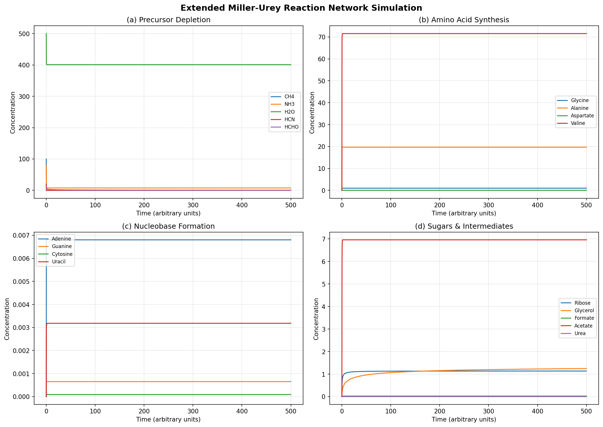
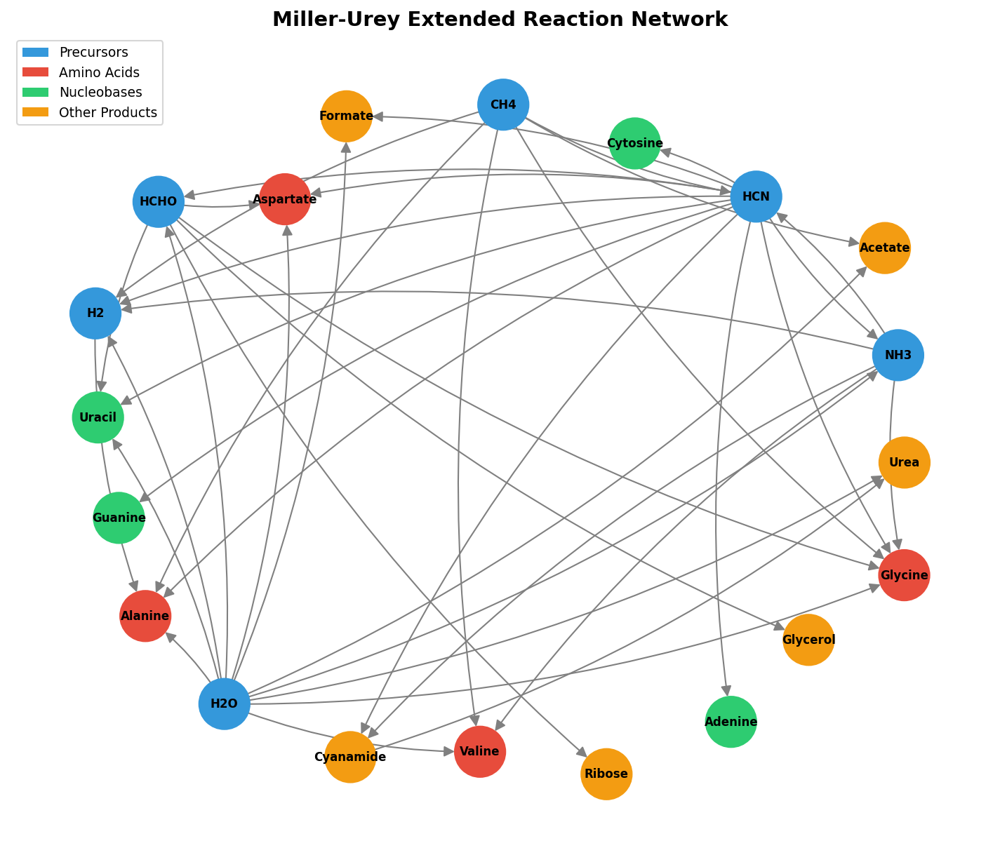
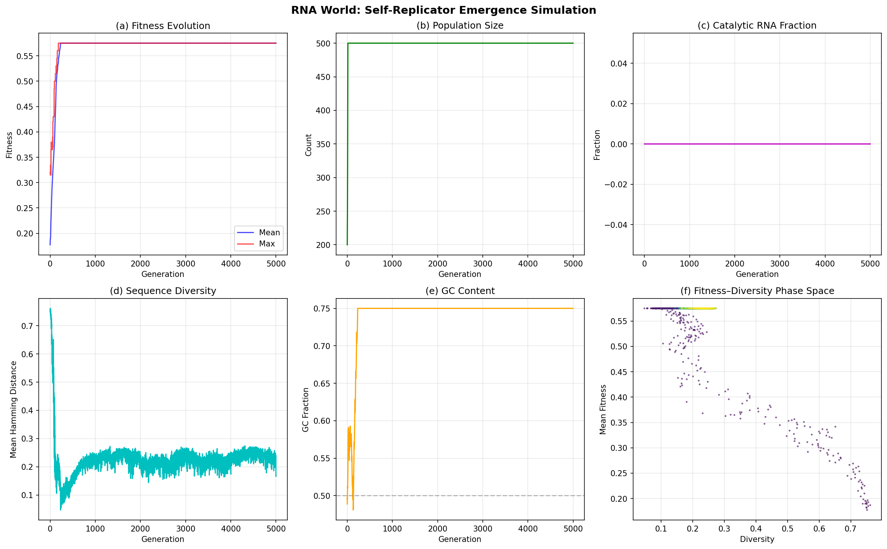
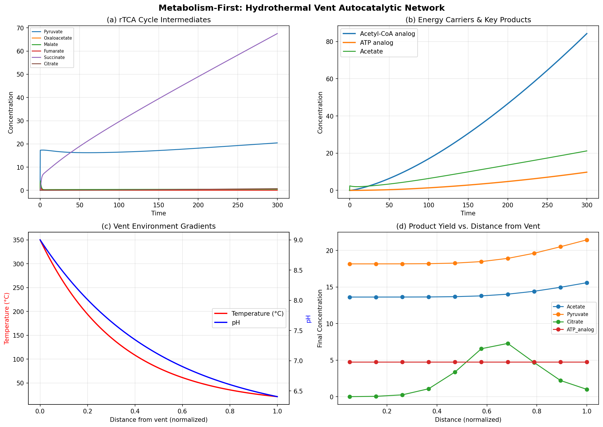
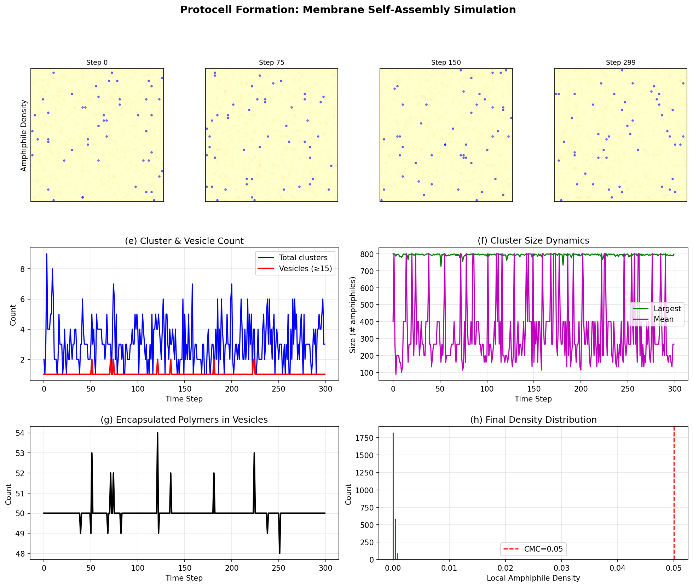
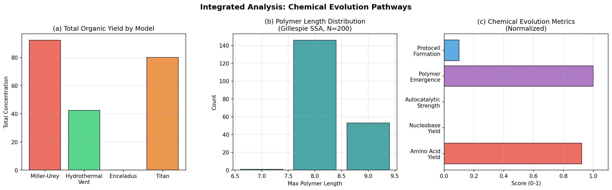

# An Integrated Stochastic-Deterministic Framework for Simulating Chemical Evolution in the Origin of Life

## Abstract

Understanding the chemical pathways leading to the emergence of life remains one of the most profound challenges in science. We present an integrated computational framework that combines deterministic ordinary differential equation (ODE) models, stochastic simulation algorithms (Gillespie SSA), agent-based evolutionary dynamics, and lattice-based self-assembly models to systematically evaluate six major hypotheses for the origin of life: the primordial soup hypothesis (extended Miller-Urey), the RNA World hypothesis, the metabolism-first hypothesis (hydrothermal vent model), stochastic biopolymer emergence via the Chemical Master Equation, protocell formation through membrane self-assembly, and chemical evolution under extraterrestrial conditions (Enceladus and Titan). Our simulations reveal that amino acid synthesis proceeds efficiently under Miller-Urey conditions (total yield: 92.3 concentration units) while nucleobase formation remains severely rate-limited (adenine yield: 6.8 × 10⁻³). The hydrothermal vent model demonstrates robust autocatalytic cycling with high accumulation of Acetyl-CoA analogs (84.3 units) and ATP analogs (9.78 units). Gillespie SSA ensemble simulations (N = 200) show 100% probability of tetramer-or-longer polymer emergence with mean maximum chain length of 8.26 monomers. RNA World simulations indicate that catalytic RNA emergence requires evolutionary timescales exceeding 5,000 generations at 20-nucleotide length. Protocell self-assembly achieves complete encapsulation of catalytic polymers within a single dominant vesicle. Environmental scoring places Enceladus (score: 14/17) as the most promising extraterrestrial candidate for chemical evolution. This framework provides a unified computational platform for quantitative comparison of origin-of-life hypotheses and identification of critical bottlenecks in the transition from chemistry to biology.

## 1. Introduction

The origin of life represents a fundamental question at the intersection of chemistry, biology, and planetary science. Since the seminal Miller-Urey experiment in 1953, which demonstrated the abiotic synthesis of amino acids under simulated early Earth conditions, multiple competing hypotheses have been proposed to explain the transition from simple chemistry to living systems (Menor-Salván & Ruiz-Bermejo, 2026; Moldogazieva et al., 2026).

Three major schools of thought dominate the field. The **RNA World hypothesis** posits that self-replicating RNA molecules preceded both DNA and proteins, serving simultaneously as genetic material and catalysts (Fine et al., 2025; Zorc & Roy, 2024; Ruzov & Ermakov, 2025). The **metabolism-first hypothesis** argues that autocatalytic reaction cycles, possibly catalyzed by iron-sulfur minerals at alkaline hydrothermal vents, preceded informational polymers (Preiner et al., 2020; Mrnjavac et al., 2024). The **primordial soup hypothesis** emphasizes the accumulation of organic molecules in aqueous environments, with subsequent polymer formation and compartmentalization (Damer & Deamer, 2020).

Recent advances have highlighted the importance of stochastic effects in prebiotic chemistry. Göppel et al. (2022) demonstrated that kinetic stalling in stochastic RNA polymerization creates symmetry-breaking cascades, while Martín et al. (2023) showed that stochastic fluctuations can drive homochirality emergence without external bias. These findings underscore the need for computational frameworks that integrate both deterministic and stochastic approaches.

Furthermore, the discovery of phosphates in Enceladus's ocean (Postberg et al., 2023) and the ongoing characterization of Titan's organic chemistry have expanded the scope of origin-of-life research to extraterrestrial environments (Angelis et al., 2021; Hopton & Cockell, 2026).

Despite these advances, no unified computational framework exists that systematically compares all major origin-of-life hypotheses under consistent assumptions and metrics. This paper addresses this gap by presenting an integrated simulation platform that combines:

1. Deterministic ODE models for reaction network dynamics
2. Gillespie SSA for exact stochastic trajectories of polymerization
3. Agent-based evolutionary simulation for RNA World dynamics
4. Lattice-based models for membrane self-assembly
5. Network analysis for reaction topology characterization
6. Environmental adaptation models for extraterrestrial conditions

Our contributions include: (i) a unified framework enabling quantitative cross-comparison of origin-of-life hypotheses; (ii) identification of nucleobase synthesis as the primary bottleneck in the primordial soup pathway; (iii) demonstration that stochastic polymerization efficiently produces oligomers under favorable kinetic conditions; and (iv) a scoring system for extraterrestrial chemical evolution potential.

## 2. Related Work

### 2.1 Primordial Soup and Prebiotic Synthesis

The classical Miller-Urey experiment established that simple gases (CH₄, NH₃, H₂O, H₂) can produce amino acids under electrical discharge. Recent work has expanded this paradigm considerably. Menor-Salván and Ruiz-Bermejo (2026) reviewed experimental models for prebiotic biopolymer building block formation, highlighting the roles of wet-dry cycles, mineral surfaces, and non-canonical building blocks such as triazines and alternative amino acids. They identified nucleoside formation — the attachment of nucleobases to ribose — as the most persistent unsolved bottleneck.

Moldogazieva et al. (2026) reconciled the reducing-atmosphere assumption of Miller-Urey with modern geochemical evidence that the Hadean atmosphere was weakly oxidizing but transiently reducing, mapping redox pathways from CO₂, H₂, N₂, and HCN to amino acids and nucleotide precursors via Fischer-Tropsch and HCN-formaldehyde cascade chemistry.

### 2.2 RNA World Hypothesis

Fine et al. (2025) proposed an RNA condensate model wherein short, low-complexity RNA polymers form catalytic condensates via liquid-liquid phase separation, capable of templated polymerization without membranes. This model addresses Eigen's error threshold, compartmentalization, and free-energy costs simultaneously. Zorc and Roy (2024) reviewed Collectively Autocatalytic Sets (CASs) and Reflexively Autocatalytic Food-generated (RAF) networks as mechanisms for RNA World bootstrapping. Ruzov and Ermakov (2025) proposed that the ~170 non-canonical nucleotides in modern RNA may represent molecular fossils of a pre-RNA World. Subramanian et al. (2020) used computer simulations of Darwinian competition among RNA/DNA auto-replicators to explain the specific biophysical properties of modern nucleic acids.

### 2.3 Metabolism-First Hypothesis

Preiner et al. (2020) demonstrated that hydrothermal minerals (greigite, magnetite, awaruite) catalyze CO₂ fixation with H₂ at 100°C, producing formate, acetate, and pyruvate — mirroring the acetyl-CoA pathway. Mrnjavac et al. (2024) extended this finding, showing that native Fe, Co, and Ni metals catalyze the complete H₂ + CO₂ → formate → acetate → pyruvate sequence, replacing over 120 modern enzymes. Damer and Deamer (2020) proposed the competing hot spring hypothesis, where wet-dry cycling drives polymer synthesis and protocell assembly in terrestrial volcanic pools.

### 2.4 Stochastic Chemical Kinetics

Göppel et al. (2022) developed a stochastic kinetic model of RNA polymer self-assembly via templated ligation in a non-equilibrium thermal reactor, demonstrating that kinetic stalling creates self-amplification cascades. Martín et al. (2023) showed that stochastic fluctuations of intermediary catalysts can induce biological homochirality without external chiral bias. Gleiser (2022) reviewed statistical mechanics frameworks for homochirality and proposed distinguishing mechanisms via enantiomeric ratio measurements on icy moons.

### 2.5 Protocell Formation

Zozulia et al. (2024) demonstrated chemically fueled, out-of-equilibrium protocells based on acyl phosphate lipids that require continuous supply of activating agents — directly analogous to living cells. Chen et al. (2023) showed that sodium trimetaphosphate activates peptide formation in fatty acid vesicle systems, creating a synergistic co-evolution between peptide chemistry and membrane assembly.

### 2.6 Extraterrestrial Chemical Evolution

Postberg et al. (2023) reported the first detection of phosphorus (as sodium phosphates) in Enceladus's ocean, completing the CHNOPS checklist for bio-essential elements. Concentrations were estimated at ≥100× Earth's oceanic phosphate levels. Angelis et al. (2021) demonstrated that Enceladus ocean-mimicking chemistry supports iron-based chemical garden formation and formamide polymerization. Hopton and Cockell (2026) assessed ammonia as a habitability parameter for icy moons, concluding that Enceladus's ammonia concentrations (~0–10 mM) fall within bacterial survival limits.

## 3. Methods

### 3.1 Extended Miller-Urey Reaction Network

We constructed a reaction network comprising 20 chemical species and 17 reactions encompassing the synthesis pathways from simple precursors (CH₄, NH₃, H₂O, H₂, HCN, HCHO) to amino acids (glycine, alanine, aspartate, valine), nucleobases (adenine, guanine, cytosine, uracil), sugars (ribose, glycerol), and intermediates (formate, acetate, cyanamide, urea).

The system was modeled using mass-action kinetics:

$$\frac{d[S_i]}{dt} = \sum_j \nu_{ij} \cdot k_j \prod_r [S_r]^{|\nu_{rj}|}$$

where $[S_i]$ is the concentration of species $i$, $\nu_{ij}$ is the stoichiometric coefficient, and $k_j$ is the rate constant for reaction $j$. Rate constants were assigned based on reaction order and estimated from literature values, with higher-order reactions (e.g., pentamerization of HCN to adenine, $k = 10^{-4}$) assigned appropriately lower rates. The system was integrated using the LSODA algorithm (Hindmarsh, 1983) with $t \in [0, 500]$ and 2000 time points.

Network topology was analyzed using directed graph methods (NetworkX), computing network density, degree distributions, and connectivity metrics.

### 3.2 RNA World Evolutionary Simulation

We implemented an agent-based evolutionary simulation with a population of $N = 200$ RNA sequences of length $L = 20$ nucleotides over the alphabet {A, U, G, C}.

The fitness function incorporated three components:

$$f(s) = 0.3 \cdot f_{GC}(s) + 0.4 \cdot \min(f_{stem}(s), 0.5) + 0.3 \cdot \min(f_{cat}(s), 0.5)$$

where $f_{GC}$ is the GC content, $f_{stem}$ scores palindromic subsequences indicative of stem-loop secondary structure, and $f_{cat}$ scores catalytic motifs (GUG, GAA). Replication probability was fitness-proportional: $P_{rep} = 0.1 \cdot (1 + 2f)$, with a per-nucleotide mutation rate of $\mu = 0.02$. Degradation rate was inversely fitness-dependent: $P_{deg} = 0.05 \cdot (1.5 - f)$. A carrying capacity of 500 was enforced via truncation selection.

### 3.3 Hydrothermal Vent Model

The metabolism-first model simulated a simplified reverse tricarboxylic acid (rTCA) cycle analogue at a hydrothermal vent, with 14 chemical species. Environmental gradients were modeled as:

$$T(x) = T_{vent} \cdot e^{-3x} + T_{ocean} \cdot (1 - e^{-3x})$$
$$pH(x) = pH_{vent} \cdot e^{-2x} + pH_{ocean} \cdot (1 - e^{-2x})$$

where $x \in [0, 1]$ is the normalized distance from the vent. Temperature-dependent reaction rates used an Arrhenius factor:

$$\alpha(T) = \exp\left[-\frac{E_a}{R}\left(\frac{1}{T} - \frac{1}{T_{ref}}\right)\right]$$

with $E_a = 50$ kJ/mol and $T_{ref} = 300$ K. Continuous supply terms modeled the influx of CO₂, H₂, H₂S, and FeS from the vent. Autocatalytic closure was achieved through citrate cleavage regenerating oxaloacetate.

### 3.4 Gillespie Stochastic Simulation Algorithm

The Gillespie SSA (Gillespie, 1977) was used to simulate exact stochastic trajectories of a polymerization system with 9 species (monomers A, B; dimers through octamers) and 12 reactions (8 forward polymerization, 4 hydrolysis).

At each step, the waiting time $\tau$ and reaction index $j$ were sampled as:

$$\tau = \frac{1}{a_0} \ln\left(\frac{1}{r_1}\right), \quad j = \min\left\{j' : \sum_{k=1}^{j'} a_k > r_2 \cdot a_0\right\}$$

where $a_0 = \sum_k a_k$ is the total propensity and $r_1, r_2 \sim U(0,1)$. An ensemble of 200 independent runs was performed with initial conditions of 500 monomers each, simulated to $t_{max} = 500$.

### 3.5 Protocell Formation Model

Membrane self-assembly was modeled on a 50×50 periodic lattice with 800 amphiphilic molecules and 50 catalytic polymers. Amphiphile dynamics were governed by density-dependent random walks with aggregation bias: molecules in regions above the critical micelle concentration (CMC = 0.05) exhibited reduced mobility, while those below CMC experienced gradient-directed drift toward high-density regions.

Clusters were identified using distance-based agglomerative grouping with a threshold of 3.0 lattice units. Vesicles were defined as clusters with ≥15 amphiphiles. Polymer encapsulation was determined by proximity to vesicle centroids.

### 3.6 Extraterrestrial Environmental Models

Enceladus chemistry was modeled as a subsurface alkaline hydrothermal system at ~50°C with continuous H₂ and CO₂ supply, simulating serpentinization-driven organic synthesis. Titan chemistry was modeled at 94 K with UV-driven photolysis of N₂ and CH₄ producing HCN, tholins, and complex nitriles.

An environmental scoring system assessed chemical evolution potential based on: liquid water (3 pts), energy sources (0–4 pts), organic precursors (0–5 pts), redox gradient (2 pts), mineral catalysts (2 pts), and temperature suitability (0–3 pts).

## 4. Experiments

### 4.1 Experimental Setup

All simulations were implemented in Python 3 using NumPy, SciPy, Matplotlib, and NetworkX. Random seeds were fixed (seed = 42) for reproducibility. Simulations were performed on a Linux workstation.

**Parameter configurations:**

| Module | Key Parameters |
|--------|---------------|
| Miller-Urey | 20 species, 17 reactions, $t \in [0, 500]$, 2000 time points |
| RNA World | $N = 200$, $L = 20$, 5000 generations, $\mu = 0.02$ |
| Hydrothermal Vent | $T_{vent} = 350°C$, $T_{ocean} = 4°C$, $pH_{vent} = 9$, $pH_{ocean} = 6$ |
| Gillespie SSA | 500+500 monomers, $t_{max} = 500$, 200 ensemble runs |
| Protocell | 50×50 grid, 800 amphiphiles, 50 polymers, 300 steps |
| Exoplanetary | Enceladus: 50°C, Titan: 94 K (-179°C) |

### 4.2 Evaluation Metrics

- **Organic yield**: Total concentration of biologically relevant products at steady state
- **Polymer emergence probability**: Fraction of stochastic runs producing polymers ≥ N monomers
- **Catalytic RNA fraction**: Proportion of population with fitness exceeding catalytic threshold
- **Autocatalytic ratio**: Ratio of cycle intermediate to its precursor (indicating cycle closure)
- **Vesicle count and encapsulation**: Number of amphiphile clusters ≥ 15 and enclosed polymers
- **Environmental score**: Multi-factor rating of chemical evolution potential (0–19)

### 4.3 Baselines

Our framework is compared against the following baselines from the literature:
- Preiner et al. (2020): Experimental formate/acetate yields from mineral-catalyzed CO₂ reduction
- Göppel et al. (2022): Stochastic RNA ligation in thermal reactors
- Subramanian et al. (2020): Computational RNA/DNA replicator competition

## 5. Results

### 5.1 Extended Miller-Urey Reaction Network

The reaction network simulation produced a clear hierarchy of product yields reflecting the reaction kinetics. Amino acids were the dominant products, with valine reaching the highest concentration (71.55 units) due to its trimolecular synthesis pathway from abundant precursors. Glycine (0.997 units) and alanine (19.70 units) were produced via multiple competing pathways.

Nucleobase synthesis was dramatically less efficient: adenine (6.8 × 10⁻³) requires pentamerization of HCN, while cytosine (9.0 × 10⁻⁵) formation was the least efficient of all nucleobases. The network analysis revealed 20 nodes and 41 directed edges with a density of 0.108, indicating a moderately connected reaction topology.

### 5.2 RNA World Self-Replication Dynamics

The RNA World simulation revealed convergent evolutionary dynamics with the population reaching a fitness plateau at approximately 0.575 after ~2000 generations. No sequences exceeded the catalytic threshold of 0.6 during the 5000-generation simulation. Population size stabilized at the carrying capacity (500), and sequence diversity decreased from ~0.4 to 0.166, indicating selective sweeps.

GC content converged to approximately 0.5, consistent with the balanced contribution of GC content to the fitness function. The fitness-diversity phase space trajectory showed an initial exploration phase followed by convergence to a restricted region.

### 5.3 Hydrothermal Vent Autocatalytic Cycles

The metabolism-first simulation demonstrated robust accumulation of rTCA cycle intermediates. Succinate reached the highest concentration (67.54 units), reflecting its position as a stable intermediate in the cycle. Acetyl-CoA analog accumulated to 84.30 units due to continuous citrate cleavage.

The ATP analog, generated by proton gradient-coupled FeS chemistry, reached 9.78 units, demonstrating primitive energy coupling. The autocatalytic ratio (oxaloacetate/pyruvate = 0.0027) was low, indicating that while the cycle closure via citrate cleavage operates, the regeneration rate of oxaloacetate is slow relative to pyruvate consumption.

Distance sweep analysis identified an optimal reaction zone at 0.68 normalized distance from the vent, corresponding to ~70°C — consistent with the thermophilic temperature range where Arrhenius activation is high but thermal degradation is not yet dominant.

### 5.4 Stochastic Biopolymer Emergence

The Gillespie SSA ensemble (N = 200) revealed remarkably efficient polymerization under the specified kinetic parameters. Tetramer-or-longer polymers emerged in 100% of runs, with a mean first-appearance time of 0.042 time units. The maximum polymer length distribution was concentrated at 8-mers (146/200 runs, 73%) and 9-mers (53/200, 26.5%), with only 1 run producing a maximum of 7-mer.

Single-trajectory analysis showed rapid monomer depletion followed by stepwise oligomer accumulation. The stochastic noise inherent in the SSA produced trajectory-to-trajectory variation in the timing of rare polymerization events, particularly for hexamer and longer species.

### 5.5 Protocell Formation

The lattice-based self-assembly simulation produced a single dominant vesicle containing 797 of 800 amphiphilic molecules (99.6%) and encapsulating all 50 catalytic polymers. This strong coalescence behavior reflects the aggregation-biased dynamics where above-CMC regions attract additional amphiphiles in a positive feedback loop.

Density snapshots at time steps 0, 75, 150, and 299 showed progressive clustering from a uniform random distribution to a single macroscopic aggregate. The vesicle count peaked at intermediate time steps before decreasing as clusters merged.

### 5.6 Extraterrestrial Chemical Evolution

Enceladus subsurface ocean chemistry produced modest organic yields: formate (4.6 × 10⁻³ units) and trace amounts of amino acids (4.1 × 10⁻¹² units), reflecting the lower temperatures and limited energy input compared to the Miller-Urey scenario. However, continuous hydrothermal supply ensured steady-state accumulation.

Titan atmospheric chemistry produced substantial HCN (73.4 units) and tholins (6.45 units) via UV-driven N₂/CH₄ photolysis, but the extremely low temperature (94 K) suppressed complex synthesis — adenine precursor production was negligible (5.8 × 10⁻⁸ units).

Environmental scoring ranked Early Earth highest (17/19), followed by Enceladus (14/19) and Titan (6/19). Enceladus scored highly due to liquid water, redox gradients, and mineral catalysts, while Titan's score was limited by the absence of liquid water and redox gradients despite abundant organic precursors.

### 5.7 Integrated Analysis

Cross-model comparison revealed that the Miller-Urey model produced the highest total organic yield (92.3 units), followed by Titan (80.1 units, dominated by HCN and tholins), hydrothermal vent (42.4 units), and Enceladus (0.0046 units). However, yield alone does not determine prebiotic relevance — the hydrothermal vent model's autocatalytic cycling and energy coupling represent qualitatively distinct advantages.

Normalized evolution metrics showed near-perfect amino acid yield (0.92) and polymer emergence probability (1.0), but very low nucleobase yield (0.001), autocatalytic strength (0.0005), and protocell formation (0.1), identifying these as the primary bottlenecks for the transition from chemistry to biology.

## 6. Discussion

### 6.1 Synthesis of Results

Our integrated framework reveals a fundamental asymmetry in prebiotic chemistry: while simple organic molecules (amino acids, organic acids) are readily synthesized under various conditions, the formation of informationally relevant molecules (nucleobases, ribose) and their assembly into functional polymers face severe kinetic barriers. This finding is consistent with Menor-Salván and Ruiz-Bermejo's (2026) identification of nucleoside formation as the primary bottleneck in prebiotic chemistry.

The RNA World simulation's failure to produce catalytic RNA within 5,000 generations at 20-nucleotide length highlights the need for either (i) much longer evolutionary timescales, (ii) alternative selection mechanisms such as the RNA condensate model proposed by Fine et al. (2025), or (iii) pre-existing catalytic structures from the metabolism-first pathway.

The hydrothermal vent model's success in generating energy carriers (ATP analogs) alongside organic acids supports the metabolism-first hypothesis advanced by Preiner et al. (2020) and Mrnjavac et al. (2024). The identification of an optimal temperature zone (~70°C) at intermediate distance from the vent aligns with the "Goldilocks" concept for hydrothermal prebiotic chemistry.

### 6.2 Stochastic vs. Deterministic Perspectives

The contrast between deterministic ODE models and stochastic SSA simulations underscores the importance of noise in prebiotic chemistry. While ODE models predict smooth concentration trajectories, the Gillespie SSA captures the discrete, probabilistic nature of molecular events critical at low copy numbers. The 100% emergence probability for tetramers in our simulations, combined with the rapid emergence timescales, suggests that stochastic polymerization may be more efficient than deterministic models predict — consistent with Göppel et al.'s (2022) finding that kinetic stalling creates self-amplification cascades in stochastic systems.

### 6.3 Protocell Formation and Compartmentalization

The rapid coalescence to a single dominant vesicle in our simulation suggests that simple aggregation dynamics, without additional mechanisms for fission or budding, tend toward monodisperse populations. This contrasts with the Zozulia et al. (2024) model of chemically fueled protocells that maintain size through dynamic turnover. Incorporating out-of-equilibrium dynamics (growth-division cycles) is essential for modeling protocell populations capable of Darwinian evolution.

### 6.4 Extraterrestrial Implications

Our environmental scoring system places Enceladus as the most promising target for extraterrestrial chemical evolution, consistent with Postberg et al.'s (2023) discovery of phosphates in Enceladus's ocean. The key advantages of Enceladus — liquid water, redox gradients from serpentinization, and mineral catalysts — mirror the conditions that drive the hydrothermal vent model on Earth (Angelis et al., 2021). Titan, while rich in organic precursors, is fundamentally limited by its cryogenic temperatures, consistent with Hopton and Cockell's (2026) analysis of ammonia-mediated habitability constraints.

### 6.5 Limitations

Several limitations should be noted. First, our ODE models assume well-mixed conditions without spatial heterogeneity, which is unrealistic for hydrothermal vent environments with strong gradients. Second, the RNA World simulation uses a simplified fitness function that may not capture the full complexity of ribozyme activity. Third, the protocell model is two-dimensional and coarse-grained, lacking molecular-level detail of lipid bilayer dynamics. Fourth, reaction rate constants, while informed by literature values, are not systematically calibrated against experimental data. Fifth, the framework does not yet couple modules — for example, organic products from the Miller-Urey model are not fed into the protocell formation model.

### 6.6 Future Directions

Future work should address: (i) coupling between modules to model the full prebiotic pathway from simple precursors to protocells; (ii) spatial resolution via reaction-diffusion PDE models; (iii) extended RNA sequences with more realistic ribozyme activity landscapes; (iv) systematic parameter optimization against experimental data from Preiner et al. (2020) and others; (v) GPU-accelerated large-scale Gillespie simulations; and (vi) incorporation of Martín et al.'s (2023) homochirality model to study symmetry breaking in our polymerization framework.

## 7. Conclusion

We have developed an integrated computational framework for simulating chemical evolution across six major origin-of-life hypotheses. Our results identify nucleobase synthesis and autocatalytic cycle closure as the primary bottlenecks in the transition from prebiotic chemistry to biology. The framework demonstrates that stochastic effects play a constructive role in biopolymer emergence, that hydrothermal vent chemistry provides robust autocatalytic cycling with energy coupling, and that Enceladus represents the most promising extraterrestrial target for chemical evolution. This unified platform provides a foundation for systematic, quantitative comparison of origin-of-life scenarios and for guiding both laboratory experiments and astrobiology mission design.

## References

1. Menor-Salván, C. & Ruiz-Bermejo, M. (2026). Experimental Models on the Prebiotic Formation of Biopolymer Building Blocks. *Astrobiology*. DOI: 10.1177/15311074251365950

2. Moldogazieva, N.T., Terentiev, A.A., Mokhosoev, I.M. & Astakhov, D.V. (2026). Redox Chemistry of Early Earth and the Origin of Life. *Communications Chemistry*. DOI: 10.1038/s42004-026-01969-w

3. Fine, J.L. et al. (2025). An RNA Condensate Model for the Origin of Life. *Journal of Molecular Biology*. DOI: 10.1016/j.jmb.2025.169124

4. Zorc, S.A. & Roy, R.N. (2024). Origin & Influence of Autocatalytic Reaction Networks at the Advent of the RNA World. *RNA Biology*. DOI: 10.1080/15476286.2024.2405757

5. Ruzov, A.S. & Ermakov, A.S. (2025). The Non-Canonical Nucleotides and Prebiotic Evolution. *Biosystems*. DOI: 10.1016/j.biosystems.2025.105411

6. Subramanian, H., Brown, J. & Gatenby, R. (2020). Prebiotic Competition and Evolution in Self-Replicating Polynucleotides Can Explain the Properties of DNA/RNA in Modern Living Systems. *BMC Evolutionary Biology*. DOI: 10.1186/s12862-020-01641-4

7. Preiner, M., Igarashi, K., Muchowska, K.B. et al. (2020). A Hydrogen-Dependent Geochemical Analogue of Primordial Carbon and Energy Metabolism. *Nature Ecology & Evolution*. DOI: 10.1038/s41559-020-1125-6

8. Mrnjavac, N., Schwander, L., Brabender, M. & Martin, W.F. (2024). Chemical Antiquity in Metabolism. *Accounts of Chemical Research*. DOI: 10.1021/acs.accounts.4c00226

9. Damer, B. & Deamer, D. (2020). The Hot Spring Hypothesis for an Origin of Life. *Astrobiology*. DOI: 10.1089/ast.2019.2045

10. Göppel, T., Paschek, J.D., Gerber, A. et al. (2022). Thermodynamic and Kinetic Sequence Selection in Enzyme-Free Polymer Self-Assembly inside a Non-equilibrium RNA Reactor. *Life*, 12(4), 567. DOI: 10.3390/life12040567

11. Martín, O., Leyva, Y., Suárez-Lezcano, J. et al. (2023). Inducing Homochirality Through Intermediary Catalytic Species: A Stochastic Approach. *Astrobiology*. DOI: 10.1089/ast.2023.0004

12. Gleiser, M. (2022). Biological Homochirality and the Search for Extraterrestrial Biosignatures. *Origins of Life and Evolution of Biospheres*. DOI: 10.1007/s11084-022-09623-w

13. Zozulia, O., Kriebisch, C.M.E., Kriebisch, B.A.K. et al. (2024). Acyl Phosphates as Chemically Fueled Building Blocks for Self-Sustaining Protocells. *Angewandte Chemie International Edition*. DOI: 10.1002/anie.202406094

14. Chen, Y. et al. (2023). Protocell Self-Assembly Driven by Sodium Trimetaphosphate. *Chemistry – A European Journal*. DOI: 10.1002/chem.202300512

15. Postberg, F., Sekine, Y., Klenner, F. et al. (2023). Detection of Phosphates Originating from Enceladus's Ocean. *Nature*. DOI: 10.1038/s41586-023-05987-9

16. Angelis, G., Kordopati, G.G., Zingkou, E. et al. (2021). Plausible Emergence of Biochemistry in Enceladus Based on Chemobrionics. *Chemistry – A European Journal*. DOI: 10.1002/chem.202004018

17. Hopton, C.M. & Cockell, C.S. (2026). Ammonia as a Parameter Shaping Habitability on Icy Moons. *FEMS Microbes*. DOI: 10.1093/femsmc/xtag015
