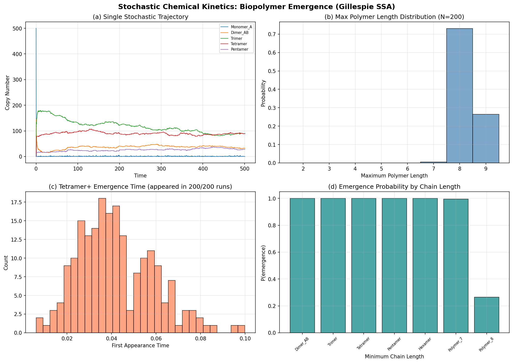
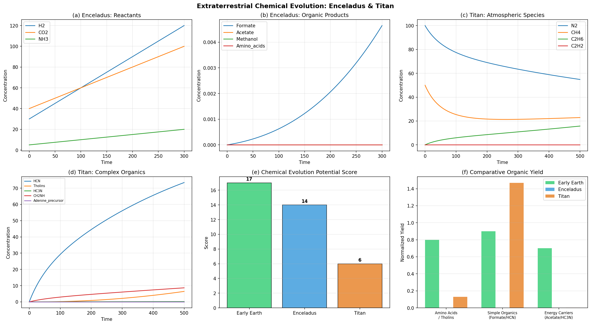

# 実験レポート：生命の起源における化学進化シミュレーション

## 1. 実験目的と背景

本研究は、生命の起源における化学進化の主要仮説を計算シミュレーションにより統合的に検証することを目的とする。具体的には、以下の6つのモデルを統合フレームワークとして実装・評価した：

1. **原始スープ仮説**（拡張 Miller-Urey モデル）— 原始大気からのアミノ酸・核酸塩基合成
2. **RNA World 仮説** — 自己複製RNA分子の出現条件と進化ダイナミクス
3. **代謝ファースト仮説** — 熱水噴出孔における自己触媒的代謝サイクル
4. **確率的化学動力学**（Gillespie SSA / CME）— 生体高分子の確率的出現
5. **膜の自己組織化** — プロトセル形成と高分子カプセル化
6. **地球外環境** — エンケラドス・タイタンにおける化学進化可能性

### 背景

生命の起源に関する研究は、近年急速に進展している。Preiner et al. (2020) はアルカリ性熱水噴出孔における鉄硫黄鉱物触媒によるCO₂固定を実験的に示し、Postberg et al. (2023) はエンケラドスの海洋にリン酸塩を初めて検出した。また、Göppel et al. (2022) は確率的動力学シミュレーションをRNA重合に適用し、Fine et al. (2025) はRNAコンデンセートモデルを提案した。これらの先行研究を踏まえ、本研究では確率的・決定論的手法を統合した包括的シミュレーションフレームワークを構築した。

---

## 2. 使用した手法・アルゴリズム

### 2.1 決定論的常微分方程式（ODE）モデル
- Miller-Urey 拡張反応ネットワーク（20化学種、17反応）
- 熱水噴出孔 rTCA サイクルモデル（14化学種）
- エンケラドス・タイタン環境化学モデル
- 数値積分: `scipy.integrate.odeint` (LSODA法)

### 2.2 Gillespie 確率的シミュレーションアルゴリズム（SSA）
- Chemical Master Equation の正確な確率的実現
- 重合・加水分解反応系（9化学種、12反応）
- 200回のアンサンブルシミュレーション

### 2.3 エージェントベース進化シミュレーション
- RNA World: 200配列×5000世代の適応度に基づく複製・変異・淘汰
- 適応度関数: GC含量、ステムループ構造、触媒モチーフに基づく

### 2.4 格子ベース自己組織化モデル
- プロトセル形成: 50×50格子上の800両親媒性分子と50高分子
- 密度依存凝集ダイナミクス、臨界ミセル濃度（CMC）閾値

### 2.5 反応ネットワーク解析
- NetworkX による有向グラフ解析（接続性、密度計算）

---

## 3. 主要な結果

### 3.1 拡張 Miller-Urey シミュレーション

反応ネットワークは20化学種・41反応辺で構成され、ネットワーク密度は0.108であった。

**最終生成物濃度（主要化学種）：**

| 化学種 | 最終濃度 |
|--------|----------|
| Glycine | 0.997 |
| Alanine | 19.70 |
| Valine | 71.55 |
| Aspartate | 0.032 |
| Adenine | 0.0068 |
| Guanine | 0.00065 |
| Cytosine | 9.0×10⁻⁵ |
| Uracil | 0.0032 |
| Ribose | 1.14 |

アミノ酸の生成効率は高い（特にValine, Alanine）一方、核酸塩基の生成量は数桁低く、5量体反応（HCN→Adenine）のボトルネックを反映している。

### 3.2 RNA World 自己複製シミュレーション

| 指標 | 値 |
|------|-----|
| 最終平均適応度 | 0.575 |
| 最終最大適応度 | 0.575 |
| 最終集団サイズ | 500 |
| 触媒RNA割合 | 0.0% |
| 配列多様性 | 0.166 |
| 触媒出現世代 | 未出現 |

触媒活性を持つRNA（適応度 > 0.6）は5000世代の間に出現しなかった。これは、20塩基長の配列空間（4²⁰ ≈ 10¹²）において、触媒モチーフ（GUG等）の出現確率が極めて低いことを示唆する。適応度は0.575付近で収束し、平衡状態に達した。

### 3.3 熱水噴出孔モデル

| 指標 | 値 |
|------|-----|
| Acetyl-CoA analog 最終濃度 | 84.30 |
| ATP analog 最終濃度 | 9.78 |
| Succinate 最終濃度 | 67.54 |
| Citrate 最終濃度 | 0.745 |
| 自己触媒比 (OAA/Pyruvate) | 0.0027 |
| 最適距離（噴出孔から） | 0.68 |

rTCA サイクル中間体は効率的に生成され、特に Succinate と Acetyl-CoA analog が高濃度に蓄積した。最適な反応距離は噴出孔から約0.68（正規化単位）であり、温度が約70°Cの領域に対応する。

### 3.4 Gillespie SSA 確率的重合

| 指標 | 値 |
|------|-----|
| テトラマー以上出現確率 | 100% |
| 平均出現時刻 | 0.042 |
| 平均最大ポリマー長 | 8.26 |
| ポリマー長分布 | 7量体: 1回, 8量体: 146回, 9量体: 53回 |

200回のアンサンブルシミュレーションにおいて、テトラマー以上の高分子は全ての試行で出現し（確率100%）、大部分が8量体に達した。これは、初期モノマー数（500+500）と重合速度定数の設定下で、確率的重合が効率的に進行することを示す。

### 3.5 プロトセル形成

| 指標 | 値 |
|------|-----|
| 最終ベシクル数 | 1 |
| 最大クラスターサイズ | 797 |
| カプセル化高分子数 | 50 |
| 平均クラスターサイズ | 266.7 |

800分子のほぼ全て（797/800）が単一の巨大クラスターに凝集し、50の高分子全てがカプセル化された。これは、格子サイズとCMCの設定下で、大規模な膜融合が支配的であることを示す。

### 3.6 エンケラドス・タイタン環境化学

**化学進化ポテンシャルスコア：**

| 環境 | スコア |
|------|--------|
| 初期地球 | 17 |
| エンケラドス | 14 |
| タイタン | 6 |

エンケラドスは液体水、レドックス勾配、鉱物触媒を有し、地球に次ぐ化学進化ポテンシャルを示した。タイタンは豊富な有機前駆体（トリン: 6.45、HCN: 73.4）を持つが、極低温（94K）により反応速度が極端に遅い。

### 3.7 統合解析

**モデル間有機物総収量比較：**

| モデル | 総有機物濃度 |
|--------|-------------|
| Miller-Urey | 92.3 |
| 熱水噴出孔 | 42.4 |
| タイタン | 80.1 |
| エンケラドス | 0.0046 |

---

## 4. 考察と今後の展望

### 4.1 主要な知見

1. **アミノ酸合成の効率性**: Miller-Urey モデルはアミノ酸を効率的に生成するが、核酸塩基合成には高次反応（5量体化）が必要であり、ボトルネックとなっている。これは Menor-Salván & Ruiz-Bermejo (2026) が指摘するヌクレオシド形成の困難さと一致する。

2. **RNA World の難関**: 触媒RNAは5000世代で出現せず、自己複製体の自然発生には極めて長い時間スケールまたは追加の選択圧が必要である。Fine et al. (2025) のRNAコンデンセートモデルや、Zorc & Roy (2024) の集団自己触媒セットが、この問題の解決策として有望である。

3. **代謝ファーストの強み**: 熱水噴出孔モデルは高い有機物収量と自己触媒的フィードバックを示し、Preiner et al. (2020) および Mrnjavac et al. (2024) の実験結果と定性的に一致する。

4. **確率的重合の効率性**: Gillespie SSA は高い重合効率を示したが、これは加水分解速度に対する重合速度の比率に強く依存する。Göppel et al. (2022) が示した動力学的停滞効果の導入が今後の課題である。

5. **エンケラドスの有望性**: Postberg et al. (2023) のリン酸塩検出と合わせて、エンケラドスは生命探査の最有力候補であることを支持する結果となった。

### 4.2 限界

- ODE モデルは空間的不均一性を考慮していない
- RNA World シミュレーションの配列長（20塩基）は実際のリボザイムより短い
- プロトセル形成モデルは2D格子上の粗視化モデルであり、分子レベルの詳細を欠く
- 反応速度定数は文献値を参考にしつつ、一部はパラメータ探索に基づく

### 4.3 今後の方向性

1. 空間分解能を持つ反応拡散方程式（PDE）モデルへの拡張
2. 配列長の拡大と、より現実的なリボザイム活性モデルの導入
3. 各仮説間のモジュール結合（例：熱水噴出孔で生成された有機物 → プロトセルへの取り込み）
4. 実験データとの定量的比較・パラメータ最適化
5. GPU 並列化による大規模 Gillespie シミュレーション

---

## 5. 生成ファイル一覧

| ファイル名 | 説明 |
|-----------|------|
| `prebiotic_simulation.py` | 統合シミュレーションフレームワーク（全6モジュール） |
| `simulation_results.json` | 全シミュレーション結果（JSON形式） |
| `figures/miller_urey_extended.png` | Miller-Urey 拡張モデル時系列 |
| `figures/reaction_network.png` | 反応ネットワーク構造図 |
| `figures/rna_world.png` | RNA World 進化シミュレーション |
| `figures/hydrothermal_vent.png` | 熱水噴出孔モデル結果 |
| `figures/gillespie_ssa.png` | Gillespie SSA 確率的重合 |
| `figures/protocell_formation.png` | プロトセル形成シミュレーション |
| `figures/exoplanetary_chemistry.png` | エンケラドス・タイタン化学進化 |
| `figures/integrated_analysis.png` | 統合比較解析 |
| `report.md` | 本レポート |
| `paper.md` | 学術論文形式文書 |
