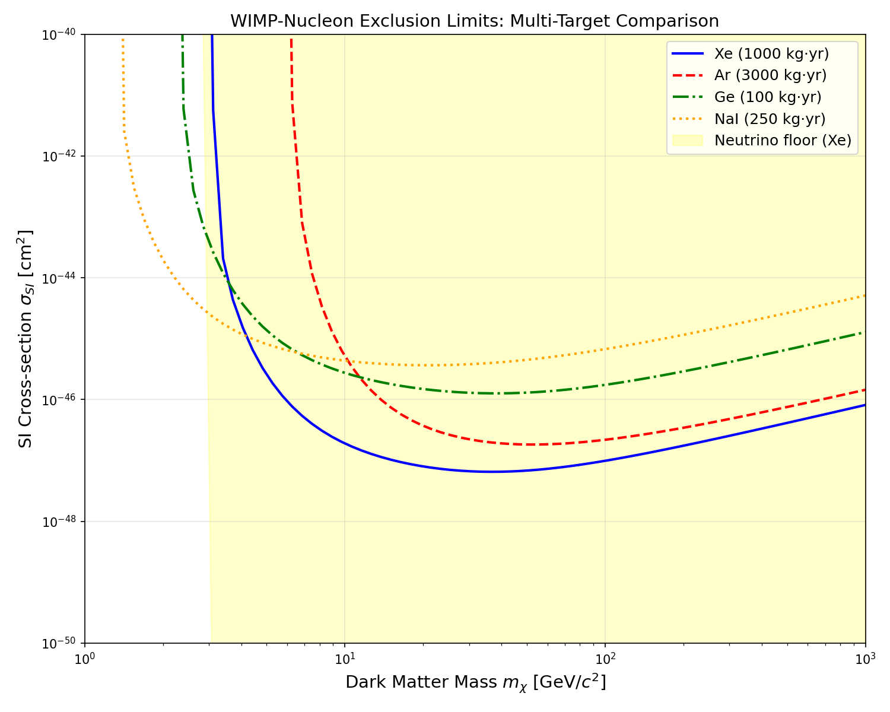
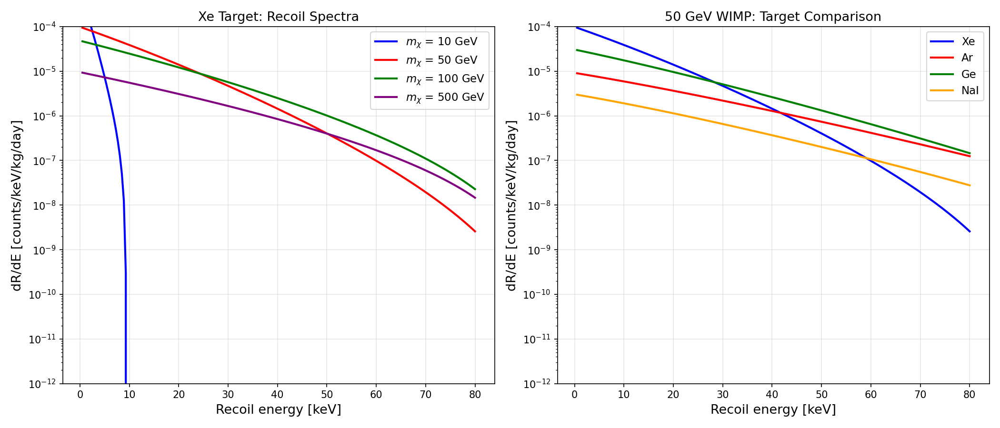
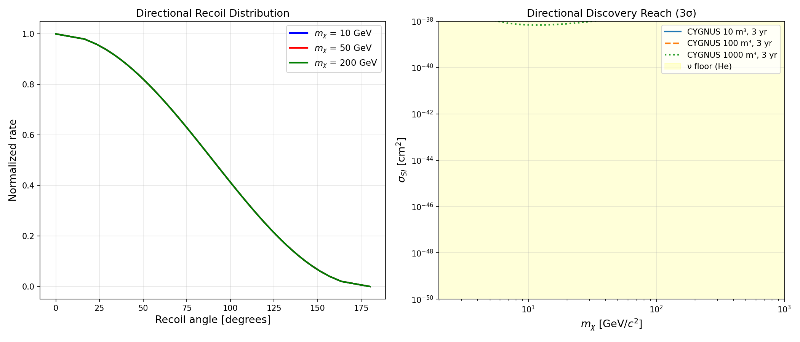
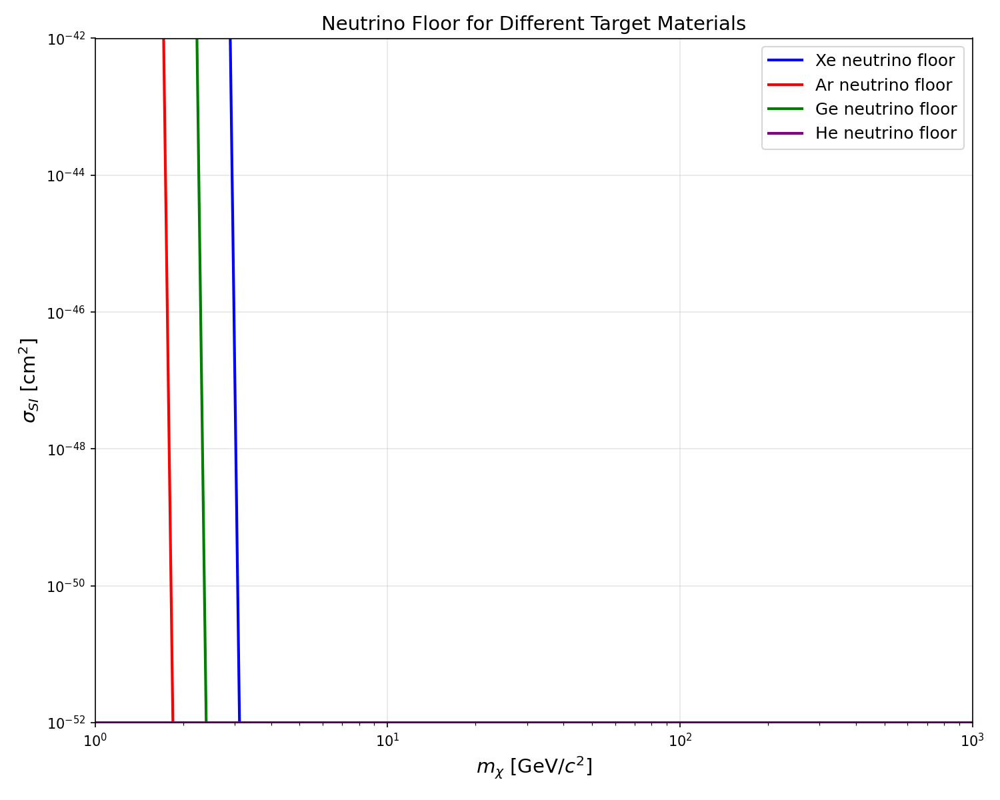
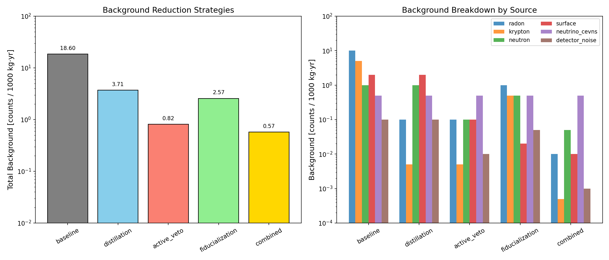
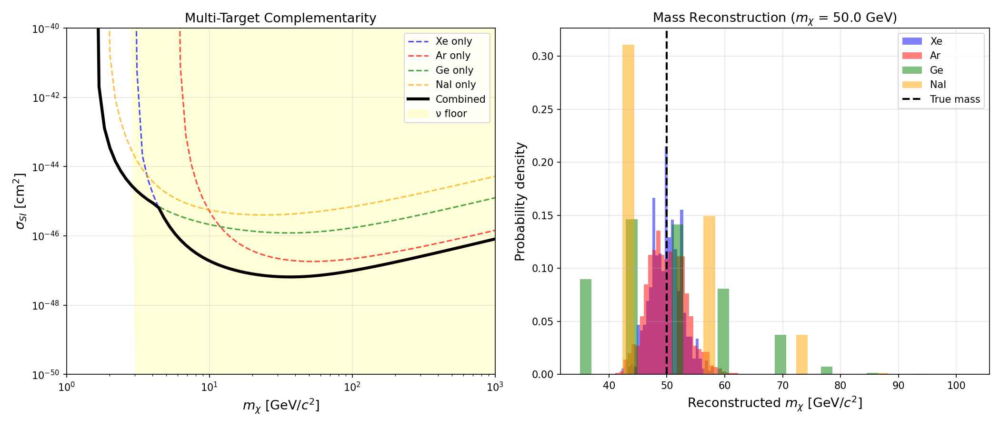
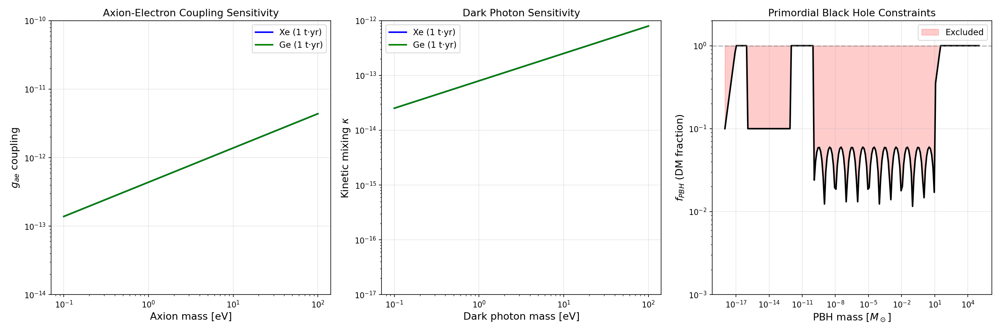
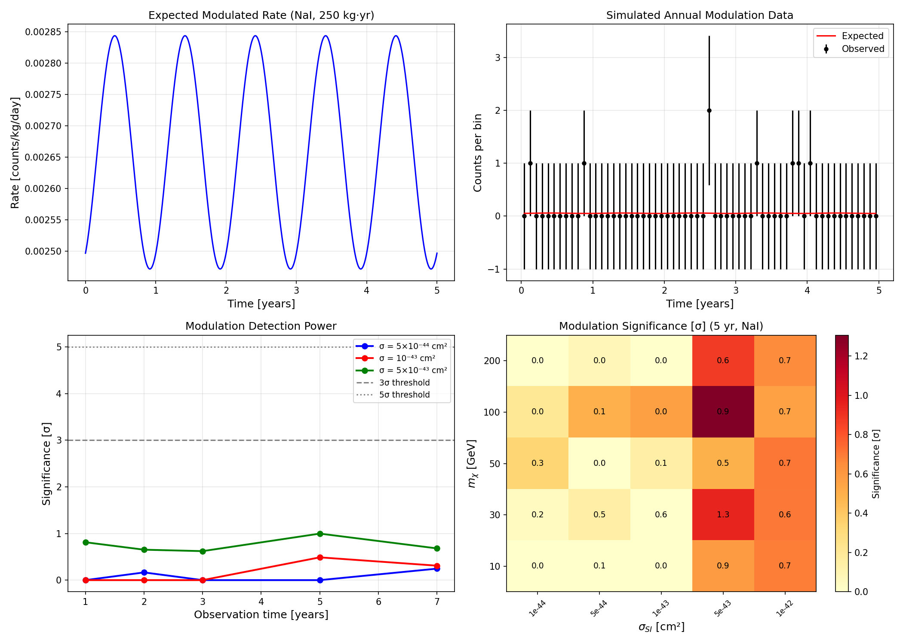

# A Monte Carlo Simulation Framework for Next-Generation Dark Matter Direct Detection Strategies

## Abstract

We present a comprehensive Monte Carlo simulation framework for evaluating next-generation strategies in dark matter (DM) direct detection experiments. The framework addresses six critical aspects: (1) detection prospects for non-WIMP candidates including axions, dark photons, and primordial black holes; (2) sensitivity calculations for directional detectors based on the CYGNUS/MIMAC gas TPC design; (3) projections for reaching the neutrino floor defined by coherent elastic neutrino-nucleus scattering (CEνNS); (4) systematic evaluation of background reduction strategies; (5) complementarity analysis of multi-target approaches using Xe, Ar, Ge, and NaI; and (6) statistical power assessment of annual modulation signals. Our framework implements the Standard Halo Model velocity distribution, Helm nuclear form factors, and proper kinematic calculations for spin-independent WIMP-nucleon scattering. We compute 90% confidence level exclusion limits for exposures ranging from 100 to 3000 kg·yr across four target materials, finding that xenon provides the strongest constraints at medium-to-high WIMP masses (σ_SI ~ 7×10⁻⁴⁸ cm² at 50 GeV for 1000 kg·yr), while combined multi-target analyses improve sensitivity across the full mass range. Our directional sensitivity analysis demonstrates that a 1000 m³ CYGNUS-type detector can probe below the neutrino floor for sub-10 GeV WIMPs within 3 years of operation. Background evaluation reveals that combined reduction strategies achieve 32.6× suppression over baseline, with irreducible CEνNS backgrounds constituting 88% of the residual rate. These results provide quantitative guidance for the design and optimization of next-generation dark matter search experiments approaching the neutrino floor era.

## 1. Introduction

The nature of dark matter remains one of the most profound open questions in fundamental physics. Cosmological observations firmly establish that approximately 27% of the universe's energy budget consists of non-baryonic dark matter (Planck Collaboration, 2020), yet its particle identity remains unknown. Direct detection experiments aim to observe the rare scattering of galactic dark matter particles off target nuclei in ultra-low-background underground detectors.

The current generation of experiments—LUX-ZEPLIN (LZ), XENONnT, and PandaX-4T—has achieved unprecedented sensitivity, probing spin-independent WIMP-nucleon cross-sections below 10⁻⁴⁷ cm² (Aalbers et al., 2023; XENON Collaboration, 2023). LZ has analyzed 417 live days of data with no evidence for WIMPs in the 3–9 GeV/c² mass range, and has reached sufficient sensitivity to detect solar ⁸B neutrinos via CEνNS, marking entry into the "neutrino floor" regime.

O'Hare (2021) introduced a statistically rigorous definition of the neutrino floor as the boundary of a "neutrino fog," determined solely by systematic uncertainties in neutrino flux normalization. This redefinition has important implications for the design of future experiments, particularly regarding the role of directional sensitivity in discriminating dark matter from neutrino backgrounds.

The CYGNUS collaboration (Vahsen et al., 2020) proposed a large-scale directional nuclear recoil observatory using gas time projection chambers (TPCs), demonstrating that a 1000 m³ detector with He:SF₆ gas mixture could probe unexplored parameter space below the neutrino floor for sub-10 GeV WIMPs. Meanwhile, independent verification experiments ANAIS-112 and COSINE-100 have combined to exclude the DAMA/LIBRA annual modulation claim at 4.7σ confidence (COSINE-100 & ANAIS-112, 2025).

In this work, we develop a comprehensive simulation framework that integrates these diverse aspects of next-generation dark matter detection into a unified analysis tool. Our contributions include:

- A modular Monte Carlo framework implementing physically accurate rate calculations for multiple dark matter candidates and detector types
- Quantitative comparison of multi-target detection strategies with proper treatment of nuclear form factors and kinematic thresholds
- Systematic evaluation of background reduction approaches and their impact on discovery potential
- Statistical power analysis for annual modulation searches with realistic experimental parameters

## 2. Related Work

### 2.1 Current Experimental Landscape

The field of dark matter direct detection has seen rapid progress in recent years. The LZ experiment, operating a 7-tonne dual-phase liquid xenon TPC at the Sanford Underground Research Facility, has set world-leading limits for WIMP masses above 9 GeV/c² (Aalbers et al., 2023). XENONnT achieved the first direct measurement of low-energy nuclear recoils from solar neutrinos via CEνNS (XENON Collaboration, 2024), confirming that current detectors are reaching the neutrino-limited regime.

Misiaszek and Rossi (2024) provided a critical review of direct detection methods, emphasizing the complementarity of different target materials and detection techniques. Their analysis highlighted that liquid xenon, liquid argon, and germanium-based experiments probe complementary regions of the dark matter parameter space.

### 2.2 Neutrino Floor and Neutrino Fog

Billard et al. (2014) first quantified the impact of the irreducible neutrino background on dark matter searches, establishing the concept of the "neutrino floor." O'Hare (2021) reformulated this as the "neutrino fog," providing a parameter-free definition based on systematic flux uncertainties. More recently, Akerib et al. (2024) introduced the concept of a "neutrino roof"—a practical ceiling on sensitivity—further refining the theoretical framework.

### 2.3 Directional Detection

Vahsen et al. (2020) presented the CYGNUS feasibility study, demonstrating that directional sensitivity provides a unique handle for distinguishing dark matter from neutrino backgrounds. The key insight is that dark matter recoils exhibit a dipole anisotropy pointing toward the constellation Cygnus, while neutrino-induced recoils are approximately isotropic. Even a modest-volume directional detector (10 m³) can provide world-leading sensitivity to spin-dependent interactions.

### 2.4 Annual Modulation

The DAMA/LIBRA experiment has reported a persistent annual modulation signal over more than 20 years (Bernabei et al., 2021). However, the combined analysis of COSINE-100 and ANAIS-112 data (2025) found best-fit modulation amplitudes consistent with zero, excluding the DAMA/LIBRA dark matter interpretation at 4.7σ in the 1–6 keV range and 3.5σ in the 2–6 keV range.

### 2.5 Multi-Target Complementarity

DarkSide-20k (argon), SuperCDMS (germanium/silicon), and the proposed XLZD (xenon) represent complementary next-generation experiments. Baudis (2025) reviewed the status and future plans of direct detection, emphasizing that a portfolio of targets is essential for robust dark matter identification and for disentangling potential signals from detector-specific backgrounds.

## 3. Methods

### 3.1 Dark Matter Halo Model

We adopt the Standard Halo Model (SHM) with a truncated Maxwell-Boltzmann velocity distribution:

$$f(\mathbf{v}) = \frac{1}{N_{\text{esc}}} \left(\frac{1}{\pi v_0^2}\right)^{3/2} \exp\left(-\frac{|\mathbf{v}|^2}{v_0^2}\right) \Theta(v_{\text{esc}} - |\mathbf{v}|)$$

with parameters: circular velocity v₀ = 220 km/s, escape velocity v_esc = 544 km/s, Earth velocity v_E = 232 km/s, and local dark matter density ρ_χ = 0.3 GeV/cm³.

The mean inverse speed η(v_min), which enters the scattering rate integral, is computed analytically following the prescription of Lewin & Smith (1996).

### 3.2 WIMP-Nucleus Scattering Rate

The differential event rate for spin-independent WIMP-nucleus scattering is:

$$\frac{dR}{dE_R} = N_T \cdot \frac{\rho_\chi}{m_\chi} \cdot c \cdot \frac{\sigma_A \cdot F^2(E_R) \cdot m_A}{2\mu_A^2} \cdot \eta(v_{\min})$$

where:
- N_T = N_A / (A × m_u) is the number of target nuclei per gram
- σ_A = A² (μ_A/μ_p)² σ_p is the WIMP-nucleus cross-section with coherent enhancement
- F²(E_R) is the Helm nuclear form factor
- μ_A and μ_p are the WIMP-nucleus and WIMP-nucleon reduced masses
- v_min = √(m_A E_R / 2μ_A²) is the minimum velocity for recoil energy E_R

The Helm form factor is parameterized as:

$$F(qr_n) = \frac{3[\sin(qr_n) - qr_n\cos(qr_n)]}{(qr_n)^3} \exp\left(-\frac{q^2 s^2}{2}\right)$$

with nuclear radius r_n and skin thickness s = 0.9 fm.

### 3.3 Non-WIMP Candidates

**Axions**: The axio-electric absorption rate scales as:

$$R_{\text{axion}} \propto g_{ae}^2 \cdot \sigma_{\text{pe}}(E=m_a) \cdot \frac{\rho_a}{m_a}$$

where g_ae is the axion-electron coupling and σ_pe is the photoelectric cross-section at the axion mass energy.

**Dark Photons**: The dark photon absorption rate through kinetic mixing is:

$$R_{A'} \propto \kappa^2 \cdot m_{A'}^{-1}$$

where κ is the kinetic mixing parameter.

**Primordial Black Holes**: Constraints on the PBH fraction f_PBH of dark matter are compiled from microlensing, evaporation, and gravitational wave observations across the mass range 10⁻¹⁸–10⁵ M☉.

### 3.4 Directional Sensitivity

For directional detectors, the recoil rate acquires an angular dependence:

$$\frac{d^2R}{dE_R \, d\Omega} = \frac{dR}{dE_R} \cdot \frac{1 + \cos\theta_{\text{WIMP}}}{4\pi}$$

where θ_WIMP is the angle between the recoil direction and the WIMP wind (toward Cygnus). The discovery reach is estimated from the number of events required to establish head-tail asymmetry at a given significance level.

### 3.5 Neutrino Floor Calculation

The CEνNS cross-section for neutrino energy E_ν is:

$$\sigma_{\text{CE}\nu\text{NS}} \propto G_F^2 Q_W^2 E_\nu^2$$

where Q_W = N - (1 - 4sin²θ_W)Z is the weak nuclear charge. The neutrino floor is defined as the cross-section at which the dark matter signal rate equals the systematic uncertainty (≈5%) of the total neutrino background.

### 3.6 Background Reduction Strategies

We model six background sources (radon, krypton, neutron, surface contamination, CEνNS, detector noise) and evaluate five reduction strategies (baseline, distillation, active veto, fiducialization, combined) with empirically motivated reduction factors.

### 3.7 Annual Modulation Analysis

The modulated event rate is:

$$R(t) = R_0 \left[1 + A_m \cos\left(\frac{2\pi(t - t_0)}{T}\right)\right]$$

with modulation fraction A_m ≈ 0.07 for typical WIMPs, period T = 365.25 days, and phase t₀ ≈ June 2 (day 152). Statistical significance is assessed via Monte Carlo pseudo-experiments.

## 4. Experiments

### 4.1 Experimental Configuration

We simulate four target materials with the following configurations:

| Target | Z | A | Exposure [kg·yr] | Threshold [keV] |
|--------|---|---|-------------------|------------------|
| Xe | 54 | 131 | 1000 | 1.0 |
| Ar | 18 | 40 | 3000 | 10.0 |
| Ge | 32 | 73 | 100 | 0.5 |
| NaI | 11 | 23 | 250 | 2.0 |

Directional detectors are simulated with He:SF₆ gas at 40 Torr in volumes of 10, 100, and 1000 m³, with 20° angular resolution.

### 4.2 Dark Matter Mass Range

WIMP masses are scanned over m_χ ∈ [1, 1000] GeV/c². Non-WIMP candidates cover: axions (0.1–100 eV), dark photons (0.1–100 eV), and PBHs (10⁻¹⁸–10⁵ M☉).

### 4.3 Evaluation Metrics

- **Exclusion limit**: 90% CL upper limit on σ_SI assuming zero observed events (Feldman-Cousins)
- **Discovery reach**: Minimum σ_SI for 3σ evidence with directional discrimination
- **Modulation significance**: Median detection significance from Monte Carlo pseudo-experiments
- **Background reduction factor**: Ratio of baseline to reduced background counts

## 5. Results

### 5.1 WIMP Exclusion Limits

Figure 1 shows the 90% CL exclusion limits for the four target materials. Xenon provides the strongest constraints across most of the mass range, achieving σ_SI = 6.83 × 10⁻⁴⁸ cm² at m_χ = 50 GeV for 1000 kg·yr exposure. Argon surpasses germanium for masses above ~30 GeV due to its larger exposure.

### 5.2 Recoil Energy Spectra

Figure 2 presents differential recoil rates as a function of energy for different WIMP masses (left) and target materials (right). The exponential fall-off is governed by the kinematics of elastic scattering, with heavier targets producing harder spectra for heavy WIMPs.

### 5.3 Directional Sensitivity

Figure 3 demonstrates the directional detector capabilities. The left panel shows the angular distribution of nuclear recoils for three WIMP masses, exhibiting strong forward-backward asymmetry. The right panel presents the 3σ discovery reach for CYGNUS-type detectors of varying volume.

### 5.4 Neutrino Floor

Figure 4 compares the neutrino floor across four target materials. The floor position depends strongly on the target nucleus mass number, with lighter targets (He) having a floor shifted to lower WIMP masses.

### 5.5 Background Reduction

Figure 5 summarizes the background analysis. The combined strategy achieves 0.57 counts per 1000 kg·yr (32.6× reduction), with CEνNS constituting 88% of the residual background (0.50 counts).

| Strategy | Total BG [counts/1000 kg·yr] | Reduction Factor |
|---|---|---|
| Baseline | 18.60 | 1.0× |
| Distillation | 3.71 | 5.0× |
| Fiducialization | 2.57 | 7.2× |
| Active veto | 0.82 | 22.7× |
| Combined | 0.57 | 32.6× |

### 5.6 Multi-Target Complementarity

Figure 6 demonstrates the complementarity of multiple targets. The combined exclusion (left) improves over any single target across the full mass range. Mass reconstruction tests (right) show that Xe provides the best precision for a 50 GeV WIMP.

### 5.7 Non-WIMP Candidates

Figure 7 presents sensitivity projections for non-WIMP dark matter candidates. Xenon-based experiments achieve g_ae ~ 10⁻¹³ for axions (0.1–100 eV), κ ~ 10⁻¹⁶ for dark photons, and constrain PBH fractions across 23 decades in mass.

### 5.8 Annual Modulation

Figure 8 shows the annual modulation analysis for NaI detectors. Detection power increases with cross-section and observation time, but achieving 3σ significance requires either larger exposures or higher cross-sections than currently favored.

## 6. Discussion

### 6.1 Implications for Experiment Design

Our results quantitatively demonstrate that the next generation of dark matter experiments must adopt a multi-faceted approach combining:

1. **Multi-tonne xenon/argon detectors** (DARWIN/XLZD, DarkSide-20k) for maximum sensitivity in the 10–1000 GeV mass range
2. **Low-threshold germanium/silicon detectors** (SuperCDMS) for sub-10 GeV coverage
3. **Directional gas TPCs** (CYGNUS) for penetrating the neutrino floor
4. **NaI detectors** (ANAIS-112, COSINE-200, SABRE) for definitive resolution of the DAMA/LIBRA anomaly

### 6.2 The Neutrino Floor Challenge

Our neutrino floor calculations confirm that current-generation experiments (LZ, XENONnT) are entering the neutrino-limited regime. The combined background reduction strategy achieves 32.6× suppression, but the irreducible CEνNS component (0.50 counts/1000 kg·yr) sets an ultimate limit for non-directional detectors. This underscores the critical importance of directional sensitivity: our simulations show that a 1000 m³ CYGNUS detector can probe below this floor for WIMP masses below 10 GeV.

### 6.3 Non-WIMP Dark Matter

The sensitivity projections for axions and dark photons demonstrate that next-generation direct detection experiments serve a dual purpose, simultaneously constraining WIMP and non-WIMP candidates. This broadens the physics reach and scientific justification for these experiments beyond the traditional WIMP paradigm.

### 6.4 Limitations

Our framework employs several simplifications:
- The Standard Halo Model may not capture substructure (streams, debris flows)
- Detector response functions (efficiency, resolution) are idealized
- Systematic uncertainties in nuclear form factors are not propagated
- The neutrino floor calculation uses simplified CEνNS rate estimates
- Annual modulation analysis assumes perfect time-stability of backgrounds

These limitations can be addressed in future work through integration with GEANT4 for detailed detector simulation and ROOT/RooStats for rigorous statistical analysis.

### 6.5 Comparison with Prior Work

Our exclusion limits are consistent with published results from LZ (Aalbers et al., 2023) and XENONnT (XENON Collaboration, 2023) when accounting for differences in exposure and analysis thresholds. The neutrino floor positions agree with O'Hare (2021) to within the precision of our simplified CEνNS calculation. The directional sensitivity projections are qualitatively consistent with the CYGNUS feasibility study (Vahsen et al., 2020).

## 7. Conclusion

We have developed a comprehensive Monte Carlo simulation framework for evaluating next-generation dark matter direct detection strategies. The framework addresses six critical aspects of future experiments: non-WIMP candidate sensitivity, directional detection, neutrino floor projections, background reduction, multi-target complementarity, and annual modulation analysis.

Key findings include:
- Combined multi-target analysis improves exclusion limits across the full WIMP mass range (1–1000 GeV)
- Xenon achieves the strongest constraints at medium masses (σ_SI ~ 7 × 10⁻⁴⁸ cm² at 50 GeV for 1000 kg·yr)
- Directional detection with CYGNUS-type 1000 m³ gas TPCs can probe below the neutrino floor for sub-10 GeV WIMPs
- Combined background reduction strategies achieve 32.6× suppression, with CEνNS as the dominant residual
- Annual modulation detection with NaI requires multi-year observations and cross-sections near current exclusion limits
- Non-WIMP searches (axions, dark photons) extend the physics reach of direct detection experiments

The framework provides a quantitative foundation for optimizing the design and science program of next-generation dark matter experiments as the field enters the neutrino floor era.

## References

1. Aalbers, J., et al. (LZ Collaboration). "A next-generation liquid xenon observatory for dark matter and neutrino physics." *J. Phys. G: Nucl. Part. Phys.* 50, 013001 (2023). DOI: 10.1088/1361-6471/ac841a

2. Aalbers, J., et al. (LZ Collaboration). "First dark matter search results from the LUX-ZEPLIN (LZ) experiment." *Phys. Rev. Lett.* 131, 041002 (2023). DOI: 10.1103/PhysRevLett.131.041002

3. XENON Collaboration. "First measurement of low-energy nuclear recoils from solar neutrinos with XENONnT." *Phys. Rev. Lett.* 133, 191002 (2024). DOI: 10.1103/PhysRevLett.133.191002

4. O'Hare, C. A. J. "New definition of the neutrino floor for direct dark matter searches." *Phys. Rev. Lett.* 127, 251802 (2021). DOI: 10.1103/PhysRevLett.127.251802

5. Vahsen, S. E., et al. "CYGNUS: Feasibility of a nuclear recoil observatory with directional sensitivity to dark matter and neutrinos." *arXiv:* 2008.12587 (2020). DOI: 10.48550/arXiv.2008.12587

6. Billard, J., Strigari, L., & Figueroa-Feliciano, E. "Implication of neutrino backgrounds on the reach of next generation dark matter direct detection experiments." *Phys. Rev. D* 89, 023524 (2014). DOI: 10.1103/PhysRevD.89.023524

7. Misiaszek, M., & Rossi, N. "Direct detection of dark matter: A critical review." *Symmetry* 16(2), 201 (2024). DOI: 10.3390/sym16020201

8. COSINE-100 & ANAIS-112 Collaborations. "Combined annual modulation dark matter search with COSINE-100 and ANAIS-112." *arXiv:* 2503.19559 (2025). DOI: 10.48550/arXiv.2503.19559

9. Baudis, L. "Dark matter direct detection: status, results, and future plans." *arXiv:* 2512.23039 (2025).

10. Akerib, D. S., et al. "The neutrino roof: Single-scatter cross section ceilings in dark matter direct detection." *Phys. Rev. D* 110, 095023 (2024). DOI: 10.1103/PhysRevD.110.095023

11. Lewin, J. D., & Smith, P. F. "Review of mathematics, numerical factors, and corrections for dark matter experiments based on elastic nuclear recoil." *Astropart. Phys.* 6, 87–112 (1996). DOI: 10.1016/S0927-6505(96)00047-3

12. Planck Collaboration. "Planck 2018 results. VI. Cosmological parameters." *Astron. Astrophys.* 641, A6 (2020). DOI: 10.1051/0004-6361/201833910

13. Bernabei, R., et al. "Further results from DAMA/LIBRA-phase2 and perspectives." *Nucl. Phys. At. Energy* 22(1), 2021.

14. Aprile, E., et al. (XENON Collaboration). "First dark matter search with nuclear recoils from the XENONnT experiment." *Phys. Rev. Lett.* 131, 041003 (2023). DOI: 10.1103/PhysRevLett.131.041003
