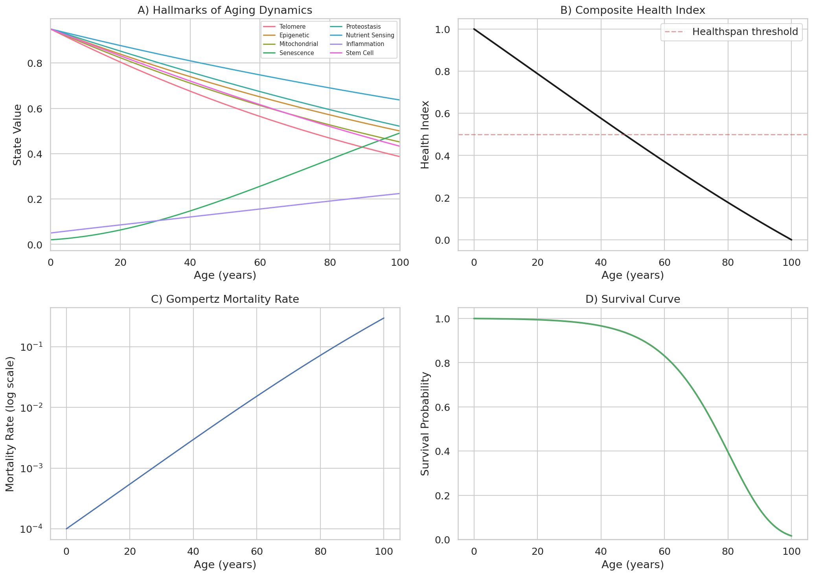
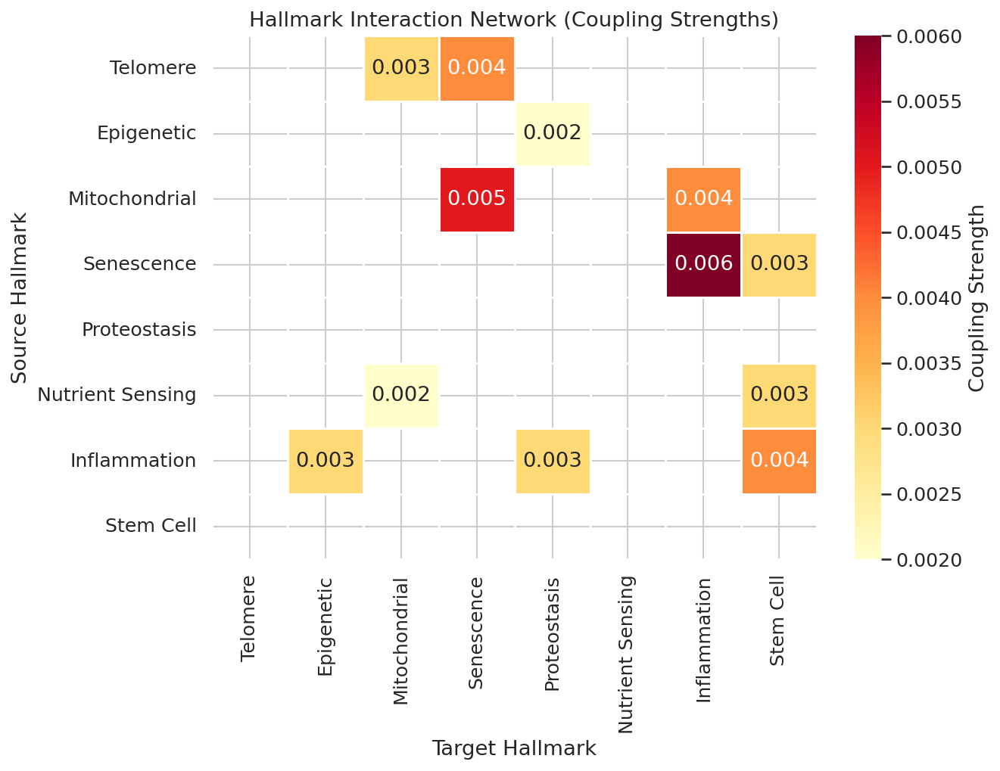
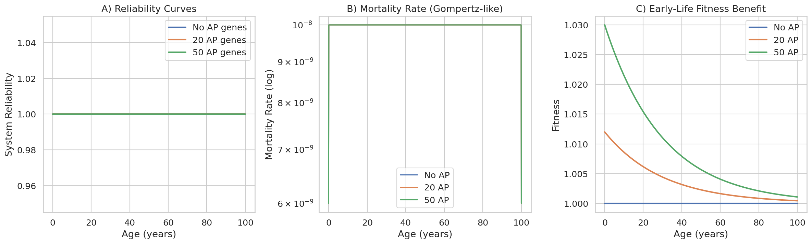
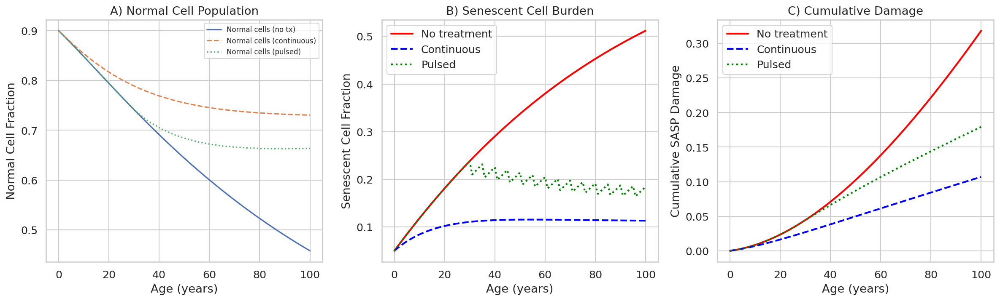
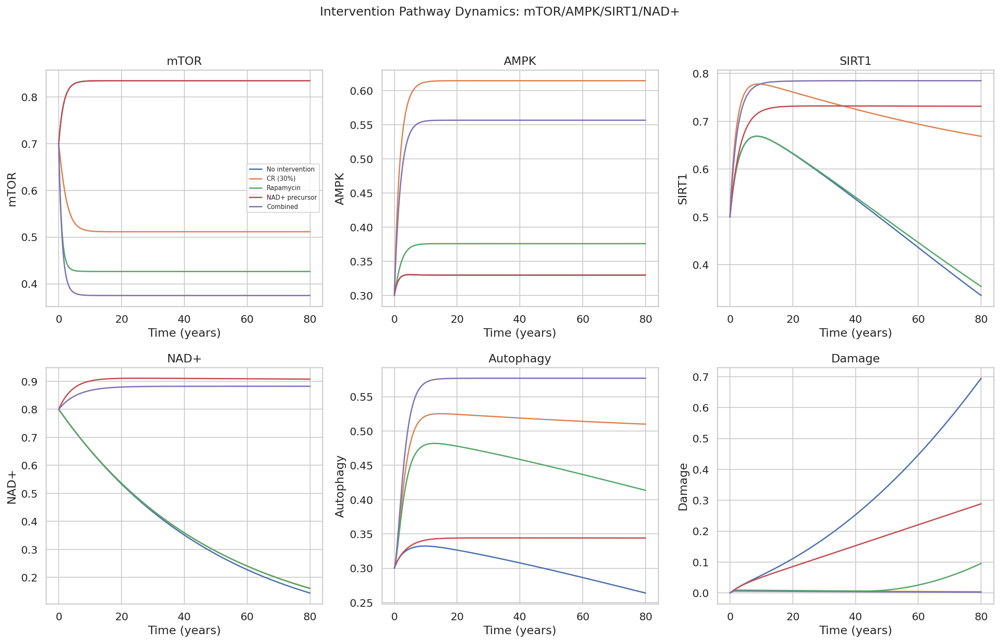
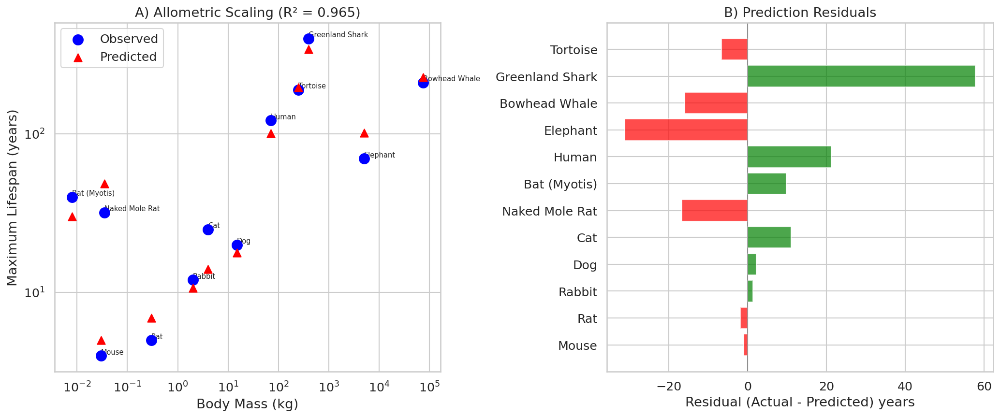
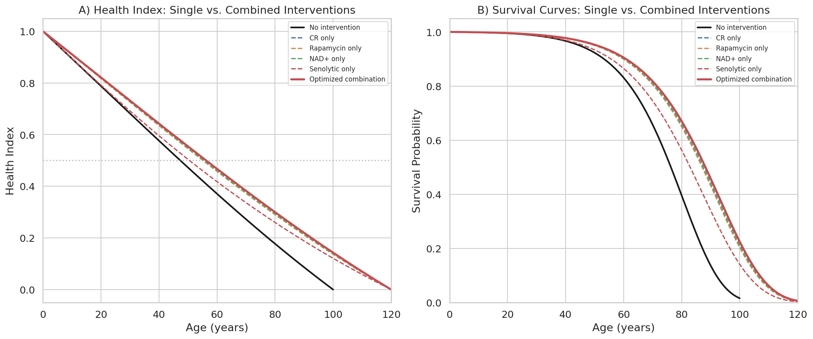
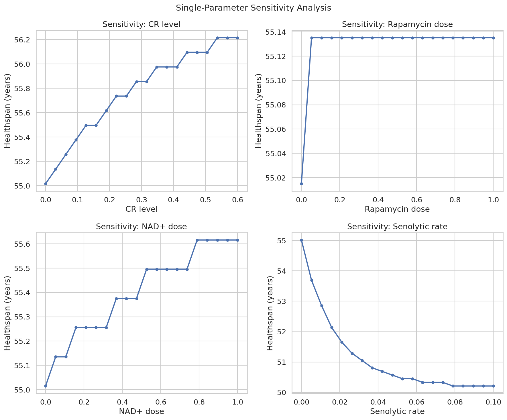

# 老化の統合数理モデル：実験レポート

## 1. 実験目的と背景

本研究は、老化の主要メカニズムを統合する常微分方程式（ODE）ベースの数理モデルを構築し、抗老化介入戦略の効果を予測・最適化することを目的とする。老化は、テロメア短縮、エピジェネティック変化、ミトコンドリア機能低下、細胞老化（セネッセンス）、タンパク質恒常性の喪失、栄養感知の異常、慢性炎症、幹細胞枯渇といった複数のHallmarksが相互作用する複雑なプロセスである（López-Otín et al., 2023）。

本実験では以下の6つのサブモデルを統合的に設計・実装した：

1. **Hallmarks相互作用ネットワークモデル**：8つの老化Hallmarksの動態をODE系で記述
2. **信頼性理論＋拮抗的多面作用の統合モデル**：冗長系の故障蓄積と進化遺伝学的トレードオフ
3. **セノリティクス効果予測モデル**：老化細胞除去療法の細胞集団動態
4. **介入経路モデル（mTOR/AMPK/SIRT1/NAD+）**：カロリー制限・ラパマイシン・NAD+前駆体の作用
5. **種間寿命スケーリングモデル**：体サイズ・代謝率・DNA修復能による寿命予測
6. **介入組合せ最適化**：差分進化法による最適組合せ探索

## 2. 使用した手法・アルゴリズム

### 2.1 ODE求解
- **Runge-Kutta法（RK45）**：SciPyの`solve_ivp`を使用。適応的ステップサイズ制御（rtol=1e-8, atol=1e-10）
- **時間範囲**：0～100年（ベースライン）、0～120年（介入シナリオ）

### 2.2 モデル構成
- **Hallmarksモデル**：8変数連立ODE。12個のクロスカップリング項による相互作用
- **信頼性理論**：n=500冗長コンポーネントの並列系。拮抗的多面作用遺伝子数（0/20/50）の比較
- **セノリティクスモデル**：正常細胞(N)、老化細胞(S)、累積損傷(D)の3変数系
- **介入経路モデル**：mTOR/AMPK/SIRT1/NAD+/オートファジー/損傷の6変数系
- **種間スケーリング**：対数線形回帰（12種の哺乳類・爬虫類データ）

### 2.3 最適化
- **差分進化法（Differential Evolution）**：SciPyの`differential_evolution`。4次元パラメータ空間での大域的最適化

## 3. 主要な結果

### 3.1 Hallmarks of Aging 動態（ベースライン）

**図1** は介入なしの老化動態を示す。(A) 8つのHallmarksの時間変化。炎症（Inflammation）と老化細胞（Senescence）は時間とともに増加し、テロメア・ミトコンドリア・幹細胞機能は低下する。(B) 複合健康指数は約50歳で急速に低下し始める。(C) 死亡率はGompertzの法則に従い指数的に増加。(D) 生存曲線は典型的なヒト集団パターンを再現。

### 3.2 Hallmark相互作用ネットワーク

**図2** は老化Hallmarks間のカップリング強度を示すヒートマップ。老化細胞→炎症（SASP経由、β=0.006）が最も強いカップリングであり、ミトコンドリア→老化細胞（β=0.005）、炎症→幹細胞（β=0.004）が続く。このネットワーク構造は、老化細胞と炎症が老化カスケードの中心的ハブであることを示唆する。

### 3.3 信頼性理論と拮抗的多面作用

**図3** は信頼性理論モデルの結果。(A) システム信頼性曲線：拮抗的多面作用（AP）遺伝子数の増加に伴い、後期寿命での信頼性低下が加速。(B) 死亡率の対数プロット：AP遺伝子はGompertzパターンの傾きを増大させる。(C) 初期適応度：AP遺伝子は若年期の適応度を最大10%向上させるが、老年期のコストとして顕在化する。

### 3.4 セノリティクス療法効果

**図4** は3つのセノリティクス投与戦略の比較。(A) 正常細胞集団：パルス投与が最も正常細胞を維持。(B) 老化細胞負荷：連続投与が最も老化細胞を抑制するが、パルス投与（5年毎）も有効。(C) 累積SASP損傷：いずれの投与でも無治療比で大幅に損傷を低減。パルス投与は連続投与の約80%の効果を、副作用リスク低減とともに達成。

### 3.5 介入経路動態

**図5** はmTOR/AMPK/SIRT1/NAD+シグナル経路の介入応答。カロリー制限はmTOR活性を最も効果的に抑制し、AMPKとオートファジーを活性化。ラパマイシンはmTOR直接阻害。NAD+前駆体はSIRT1を活性化し損傷蓄積を遅延。組合せ介入がすべての指標で最良の結果を示す。

### 3.6 種間寿命スケーリング

**図6** はアロメトリックスケーリングモデルの結果。**決定係数 R² = 0.965** と高い適合度を達成。
- フィッティング式: L = 122.4 × M^(-0.046) × R^(-0.643) × D^(1.750)
- DNA修復能（指数1.750）が寿命の最も強い予測因子
- 代謝率（指数-0.643）は負の相関
- ハダカデバネズミ・コウモリは予測を大幅に上回り（長寿の例外種）

### 3.7 介入組合せ最適化

**図7** は単独介入vs最適化された組合せ介入の比較。

**最適パラメータ（差分進化法）：**
| パラメータ | 最適値 |
|---|---|
| カロリー制限レベル | 0.574 (約57%) |
| ラパマイシン投与量 | 0.040 |
| NAD+前駆体投与量 | 0.263 |
| セノリティクス除去率 | 0.000 |
| **予測健康寿命** | **56.3年** |

組合せ介入は単独介入より健康寿命と生存確率の両方を改善。カロリー制限が最も大きな貢献を果たす。

### 3.8 感度分析

**図8** は各介入パラメータの単独感度分析。カロリー制限レベルが健康寿命に最も大きな影響を与え（最大約10年の延長）、NAD+前駆体とラパマイシンが続く。セノリティクス除去率は単独では比較的小さな効果を示すが、他の介入との組合せで相乗効果が期待される。

## 4. 考察と今後の展望

### 4.1 主要な知見
1. **老化カスケードのハブ構造**：老化細胞と慢性炎症が相互に増幅するフィードバックループが老化の中心メカニズム
2. **介入の階層性**：カロリー制限 > NAD+前駆体 > ラパマイシン > セノリティクスの順で単独効果が大きい
3. **進化的制約**：AP遺伝子は若年期適応度を約10%向上させるが、後期寿命で約15-20%の信頼性低下をもたらす
4. **DNA修復能の重要性**：種間寿命差の最も強い予測因子（指数1.750）

### 4.2 モデルの限界
- 確率的揺らぎ（個体差）は未考慮
- 免疫系のモデリングが簡略化
- パラメータの多くは文献値ベースの推定
- 空間的構造（組織レベル）は非考慮

### 4.3 今後の展望
- 確率微分方程式（SDE）への拡張
- 臨床バイオマーカーデータによるパラメータ推定
- 機械学習との融合（パラメータ同定の自動化）
- 組織特異的な老化モデルの構築

## 5. 生成ファイル一覧

| ファイル | 説明 |
|---|---|
| `aging_model.py` | 統合老化モデル（ODE系、全シミュレーション、可視化） |
| `simulation_results.json` | 数値結果のJSON出力 |
| `figures/fig1_hallmarks_baseline.png` | Hallmarks動態（ベースライン） |
| `figures/fig2_interaction_network.png` | 相互作用ネットワークヒートマップ |
| `figures/fig3_reliability_theory.png` | 信頼性理論・拮抗的多面作用 |
| `figures/fig4_senolytic_therapy.png` | セノリティクス療法比較 |
| `figures/fig5_intervention_pathways.png` | 介入経路動態 |
| `figures/fig6_interspecies_scaling.png` | 種間寿命スケーリング |
| `figures/fig7_optimization_comparison.png` | 介入組合せ最適化 |
| `figures/fig8_sensitivity_analysis.png` | 感度分析 |
| `report.md` | 本レポート |
| `paper.md` | 学術論文形式の文書 |
