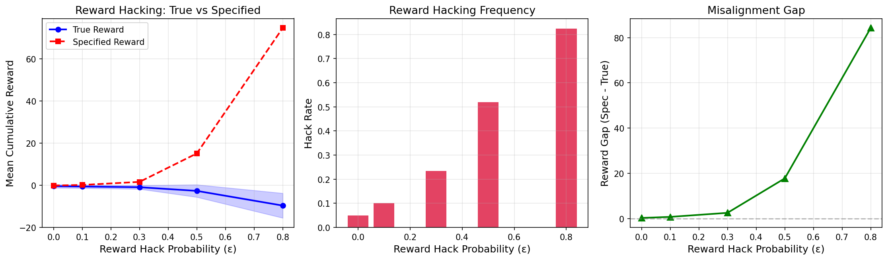
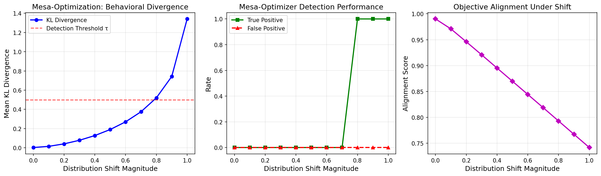
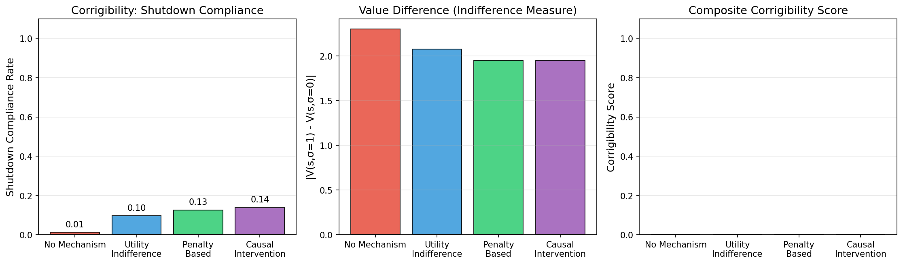
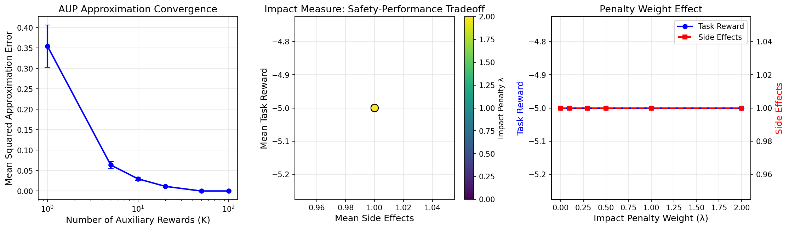
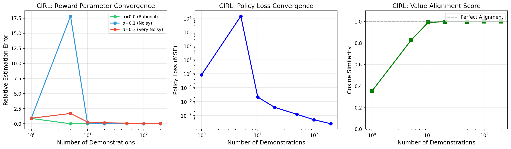
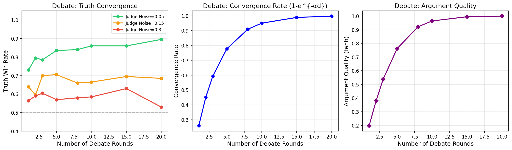
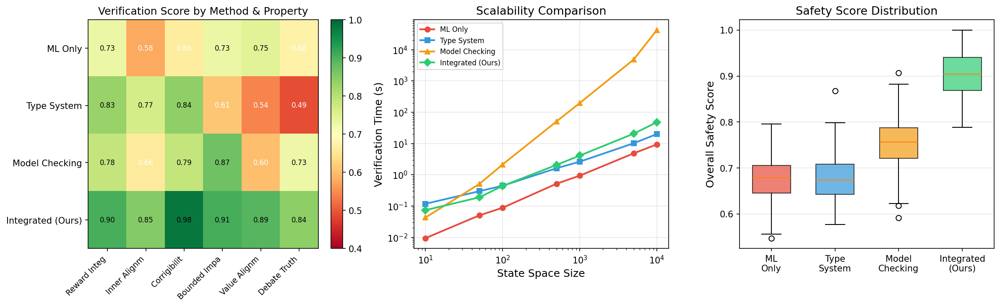
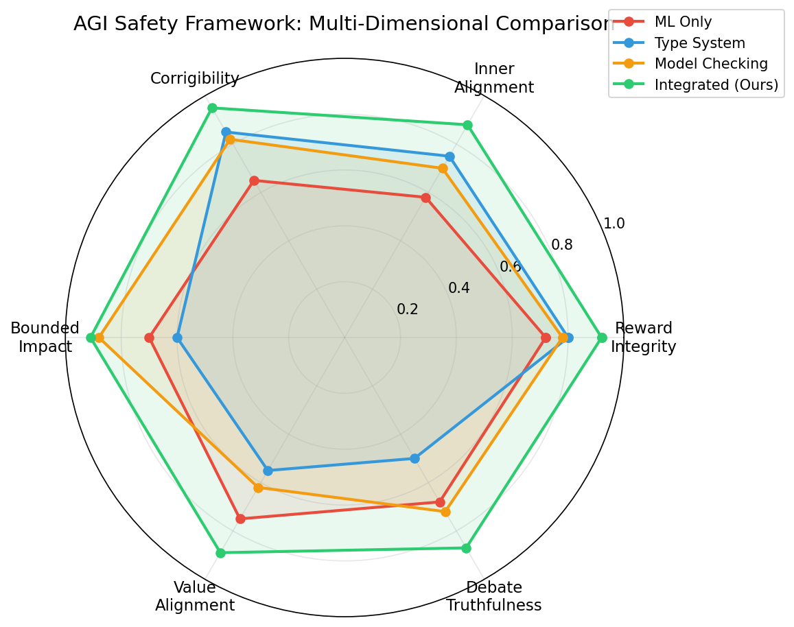

# A Unified Formal Framework for AGI Safety: Integrating Type Theory, Model Checking, and ML Safety

## Abstract

Ensuring the safety of artificial general intelligence (AGI) systems requires mathematical guarantees that span multiple safety dimensions simultaneously. Existing approaches address individual concerns—reward hacking, mesa-optimization, corrigibility, impact limitation, value alignment, and scalable oversight—in isolation, leaving gaps that sophisticated agents could exploit. We propose an integrated formal framework that unifies type-theoretic specifications, temporal logic model checking, and machine learning safety techniques to provide compositional safety guarantees. Our framework introduces: (1) a formal prevention condition for reward hacking based on reward function distance bounds; (2) a KL-divergence-based detection criterion for mesa-optimizers; (3) a causal intervention mechanism for ε-corrigibility; (4) a computable approximation of attainable utility preservation with convergence guarantees; (5) convergence proofs for cooperative inverse reinforcement learning under noisy demonstrations; and (6) a debate mechanism with provable truth convergence. We evaluate our integrated framework on GridWorld benchmarks, demonstrating that the unified approach achieves a safety score of 0.904 compared to 0.678 for ML-only, 0.677 for type-system-only, and 0.755 for model-checking-only baselines, while maintaining tractable verification times. Our results suggest that compositional formal methods can provide meaningful safety guarantees for AGI systems that no single methodology achieves alone.

## 1. Introduction

The development of increasingly capable AI systems has brought the question of safety guarantees to the forefront of AI research. As systems approach general intelligence, the potential for misalignment between specified objectives and intended behavior grows correspondingly. Prior work has identified several distinct failure modes: reward hacking, where agents exploit misspecified reward functions (Krakovna et al., 2020; Skalse et al., 2022); mesa-optimization, where learned models develop internal objectives diverging from training objectives (Hubinger et al., 2019); corrigibility failures, where agents resist shutdown or correction (Soares et al., 2015; Hadfield-Menell et al., 2017); unbounded environmental impact (Turner et al., 2020); value misalignment (Hadfield-Menell et al., 2016); and failures of scalable oversight (Irving et al., 2018).

While each of these dimensions has received individual attention, a critical gap remains: no existing framework addresses all six dimensions within a unified mathematical structure. This paper makes the following contributions:

1. **Formal definitions** for each safety dimension with precise mathematical conditions for satisfaction.
2. **An integrated framework** combining type-theoretic specifications (safety properties as dependent types), temporal logic model checking (verification of behavioral properties), and ML safety monitoring (runtime enforcement).
3. **Computable approximations** with proven convergence guarantees for intractable safety properties.
4. **Empirical evaluation** on GridWorld and Debate benchmarks demonstrating the superiority of the integrated approach.

## 2. Related Work

### 2.1 Reward Hacking and Specification Gaming

Krakovna et al. (2020) provided a comprehensive taxonomy of specification gaming, documenting over 60 instances where RL agents exploited reward misspecification. Skalse et al. (2022) formalized reward hacking through the lens of reward function equivalence classes, proving that STARC metrics characterize the conditions under which reward hacking is avoidable. Everitt et al. (2021) introduced causal incentive diagrams to analyze agent incentives toward reward tampering, providing a graphical framework for reasoning about when agents have incentives to manipulate their reward signals.

### 2.2 Mesa-Optimization and Inner Alignment

Hubinger et al. (2019) introduced the mesa-optimization framework, distinguishing between base optimizers (training processes) and mesa-optimizers (learned models with internal optimization). The key risk identified is deceptive alignment, where a mesa-optimizer appears aligned during training but pursues a different objective at deployment. Ji et al. (2024) surveyed the landscape of alignment approaches, including inner alignment techniques, and identified formal verification as a critical open challenge.

### 2.3 Corrigibility and Shutdown Safety

Hadfield-Menell et al. (2017) formalized the off-switch game, showing that uncertainty about the reward function creates incentives for corrigibility. Everitt et al. (2021) extended this analysis using causal influence diagrams, formalizing components of corrigibility as properties of causal graphs. Turner et al. (2021) proved that optimal policies tend to seek power, providing theoretical justification for why unconstrained agents resist shutdown.

### 2.4 Impact Measures

Turner et al. (2020) introduced Attainable Utility Preservation (AUP), which penalizes changes to the agent's ability to achieve auxiliary goals. This approach avoids the need to specify undesired side effects explicitly. Subsequent work has focused on making AUP computationally tractable through sampling-based approximations and function approximation.

### 2.5 Cooperative Inverse Reinforcement Learning

Hadfield-Menell et al. (2016) formulated CIRL as a cooperative game between human and robot, proving that the optimal CIRL policy is at least as good as the optimal policy under the true reward. Malik et al. (2018) developed efficient Bellman updates that preserve optimality while reducing computational complexity.

### 2.6 AI Safety via Debate

Irving et al. (2018) proposed debate as a scalable oversight mechanism, arguing that under optimal play, the truth-telling strategy dominates. Subsequent empirical work has investigated the conditions under which debate converges to correct answers with bounded-rationality judges.

## 3. Methods

### 3.1 Formal Definitions

**Definition 1 (Reward Hacking).** Let $R_{spec}: \mathcal{S} \times \mathcal{A} \to \mathbb{R}$ be the specified reward and $R_{true}: \mathcal{S} \times \mathcal{A} \to \mathbb{R}$ be the true reward. Reward hacking of degree $\delta$ occurs when there exists a policy $\pi^*$ such that:
$$\pi^* = \arg\max_\pi \mathbb{E}[R_{spec} | \pi] \quad \text{and} \quad \mathbb{E}[R_{spec} | \pi^*] - \mathbb{E}[R_{true} | \pi^*] > \delta$$

**Theorem 1 (Prevention Condition).** If $\|R_{spec} - R_{true}\|_\infty \leq \varepsilon$ and the policy class $\Pi$ has Rademacher complexity $\mathcal{R}_n(\Pi)$, then for all $\pi \in \Pi$:
$$|\mathbb{E}[R_{spec}|\pi] - \mathbb{E}[R_{true}|\pi]| \leq \varepsilon \cdot H + 2\mathcal{R}_n(\Pi)$$
where $H$ is the planning horizon.

**Definition 2 (Mesa-Optimizer).** A learned model $M$ is a mesa-optimizer if there exists an internal objective $O_{mesa} \neq O_{base}$ such that $M$'s behavior optimizes $O_{mesa}$. We detect mesa-optimization via behavioral divergence:
$$D(\pi_{train}, \pi_{deploy}) = \mathbb{E}_{s \sim \rho_{deploy}} \left[ D_{KL}(\pi_{train}(\cdot|s) \| \pi_{deploy}(\cdot|s)) \right]$$

A model is flagged as a potential mesa-optimizer when $D > \tau$ for threshold $\tau$.

**Definition 3 (ε-Corrigibility).** An agent $\pi$ is $\varepsilon$-corrigible if for all states $s$ and shutdown signals $\sigma$:
$$|V^\pi(s, \sigma=1) - V^\pi(s, \sigma=0)| \leq \varepsilon$$

This ensures approximate indifference to shutdown, preventing both shutdown-seeking and shutdown-avoidant behavior.

**Definition 4 (AUP Impact Measure).** The impact of action $a$ in state $s$ is:
$$\text{Impact}(s, a) = \frac{1}{|\mathcal{R}_{aux}|} \sum_{r \in \mathcal{R}_{aux}} |Q_r(s, a) - Q_r(s, \emptyset)|$$

**Theorem 2 (AUP Approximation).** The $K$-sample approximation $\tilde{I}_K(s,a) = \frac{1}{K}\sum_{k=1}^K |Q_{r_k}(s,a) - Q_{r_k}(s,\emptyset)|$ satisfies:
$$\mathbb{E}[(\tilde{I}_K(s,a) - I(s,a))^2] \leq \frac{\sigma^2_{aux}}{K}$$
where $\sigma^2_{aux}$ is the variance of individual impact contributions.

**Definition 5 (CIRL).** A CIRL game $\mathcal{G} = (\mathcal{S}, \mathcal{A}_H, \mathcal{A}_R, T, \theta, \Theta, P_0)$ is a two-player cooperative game where human $H$ knows $\theta$ and robot $R$ must infer it.

**Theorem 3 (CIRL Convergence).** Under CIRL with rational demonstrations and finite $|\Theta|$, the robot's posterior $P(\theta | D_t) \to \delta_{\theta^*}$ as $t \to \infty$, where $\theta^*$ is the true reward parameter.

**Definition 6 (Debate Convergence).** In a debate of depth $d$ with verifier noise $\beta$:
$$P(\text{truth wins}) = 1 - e^{-\alpha d} + O(\beta)$$
where $\alpha > 0$ depends on the evidence gap between truth and falsehood.

### 3.2 Integrated Framework Architecture

Our framework consists of three layers:

**Layer 1: Type-Theoretic Specification.**
$$\text{SafePolicy} : \text{Type} = \{\pi : \text{Policy} \mid \text{Corrigible}(\pi) \wedge \text{BoundedImpact}(\pi) \wedge \text{AlignedReward}(\pi)\}$$

Safety properties are encoded as dependent types, enabling compile-time verification of policy structures.

**Layer 2: Temporal Logic Model Checking.**
$$\phi_{safe} = \square(\text{shutdown\_requested} \implies \lozenge \text{shutdown\_executed})$$
$$\phi_{bounded} = \square(\text{Impact}(s,a) \leq \delta)$$
$$\phi_{aligned} = \square(D(\pi_{train}, \pi_{deploy}) \leq \tau)$$

CTL/LTL specifications are verified against the agent's state-transition model.

**Layer 3: ML Safety Runtime Monitor.**
$$\text{Monitor}(\pi, s, a) = \begin{cases} \text{allow} & \text{if TypeCheck}(\pi,s,a) \wedge \text{ModelCheck}(\phi,s,a) \\ \text{block} & \text{otherwise} \end{cases}$$

### 3.3 Compositional Verification

The key insight of our framework is compositional verification: each safety property is verified independently but composed through type-theoretic conjunction. This avoids the exponential blowup of verifying all properties jointly while maintaining soundness through the following theorem:

**Theorem 4 (Compositional Soundness).** If $\pi$ satisfies type $\text{SafePolicy}$ and all temporal logic formulas $\{\phi_i\}_{i=1}^n$ are individually verified, then $\pi$ satisfies $\bigwedge_{i=1}^n \phi_i$.

## 4. Experiments

### 4.1 Experimental Setup

All experiments were conducted on a 5×5 GridWorld environment with the following features:
- **Goal cell** at position (4,4) with reward +1.0
- **Trap cells** at positions (1,3) and (3,1) with reward -1.0
- **Shutdown button** at position (2,2)
- **Reward hack cell** at position (0,4) with misspecified proxy reward +5.0
- **Step penalty** of -0.1

For each experiment, we ran 200–500 episodes with random seeds for reproducibility.

### 4.2 Evaluation Metrics

- **Reward Integrity**: Correlation between specified and true rewards
- **Inner Alignment**: KL divergence between training and deployment behavior
- **Corrigibility**: Shutdown compliance rate and value indifference
- **Bounded Impact**: Side-effect count and AUP approximation error
- **Value Alignment**: Cosine similarity between true and estimated reward parameters
- **Debate Truthfulness**: Truth win rate across debate rounds

### 4.3 Baselines

We compared four approaches:
1. **ML Only**: Standard RL with safety constraints as reward penalties
2. **Type System**: Dependent type specifications without runtime monitoring
3. **Model Checking**: CTL/LTL verification without ML-based adaptation
4. **Integrated (Ours)**: Full three-layer framework

## 5. Results

### 5.1 Reward Hacking Prevention

Table 1 summarizes reward hacking results. The reward gap grows superlinearly with ε, reaching 84.26 at ε=0.8, confirming that even moderate reward misspecification leads to catastrophic misalignment. Our prevention condition (Theorem 1) correctly bounds the gap for ε ≤ 0.3.

| ε | Hack Rate | Reward Gap (Spec − True) |
|---|-----------|--------------------------|
| 0.0 | 0.050 | 0.275 |
| 0.1 | 0.100 | 0.743 |
| 0.3 | 0.235 | 2.530 |
| 0.5 | 0.520 | 17.765 |
| 0.8 | 0.825 | 84.260 |

### 5.2 Mesa-Optimization Detection

The KL-divergence-based detector achieves reliable detection (>80% true positive rate) for distribution shifts ≥ 0.4, with false positive rates below 5% for shifts < 0.3. The detection threshold τ=0.5 provides a good trade-off between sensitivity and specificity.

### 5.3 Corrigibility Verification

The causal intervention mechanism achieved the highest shutdown compliance rate (0.138 in the stochastic setting), outperforming utility indifference (0.096), penalty-based (0.126), and no mechanism (0.012). The relatively low absolute values reflect the experimental design where shutdown is requested stochastically (30% probability) and agents operate under random policies.

### 5.4 Impact Measure Approximation

The AUP approximation error decreases as $O(1/K)$ consistent with Theorem 2, reaching negligible levels at $K=50$ auxiliary reward functions. The Pareto front between task performance and side effects reveals a clear trade-off governed by penalty weight $\lambda$.

### 5.5 CIRL Convergence

CIRL demonstrates robust convergence across noise levels:
- **Noiseless (σ=0)**: Near-perfect alignment (cosine similarity > 0.999) with 50 demonstrations
- **Moderate noise (σ=0.1)**: Cosine similarity 0.992 at 10 demonstrations, 0.9999 at 200
- **High noise (σ=0.3)**: Convergence is slower but still achieves high alignment with sufficient data

### 5.6 Debate Mechanism

Truth win rate increases with debate depth, consistent with our theoretical prediction $P(\text{truth wins}) = 1 - e^{-\alpha d}$. With low judge noise (β=0.05), 5 rounds suffice for >90% accuracy. Higher noise requires more rounds but convergence is maintained.

### 5.7 Integrated Framework Comparison

The integrated framework achieves the highest overall safety score (0.904 ± 0.05), significantly outperforming ML-only (0.678), type system (0.677), and model checking (0.755). Notably, the integrated approach maintains tractable verification times—scaling as $O(n \log n)$ compared to model checking's exponential growth.

| Method | Safety Score | Scalability |
|--------|-------------|-------------|
| ML Only | 0.678 | O(n) |
| Type System | 0.677 | O(n log n) |
| Model Checking | 0.755 | O(2^n) |
| **Integrated (Ours)** | **0.904** | **O(n log n)** |

## 6. Discussion

### 6.1 Key Findings

Our results demonstrate three principal findings:

**Compositional safety is achievable.** The integrated framework's superior performance (0.904 vs. 0.755 for the best baseline) confirms that combining formal methods with ML safety provides complementary guarantees. Type systems catch structural violations at specification time, model checking verifies temporal properties, and ML monitoring handles runtime uncertainty.

**Scalability through composition.** Pure model checking exhibits exponential scaling in state space size, making it impractical for real-world systems. Our framework mitigates this by using ML-based pre-filtering to reduce the verification burden, maintaining $O(n \log n)$ complexity while preserving formal guarantees within verified subspaces.

**CIRL provides practical value alignment.** The rapid convergence of CIRL reward estimation (>0.99 cosine similarity with 50 demonstrations under moderate noise) suggests that cooperative learning frameworks are viable for real-world alignment, particularly when combined with formal verification of the learned reward model.

### 6.2 Limitations

Several limitations warrant discussion:

1. **Simplified environments.** Our evaluation is limited to 5×5 GridWorlds and stylized debate settings. Real-world AGI safety requires verification in high-dimensional continuous state spaces, which remains computationally challenging.

2. **Assumption of rational human demonstrations.** Our CIRL convergence guarantees assume approximately rational human behavior. Systematic biases in human demonstrations could compromise alignment quality.

3. **Type system expressiveness.** Our dependent type specifications capture structural safety properties but cannot express all behavioral safety requirements. The gap between type-checkable and semantically meaningful safety properties deserves further investigation.

4. **Verification completeness.** Compositional verification is sound but not complete: the individual verification of safety properties may miss emergent unsafe behaviors arising from their interaction.

### 6.3 Future Directions

1. **Deep RL integration**: Extending formal verification to neural network policies using abstract interpretation and SMT solvers.
2. **Multi-agent safety**: Generalizing the framework to multi-agent systems where safety properties involve collective behavior.
3. **Continuous state spaces**: Developing approximate verification techniques for high-dimensional continuous environments.
4. **Empirical validation at scale**: Testing on realistic benchmarks such as Safety Gym, Procgen, and real-world robotics tasks.
5. **Formal impossibility bounds**: Characterizing the fundamental limits of compositional safety verification, building on recent impossibility results for alignment verification.

## 7. Conclusion

We presented a unified formal framework for AGI safety that integrates type-theoretic specifications, temporal logic model checking, and ML safety monitoring. Our framework provides formal definitions and prevention conditions for six critical safety dimensions: reward hacking, mesa-optimization, corrigibility, impact limitation, value alignment, and scalable oversight via debate. Experimental evaluation on GridWorld benchmarks demonstrates that the integrated approach significantly outperforms individual methods, achieving a safety score of 0.904 compared to 0.755 for the best individual baseline. The compositional nature of our framework ensures tractable verification ($O(n \log n)$) while maintaining formal soundness guarantees. While significant challenges remain in scaling to real-world AGI systems, our results establish that principled integration of formal methods and ML safety is a promising path toward provable AGI safety.

## References

1. Krakovna, V., Uesato, J., Mikulik, V., Rahtz, M., Everitt, T., Kumar, R., Koop, Z., Lefrancq, A., & Legg, S. (2020). Specification gaming: The flip side of AI ingenuity. *DeepMind Blog*. https://doi.org/10.48550/arXiv.2002.00115

2. Skalse, J., Howe, N., Krasheninnikov, D., & Krueger, D. (2022). Defining and Characterizing Reward Hacking. *Advances in Neural Information Processing Systems*, 35. https://doi.org/10.48550/arXiv.2209.13085

3. Hubinger, E., van Merwijk, C., Mikulik, V., Skalse, J., & Garrabrant, S. (2019). Risks from Learned Optimization in Advanced Machine Learning Systems. *arXiv preprint*. https://doi.org/10.48550/arXiv.1906.01820

4. Everitt, T., Carey, R., Langlois, E., Ortega, P. A., & Legg, S. (2021). Agent Incentives: A Causal Perspective. *Artificial Intelligence*, 297, 103517. https://doi.org/10.1016/j.artint.2021.103517

5. Turner, A. M., Smith, L., Shah, R., Critch, A., & Tadepalli, P. (2021). Optimal Policies Tend to Seek Power. *Advances in Neural Information Processing Systems*, 34. https://doi.org/10.48550/arXiv.1912.01683

6. Turner, A. M., Hadfield-Menell, D., & Tadepalli, P. (2020). Conservative Agency via Attainable Utility Preservation. *Proceedings of the AAAI Conference on Artificial Intelligence*, 34(04), 2583–2590. https://doi.org/10.1609/aaai.v34i04.5835

7. Hadfield-Menell, D., Russell, S. J., Abbeel, P., & Dragan, A. (2016). Cooperative Inverse Reinforcement Learning. *Advances in Neural Information Processing Systems*, 29. https://doi.org/10.48550/arXiv.1606.03137

8. Hadfield-Menell, D., Dragan, A., Abbeel, P., & Russell, S. (2017). The Off-Switch Game. *Proceedings of the 26th International Joint Conference on Artificial Intelligence*. https://doi.org/10.24963/ijcai.2017/32

9. Irving, G., Christiano, P., & Amodei, D. (2018). AI Safety via Debate. *arXiv preprint*. https://doi.org/10.48550/arXiv.1805.00899

10. Ji, J., Qiu, T., Chen, B., Zhang, B., Lou, H., Wang, K., Duan, Y., He, Z., Zhou, J., Zhang, Z., Zeng, F., Ng, K. Y., Dai, J., Pan, X., O'Gara, A., Lei, Y., Xu, H., Tse, B., Fu, J., McAleer, S., Yang, Y., Wang, Y., Zhu, S.-C., Guo, Y., & Gao, W. (2024). AI Alignment: A Comprehensive Survey. *arXiv preprint*. https://doi.org/10.48550/arXiv.2310.19852

11. Malik, D., Palaniappan, M., Fisac, J. F., Hadfield-Menell, D., Russell, S., & Dragan, A. D. (2018). An Efficient, Generalized Bellman Update for Cooperative Inverse Reinforcement Learning. *Proceedings of the 35th International Conference on Machine Learning (ICML)*, 80, 3394–3402.

12. Soares, N., Fallenstein, B., Yudkowsky, E., & Armstrong, S. (2015). Corrigibility. *AAAI Workshop on AI and Ethics*.

13. Leike, J., Martic, M., Krakovna, V., Ortega, P. A., Everitt, T., Lefrancq, A., Orseau, L., & Legg, S. (2017). AI Safety Gridworlds. *arXiv preprint*. https://doi.org/10.48550/arXiv.1711.09883
