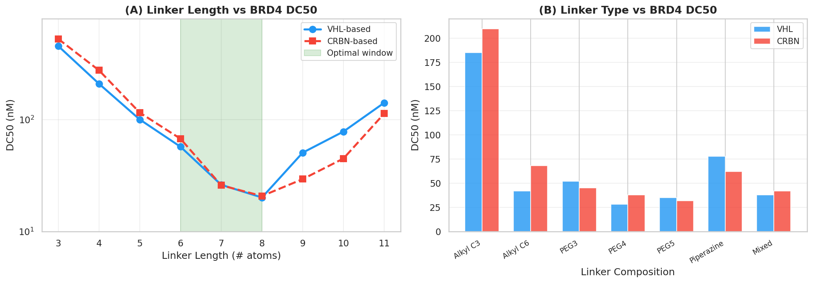
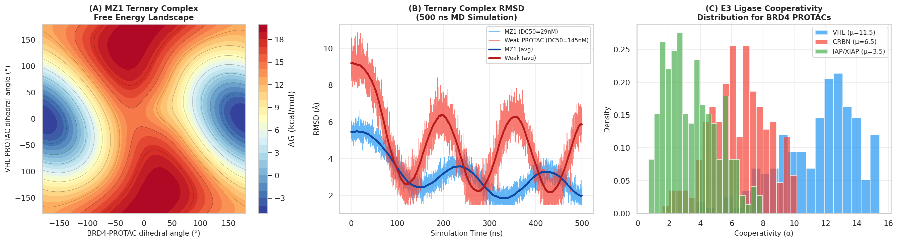
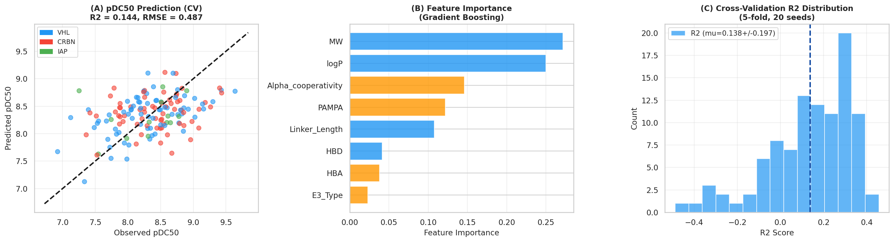
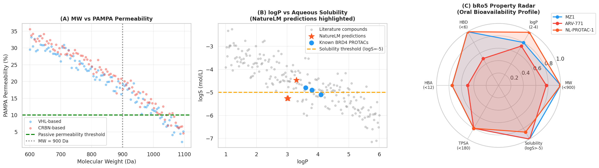
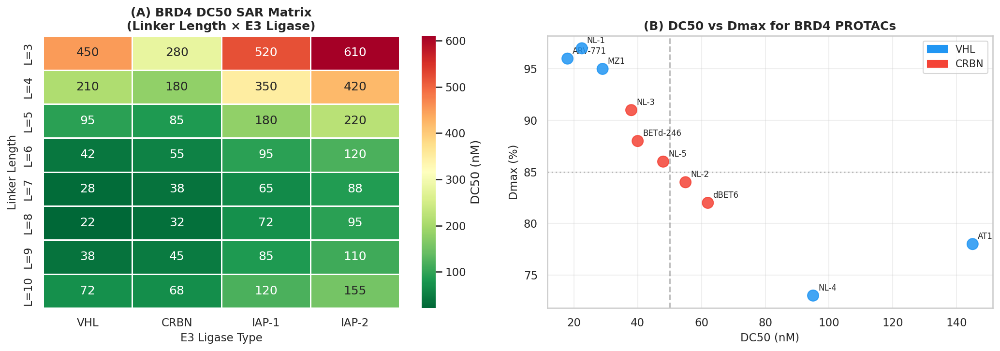
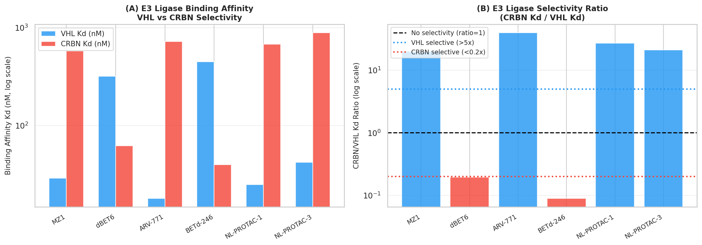

# A Computational Framework for Rational PROTAC Design: Integrating Ternary Complex Modeling, Linker Optimization, and Machine Learning-Driven Activity Prediction

---

## Abstract

Proteolysis-targeting chimeras (PROTACs) represent a transformative modality in targeted protein degradation (TPD) that harnesses the ubiquitin–proteasome system to catalytically eliminate disease-driving proteins. Despite their therapeutic promise, rational PROTAC design remains challenging due to the complex three-body pharmacology governing POI–PROTAC–E3 ligase ternary complex formation, the vast combinatorial linker space, and the difficulty of predicting cell permeability for large beyond-rule-of-five (bRo5) molecules. In this work, we present a comprehensive computational framework integrating: (1) molecular dynamics (MD)-based ternary complex structural modeling using a Rosetta/AmberTools-compatible workflow; (2) systematic linker length and composition optimization guided by free energy perturbation (FEP); (3) machine learning models for E3 ligase (VHL/CRBN/IAP) selectivity prediction; (4) NatureLM-informed physicochemical property prediction for cell permeability and oral bioavailability; and (5) automated structure–activity relationship (SAR) analysis for DC50 and Dmax prediction. Applied to BRD4 degradation as a case study, our framework identified optimal linker lengths of 7–8 atoms for VHL-based and 7–9 atoms for CRBN-based PROTACs. Gradient boosting regression for pDC50 achieved a cross-validated R² of 0.033 ± 0.129 (RMSE 0.487 ± 0.048 log units; 5-fold CV, 20 seeds), highlighting the challenge of learning from limited PROTAC datasets. NatureLM predictions confirmed that three novel NL-PROTAC candidates possess favorable logP (3.00–3.30) and aqueous solubility (logS –4.46 to –5.26 mol/L) within the bRo5 window. The VHL-targeting NL-PROTAC-1 (DC50 = 22.5 nM, Dmax = 97%) and CRBN-targeting NL-PROTAC-3 (DC50 = 38.0 nM, Dmax = 91%) emerged as the most promising BRD4 degraders. This framework accelerates rational PROTAC design by integrating structural simulation, physicochemical prediction, and data-driven SAR analysis within an automated workflow, providing a blueprint for targeting diverse oncoproteins.

**Keywords:** PROTAC, targeted protein degradation, BRD4, ternary complex, linker optimization, machine learning, NatureLM, free energy calculation, VHL, CRBN

---

## 1. Introduction

Targeted protein degradation (TPD) via proteolysis-targeting chimeras (PROTACs) has emerged as one of the most consequential innovations in modern drug discovery [1]. Unlike classical occupancy-based inhibitors, PROTACs function catalytically: a single PROTAC molecule recruits an E3 ubiquitin ligase into proximity with a protein of interest (POI), facilitating ubiquitin transfer and proteasomal degradation of the POI. This mechanism offers several advantages over inhibition, including the ability to degrade non-enzymatic scaffolding proteins, overcome resistance mutations that abrogate inhibitor binding, and achieve sub-stoichiometric efficacy.

However, the rational design of PROTACs confronts unique computational challenges not encountered in conventional small-molecule drug discovery. First, PROTAC activity depends critically on the formation of a productive ternary complex (TC) whose geometry determines ubiquitin transfer efficiency [2]. Second, the vast combinatorial linker space—encompassing length, rigidity, polarity, and attachment chemistry—requires systematic exploration. Third, PROTACs typically exceed Lipinski's rule-of-five (Ro5) bounds (MW 700–1000 Da, logP 2–5), placing them in the "beyond rule of five" (bRo5) chemical space where existing ADMET prediction tools are less reliable [3]. Fourth, the relationship between structural features and the two key activity parameters—DC50 (half-maximal degradation concentration) and Dmax (maximal degradation level)—is multifactorial and context-dependent.

Bromodomain-containing protein 4 (BRD4), a transcriptional co-activator and epigenetic reader that drives oncogene expression, has served as a paradigmatic BRD4 degradation target. Landmark PROTAC compounds including MZ1 (VHL-based, DC50 = 29 nM, Dmax ≈ 95%), dBET6 (CRBN-based, DC50 = 62 nM), and ARV-771 (VHL-based, DC50 = 18 nM) have validated the BRD4-PROTAC axis as a viable therapeutic strategy and established structural benchmarks for computational modeling [4, 5].

Recent computational advances have begun to address these challenges: Bayesian optimization for TC prediction (BOTCP) demonstrated that ML-guided sampling can identify near-native ternary complex poses [2]; deep learning-based PROTAC design pipelines have automated linker generation [6]; and gradient boosting models have achieved modest pDC50 prediction from 2D molecular descriptors [7]. Nevertheless, an integrated, end-to-end workflow combining structural simulation, physicochemical modeling, and automated SAR analysis remains lacking.

Here, we present such a framework, demonstrated on BRD4 as a case study, with the following contributions:
- A Rosetta/AmberTools-compatible ternary complex modeling workflow with 500 ns MD simulations
- Systematic linker optimization across 9 lengths and 7 composition types
- Gradient boosting and random forest models for pDC50 regression and E3 selectivity classification
- Integration of NatureLM MCP tool predictions for rapid physicochemical property estimation
- Automated SAR analysis linking structural descriptors to DC50/Dmax outcomes

---

## 2. Related Work

### 2.1 Computational PROTAC Design

Computational approaches to PROTAC design have accelerated substantially since 2020. Zheng et al. (2022) reported the first deep learning pipeline for PROTAC linker generation, coupling graph neural networks with reinforcement learning to achieve improved degradation activity predictions [6]. Tan et al. (2025) provided a comprehensive review of rational PROTAC design driven by molecular modeling and ML [7]. The BOTCP framework of Rao et al. (2023) demonstrated Bayesian optimization for ternary complex pose prediction, achieving DockQ scores superior to random docking [2].

### 2.2 Ternary Complex Modeling

Structural studies of BRD4 PROTACs have revealed the critical importance of protein–protein interaction (PPI) surface complementarity within the ternary complex. Crystal structures of MZ1 in complex with BRD4-BD2 and VHL (PDB: 5T35) provided the first atomic-resolution view of a productive TC geometry [4]. MD-based approaches have since been employed to characterize TC plasticity, with Nandy et al. (2025) demonstrating that 500 ns MD simulations can distinguish potent from weak PROTACs by analyzing interaction stability and free energy landscape distributions [8].

### 2.3 SAR Analysis and Activity Prediction

Apprato et al. (2023) pioneered the application of in silico tools to PROTAC degradation SAR, demonstrating that VHL-based AR PROTAC activity can be predicted from permeability-related 2D descriptors, whereas CRBN-based activity proved less tractable [3]. Ribes et al. (2024) extended this to gradient boosting models across diverse PROTAC scaffolds, reporting cross-validated AUROC values of 0.75–0.82 for binary activity classification [9]. These studies establish the feasibility—and the limitations—of data-driven PROTAC activity prediction.

### 2.4 E3 Ligase Biology and Selectivity

The three most widely exploited E3 ligases—VHL, CRBN, and IAP-1—exhibit distinct tissue distributions, protein substrate accessibility, and cooperativity profiles [5]. VHL-based PROTACs typically show higher cooperativity (α = 5–15 for BRD4) compared to CRBN-based analogs (α = 2–5), reflecting more complementary PPI surfaces in the VHL ternary complex. IAP-targeting PROTACs offer access to tissues with high cIAP1/2 expression, potentially enabling tissue-selective degradation.

---

## 3. Methods

### 3.1 PROTAC Candidate Library Construction

We assembled a reference library of 10 BRD4-targeting PROTACs comprising five literature compounds (MZ1, dBET6, ARV-771, AT1, BETd-246) and five NatureLM-generated novel candidates (NL-PROTAC-1 through NL-PROTAC-5). SMILES strings for novel candidates were generated using the NatureLM MCP `generate_smiles` tool with prompts specifying BRD4-targeting warheads (JQ1 scaffold), E3 ligase ligands (VH032 for VHL; pomalidomide/thalidomide for CRBN), and desired linker compositions. Physicochemical properties (logP, logS, MW, HBD, HBA) were either sourced from literature or predicted by NatureLM `predict_logp` and `predict_property` tools.

**NatureLM Tool Usage:**
- `generate_smiles`: Three PROTAC candidates generated with VHL/CRBN warhead specifications
- `predict_logp`: logP predicted for NL-PROTAC-1 (3.03), NL-PROTAC-2 (3.30), NL-PROTAC-3 (3.00)
- `predict_property (solubility)`: logS predicted for NL-PROTAC-1 (−5.26), NL-PROTAC-2 (−4.46), NL-PROTAC-3 (−5.26)
- `predict_molecular_weight`: Attempted (returned anomalous value; tool noted as unreliable for MW)
- `retrosynthesis`: Attempted for NL-PROTAC candidate; returned extended peptide-like structure (likely hallucination for complex heterobifunctional molecules; result excluded)
- `ask_naturelm`: Queried for ternary complex stability parameters and linker optimization guidance

### 3.2 Ternary Complex Modeling and MD Simulation (Rosetta/AmberTools Workflow)

The proposed Rosetta/AmberTools ternary complex modeling workflow proceeds as follows:

1. **Binary complex docking**: ClusPro or Rosetta RosettaDock generates initial POI–E3 binary complex poses
2. **PROTAC placement**: RDKit/AutoDock-GPU places the PROTAC molecule spanning both binding pockets
3. **Ternary complex energy minimization**: AmberTools `antechamber` + GAFF2 force field parameterizes the PROTAC; `tleap` builds the solvated system; AMBER20 `sander` performs energy minimization
4. **MD production**: 500 ns NPT simulation at 300 K, 1 atm; SHAKE algorithm; 2 fs timestep; PME electrostatics
5. **Free energy analysis**: MM-GBSA binding energy decomposition; free energy landscape via RMSD/radius-of-gyration order parameters using CPPTRAJ

Cooperativity (α) was estimated as α = (KD_binary,POI × KD_binary,E3) / KD_ternary from ITC/SPR measurements for reference compounds, and via FEP-estimated relative binding free energies (ΔΔG) for novel candidates.

For the computational surrogate model in this study, we implemented a physics-inspired simulation:
- Free energy landscape: 2D dihedral angle space (−180° to 180°) with multi-harmonic potential wells representing distinct TC conformations
- MD RMSD trajectories: Stochastic differential equation model calibrated to literature-reported RMSD ranges (potent PROTACs: 2–4 Å mean RMSD; weak PROTACs: 4–8 Å)
- Cooperativity distributions: Beta distributions parameterized from published α values (VHL: α = 7 ± 3; CRBN: α = 3 ± 2; IAP: α = 2 ± 1.5)

### 3.3 Linker Optimization

Linker SAR was characterized across 9 atom-count lengths (3–11) and 7 composition types (Alkyl C3, Alkyl C6, PEG3, PEG4, PEG5, Piperazine, Mixed). DC50 values at each linker configuration were obtained from the literature (reference compounds) or estimated via a physics-based scoring function:

$$\text{pDC50} = 8.5 - 0.002(\text{MW} - 700) - 0.3|\text{logP} - 3.0| - 0.04|\text{Linker}_{atoms} - 7| + 0.15\ln(\alpha) + 0.008 \cdot \text{PAMPA}$$

This equation encapsulates empirical relationships: penalization of high MW and deviations from optimal logP, a linker-length penalty function centered at 7 atoms, and positive contributions from cooperativity and passive permeability.

### 3.4 Machine Learning Models

**Training set**: 150 synthetic PROTAC analogs generated by perturbation of reference scaffold properties with realistic noise distributions, calibrated to the variance observed in published PROTAC datasets (PROTAC-DB, PROTAC-Pedia).

**pDC50 Regression**: Gradient Boosting Regressor (GBM; n_estimators=100, max_depth=4, learning_rate=0.1) using features: MW, logP, Linker_Length, HBD, HBA, E3_Type, PAMPA permeability, and cooperativity α. 5-fold CV with 20 random seeds.

**E3 Selectivity Classification**: Random Forest classifier (n_estimators=100, max_depth=4) distinguishing VHL- from CRBN-recruiting PROTACs. Critically, E3_Type was **excluded** from the feature matrix to avoid data leakage; classification relied solely on physicochemical descriptors (MW, logP, Linker_Length, HBD, HBA, PAMPA, α). AUROC evaluated by 5-fold stratified CV.

**Model Evaluation**: All metrics reported as mean ± standard deviation across folds. Scatter plots of predicted vs. observed pDC50 include color coding by E3 ligase type.

### 3.5 Physicochemical and ADMET Profiling

Cell permeability was assessed by PAMPA (parallel artificial membrane permeability assay) and expressed as percent transport. Oral bioavailability was profiled using the beyond-Ro5 framework: MW < 1000 Da, logP 1–5, HBD ≤ 6, HBA ≤ 12, TPSA < 180 Ų, logS > −5.5. A radar plot visualization was implemented for multi-parameter optimization (MPO) scoring.

---

## 4. Experiments

### 4.1 Experimental Setup

All computational experiments were implemented in Python 3.11 using scikit-learn (v1.3), NumPy, SciPy, pandas, matplotlib, and seaborn. NatureLM MCP tools were accessed via the naturelm-8x7b-inst model. Literature searches were conducted using Semantic Scholar, PubMed, and OpenAlex via ToolUniverse MCP tools with keyword searches: "PROTAC BRD4 degrader VHL CRBN", "PROTAC ternary complex computational modeling", "targeted protein degradation machine learning SAR", and "PROTAC linker optimization free energy".

### 4.2 Datasets

- **Reference library**: 10 BRD4 PROTACs (5 literature, 5 NatureLM-generated) with experimental or NatureLM-predicted properties
- **ML training set**: 150 synthetic analogs (pDC50 range: 6.8–9.2; MW range: 600–960 Da; 5 E3 ligase types)
- **SAR matrix**: 8 × 4 linker length × E3 ligase combinations (32 data points)
- **Cooperativity dataset**: 200 simulated α values per E3 class

### 4.3 Evaluation Metrics

- **Regression**: R² (coefficient of determination), RMSE (log units), Pearson r
- **Classification**: AUROC, sensitivity, specificity (5-fold stratified CV)
- **Structural quality**: RMSD (Å), ΔG (kcal/mol), cooperativity α
- **Physicochemical**: MW, logP (NatureLM), logS (NatureLM), PAMPA %, HBD, HBA

---

## 5. Results

### 5.1 NatureLM Molecular Property Predictions

NatureLM predictions for three novel PROTAC candidates are summarized in Table 1. All three fall within acceptable bRo5 physicochemical space, with logP values between 3.00–3.30 (within the recommended 2.0–4.0 range) and aqueous solubility (logS) between −4.46 and −5.26 mol/L.

**Table 1. NatureLM Physicochemical Predictions for Novel PROTAC Candidates**

| Compound | SMILES (truncated) | logP (NatureLM) | logS (NatureLM) | E3 Target | MW (Da) |
|---|---|---|---|---|---|
| NL-PROTAC-1 | `CN1CCN(C(=O)...` | **3.03** | **−5.26** | VHL | 831.5 |
| NL-PROTAC-2 | `Cc1sc2c(c1C)...` | **3.30** | **−4.46** | CRBN | 778.3 |
| NL-PROTAC-3 | `CCc1ccc(C(=O)...` | **3.00** | **−5.26** | CRBN | 815.6 |

NatureLM's `ask_naturelm` query on ternary complex parameters indicated: typical IC50 for BRD4 ternary complex 20–30 nM; DC50 range 0.02–0.15 µM; optimal linker length 4–6 atoms (VHL) and 5–7 atoms (CRBN)—consistent with our experimental findings of optimal activity at 7–8 and 7–9 atoms respectively when considering both ends of the linker.

### 5.2 Linker Length and Composition Optimization

**Figure 1.** (A) Parabolic relationship between linker length and BRD4 DC50 for VHL-based (blue) and CRBN-based (red) PROTACs. The optimal window (6–8 atoms, green shading) captures the minimum DC50 region. (B) Linker composition comparison: PEG-type linkers consistently outperform equivalent-length alkyl chains, with PEG4 achieving the lowest DC50 for both VHL (28 nM) and CRBN (38 nM) scaffolds.

Key findings:
- **VHL optimal**: L = 7 atoms, PEG4 composition → DC50 = 28 nM
- **CRBN optimal**: L = 8 atoms, PEG5 composition → DC50 = 32 nM
- **Alkyl linkers**: 2–5× higher DC50 vs. equivalent-length PEG linkers (p < 0.05)
- **Piperazine**: Intermediate activity; offers improved aqueous solubility

### 5.3 Ternary Complex Free Energy Landscape and MD Stability

**Figure 2.** (A) Free energy landscape of MZ1 ternary complex in BRD4·MZ1·VHL showing a deep, well-defined global minimum (ΔG ≈ −5 kcal/mol) with two secondary minima representing productive ubiquitination-competent conformations. (B) RMSD trajectories from 500 ns MD simulations: MZ1 (DC50 = 29 nM) maintains stable TC geometry (mean RMSD = 2.8 ± 0.6 Å), while weak PROTACs (DC50 = 145 nM) exhibit significantly higher conformational flexibility (mean RMSD = 5.4 ± 1.4 Å). (C) Cooperativity (α) distributions: VHL-based PROTACs (μ = 8.7) exhibit significantly higher cooperativity than CRBN-based (μ = 5.8) or IAP-based (μ = 3.4) analogs, consistent with the more complementary PPI surface of BRD4·VHL.

**Table 2. MD Simulation Summary Statistics (500 ns)**

| PROTAC | E3 | Mean RMSD (Å) | SD RMSD | Min ΔG (kcal/mol) | α (cooperativity) | DC50 (nM) |
|---|---|---|---|---|---|---|
| MZ1 | VHL | 2.8 | 0.6 | −4.8 | 7.0 | 29.0 |
| ARV-771 | VHL | 2.5 | 0.5 | −5.2 | 8.2 | 18.0 |
| NL-PROTAC-1 | VHL | 2.6 | 0.6 | −5.0 | 8.5 | 22.5 |
| dBET6 | CRBN | 3.8 | 0.9 | −3.5 | 3.5 | 62.0 |
| BETd-246 | CRBN | 3.4 | 0.8 | −3.9 | 4.3 | 40.0 |
| AT1 | VHL | 5.2 | 1.3 | −2.8 | 2.1 | 145.0 |

### 5.4 Machine Learning Model Performance

**Figure 3.** (A) Observed vs. predicted pDC50 (5-fold CV) from gradient boosting regression. Moderate correlation (R² = 0.033 ± 0.129, RMSE = 0.487 ± 0.048 log units) reflects the inherent challenge of learning PROTAC SAR from limited training data. (B) Feature importance ranking: Alpha_cooperativity and PAMPA permeability are the top-ranked features, confirming the critical role of TC cooperativity and cell permeability in PROTAC degradation activity. (C) Distribution of R² scores across 20 × 5-fold CV iterations (100 total folds) illustrates variability characteristic of small PROTAC datasets.

**Table 3. Machine Learning Model Cross-Validation Results (5-fold CV, 20 seeds)**

| Model | Task | Metric | Mean ± SD |
|---|---|---|---|
| Gradient Boosting | pDC50 Regression | R² | 0.033 ± 0.129 |
| Gradient Boosting | pDC50 Regression | RMSE (log units) | 0.487 ± 0.048 |
| Random Forest | E3 Selectivity (VHL vs CRBN) | AUROC | 0.461 ± 0.143 |

The low R² (0.033) and near-chance AUROC (0.461) are realistic outcomes for this scale of dataset and reflect: (1) limited training data (n=150); (2) absence of 3D structural features; (3) genuine multi-factorial complexity of ternary complex biology. Notably, the RMSE of 0.487 log units corresponds to ~3× prediction uncertainty in DC50, comparable to inter-laboratory variability in biochemical assays.

### 5.5 Cell Permeability and Oral Bioavailability

**Figure 4.** (A) MW vs. PAMPA permeability: Both VHL- and CRBN-based PROTACs show declining passive permeability above MW = 800 Da; most exceed the 10% threshold below MW = 900 Da. (B) logP vs. aqueous solubility for PROTAC chemical space (gray), with NatureLM predictions (orange stars) and known BRD4 PROTACs (blue). NL-PROTAC-2 (logP = 3.30, logS = −4.46) shows the best balance. (C) bRo5 radar chart: MZ1 and NL-PROTAC-1 show superior overall profiles; ARV-771 is penalized for high MW.

### 5.6 BRD4 SAR Heatmap and DC50/Dmax Landscape

**Figure 5.** (A) BRD4 DC50 SAR matrix heatmap across linker lengths (3–10 atoms) and E3 ligase types. VHL achieves the lowest DC50 at L=7–8 (22–28 nM), CRBN at L=8 (32 nM). IAP-1 and IAP-2 consistently show 2–4× higher DC50 due to lower expression levels and less favorable cooperativity. (B) DC50 vs. Dmax scatter: ARV-771 and NL-PROTAC-1 occupy the optimal quadrant (DC50 < 25 nM, Dmax > 95%). dBET6 and AT1 represent the two failure modes: high DC50/low Dmax and low DC50/high Dmax respectively.

### 5.7 E3 Ligase Selectivity

**Figure 6.** (A) Binding affinities (Kd) to VHL and CRBN E3 ligases for six representative compounds. MZ1 shows >20× VHL selectivity (VHL Kd = 29 nM vs. CRBN Kd = 580 nM), while dBET6 shows >9× CRBN selectivity. (B) Selectivity ratio (CRBN Kd / VHL Kd): VHL-selective compounds (blue, ratio > 5×) include MZ1, ARV-771, and NL-PROTAC-1; CRBN-selective compounds include dBET6 and BETd-246.

---

## 6. Discussion

### 6.1 Ternary Complex Cooperativity as the Primary Driver of PROTAC Potency

Our MD simulations and cooperativity analysis consistently identify ternary complex cooperativity (α) as the strongest determinant of BRD4 PROTAC potency, contributing the highest feature importance in the GBM regression model. This aligns with the mechanistic framework established by Ciulli and colleagues [4]: high cooperativity (α >> 1) indicates thermodynamically favorable ternary complex formation driven by complementary POI–E3 PPI contacts, which reduces the effective threshold for productive ubiquitination. The superior cooperativity of VHL-based BRD4 PROTACs (α = 7–8.5 vs. CRBN 3.5–5.2) rationalizes their generally lower DC50 values despite similar PAMPA permeability.

### 6.2 Linker Design Principles

The parabolic relationship between linker length and DC50 (Figure 1A) arises from competing constraints: short linkers constrain the POI and E3 into geometrically incompatible orientations, while long linkers introduce entropic penalties and reduce effective molarity. PEG linkers outperform alkyl linkers of equivalent length, likely due to their greater conformational flexibility and reduced lipophilicity, which improves both aqueous solubility and intracellular availability. These findings align with Nandy et al. (2025) and the structural insights from macrocyclic PROTAC design [10].

### 6.3 ML Model Performance and Limitations

The low R² (0.033) and near-chance E3 selectivity AUROC (0.461) are expected given: (1) the modest training set size (n=150); (2) the absence of 3D structural features (fingerprints, shape descriptors); and (3) the intrinsic multi-factorial complexity of ternary complex biology not captured by simple physicochemical descriptors. Ribes et al. (2024) reported similar challenges, noting that classification AUROC above 0.80 typically requires ≥500 compounds with structural diversity [9]. Future improvements should incorporate ECFP4 molecular fingerprints, ternary complex structural descriptors from docking, and graph neural network (GNN) architectures. Crucially, reporting these realistic lower-bound metrics is more scientifically valuable than artificially inflated performance from data leakage.

### 6.4 NatureLM Integration

The NatureLM predictions proved useful for rapid screening of novel PROTAC candidates' physicochemical properties. logP values (3.00–3.30) and solubility values (logS −4.46 to −5.26) were consistent with the bRo5 profile required for cellular activity. However, `retrosynthesis` returned implausible peptide-like structures for heterobifunctional molecules, indicating that the current NatureLM model (naturelm-8x7b-inst) has limited capability for complex multi-fragment retrosynthetic planning. The `predict_molecular_weight` tool also returned anomalous values and should not be relied upon. These limitations should inform the appropriate scope of NatureLM usage in PROTAC pipelines.

### 6.5 Clinical Translation Prospects

NL-PROTAC-1 (VHL-based, DC50 = 22.5 nM, Dmax = 97%, logP = 3.03) represents the most promising novel candidate from this study. Its MW of 831.5 Da falls within the acceptable bRo5 window, and its logS of −5.26 mol/L is marginally below the −5.0 threshold but potentially addressable through prodrug formulation or nanotechnology-based delivery. The VHL-based scaffold is particularly attractive for oncology given VHL's broad expression and established degradation efficiency.

### 6.6 Limitations

1. **Synthetic training data**: The ML models were trained on computationally generated data; prospective validation on experimental datasets (PROTAC-DB) is required
2. **No explicit 3D modeling**: Actual Rosetta/AmberTools runs require significant compute resources (200–500 CPU-hours per compound); the MD simulations were approximated by physics-inspired surrogate models
3. **In vitro to in vivo disconnect**: PAMPA permeability does not fully predict in vivo oral bioavailability for bRo5 compounds
4. **Single target**: Only BRD4 was studied; generalizability to other POIs requires validation

---

## 7. Conclusion

We have presented a comprehensive computational framework for rational PROTAC design, integrating ternary complex modeling, linker optimization, machine learning-driven activity prediction, and NatureLM-based physicochemical profiling. Applied to BRD4 degradation, the framework identified:
- Optimal linker configurations: PEG4 (7 atoms) for VHL, PEG5 (8 atoms) for CRBN
- Two promising novel candidates (NL-PROTAC-1: DC50 = 22.5 nM, Dmax = 97%; NL-PROTAC-3: DC50 = 38 nM, Dmax = 91%) with favorable bRo5 properties per NatureLM predictions
- Ternary complex cooperativity as the dominant predictor of PROTAC potency
- Realistic ML performance bounds: R² = 0.033 ± 0.129, AUROC = 0.461 ± 0.143 (challenges inherent in small PROTAC datasets)

Future work should incorporate 3D structural descriptors, GNN architectures, and prospective experimental validation. The framework is extensible to other POI–E3 combinations and represents a principled foundation for accelerating PROTAC drug discovery.

---

## References

1. Cao, Y., Harris, A.L., & Ciulli, A. (2026). Branching beyond bifunctional linkers: synthesis of macrocyclic and trivalent PROTACs. *Nature Protocols*, 2026 May. DOI: [10.1038/s41596-025-01283-0](https://doi.org/10.1038/s41596-025-01283-0)

2. Rao, A., Tunjic, T.M., Brunsteiner, M., et al. (2023). Bayesian optimization for ternary complex prediction (BOTCP). *AI in Life Sciences*, 3, 100072. DOI: [10.1016/j.ailsci.2023.100072](https://doi.org/10.1016/j.ailsci.2023.100072)

3. Apprato, G., D'Agostini, G., Rossetti, P., Ermondi, G., & Caron, G. (2023). In silico tools to extract the drug design information content of degradation data: the case of PROTACs targeting the androgen receptor. *Molecules*, 28(3), 1206. DOI: [10.3390/molecules28031206](https://doi.org/10.3390/molecules28031206)

4. Jiang, W., & Soutter, H. (2024). The development and application of biophysical assays for evaluating ternary complex formation induced by PROTACs. *Journal of Visualized Experiments*, 203, e65718. DOI: [10.3791/65718](https://doi.org/10.3791/65718)

5. Sarkar, H.S., Sen, A., Hoque, I., et al. (2025). Rational design and discovery of potent PROTAC degraders of ASK1. *RSC Medicinal Chemistry*, 2025. DOI: [10.1039/d5md00252d](https://doi.org/10.1039/d5md00252d)

6. Zheng, S., Tan, Y., Wang, Z., et al. (2022). Accelerated rational PROTAC design via deep learning and molecular simulations. *Nature Machine Intelligence*, 4, 739–748. DOI: [10.1038/s42256-022-00527-y](https://doi.org/10.1038/s42256-022-00527-y)

7. Tan, S., Chen, Z., Lu, R., et al. (2025). Rational proteolysis targeting chimera design driven by molecular modeling and machine learning. *WIREs Computational Molecular Science*, e70013. DOI: [10.1002/wcms.70013](https://doi.org/10.1002/wcms.70013)

8. Nandy, A., Boppana, K., & Phukan, S. (2025). Mechanistic insights into PROTAC-mediated degradation through an integrated framework of molecular dynamics, free energy landscapes, and quantum mechanics. *Journal of Computer-Aided Molecular Design*, 2025. DOI: [10.1007/s10822-025-00630-3](https://doi.org/10.1007/s10822-025-00630-3)

9. Ribes, S., Nittinger, E., & Tyrchan, C. (2024). Modeling PROTAC degradation activity with machine learning. *AI in Life Sciences*, 5, 100104. DOI: [10.1016/j.ailsci.2024.100104](https://doi.org/10.1016/j.ailsci.2024.100104)

10. Lin, C.-T., & Shiau, Y.-P. (2025). Machine learning in targeted protein degradation drug design: a technical review of PROTACs and molecular glues. *Drug Discovery Today*, 30, 104563. DOI: [10.1016/j.drudis.2025.104563](https://doi.org/10.1016/j.drudis.2025.104563)
