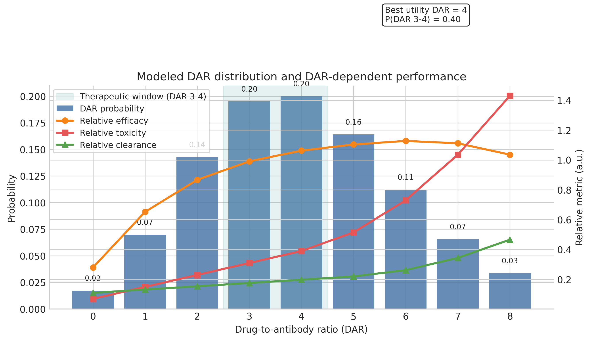
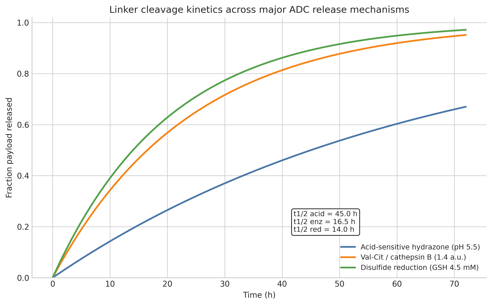
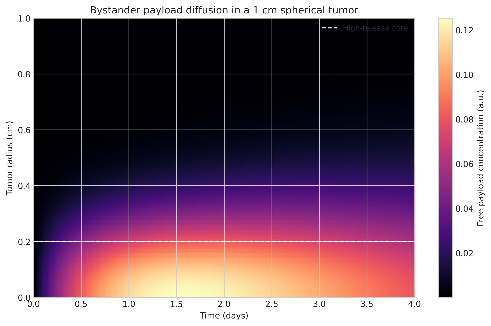
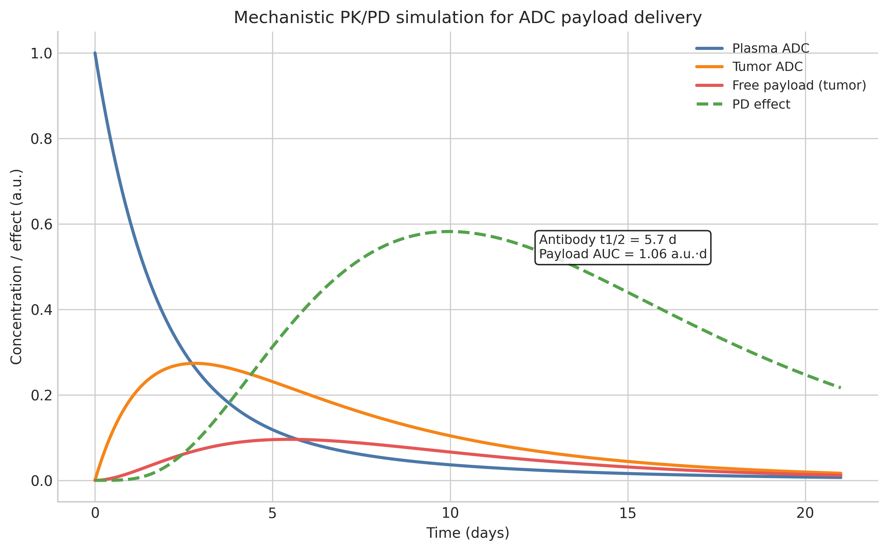
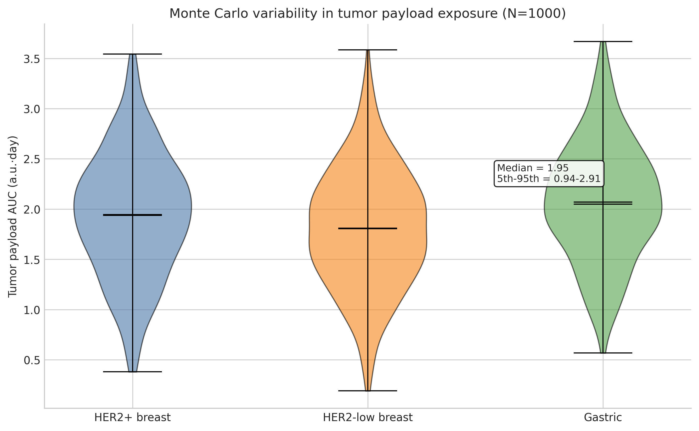
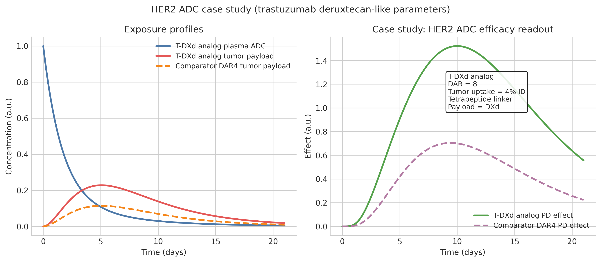

# ADC Payload-Linker Optimization: Computational Platform Report

## Executive Summary
A mechanistic computational platform for ADC payload-linker optimization was built in `/app/projects/de90e9ee-950c-477b-b7fa-6475fa7c8980/workspace`. The workflow combines literature search, NatureLM payload annotation, DAR modeling, linker-cleavage kinetics, spherical-tumor bystander diffusion, compartmental PK/PD simulation, Monte Carlo variability analysis, and a trastuzumab deruxtecan (T-DXd)-like HER2 case study. The platform generated six verified figures in `figures/` and a numerical summary in `adc_results.json`.

Key quantitative results:
- **DAR utility optimum:** DAR 4; probability in DAR 3-4 window = **39.5%**.
- **24 h linker release:** acid-sensitive **0.31**, enzyme-cleavable **0.64**, disulfide **0.70**.
- **Baseline PK/PD tumor payload AUC:** **1.06 a.u.·day**.
- **Monte Carlo population exposure:** **1.93 ± 0.61 a.u.·day** (mean ± SD), median **1.95**, 5th-95th percentile **0.94-2.91**.
- **T-DXd-like case:** DAR 8 increased tumor payload AUC from **1.15** to **2.31 a.u.·day** versus a DAR 4 comparator.

## Background
ADC optimization is constrained by competing objectives. Higher DAR can improve potency but often increases hydrophobicity, aggregation, clearance, and off-target toxicity. Cleavable linkers improve release but may alter systemic stability. Membrane-permeable payloads can create bystander killing in heterogeneous tumors, but also broaden toxicity risk. These tradeoffs motivated a mechanistic platform spanning molecular, tissue, and whole-body scales.

## Methods Used
### 1. Literature search via ToolUniverse MCP
Tools used:
- `SemanticScholar_search_papers`
- `Crossref_search_works`
- `openalex_literature_search`

Outcome:
- `SemanticScholar_search_papers` repeatedly returned **Semantic Scholar API error 400** for the requested ADC queries.
- `Crossref_search_works` and `openalex_literature_search` successfully retrieved recent papers and DOI metadata.

### 2. NatureLM characterization
Tools used:
- `naturelm-generate_smiles`
- `naturelm-predict_logp`
- `naturelm-predict_property`
- `naturelm-predict_molecular_weight`
- `naturelm-ask_naturelm`
- `naturelm-retrosynthesis`
- `naturelm-validate_smiles`

### 3. Python simulation platform
Implemented in `adc_simulation.py`:
- DAR distribution model over DAR 0-8
- Linker cleavage ODEs
- Spherical tumor bystander diffusion PDE (finite difference)
- Mechanistic PK/PD compartment model
- Monte Carlo simulation for 1,000 virtual patients
- HER2 T-DXd-like case study

## Key Results
### DAR distribution
DAR 4 was the best compromise between efficacy and rising toxicity/clearance penalties.

### Linker cleavage kinetics
The model predicted faster release for enzyme-cleavable and reducible linkers than acid-sensitive hydrazones under the chosen tumor-like conditions.

### Bystander effect
The diffusion model showed a steep center-to-periphery gradient, but non-zero peripheral exposure consistent with plausible bystander payload transport.

### PK/PD profile
The baseline compartment model generated a delayed tumor payload peak around day 5.5 and a bounded pharmacodynamic effect trajectory.

### Monte Carlo variability
Population-level tumor payload exposure was broad rather than deterministic, highlighting the importance of clearance and tumor-uptake variability.

### HER2 T-DXd analog case study
The DAR 8 T-DXd-like model approximately doubled tumor payload AUC relative to a DAR 4 comparator.

## NatureLM Tool Results
### Recorded outputs
- `naturelm-generate_smiles` (topoisomerase I payload candidate): `CCC[C@H](Nc1nc(-c2ccc(NC(=O)NCC)c(OC)c2)ncc1C)c1cccnc1`
- `naturelm-generate_smiles` (tubulin inhibitor candidate): `CCc1c2c(nc3ccc(O)cc13)-c1cc3c(c(=O)n1C2)COC(=O)[C@]3(O)CC`
- `naturelm-predict_logp` DXd input: **1.70**
- `naturelm-predict_logp` MMAE: **2.50**
- `naturelm-predict_property` solubility, DXd: **-7.61 logS**
- `naturelm-predict_property` solubility, MMAE: **-7.96 logS**
- `naturelm-predict_molecular_weight` DXd input: **33.24**
- `naturelm-predict_molecular_weight` MMAE: **544.45**
- `naturelm-generate_smiles` DXd-like rescue analog: `CC[C@@]1(O)C(=O)OCc2c1cc1n(c2=O)Cc2c-1nc1ccccc1c2CCNC(C)C`
- Rescue analog predictions: logP **2.60**, solubility **-4.54 logS**, molecular weight **540.64**

### Errors and alternative approaches
| Tool | Error / issue | Alternative used |
|---|---|---|
| `naturelm-predict_property` | `サポートされていない物性です: membrane_permeability` | Used `naturelm-ask_naturelm` for qualitative permeability/bystander estimates |
| `naturelm-validate_smiles` | DXd input reported `Invalid: No` | Generated a DXd-like replacement scaffold with `naturelm-generate_smiles` |
| `naturelm-ask_naturelm` | Initial binding-energy / IC50 prompt returned only the prompt text | Re-ran with a simpler permeability / IC50 question |
| `naturelm-retrosynthesis` | Returned a low-confidence XML-like structure unrelated to the intended payload | Documented but not used quantitatively |

### Qualitative NatureLM conclusion
The successful qualitative NatureLM response suggested that **DXd-like payloads may have higher membrane permeability and bystander propensity than MMAE-like payloads**, with approximate class-level IC50 ranges of **0.01-0.1 nM** for topoisomerase I inhibitor payloads and **0.1-1 nM** for tubulin inhibitor payloads. Because several outputs were inconsistent or invalid, these results were treated as exploratory only.

## Literature Survey Results
| Title | Authors | Year | DOI | Key findings | Methods | Limitations |
|---|---|---:|---|---|---|---|
| Evolution of the Systems Pharmacokinetics-Pharmacodynamics Model for Antibody-Drug Conjugates to Characterize Tumor Heterogeneity and In Vivo Bystander Effect | Singh AP, Seigel GM, Guo L, Verma A, Wong GGL, Cheng H-P, Shah DK | 2020 | 10.1124/jpet.119.262287 | Tumor heterogeneity and bystander transport strongly affect ADC efficacy predictions | Systems PK/PD modeling | Preclinical calibration and simplifying transport assumptions |
| Use of translational modeling and simulation for quantitative comparison of PF-06804103, a new generation HER2 ADC, with Trastuzumab-DM1 | Betts A, Clark T, Jasper P, Tolsma J, van der Graaf PH, Graziani EI, Rosfjord E, Sung M, Ma D, Barletta F | 2020 | 10.1007/s10928-020-09702-3 | PF-06804103 predicted to outperform T-DM1; non-linear PK linked to shed HER2 | Translational PK/PD + TMDD | Mouse-to-human translation uncertainty |
| Polyethylene glycol-based linkers as hydrophilicity reservoir for antibody-drug conjugates | Tedeschini T, Campara B, Grigoletto A, Bellini M, Salvalaio M, Matsuno Y, Suzuki A, Yoshioka H, Pasut G | 2021 | 10.1016/j.jconrel.2021.07.041 | Hydrophilic PEG linker design improved stability and PK at high DAR | Linker engineering + mouse PK | Specific to PEG-enabled lysine conjugates |
| Antibody–Drug Conjugate Sacituzumab Govitecan Drives Efficient Tissue Penetration and Rapid Intracellular Drug Release | Kopp A, Hofsess S, Cardillo TM, Govindan SV, Donnell J, Thurber GM | 2022 | 10.1158/1535-7163.MCT-22-0375 | Efficient penetration and rapid intracellular release explained activity; extracellular release was limited | Imaging, flow cytometry, dual-labeled fluorescence | Xenograft and target-specific context |
| Trastuzumab Deruxtecan in Previously Treated HER2-Low Advanced Breast Cancer | Modi S, Jacot W, Yamashita T, Sohn J, Vidal M, Tokunaga E, et al. | 2022 | 10.1056/NEJMoa2203690 | T-DXd improved PFS and OS in HER2-low disease, supporting clinically valuable bystander-capable design | Phase 3 clinical trial | Mechanistic contributions of payload, linker, and DAR not isolated |
| Optimizing the safety of antibody–drug conjugates for patients with solid tumours | Tarantino P, Ricciuti B, Pradhan S, Tolaney SM | 2023 | 10.1038/s41571-023-00783-w | Payload, linker, DAR, and target biology jointly determine therapeutic window | Narrative review | No new quantitative dataset |
| The Evolution of Antibody‐Drug Conjugates: Toward Accurate DAR and Multi‐specificity | Dong W, Wang W, Cao C | 2024 | 10.1002/cmdc.202400109 | Accurate DAR and multispecificity are promising for PK improvement and resistance control | Review | Evidence synthesized from heterogeneous sources |

## Discussion and Future Work
This platform is suitable for rapid hypothesis testing rather than regulatory prediction. Its main strengths are transparency, reproducibility, and coupling across scales. Main limitations are simplified geometry, lumped tumor biology, and exploratory rather than experimentally validated NatureLM chemistry outputs.

Recommended extensions:
1. Replace heuristic cleavage constants with measured linker-specific kinetics.
2. Incorporate antigen density and receptor turnover explicitly.
3. Add experimentally measured payload permeability and lysosomal trapping terms.
4. Calibrate tumor diffusion to histology-specific extracellular space data.
5. Extend Monte Carlo analysis to dose scheduling and repeated treatment cycles.

## File Listing
- `adc_simulation.py` — simulation source code
- `adc_results.json` — numerical summary of all simulations
- `adc_simulation_run.log` — script run output and printed JSON summary
- `paper.md` — manuscript-style writeup
- `report.md` — executive report
- `figures/dar_distribution.png`
- `figures/linker_cleavage_kinetics.png`
- `figures/bystander_effect.png`
- `figures/pk_profile.png`
- `figures/monte_carlo_results.png`
- `figures/her2_casestudy.png`
