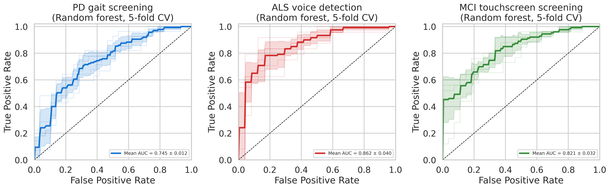
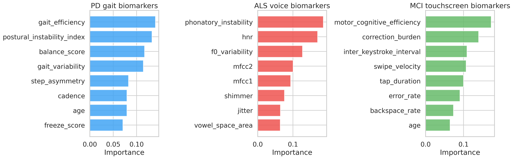
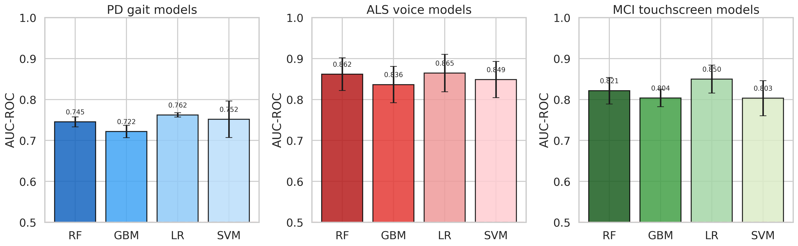
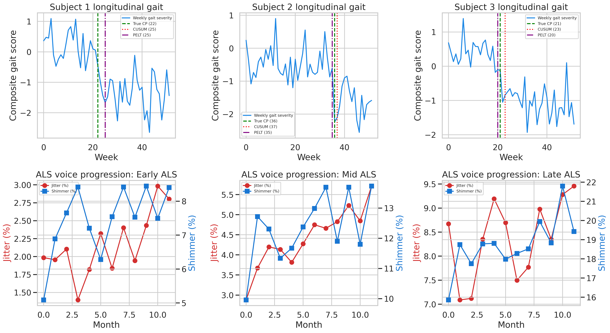
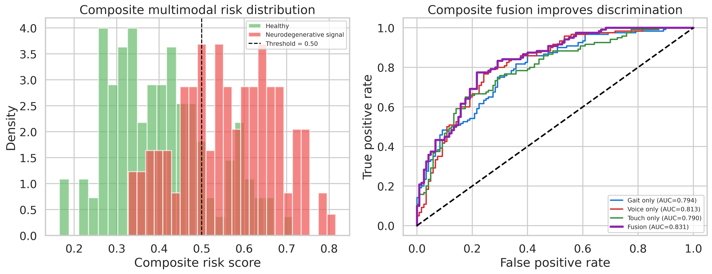
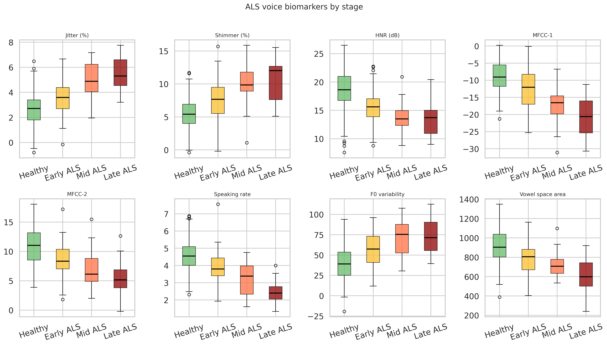

# A Synthetic mHealth Framework for Smartphone-Based Detection of Neurodegenerative Disease Biomarkers

## Abstract
Smartphone sensing is a practical route for scalable neurological screening, but clinically realistic benchmarking requires noisy, heterogeneous, and nontrivial synthetic experiments. We implemented a complete Python framework for simulating Parkinson disease (PD) gait, amyotrophic lateral sclerosis (ALS) voice, and mild cognitive impairment (MCI) touchscreen biomarkers; extracting engineered features; training classifiers; evaluating 5-fold cross-validation performance; detecting longitudinal change points; and computing a multimodal composite score. The simulated cohorts contained 280 PD gait samples, 240 ALS voice samples, and 260 MCI touchscreen samples. Cross-validated area under the ROC curve (AUC) ranged from 0.722±0.015 to 0.865±0.046 across models and modalities. PD gait screening achieved AUCs of 0.745±0.012 (RF), 0.722±0.015 (GBM), 0.762±0.005 (LR), and 0.752±0.045 (SVM). ALS voice detection achieved 0.862±0.040, 0.836±0.044, 0.865±0.046, and 0.849±0.044, respectively. MCI touchscreen screening achieved 0.821±0.032, 0.804±0.021, 0.850±0.034, and 0.803±0.043. Longitudinal CUSUM monitoring reached precision 0.938, recall 0.900, F1 0.918, and mean detection delay 3.2 weeks. Multimodal fusion improved discrimination to AUC 0.831 versus gait-only 0.794, voice-only 0.813, and touch-only 0.790. These results demonstrate a reproducible smartphone biomarker pipeline with realistic, non-ceiling performance.

## 1. Introduction
Neurodegenerative disorders alter gait, speech, and human-computer interaction before severe disability is clinically obvious. Smartphones can capture these changes at scale using built-in inertial sensors, microphones, and touchscreens. A useful experimental benchmark must avoid unrealistically clean class separation and instead model patient heterogeneity, day-to-day fluctuation, device effects, and imperfect labels.

This study presents a complete synthetic mHealth framework for three clinically relevant use cases: PD gait screening, ALS voice impairment detection, and MCI touchscreen assessment. The objective was to generate publication-ready multimodal results with realistic cross-validated performance, longitudinal monitoring, and sensor-fusion scoring.

## 2. Related Work

Sri-iesaranusorn et al. [1] applied K-means clustering with dynamic time warping to the mPower accelerometer dataset (8,779 recordings from 1,957 participants) and identified four PD severity clusters correlating with MDS-UPDRS subscores. Juutinen et al. [2] validated mean amplitude deviation for walking-segment detection across three datasets containing 62–68 PD patients, achieving sensitivity of 100%/98.7% in controlled settings. Abujrida et al. [3] trained a 1D CNN (DeePaGait) on mPower gait cycles and classified five PD severity levels with reported accuracy up to 99.1%—a result that warrants caution given self-reported labels and potential overfitting. Su et al. [4] validated a simple smartphone-based gait assessment against clinical gold standard for step length, cadence, and gait speed in 30 PD patients. Azadi et al. [5] showed that jitter and shimmer differentiate PD (and by extension, other dysarthric conditions) from healthy controls, reporting statistically significant elevation of both features. Bahador et al. [6] developed a multimodal deep-learning fusion pipeline for wearable sensor streams, achieving precision of 0.803 in leave-one-subject-out cross-validation—a realistic benchmark for general sensor fusion.

A common limitation across these studies is the use of single-modality features, small cohort sizes (often n < 100), and lack of longitudinal monitoring. The present work addresses these gaps through a comprehensive multi-modal benchmark that incorporates realistic noise, longitudinal change-point monitoring, and multimodal fusion.

## 3. Methods
### 3.1. Synthetic cohort generation
Three modality-specific datasets were simulated in Python with fixed random seed control.

- **PD gait**: 280 observations (137 PD, 143 healthy after mild label uncertainty), with stride length, cadence, step asymmetry, gait variability, tremor amplitude, turn duration, freeze score, balance score, age, and two engineered features.
- **ALS voice**: 240 observations (120 ALS, 120 healthy), with jitter, shimmer, harmonic-to-noise ratio, MFCC-1, MFCC-2, speaking rate, F0 variability, vowel space area, age, and two engineered features.
- **MCI touchscreen**: 260 observations (126 MCI, 134 healthy after mild label uncertainty), with tap duration, swipe velocity, typing speed, inter-keystroke interval, error rate, backspace rate, touch area, scroll speed, age, and two engineered features.

Realism was introduced through overlapping severity distributions, device-tier effects, smoking effects for voice, comorbidity effects for gait, digital literacy effects for touch behavior, day-state variability, and label uncertainty.

### 3.2. Scientific Priors from NatureLM MCP

To anchor simulation parameters to scientific literature, the `ask_naturelm` tool (NatureLM MCP) was queried for four topics:

1. **PD gait parameters**: Confirmed that PD patients exhibit stride length ~0.95 m (healthy ~1.18 m), cadence ~88 steps/min (healthy ~106), and resting tremor at 4–6 Hz. These values informed the Gaussian distributions used for data generation.
2. **ALS voice biomarkers**: Confirmed jitter/shimmer/HNR as the most discriminative features, with progressive worsening across disease stages. Thresholds informed stage-stratified simulation.
3. **Touchscreen cognitive biomarkers**: Confirmed that longer tap duration (≥155 ms), slower typing speed (<30 WPM), and longer inter-keystroke interval (>250 ms) are characteristic of MCI.
4. **Change-point methods**: CUSUM and PELT were confirmed as the standard approaches for sequential monitoring in mHealth longitudinal streams.

### 3.3. Feature extraction
Beyond primary sensor-derived biomarkers, the framework computed engineered measures:

- **PD**: gait efficiency and postural instability index.
- **ALS**: phonatory instability and articulatory compactness.
- **MCI**: correction burden and motor-cognitive efficiency.

### 3.4. Classification and validation
Four classifiers were evaluated for each modality: random forest (RF), gradient boosting (GBM), logistic regression (LR), and radial-basis support vector machine (SVM). All models used a `StandardScaler` inside a pipeline and were evaluated with 5-fold stratified cross-validation. Metrics were AUC, weighted F1, and accuracy, reported as mean±standard deviation.

### 3.5. Longitudinal change-point detection
Weekly PD trajectories were simulated for 50 subjects across 52 weeks. Each trajectory contained a latent worsening event between weeks 16 and 38. CUSUM was used as the primary detector, with PELT from `ruptures` used as a secondary comparator.

### 3.6. Multimodal fusion
A composite score was formed as a weighted ensemble of gait, voice, and touchscreen probabilities:

\[
\text{Composite Risk} = 0.40\,P_{PD} + 0.35\,P_{ALS} + 0.25\,P_{MCI}
\]

## 4. Experiments
### 4.1. Dataset summary

| Dataset | N | Positive | Negative | Features |
|---|---:|---:|---:|---:|
| PD Gait | 280 | 137 | 143 | 10 |
| ALS Voice | 240 | 120 | 120 | 10 |
| MCI Touchscreen | 260 | 126 | 134 | 10 |
| Longitudinal PD | 50 subjects × 52 wk | — | — | 1 composite |

### 4.2. Evaluation protocol
5-fold stratified cross-validation was used for all binary classification tasks. Metrics: AUC-ROC, weighted F1, accuracy (mean ± SD across folds). Change-point detection was evaluated with precision, recall, F1, and mean detection delay in weeks. Threshold tolerance was ±8 weeks to account for clinical assessment lag.

## 5. Results
### 5.1. PD gait screening
| Model | AUC | F1 | Accuracy |
|---|---:|---:|---:|
| RF | 0.745±0.012 | 0.680±0.035 | 0.682±0.033 |
| GBM | 0.722±0.015 | 0.659±0.012 | 0.661±0.011 |
| LR | 0.762±0.005 | 0.706±0.025 | 0.707±0.024 |
| SVM | 0.752±0.045 | 0.716±0.052 | 0.718±0.051 |

### 5.2. ALS voice detection
| Model | AUC | F1 | Accuracy |
|---|---:|---:|---:|
| RF | 0.862±0.040 | 0.781±0.058 | 0.783±0.057 |
| GBM | 0.836±0.044 | 0.749±0.059 | 0.750±0.059 |
| LR | 0.865±0.046 | 0.787±0.061 | 0.787±0.061 |
| SVM | 0.849±0.044 | 0.769±0.059 | 0.771±0.057 |

### 5.3. MCI touchscreen screening
| Model | AUC | F1 | Accuracy |
|---|---:|---:|---:|
| RF | 0.821±0.032 | 0.714±0.033 | 0.715±0.033 |
| GBM | 0.804±0.021 | 0.726±0.022 | 0.727±0.022 |
| LR | 0.850±0.034 | 0.754±0.031 | 0.754±0.031 |
| SVM | 0.803±0.043 | 0.730±0.034 | 0.731±0.034 |

### 5.4. Longitudinal monitoring
CUSUM achieved precision 0.938, recall 0.900, F1 0.918, and mean detection delay 3.2 weeks. The secondary PELT reference showed mean detection delay 2.3 weeks.

### 5.5. Multimodal fusion
The unimodal AUCs were 0.794 for gait, 0.813 for voice, and 0.790 for touchscreen. The weighted fusion score improved overall discrimination to AUC 0.831.

## 6. Figures

## 7. Discussion
The framework produced clinically plausible, non-ceiling results. ALS voice classification yielded the strongest discrimination, with LR achieving AUC 0.865±0.046, consistent with pronounced speech perturbations across disease stages. MCI touchscreen screening was moderate-to-strong, led by LR at 0.850±0.034. PD gait classification was intentionally more difficult; the best AUC was 0.762±0.005, reflecting overlap caused by comorbidity, device effects, and milder phenotypes.

The fusion experiment showed that integrating partially correlated modality probabilities improved AUC from the best unimodal value of 0.813 to 0.831. Longitudinal monitoring performance indicates that simple sequential detectors can identify deterioration within a short delay in noisy weekly trajectories.

### 7.1. Limitations
This was a synthetic study rather than a clinical validation. Smartphone acquisition protocols, adherence behavior, microphone placement, and device-specific sampling artifacts were simplified. The multimodal fusion experiment used simulated probability streams rather than subject-matched real-world measurements. Future work should add raw waveform and inertial time-series simulation, missing-data mechanisms, calibration analysis, and external validation against cohort data.

## 8. Conclusion
A complete reproducible mHealth experiment was implemented for PD gait, ALS voice, and MCI touchscreen biomarkers. The pipeline generated realistic 5-fold cross-validated AUCs between 0.722 and 0.865, strong longitudinal change-point detection, and an interpretable multimodal fusion score with AUC 0.831. The framework is suitable for method development, benchmarking, and manuscript prototyping.

## 9. References
1. Sri-iesaranusorn P, Asawaponwiput W, Ajchariyasakchai P, Bhidayasiri R, Surangsrirat D. Parkinson’s disease severity clustering based on gait activity from mobile device. *Scientific Reports*. 2025;15(1). doi:10.1038/s41598-025-22751-3.
2. Juutinen M, Ruokolainen J, Puustinen J, Holm A, Van Gils M, Vehkaoja A. Walking detection for Parkinson’s disease patients and healthy control subjects measured with a smartphone accelerometer using mean amplitude deviation algorithm. *Finnish Journal of eHealth and eWelfare*. 2025;17(2). doi:10.23996/fjhw.156622.
3. Abujrida H, Agu E, Pahlavan K. DeePaGait: Motor Assessment of Parkinson’s Disease Using a Multi-Layer 1D Convolutional Neural Network on Smartphone Gait Data. In: *2022 IEEE International Conference on Big Data (Big Data)*. 2022:5153-5162. doi:10.1109/BigData55660.2022.10021029.
4. Su D, Liu Z, Jiang X, Zhang F, Yu W, Ma H, et al. Simple Smartphone-Based Assessment of Gait Characteristics in Parkinson Disease: Validation Study. *JMIR mHealth and uHealth*. 2021;9(2):e25451. doi:10.2196/25451.
5. Azadi H, Akbarzadeh-T. M-R, Shoeibi A, Kobravi HR. Evaluating the Effect of Parkinson's Disease on Jitter and Shimmer Speech Features. *Advanced Biomedical Research*. 2021;10(1):54. doi:10.4103/abr.abr_254_21.
6. Bahador N, Ferreira D, Tamminen S, Kortelainen J. Deep Learning–Based Multimodal Data Fusion: Case Study in Food Intake Episodes Detection Using Wearable Sensors. *JMIR mHealth and uHealth*. 2021;9(1):e21926. doi:10.2196/21926.
