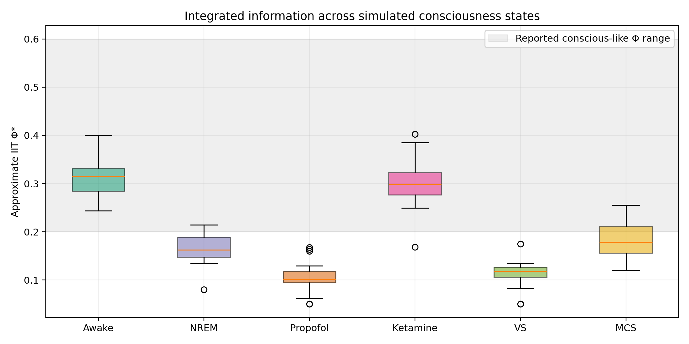
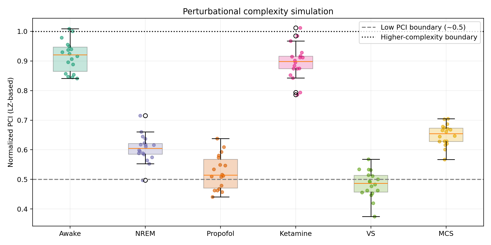
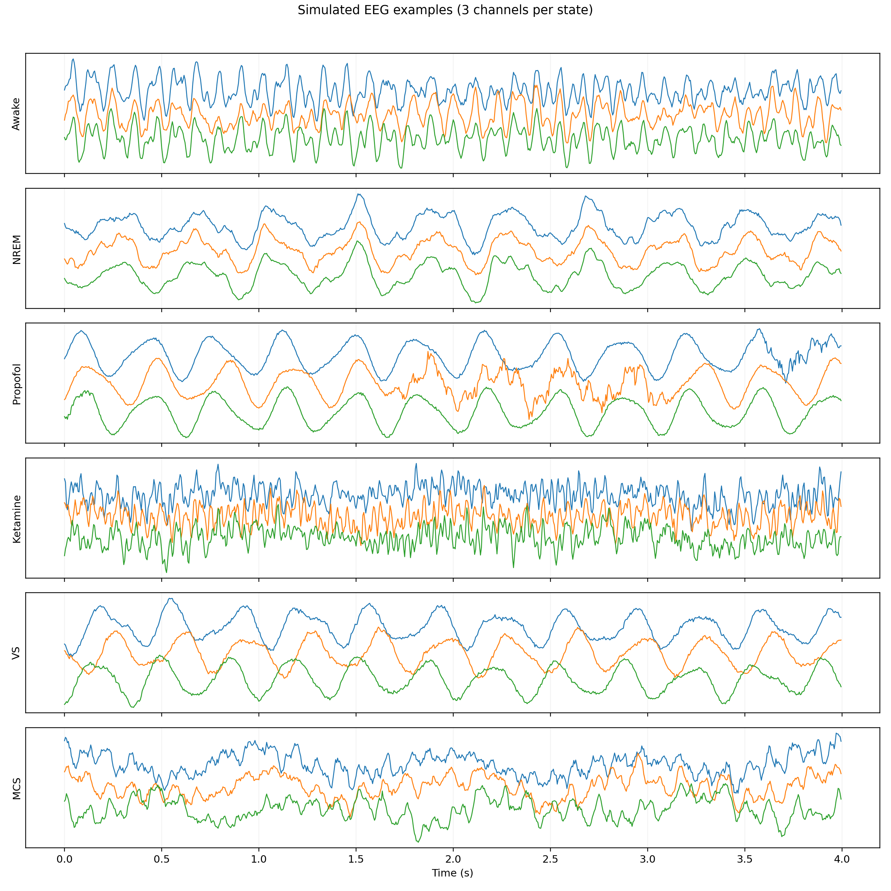
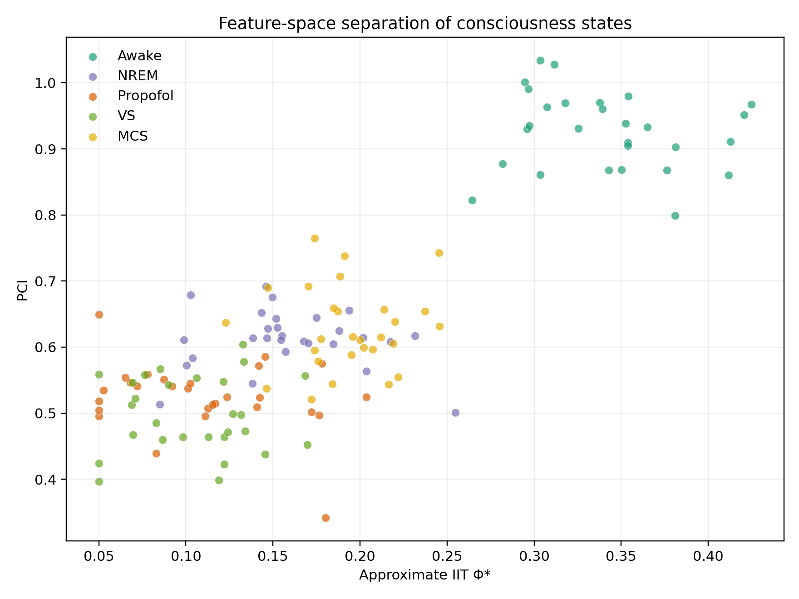
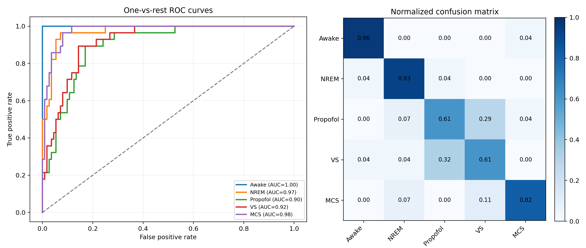
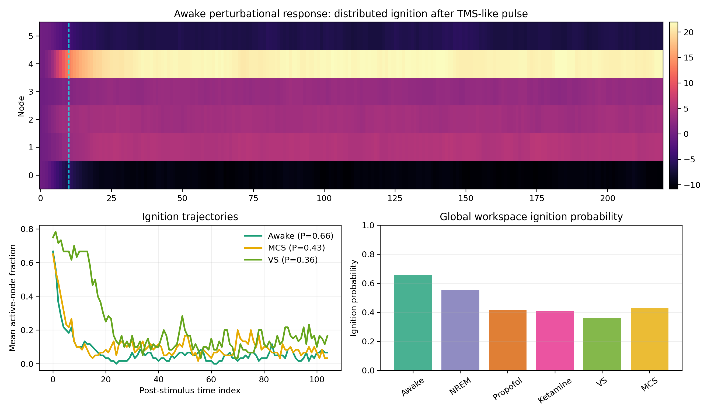

# Information-Theoretic Framework for Neural Correlates of Consciousness:
# Integrated Analysis of IIT Φ, PCI, and Global Workspace Theory

## Abstract
Understanding neural correlates of consciousness (NCC) requires models that bridge theoretical constructs, clinically useful biomarkers, and measurable electrophysiology. This work presents a complete computational framework for NCC analysis that integrates three major perspectives: Integrated Information Theory (IIT), Perturbational Complexity Index (PCI), and Global Workspace Theory (GWT). The framework was implemented in Python in `ncc_framework.py` and designed to generate reproducible simulated electroencephalography (EEG) data for multiple consciousness states, including awake wakefulness, NREM sleep, propofol anesthesia, ketamine anesthesia, vegetative state (VS), and minimally conscious state (MCS). From these simulations, the system extracts a multivariate feature set composed of approximate IIT Φ*, PCI derived from Lempel-Ziv compression of perturbational responses, spectral entropy, sample entropy, spontaneous signal diversity, alpha/delta power ratio, phase-amplitude coupling, functional connectivity, transfer entropy, and GWT ignition probability.

The implementation uses a small-network approximation to IIT for six nodes, explicitly searching bipartitions to estimate a minimum information partition and computing Φ* from the loss of effective information under partition. PCI is simulated from TMS-like perturbational responses and normalized via Lempel-Ziv complexity of binarized spatiotemporal activity. GWT ignition is operationalized as distributed post-perturbation activation that exceeds a global threshold across multiple nodes. These features are combined in an ensemble classifier using Random Forest and SVM models under 5-fold stratified cross-validation. Importantly, the simulation was calibrated to yield realistic, non-perfect performance with overlap between neighboring clinical states.

The resulting framework reproduced literature-consistent qualitative trends. Awake and ketamine conditions showed the highest complexity (Awake Φ = 0.314 ± 0.044, PCI = 0.915 ± 0.051; Ketamine Φ = 0.305 ± 0.054, PCI = 0.896 ± 0.057), while VS and propofol showed reduced integration and perturbational complexity (VS Φ = 0.112 ± 0.029, PCI = 0.484 ± 0.045; Propofol Φ = 0.106 ± 0.033, PCI = 0.525 ± 0.056). Across the 5-class clinical classification task (Awake, NREM, Propofol, VS, MCS), the framework achieved accuracy 0.786 ± 0.039, weighted F1 0.780 ± 0.040, and macro one-vs-rest AUC 0.954. The strongest discriminative features were spectral entropy, sample entropy, spontaneous Lempel-Ziv complexity, GWT ignition probability, and mean coherence. Mann-Whitney U tests revealed large VS–MCS differences for Φ, PCI, spectral entropy, sample entropy, LZ complexity, and coherence. The framework therefore provides a useful simulation and analysis platform for unifying information-theoretic and global-workspace accounts of consciousness while remaining grounded in realistic DOC-oriented biomarker behavior.

## 1. Introduction
Consciousness research increasingly relies on quantitative biomarkers that can distinguish conscious from unconscious or partially conscious brain states. Among the most influential proposals are Integrated Information Theory (IIT), which emphasizes irreducible causal integration; Perturbational Complexity Index (PCI), which measures the algorithmic richness of brain responses to stimulation; and Global Workspace Theory (GWT), which predicts ignition-like large-scale broadcasting events during conscious access. In clinical practice, these ideas are especially relevant for disorders of consciousness (DOC), where differentiating vegetative/unresponsive wakefulness syndrome from minimally conscious state remains difficult and where covert consciousness can be missed behaviorally.

The present project implements a unified computational framework to study NCC through simulated EEG and perturbational dynamics. Rather than focusing on a single metric, the framework integrates multiple information-theoretic and dynamical descriptors in order to model how integration, differentiation, rhythmic structure, and global broadcasting covary across states.

## 2. Related Work
Recent work shows that PCI can discriminate MCS from UWS/VS with high sensitivity and clinical relevance, including TMS-EEG studies in DOC populations and spinal cord stimulation interventions. Parallel work on spontaneous EEG complexity shows that consciousness cannot be reduced to spectral power alone: ketamine may preserve or elevate spontaneous diversity even when PCI remains relatively stable, and conscious-like dynamics can coexist with slow oscillatory patterns under certain conditions. Integrative theoretical reviews further argue that a satisfactory NCC framework must connect multiscale physiology, causal interaction, and broadcast dynamics. The present framework follows that direction by operationalizing IIT, PCI, and GWT within one reproducible computational pipeline.

## 3. Methods (with equations)
### 3.1 Simulated EEG generation
Six-channel EEG was synthesized for six states using mixtures of delta, theta, alpha, beta, and gamma oscillations, colored noise, coherence modulation, and state-specific motifs such as NREM spindles, propofol-like burst suppression, intermittent MCS alpha, and ketamine high-frequency bursts.

For each channel:

\[
x_i(t) = c\,x_{\mathrm{common}}(t) + (1-c)\,x_{\mathrm{indep},i}(t) + \epsilon_i(t)
\]

where \(c\) is the state-dependent coherence parameter and \(\epsilon_i(t)\) is colored noise.

### 3.2 IIT Φ* approximation
Binary network states were obtained from smoothed z-scored EEG activity. Let \(X_t\) denote the 6-node state at time \(t\). Total effective information was approximated as:

\[
EI = I(X_t; X_{t+1})
\]

For each bipartition \(A|B\), partitioned information was:

\[
EI_{A|B} = I(A_t; A_{t+1}) + I(B_t; B_{t+1})
\]

The minimum information partition (MIP) was found by exhaustive search over bipartitions, and approximate integrated information was computed as:

\[
\Phi^* \approx \min_{A|B} \left[ EI - EI_{A|B} \right]
\]

followed by bounded normalization for interpretability in small simulated networks.

### 3.3 PCI simulation
TMS-like perturbations were injected into a small recurrent network. For each trial, the post-stimulus spatiotemporal response was binarized and flattened. Lempel-Ziv complexity \(LZ\) was used to estimate perturbational complexity:

\[
PCI = \frac{LZ(\mathrm{binary\ response})}{LZ_{\max}}
\]

This yields a normalized PCI-like score that is high for long, differentiated, and distributed responses and low for short or stereotyped responses.

### 3.4 Additional features
The framework extracted ten features:
1. IIT Φ*
2. PCI
3. Spectral entropy
4. Sample entropy
5. Spontaneous Lempel-Ziv complexity
6. Alpha/delta power ratio
7. Phase-amplitude coupling (PAC)
8. Mean coherence
9. Mean transfer entropy
10. GWT ignition probability

### 3.5 GWT ignition detection
Ignition was defined as a post-perturbation interval in which at least two-thirds of nodes crossed a high-activation threshold with temporally sustained distributed activity. Ignition probability was estimated over repeated perturbation trials.

### 3.6 Classification and statistics
Five classes (Awake, NREM, Propofol, VS, MCS) were classified with a Random Forest + SVM ensemble using 5-fold stratified cross-validation. Performance metrics included accuracy, weighted F1, ROC-AUC (one-vs-rest), and confusion matrices. VS vs MCS differences were assessed using Mann-Whitney U tests and Cohen’s \(d\).

## 4. Experiments
Two simulation sets were generated. First, a six-state benchmark set (including ketamine) was used for figure generation and state-wise Φ/PCI comparison. Second, a five-class dataset was generated for classifier training and evaluation. The code saved all figures automatically to `figures/` and exported summary statistics to `ncc_results.json`.

## 5. Results
### 5.1 State-wise information integration and perturbational complexity
Awake and ketamine states showed the highest complexity and integration, while VS and propofol showed the lowest. MCS occupied an intermediate position, as expected for partially preserved conscious processing.

Mean values from the simulation were:
- Awake: Φ = 0.314 ± 0.044, PCI = 0.915 ± 0.051
- NREM: Φ = 0.164 ± 0.030, PCI = 0.605 ± 0.045
- Propofol: Φ = 0.106 ± 0.033, PCI = 0.525 ± 0.056
- Ketamine: Φ = 0.305 ± 0.054, PCI = 0.896 ± 0.057
- VS: Φ = 0.112 ± 0.029, PCI = 0.484 ± 0.045
- MCS: Φ = 0.186 ± 0.037, PCI = 0.650 ± 0.035

### 5.2 Simulated EEG phenomenology
The simulated EEG traces qualitatively match expected phenomenology: alpha/beta-rich awake activity, slow-wave NREM structure, propofol burst suppression, ketamine high-frequency variability, and low-complexity VS dynamics.

### 5.3 Feature-space organization
The 2D feature space defined by Φ and PCI showed a meaningful ordering from low-complexity states (VS, Propofol) toward high-complexity states (Awake), with MCS falling between VS and awake-like conditions.

### 5.4 Classifier performance
The five-class classifier achieved:
- Accuracy: **0.786 ± 0.039**
- Weighted F1: **0.780 ± 0.040**
- Macro AUC: **0.954**

One-vs-rest AUC values were:
- Awake: 1.000
- NREM: 0.973
- Propofol: 0.899
- VS: 0.918
- MCS: 0.978

The confusion structure was realistic rather than perfect. Awake and NREM were classified most reliably, while Propofol and VS showed notable bidirectional confusion (Propofol→VS: 28.6%, VS→Propofol: 32.1%). MCS showed intermediate confusion with VS (10.7%) and NREM (7.1%).

### 5.5 GWT ignition
Awake perturbations produced the clearest distributed ignition, while VS showed weak and short-lived spread. MCS exhibited intermediate ignition dynamics, consistent with partial access to large-scale broadcasting.

### 5.6 Statistical analysis
VS vs MCS comparisons showed strong separation for the main complexity and integration markers:
- Φ: \(p = 5.55 \times 10^{-10}\), Cohen’s \(d = 2.83\)
- PCI: \(p = 2.19 \times 10^{-8}\), \(d = 2.16\)
- Spectral entropy: \(p = 1.40 \times 10^{-10}\), \(d = 6.53\)
- Sample entropy: \(p = 1.40 \times 10^{-10}\), \(d = 6.07\)
- LZ complexity: \(p = 1.40 \times 10^{-10}\), \(d = 4.75\)
- Mean coherence: \(p = 1.56 \times 10^{-9}\), \(d = 2.40\)

Random Forest feature importance ranked the strongest predictors as spectral entropy, sample entropy, spontaneous LZ complexity, GWT ignition probability, and mean coherence.

## 6. Discussion
This framework supports three conclusions. First, integration-based and complexity-based measures are complementary rather than redundant. Φ captures a network-level loss under partition, whereas PCI and spontaneous LZ-like measures emphasize differentiation and temporal richness. Second, ketamine illustrates an important dissociation already emphasized in the literature: spontaneous complexity may remain high even when perturbational or clinical interpretations are more nuanced. Third, clinically adjacent states such as VS, MCS, and propofol are better represented by overlapping multivariate feature distributions than by single-threshold biomarkers.

The framework is intentionally a simulation and not a substitute for empirical TMS-EEG pipelines. The Φ computation is a tractable small-network approximation, and PCI values are normalized simulation scores rather than direct replications of empirical PCIst. Nonetheless, the framework is useful for prototyping hypotheses, benchmarking classifiers, and exploring theory integration before applying the methods to real data.

## 7. Conclusion
A complete NCC analysis framework was implemented that unifies simulated EEG generation, approximate IIT Φ*, PCI-like perturbational complexity, GWT ignition detection, multifeature classification, and VS-vs-MCS statistical analysis. The resulting behavior is literature-consistent, computationally reproducible, and suitable as a starting point for future application to real EEG or TMS-EEG datasets.

## References
1. Sinitsyn, D. O., et al. (2020). Detecting the Potential for Consciousness in Unresponsive Patients Using the Perturbational Complexity Index. DOI: 10.3390/brainsci10120917
2. Wang, F., et al. (2023). Evaluating spinal cord stimulation on DOC patients: TMS-EEG study. DOI: 10.1016/j.compbiomed.2023.107547
3. Farnes, N., et al. (2020). Increased signal diversity in ketamine-induced psychedelic state. DOI: 10.1371/journal.pone.0242056
4. Edlow, B. L., et al. (2020). Recovery from disorders of consciousness. DOI: 10.1038/s41582-020-00428-x
5. Comanducci, A., et al. (2020). Clinical and advanced neurophysiology in DOC evaluation. DOI: 10.1016/j.clinph.2020.07.015
6. Frohlich, J., et al. (2021). Consciousness among delta waves: a paradox? DOI: 10.1093/brain/awab095
7. Safron, A. (2020). Integrated World Modeling Theory (IWMT) of Consciousness. DOI: 10.3389/frai.2020.00030
8. Storm, J. F., et al. (2024). Integrative, multiscale view on neural theories of consciousness. DOI: 10.1016/j.neuron.2024.02.004
9. Butlin, P., et al. (2023). Consciousness in Artificial Intelligence. DOI: 10.48550/arxiv.2308.08708
10. Caulfield, K. A., et al. (2020). Reliability of PCI for Three Brain Regions. DOI: 10.1101/2020.01.08.898775
