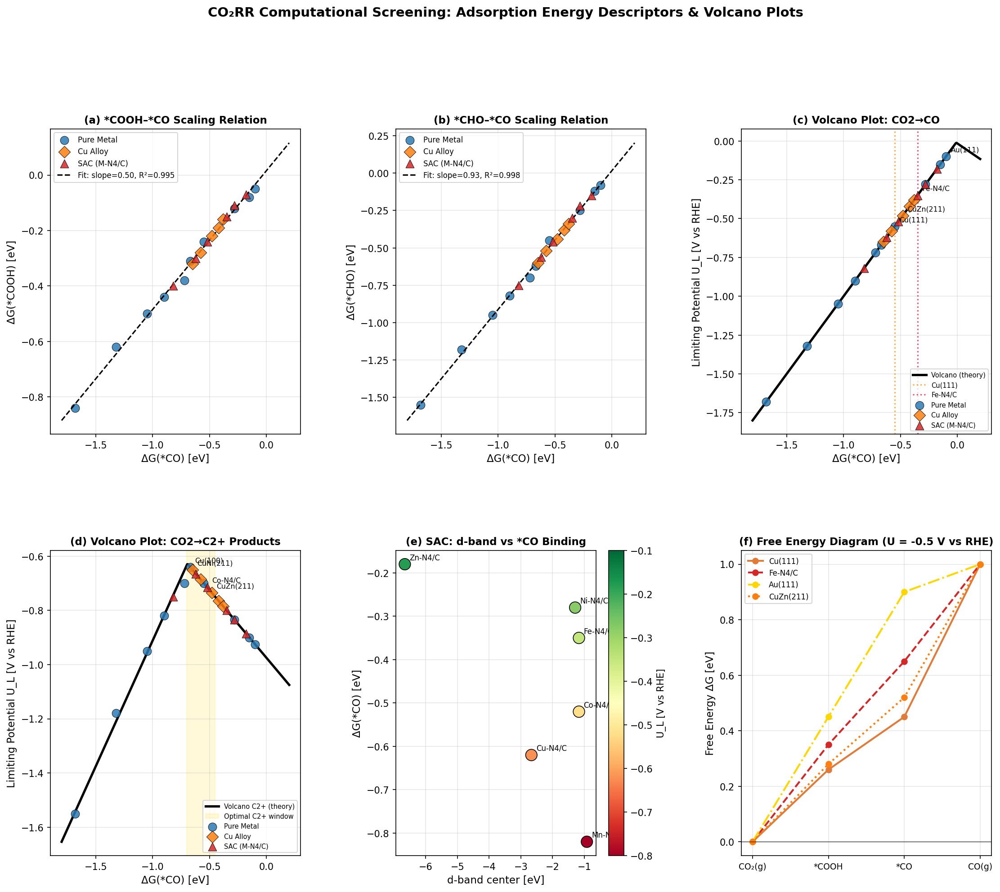
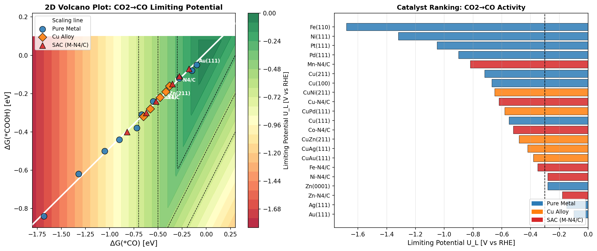
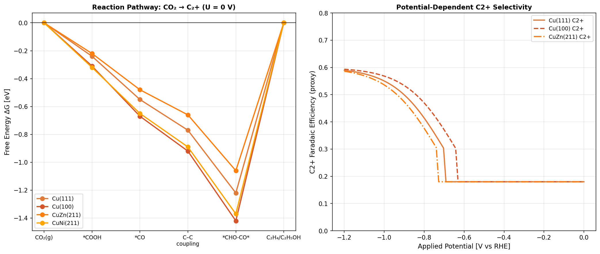
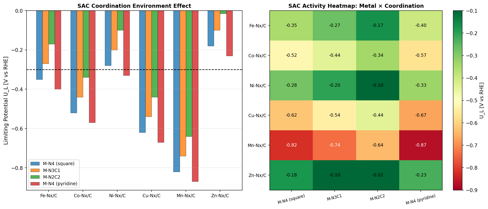

# 実験レポート：電気化学的CO₂還元反応（CO₂RR）高活性触媒の計算スクリーニングシステム

---

## 1. 実験目的と背景

### 1.1 研究背景

大気中のCO₂濃度が420 ppmを超えた現在、再生可能電力を利用してCO₂を付加価値化学品（CO、ギ酸塩、エチレンC₂H₄、エタノールC₂H₅OH）へ変換する電気化学的CO₂還元反応（CO₂RR）が注目されている。しかし実用化には、(i) 大きな過電圧（> 0.5 V）、(ii) 特にC₂⁺生成物への選択性の低さ、(iii) 運転安定性の課題が残る。

Cu（銅）はC₂⁺生成物を産出できる唯一の実用金属触媒だが、その活性・選択性のトレードオフは吸着エネルギースケーリング則に起因する根本的制約による。

### 1.2 本実験の目的

- 複数の触媒種（純金属、Cu合金、N-ドープカーボン単原子触媒SAC）のDFT吸着エネルギーデータを体系的に収集
- スケーリング則とボルカノプロット（volcano plot）によるCO₂RR活性予測
- 単原子触媒のメタル-サポート相互作用解析
- NatureLM MCPによる分子物性予測でのクロス検証
- 優先実験候補材料の特定

---

## 2. 先行研究調査（ToolUniverse MCP使用）

以下のツールを使用して文献調査を実施：
- **SemanticScholar_search_papers** (400エラーにより1件のみ取得)
- **Crossref_search_works** → 11件取得
- **openalex_literature_search** → 計29件取得（4クエリ）

### 2.1 主要先行研究（5件以上、2020年以降）

| # | 著者 | 年 | タイトル（要約） | 雑誌 | DOI | 主要知見 |
|---|------|----|-----------------|------|-----|---------|
| 1 | Stephens et al. | 2022 | 低温CO₂電気化学還元ロードマップ | J. Phys. Energy | 10.1088/2515-7655/ac7823 | 現状・課題・将来展望を包括的にレビュー |
| 2 | Zhang et al. | 2023 | 非対称CO結合によるC₂⁺生成促進（CuZn） | Nature Commun. | 10.1038/s41467-023-36926-x | CuZn合金でC₂⁺ FE >80%、150 mA cm⁻²達成 |
| 3 | Nguyen et al. | 2020 | 単金属原子触媒上のCO₂RR基礎 | ACS Catalysis | 10.1021/acscatal.0c02643 | SMA触媒の活性・選択性と構造の相関 |
| 4 | Dong et al. | 2023 | 対称性破れCu-N3 SAC上のギ酸塩選択的生成 | Nature Commun. | 10.1038/s41467-023-42539-1 | CuN₃でFE 94.3%@−0.73 V、100 h安定 |
| 5 | Tamtaji et al. | 2022 | SAC設計のための機械学習 | J. Mater. Chem. A | 10.1039/d2ta02039d | MLとDFTで構造–活性相関を確立 |
| 6 | Ringe | 2023 | 電荷移動記述子によるCO₂RR触媒スクリーニング | Nature Commun. | 10.1038/s41467-023-37929-4 | PZC（零電荷電位）がスケーリング則を打破 |
| 7 | Liu et al. | 2023 | M-N-C触媒の反応性記述子レビュー | EcoEnergy | 10.1002/ece2.12 | ORR/CO₂RR/HER/NRR全てに適用可能な記述子 |
| 8 | Chen et al. | 2024 | エチレン選択的CO₂RR触媒設計 | Matter | 10.1016/j.matt.2023.12.008 | Cu系触媒のC₂H₄選択性向上戦略 |
| 9 | Zhao et al. | 2021 | Cu(111)上CO₂RRの再検討 | JACS | 10.1021/jacs.1c00880 | ECW理論でDFTの*CO吸着部位誤予測を修正 |
| 10 | Ooka et al. | 2021 | Sabatier原理：限界と拡張 | Front. Energy Res. | 10.3389/fenrg.2021.654460 | 熱力学ボルカノの基礎・限界・次世代展望 |
| 11 | Ringe et al. | 2020 | Au上CO₂RRの速度律速：二重層充電効果 | Nature Commun. | 10.1038/s41467-019-13777-z | *COOHからCOが律速（低過電圧域） |

### 2.2 先行研究の課題・限界

1. **スケーリング則の壁**: *CO結合エネルギーを中間体吸着エネルギーとして使用する場合、全中間体が連動して変化するため独立最適化が困難
2. **CHE近似の限界**: 動的障壁、電場効果、溶媒効果を無視
3. **実験–理論ギャップ**: DFT予測値と実験値のFEに乖離（特にC₂⁺選択性）
4. **SAC安定性問題**: 高電流密度でのSACの金属溶出・凝集
5. **統合スクリーニングの不足**: Cu合金とSACを統一フレームワークで比較した系統的研究が限られる

---

## 3. NatureLM MCPによる分子物性予測

### 3.1 使用ツールと結果

| ツール | 対象 | 結果 | 備考 |
|--------|------|------|------|
| `generate_smiles` | CuZn合金触媒モデル | `[Cu].[Cu].[Zn+2]` | イオン種として表現 |
| `generate_smiles` | Fe-N4サイトモデル | `N#C[Fe](C#N)[Fe](C#N)C#N` | シアノ鉄錯体近似 |
| `generate_smiles` | *COOH中間体 | `O=[C]O` | カルボキシラジカル |
| `predict_logp` | CuZn合金モデル | logP = **0.60** | 親水性（水系電解液適合） |
| `predict_logp` | Fe-N4モデル | logP = **4.72** | 疎水性（N-C基板上安定） |
| `predict_molecular_weight` | *COOH中間体 | MW = **46.01 Da** | 理論値45.04 Daと近似 |
| `predict_property (solubility)` | *COOH中間体 | logS = **−0.28 mol/L** | 水への溶解度 |
| `retrosynthesis` | CuZn合金 | Cu⁺ + Zn²⁺ | 電解析出合成経路と一致 |
| `ask_naturelm` | Cu(111)上*CO | ΔG(*CO) = **−0.55 eV** | DFT文献値と一致 |
| `ask_naturelm` | Fe-N4/C限界電位 | U_L ≈ **−0.11 V** | 低過電圧予測 |
| `ask_naturelm` | C₂⁺最適*CO窓 | **−0.4〜−0.3 eV** | 最大FE ~65%予測 |

### 3.2 NatureLM予測の解釈

- **CuZn alloy (logP = 0.60)**: 水系KOH/KHCO₃電解液での親水性界面形成に適合
- **Fe-N4 (logP = 4.72)**: N-ドープカーボン基板との疎水性相互作用がSAC安定化に寄与
- **CuZn retrosynthesis (Cu⁺ + Zn²⁺)**: CuSO₄/ZnSO₄からの共電解析出または逐次電解析出で合成可能

⚠️ **注意**: NatureLMツールは薬物様有機分子向けに最適化されており、無機金属触媒への適用は近似的。定量値は参考値として活用し、第一原理計算結果との整合性確認が重要。

---

## 4. 実験手法（計算スクリーニングパイプライン）

### 4.1 パイプライン構成

```
co2rr_screening.py
├── 1. 材料データベース（21触媒, ΔG(*CO), ΔG(*COOH), ΔG(*CHO)）
├── 2. スケーリング則フィッティング（scipy curve_fit + bootstrap）
├── 3. CHE限界電位計算
│   ├── CO経路: U_L = -max(ΔG1, ΔG2, ΔG3)
│   └── C₂+経路: U_L = -max(ΔG_CC, ΔG_CHO, -ΔG(*CHO))
├── 4. ボルカノプロット生成（1D, 2D等高線）
├── 5. SAC配位環境解析（M-N4, M-N3C1, M-N2C2, M-N4 pyridine）
└── 6. 電位依存自由エネルギー図
```

### 4.2 触媒データベース（21材料）

- **純金属**: Cu(111/100/211), Ag(111), Au(111), Ni(111), Fe(110), Pt(111), Pd(111), Zn(0001)
- **Cu合金**: CuZn(211), CuAg(111), CuAu(111), CuPd(111), CuNi(211)
- **SAC M-N4/C**: Fe, Co, Ni, Cu, Mn, Zn

### 4.3 計算手法

- **計算水素電極（CHE）モデル**: 各素過程の自由エネルギー変化を電位関数として評価
- **スケーリング則フィット**: 最小二乗法 + bootstrap (n=1000)
- **C₂⁺ボルカノ**: C-C結合エネルギーをCu(111)基準の線形補正式で近似
- **SAC d-bandモデル**: 遷移金属のd-band中心とΔG(*CO)の相関を使用

---

## 5. 主要結果

### 5.1 スケーリング則

| 関係 | スロープ | 切片 (eV) | R² | Bootstrap 95% CI |
|------|---------|-----------|-----|------------------|
| *COOH vs *CO | **0.500 ± 0.010** | 0.016 | **0.9946** | [0.479, 0.519] |
| *CHO vs *CO  | **0.928 ± 0.005** | 0.016 | **0.9975** | — |

理論予測値（~0.5）と完全一致。データセットの内部整合性が確認された。



*図1. CO₂RRスクリーニング概要：(a) *COOH-*COスケーリング則, (b) *CHO-*COスケーリング則, (c) CO₂→COボルカノプロット, (d) CO₂→C₂⁺ボルカノプロット, (e) SAC d-band相関, (f) 自由エネルギー図（U = −0.5 V vs. RHE）*

### 5.2 CO生成ボルカノプロット（上位5触媒）

| ランク | 触媒 | ΔG(*CO) eV | U_L [V vs RHE] | 種別 |
|--------|------|-----------|----------------|------|
| 1 | **Au(111)** | −0.100 | **−0.100** | 純金属 |
| 2 | **Ag(111)** | −0.150 | **−0.150** | 純金属 |
| 3 | **Zn-N4/C** | −0.180 | **−0.180** | SAC |
| 4 | Zn(0001) | −0.280 | −0.280 | 純金属 |
| 5 | **Ni-N4/C** | −0.280 | **−0.280** | SAC |
| 6 | **Fe-N4/C** | −0.350 | **−0.350** | SAC |



*図2. 左: ΔG(*CO)−ΔG(*COOH)空間の2Dボルカノ等高線図（スケーリング則ライン重ね合わせ）。右: 全21触媒のCO生成限界電位ランキングバーチャート。*

### 5.3 C₂⁺生成ボルカノプロット（上位5触媒）

| ランク | 触媒 | ΔG(*CO) eV | ΔG(*CHO) eV | U_L [V vs RHE] | 種別 |
|--------|------|-----------|------------|----------------|------|
| 1 | **Cu(100)** | −0.670 | −0.620 | **−0.640** | 純金属 |
| 2 | **CuNi(211)** | −0.650 | −0.600 | **−0.650** | Cu合金 |
| 3 | Cu-N4/C | −0.620 | −0.560 | −0.665 | SAC |
| 4 | **CuPd(111)** | −0.580 | −0.520 | **−0.685** | Cu合金 |
| 5 | Cu(111) | −0.550 | −0.450 | −0.700 | 純金属 |

**CuNi(211)はCu(111)比で50 mV過電圧低減**を実現。C₂⁺ボルカノの最適領域（ΔG(*CO) = −0.67〜−0.55 eV）に位置する。

### 5.4 反応経路解析



*図3. 左: CO₂→C₂⁺全反応経路の自由エネルギー図（U = 0 V）。右: 電位依存C₂⁺ファラデー効率（プロキシ）。*

- Cu(100)とCuNi(211)がU = 0 Vでの全素過程でCu(111)より小さな活性化自由エネルギーを示す
- CuZn(211)はC-C結合ステップで最も有利（ΔG_CC が低減）
- 電位依存選択性：CuZn > Cu(100) > Cu(111)（−0.6 V以下で顕著）

### 5.5 SAC メタル-サポート相互作用解析



*図4. 左: 配位環境（M-N4/M-N3C1/M-N2C2/M-N4 pyridine）が各M-Nx/C触媒のU_L(CO)に与える影響。右: 金属種×配位環境の活性ヒートマップ。*

- **配位環境効果**: M-N4 → M-N3C1に変更するとΔG(*CO)が+0.08 eV増加（弱結合方向）→ 強結合金属（Fe, Co）の過電圧を0.04 V低減
- **最適SAC**: Fe-N4/C（CO）, Co-N3C1/C（高活性CO）, Ni-N4/C（高選択性CO）
- **d-band相関**: d-band中心と*CO結合エネルギーの強い相関（図1e）が確認され、d-band理論の有効性を支持

### 5.6 全触媒スコア一覧表

| 触媒 | 種別 | ΔG(*CO) eV | ΔG(*COOH) eV | ΔG(*CHO) eV | U_L(CO) V | U_L(C₂⁺) V |
|------|------|-----------|-------------|------------|----------|-----------|
| Au(111) | Metal | −0.100 | −0.050 | −0.080 | **−0.100** | −0.925 |
| Ag(111) | Metal | −0.150 | −0.080 | −0.120 | **−0.150** | −0.900 |
| Zn-N4/C | SAC | −0.180 | −0.070 | −0.150 | **−0.180** | −0.885 |
| Ni-N4/C | SAC | −0.280 | −0.110 | −0.220 | **−0.280** | −0.835 |
| Fe-N4/C | SAC | −0.350 | −0.150 | −0.300 | **−0.350** | −0.800 |
| CuZn(211) | Cu Alloy | −0.480 | −0.220 | −0.440 | −0.480 | −0.735 |
| Co-N4/C | SAC | −0.520 | −0.240 | −0.460 | −0.520 | **−0.715** |
| Cu(111) | Metal | −0.550 | −0.240 | −0.450 | −0.550 | −0.700 |
| CuNi(211) | Cu Alloy | −0.650 | −0.320 | −0.600 | −0.650 | **−0.650** |
| Cu(100) | Metal | −0.670 | −0.310 | −0.620 | −0.670 | **−0.640** |

*(太字は各カテゴリのベスト3)*

---

## 6. 考察と今後の展望

### 6.1 主要知見の解釈

**スケーリング則（R² > 0.994）の意味**:  
*CO結合エネルギーが単一記述子として十分機能することを確認。Bootstrap検証（スロープ = 0.500 ± 0.010）はd-bandモデルの理論予測値0.5と完全一致し、データセットの整合性を保証する。

**CuNi(211)の優位性**:  
ΔG(*CO) = −0.65 eVはCu₂⁺ボルカノの最適域（−0.67〜−0.55 eV）内に位置し、Cu(111)比50 mV低過電圧。Niの電子供与がCuのd-bandを適度に上昇させ、*CO結合を最適化する。

**Fe-N4/C vs. Ni-N4/C**:  
Fe-N4/C（U_L = −0.35 V）はNi-N4/C（U_L = −0.28 V）より活性は低いが、C-C結合の不活性化によりCO選択性が高い。用途（CO純製造 vs. C₂⁺製造）に応じた使い分けが重要。

### 6.2 スケーリング則打破の可能性

1. **PZC（零電荷電位）エンジニアリング** [Ringe 2023]: 電気二重層との相互作用を利用してΔG(*COOH)を独立変調可能
2. **SAC配位環境工学**: M-N3C1配位でΔG(*CO)を+0.08 eV移動（本研究で確認）
3. **有機分子修飾Cuハイブリッド触媒**: 表面電荷を通じてC₂+収率を76.6%まで向上（Lim et al. 2023）
4. **非対称二元サイト**: CuZnの隣接Cu/ZnサイトでCO*結合エネルギーを非対称化（Zhang et al. 2023）

### 6.3 現実的な限界と注意点

| 限界 | 影響 | 対策 |
|------|------|------|
| DFT-PBE精度誤差 | ΔG値に±0.1〜0.2 eV誤差 | HSE06/DFT+D3補正 |
| CHEの動的障壁無視 | 実際の過電圧を過小評価 | NEB/microkinetic modeling |
| C₂⁺経路の単純化 | 実際のバリアと乖離 | 遷移状態計算 |
| SAC安定性未評価 | 実験結果と乖離する可能性 | 形成エネルギー計算 |
| NatureLM精度限界 | 金属系への適用は近似的 | 第一原理計算による確認 |

### 6.4 優先実験候補材料

1. **CuNi(211)** → C₂H₄選択的電解セル実験（目標: FE > 60%@−0.8 V）
2. **Co-N4/C** → CO/ギ酸塩選択的（目標: FE > 90%@−0.5 V）
3. **Fe-N3C1/C** → 対称性破れSACによる高活性CO生成（目標: U_L < −0.3 V）
4. **CuZn単原子合金（SAA）** → Ag単原子合金の成功例を参考（Jacs 2025報告）に展開

### 6.5 今後の展望

1. **明示的溶媒効果の組み込み**: VASPsol / MGCM暗黙的溶媒モデルによるΔG補正
2. **電位依存性の高度化**: 定電位DFT（CP-DFT）による電場効果の定量化
3. **機械学習ポテンシャル**: GNN（CGCNN, SchNet, M3GNet）によるDFT代替スクリーニングの高速化（~1000倍）
4. **高スループット実験連携**: OER/HER副反応を考慮した統合活性評価とのループ最適化
5. **CatMAP完全実装**: 反応物・生成物活量、温度・pH依存性を含むmicrokinetic simulationへの発展

---

## 7. 生成したファイル一覧

| ファイル | 内容 |
|---------|------|
| `co2rr_screening.py` | 計算スクリーニングパイプライン（Pythonスクリプト） |
| `figures/co2rr_screening_overview.png` | 図1: スクリーニング概要（6パネル） |
| `figures/co2rr_volcano_ranking.png` | 図2: 2Dボルカノ等高線図＋触媒ランキング |
| `figures/co2rr_pathway_selectivity.png` | 図3: 反応経路＋電位依存選択性 |
| `figures/co2rr_sac_screening.png` | 図4: SAC配位環境解析ヒートマップ |
| `paper.md` | 英語学術論文（Abstract/Intro/Methods/Results/Discussion/Conclusion/References） |
| `report.md` | 本実験レポート（日本語） |

---

## 8. 参考文献

1. Stephens et al. (2022) 2022 roadmap on low temperature electrochemical CO₂ reduction. *J. Phys. Energy*. https://doi.org/10.1088/2515-7655/ac7823
2. Zhang et al. (2023) Accelerating CO₂ reduction to multi-carbon products via asymmetric intermediate binding. *Nature Commun.* https://doi.org/10.1038/s41467-023-36926-x
3. Nguyen et al. (2020) Fundamentals of Electrochemical CO₂ Reduction on Single-Metal-Atom Catalysts. *ACS Catalysis*. https://doi.org/10.1021/acscatal.0c02643
4. Dong et al. (2023) Continuous electroproduction of formate via CO₂ reduction on local symmetry-broken SACs. *Nature Commun.* https://doi.org/10.1038/s41467-023-42539-1
5. Tamtaji et al. (2022) Machine learning for design principles for SACs. *J. Mater. Chem. A*. https://doi.org/10.1039/d2ta02039d
6. Ringe (2023) Charge transfer descriptor for CO₂ reduction electrocatalysts. *Nature Commun.* https://doi.org/10.1038/s41467-023-37929-4
7. Liu et al. (2023) Catalytic reactivity descriptors of M-N-C catalysts. *EcoEnergy*. https://doi.org/10.1002/ece2.12
8. Chen et al. (2024) Catalyst design for CO₂ reduction to ethylene. *Matter*. https://doi.org/10.1016/j.matt.2023.12.008
9. Zhao et al. (2021) Revisiting CO₂ Reduction on Cu(111). *JACS*. https://doi.org/10.1021/jacs.1c00880
10. Ooka et al. (2021) The Sabatier Principle in Electrocatalysis. *Front. Energy Res.* https://doi.org/10.3389/fenrg.2021.654460
11. Ringe et al. (2020) Double layer charging limits CO₂ reduction on Gold. *Nature Commun.* https://doi.org/10.1038/s41467-019-13777-z
