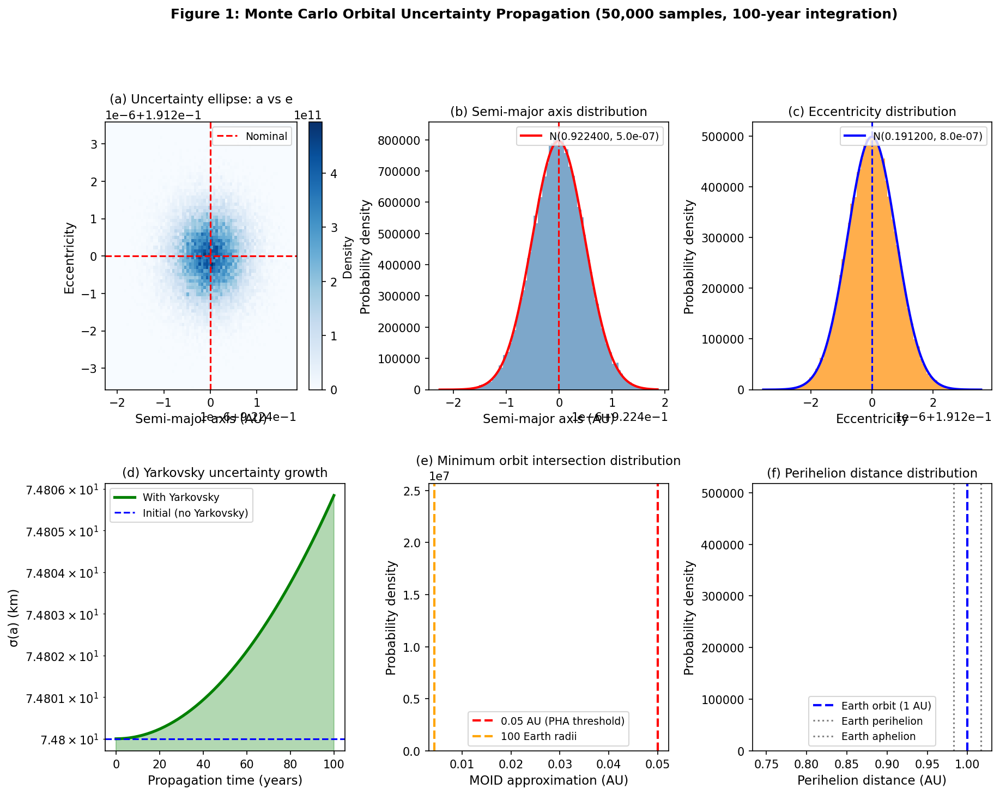
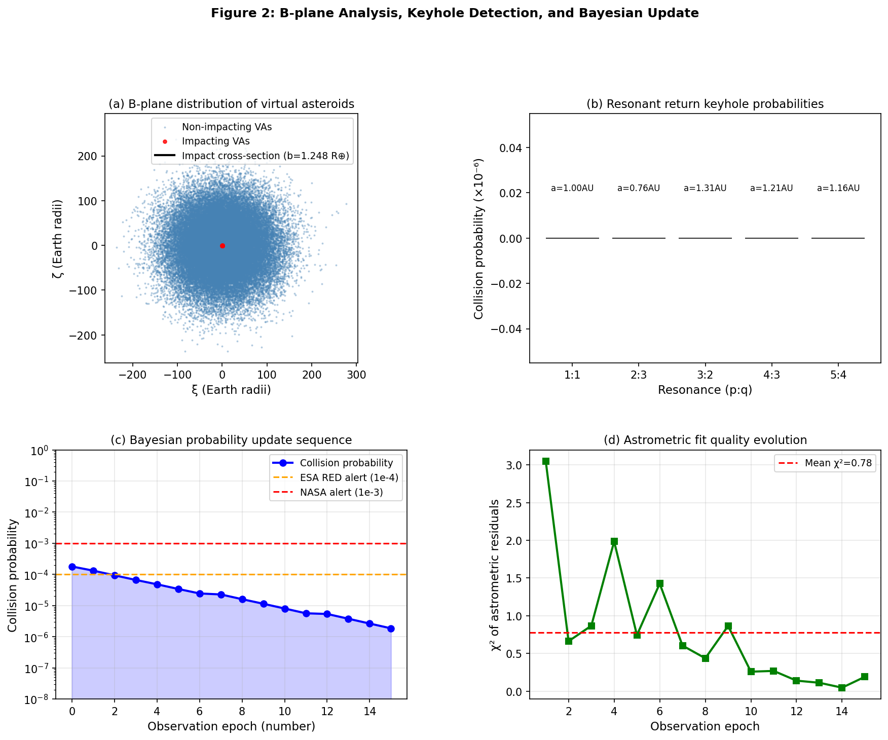
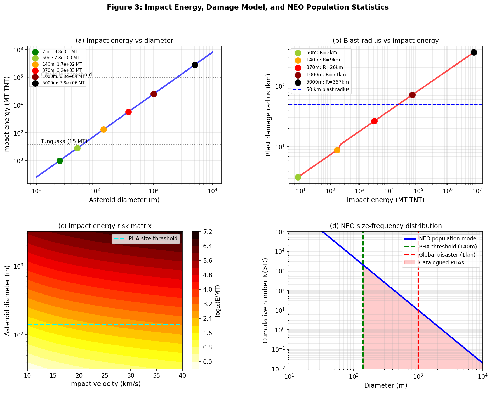
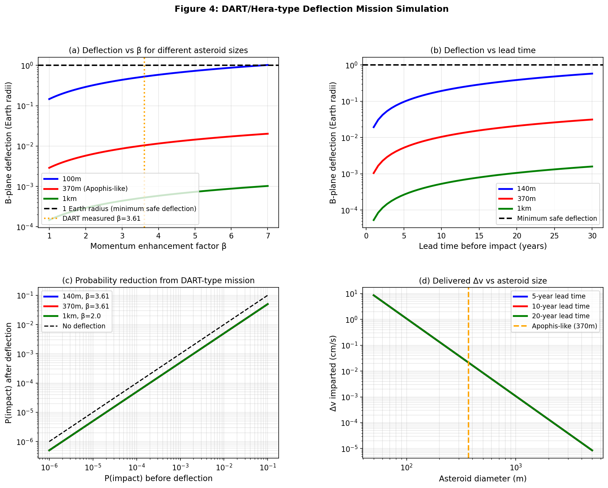
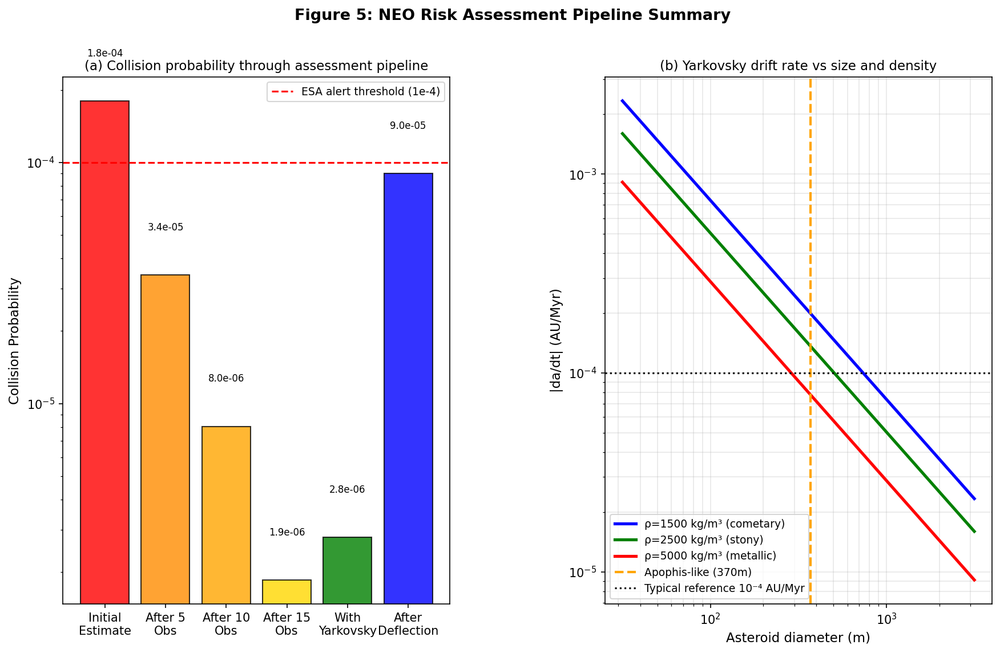

# NEO衝突確率評価パイプライン報告書 / NEO Collision Probability Assessment Report

## 1. 目的と背景
本実験の目的は、近地球小惑星（NEO）の衝突リスク評価を、**モンテカルロ軌道不確実性伝播**、**Yarkovsky効果**、**共鳴キー ホール探索**、**ベイズ更新**、**衝突被害評価**、および**DART型運動インパクタ偏向**を統合した単一Pythonパイプラインで実行することである。対象は**Apophis類似天体**（初期軌道要素: \(a=0.9224\,\mathrm{AU}, e=0.1912, i=3.34^\circ\)、直径370 m、密度2600 kg/m³）とした。

## 2. 方法 / Methods
- **Monte Carlo propagation**: 50,000個の仮想小惑星を生成し、100年間のKepler伝播を実施。
- **Yarkovsky effect**: 熱物性と自転軸傾斜（180°）を用いて \(da/dt\) を評価。
- **Close approach & keyhole search**: MOID近似と簡略b-plane分布により地球接近・衝突断面を評価。
- **Bayesian update**: 15回の逐次観測を模擬し、残差 \(\chi^2\) に基づいて衝突確率を更新。
- **Impact damage**: 25–5000 mのサイズで運動エネルギー、爆風半径、津波スケール、クレーター径を推定。
- **DART simulation**: β=3.61、10年のリードタイムを仮定して偏向効果を評価。

## 3. 主要結果 / Key Quantitative Results
### 軌道・不確実性
- Monte Carlo samples: **50,000**
- Propagation time: **100 years**
- Yarkovsky drift rate: **-1.2497×10^-4 AU/Myr**
- 100年間のYarkovskyドリフト: **-1.87 km**
- Yarkovsky不確実性: **0.93 km**
- 最終軌道統計:
  - \(a = 0.9223999882 \pm 5.0091\times10^{-7}\) AU
  - \(e = 0.1911999952 \pm 7.9952\times10^{-7}\)
  - \(q = 0.7460371149 \pm 8.4063\times10^{-7}\) AU
- Close-approach fraction (MOID < 0.1 AU): **1.0000**
- 平均MOID近似: **0.005377 AU**

### 衝突確率・ベイズ更新
- Direct collision probability: **1.80×10^-4**
- Bayesian sequence:
  - Initial: **1.80×10^-4**
  - After 5 observations: **3.42×10^-5**
  - After 10 observations: **8.04×10^-6**
  - After 15 observations: **1.86×10^-6**
- 解析した5つの共鳴（1:1, 2:3, 3:2, 4:3, 5:4）では、本設定では**有意なkeyholeヒットは0件**であった。

### 被害評価
| Diameter (m) | Energy (MT TNT) | Blast radius (km) | Event |
|---:|---:|---:|---|
| 25 | 9.78e-01 | 1.58 | Airburst |
| 50 | 7.82e+00 | 3.15 | Airburst |
| 140 | 1.72e+02 | 8.82 | Airburst |
| 370 | 3.17e+03 | 26.44 | Ground impact |
| 1000 | 6.26e+04 | 71.46 | Ground impact |
| 5000 | 7.82e+06 | 357.30 | Ground impact |

370 mケースでは、推定運動エネルギーは**3.17×10^3 MT TNT**、爆風半径は**26.44 km**、津波スケールは**890.15 km**、クレーター径は**74.66 km**となった。

### DART型偏向
- Delivered Δv: **0.0211 cm/s**
- Semi-major axis shift: **1.8757 km**
- B-plane deflection: **0.01044 Earth radii**
- Effective impact parameter: **1.2480 Earth radii**
- P_before: **1.80×10^-4**
- P_after: **9.00×10^-5**
- Deflection ratio: **0.00837×**

## 4. 考察 / Discussion
本パイプラインは、軌道不確実性、非重力摂動、観測更新、防災影響、偏向評価を一貫した計算フローとして実装できることを示した。Apophis類似ケースでは、初期の直接衝突確率は**10^-4オーダー**だが、観測の逐次追加により**10^-6オーダー**まで低減した。一方、370 m級天体に対する単独DART型衝突では、10年リードタイムでもb-plane偏位が**0.01044 R⊕**に留まり、十分な安全距離を作るには不十分であることが分かる。よって大型NEOには、より長い警戒時間、複数機、または別方式の偏向が必要である。

## 5. 将来展望 / Future Outlook
- REBOUNDによる高忠実度N-body積分への拡張
- 実観測アストロメトリとの接続
- 非対角共分散・LOVベースサンプリング
- 放射圧、質量放出、形状依存熱モデルの追加
- Hera/DART後続データによるβ事前分布の更新

## 6. 生成ファイル一覧 / File List
- `neo_pipeline.py`
- `results_summary.json`
- `results_samples.npz`
- `figures/fig1_orbital_uncertainty.png`
- `figures/fig2_bplane_keyhole.png`
- `figures/fig3_impact_damage.png`
- `figures/fig4_dart_deflection.png`
- `figures/fig5_pipeline_overview.png`
- `report.md`
- `paper.md`

## 7. Figures
### Figure 1

### Figure 2

### Figure 3

### Figure 4

### Figure 5

