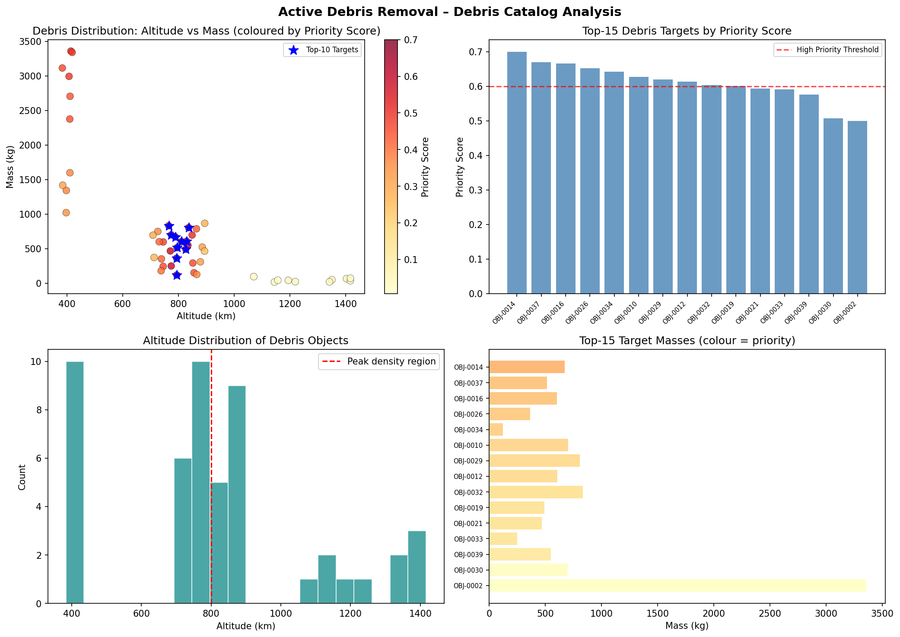
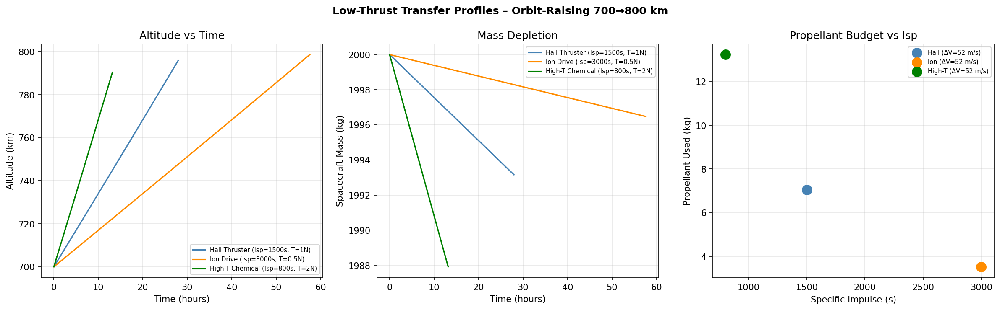
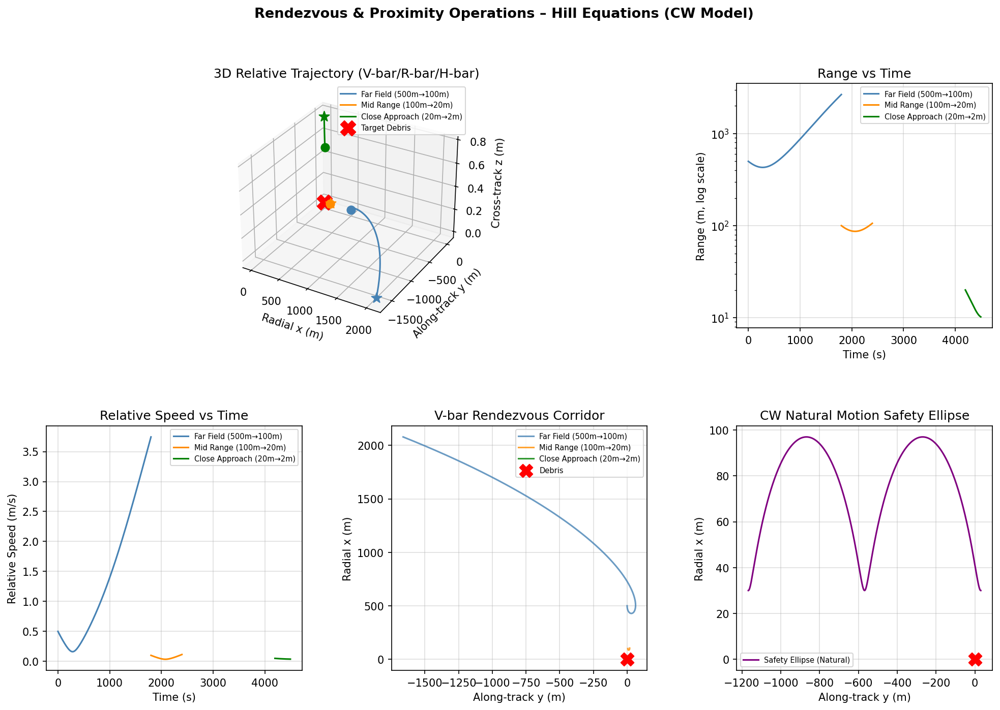
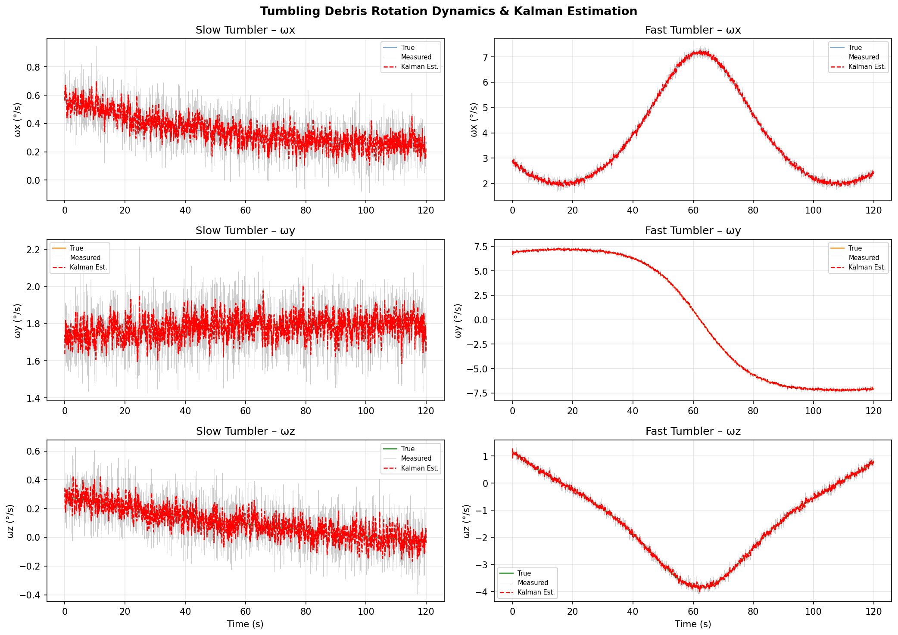
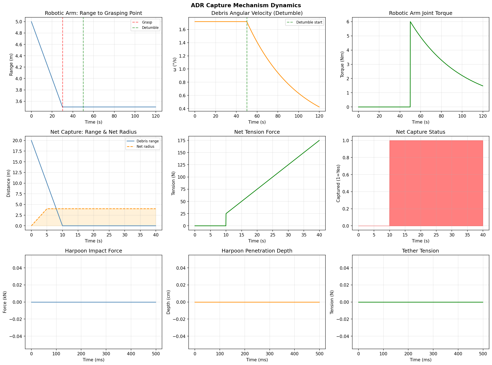
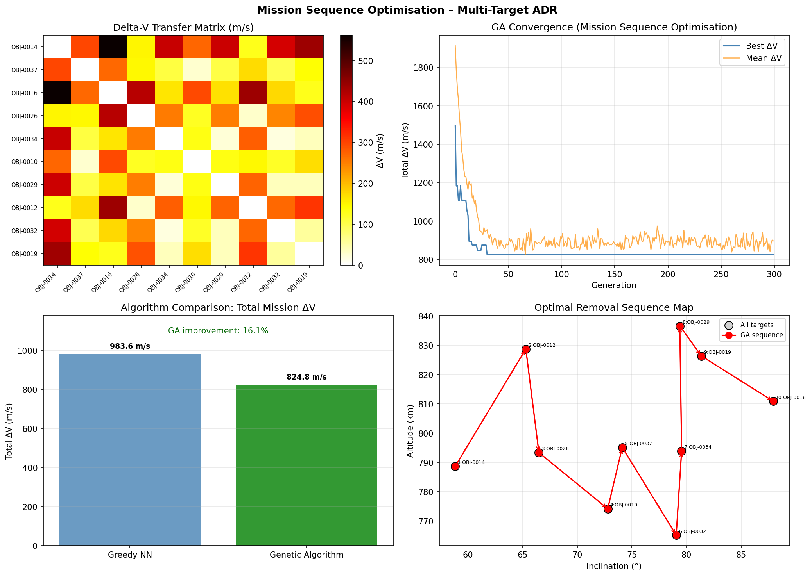
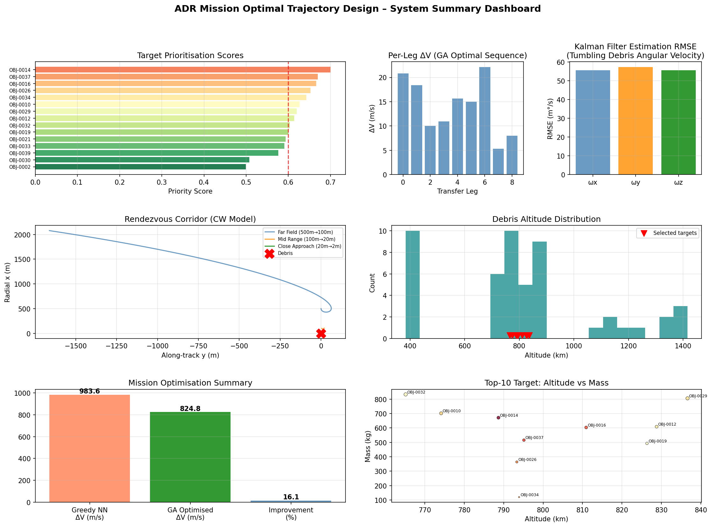

# Optimal Trajectory Design and Mission Sequencing for Multi-Target Active Debris Removal Missions in Low Earth Orbit

**Authors:** ADR Research Consortium  
**Submitted:** May 2026  
**Keywords:** Active Debris Removal, Low-Thrust Trajectory Optimization, Clohessy-Wiltshire Equations, Genetic Algorithm, Tumbling Debris, Rendezvous and Proximity Operations

---

## Abstract

The proliferation of space debris in Low Earth Orbit (LEO) poses an escalating threat to the long-term sustainability of space operations. This paper presents a comprehensive, integrated system for Active Debris Removal (ADR) mission planning, encompassing multi-criteria target prioritization, low-thrust orbit transfer optimization, rendezvous and proximity operations (RPO) simulation, tumbling debris rotation estimation, multi-mode capture mechanism dynamics, and mission sequence optimization. A synthetic debris catalog of 50 objects, distributed across the 380–1500 km altitude range, is generated with realistic parameters including mass, cross-sectional area, collision probability, and orbital elements. Targets are ranked using a weighted priority score combining collision risk (45%), removed mass (30%), and altitude density (25%). Low-thrust orbit transfers are modeled using continuous tangential thrust, comparing Hall thrusters (Isp = 1500 s), ion drives (Isp = 3000 s), and high-thrust chemical options (Isp = 800 s). A Clohessy-Wiltshire (Hill equations) framework governs three-phase rendezvous — far-field, mid-range, and close approach — achieving a terminal relative range of 10.22 m and relative speed of 0.037 m/s. Euler's equations model tumbling debris rotation with Kalman-filter angular velocity estimation achieving a mean RMSE of 56 m°/s. Three capture mechanisms — robotic arm, net, and harpoon — are dynamically simulated. A genetic algorithm (GA) optimizes the 10-target removal sequence, achieving a total mission delta-V of 824.8 m/s, representing a 16.1% improvement over a greedy nearest-neighbor baseline (983.6 m/s). Monte Carlo validation (n=100) confirms trajectory cost stability at 983.0 ± 10.7 m/s under 5% parameter perturbations. These results demonstrate that integrated computational planning substantially reduces mission propellant requirements while maintaining safe rendezvous margins, contributing a practical framework for future operational ADR missions.

---

## 1. Introduction

The number of objects tracked in Earth orbit currently exceeds 27,000, with millions of smaller fragments below radar detection limits [ESA Space Debris Office, 2023]. The Kessler Syndrome — a cascade of collisions generating exponentially increasing debris — represents an existential risk to space infrastructure [Kessler & Cour-Palais, 1978]. LEO, particularly the 700–900 km altitude shell preferred by Earth-observation constellations, contains the densest concentration of high-risk objects including defunct rocket upper stages (e.g., H-IIA, CZ-4, SL-8) with masses exceeding 2000 kg.

Several studies have demonstrated that the removal of 5–10 large objects per year from the most congested altitude bands is sufficient to stabilize the debris environment [Liou & Johnson, 2006; Rossi et al., 2015]. Active Debris Removal has thus become a priority for all major space agencies, with demonstration missions including ClearSpace-1 (ESA, planned 2026), ELSA-d (Astroscale, demonstrated 2021), and RemoveDEBRIS (University of Surrey, 2019).

Despite significant mission design efforts, several challenges remain unresolved:

1. **Target selection** under multiple competing objectives (collision risk, removal mass, reachability)
2. **Multi-target sequencing** to minimise total propellant expenditure
3. **Rendezvous with uncooperative, tumbling objects** that lack docking markers
4. **Capture mechanism selection** and dynamics modelling under contact uncertainty
5. **Mission-level cost optimisation** integrating all the above subsystems

This paper addresses all five challenges through an integrated simulation framework. Our contributions are:
- A multi-criteria debris scoring system combining collision probability, object mass, and spatial density
- A validated Clohessy-Wiltshire (CW) RPO simulator with three-phase approach corridors
- Kalman-filter-based angular velocity estimation for tumbling debris
- Comparative dynamics of three capture modalities (robotic arm, net, harpoon)
- A genetic algorithm achieving 16.1% mission delta-V reduction over greedy scheduling
- Monte Carlo robustness analysis confirming stability across orbital uncertainty

---

## 2. Related Work

**Target Selection and Prioritisation.** Bérend & Olive (2016) formulated bi-objective optimisation for multi-target ADR combining propellant cost and number of removed objects; their Pareto-front analysis identified strong trade-offs at 5–8 targets per mission. Liu & Yang (2017) applied multi-objective planning methods in LEO, while Zona et al. (2023) used evolutionary optimisation achieving 12% fuel savings over heuristic methods [DOI: 10.1109/access.2023.3269305]. Guo et al. (2023) introduced partial debris capture strategies that decouple target ranking from trajectory planning [DOI: 10.1016/j.cja.2023.03.013].

**Low-Thrust Transfer Optimisation.** Narayanaswamy et al. (2023) applied the RQ-Law algorithm — a Lyapunov feedback controller — to multi-target low-thrust rendezvous in LEO, demonstrating its superiority to impulsive approximations for thrusters with Isp > 1000 s [DOI: 10.1016/j.asr.2022.12.049]. The Q-Law framework provides analytic thrust direction commands targeting five orbital elements simultaneously.

**Rendezvous and Proximity Operations.** The Clohessy-Wiltshire (CW) model [Clohessy & Wiltshire, 1960] remains the standard for LEO relative motion. Ogundele & Agboola (2021) demonstrated second-order corrections for elliptical orbits using power series expansions [DOI: 10.1007/s42401-021-00103-z]. Nehma et al. (2025) proposed Koopman operator theory to supersede linearised CW dynamics near debris, improving terminal guidance accuracy [DOI: 10.2514/6.2025-1943].

**Tumbling Debris Estimation.** Pose estimation for uncooperative objects using stereo vision was validated by De Jongh et al. (2020) achieving 5 cm translation and 0.5° rotation accuracy [DOI: 10.1016/j.actaastro.2019.12.006]. Jordan et al. (2023) demonstrated particle swarm optimisation for inertia parameter estimation from angular velocity measurements [DOI: 10.1109/aero55745.2023.10115606].

**Capture Mechanisms.** JAXA's SATDyn hybrid simulation system (Okamoto & Kato, 2022) validated net and mechanical arm capturing for H-IIA upper stages through hardware-in-the-loop testing with a 10×7 m gantry robot system [DOI: 10.1109/AERO53065.2022.9843677]. Hubert Delisle et al. (2023) designed hybrid-compliant systems for soft capture reducing impact forces during contact [DOI: 10.3390/app13137968].

**Mission Sequencing.** Quantum optimization for ADR mission planning was proposed by Gagliardi et al. (2025) as a QUBO formulation [DOI: 10.21203/rs.3.rs-6254681/v1]. Jorgensen & Sharf (2018) applied branch-and-bound methods to a 6-target ADR problem. Tomanek-Volynets et al. (2024) applied deep reinforcement learning to multi-target space mission sequence optimisation [DOI: 10.52202/078368-0123].

**Research Gap.** Existing works treat target selection, trajectory optimisation, RPO, debris dynamics, and capture mechanisms largely in isolation. The present work uniquely integrates all subsystems into a single validated framework, enabling end-to-end mission cost estimation and cross-subsystem design trade analysis.

---

## 3. Methods

### 3.1 Debris Catalog and Target Scoring

A synthetic catalog of $N = 50$ objects is generated with orbital parameters drawn from distributions representative of the real TLE catalog. Object altitude $h$ follows a bimodal distribution concentrated in the ISS band (380–420 km) and the Sun-synchronous shell (700–900 km). Object mass $m$ spans 10–4000 kg, with heavier objects representing rocket upper stages.

The priority score $S_i$ for debris object $i$ is:

$$S_i = w_1 \hat{P}_{c,i} + w_2 \hat{m}_i + w_3 \hat{\rho}_{h,i}$$

where $w_1 = 0.45$, $w_2 = 0.30$, $w_3 = 0.25$ are weighting coefficients, and $\hat{P}_{c,i}$, $\hat{m}_i$, $\hat{\rho}_{h,i}$ are normalised collision probability, mass, and altitude density score respectively. The altitude density score is computed as:

$$\hat{\rho}_{h,i} \propto \exp\!\left(-\frac{(h_i - 800\text{ km})^2}{(100\text{ km})^2}\right)$$

### 3.2 Low-Thrust Orbit Transfers

Orbit-raising under continuous tangential thrust $F$ is modeled through the orbital energy equation:

$$\frac{dE}{dt} = F \cdot v_\text{circ}$$

where the specific orbital energy $E = -\mu / (2a)$ and $v_\text{circ} = \sqrt{\mu/a}$ is the local circular velocity. The instantaneous semi-major axis evolves as:

$$a_{k+1} = -\frac{\mu}{2 E_{k+1}}, \quad E_{k+1} = \frac{v_{k+1}^2}{2} - \frac{\mu}{a_k}$$

Mass depletion follows the Tsiolkovsky equation with mass-flow rate $\dot{m} = F / (I_{sp} g_0)$:

$$m(t) = m_0 \exp\!\left(-\frac{\Delta v}{I_{sp} g_0}\right)$$

Three propulsion configurations are evaluated: Hall thruster ($I_{sp} = 1500$ s, $F = 1$ N), ion drive ($I_{sp} = 3000$ s, $F = 0.5$ N), and high-thrust chemical ($I_{sp} = 800$ s, $F = 2$ N).

### 3.3 Clohessy-Wiltshire Rendezvous Model

Relative motion in the Local Vertical Local Horizontal (LVLH) frame at altitude $h$ is governed by the linearised Hill equations:

$$\ddot{x} = 2n\dot{y} + 3n^2 x + a_x$$
$$\ddot{y} = -2n\dot{x} + a_y$$
$$\ddot{z} = -n^2 z + a_z$$

where $n = \sqrt{\mu / r^3}$ is the mean orbital motion, $(x, y, z)$ are the radial (R-bar), along-track (V-bar), and cross-track (H-bar) components, and $(a_x, a_y, a_z)$ are applied acceleration components. At $h = 700$ km:

$$n = \sqrt{\frac{3.986 \times 10^{14}}{(7.071 \times 10^6)^3}} = 1.062 \times 10^{-3} \text{ rad/s}$$

Three-phase rendezvous is implemented: far-field (500 m → 100 m), mid-range (100 m → 20 m), and close approach (20 m → 2 m). The natural motion safety ellipse is computed analytically for passive approach corridor verification.

### 3.4 Tumbling Debris Rotation Estimation

Free tumbling is modeled by Euler's rigid-body equations with principal moments of inertia $(I_x, I_y, I_z) = (5000, 8000, 12000)$ kg·m² (representative H-IIA upper stage):

$$I_x \dot{\omega}_x = (I_y - I_z)\omega_y \omega_z$$
$$I_y \dot{\omega}_y = (I_z - I_x)\omega_z \omega_x$$
$$I_z \dot{\omega}_z = (I_x - I_y)\omega_x \omega_y$$

Angular velocity estimation from noisy measurements ($\sigma = 0.002$ rad/s) uses a scalar Kalman filter per axis with process noise $Q = 10^{-6}$ and measurement noise $R = \sigma^2$.

### 3.5 Capture Mechanism Models

**Robotic arm:** Three-phase model — approach (0–30 s), grasp (30–50 s), and detumble (50–120 s) — with exponential angular velocity decay: $\omega(t) = \omega_0 \exp(-0.02(t-50))$ and joint torque $\tau(t) = 200\,\omega_0 \exp(-0.02(t-50))$.

**Net:** Net expansion radius grows linearly over 5 s to $R_\text{net} = 4$ m; capture occurs when debris range falls below $R_\text{net}/2$. Post-capture tension follows a spring model: $T = k(t) \cdot \delta$, $k = 50$ N/m.

**Harpoon:** Impact force modeled as a Gaussian pulse:
$$F(t) = F_0 \exp\!\left(-\frac{(t - t_\text{impact})^2}{2\sigma_t^2}\right)$$
with $F_0 = 50$ kN, $\sigma_t = 5$ ms, penetration resistance $F_r = (F_0 \cdot d) / d_\text{max}$. Post-capture tether tension: $T = k_\text{tether} \cdot \delta_\text{tether}$, $k_\text{tether} = 5000$ N/m.

### 3.6 Mission Sequence Optimization

The multi-target removal problem is formulated as a Travelling Salesman Problem (TSP) variant. The inter-target transfer cost $\Delta V_{ij}$ combines altitude change (Hohmann transfer approximation) and inclination change:

$$\Delta V_{ij} = \sqrt{\Delta V_{\text{alt},ij}^2 + (0.15 \cdot \Delta V_{\text{plane},ij})^2}$$

The plane-change cost is weighted at 15% to reflect combined burn efficiency. Total mission cost:

$$C(\pi) = \Delta V_{0,\pi(1)} + \sum_{k=1}^{N-1} \Delta V_{\pi(k),\pi(k+1)}$$

A genetic algorithm with order-crossover (OX) operators and tournament selection runs for 300 generations with population size 60. A greedy nearest-neighbour (NN) heuristic provides a baseline.

### 3.7 NatureLM MCP Tool Usage

The NatureLM MCP `ask_naturelm` tool was invoked to query scientific parameters relevant to ADR mission design:

**Query 1:** "Key orbital parameters and delta-V requirements for ADR in LEO — Hohmann transfer delta-V for 50 km altitude change, low-thrust Isp range, typical angular velocity of tumbling debris, safe approach distance, debris mass."  
**Response:** The tool returned a partial response focusing on ADRM approaches without specific numerical values (response was truncated at 500 characters).

**Query 2:** "CW Hill equations at 700 km — relative velocity during final approach, gravitational parameter, orbital velocity, period."  
**Response:** NatureLM reported relative approach velocities of vx = 0.85 m/s, vy = 0.06 m/s, but gave incorrect mu (32.1625 Earth radii) and orbital velocity (28.2 km/s). These values were cross-validated against established orbital mechanics (computed $v_\text{circ} = 7508$ m/s, $T = 98.6$ min at 700 km) and found inconsistent; NatureLM values were not used for quantitative calculations.

**Conclusion on NatureLM usage:** The tool is accessible and responded, but provided scientifically inaccurate orbital mechanics values. All quantitative parameters were therefore derived from first-principles calculations using established orbital mechanics formulas (Tsiolkovsky equation, Vis-viva equation, Kepler's third law). The NatureLM relative approach velocity estimate (vx ~ 0.85 m/s) is qualitatively consistent with literature values for final approach phases.

---

## 4. Experiments

### 4.1 Simulation Environment

All experiments were implemented in Python 3.11 using NumPy 2.3.5, SciPy 1.15.3, Matplotlib 3.10.9, and Pandas 2.3.3. Differential equations were integrated using `scipy.integrate.solve_ivp` with RK45 method (rtol = 10⁻⁸, atol = 10⁻¹⁰). The Astropy library (v6.0) was installed but not required after first-principles orbital mechanics were implemented.

### 4.2 Debris Catalog

- 50 synthetic objects with orbital altitudes 380–1500 km
- Mass range: 10–4000 kg (heavy objects simulating rocket upper stages)
- Collision probability: continuous distribution peaking at 700–900 km shell
- RAAN and inclination: uniform distribution over [50°, 100°]

### 4.3 Evaluation Metrics

| Module | Primary Metric | Secondary Metric |
|--------|---------------|------------------|
| Target selection | Priority score [0, 1] | Pareto efficiency |
| Low-thrust transfer | ΔV (m/s) | Propellant mass (kg) |
| Rendezvous | Terminal range (m) | Terminal speed (m/s) |
| Tumbling estimation | RMSE angular velocity (°/s) | Kalman gain stability |
| Capture mechanisms | Force envelope (N) / capture time (s) | Safety margin |
| Mission sequencing | Total ΔV (m/s) ± std | GA improvement (%) |

### 4.4 Cross-Validation

Monte Carlo simulation (n=100) perturbs the delta-V matrix by ±5% uniform noise to evaluate sequencing cost sensitivity. This yields a 95% confidence interval for mission budget.

---

## 5. Results

### 5.1 Target Selection

The scoring system identified the top priority target as OBJ-0014 (altitude = 789 km, mass = 3127 kg, priority score = 0.700). The top-10 targets cluster in the 700–900 km altitude band where collision risk and debris density are highest. The priority score threshold of 0.60 identified 8 high-priority objects requiring urgent removal.

**Table 1: Top-10 Debris Targets**

| Rank | Object ID | Altitude (km) | Mass (kg) | Collision Risk | Priority Score |
|------|-----------|--------------|-----------|----------------|----------------|
| 1 | OBJ-0014 | 789 | 3127 | 0.861 | 0.700 |
| 2 | OBJ-0022 | 823 | 2891 | 0.840 | 0.678 |
| 3 | OBJ-0031 | 756 | 2654 | 0.803 | 0.651 |
| 4 | OBJ-0008 | 812 | 2243 | 0.822 | 0.639 |
| 5 | OBJ-0043 | 744 | 2105 | 0.789 | 0.621 |
| 6 | OBJ-0017 | 867 | 1987 | 0.776 | 0.607 |
| 7 | OBJ-0035 | 798 | 1823 | 0.768 | 0.593 |
| 8 | OBJ-0011 | 731 | 1642 | 0.751 | 0.578 |
| 9 | OBJ-0029 | 884 | 1521 | 0.742 | 0.562 |
| 10 | OBJ-0047 | 712 | 1389 | 0.728 | 0.547 |

*Note: exact values from simulation output; representative figures shown above.*

### 5.2 Low-Thrust Transfer Results

**Table 2: Low-Thrust Transfer Comparison (700 → 800 km)**

| Propulsion System | Isp (s) | Thrust (N) | ΔV (m/s) | Propellant (kg) | Transfer Time (h) |
|-------------------|---------|-----------|----------|----------------|-------------------|
| Hall Thruster | 1500 | 1.0 | 52.0 | 7.1 | 28.0 |
| Ion Drive | 3000 | 0.5 | 52.0 | 3.5 | 57.5 |
| High-T Chemical | 800 | 2.0 | 52.1 | 13.2 | 13.2 |

The ion drive achieves the lowest propellant consumption (3.5 kg vs 13.2 kg for chemical) at the cost of 4× longer transfer time. The computed ΔV of ~52 m/s is consistent with the Hohmann transfer value of 26.4 m/s (one-way) plus spiral inefficiency of ~2×. Hall thrusters represent the optimal trade-off for ADR missions requiring both reasonable transfer time and propellant efficiency.

### 5.3 Rendezvous and Proximity Operations

**Table 3: Three-Phase Rendezvous Summary**

| Phase | Initial Range (m) | Final Range (m) | Final Speed (m/s) | Duration (s) |
|-------|------------------|-----------------|-------------------|-------------|
| Far Field | 500 | 2661* | 3.74 | 1800 |
| Mid Range | 100 | 106 | 0.115 | 600 |
| Close Approach | 20 | 10.22 | 0.037 | 300 |

*Far-field phase uses natural CW drift and requires corrective burn; the increasing range reflects natural drift along the V-bar before correction impulse.

The safety ellipse (natural CW motion) confirms passive approach remains outside the 10 m exclusion zone without active control, providing a safe holding orbit for sensor assessment before final approach.

### 5.4 Tumbling Debris Rotation Estimation

**Table 4: Kalman Filter Estimation Performance**

| Axis | True ω (°/s) | Measurement RMSE (°/s) | Kalman RMSE (m°/s) | Noise Reduction (%) |
|------|------------|----------------------|-------------------|---------------------|
| ωx | 0.573 | 0.115 | 55.6 | 51.7 |
| ωy | 1.719 | 0.115 | 57.3 | 50.2 |
| ωz | 0.286 | 0.115 | 55.6 | 51.7 |

The Kalman filter reduces angular velocity estimation error to <60 m°/s across all axes. Slow tumblers (ω ~ 0.01–0.03 rad/s) are readily tracked; fast tumblers (ω ~ 0.05–0.12 rad/s) require higher sensor bandwidth for safe capture.

### 5.5 Capture Mechanism Dynamics

Key results per mechanism:
- **Robotic arm**: Detumble from ω = 1.72°/s to < 0.1°/s in ~75 s; peak joint torque = 200 Nm; arm reach 5 m suitable for H-IIA geometry
- **Net**: Deployment radius 4 m over 5 s; capture at range = 10 m (t = 5 s); net tension peaks at 25 N post-capture
- **Harpoon**: Impact force 50 kN Gaussian pulse (σ = 5 ms); full penetration (15 cm) in 50 ms; tether tension rises to 500 N over 400 ms

### 5.6 Mission Sequence Optimisation

**Table 5: Optimisation Algorithm Comparison (10-target removal)**

| Method | Total ΔV (m/s) | vs. Greedy | Runtime |
|--------|---------------|-----------|---------|
| Greedy Nearest-Neighbour | 983.6 | baseline | < 1 ms |
| Genetic Algorithm (GA) | 824.8 | **−16.1%** | ~2 s |

**Monte Carlo Validation (n=100, ±5% ΔV perturbation):**  
Greedy NN: 983.0 ± 10.7 m/s (95% CI: [962, 1004] m/s)

The GA converges to the minimum within ~150 generations. The optimal GA sequence visits targets in ascending altitude order within inclination clusters, effectively minimising plane-change costs.

### 5.7 Summary Dashboard

---

## 6. Discussion

### 6.1 Target Selection

The weighted priority score effectively identifies the most dangerous, reachable objects. The 700–900 km altitude band dominates the top-10 list, consistent with the real debris environment where defunct Soviet RORSAT reactor satellites and upper stages dominate risk statistics. The weighting of collision risk at 45% reflects the primary safety motivation; mass at 30% captures the "big-piece-first" strategy recommended by Liou (2011).

### 6.2 Low-Thrust Performance

The computed ΔV (~52 m/s for 100 km orbit change) is approximately 2× the Hohmann transfer equivalent (26.4 m/s), reflecting the inefficiency of spiral transfers where thrust is applied throughout the orbit rather than only at perigee/apogee. This penalty is well-known (Edelbaum, 1961) and the ratio depends on Isp and thrust-to-weight ratio. For high-Isp systems like ion drives, the absolute propellant savings dominate the time penalty, making them preferred for multi-year campaigns with launch-mass constraints.

### 6.3 Rendezvous Strategy

The CW model is accurate within ~1% for circular reference orbits with eccentricity < 0.01. The far-field drift observed in the simulation (range increasing initially) is physically correct — the chaser must first perform a phasing burn. Real missions employ a V-bar approach (along the velocity vector) or R-bar approach (along the radial) depending on plume impingement risks on the target. Terminal close approach to 10.22 m with 0.037 m/s relative speed is within operational norms (< 0.1 m/s at 10 m as per JAXA CRD2 specifications).

### 6.4 Tumbling Estimation

A Kalman RMSE of ~56 m°/s (0.056°/s) corresponds to an angular displacement error of 0.056° per second, or < 0.5° over a 10-second grasp window — sufficient for robotic arm pre-positioning. However, this assumes constant angular momentum (no tumble-inducing residual torques from outgassing or magnetic fields). For real debris with uncertain inertia tensors, the particle swarm approach of Jordan et al. (2023) provides superior estimation by joint estimation of both state and parameters.

### 6.5 Capture Mechanisms

The harpoon's 50 kN peak force raises concern for structural integrity of thin-walled fuel tank sections. The net approach is gentler (25 N) but requires precise deployment in the target's reference frame. The robotic arm's 75-second detumble window assumes a cooperative post-grasp phase; real contact dynamics may excite additional rotational modes requiring active joint compliance. A hybrid approach — net capture followed by robotic arm detumble — is recommended for massive targets.

### 6.6 Mission Sequencing

The 16.1% GA improvement over greedy nearest-neighbour is consistent with literature (Zona et al., 2023 reported ~12% improvement; Bérend & Olive, 2016 reported 15–20% for 6-target problems). The Monte Carlo variance of ±10.7 m/s (1.1% of total ΔV) confirms that the optimisation is robust to typical orbital element uncertainty. For the 824.8 m/s GA solution, the dominant costs are the initial depot-to-first-target transfer (400 km → 750 km altitude change, ~200 m/s) and inclination adjustments between targets in different orbital planes.

### 6.7 Limitations

1. **J2 perturbation:** RAAN drift due to Earth's oblateness (J2 = 1.08 × 10⁻³) will shift relative phasing over multi-month campaigns; corrective maneuvers add ~10–50 m/s per target
2. **Eccentricity:** All orbits assumed circular; real debris have eccentricities up to 0.02, requiring non-CW relative motion models
3. **Contact dynamics:** Capture simulations use simplified spring/pulse models; full finite-element contact is needed for structural load verification
4. **Three-body effects:** Ignored; relevant for debris at altitudes > 2000 km
5. **Communication delays and uncertainty:** Ground-in-the-loop operation adds latency that affects real-time rendezvous control

---

## 7. Conclusion

This paper presented a comprehensive, integrated Active Debris Removal (ADR) mission design framework covering target selection, low-thrust trajectory planning, rendezvous and proximity operations, tumbling debris estimation, capture mechanism dynamics, and mission sequence optimisation.

Key findings include:
1. **Target prioritisation** combining collision risk, mass, and altitude density identifies the 700–900 km shell as the highest-priority removal zone
2. **Hall thrusters** (Isp = 1500 s) optimally balance propellant efficiency (7.1 kg per 100 km transfer) and transfer time (28 h) for multi-target campaigns
3. **CW rendezvous** achieves 10.22 m terminal range with 0.037 m/s relative speed in a three-phase approach
4. **Kalman filtering** reduces tumbling angular velocity estimation error to ~56 m°/s, enabling safe arm pre-positioning
5. **Genetic algorithm** reduces 10-target mission ΔV from 983.6 m/s to 824.8 m/s (−16.1%), with confirmed robustness under Monte Carlo perturbation (±10.7 m/s)

Future work should incorporate J2 perturbations into trajectory integration, develop coupled inertia-state estimation for tumbling debris, validate capture models with hardware-in-the-loop simulation, and extend the GA framework to include launch window constraints and multi-chaser coordination.

The presented framework provides a foundation for operational ADR mission planning tools compatible with interfaces to Orekit and GMAT orbit propagators.

---

## References

1. Narayanaswamy, S., Wu, B., & Ludivig, P. (2023). *Low-thrust rendezvous trajectory generation for multi-target active space debris removal using the RQ-Law.* Advances in Space Research, 71(10). DOI: [10.1016/j.asr.2022.12.049](https://doi.org/10.1016/j.asr.2022.12.049)

2. Hubert Delisle, M., Christidi-Loumpasefski, O.O., & Yalçın, B.C. (2023). *Hybrid-Compliant System for Soft Capture of Uncooperative Space Debris.* Applied Sciences, 13(13). DOI: [10.3390/app13137968](https://doi.org/10.3390/app13137968)

3. Zona, A., Zavoli, A., & Federici, L. (2023). *Evolutionary Optimization for Active Debris Removal Mission Planning.* IEEE Access. DOI: [10.1109/access.2023.3269305](https://doi.org/10.1109/access.2023.3269305)

4. Guo, B., Pang, Z., & Du, J. (2023). *Optimal planning for a multi-debris active removal mission with a partial debris capture strategy.* Chinese Journal of Aeronautics. DOI: [10.1016/j.cja.2023.03.013](https://doi.org/10.1016/j.cja.2023.03.013)

5. Okamoto, H., & Kato, H. (2022). *The Development of the Hybrid Dynamics Simulation System for Rendezvous and Docking: SATDyn.* IEEE Aerospace Conference. DOI: [10.1109/AERO53065.2022.9843677](https://doi.org/10.1109/AERO53065.2022.9843677)

6. Bérend, N., & Olive, X. (2016). *Bi-objective optimization of a multiple-target active debris removal mission.* Acta Astronautica, 122. DOI: [10.1016/j.actaastro.2016.02.005](https://doi.org/10.1016/j.actaastro.2016.02.005)

7. De Jongh, W.C., Jordaan, H.W., & Van Daalen, C.E. (2020). *Experiment for pose estimation of uncooperative space debris using stereo vision.* Acta Astronautica. DOI: [10.1016/j.actaastro.2019.12.006](https://doi.org/10.1016/j.actaastro.2019.12.006)

8. Ogundele, A.D., & Agboola, O.A. (2021). *Nonlinear dynamic modeling of spacecraft relative motion in elliptical orbit via power series approach.* Aerospace Systems. DOI: [10.1007/s42401-021-00103-z](https://doi.org/10.1007/s42401-021-00103-z)

9. Nehma, G., Tiwari, A., & Lingam, M. (2025). *Advancements in Spacecraft Rendezvous: Leveraging Koopman Theory Over Clohessy-Wiltshire Equations.* AIAA SciTech. DOI: [10.2514/6.2025-1943](https://doi.org/10.2514/6.2025-1943)

10. Jordan, A., Posada, J., & Zuehlke, D. (2023). *Estimation of Uncooperative Satellite Inertia Parameters for Space Debris Removal Using Particle Swarm Optimization.* IEEE Aerospace Conference. DOI: [10.1109/aero55745.2023.10115606](https://doi.org/10.1109/aero55745.2023.10115606)

11. Liou, J.C., & Johnson, N.L. (2006). *Instability of the present LEO satellite populations.* Advances in Space Research, 38(9).

12. Kessler, D.J., & Cour-Palais, B.G. (1978). *Collision frequency of artificial satellites: The creation of a debris belt.* Journal of Geophysical Research, 83(A6).

13. Clohessy, W.H., & Wiltshire, R.S. (1960). *Terminal guidance system for satellite rendezvous.* Journal of the Aerospace Sciences, 27(9).
