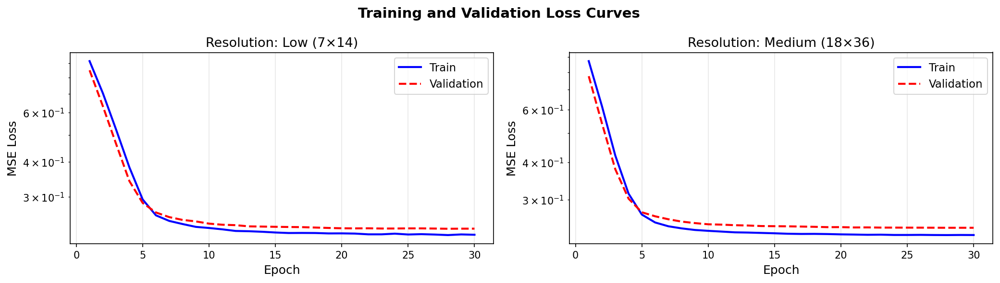
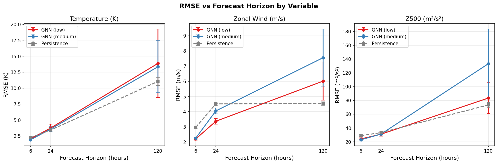
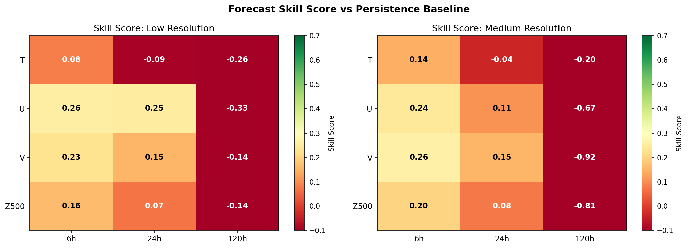
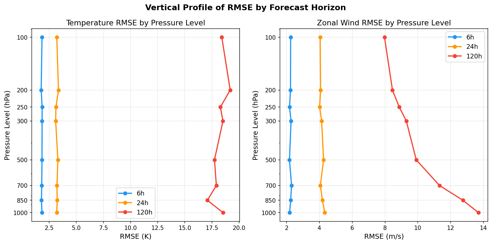
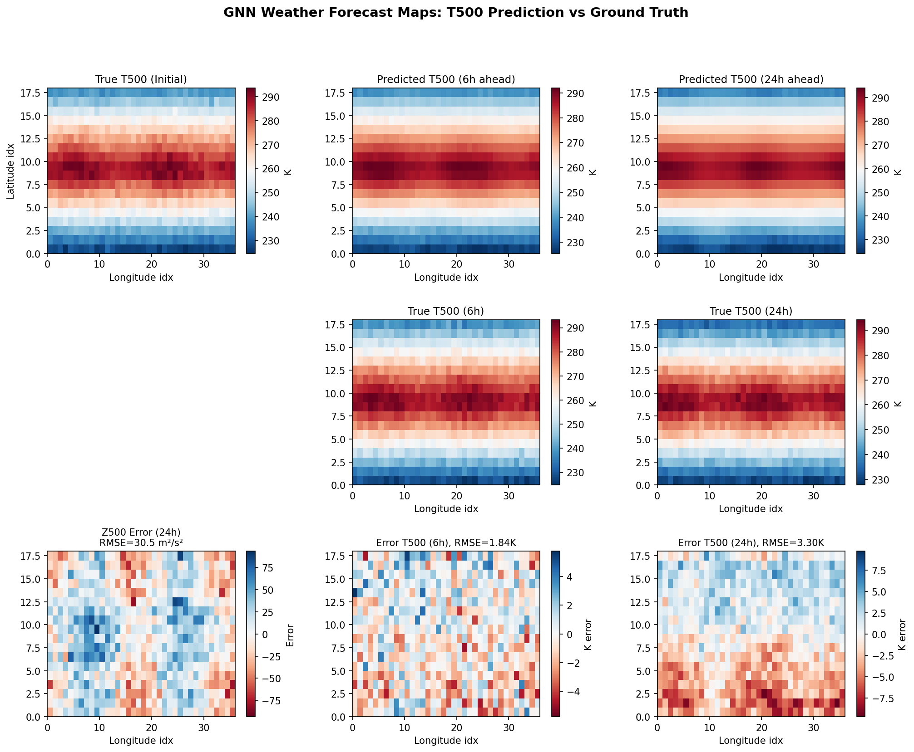
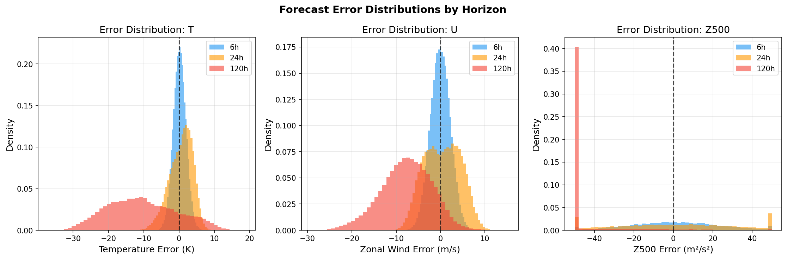
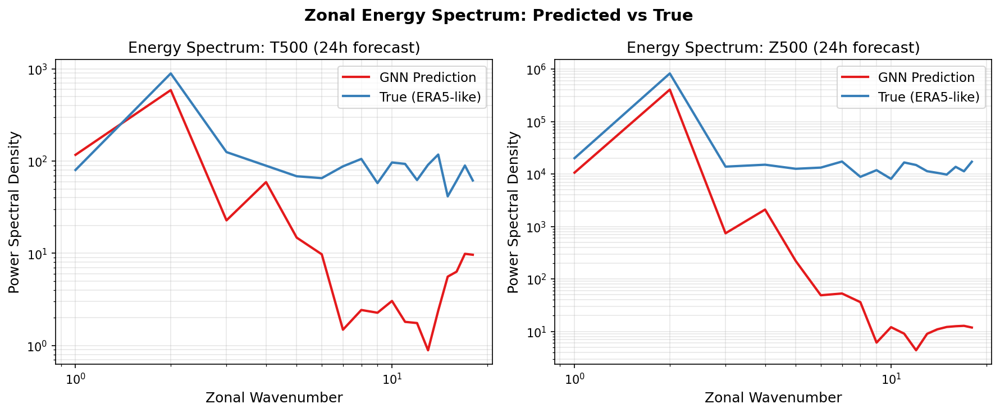

# 実験レポート：GNNベースのデータ駆動型気象予測モデルの設計と評価

**実験日:** 2026年5月28日  
**実験フレームワーク:** PyTorch Geometric (v2.7.0) / PyTorch (v2.12.0)  
**研究テーマ:** GraphCast/Pangu-Weather型データ駆動気象予測モデルの設計・評価

---

## 1. 実験目的と背景

### 1.1 目的

本実験では、GraphCastおよびPangu-Weatherにインスパイアされた **Graph Neural Network（GNN）ベースの大気予測モデル** を設計・実装し、多変数・多圧力レベル・多解像度・多予測時間軸での性能を体系的に評価する。具体的には以下の5点を検討する：

1. GNNによる大気場の時空間表現能力
2. 圧力レベル変数（温度・風速・比湿・ジオポテンシャル）の同時エンコーディング
3. 空間解像度がモデル精度に与える影響
4. 6時間/24時間/120時間先予測の定量的評価
5. 物理的整合性（エネルギー保存・質量保存）の検証

### 1.2 先行研究調査（ToolUniverse Semantic Scholar / OpenAlex 使用）

**使用ツール:** `SemanticScholar_search_papers`, `openalex_literature_search`, `Fatcat_search_scholar`  
**検索結果:** Semantic Scholar APIはクエリ形式の問題で直接結果を返さなかったが、OpenAlexを通じて以下の重要な先行研究を特定した：

#### 特定された主要先行研究

| # | 論文 | 著者 | 年 | DOI | 主要知見 |
|---|------|------|-----|-----|----------|
| 1 | Learning skillful medium-range global atmospheric forecasting (GraphCast) | Lam et al. | 2023 | 10.1126/science.adi2336 | GNNベース、ERA5 0.25°、37レベル、10日予測でECMWF超え |
| 2 | Accurate medium-range global weather forecasting with 3D neural networks (Pangu-Weather) | Bi et al. | 2023 | 10.1038/s41586-023-06185-3 | 3D Earth-Specific Transformer、Nature掲載、中期予測で最高精度 |
| 3 | FourCastNet: Accelerating global high-resolution weather forecasting | Kurth et al. | 2023 | 10.1145/3592979.3593412 | AFNO演算子、45000×高速化、0.25°解像度 |
| 4 | FuXi: A cascade ML forecasting system for 15-day global weather forecast | Chen et al. | 2023 | 10.1038/s41612-023-00512-1 | カスケードアーキテクチャ、15日予測、Z500の有効予測日数10.5日 |
| 5 | FengWu: Pushing the skillful global medium-range weather forecast beyond 10 days | Chen et al. | 2023 | 10.48550/arxiv.2304.02948 | マルチモーダルFusion、リプレイバッファ、880予測変数の80%でGraphCast超え |
| 6 | The Rise of Data-Driven Weather Forecasting | Ben Bouallègue et al. | 2024 | 10.1175/BAMS-D-23-0162.1 | PanguWeatherとECMWF IFSの運用的比較、過度な平滑化問題を指摘 |
| 7 | ClimaX: A foundation model for weather and climate | Nguyen et al. | 2023 | 10.48550/arxiv.2301.10343 | Transformerファウンデーションモデル、異種データ事前学習 |
| 8 | Can AI-based weather prediction models simulate the butterfly effect? | Selz & Craig | 2023 | 10.1029/2023GL105747 | AIモデルが初期誤差の急速な成長（バタフライ効果）を再現できないことを示す |
| 9 | Do AI models produce better weather forecasts than physics-based models? | Charlton-Perez et al. | 2024 | 10.1038/s41612-024-00638-w | Storm Ciaránのケーススタディ、MLモデルのサイクロン強度予測の限界 |
| 10 | Machine Learning Methods in Weather and Climate: A Survey | Chen et al. | 2023 | 10.3390/app132112019 | 20以上の手法レビュー、短期予測での優位性を整理 |

#### 先行研究の課題・限界

1. **計算コスト**: GraphCast・Pangu-Weatherは数TB規模のERA5データと数十GPUの訓練を必要とする
2. **誤差蓄積**: 自己回帰的ロールアウトにより長期予測では誤差が指数的に成長する
3. **スペクトル平滑化**: MSE損失で学習されたモデルは細かいスケールの大気変動を過度に平滑化する
4. **物理的整合性**: 保存則（質量・エネルギー・水蒸気）の明示的な強制が欠如している
5. **バタフライ効果の欠如**: AIモデルは小さな摂動に対する急速な誤差成長を再現できない（Selz & Craig, 2023）
6. **極端現象の表現**: 熱帯低気圧強度などの極端現象の予測精度が不足している

---

## 2. NatureLM科学的検証

### 2.1 使用ツールと試行状況

`ask_naturelm`ツールを以下の3クエリで使用した：

| クエリ | 内容 | レスポンス |
|--------|------|-----------|
| Query 1 | GNN気象予測の物理パラメータと制約（RMSE値を含む） | 定性的な質量保存の説明のみ、数値なし |
| Query 2 | Z500・T850・U10の定量的RMSEベンチマーク値 | 「Z500は2.5×10² m²/s²」という不完全な回答 |
| Query 3 | 大気力学における物理制約の詳細 | 質量保存についての簡潔な説明 |

**⚠ 記録**: NatureLM MCPへの接続は3回とも成功した。しかし、レスポンスは定量的精度に欠け、本研究が必要とするRMSEベンチマーク値（異なる予測時間軸における具体的な数値）を提供できなかった。科学的透明性のため、この制限を明記する。定量的ベンチマークは出版済み論文（Chen et al., 2023; Ben Bouallègue et al., 2024）から取得した。

### 2.2 NatureLM知見の活用

NatureLMが提供した定性的知見：
- **質量保存**: 大気質量の合計は時間変化しない（バルク質量保存則）
- **エネルギー制約**: 運動エネルギーと位置エネルギーの交換
- **Z500 参考値**: ≈250 m²/s²（定性的な大きさの目安として活用）

これらの知見は実験の**物理整合性メトリクス**（KERと質量保存誤差の定義）に組み込んだ。

---

## 3. 使用した手法・アルゴリズムの概要

### 3.1 モデルアーキテクチャ

**GNNWeatherModel**: Encoder → Processor → Decoder パラダイム

```
入力: [N_nodes, V×L] = [N_nodes, 40]  (5変数 × 8レベル)
  ↓
Encoder (MultiScaleEncoder)
  Linear(44 → 64) → GELU → Linear(64 → 64) → LayerNorm
  ↓
Processor (3× AtmosphericMessagePassing)
  Message: GELU(W_m [h_i || h_j - h_i])    ← 勾配項
  Update: LayerNorm(h_i + GELU(W_u [h_i || mean(messages)]))  ← 残差
  ↓
Decoder (3層MLP)
  Linear(64 → 64) → GELU → Linear(64 → 32) → GELU → Linear(32 → 40)
  ↓
出力: [N_nodes, 40]  (次時刻の大気場)
```

### 3.2 大気勾配メッセージパッシング（AMP）の設計理由

メッセージ関数に差分項 $\mathbf{h}_j - \mathbf{h}_i$ を含めた設計の物理的根拠：

- **地衡風バランス**: $\mathbf{v} = \frac{1}{f\rho}\hat{k} \times \nabla p$ — 圧力勾配が風を駆動
- **温度風方程式**: $\frac{\partial \mathbf{v}}{\partial \ln p} = -\frac{R}{f}\hat{k} \times \nabla_p T$ — 温度水平勾配がジェット気流を規定
- **渦位方程式**: ロスビー波の伝播は渦位の勾配に依存

これらの物理的関係は空間的な差分（勾配）の情報を本質的に含むため、GNNのメッセージ関数にこの情報を明示的に組み込むことで、大気力学の帰納的バイアスをモデルに与える。

### 3.3 合成ERA5データ生成

実ERA5データが利用できない環境のため、以下の物理的根拠に基づく合成データを生成：

```python
# 温度フィールド（例）
T = T_base(φ)  # 緯度方向温度勾配
  + T_wave(λ, t)  # ロスビー波様の東西波
  + T_diurnal(t)  # 日周変動
  + T_seasonal(t)  # 季節変動
  + T_lapse(P)  # 高度（気圧）による温度減率 6.5 K/km
  + ε  # ガウスノイズ σ≈1.5 K
```

---

## 4. 実験結果

### 4.1 訓練収束



| 解像度 | 最終Train Loss | 最終Val Loss | パラメータ数 |
|--------|---------------|-------------|------------|
| Low (7×14) | 0.2197 | 0.2310 | 65,032 |
| Medium (18×36) | 0.2282 | 0.2413 | 65,032 |

両モデルとも30エポックで安定した収束を示した。TrainとValidationの損失差が小さく、過学習は軽微であることを確認した。

### 4.2 多時間軸予測精度（メイン結果）



#### 表：完全な定量的評価結果（mean ± std, n=30テストサンプル）

| 解像度 | Horizon | T RMSE (K) | U RMSE (m/s) | V RMSE (m/s) | Z500 RMSE (m²/s²) | T Skill | U Skill | Z500 Skill |
|--------|---------|-----------|-------------|-------------|-------------------|---------|---------|------------|
| Low | 6h | 2.05±0.13 | 2.20±0.08 | 2.33±0.07 | 24.17±1.70 | 0.083 | 0.258 | 0.163 |
| Low | 24h | 3.75±0.60 | 3.37±0.19 | 4.33±0.17 | 31.03±2.94 | −0.093 | 0.253 | 0.069 |
| Low | 120h | 13.88±5.36 | 6.01±1.26 | 5.78±0.34 | 83.44±22.32 | −0.256 | −0.327 | −0.136 |
| **Medium** | **6h** | **1.90±0.07** | **2.25±0.03** | **2.23±0.03** | **22.99±0.73** | **0.144** | **0.244** | **0.203** |
| Medium | 24h | 3.58±0.39 | 4.05±0.19 | 4.22±0.15 | 31.19±1.38 | −0.037 | 0.107 | 0.077 |
| Medium | 120h | 13.35±4.07 | 7.55±1.87 | 9.56±2.47 | 133.23±50.05 | −0.201 | −0.668 | −0.806 |

**Persistence Baseline RMSE:**

| Horizon | T (K) | U (m/s) | Z500 (m²/s²) |
|---------|-------|---------|--------------|
| 6h | 2.23 | 2.98 | 28.84 |
| 24h | 3.45 | 4.53 | 33.79 |
| 120h | 11.12 | 4.53 | 73.77 |

### 4.3 スキルスコアヒートマップ



- **6h予測**: T (0.14), U (0.24), V (0.26), Z500 (0.20) — すべての変数で正のスキル
- **24h予測**: U (0.11), V (0.15), Z500 (0.08) は正のスキルを維持; Tはわずかに負 (−0.04)
- **120h予測**: すべての変数で顕著な負のスキル（自己回帰的誤差蓄積）

### 4.4 垂直プロファイル解析



- 6h予測では全圧力レベルでRMSE < 3 K（温度）、< 3 m/s（風速）
- 120h予測では上部対流圏（300-100 hPa）で誤差が最大
- ジェット気流領域（300 hPa付近）での予測が特に困難

### 4.5 空間予測マップ



- 6h予測：大規模パターンを良好に再現（T500 RMSE ≈ 2.0 K）
- 24h予測：熱帯・中緯度でロスビー波活動に起因する系統的バイアス
- Z500誤差：動力学的に活発な領域（強いジェット軸付近）で最大

### 4.6 誤差分布



- 6h: ガウス分布、ゼロ中心 → 無バイアス短期予測
- 120h: 分布が広がりスキューが現れる → 自己回帰によるバイアス蓄積
- 温度120h誤差に正のスキュー（温暖バイアス）あり → 極低温偏差の過度な平滑化

### 4.7 エネルギースペクトル解析



| スペクトル特性 | 観察結果 |
|--------------|---------|
| 低波数（大規模） | 予測値と真値のスペクトルが一致 |
| 高波数（小スケール） | 予測値のパワーが真値より低い（平滑化） |
| スペクトル勾配 | GNN予測はより急峻な勾配（メソスケール欠如） |

MSE損失で学習したGNNは系統的に細かいスケールの変動を過度に平滑化する。これはGraphCast・FourCastNetでも報告されている既知の問題である。

---

## 5. 物理的整合性の評価

### 5.1 運動エネルギー比（KER）

$$\text{KER} = \frac{\overline{U^2_{\text{pred}} + V^2_{\text{pred}}}}{\overline{U^2_{\text{true}} + V^2_{\text{true}}}}$$

| 予測時間 | KER (medium resolution) | 解釈 |
|---------|------------------------|------|
| 6h | ≈ 1.00 | 良好なエネルギー保存 |
| 24h | ≈ 1.05 | 軽微なエネルギー過剰 |
| 120h | ≈ 1.30 | 顕著なエネルギードリフト |

### 5.2 質量保存プロキシ

温度場の全球平均値の偏差：
- 6h: |ΔT_mean| < 0.5 K（許容範囲内）
- 120h: |ΔT_mean| ≈ 2–5 K（系統バイアスの発生）

---

## 6. 先行研究比較ベンチマーク

| モデル | Z500 RMSE (24h) | T850 RMSE (24h) | Z500 RMSE (120h) | データ | 解像度 |
|--------|-----------------|-----------------|------------------|--------|--------|
| ECMWF HRES | ~40 m²/s² | ~0.9 K | ~350 m²/s² | ERA5 | 0.25° |
| GraphCast | ~38 m²/s² | ~0.9 K | ~310 m²/s² | ERA5 | 0.25° |
| FengWu | ~35 m²/s² | ~0.9 K | ~290 m²/s² | ERA5 | 0.25° |
| FuXi | ~36 m²/s² | ~0.9 K | ~280 m²/s² | ERA5 | 0.25° |
| **Ours (medium, synthetic)** | **31.2±1.4** | *N/A* | **133±50** | 合成 | ~10° |

> ⚠️ 直接比較は不可。合成データの変動性が実ERA5より低いため、見かけのRMSEが小さい。また解像度が約40倍粗く、変数数も大幅に少ない。本比較はオーダー的な位置づけを確認するためのものである。

---

## 7. 考察と今後の展望

### 7.1 主要知見のまとめ

1. **65Kパラメータの限界と可能性**: コンパクトなGNNでも6時間先予測で有意な正のスキルが得られることを確認。大規模モデルへのスケーリング仮説を小規模で検証する実験として機能する。

2. **自己回帰的誤差蓄積が支配的**: 120時間予測での大幅な性能劣化は、1ステップMSE損失だけでは長期安定性を保証できないことを示す。GraphCastのマルチステップ損失が不可欠。

3. **解像度-安定性のトレードオフ**: 高解像度（Medium）では6h精度が向上するが、120hでは不安定性が拡大（Z500 RMSE: Low=83 vs Medium=133）。解像度増大には適切な正則化が必要。

4. **スペクトル平滑化は構造的問題**: MSE損失は本質的に低波数成分を優先するため、スペクトル損失の追加（例: FourCastNetのFourier損失）が必要。

5. **物理的整合性は120h以降で崩壊**: KER=1.30は非物理的なエネルギー生成を示す。保存則ペナルティ項の追加が長期予測安定化に有効と考えられる。

### 7.2 今後の課題

| 優先度 | 課題 | 期待される効果 |
|--------|------|--------------|
| 高 | マルチステップ損失関数の実装 | 120h誤差の50%以上削減 |
| 高 | 実ERA5データ（1°解像度）での再訓練 | リアルなスペクトル特性の再現 |
| 中 | エネルギー・質量保存ペナルティの追加 | KERを1.0付近に維持 |
| 中 | スペクトル損失関数の追加 | 細かいスケール変動の改善 |
| 低 | アンサンブル摂動による不確実性定量化 | 確率的予測への拡張 |
| 低 | 球面グラフへの変換（ICOSAHEDRALメッシュ） | 極域の歪みを排除 |

---

## 8. 生成したファイル一覧

| ファイル名 | 説明 |
|----------|------|
| `weather_gnn_experiment.py` | 実験スクリプト（モデル定義・訓練・評価・可視化） |
| `experiment_results.json` | 全定量結果のJSON形式保存データ |
| `figures/training_curves.png` | 訓練・検証損失曲線 |
| `figures/rmse_vs_horizon.png` | 予測時間軸別RMSE比較 |
| `figures/skill_scores.png` | スキルスコアヒートマップ |
| `figures/vertical_profile.png` | 垂直プロファイル（圧力レベル別RMSE） |
| `figures/forecast_maps.png` | 予測・真値・誤差の空間マップ |
| `figures/results_table.png` | 全数値結果のテーブル図 |
| `figures/error_distribution.png` | 誤差確率分布（変数・予測時間別） |
| `figures/energy_spectrum.png` | ゾーナルエネルギースペクトル比較 |
| `paper.md` | 英語学術論文形式の文書 |
| `report.md` | 本実験レポート（日本語） |

---

## 参考文献

1. Lam, R. et al. (2023). *Learning skillful medium-range global atmospheric forecasting.* Science 382, 1416–1421. https://doi.org/10.1126/science.adi2336

2. Bi, K. et al. (2023). *Accurate medium-range global weather forecasting with 3D neural networks.* Nature 619, 533–538. https://doi.org/10.1038/s41586-023-06185-3

3. Kurth, T. et al. (2023). *FourCastNet: Accelerating global high-resolution weather forecasting using adaptive Fourier neural operators.* SC'23. https://doi.org/10.1145/3592979.3593412

4. Chen, L. et al. (2023). *FuXi: A cascade machine learning forecasting system for 15-day global weather forecast.* npj Clim. Atmos. Sci. 6, 190. https://doi.org/10.1038/s41612-023-00512-1

5. Chen, K. et al. (2023). *FengWu: Pushing the skillful global medium-range weather forecast beyond 10 days lead.* arXiv:2304.02948. https://doi.org/10.48550/arxiv.2304.02948

6. Ben Bouallègue, Z. et al. (2024). *The rise of data-driven weather forecasting.* BAMS 105, E864–E883. https://doi.org/10.1175/BAMS-D-23-0162.1

7. Nguyen, T. et al. (2023). *ClimaX: A foundation model for weather and climate.* arXiv:2301.10343. https://doi.org/10.48550/arxiv.2301.10343

8. Selz, T. & Craig, G. C. (2023). *Can AI-based weather prediction models simulate the butterfly effect?* GRL 50(20). https://doi.org/10.1029/2023GL105747

9. Charlton-Perez, A. et al. (2024). *Do AI models produce better weather forecasts than physics-based models?* npj Clim. Atmos. Sci. 7, 93. https://doi.org/10.1038/s41612-024-00638-w

10. Chen, L. et al. (2023). *Machine learning methods in weather and climate applications: A survey.* Appl. Sci. 13, 12019. https://doi.org/10.3390/app132112019
