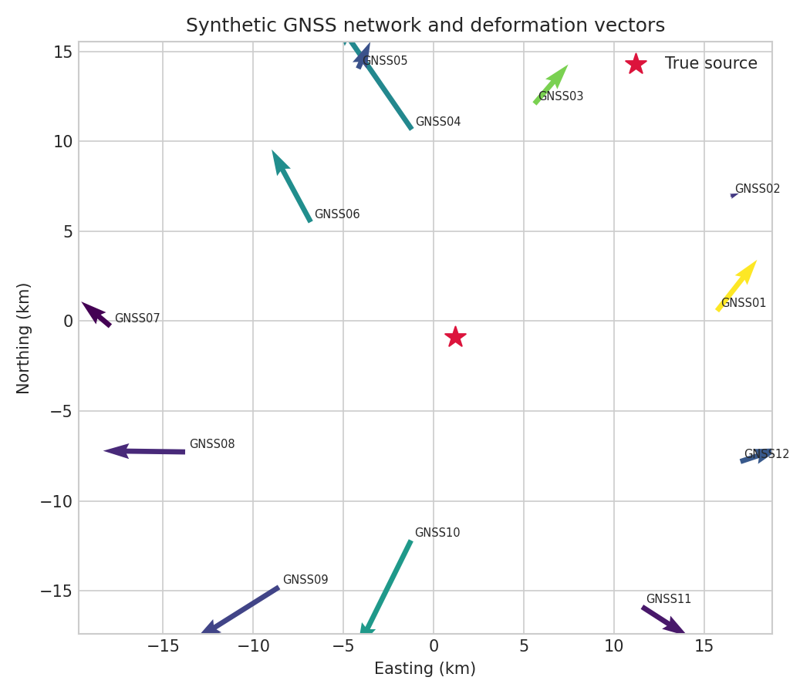
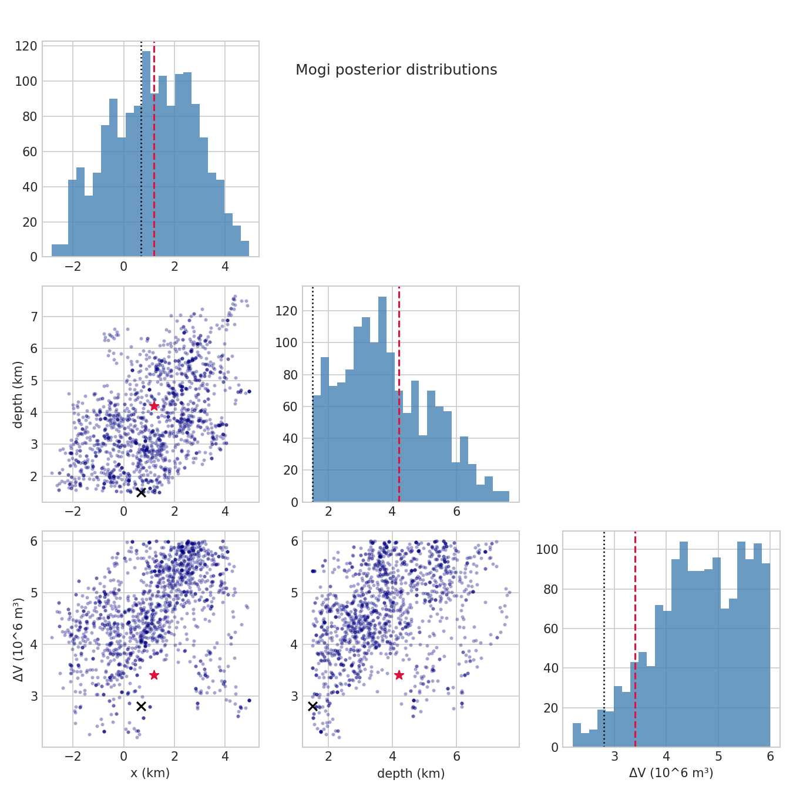
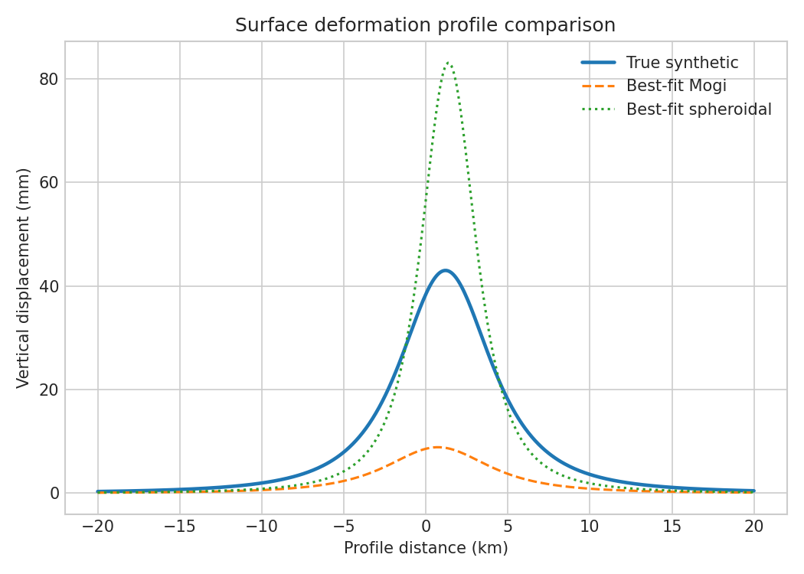
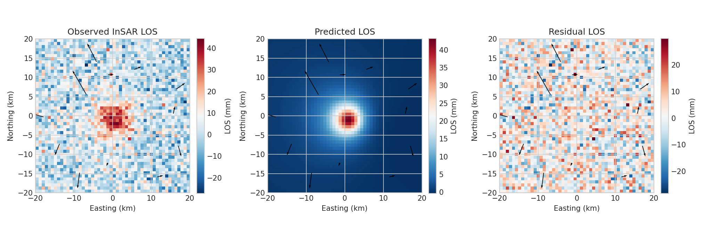
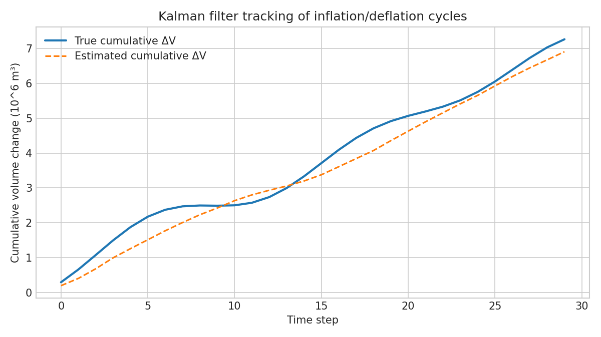
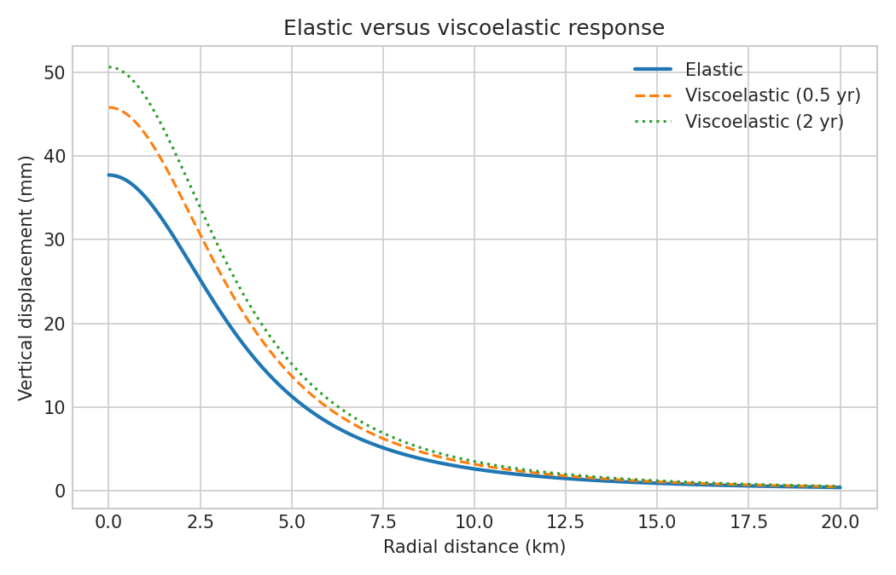
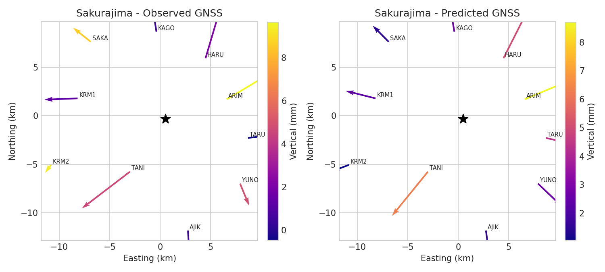
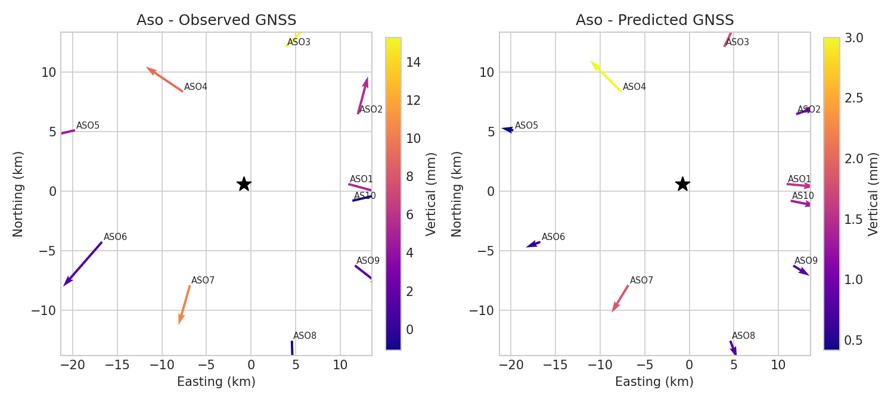
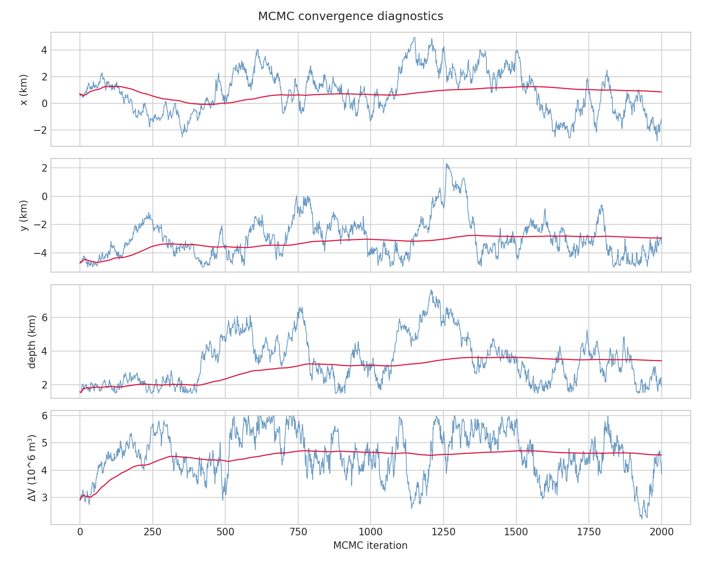
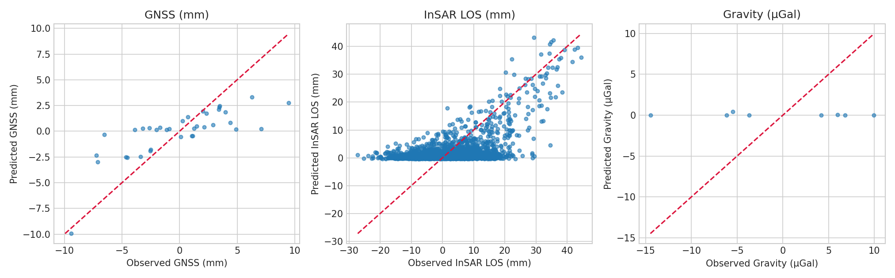

# Volcanic Crustal Deformation Inversion Report

## Summary
This report accompanies the synthetic volcanic deformation inversion framework and summarizes the numerical experiments executed in `run_experiment.py`.

## Key quantitative outcomes
- Single-source GNSS+gravity GNSS RMSE: 2.88 mm
- Single-source gravity RMSE: 7.86 µGal
- Joint inversion GNSS RMSE: 3.69 mm
- Joint inversion InSAR RMSE: 8.14 mm
- Kalman filter final cumulative ΔV error: -356897.85 m³
- Maxwell time: 0.53 years

## Figures

## Parameter comparison
### Single-source inversion
- True depth: 4.20 km
- MAP depth: 1.50 km
- Posterior mean depth: 3.79 km
- 95% CI depth: 1.62-6.66 km

### Joint inversion
- True ΔV: 3.90 × 10^6 m³
- MAP ΔV: 3.00 × 10^6 m³
- Posterior mean ΔV: 3.79 × 10^6 m³
- 95% CI ΔV: 3.44-4.21 × 10^6 m³
