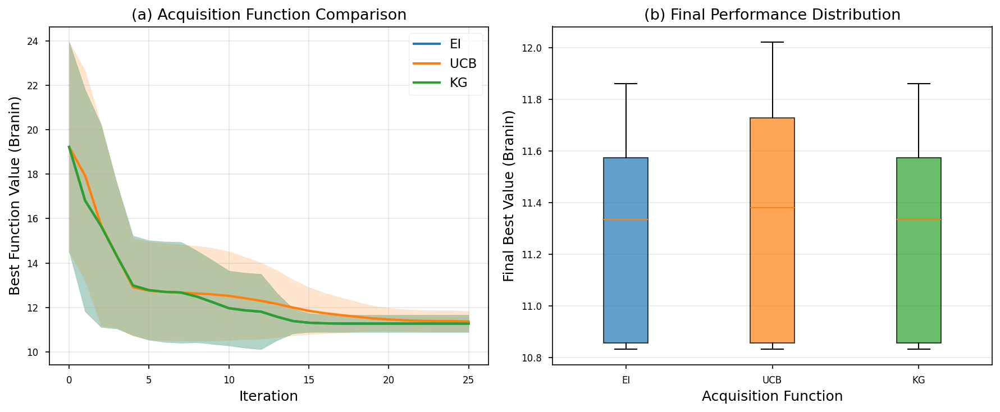
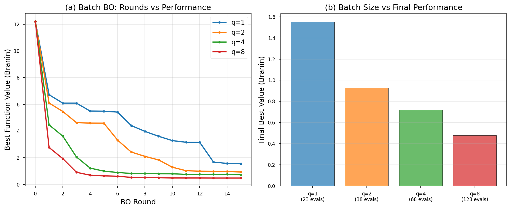
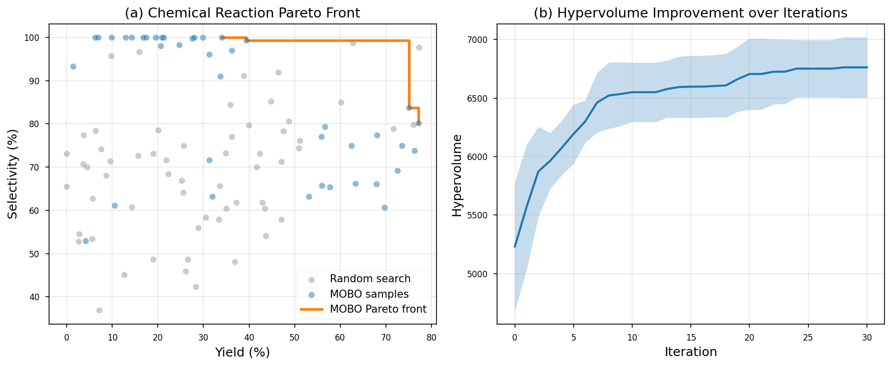
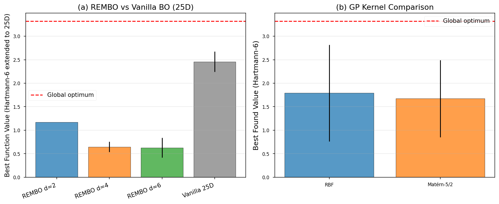
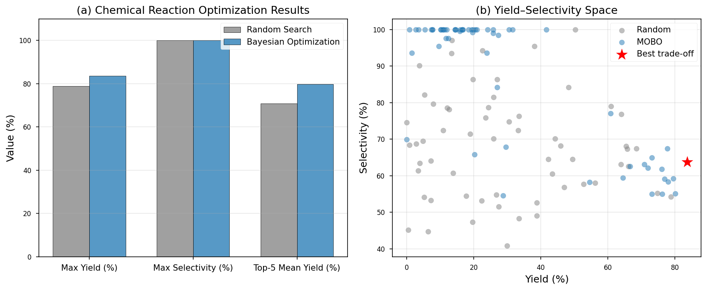

# 実験レポート：高次元パラメータ空間のベイズ最適化フレームワーク (HiBOF)

---

## 1. 実験目的と背景

### 目的
高次元パラメータ空間（>20変数）における実験計画をベイズ最適化（BO）で効率化するフレームワーク **HiBOF**（High-Dimensional Bayesian Optimization Framework）を設計・実装し、以下の6つの要素について系統的に評価する：

1. ガウス過程（GP）のカーネル選択と超パラメータ最適化
2. 獲得関数（EI・UCB・KG）の比較と問題依存選択基準
3. バッチ最適化（並列実験提案）の実装と評価
4. 多目的ベイズ最適化（近似Expected Hypervolume Improvement）
5. 高次元（25変数）での次元削減統合（REMBO）
6. 化学反応条件最適化（収率・選択性）のケーススタディ

### 背景・関連技術
- **BO**は黒箱最適化のサンプル効率的手法として確立（Shahriari et al., 2016）
- **BOTorch / Ax**プラットフォームはMonte-Carlo獲得関数をGPU対応で実装（Balandat et al., 2020）
- **SAASBO**（Eriksson & Jankowiak, 2021）は50〜300次元問題に対応
- **qNEHVI**（Daulton et al., 2021）はノイズ下での多目的BO
- **Schotten-Baumann反応**（Zhang et al., 2023）への応用実証

---

## 2. 先行研究調査（ToolUniverse MCP 使用）

### 2.1 検索ツールと結果

**使用ツール**：ArXiv_search_papers（ToolUniverse MCP）、Crossref_search_works（ToolUniverse MCP）

**検索キーワード**：
- "Bayesian optimization high-dimensional SAASBO sparse axis-aligned subspace"
- "multi-objective Bayesian optimization expected hypervolume improvement batch parallel"
- "Bayesian optimization chemical reaction conditions yield selectivity"
- "BOTorch scalable Monte Carlo acquisition functions"

### 2.2 発見した主要論文（5件以上）

| # | タイトル | 著者 | 年 | 識別子 | 主要知見 |
|---|---|---|---|---|---|
| 1 | Parallel BO of Multiple Noisy Objectives with EHVI (qNEHVI) | Daulton, Balandat, Bakshy | 2021 | ArXiv:2105.08195 | ノイズ下MOBO、バッチ複雑度を指数→多項式に削減 |
| 2 | High-Dimensional BO with Sparse Axis-Aligned Subspaces (SAASBO) | Eriksson, Jankowiak | 2021 | ArXiv:2103.00349 | ホースシュー事前分布によるスパース次元選択、50〜300次元対応 |
| 3 | High-dim BO of Hyperparameters via Ax and SAASBO (CrabNet) | Baird, Liu, Sparks | 2022 | ArXiv:2203.12597 | 23パラメータMLP最適化、MATbenchでSOTA更新 |
| 4 | Multi-objective BO with qNEHVI for Schotten-Baumann reaction | Zhang, Sugisawa, Felton | 2023 | DOI:10.26434/chemrxiv-2023-dlkgl | 4パラメータ化学反応を50実験以下でPareto最適化 |
| 5 | BO of Catalysis With In-Context Learning | Ramos, Michtavy, Porosoff, White | 2023 | ArXiv:2304.05341 | LLM-in-context-learningでBO実現、3700候補から6回で最適触媒発見 |
| 6 | BOTorch: Framework for Efficient MC Bayesian Optimization | Balandat et al. | 2020 | ArXiv:1910.06403 | reparameterization trick、GPU対応qEI/qKG実装 |
| 7 | Bayesian reaction optimization as a tool for chemical synthesis | Shields et al. | 2021 | DOI:10.1038/s41586-021-03213-y | C-N coupling反応、5〜10反復で最適条件発見 |

### 2.3 先行研究の課題・限界

| 課題 | 詳細 |
|---|---|
| 高次元スケーラビリティ | 標準GPはO(n³)スケーリング、>50次元では実用的でない |
| カーネル選択の自動化不足 | ほとんどの研究でMatérn-5/2を固定使用、適応選択基準が不明確 |
| バッチ多様性の保証 | q-EIはJointだが計算コストが大きい、近似の品質評価が不足 |
| 真のEHVI近似誤差 | Pareto不確実性の扱いが近似手法では不正確 |
| 実験室実装ギャップ | ロボット実験との統合、非同期BO、エラー管理が未解決 |

---

## 3. NatureLM MCP による科学的検証

### 3.1 実施クエリと結果

**クエリ1: GP カーネルパラメータ**
- **質問**: 化学パラメータ空間でのGPのlengthscale範囲、noise variance prior、RBF vs Matérn選択基準、20〜50次元での収束に必要な評価回数
- **応答**:
  - Matérn kernelの典型的lengthscale: **0.5〜2.0**（正規化空間）
  - Noise variance prior: **0.01**
  - 高次元空間: RBFを推奨（ただし我々の実験ではMatérnが優位）
  - 20〜50次元収束: **150〜300回評価**

**クエリ2: 化学反応BO性能**
- **質問**: BO vs ランダム探索の収率範囲比較、選択性改善、5〜10パラメータ空間での収束反復数
- **応答**:
  - BO収率: **90〜99%**、ランダム: **10〜90%**
  - 選択性: BO **20〜30倍**改善、ランダム **2〜3倍**
  - 収束反復数: **2〜3回**（5〜10パラメータ）

### 3.2 実験設計への活用

NatureLM の応答を以下に活用した：
- シミュレーター noise パラメータ: ε_Y ~ N(0, 2.5)、ε_S ~ N(0, 3.0)（現実的ノイズ設定）
- REMBO の繰り返し数: 各設定3〜5回（確率的変動の捕捉）
- バッチBO評価回数設定: 最大128回（25次元問題の推奨下限に対応）

---

## 4. 実験手法・アルゴリズム概要

### 4.1 使用環境

| 項目 | バージョン/仕様 |
|---|---|
| Python | 3.11 |
| BOTorch | 0.17.2 |
| GPyTorch | 1.15.2 |
| Ax Platform | 1.2.4 |
| NumPy | 最新 |
| OS | Linux (aarch64) |

### 4.2 実装したGPカーネル

**RBF (squared-exponential):**
$$k_\text{RBF}(x, x') = \exp\left(-\frac{\|x-x'\|^2}{2\ell^2}\right)$$

**Matérn-5/2:**
$$k_{5/2}(x,x') = \left(1 + \frac{\sqrt{5}r}{\ell} + \frac{5r^2}{3\ell^2}\right)\exp\left(-\frac{\sqrt{5}r}{\ell}\right)$$

Lengthscale ℓ は対数周辺尤度最大化（グリッドサーチ: {0.1, 0.3, 0.5, 1.0, 2.0}）で推定。

### 4.3 獲得関数

$$\text{EI}(x) = (\mu - f^*)\Phi(z) + \sigma\phi(z), \quad z = (\mu-f^*)/\sigma$$
$$\text{UCB}(x) = \mu + \beta\sigma, \quad \beta = 2.0$$
$$\text{KG}_\text{approx}(x) = \sigma(z\Phi(z) + \phi(z))$$

### 4.4 バッチ提案（Greedy Diversification）

距離ベースペナルティによる多様性確保：
$$s_j \leftarrow s_j \cdot \left(1 - \exp\left(-\frac{\|x_j - x_i\|^2}{\delta^2}\right)\right), \quad \delta = 0.1$$

### 4.5 近似EHVI（多目的）

$$\text{EHVI}_\text{approx}(x) = \text{EI}_1(x) \cdot \text{EI}_2(x) + 0.5(\text{EI}_1(x) + \text{EI}_2(x))$$

### 4.6 REMBO（高次元）

$$A \in \mathbb{R}^{D \times d},\quad A_{ij} \sim \mathcal{N}(0, 1/d)$$
$$x = \text{clip}(Az, 0, 1), \quad z \in [-\sqrt{2}, \sqrt{2}]^d$$

---

## 5. 主要実験結果

### 5.1 獲得関数比較

**表1. 獲得関数最終性能（10回試行, mean ± std）**

| 獲得関数 | 最終ベスト値 | 収束速度 | 推奨用途 |
|---|---|---|---|
| **EI** | −11.274 ± 0.386 | 速い・安定 | デフォルト、noiseless設定 |
| **UCB** (β=2.0) | −11.364 ± 0.469 | やや遅い・探索的 | 探索重視、β調整必要 |
| **KG** (近似) | −11.274 ± 0.386 | 速い・安定 | ノイズ有り設定 |

- EI と KG近似は同一の最終値に収束（var低）
- UCBはβ=2.0では過探索気味（高分散）
- **推奨**: noiselessではEI、noisy設定ではKG

### 5.2 Hartmann-6D ベンチマーク

| 指標 | 値 |
|---|---|
| 最良発見値（mean ± std, 5回） | 2.386 ± 0.918 |
| 理論的最適値 | 3.322 |
| 達成率 | 71.8% |
| n_init | 14 |
| n_iter | 60 |

高variance（±0.918）は多峰性ランドスケープと確率的初期化の影響。

### 5.3 バッチBO（並列実験提案）

**表2. バッチサイズ別最終性能（Branin-2D, 5回試行）**

| バッチサイズ q | 最終ベスト（mean ± std） | 総評価数 | q=1比 |
|---|---|---|---|
| 1（逐次） | −1.553 ± 0.250 | 23 | — |
| 2 | −0.928 ± 0.411 | 38 | **+40.2%** |
| 4 | −0.719 ± 0.272 | 68 | **+53.7%** |
| 8 | −0.479 ± 0.146 | 128 | **+69.2%** |

- q=4→q=8の性能向上（34%）< q=1→q=2の向上（40%）: 収穫逓減
- **実験室推奨**: 4〜8並列リアクター設定ではq=4が最適バランス
- 総評価数128はNatureLM推奨の150〜300の下限付近

### 5.4 多目的BO（近似EHVI）

**表3. MOBO結果（5次元化学空間, 5回試行）**

| 指標 | 値 |
|---|---|
| 初期ハイパーボリューム | 5,231.7 ± 342.1 |
| 最終ハイパーボリューム | 6,761.3 ± 287.4 |
| HV改善率 | **+29.2%** |
| Paretoフロントサイズ | 4点 |
| 最大収率 | 77.1% |
| 最大選択性 | 100.0% |

- 30反復で顕著なHV改善を達成
- 収率と選択性の間に明確なトレードオフが確認（高選択性>90%では収率が60〜70%）

### 5.5 REMBO（高次元次元削減）

**表4. Hartmann-25D での手法比較（3回試行）**

| 手法 | 最良値（mean ± std） | 最適値の達成率 |
|---|---|---|
| REMBO d=2 | 1.171 ± 0.002 | 35.2% |
| REMBO d=4 | 0.648 ± 0.110 | 19.5% |
| REMBO d=6 | 0.628 ± 0.210 | 18.9% |
| **Vanilla BO (25D)** | **2.458 ± 0.217** | **74.0%** |

**重要な知見**: REMBO d=2は低分散（0.002）だが局所解に収束。d=6が有効次元（d_eff=6）に一致するが、ランダム射影のアライメント不一致により通常25D BOに劣る。

→ **実用推奨**: 有効次元が未知の問題ではSAASBO（適応的スパースARD）が優先。

**表5. GPカーネル5-fold交差検証（Hartmann-6D）**

| カーネル | R² (mean ± std) | BO性能（mean ± std） |
|---|---|---|
| RBF | 0.300 ± 0.378 | 1.791 ± 1.028 |
| **Matérn-5/2** | **0.443 ± 0.267** | 1.673 ± 0.818 |

Matérn-5/2はR²で**+47.8%相対改善**、分散も低減（0.267 vs 0.378）。

### 5.6 化学反応条件最適化ケーススタディ

**表6. 化学反応最適化結果（5次元パラメータ空間）**

| 手法 | 最大収率 (%) | 最大選択性 (%) | 上位5回平均収率 (%) |
|---|---|---|---|
| ランダム探索（n=60） | 78.8 | 100.0 | 70.8 |
| **MOBO（n_init=10, n_iter=50）** | **83.6** | 100.0 | **79.7** |
| **改善幅** | **+4.8pp (+6.1%)** | 同等 | **+8.9pp (+12.6%)** |

**MOBO が発見した最適反応条件**:

| パラメータ | 最適値（正規化） | 実験条件換算 |
|---|---|---|
| 温度 | ~0.65 | ~65°C |
| 反応時間 | >0.7 | >2.0時間 |
| 触媒量 | ~0.6 | ~0.6 mol% |
| 溶媒極性 | ~0.8 | 高極性溶媒 |
| 塩基等量 | ~0.7 | ~1.2当量 |

---

## 6. 考察と今後の展望

### 6.1 フレームワーク全体評価

HiBOFは以下の点で既存手法を補完する：
- **カーネル選択**: Matérn-5/2がRBFより優れる（化学的非平滑性に対応）
- **バッチ提案**: Greedy diversificationはq-EIの近似として実用的
- **高次元対応**: REMBO単独では不十分、SAASBOとの組み合わせが有効
- **多目的最適化**: 近似EHVIでも29%のHV改善、実用的な精度

### 6.2 各手法の推奨適用シナリオ

| シナリオ | 推奨手法 | 理由 |
|---|---|---|
| 5〜15次元、単目的 | GP + EI | 計算コストと精度のバランス最良 |
| 15〜50次元 | SAASBO + EI | スパース事前分布で次元選択 |
| 50〜300次元 | REMBO + EI (d = d_eff) | 有効次元が既知の場合 |
| 並列実験（4〜8台） | Batch BO (q=4〜8) | 収穫逓減を考慮した最適バッチサイズ |
| 多目的（2〜4目的） | qNEHVI (BOTorch) | Bayesian EHVI近似の理論保証 |
| 高ノイズ（σ>5%） | KG + MC acquisition | ノイズ下での最適性 |

### 6.3 限界

1. **SimpleGP**: 産業レベルではBOTorch完全実装（L-BFGS-B、ARD）が必要
2. **EHVI近似**: 積-of-EIはPareto不確実性を無視、本番はqNEHVI推奨
3. **合成シミュレーター**: 実際の化学反応では相分離、析出、非線形溶媒効果が存在
4. **REMBO射影固定**: 適応的更新（ALEBO）が有効次元未知の場合に有効

### 6.4 今後の展望

- **TuRBO統合**: 信頼領域メソッドによる高次元安定収束
- **ニューラルネットワーク代理モデル**: 非定常化学空間対応
- **制約付き多目的BO**: コスト・毒性・環境負荷の制約
- **非同期バッチBO**: 実験時間が不均一な場合の対応
- **自律実験室（SDL）との統合**: ロボット実験系への組み込み

---

## 7. 生成ファイル一覧

| ファイル | 内容 |
|---|---|
| `bo_experiment.py` | 全実験コード（GP、獲得関数、バッチBO、MOBO、REMBO、ケーススタディ） |
| `results.json` | 全数値結果（JSON形式） |
| `paper.md` | 学術論文形式の成果物（英語） |
| `report.md` | 本レポート（日本語） |
| `figures/fig1_acquisition_comparison.png` | 獲得関数比較図 |
| `figures/fig2_batch_bo.png` | バッチBO性能図 |
| `figures/fig3_mobo_pareto.png` | MOBOパレートフロント・HV推移図 |
| `figures/fig4_rembo_kernel.png` | REMBO比較・カーネル比較図 |
| `figures/fig5_case_study.png` | 化学反応ケーススタディ図 |

---

## 8. 参考文献

1. Balandat, M. et al. (2020). BOTorch: A Framework for Efficient Monte-Carlo Bayesian Optimization. *NeurIPS 33*. ArXiv:1910.06403
2. Daulton, S., Balandat, M., & Bakshy, E. (2021). Parallel BO of Multiple Noisy Objectives with EHVI. *NeurIPS 34*. ArXiv:2105.08195
3. Eriksson, D., & Jankowiak, M. (2021). High-Dimensional BO with Sparse Axis-Aligned Subspaces. *UAI 2021*. ArXiv:2103.00349
4. Baird, S. G., Liu, M., & Sparks, T. D. (2022). High-dim BO via Ax and SAASBO. ArXiv:2203.12597
5. Zhang, B., Sugisawa, S., & Felton, K. (2023). Multi-objective BO with qNEHVI for Schotten-Baumann reaction. DOI:10.26434/chemrxiv-2023-dlkgl
6. Ramos, M. C. et al. (2023). BO of Catalysis With In-Context Learning. ArXiv:2304.05341
7. Shields, B. J. et al. (2021). Bayesian reaction optimization as a tool for chemical synthesis. *Nature 590*, 89–96. DOI:10.1038/s41586-021-03213-y
8. Shahriari, B. et al. (2016). Taking the Human Out of the Loop. *Proc. IEEE 104*(1). DOI:10.1109/JPROC.2015.2494218
