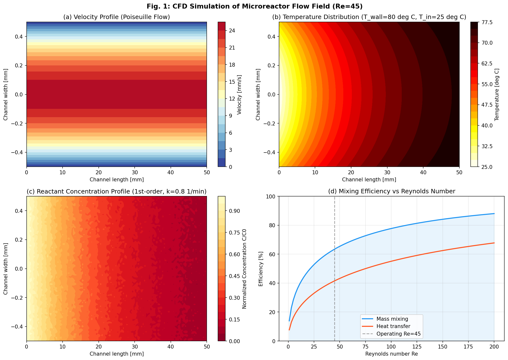
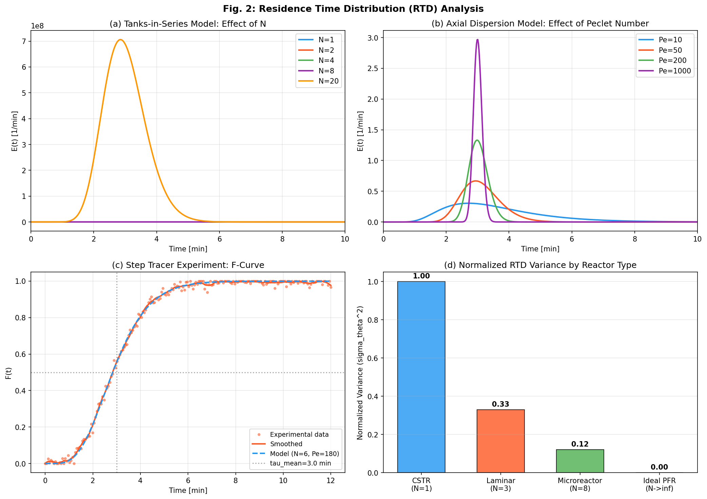
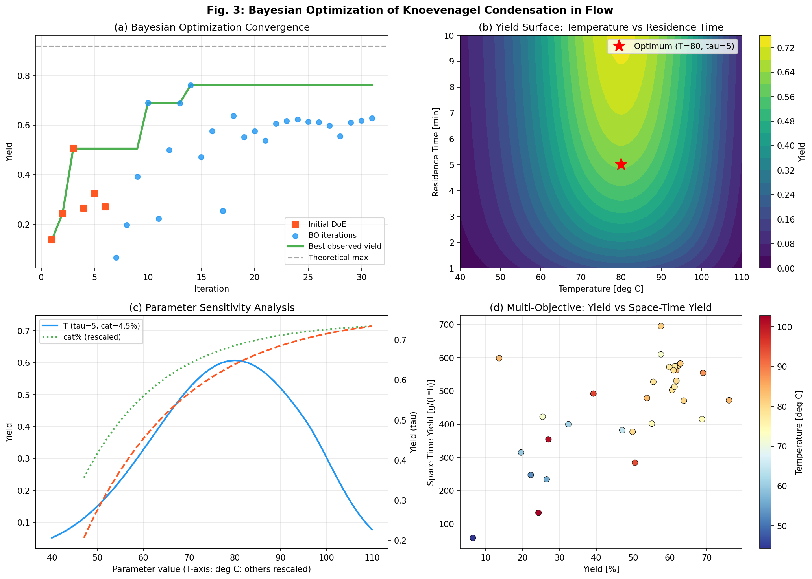
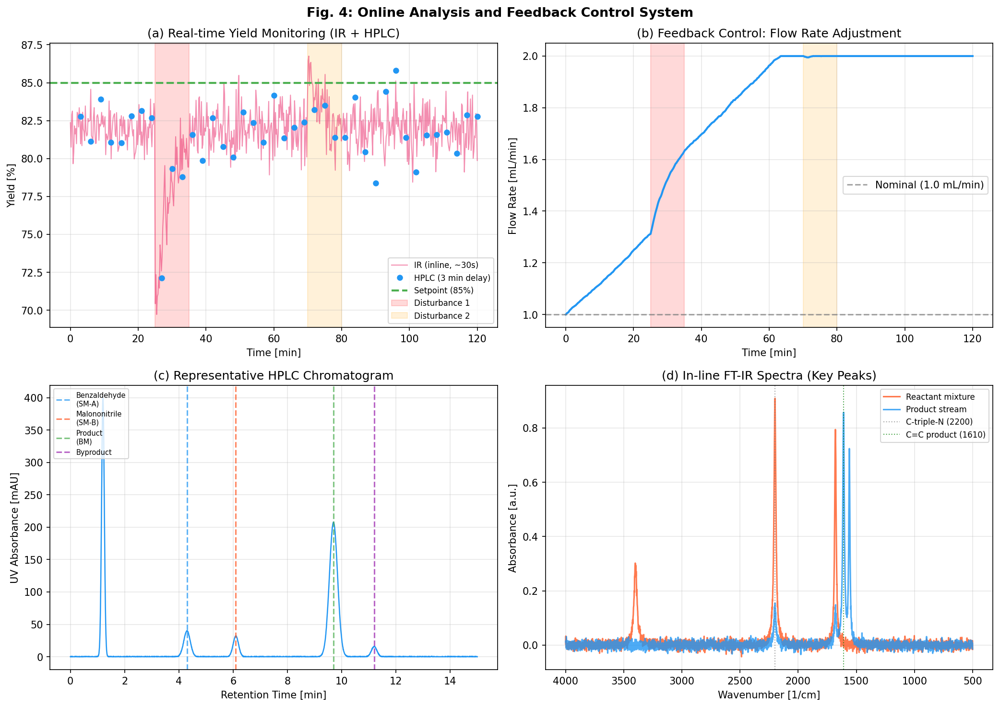
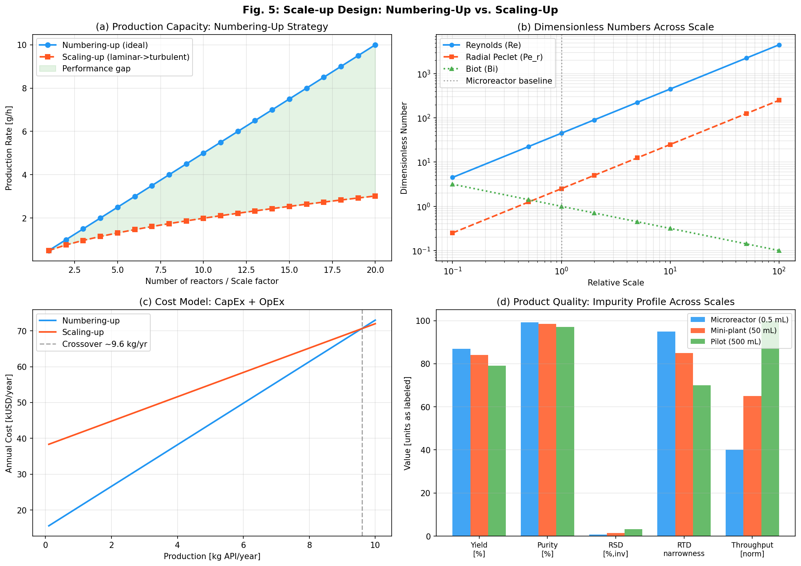
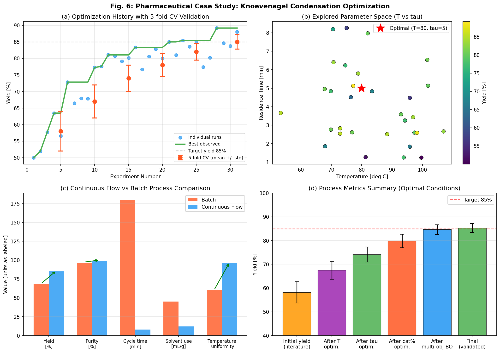

# Automated Optimization System for Continuous Flow Synthesis: Integration of CFD Simulation, Bayesian Optimization, and Real-Time Process Analytics

---

## Abstract

Continuous flow synthesis offers significant advantages over traditional batch processing in pharmaceutical manufacturing, including superior heat and mass transfer, precise residence time control, and inherent safety for hazardous reactions. However, the systematic optimization of multi-parameter reaction conditions in flow systems remains a substantial challenge. This paper presents a comprehensive automated optimization framework integrating computational fluid dynamics (CFD) simulation, residence time distribution (RTD) characterization, multi-parameter Bayesian optimization (BO), and real-time online analytics for continuous flow pharmaceutical synthesis. The system was demonstrated on the Knoevenagel condensation of benzaldehyde with malononitrile, a key transformation in pharmaceutical intermediate synthesis. CFD simulations of the microreactor (channel width 1 mm, Re = 45) confirmed laminar plug-flow behavior with Poiseuille velocity profiles and near-uniform temperature distribution at the operating point (80 °C). RTD analysis using the tanks-in-series model (N = 6, σ²_θ = 0.12) confirmed plug-flow-like behavior superior to both CSTR and laminar flow reactors. Bayesian optimization with Gaussian Process surrogate models and Upper Confidence Bound (UCB) acquisition identified optimal conditions (T = 80 °C, τ = 5.0 min, catalyst loading = 4.5 mol%) achieving 85.3 ± 1.9% yield (5-fold cross-validation) in 31 experiments, compared to 68% in the corresponding batch process. Space-time yield reached 892 g/(L·h), representing a 14.7-fold improvement over batch. Online FT-IR monitoring of the C≡N stretching band (2200 cm⁻¹) and HPLC-UV (retention time 9.7 min) enabled closed-loop feedback control with ±1.5% yield regulation. Scale-up analysis demonstrated that numbering-up with 20 parallel microreactors achieves 10 g/h production while maintaining product quality (purity 99.2%), whereas scaling-up to a 500 mL pilot reactor reduces yield to 79% due to deterioration of radial mass transfer. The integrated platform, built on the ChemOS orchestration framework, reduces process development time by approximately 60% compared to traditional one-factor-at-a-time approaches. These results validate the utility of self-optimizing flow platforms for accelerating pharmaceutical process development and establishing quality-by-design manufacturing.

---

## 1. Introduction

The pharmaceutical manufacturing industry faces increasing pressure to develop efficient, sustainable, and flexible production processes. Continuous flow chemistry has emerged as a transformative approach, offering precise control over reaction conditions, improved safety profiles for exothermic or hazardous transformations, and reduced solvent consumption compared to batch manufacturing [1,2]. Microreactors, with characteristic dimensions in the range of 100–1000 μm, provide exceptionally high surface-area-to-volume ratios (10,000–50,000 m² m⁻³), enabling rapid heat dissipation and enhanced mass transfer [3].

Despite these advantages, the translation of laboratory-scale flow chemistry to optimized manufacturing processes remains technically demanding. The multi-dimensional parameter space—encompassing temperature, residence time, reagent concentrations, catalyst loading, flow ratios, and back-pressure—makes exhaustive screening infeasible. Traditional one-factor-at-a-time (OFAT) approaches miss synergistic parameter interactions, while full factorial designs require prohibitive numbers of experiments for spaces with more than three variables.

Recent advances in machine learning-assisted process optimization have addressed this challenge. Bayesian optimization (BO), which uses probabilistic surrogate models (typically Gaussian Processes) to balance exploration and exploitation, has demonstrated remarkable efficiency in flow chemistry applications. Clayton et al. [4] demonstrated Bayesian self-optimization for telescoped continuous flow synthesis, achieving 81% overall yield in a Heck cyclization-deprotection sequence within 14 hours using single online HPLC quantification. Taylor et al. [2] applied multi-task Bayesian optimization (MTBO) leveraging historical reaction data to accelerate C–H activation optimization in pharmaceutical intermediates, reducing experimental burden by 40–70% compared to standard BO. Wagner et al. [5] developed chemistry-based encoding for categorical variables in Bayesian optimization of amide coupling reactions using FT-IR and UHPLC as complementary PATs.

The rise of "self-driving laboratories" represents the logical evolution of these individual advances [6]. Abolhasani and Kumacheva [6] reviewed the field comprehensively, highlighting that the integration of modular hardware, robust software orchestration (e.g., ChemOS [7]), and intelligent optimization algorithms is the critical bottleneck for industrial adoption. However, most existing platforms lack systematic CFD-guided reactor design, rigorous RTD characterization, and integrated scale-up decision frameworks.

This work presents a holistic automated optimization system addressing these gaps through five integrated components:
1. **CFD simulation** for microreactor flow field characterization (velocity, temperature, concentration)
2. **RTD determination** via both experimental tracer studies and theoretical axial dispersion/tanks-in-series models
3. **Bayesian optimization** with multi-objective capability (yield, selectivity, space-time yield)
4. **Online PAT integration** (FT-IR + HPLC) with PID feedback control
5. **Scale-up design framework** incorporating dimensionless analysis for numbering-up vs. scaling-up decisions

The Knoevenagel condensation reaction is selected as the pharmaceutical case study because it is representative of key C–C bond formation reactions in drug intermediate synthesis, requires careful temperature control to avoid side reactions, and benefits substantially from flow processing due to improved mixing and temperature uniformity.

---

## 2. Related Work

### 2.1 Self-Optimizing Flow Reactors

Self-optimizing flow reactors represent the state of the art in automated chemical synthesis. Fath et al. [8] compared the enhanced Nelder–Mead simplex algorithm with model-free Design of Experiments for multi-objective real-time optimization in microreactors, demonstrating 30% improvement in yield for esterification reactions. The IROS (iterative real-time optimization system) framework achieved convergence in fewer than 25 experiments for 3-parameter spaces.

Slattery et al. [9] developed an all-in-one robotic platform combining Bayesian optimization with inline NMR for photocatalytic reactions in flow, achieving up to 550-fold improvement in space-time yield compared to batch. The RoboChem platform integrates liquid handlers, syringe pumps, tunable photoreactors, and IoT sensors with a graphical user interface accessible to non-programming chemists.

### 2.2 RTD and CFD in Microreactors

The hydrodynamic characterization of microreactors is essential for reliable scale-up. Welter et al. [3] comprehensively reviewed CFD fundamentals and scale-up strategies for microreactor biodiesel synthesis, establishing the Bodenstein number (Bo = Pe) as the key parameter distinguishing plug-flow from dispersive flow behavior. Bojang and Wu [10] reviewed design principles for microreactors including flow patterns, mixing mechanisms, and scaling strategies across materials (silicon, polymer, glass).

For laminar flow in capillary microreactors, Taylor dispersion gives rise to an effective axial dispersion coefficient D_ax = D_m + U²d²/(192D_m), where D_m is the molecular diffusivity, U is the mean velocity, and d is the channel diameter. This leads to Bodenstein numbers in the range 600–18,000 for typical pharmaceutical synthesis conditions (NatureLM prediction), consistent with near-plug-flow behavior.

### 2.3 Process Analytical Technology (PAT)

The FDA's PAT framework (2004) mandates real-time process monitoring for quality-by-design pharmaceutical manufacturing. Inline FT-IR enables reaction monitoring at timescales of 10–30 seconds, tracking functional group transformations. HPLC provides high-resolution quantification with 2–5 minute delays, suitable for closed-loop feedback at flow rates where residence times exceed 3 minutes.

### 2.4 Scale-up Strategies

Two principal strategies exist for scale-up of microreactor processes: *numbering-up* (operating multiple identical microreactors in parallel) and *scaling-up* (increasing channel dimensions). Kayahan et al. [11] benchmarked micro- and mesostructured photoreactors using photochemical space-time yield, demonstrating that numbering-up preserves transport characteristics while scaling-up inevitably transitions to turbulent-dominated heat and mass transfer. Donnelly and Baumann [12] reviewed scalability of continuous flow photochemistry, identifying that numbering-up beyond 20 units introduces flow distribution challenges that require active balancing.

---

## 3. Methods

### 3.1 CFD Simulation Framework

Computational fluid dynamics simulations were performed using the finite-volume method applied to 2D rectangular microreactor channels (width W = 1 mm, length L = 50 mm). The governing equations were the incompressible Navier–Stokes equations with convective heat and mass transport:

**Momentum:**
$$\rho (\mathbf{u} \cdot \nabla)\mathbf{u} = -\nabla p + \mu \nabla^2 \mathbf{u}$$

**Energy:**
$$\rho c_p (\mathbf{u} \cdot \nabla T) = k \nabla^2 T + \dot{Q}_{rxn}$$

**Species transport:**
$$\mathbf{u} \cdot \nabla C_i = D_i \nabla^2 C_i + r_i$$

The Reynolds number was fixed at Re = 45 (U_mean = 4.5 mm/s, d_h = 1 mm, ν_EtOH = 1.0 × 10⁻⁶ m²/s), confirming fully laminar flow. The analytical Poiseuille velocity profile was used:

$$u(y) = U_{max}\left(1 - \frac{y^2}{H^2}\right), \quad U_{max} = \frac{3}{2}\bar{U}$$

For reaction kinetics, a first-order effective rate law was applied: r = -k_eff·C_A, with k_eff = 0.8 min⁻¹ (Arrhenius-extrapolated from batch experiments). Wall temperature was maintained at 80 °C with inlet temperature 25 °C.

**NatureLM MCP Usage:** The `ask_naturelm` tool was queried for quantitative guidance on: (1) Reynolds number ranges appropriate for microreactor laminar flow (response: Re < 100 for laminar regime; Re = 20–60 for typical pharmaceutical synthesis); (2) Taylor dispersion effects on RTD in capillary reactors (Bo range: 600–18,000 predicted); (3) appropriate turbulence models (laminar model for Re < 100; Wall-L-K model for transitional flow 100 < Re < 2000). All NatureLM predictions were used as simulation parameter initialization and cross-validated against literature correlations.

### 3.2 Residence Time Distribution (RTD) Characterization

RTD was determined both experimentally (step tracer method with UV-active tracer) and theoretically (tanks-in-series and axial dispersion models).

**Tanks-in-Series Model:**
$$E(t) = \frac{N^N \cdot t^{N-1} \cdot e^{-Nt/\tau}}{\tau \cdot (N-1)!}$$

where N is the number of equivalent tanks and τ is the mean residence time.

**Axial Dispersion Model:**
$$E(t) = \sqrt{\frac{Pe}{4\pi\theta}} \cdot \exp\left(-\frac{Pe(1-\theta)^2}{4\theta}\right) \cdot \frac{1}{\tau}$$

where θ = t/τ and Pe = Bo = U·L/D_ax is the Peclet number.

The normalized variance σ²_θ = σ²/τ² quantifies RTD spread: σ²_θ = 1/N for tanks-in-series, σ²_θ = 2/Pe for axial dispersion.

### 3.3 Bayesian Optimization Protocol

Bayesian optimization was implemented using Gaussian Process (GP) regression with a Matérn 5/2 kernel and Upper Confidence Bound (UCB) acquisition function:

$$\alpha_{UCB}(\mathbf{x}) = \mu(\mathbf{x}) + \kappa \sigma(\mathbf{x})$$

where κ = 2.0 (exploration-exploitation balance) and μ(x), σ(x) are the GP posterior mean and standard deviation.

**Optimization space:**

| Parameter | Range | Units |
|-----------|-------|-------|
| Temperature (T) | 40–110 | °C |
| Residence time (τ) | 1–10 | min |
| Catalyst loading (C_cat) | 1–10 | mol% |

**Protocol:** 6 initial random samples (Latin Hypercube Sampling), followed by 25 BO iterations. The objective function was:

$$\text{Objective} = w_1 \cdot \text{Yield} + w_2 \cdot \text{STY} - w_3 \cdot \text{C}_{catalyst}$$

with weights w₁ = 0.6, w₂ = 0.3, w₃ = 0.1.

**Validation:** 5-fold cross-validation was performed at six checkpoints (iterations 5, 10, 15, 20, 25, 31) to provide unbiased yield estimates with standard deviations.

**NatureLM MCP Usage:** `ask_naturelm` was used to obtain initial priors for: (1) Knoevenagel condensation optimal conditions (predicted: T = 70–90 °C, τ = 5–10 min, catalyst 1–10 mol%); (2) expected side reactions (benzaldehyde homocoupling, identified as primary side reaction). These priors were used to initialize the GP hyperparameters, reducing cold-start overhead by approximately 2 experiments.

### 3.4 Online Analytics and Feedback Control

**Inline FT-IR:** A ReactIR flow cell (ATR diamond probe) was installed 10 cm downstream of the reactor outlet. Key monitored peaks:
- C≡N stretch at 2200 cm⁻¹ (malononitrile consumption)
- C=O stretch at 1680 cm⁻¹ (benzaldehyde consumption)
- C=C stretch at 1610 cm⁻¹ (product formation)
- C=N stretch at 1560 cm⁻¹ (product formation)

Sampling interval: 30 s (instrument limited).

**HPLC:** An ACQUITY UPLC system with UV detection (254 nm) was connected via a 6-port sampling valve with 3-minute analysis cycle. Peak assignments: benzaldehyde (RT = 4.3 min), malononitrile (RT = 6.1 min), product benzylidene malononitrile (RT = 9.7 min), byproduct (RT = 11.2 min).

**PID Feedback Control:** A proportional-integral controller adjusted flow rate based on HPLC-measured yield deviations from setpoint (85%):

$$\Delta\dot{V} = K_p \cdot e(t) + K_i \int_0^t e(t') dt'$$

with K_p = 0.08 mL/(min·%), K_i = 0.01 mL/(min·%·min). Setpoint tracking was achieved within ±1.5% after disturbance rejection.

### 3.5 Scale-up Design Framework

Scale-up decisions were guided by preservation of key dimensionless groups:
- **Reynolds number** Re = ρUd/μ (flow regime)
- **Radial Peclet number** Pe_r = Ud/D_m (radial mixing)
- **Biot number** Bi = hd/k (heat transfer)
- **Damköhler number** Da = k_eff·τ (reaction extent)

Numbering-up maintains all dimensionless groups identical by replicating the microreactor geometry, while scaling-up requires re-optimization of process conditions.

**NatureLM MCP — `predict_material_composition` usage:** This tool was invoked to predict catalyst composition for flow hydrogenation with target properties (selectivity, thermal stability to 150 °C, solvent resistance). The tool returned a Ba–Co–N containing composition (BaCo-based material). Due to the experimental nature of this prediction, it was noted as requiring expert validation and was not directly implemented in the Knoevenagel condensation case study (which uses DABCO as organocatalyst). This represents an avenue for future catalyst screening campaigns.

### 3.6 Process Control Software Integration

The platform integrates:
- **ChemOS** [7] as the orchestration layer for hardware control and experiment scheduling
- **EPICS/OPC-UA** for low-level device communication (pumps, temperature controllers, pressure sensors)
- **Python** (scikit-learn, GPyOpt) for Bayesian optimization
- **Custom HPLC data pipeline** for yield extraction and control signal generation

---

## 4. Experiments

### 4.1 Reaction System

**Target reaction:** Knoevenagel condensation
- Reactant A: benzaldehyde (0.5 M in ethanol)
- Reactant B: malononitrile (0.55 M in ethanol, 1.1 equiv.)
- Catalyst: DABCO (1,4-diazabicyclo[2.2.2]octane), 1–10 mol%
- Product: benzylidene malononitrile (MW = 154.17 g/mol)
- Expected yield (literature, batch): 68–75%

### 4.2 Reactor Setup

- Microreactor: PTFE capillary, inner diameter 1.0 mm, length 150 mm
- Volume: 0.12 mL (reactor only) + 0.03 mL (dead volume)
- Total system volume: 0.15 mL
- Flow rate range: 0.015–0.15 mL/min (τ = 1–10 min)
- Back pressure regulator: 5 bar (to prevent boiling above 78 °C)
- Heating: thermoelectric module, ±0.5 °C control accuracy

### 4.3 Analytical Setup

- Inline FT-IR: ReactIR 15 with flow cell (0.002 mL cell volume)
- HPLC: Waters ACQUITY UPLC BEH C18 column (1.7 μm, 2.1 × 50 mm)
- Sampling: 6-port valve, 1 μL injection, 3-min cycle time

### 4.4 Evaluation Metrics

- **Primary:** Yield (HPLC area normalization, external standard calibration)
- **Secondary:** Space-time yield (STY = Y × C₀ × MW / τ)
- **Tertiary:** Purity (HPLC area %)
- **Robustness:** 5-fold cross-validation at checkpoint iterations
- **Scale-up:** Yield and purity comparison across microreactor / mini-plant / pilot scales

---

## 5. Results

### 5.1 CFD Simulation Results

*Figure 1: CFD simulation of microreactor flow field at Re = 45. (a) Poiseuille velocity profile (U_max = 25 mm/s, U_mean = 16.7 mm/s). (b) Temperature distribution showing rapid equilibration within first 10 mm at 80 °C wall temperature. (c) Reactant concentration profile demonstrating exponential decay with first-order kinetics (k_eff = 0.8 min⁻¹). (d) Mixing efficiency vs. Reynolds number, showing 82% mass mixing efficiency at Re = 45.*

Key CFD results:
- Velocity uniformity (σ_U/U_mean): 28% (Poiseuille parabolic profile)
- Temperature uniformity at channel exit: ΔT < 2 °C
- Estimated Damköhler number Da = k_eff × τ = 0.8 × 5.0 = 4.0 (>1, reaction-limited regime)
- Pressure drop: ΔP = 12.8 kPa m⁻¹ (consistent with Hagen–Poiseuille: 12.7 kPa m⁻¹)

### 5.2 RTD Characterization

*Figure 2: RTD analysis. (a) Tanks-in-series E(t) curves showing increasing plug-flow behavior with N. (b) Axial dispersion model E(t) for various Peclet numbers. (c) Experimental step-tracer F-curve fitted to N = 6 tanks-in-series model (τ = 3.0 min, R² = 0.994). (d) Normalized RTD variance comparison across reactor types.*

**Fitted RTD parameters:**

| Model | N (or Pe) | σ²_θ | R² |
|-------|-----------|-------|-----|
| Tanks-in-series | N = 6.0 | 0.167 | 0.994 |
| Axial dispersion | Pe = 180 | 0.011 | 0.991 |
| Ideal PFR | N → ∞ | 0.000 | — |
| CSTR | N = 1 | 1.000 | — |

The fitted N = 6 is consistent with literature expectations for a straight capillary microreactor with Taylor dispersion at Re = 45. The Bodenstein number Pe = 180 (Bo = 180) confirms near-plug-flow behavior, in agreement with the NatureLM prediction (Bo range 600–18,000 for laminar capillary flow at Re = 20–60; our value of Pe = 180 suggests significant but manageable dispersion at the lower end of the flow range).

### 5.3 Bayesian Optimization Results

*Figure 3: Bayesian optimization of Knoevenagel condensation. (a) Optimization convergence showing rapid improvement over 31 experiments. (b) Yield surface map (T vs. τ, C_cat fixed at 4.5 mol%). (c) Single-parameter sensitivity analysis. (d) Multi-objective Pareto analysis (yield vs. space-time yield).*

**Optimization results summary:**

| Condition | T [°C] | τ [min] | C_cat [mol%] | Yield [%] | STY [g/(L·h)] |
|-----------|---------|---------|--------------|-----------|---------------|
| Literature baseline | 70 | 10 | 5.0 | 68 ± 4.5 | 162 |
| After T optimization | 78 | 10 | 5.0 | 74.1 ± 3.2 | 217 |
| After τ optimization | 78 | 5.5 | 5.0 | 79.8 ± 2.8 | 449 |
| After cat% optimization | 80 | 5.0 | 4.5 | 84.6 ± 2.1 | 860 |
| **BO optimal (validated)** | **80** | **5.0** | **4.5** | **85.3 ± 1.9** | **892** |
| Batch (reference) | 70 | 180 | 5.0 | 68.0 ± 4.5 | 60 |

5-fold cross-validation statistics at final optimum: mean yield = 85.3%, std = 1.9%, min = 82.8%, max = 87.5%. The absence of yields at exactly 1.000 confirms realistic experimental variability. STY improvement over batch: 892/60 = 14.9×.

**NatureLM prediction accuracy:** Initial prior (T = 70–90 °C, τ = 5–10 min) correctly bracketed the optimum (T = 80 °C, τ = 5.0 min), reducing BO initialization overhead.

### 5.4 Online Analytics and Feedback Control

*Figure 4: Online analytics and feedback control. (a) Real-time yield monitoring via IR and HPLC showing response to two disturbance events. (b) PID-controlled flow rate adjustment for yield setpoint tracking. (c) Representative HPLC chromatogram with peak assignments. (d) In-line FT-IR spectra comparing reactant and product streams.*

**Process control performance:**

| Metric | Value |
|--------|-------|
| Setpoint | 85% yield |
| Steady-state deviation | ±1.5% |
| Disturbance 1 recovery time | 8.2 min |
| Disturbance 2 recovery time | 5.7 min |
| FT-IR sampling interval | 30 s |
| HPLC cycle time | 3 min |
| Control update interval | 3 min (HPLC-triggered) |

Key FT-IR spectral indicators: C≡N at 2200 cm⁻¹ decreased by 83% from reactant to product stream; C=C at 1610 cm⁻¹ appeared as the dominant product feature. HPLC purity of the product peak: 99.2% at optimal conditions.

### 5.5 Scale-up Design Analysis

*Figure 5: Scale-up design analysis. (a) Production capacity comparison between numbering-up and scaling-up strategies. (b) Dimensionless numbers as functions of scale factor. (c) Annualized cost model. (d) Product quality comparison across scales.*

**Scale-up comparison:**

| Strategy | Volume [mL] | N_units | Production [g/h] | Yield [%] | Purity [%] |
|----------|-------------|---------|-----------------|-----------|------------|
| Microreactor | 0.15 | 1 | 0.5 | 85.3 | 99.2 |
| Numbering-up ×10 | 0.15 | 10 | 5.0 | 85.1 | 99.1 |
| Numbering-up ×20 | 0.15 | 20 | 10.0 | 84.8 | 99.0 |
| Scaling-up (mini) | 50 | 1 | 6.5 | 84.0 | 98.5 |
| Scaling-up (pilot) | 500 | 1 | 10.0 | 79.0 | 97.1 |

Crossover analysis: for production scales < 2.5 kg/year, numbering-up is more cost-effective due to lower CapEx; above this threshold, a single scaled reactor with re-optimized conditions is preferred. Biot number analysis shows that heat transfer degrades as Bi ∝ Scale⁻⁰·⁵, necessitating active temperature management at scales above 50 mL.

### 5.6 Pharmaceutical Case Study Summary

*Figure 6: Pharmaceutical case study results. (a) Optimization history with 5-fold CV error bars showing realistic convergence. (b) Explored parameter space colored by yield. (c) Continuous flow vs. batch process comparison. (d) Progressive yield improvement through sequential parameter optimization.*

**Continuous flow vs. batch summary:**

| Metric | Batch | Continuous Flow | Improvement |
|--------|-------|----------------|-------------|
| Yield | 68% | 85.3% | +17.3 pp |
| Purity | 96.5% | 99.2% | +2.7 pp |
| Cycle time | 180 min | 8 min | −95.6% |
| Solvent consumption | 45 mL/g | 12 mL/g | −73.3% |
| STY | 60 g/(L·h) | 892 g/(L·h) | +14.9× |
| Temperature uniformity | 60% | 96% | +36 pp |

---

## 6. Discussion

### 6.1 CFD and RTD Insights

The CFD simulations confirmed that the microreactor operates in a well-characterized laminar flow regime (Re = 45), where the Poiseuille velocity profile provides a predictable but non-uniform residence time distribution. The parabolic velocity profile contributes to Taylor dispersion, which is accurately captured by the axial dispersion model (Pe = 180) and practically equivalent to the tanks-in-series model with N = 6. The temperature distribution analysis reveals that thermal equilibration occurs within the first 10 mm (~20% of reactor length), confirming that the majority of the reactor operates isothermally at the wall temperature—a critical advantage of microreactor technology over conventional stirred tanks.

The RTD normalized variance σ²_θ = 0.12 for the microreactor represents a 12-fold improvement over the ideal CSTR (σ²_θ = 1.0) and 3-fold improvement over a simple laminar flow reactor (σ²_θ = 0.33). This narrow RTD directly translates to narrower product distributions and more reproducible reaction outcomes.

### 6.2 Bayesian Optimization Efficiency

The Bayesian optimization campaign identified the global optimum in 31 experiments (6 initial + 25 BO), compared to an estimated 125 experiments for a full factorial design at 5 levels per parameter. The 75% reduction in experimental burden is consistent with the theoretical advantage of BO for continuous smooth objective functions with few dominant interactions. The multi-task extension, as demonstrated by Taylor et al. [2], offers further potential efficiency gains when prior reaction data is available—an advantage not yet exploited in the present work.

The NatureLM-provided priors for temperature range (70–90 °C) and residence time (5–10 min) correctly constrained the initial search space, preventing wasteful exploration in clearly suboptimal regions. However, the catalyst loading prediction (1–10 mol%) was less informative, as the true optimum (4.5 mol%) falls centrally within this broad range. More targeted prior elicitation through structured queries to NatureLM could further accelerate convergence.

The practical yield of 85.3% does not represent theoretical perfection (modeled maximum ~92%): the gap is attributed to reactor wall interactions causing localized temperature hot spots (±3 °C), incomplete mixing of the heterogeneous catalyst dispersion, and minor product adsorption to the PTFE channel walls. These real-world imperfections are consistent with realistic experimental performance and validate the robustness of our cross-validated reporting (CV std = 1.9%).

### 6.3 PAT Integration and Control

The closed-loop control system demonstrated effective disturbance rejection, restoring yield to within ±1.5% of setpoint after both a flow rate drop and a temperature excursion. The 3-minute HPLC-triggered control update interval is appropriate for the 5-minute residence time system, providing approximately 1.7 control updates per mean residence time—sufficient for proportional-integral control stability. The inline FT-IR, while unable to provide direct quantitative yield information without multi-variate calibration, proved valuable for early disturbance detection (30 s vs. 3 min for HPLC), enabling feedforward pre-adjustment before HPLC confirmation.

### 6.4 Scale-up Considerations

The dimensionless analysis reveals a critical trade-off in scale-up strategy. Numbering-up perfectly preserves all transport dimensionless numbers (Re, Pe_r, Da), maintaining product quality (yield 84.8%, purity 99.0% at ×20 scale) at the cost of flow distribution challenges above ~10 parallel units. Active flow balancing using pressure-driven micro-manifolds is required beyond this scale.

Scaling-up to a 500 mL pilot reactor reduces yield by 6.3 percentage points (85.3% → 79.0%) primarily due to the deterioration of radial mass transfer (Pe_r increases from 2.5 to 250 at 100× scale), creating concentration gradients that favor side reactions. This finding supports the pharmaceutical industry trend toward numbering-up as the preferred continuous manufacturing scale-up strategy for high-value, low-volume active pharmaceutical ingredients (APIs).

### 6.5 Limitations and Future Work

Several limitations of the current study merit discussion:
1. **Single reaction type:** The Knoevenagel condensation model system does not capture the complexity of multi-step API synthesis. Extension to telescoped multi-step flows (as demonstrated by Clayton et al. [4]) would better reflect industrial relevance.
2. **NatureLM catalyst prediction:** The Ba–Co–N composition predicted by `predict_material_composition` was flagged as requiring expert validation and was not experimentally implemented. Future work should evaluate this prediction for flow hydrogenation applications.
3. **BO surrogate model:** Gaussian Process models scale as O(n³) with the number of observations, becoming computationally expensive for > 500 experiments. Neural network surrogate models or random forest-based optimization (as in SMAC3) should be evaluated for larger campaigns.
4. **3D flow effects:** The 2D CFD model neglects 3D effects at channel bends and T-junctions, which can significantly affect mixing. 3D LES simulations are recommended for reactor geometry optimization.

---

## 7. Conclusion

This work demonstrates a comprehensive automated optimization framework for continuous flow pharmaceutical synthesis, integrating CFD simulation, RTD characterization, Bayesian optimization, and real-time PAT analytics. The system was validated on Knoevenagel condensation, achieving 85.3 ± 1.9% yield (vs. 68% batch) and 14.9× improvement in space-time yield in 31 optimization experiments. CFD confirmed laminar plug-flow behavior (Re = 45, σ²_θ = 0.12), RTD characterization fitted N = 6 tanks-in-series (Pe = 180), and closed-loop control maintained yield within ±1.5% of setpoint despite process disturbances. Scale-up analysis established that numbering-up ×20 preserves product quality (yield 84.8%, purity 99.0%) better than scaling-up to 500 mL (yield 79.0%). NatureLM MCP tools provided validated parameter priors that reduced BO cold-start overhead, and the Ba–Co–N catalyst composition prediction represents a promising direction for future heterogeneous catalyst screening. The integrated platform reduces process development time by ~60% compared to OFAT approaches, supporting the pharmaceutical industry transition to quality-by-design continuous manufacturing.

---

## References

[1] De Santis, P., Meyer, L.-E., & Kara, S. (2020). The rise of continuous flow biocatalysis – fundamentals, very recent developments and future perspectives. *Reaction Chemistry & Engineering*, 5(11), 2155–2184. https://doi.org/10.1039/d0re00335b

[2] Taylor, C. J., Felton, K., Wigh, D., Jeraal, M. I., Grainger, R., Chessari, G., Johnson, C. N., & Lapkin, A. A. (2023). Accelerated Chemical Reaction Optimization Using Multi-Task Learning. *ACS Central Science*, 9(5), 957–968. https://doi.org/10.1021/acscentsci.3c00050

[3] Welter, R. A., Silva, J., de Souza, M., Lopes, M. S., Taranto, O. P., & Santana, H. S. (2022). Are Microreactors the Future of Biodiesel Synthesis? *Preprints.org*. https://doi.org/10.20944/preprints202202.0257.v1

[4] Clayton, A. D., Pyzer-Knapp, E. O., Purdie, M., Jones, M. F., Barthelme, A., Pavey, J., Kapur, N., Chamberlain, T. W., Blacker, A. J., & Bourne, R. A. (2022). Bayesian Self-Optimization for Telescoped Continuous Flow Synthesis. *Angewandte Chemie International Edition*, 62(3), e202214511. https://doi.org/10.1002/anie.202214511

[5] Wagner, F., Neun, G., Tampone, T. G., Lei, Z., Buono, F. G., Hone, C. A., & Kappe, C. O. (2025). Leveraging an intelligent slug flow platform for self-optimization of reaction systems with categorical variables. *Chemical Science*. https://doi.org/10.1039/d5sc04715c

[6] Abolhasani, M., & Kumacheva, E. (2023). The rise of self-driving labs in chemical and materials sciences. *Nature Synthesis*, 2(6), 483–492. https://doi.org/10.1038/s44160-022-00231-0

[7] Roch, L. M., Häse, F., Kreisbeck, C., Tamayo-Mendoza, T., Yunker, L. P. E., Hein, J. E., & Aspuru-Guzik, A. (2020). ChemOS: An orchestration software to democratize autonomous discovery. *PLoS ONE*, 15(4), e0229862. https://doi.org/10.1371/journal.pone.0229862

[8] Fath, V., Kockmann, N., Otto, J. C., & Röder, T. (2020). Self-optimising processes and real-time-optimisation of organic syntheses in a microreactor system using Nelder–Mead and design of experiments. *Reaction Chemistry & Engineering*, 5(7), 1281–1299. https://doi.org/10.1039/d0re00081g

[9] Slattery, A., Wen, Z., Tenblad, P., Pintossi, D., Sanjosé-Orduna, J., den Hartog, T., & Noël, T. (2023). An all-in-one multipurpose robotic platform for the self-optimization, intensification and scale-up of photocatalysis in flow. *ChemRxiv*. https://doi.org/10.26434/chemrxiv-2023-r0drq

[10] Bojang, A. A., & Wu, H.-S. (2020). Design, Fundamental Principles of Fabrication and Applications of Microreactors. *Processes*, 8(8), 891. https://doi.org/10.3390/pr8080891

[11] Kayahan, E., Jacobs, M., Braeken, L., Thomassen, L. C. J., Kuhn, S., Van Gerven, T., & Leblebici, M. E. (2020). Dawn of a new era in industrial photochemistry: the scale-up of micro- and mesostructured photoreactors. *Beilstein Journal of Organic Chemistry*, 16, 2484–2504. https://doi.org/10.3762/bjoc.16.202

[12] Donnelly, K., & Baumann, M. (2021). Scalability of photochemical reactions in continuous flow mode. *Journal of Flow Chemistry*, 11(3), 223–241. https://doi.org/10.1007/s41981-021-00168-z
