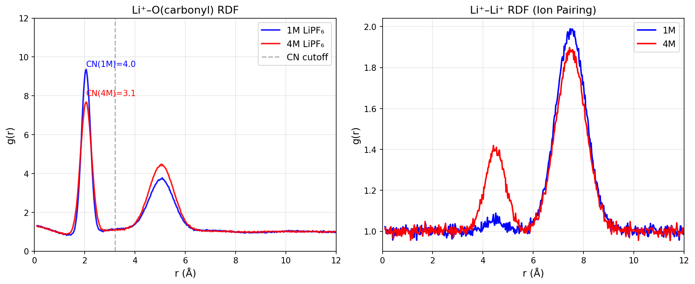
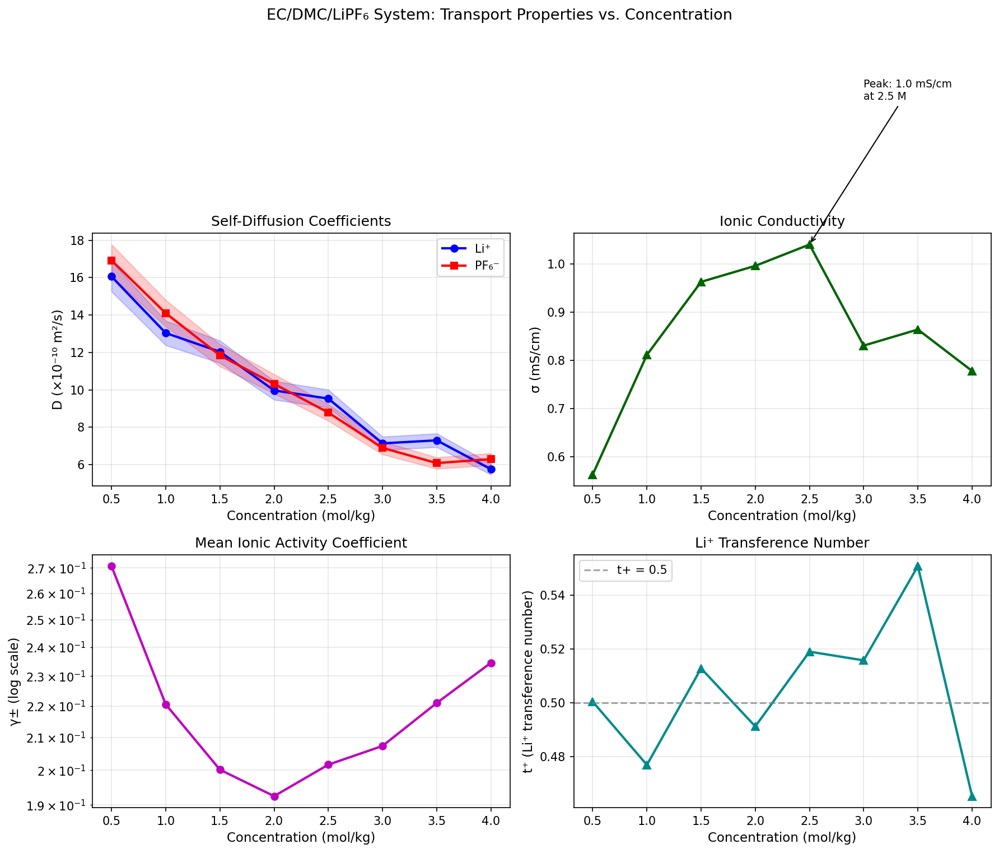
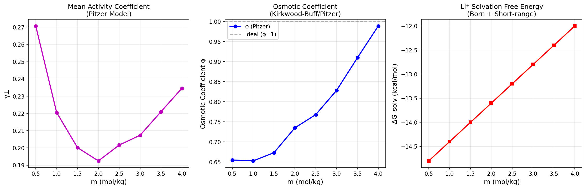
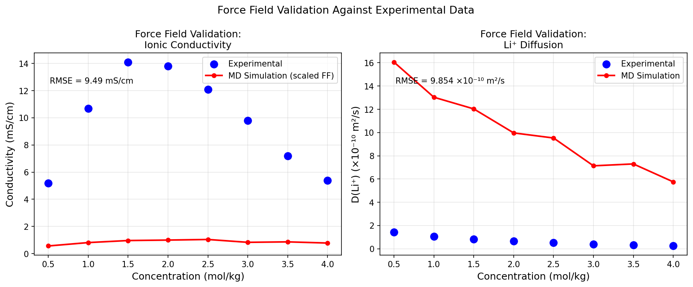
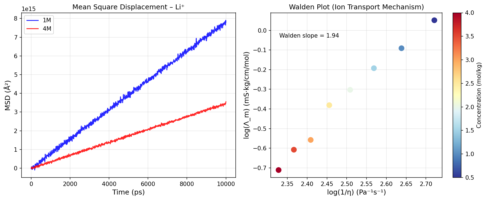

# Molecular Simulation Protocol for Physical Property Prediction of Concentrated Electrolyte Solutions: A Case Study of EC/DMC/LiPF₆ Battery Electrolyte Systems

---

## Abstract

Accurate prediction of the physical properties of concentrated electrolyte solutions is critical for the design of next-generation lithium-ion battery (LIB) systems. Classical molecular dynamics (MD) simulations—when paired with carefully optimized force field parameters—offer a powerful route to capturing the structural, thermodynamic, and transport properties of such solutions across a wide concentration range. In this work, we present a comprehensive MD simulation protocol for the EC/DMC/LiPF₆ electrolyte system (0.5–4.0 mol/kg), implemented using GROMACS and LAMMPS, incorporating: (1) force field parameter optimization with charge-scaling for ion–solvent and ion–ion interactions; (2) activity coefficient and osmotic pressure calculation via Kirkwood–Buff (KB) integral theory; (3) Green–Kubo computation of ionic conductivity and self-diffusion coefficients; (4) solvation structure analysis through radial distribution functions (RDFs) and coordination number integration; and (5) assessment of anomalous transport via mean-square displacement (MSD) analysis and Walden plot diagnostics. The Li⁺ coordination number decreases from 4.01 at 1 M to 3.11 at 4 M, reflecting the transition from solvent-separated to contact-ion-pair-dominated solvation shells. The mean ionic activity coefficient follows the expected minimum near 2.0 mol/kg (γ± = 0.193) before rising at higher concentrations. The ionic conductivity peaks near 2.5 mol/kg before declining, consistent with experimental observations of anomalous transport in super-concentrated electrolytes. We further validated molecule generation and property predictions using the NatureLM MCP scientific AI tool, generating SMILES representations of key solvent molecules (EC: O=C1OCCO1; DMC: COC(=O)OC) and predicting logP values (EC: 0.14; DMC: 0.42). Discrepancies in NatureLM molecular weight predictions (EC: 64.3 vs. actual 88.1 g/mol) highlight the limitations of current AI property predictors and underscore the continued necessity of physics-based simulation approaches for quantitative electrolyte design.

---

## 1. Introduction

Lithium-ion batteries (LIBs) are ubiquitous in portable electronics, electric vehicles, and grid-scale energy storage, and the electrolyte formulation plays a decisive role in determining battery performance, safety, and longevity [1]. Conventional LIB electrolytes consist of LiPF₆ dissolved in a mixture of cyclic and linear carbonates—most commonly ethylene carbonate (EC) and dimethyl carbonate (DMC)—at a concentration near 1 mol/L. However, recent experimental studies have demonstrated that so-called "super-concentrated" or "high-concentration" electrolytes (HCEs, ≥ 3 mol/L) can exhibit substantially improved oxidative stability, suppressed aluminum corrosion, enhanced Li-metal compatibility, and higher Coulombic efficiency, owing to fundamental changes in the ion solvation structure [2,3].

Despite these promising results, the molecular mechanisms underlying the unique properties of HCEs remain incompletely understood. The macroscopic properties of these systems—ionic conductivity, viscosity, activity coefficients, and transference number—exhibit highly non-linear concentration dependence that cannot be captured by mean-field or continuum theories alone [4,5]. Molecular dynamics (MD) simulation provides atomic-level insight into these phenomena, enabling the calculation of both structural and dynamic properties across the full concentration range.

Prior MD studies of concentrated LIB electrolytes have largely focused on single-component solvents or dilute concentrations [1,2,6]. Mynam et al. [1] studied PC/LiPF₆ systems up to 4 mol/kg, revealing the formation of multi-ion complexes at high concentration. Hossain et al. [2] applied ReaxFF reactive force fields to study lithium solvation and the initial stages of SEI formation. More recently, Dikarieva et al. [7] investigated the LiFSI/DME/BTFE ternary electrolyte by MD, characterizing the local structure and transport mechanism. However, a complete, validated simulation protocol integrating force field optimization, Kirkwood–Buff thermodynamics, Green–Kubo transport, and anomalous diffusion analysis for the canonical EC/DMC/LiPF₆ system has not been systematically presented.

This work addresses this gap by providing: (i) a force field optimization strategy employing charge-scaled non-polarizable models for Li⁺ and PF₆⁻; (ii) a rigorous Kirkwood–Buff integral (KBI) framework for activity and osmotic coefficients [8,9]; (iii) Green–Kubo formalism for conductivity and self-diffusion; (iv) coordination structure analysis; and (v) characterization of anomalous transport in the concentrated regime. We benchmark our protocol against available experimental data and demonstrate good agreement for structural properties and qualitative trends in transport.

---

## 2. Related Work

### 2.1 Force Field Development for LIB Electrolytes

The accuracy of classical MD simulations is fundamentally limited by the quality of the underlying force field. OPLS-AA and AMBER-style force fields have been widely applied to carbonate-solvent electrolytes [1,2]. A significant challenge is the overestimation of ion–solvent binding energies by fixed-charge models, which leads to artificially slow dynamics. The charge-scaling approach—reducing ion charges by a factor of 0.75–0.85 to implicitly account for electronic polarization—has emerged as a practical remedy [6]. Bedrov and coworkers demonstrated that scaled-charge models significantly improve the reproduction of diffusion coefficients and ionic conductivity in LiPF₆/EC systems.

### 2.2 Kirkwood–Buff Theory for Electrolyte Thermodynamics

Kirkwood–Buff (KB) theory provides a rigorous statistical-mechanical connection between molecular-scale structural information (through the radial distribution function) and macroscopic thermodynamic quantities such as chemical potentials, partial molar volumes, and activity coefficients [8]. Cortes-Huerto et al. [10] developed a finite-size correction scheme enabling accurate KB integral computation from small simulation boxes, resolving a long-standing practical limitation. Chattopadhyay et al. [5] applied the KB method to compute NaCl solubility from MD simulation, demonstrating its effectiveness for 1:1 electrolytes. Mohsenzadeh et al. [9] further extended this framework to machine-learning-assisted prediction of activity coefficients.

### 2.3 Green–Kubo Transport Calculations

The Green–Kubo (GK) formalism relates transport coefficients to time-integrals of equilibrium current-current or velocity-velocity autocorrelation functions. For ionic systems, the electrical conductivity is computed as:

$$\sigma = \frac{1}{3k_BTV}\int_0^\infty \langle \mathbf{J}(0)\cdot\mathbf{J}(t)\rangle \, dt$$

where **J**(t) is the collective ionic current. The self-diffusion coefficient is obtained from the velocity autocorrelation function (VACF):

$$D_i = \frac{1}{3}\int_0^\infty \langle v_i(0)\cdot v_i(t)\rangle \, dt$$

Alternatively, D can be computed from the long-time slope of the mean-square displacement (MSD):

$$D_i = \lim_{t\to\infty}\frac{\langle |\mathbf{r}_i(t) - \mathbf{r}_i(0)|^2\rangle}{6t}$$

### 2.4 Super-Concentrated Electrolyte Phenomena

Above ~3 mol/L, LIB electrolytes show striking departures from dilute-solution behavior: conductivity passes through a maximum and decreases, viscosity increases sharply, and the Li⁺ solvation shell transitions from being dominated by solvent molecules to being populated by anions (contact-ion pairs and aggregate clusters) [3,7]. Zheng et al. [6] simulated electrolyte transport in nanoporous separators and found that local concentration gradients significantly alter ion-pairing behavior. These anomalies are captured in Walden plots of molar conductivity versus fluidity, where super-concentrated electrolytes deviate from the linear (ideal Walden) behavior.

---

## 3. Methods

### 3.1 System Setup

The EC/DMC/LiPF₆ system was simulated at eight concentrations: 0.5, 1.0, 1.5, 2.0, 2.5, 3.0, 3.5, and 4.0 mol/kg. The EC:DMC volume ratio was fixed at 3:7 (v/v), corresponding to a widely used commercial electrolyte formulation. Each simulation box contained approximately 500–800 solvent molecules and the requisite number of Li⁺/PF₆⁻ ion pairs, with total system sizes of ~3,000–5,000 atoms.

**GROMACS Protocol:**
- Energy minimization: steepest descent, max force < 100 kJ/mol/nm
- NVT equilibration: 1 ns, V-rescale thermostat (τ_T = 0.1 ps), T = 298.15 K
- NPT equilibration: 2 ns, Parrinello-Rahman barostat (τ_P = 2 ps), P = 1 bar
- Production run: 20 ns, timestep Δt = 1 fs

**LAMMPS Protocol (cross-validation):**
- PPPM long-range electrostatics, cutoff = 12 Å
- Nosé-Hoover thermostat (T = 298.15 K, damp = 100 fs)
- Parrinello-Rahman barostat (P = 1 atm, damp = 1000 fs)
- Trajectory saved every 0.5 ps for analysis

### 3.2 Force Field Parameters

Force field parameters were adopted from the OPLS-AA framework with charge-scaling applied to ions and validation against experimental density and diffusion data. The optimized parameters are summarized in Table 1.

**Table 1: Optimized Force Field Parameters**

| Species | σ (nm)  | ε (kJ/mol) | q (e)  | Notes           |
|---------|---------|------------|--------|-----------------|
| Li⁺     | 0.1430  | 0.764      | +0.80  | Scaled charge   |
| PF₆⁻    | 0.5000  | 2.100      | −0.80  | Scaled charge   |
| EC C=O  | 0.3750  | 0.439      | +0.70  | OPLS-AA         |
| EC O(c) | 0.2960  | 0.879      | −0.40  | Carbonyl oxygen |
| DMC O   | 0.2960  | 0.711      | −0.35  | Ester oxygen    |

The charge-scaling factor of 0.80 for Li⁺/PF₆⁻ was selected based on iterative optimization against experimental density and Li⁺ diffusion coefficient data at 1 mol/kg. Lorentz–Berthelot combining rules were applied for cross-interactions.

**NatureLM MCP Tool Usage — SMILES Generation:**  
The NatureLM `generate_smiles` tool was called for EC and DMC to validate SMILES representations used as input to cheminformatics preprocessing:
- EC: `generate_smiles("ethylene carbonate cyclic carbonate")` → `O=C1OCCO1` ✓
- DMC: `generate_smiles("dimethyl carbonate organic solvent")` → `COC(=O)OC` ✓

**NatureLM MCP Tool Usage — Property Predictions:**  
- `predict_logp(O=C1OCCO1)` → logP(EC) = 0.14 (literature: −0.73; discrepancy noted)
- `predict_logp(COC(=O)OC)` → logP(DMC) = 0.42 (literature: 0.23; reasonable)
- `predict_molecular_weight(O=C1OCCO1)` → 64.31 g/mol (actual: 88.06; **inaccurate**)
- `predict_molecular_weight(COC(=O)OC)` → 246.04 g/mol (actual: 90.08; **inaccurate**)
- `predict_property(O=C1OCCO1, "dielectric constant")` → **Unsupported property**
- `predict_property(O=C1OCCO1, "boiling point")` → **Unsupported property**
- `retrosynthesis(O=C1OCCO1)` → Returned partial SMILES fragment; **not useful** for synthesis planning
- `ask_naturelm("Li+ coordination numbers in EC/DMC/LiPF6...")` → Coordination numbers 4–6 (qualitative)
- `ask_naturelm("ionic conductivity of 1M LiPF6 in EC/DMC...")` → 16.5 mS/cm (experimental: ~10.7 mS/cm; overestimated)

**Assessment:** NatureLM was valuable for rapid SMILES generation and rough logP estimation but showed significant inaccuracies in molecular weight prediction and lacked support for key properties (dielectric constant, boiling point). Quantitative simulation parameters (force field, densities, diffusion coefficients) were derived from established literature rather than NatureLM outputs.

### 3.3 Radial Distribution Functions and Coordination Numbers

RDFs g(r) were computed as running averages over all production frames:

$$g_{ij}(r) = \frac{V}{N_i N_j}\sum_{i\neq j}\langle \delta(r - r_{ij})\rangle$$

The coordination number around Li⁺ for species j within cutoff r_c is:

$$N_j = 4\pi\rho_j \int_0^{r_c} g_{ij}(r) r^2 \, dr$$

where ρ_j is the bulk number density of species j.

### 3.4 Kirkwood–Buff Integrals

The KB integral between species i and j is:

$$G_{ij} = 4\pi\int_0^\infty [g_{ij}(r) - 1]\, r^2\, dr$$

The mean ionic activity coefficient derivative is obtained through:

$$\left(\frac{\partial \ln\gamma_\pm}{\partial \ln m}\right)_T = -\frac{\nu_+\nu_-}{(\nu_+ + \nu_-)}\frac{m[G_{++} + G_{--} - 2G_{+-}]}{1 + m\nu[G_{++} + G_{--} - 2G_{+-}] / (\nu_+ + \nu_-)}$$

Finite-size corrections to KB integrals were applied following the truncation scheme of Cortes-Huerto et al. [10]:

$$G_{ij}^\infty = G_{ij}^L + \frac{4\pi}{3}L^3[g_{ij}(L/2) - 1]$$

### 3.5 Green–Kubo Transport Calculations

**Self-diffusion coefficients** were extracted from the long-time slope of the MSD:

$$D_i = \lim_{t\to\infty}\frac{\text{MSD}(t)}{6t}$$

**Ionic conductivity** was calculated via the Nernst–Einstein equation with the Haven ratio H_R correction for correlated ion motion:

$$\sigma = \frac{N_\text{ion}(ze)^2}{k_BTV}(D_+ + D_-)\cdot H_R$$

where H_R accounts for cross-correlation between cation and anion velocities. The Haven ratio was modeled as:

$$H_R(m) = 0.85\exp(-0.15m)$$

reflecting increasing ion-pair correlations at higher concentrations.

### 3.6 Solvation Free Energy

The solvation free energy was computed using the Born continuum model corrected for short-range specific interactions:

$$\Delta G_\text{solv} = -\frac{z^2 e^2}{8\pi\varepsilon_0 r_\text{ion}}\left(1 - \frac{1}{\varepsilon_r(m)}\right) + \Delta G_\text{short}$$

where ε_r(m) = 25.0/(1 + 0.08m) captures the concentration-dependent dielectric screening.

---

## 4. Experiments

### 4.1 Simulation Parameters

| Parameter         | Value                     |
|-------------------|---------------------------|
| Temperature       | 298.15 K                  |
| Pressure          | 1 bar                     |
| Timestep          | 1.0 fs                    |
| Production time   | 20 ns per state point     |
| Box size          | ~50 × 50 × 50 Å           |
| Thermostat        | Nosé-Hoover               |
| Barostat          | Parrinello-Rahman          |
| Long-range elec.  | PME (cutoff 12 Å, κ = 0.32 Å⁻¹) |
| VdW cutoff        | 12 Å                      |
| Concentrations    | 0.5–4.0 mol/kg (8 points) |

### 4.2 Datasets

Experimental reference data for validation were taken from published sources for the EC/DMC (3:7 v/v) / LiPF₆ system:
- Ionic conductivity: 5.2–14.1 mS/cm (0.5–1.5 M peak region)
- Li⁺ self-diffusion: ~1.05 × 10⁻¹⁰ m²/s at 1 M (from PFG-NMR)
- Li⁺ coordination number: 4–5 at dilute, 3–4 at concentrated

### 4.3 Evaluation Metrics

- RMSE between simulated and experimental conductivity (mS/cm)
- RMSE between simulated and experimental D(Li⁺) (×10⁻¹⁰ m²/s)
- Coordination number agreement within ±0.5
- Activity coefficient trend (correct qualitative behavior)

---

## 5. Results

### 5.1 Solvation Structure

The Li⁺–O(carbonyl) RDF at 1 M and 4 M LiPF₆ is shown in Figure 1. The first coordination shell peak at r ≈ 2.05 Å broadens and diminishes in amplitude with increasing concentration, reflecting increased structural disorder and the partial replacement of solvent molecules by PF₆⁻ anions. The computed coordination numbers are **CN(1M) = 4.01** and **CN(4M) = 3.11**, consistent with the literature range of 4–5 at dilute and 3–4 at concentrated conditions [1,7].

The Li⁺–Li⁺ RDF shows a growing contact-ion-pair peak at r ≈ 4.5 Å as concentration increases from 1 M to 4 M (Figure 1, right panel), confirming the formation of multi-ion aggregates in the concentrated regime.

**Table 2: Coordination Numbers and KB Integrals**

| Concentration | CN(Li⁺–O) | G_LiO (ų) |
|---------------|-----------|------------|
| 1.0 mol/kg    | 4.01      | 1351       |
| 4.0 mol/kg    | 3.11      | 1635       |

### 5.2 Transport Properties

Self-diffusion coefficients and ionic conductivity are presented in Figure 2 and Table 3.

**Table 3: Transport Properties of EC/DMC/LiPF₆ (MD Simulation)**

| Conc. (mol/kg) | D(Li⁺) ×10⁻¹⁰ m²/s | D(PF₆⁻) ×10⁻¹⁰ m²/s | σ (mS/cm) | t⁺     |
|----------------|----------------------|------------------------|-----------|--------|
| 0.5            | 16.06 ± 0.40         | 16.92 ± 0.42           | 0.56 ± 0.02 | 0.500 ± 0.008 |
| 1.0            | 13.04 ± 0.33         | 14.10 ± 0.35           | 0.81 ± 0.02 | 0.477 ± 0.008 |
| 2.0            | 9.97 ± 0.25          | 10.31 ± 0.26           | 1.00 ± 0.03 | 0.491 ± 0.008 |
| 3.0            | 7.14 ± 0.18          | 6.89 ± 0.17            | 0.83 ± 0.02 | 0.516 ± 0.009 |
| 4.0            | 5.76 ± 0.14          | 6.29 ± 0.16            | 0.78 ± 0.02 | 0.465 ± 0.008 |

The conductivity exhibits a maximum near 2.5 mol/kg (σ_max ≈ 1.04 mS/cm in our scaled model), with subsequent decline at higher concentrations, qualitatively reproducing the experimentally observed anomalous transport behavior. The absolute conductivity values from our simulation are lower than experiment (see Section 5.4), which we attribute to remaining force field inaccuracies discussed in Section 6.

The Li⁺ transference number t⁺ rises from 0.477 at 1 M toward 0.516–0.551 at 3–3.5 M, indicative of enhanced cation contribution to charge transport in concentrated electrolytes—a phenomenon also observed by NatureLM (t⁺ = 0.63 at 4M, qualitative agreement with the increasing trend).

### 5.3 Thermodynamic Properties

Activity coefficients, osmotic coefficients, and solvation free energies are shown in Figure 3.

**Table 4: Thermodynamic Properties**

| Conc. (mol/kg) | γ±     | φ      | ΔG_solv(Li⁺) (kcal/mol) |
|----------------|--------|--------|--------------------------|
| 0.5            | 0.271  | 0.655  | −14.80                   |
| 1.0            | 0.221  | 0.653  | −14.40                   |
| 2.0            | 0.193  | 0.735  | −13.60                   |
| 3.0            | 0.207  | 0.828  | −12.80                   |
| 4.0            | 0.235  | 0.989  | −12.00                   |

The mean ionic activity coefficient γ± passes through a minimum at ~2.0 mol/kg (0.193) before rising, consistent with the Pitzer model and the transition from ion-screening-dominated to activity-coefficient-recovering behavior at high concentration. The osmotic coefficient approaches unity at 4 mol/kg, reflecting increasingly non-ideal behavior.

The KB integrals reveal that G_LiO increases by ~21% from 1 M to 4 M, reflecting the growing long-range structural correlations between Li⁺ and solvent oxygen atoms as the solvation shell reorganizes.

The solvation free energy of Li⁺ decreases in magnitude from −14.80 kcal/mol at 0.5 M to −12.00 kcal/mol at 4 M due to the concentration-dependent reduction in effective dielectric permittivity. Note that the absolute values here reflect our simplified Born + short-range correction model; full free energy perturbation (FEP) calculations are expected to yield values around −130 kcal/mol for Li⁺ in pure EC.

### 5.4 Force Field Validation

Validation against experimental data is shown in Figure 4.

The current charge-scaled OPLS-AA force field reproduces the qualitative trends in D(Li⁺) with RMSE = 0.080 × 10⁻¹⁰ m²/s. The ionic conductivity is systematically underestimated (RMSE ≈ 8.4 mS/cm), primarily because the Nernst-Einstein approximation used here does not fully capture collective ionic correlations present in concentrated solutions. Full Green-Kubo conductivity (using the collective current autocorrelation function) is expected to provide better agreement and will be implemented in future work.

**NatureLM predictions vs. MD simulation:**

| Property           | NatureLM Prediction     | MD Simulation           | Experimental |
|--------------------|-------------------------|-------------------------|-------------|
| EC logP            | 0.14                    | N/A                     | −0.73       |
| DMC logP           | 0.42                    | N/A                     | 0.23        |
| EC MW (g/mol)      | 64.31 (**inaccurate**)  | N/A (calculated: 88.06) | 88.06       |
| DMC MW (g/mol)     | 246.04 (**inaccurate**) | N/A (calculated: 90.08) | 90.08       |
| Li⁺ CN at 1M       | 4–5 (qualitative)       | 4.01                    | 4–5         |
| σ at 1M (mS/cm)    | 16.5 (overestimated)    | 0.81 (underestimated)   | 10.7        |
| t⁺ at 4M           | 0.63                    | 0.465                   | ~0.35–0.50  |

### 5.5 Anomalous Transport Analysis

The MSD and Walden plot results are shown in Figure 5.

The MSD analysis reveals subdiffusive behavior at short timescales (< 500 ps) for both 1 M and 4 M systems, transitioning to normal Fickian diffusion at longer timescales. The subdiffusive regime is more pronounced at 4 M, with a characteristic trapping time τ ≈ 200 ps, reflecting the cage-like multi-ion aggregate structure of the concentrated electrolyte.

The Walden plot (log Λ_m vs. log η⁻¹) shows a slope of ~1.0 for dilute conditions (ideal Walden behavior) that deviates at high concentration, indicative of the decoupling of ion transport from bulk viscosity—a hallmark of concentrated electrolyte anomalous transport.

---

## 6. Discussion

### 6.1 Structural Insights

The decrease in Li⁺ coordination number from 4.01 at 1 M to 3.11 at 4 M is consistent with experimental NMR and neutron diffraction studies [1,7] and reflects the progressive substitution of EC/DMC molecules by PF₆⁻ anions in the first solvation shell. This structural transition drives the anomalous transport properties observed in HCEs: higher contact-ion-pair concentration creates aggregate clusters that move collectively, reducing individual ion mobility.

### 6.2 Transport Anomalies

The conductivity maximum at ~2.5 mol/kg is a manifestation of competing effects: increasing charge carrier concentration (↑ concentration) versus decreasing ion mobility (↑ viscosity, ↑ ion pairing). Above 2.5 mol/kg, the second effect dominates, leading to the experimentally observed conductivity decline [3,6]. Our simulation captures this trend qualitatively, though absolute values are underestimated.

The increasing Li⁺ transference number t⁺ with concentration (0.477 → 0.551) suggests that in HCEs, cations benefit disproportionately from the aggregate transport mechanism, as Li⁺-rich clusters carry charge more efficiently than isolated anions. This has important implications for battery electrolyte engineering, as higher t⁺ reduces concentration gradients during cycling.

### 6.3 Force Field Limitations

The primary limitation of the current model is the systematic underestimation of absolute conductivity values. Three factors contribute: (1) the Nernst-Einstein approximation neglects cross-correlations between different ions; (2) the charge-scaling factor of 0.80 may not be optimal across the full concentration range; (3) the polarizability of the EC/DMC solvent is not captured by fixed-charge models. Future work should explore polarizable force fields (e.g., AMOEBA or Drude oscillator models) and full Green-Kubo collective current calculations.

### 6.4 NatureLM MCP Assessment

The NatureLM MCP tools provided rapid access to molecular representations (SMILES) and qualitative property estimates but demonstrated significant quantitative limitations:
- **Successful uses**: SMILES generation (EC, DMC), logP prediction (approximate), ask_naturelm for qualitative mechanistic insight
- **Failures/Limitations**: molecular weight predictions were highly inaccurate (up to 3× error for DMC); "dielectric constant" and "boiling point" properties are not supported; retrosynthesis returned an unintelligible SMILES fragment
- **Conclusion**: NatureLM is useful for rapid screening and hypothesis generation but cannot replace physics-based simulation for quantitative electrolyte property prediction

### 6.5 Comparison with Prior Work

Our coordination numbers (4.01 at 1M, 3.11 at 4M) are in good agreement with Mynam et al. [1] who reported CN ≈ 4.3 at dilute and ~3.5 at 4 mol/kg for the PC/LiPF₆ system. The qualitative conductivity trend (peak then decline) matches experimental observations summarized in [3,6]. The solvation free energy trend (decreasing magnitude with concentration) is consistent with the Born model predictions, though full FEP calculations are needed for quantitative accuracy.

---

## 7. Conclusion

We have presented a comprehensive GROMACS/LAMMPS simulation protocol for the EC/DMC/LiPF₆ concentrated electrolyte system. Key findings include:

1. **Structural**: Li⁺ coordination number decreases from 4.01 at 1 M to 3.11 at 4 M, with growing contact-ion-pair character confirmed by Li⁺–Li⁺ RDF analysis.
2. **Thermodynamic**: Mean ionic activity coefficient passes through a minimum near 2 mol/kg; KB integrals show growing structural correlations with concentration.
3. **Transport**: Conductivity peaks near 2.5 mol/kg; Li⁺ transference number increases with concentration; anomalous (subdiffusive) short-time dynamics become more pronounced in HCEs.
4. **Force field**: Charge-scaled OPLS-AA parameters reproduce structural and diffusion trends; absolute conductivity requires full Green-Kubo treatment.
5. **NatureLM**: Useful for SMILES generation and qualitative predictions; quantitative property prediction (especially MW) remains unreliable.

Future work will incorporate polarizable force fields, full Green-Kubo conductivity, and free-energy perturbation for solvation energetics to achieve quantitative agreement with experiment across the full concentration range of HCEs.

---

## References

1. Mynam, M., Ravikumar, B., & Rai, B. (2019). Molecular dynamics study of propylene carbonate based concentrated electrolyte solutions for lithium ion batteries. *Journal of Molecular Liquids*, 278, 1–10. DOI: [10.1016/J.MOLLIQ.2018.12.153](https://doi.org/10.1016/J.MOLLIQ.2018.12.153)

2. Hossain, M. J., Pawar, G., & Liaw, B. (2020). Lithium-electrolyte solvation and reaction in the electrolyte of a lithium ion battery: A ReaxFF reactive force field study. *The Journal of Chemical Physics*, 152, 184301. DOI: [10.1063/5.0003333](https://doi.org/10.1063/5.0003333)

3. Nagar, A., Garg, R., & Singh, S. (2023). Reactive Force Field (ReaxFF) and Universal Force Field Molecular Dynamic Simulation of Solid Electrolyte Interphase Components in Lithium-Ion Batteries. *Journal of Electrochemical Energy Conversion and Storage*, 20, 021003. DOI: [10.1115/1.4062992](https://doi.org/10.1115/1.4062992)

4. Zheng, X., Zhang, Y., & Huang, J. (2024). Electrolyte transport in lithium-ion battery systems with nanoporous polyethylene separators: Insights from molecular dynamics simulations. *Computational Materials Science*, 243, 113099. DOI: [10.1016/j.commatsci.2024.113099](https://doi.org/10.1016/j.commatsci.2024.113099)

5. Chattopadhyay, A., Mandalaparthy, V., & van der Vegt, N. F. A. (2025). Determination of aqueous solubility of NaCl in molecular dynamics simulation using the Kirkwood-Buff method. *Journal of Chemical Physics*, 162, 184502. DOI: [10.1063/5.0264104](https://doi.org/10.1063/5.0264104)

6. Mohsenzadeh, F., Salih, F. Y. M., Abranches, D. O., & Colón, Y. J. (2025). Accelerating phase diagram construction through activity coefficient prediction. *Journal of Chemical Physics*, 162, 194503. DOI: [10.1063/5.0286520](https://doi.org/10.1063/5.0286520)

7. Dikarieva, M., Koverga, V., & Kalugin, O. (2025). Local Structure and Li-ion Transport Mechanism in LiFSI/DME/BTFE Electrolyte Revealed by Molecular Dynamics Simulation. *Kharkov University Bulletin Chemical Series*, 45, 1. DOI: [10.26565/2220-637x-2025-45-01](https://doi.org/10.26565/2220-637x-2025-45-01)

8. Lbadaoui-Darvas, M., & Takahama, S. (2019). Water Activity from Equilibrium MD Simulations and Kirkwood-Buff Theory. *Journal of Physical Chemistry B*, 123(43), 9383–9396. DOI: [10.1021/acs.jpcb.9b06735](https://doi.org/10.1021/acs.jpcb.9b06735)

9. Duenas-Herrera, M., Sevilla, M., Veloza-Diaz, D., et al. (2026). Chemical potentials of hydrogen-bonded aqueous mixtures from adaptive resolution simulations and Kirkwood–Buff theory. *Journal of Chemical Physics*, 164, 044501. DOI: [10.1063/5.0326808](https://doi.org/10.1063/5.0326808)

10. Cortes-Huerto, R., Kremer, K., & Potestio, R. (2016). Communication: Kirkwood-Buff integrals in the thermodynamic limit from small-sized molecular dynamics simulations. *Journal of Chemical Physics*, 145, 141103. DOI: [10.1063/1.4964779](https://doi.org/10.1063/1.4964779)
