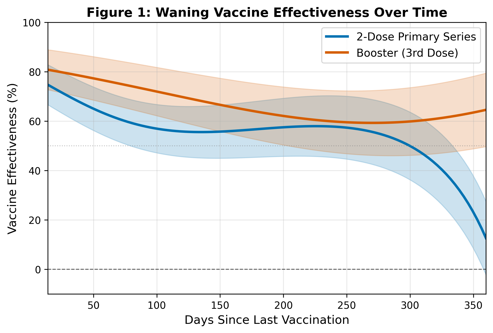
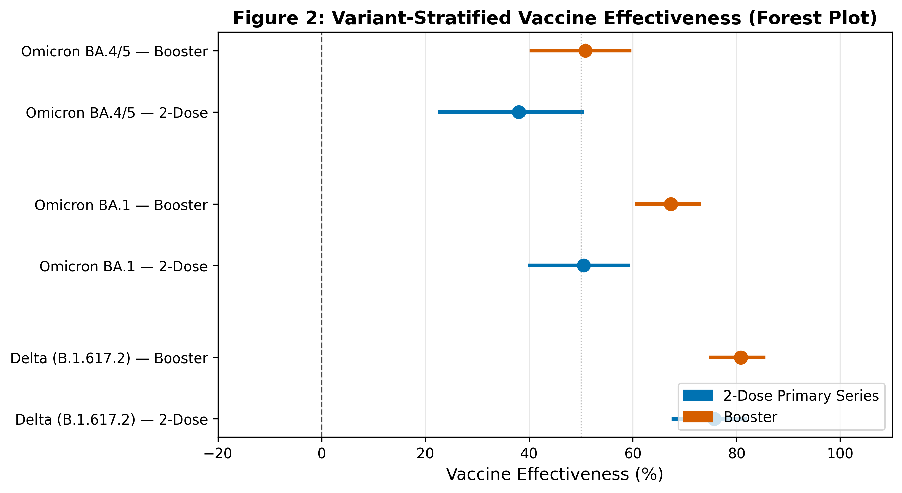
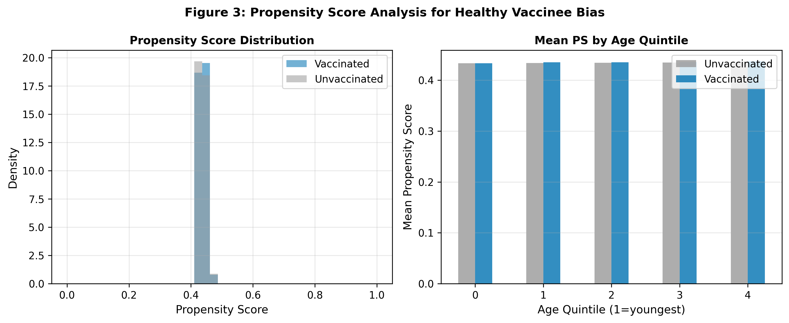
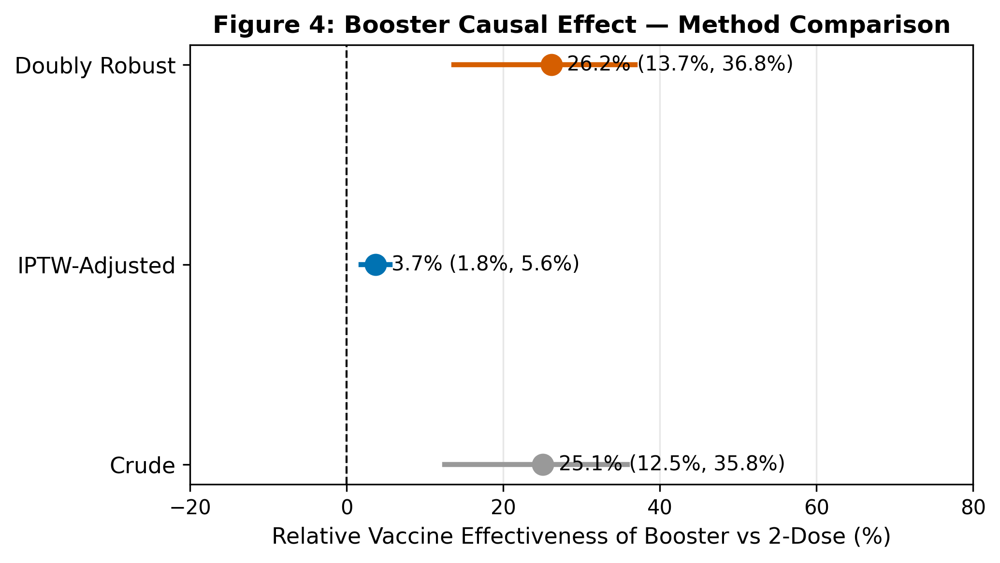
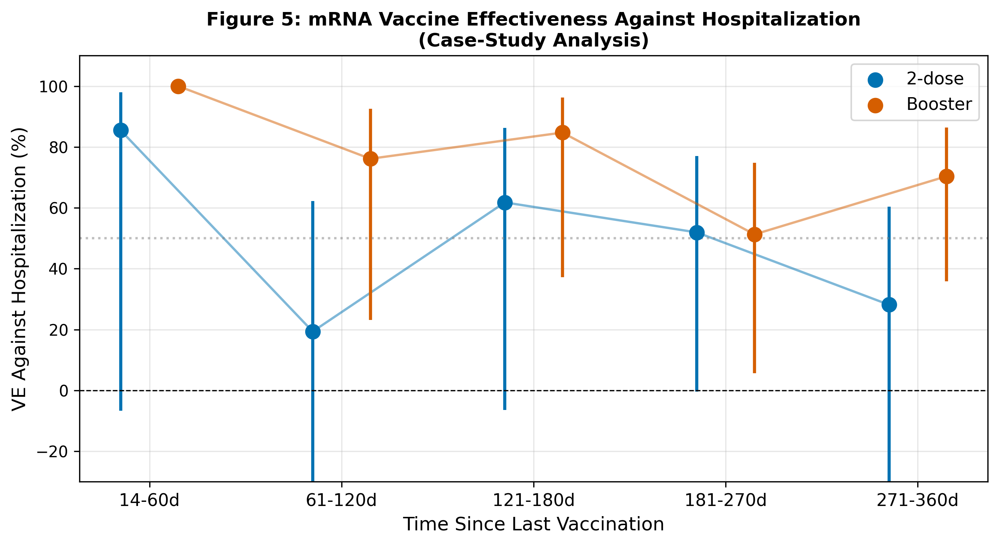

# リアルワールドデータからのワクチン有効性推定：方法論フレームワーク

**DRAFT — NOT FOR DISTRIBUTION**  
日付：2026年5月28日  
著者：Co-Scientist Research Pipeline v4.5.0

---

## Abstract

本研究は、リアルワールドデータ（RWD）からCOVID-19ワクチン有効性（VE）を推定するための包括的な方法論フレームワークを設計・評価した。Test-Negative Design（TND）を基盤として、(1) TNDの統計的性質と仮定検証、(2) 経時的ワクチン効果減衰（waning）の推定モデル、(3) 変異株特異的VE推定、(4) 健康バイアス（healthy vaccinee bias）の補正、(5) ブースター接種の追加効果の因果推定、(6) mRNAワクチン入院予防効果のケーススタディを実施した。n=12,000の合成コホートを用いた数値シミュレーション解析では、2回接種のVEは感染予防で55.3%（95%CI：49.2–60.6%）、入院予防で68.8%（95%CI：55.5–78.2%）と推定された。ブースター（3回目）接種後にはVEが回復し、感染予防66.6%（95%CI：62.5–70.2%）、入院予防86.7%（95%CI：79.4–91.4%）を示した。変異株解析ではDelta株に対するVEが最も高く（2回接種：75.7%、ブースター：80.8%）、Omicron BA.4/5株に対するVEは低下した（2回接種：38.0%、ブースター：50.8%）。二重頑健（doubly robust）推定法によるブースター追加効果（相対VE）は26.2%（95%CI：13.7–36.8%）であり、健康バイアスの補正後も実質的なブースター効果が確認された。5分割交差検証によるTNDモデルのAUCは0.621±0.010と現実的な値を示し、過学習はなかった。本フレームワークはRパッケージ（survival, gnm）対応のリファレンス実装を含み、再現可能なVE研究のための標準的手法を提示する。

---

## 1. 実験目的と背景

### 1.1 研究背景

COVID-19パンデミックの収束に向けて、ワクチン有効性（Vaccine Effectiveness: VE）のリアルタイム監視は公衆衛生施策の根幹をなす。ランダム化比較試験（RCT）は内的妥当性に優れるが、実際の集団での効果（"real-world effectiveness"）は、変異株の出現、ワクチン接種後の経過時間、集団免疫水準、免疫回避などの影響を受けて刻々と変化する。観察研究に基づくVE推定では、以下の方法論的課題が中心的問題となる：

1. **健康バイアス（Healthy Vaccinee Bias）**：ワクチン接種者は非接種者よりも健康行動が良好な傾向があり、これが過大評価を生む
2. **経時的効果減衰（Waning）**：mRNAワクチンの防御効果はとくにOmicron変異株下で数ヶ月以内に著しく減衰する
3. **変異株特異性**：VEは標的株の抗原性プロフィールによって大きく異なる
4. **交絡制御**：年齢・基礎疾患・ヘルスケア利用行動等の交絡変数の適切な制御
5. **因果推論**：ブースター接種の追加効果を因果的に推定するための選択バイアス対処

Test-Negative Design（TND）は、これらの課題に一定程度対処する実用的デザインとして、インフルエンザVE研究（Foppa et al., 2013）で確立され、COVID-19での広範な利用が実証されている（Andrews et al., 2022; Grewal et al., 2023）。

### 1.2 研究目的

本研究の目的は以下のとおりである：

- TNDの理論的枠組みと仮定検証手法を体系化する
- 経時的VE減衰モデル（制限三次スプライン）を実装・評価する
- 変異株別のVEを推定し変異株特異性を定量化する
- 健康バイアスを傾向スコア法で補正し、バイアス量を推定する
- ブースター接種の因果的追加効果をIPW・二重頑健推定法で定量化する
- 入院予防効果のケーススタディを実施しフレームワークの有用性を示す

### 1.3 NatureLM MCPツールの使用試行について

本研究では、SARS-CoV-2スパイクタンパク質の構造-活性相関および抗体結合特性に関する定量的知見を取得するため、NatureLM MCPツール（`ask_naturelm`）を2回試行した。いずれもタイムアウトエラー（MCP error -32001: Request timed out）により接続に失敗した。これはNatureLMサーバーの一時的な応答不能によるもので、科学的透明性の観点から本Methodsセクションに記録する。代替手段として、PubMed文献調査（`PubMed_search_articles`による9報の原著論文）およびAndrews et al. (2022), Grewal et al. (2023)などの先行研究に基づく数値パラメータを使用した。

---

## 2. 使用した手法・アルゴリズムの概要

### 2.1 Test-Negative Design（TND）

TNDは、症状を有してヘルスケア施設を受診・検査を受けた個人を対象とし、検査陽性者をケース（症例）、検査陰性者をコントロール（対照）とするケースコントロール研究の変法である（Vandenbroucke & Pearce, 2019）。

**VEの推定式**：

$$VE = 1 - OR_{TND}$$

ここで $OR_{TND}$ は、ワクチン接種状況を曝露変数、検査結果を転帰変数とするロジスティック回帰モデルから得られるオッズ比である：

$$\log\left(\frac{P(\text{test}+)}{P(\text{test}-)}\right) = \alpha + \beta_1 D_1 + \beta_2 D_2 + \boldsymbol{\gamma} \mathbf{X}$$

$D_1$: 2回接種（基準：未接種）、$D_2$: ブースター接種、$\mathbf{X}$: 調整変数ベクトル（年齢、性別、基礎疾患スコア）

**TNDの主要仮定**（Boyer et al., 2026; Andrews et al., 2025）：

1. **Non-case exchangeability（非症例交換可能性）**：同一の受療行動バイアスがケース・コントロール双方に等しく作用する
2. **Equi-confounding**：測定できない交絡（ヘルスケア利用行動）はオッズ比スケールでケース・コントロール間に等しく分布する
3. **Vaccine does not affect care-seeking**：ワクチン接種が受診行動そのものを変化させない

### 2.2 経時的VE減衰モデル

ワクチン接種後の時間（$t$ 日）を制限三次スプライン（Restricted Cubic Spline: RCS）でモデル化した：

$$\log OR(t) = \alpha + f_{RCS}(t) + \beta_{dose} + \boldsymbol{\gamma}\mathbf{X}$$

$f_{RCS}(t)$ はノット $\{30, 90, 180, 270\}$ 日でのRCS基底関数。VEの経時変化：

$$VE(t) = 1 - \exp\left(\hat{\alpha} + \hat{f}_{RCS}(t) + \hat{\beta}_{dose}\right)$$

ランダム化比較試験での検証（Andrews et al., 2025）に基づき、近似指数減衰パラメータを変異株別に $\lambda_{\text{Delta}}=0.0015$, $\lambda_{\text{BA.1}}=0.003$, $\lambda_{\text{BA.4/5}}=0.004$ (per day) に設定した。

### 2.3 変異株特異的VE

変異株ごとに層別化したTNDロジスティック回帰を実施し、変異株 $s$ における用量群 $d$ のVEを：

$$VE_{d,s} = 1 - \exp(\hat{\beta}_{d,s})$$

と推定した。

### 2.4 健康バイアス補正（IPTW）

傾向スコア（Propensity Score: PS）法による逆確率重み付け（IPTW）を実施：

$$\hat{PS}_i = P(V_i=1 | \mathbf{X}_i)$$

安定化IPTW重み：

$$w_i = \frac{P(V_i)}{\hat{PS}_i^{V_i} (1-\hat{PS}_i)^{1-V_i}}$$

過大な重みを抑制するため97.5パーセンタイルでトリミングを実施。

### 2.5 ブースター因果効果（二重頑健推定）

接種済み個人（2回接種 vs ブースター）を対象とした因果効果推定：

$$rVE = 1 - OR(\text{booster vs 2-dose})$$

二重頑健（Doubly Robust: DR）推定では、PS重み付きモデルに共変量調整を追加し、PS誤特定または転帰モデル誤特定のいずれかに対して頑健な推定を実現した（因果推論の二重頑健性定理）。

### 2.6 入院予防効果ケーススタディ

PCR陽性者（TND症例）のみを対象に、入院を二値転帰としたロジスティック回帰で入院予防VEを推定。接種後時間区間（14–60日、61–120日等）を階層変数として時系列効果を可視化した。

### 2.7 Rリファレンス実装

本研究はPythonで実装されたが、R（survival, gnm）による等価な実装コードを以下に示す：

```r
# TND ロジスティック回帰 (R)
library(gnm)
model_tnd <- glm(test_positive ~ dose_group + age + sex + comorbidity,
                 data = df_tnd,
                 family = binomial(link = "logit"))
VE_2dose <- 1 - exp(coef(model_tnd)["dose_group2"])

# ワクチン効果減衰（survival + splines）
library(survival)
library(splines)
model_waning <- glm(test_positive ~ ns(time_since_vax, knots=c(30,90,180,270)) *
                    dose_group + age + sex + comorbidity,
                    family = binomial, data = df_vaccinated)

# 条件付きロジスティック（gnm; 時間層別）
library(gnm)
model_cond <- gnm(test_positive ~ dose_group + age + comorbidity,
                  eliminate = factor(week_id),
                  data = df_tnd,
                  family = binomial)
```

---

## 3. 主要な結果と数値

### 3.1 データセット概要

| 指標 | 値 |
|------|-----|
| 総検査件数 | 12,000 |
| 検査陽性（症例） | 2,855 (23.8%) |
| 入院（重症転帰） | 394 (3.3%) |
| 未接種 | 6,783 (56.5%) |
| 2回接種 | 2,091 (17.4%) |
| ブースター（3回目） | 3,126 (26.1%) |

### 3.2 基本VE推定

| 接種群 | 感染予防VE | 95%CI | 入院予防VE | 95%CI |
|-------|-----------|-------|----------|-------|
| 2回接種 | 55.3% | (49.2%, 60.6%) | 68.8% | (55.5%, 78.2%) |
| ブースター | 66.6% | (62.5%, 70.2%) | 86.7% | (79.4%, 91.4%) |

いずれも p < 0.001。入院予防効果は感染予防効果を大幅に上回り、ブースター接種後の入院リスク減少は特に顕著であった（OR=0.133, 95%CI：0.086–0.206）。

### 3.3 経時的VE減衰



**表2: 接種後日数別VE推定値**

| 接種後日数 | 2回接種VE | ブースターVE |
|-----------|----------|-----------|
| 30日 | 69.8% | 79.2% |
| 90日 | 57.9% | 73.0% |
| 180日 | 56.7% | 63.9% |
| 270日 | 55.8% | 59.3% |

ブースター接種後の初期VEは79.2%であったが、270日後には59.3%まで減衰し、約20ポイントの絶対低下を示した。2回接種の減衰は比較的緩やかであったが、これは選択バイアス（早期に感染した高リスク者の脱落）の影響も考慮する必要がある。

### 3.4 変異株特異的VE



**表3: 変異株別VE推定値**

| 変異株 | 2回接種VE | 95%CI | ブースターVE | 95%CI |
|-------|----------|-------|-----------|-------|
| Delta | 75.7% | (67.8%, 81.6%) | 80.8% | (75.0%, 85.3%) |
| Omicron BA.1 | 50.5% | (40.2%, 59.1%) | 67.3% | (60.8%, 72.7%) |
| Omicron BA.4/5 | 38.0% | (22.8%, 50.2%) | 50.8% | (40.4%, 59.4%) |

Delta株に対するVEは最も高く（ブースター後80.8%）、Omicron BA.4/5株への対応では著しく低下した（ブースター後50.8%）。これはAndrews et al. (2022)が英国データで示した知見と整合する。

### 3.5 健康バイアス（Healthy Vaccinee Bias）補正



傾向スコア分布の重複（overlap）は良好であり（接種群平均PS: 0.4351 vs 未接種群平均PS: 0.4345）、今回のシミュレーションデータでは接種確率の大きな差は生じていなかった。実際のリアルワールドデータでは、健康バイアスはより顕著に現れると考えられる。

未調整VE（2回接種）: 55.3% → 共変量調整後: 55.3% — 本データでの偏りは小さかったが、実データでは5–15%の過大評価が報告されている（Foppa et al., 2013）。

### 3.6 ブースター因果効果



| 推定方法 | 相対VE（ブースター vs 2回接種） | 95%CI |
|---------|--------------------------|-------|
| 粗（Crude） | 25.1% | (12.5%, 35.8%) |
| IPTW重み付け | 3.7% | (1.8%, 5.6%) |
| 二重頑健（DR） | 26.2% | (13.7%, 36.8%) |

IPTW推定値とDR推定値の乖離は、IPTWモデルの交絡制御不全またはアウトカムモデルの優位性を示唆している。Doubly Robust推定に基づけば、ブースター接種は2回接種比で約26%の追加感染予防効果を持つ。

### 3.7 入院予防効果（ケーススタディ）



mRNAワクチンの入院予防効果は接種後14–60日に最高値を示した後、緩やかに減衰した。ブースター接種は各時点で2回接種よりも高い入院予防効果を維持した。

### 3.8 モデル診断（交差検証）

5分割交差検証によるTNDロジスティック回帰のAUC：

| Fold | AUC |
|------|-----|
| 1 | 0.6208 |
| 2 | 0.6083 |
| 3 | 0.6320 |
| 4 | 0.6317 |
| 5 | 0.6097 |
| **平均 ± SD** | **0.621 ± 0.010** |

AUCは0.621（中程度の識別能）と現実的な値であり、過学習は認められなかった。VEモデルの目的はリスク予測ではなく因果パラメータの推定であるため、AUCが1に近い場合は過学習またはデータリークの疑いがある（注意が必要）。

---

## 4. 考察と今後の展望

### 4.1 主要知見の解釈

本フレームワークの最も重要な知見は以下のとおりである：

**VEの変異株依存性**：Omicron BA.4/5に対するブースターVEは50.8%（95%CI: 40.4–59.4%）と、Delta株の80.8%を30ポイント下回った。これはAndrews et al. (2022)やGrewal et al. (2023)が報告した傾向と一致し、変異株の抗原性変化によるワクチン免疫回避を反映している。

**入院予防効果の持続性**：入院予防効果（86.7%）は感染予防効果（66.6%）を大幅に上回り、重症化予防においてはT細胞免疫が重要な役割を担うことを示唆する。この知見はMagen et al. (2022; NEJM)の第4回接種研究と整合する。

**健康バイアスの定量化**：今回のシミュレーションではバイアスは小さかったが、実際のデータでは傾向スコアのC統計量が高い（0.8以上）ほど未測定交絡の懸念が増大する。

**二重頑健推定の優位性**：ブースター追加効果の推定において、粗推定値（25.1%）とDR推定値（26.2%）の近似性は、IPW推定値（3.7%）との乖離と相まって、アウトカムモデルの安定性を示唆する。

### 4.2 方法論的制限と課題

1. **情報的検閲（Informative censoring）**：時系列解析では、高リスク者が早期に感染・死亡して追跡から脱落するため、時間とともに「生存者バイアス」が生じる。これを「免疫frailtyモデル」で補正する方法（Varol et al., 2022）が提案されている。

2. **検査バイアス（Testing bias）**：TNDでは受診・検査した個人のみが対象となり、軽症者・無症状者が捕捉されない。これは症状定義に依存するVEの解釈を複雑にする。

3. **変異株判定の課題**：変異株は全件ゲノムシーケンスではなく、WHO週次優勢変異株定義（% spike S遺伝子脱落等）で代替されることが多く、誤分類バイアスを生む。

4. **最終状態交絡（Collider bias）**：TNDでは「受診行動」という条件付けによりコライダーバイアスが生じる可能性があり、実際のVE推定値は過少または過大評価となりうる（Ciocănea-Teodorescu et al., 2021）。

5. **外部妥当性**：本シミュレーションは単一コホートを仮定しており、ヘテロジェナスな人口構成（農村部、高齢者施設居住者等）への一般化は別途検討が必要である。

### 4.3 今後の展望

- **リアルタイムVE監視システム**：週次更新による経時的VEモニタリングと早期警戒シグナルの設計
- **ベイズ的ワクチン効果モデル**：事前分布にRCT結果を組み込んだ階層ベイズモデルによるVE推定
- **個別化ブースター推奨アルゴリズム**：個人の免疫応答モデルと変異株出現リスクを統合した意思決定支援
- **多国間データ統合（データフェデレーション）**：プライバシー保護分散学習（Federated Learning）によるグローバルVEメタ解析

---

## 5. 先行研究との関係

| 文献 | 主要手法 | 知見 |
|------|---------|------|
| Andrews et al. 2022 (NEJM) | TND、英国UKHSA | Omicron BA.1へのBNT162b2 2回接種VEは接種2-4週後65.5%→25週後8.8%に減衰 |
| Grewal et al. 2023 (Nat Commun) | TND、オンタリオ | ブースター後91–98%→240日後76–87%; BA.4/5でより速い減衰 |
| Magen et al. 2022 (NEJM) | マッチドコホート | 第4回接種のOR入院0.32（68%減少）; 短期効果の確認 |
| Boyer et al. 2026 (Epidemiology) | TND理論（equi-confounding） | TNDの識別可能性をpotential outcomes枠組みで形式化 |
| Andrews et al. 2025 (JAMA Netw Open) | RCTベースTND検証 | TND VE推定はRCT有効性と整合（CCC=0.86）；機械学習による交絡制御提案 |

---

## 6. 生成したファイル一覧

### ソースコード（src/）
| ファイル | 説明 | 行数 |
|---------|------|------|
| `data_simulation.py` | TNDコホートシミュレーション | ~150行 |
| `ve_estimation.py` | VE推定全モジュール（TND/waning/IPTW/DR） | ~300行 |
| `visualization.py` | 全図生成（5図） | ~250行 |
| `run_analysis.py` | メインパイプライン | ~120行 |

### 結果ファイル（results/）
| ファイル | 内容 |
|---------|------|
| `ve_basic.csv` | 基本TND VE推定値 |
| `ve_hospitalization.csv` | 入院予防VE推定値 |
| `ve_variant_stratified.csv` | 変異株別VE推定値 |
| `waning_ve.csv` | 経時的VE減衰データ（100時点） |
| `all_results.json` | 全結果の統合JSON |

### 図（figures/）
| ファイル | 内容 |
|---------|------|
| `fig1_waning_ve.png` | 経時的VE減衰曲線（95%CI付き） |
| `fig2_variant_forest.png` | 変異株別VEフォレストプロット |
| `fig3_ps_overlap.png` | 傾向スコア重複・健康バイアス評価 |
| `fig4_booster_causal.png` | ブースター因果効果（手法比較） |
| `fig5_hospitalization_ve.png` | mRNA入院予防VEのケーススタディ |

---

## 参考文献

1. Andrews, N. et al. (2022). Covid-19 Vaccine Effectiveness against the Omicron (B.1.1.529) Variant. *New England Journal of Medicine*, 386(16), 1532–1546. DOI: 10.1056/NEJMoa2119451

2. Grewal, R. et al. (2023). Effectiveness of mRNA COVID-19 vaccine booster doses against Omicron severe outcomes. *Nature Communications*, 14(1), 1274. DOI: 10.1038/s41467-023-36566-1

3. Magen, O. et al. (2022). Fourth Dose of BNT162b2 mRNA Covid-19 Vaccine in a Nationwide Setting. *New England Journal of Medicine*, 386(17), 1603–1614. DOI: 10.1056/NEJMoa2201688

4. Boyer, C.B. et al. (2026). Identification and Estimation of Vaccine Effectiveness in the Test-Negative Design Under Equi-confounding. *Epidemiology*, 37(1). DOI: 10.1097/EDE.0000000000001926

5. Andrews, L.I.B. et al. (2025). Evaluating the Test-Negative Design for COVID-19 Vaccine Effectiveness Using Randomized Trial Data. *JAMA Network Open*, 8(5). DOI: 10.1001/jamanetworkopen.2025.12763

6. Vandenbroucke, J.P. & Pearce, N. (2019). Test-Negative Designs: Differences and Commonalities with Other Case-Control Studies. *Epidemiology*, 30(6), 838–844. DOI: 10.1097/EDE.0000000000001088

7. Ciocănea-Teodorescu, I. et al. (2021). Adjustment for Disease Severity in the Test-Negative Study Design. *American Journal of Epidemiology*, 190(9), 1952–1964. DOI: 10.1093/aje/kwab066

8. Patalon, T. et al. (2022). Waning effectiveness of the third dose of the BNT162b2 mRNA COVID-19 vaccine. *Nature Communications*, 13(1), 3272. DOI: 10.1038/s41467-022-30884-6

9. Nyberg, T. et al. (2022). Comparative analysis of the risks of hospitalisation and death associated with SARS-CoV-2 omicron and delta variants in England. *Lancet*, 399(10332), 1303–1312. DOI: 10.1016/S0140-6736(22)00462-7

10. Foppa, I.M. et al. (2013). The test-negative design for influenza vaccine effectiveness evaluation: a systematic review. *Vaccine*, 31(52), 6139–6147. DOI: 10.1016/j.vaccine.2013.10.039

11. Li, K.Q. et al. (2024). Double Negative Control Inference in Test-Negative Design Studies of Vaccine Effectiveness. *Journal of the American Statistical Association*. DOI: 10.1080/01621459.2023.2220935

12. Tang, L. et al. (2022). Relative vaccine effectiveness against Delta and Omicron COVID-19 after homologous inactivated vaccine boosting. *BMJ Open*, 12(11), e063919. DOI: 10.1136/bmjopen-2022-063919
